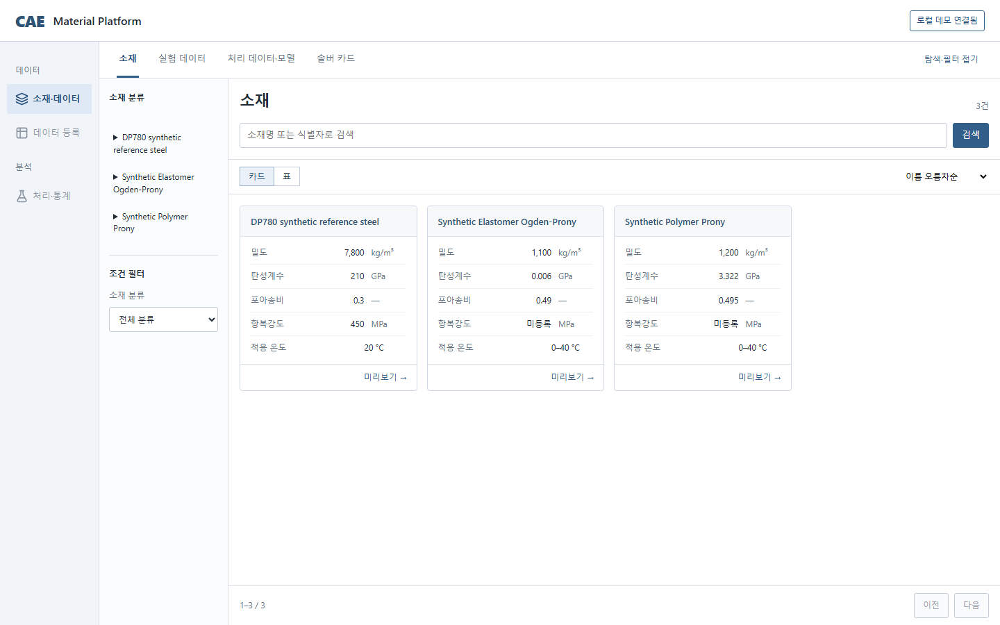
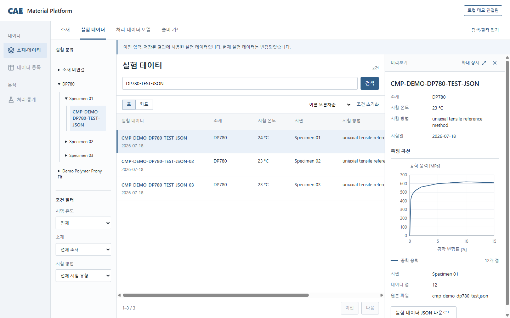
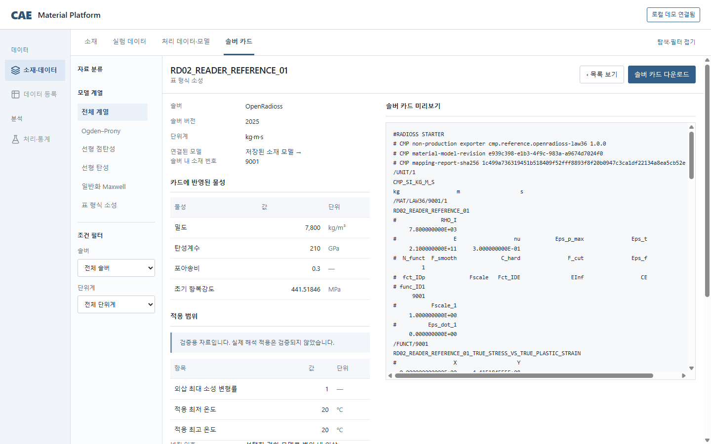

# CAE Material Platform

소재 물성과 실험 곡선을 조회하고, 실험 데이터를 처리해 소재 모델과 솔버 카드를 만드는 공학용 서비스입니다.
기존 카드 조회·다운로드는 데이터 처리나 카드 생성을 다시 수행하지 않고 이용합니다.

현재는 frontend를 개편 중입니다. **새 앱은 조회·다운로드까지 구현했으며, 기존 앱을 아직 일괄 전환하지 않았습니다.**
[PR #398](https://github.com/pikachu444/cae-material-platform/pull/398)에 새 앱과 개편 기준을 제출했습니다.
등록·처리 실행·모델/카드 생성의 새 화면, 데이터 정책 이관과 서비스 전환은 남아 있습니다.

## 새 프론트엔드와 외부 테스트

### 접속 주소와 시안 원본

원격 기기나 ChatGPT remote에서는 아래 HTTPS 주소를 사용합니다.

| 용도 | 접속 주소 | 확인 |
| --- | --- | --- |
| 실제 API에 연결된 새 앱 | [새 앱 열기](https://invalid-volume-intranet-crossing.trycloudflare.com/materials) | 2026-09-08 화면·API 접속 확인 |
| 비교용으로 보존한 대표 시안 | [시안 열기](https://mathematics-integer-hardwood-journals.trycloudflare.com/index.html) | 2026-09-08 접속 확인 |

새 앱에서 **로컬 데모 연결**을 누르면 제공된 합성 데이터를 조회할 수 있습니다.
시안은 별도 합성 데이터로 작동하므로 새 앱의 기능 완료나 공학 결과 검증을 뜻하지 않습니다.

임시 주소가 만료되면 [주소 재발급·갱신 절차](#임시-주소-다시-열기)를 따릅니다.
PC·서버·터널이 켜져 있어야 접속할 수 있습니다.

시안 원본은 [material-workspace 폴더](design/frontend-reader-proposals/material-workspace/README.md)에
HTML·CSS·JavaScript로 보존했습니다. 새 태스크에서도 파일과 서버 실행 방법으로 다시 열 수 있습니다.
브라우저 탭이나 시각화 도구에만 저장된 자료가 아닙니다.

현재 작업은 `codex/rd02-connected-reader` 브랜치에 커밋되어 PR #398로 제출됐습니다.
병합 전 main에는 이 내용이 없으므로 [현재 작업 상태](docs/planning/frontend-redesign-status.md)를 확인합니다.

## 이 플랫폼에서 하는 일

- **실험 데이터 조회:** 소재를 먼저 고르지 않고 실험을 검색하고 조건·시편·측정 곡선을 확인합니다.
- **물성·카드 조회:** 소재 물성은 값과 단위로 비교하고, 저장된 솔버 카드는 직접 찾아 파일을 내려받습니다.
- **연결 자료 탐색:** 해당 실험을 실제로 사용한 처리 결과와 모델, 생성된 카드의 저장 관계를 따라갑니다.
- **등록·처리·생성:** 기존 backend와 기존 앱의 기능을 보존하면서 새 작업 화면으로 이어갈 예정입니다.

### 현재 화면 — 새 조회 앱

아래는 **2026-09-08 실제 API에 연결한 새 앱**의 화면입니다. 시안 이미지나 기존 앱 화면이 아닙니다.
표시된 데이터와 모델은 합성 검증 자료이며 실제 해석에 사용할 승인 물성값이 아닙니다.

소재 목록에서 물성·단위·적용 온도를 항목별로 확인합니다.



실험 목록을 선택하면 오른쪽에 조건과 곡선이 나타납니다. 이 예시는 저장 결과가 사용한 이전 입력을
조회한 상태로, 목록의 현재 시험 온도와 선택한 저장본의 온도가 다름을 표시합니다.



저장된 솔버 카드의 물성과 파일 내용을 확인하고 내려받습니다. 상세의 내부 식별자 나열은 제거했으며,
파일 미리보기에는 다운로드할 실제 파일 내용이 그대로 표시됩니다.



더 큰 화면 원본과 자세한 조작은 [새 조회 앱 사용법](docs/user-guide/01-getting-started.md#개편-중인-조회-화면)을 참고합니다.

## 핵심 사용 흐름

### 실험 데이터 찾기

1. **실험 데이터**에서 검색어나 필터를 지정합니다. 소재 선택은 필수가 아닙니다.
2. 목록을 한 번 선택해 오른쪽 미리보기에서 조건과 곡선을 확인합니다.
3. **확대 상세**, 더블클릭 또는 Enter로 상세를 열고, **‹ 목록 보기**로 돌아옵니다.
4. 필요한 실험 파일이나 연결된 처리 결과를 조회·다운로드합니다. 처리 데이터와 솔버 카드 파일은 구분합니다.

### 기존 솔버 카드 받기

1. **솔버 카드**로 바로 들어가 모델 계열·솔버·단위계로 찾습니다.
2. 카드를 선택해 저장된 물성과 적용 범위, 솔버 반영 방식을 확인합니다.
3. **솔버 카드 다운로드**로 기존 파일을 받습니다. 재처리·재생성하지 않습니다.

미리보기를 접거나 확대 상세에서 복귀할 때 검색조건·페이지·선택을 유지합니다.
물성·조건·사용한 처리 설정·근사·미지원 정보는 해당 항목에서 확인하며 긴 ID와 해시를 읽을 필요가 없습니다.

## 지금 가능한 일과 다음 화면

| 업무 | 새 앱 `apps/web-next` | 기존 앱 `apps/web` |
| --- | --- | --- |
| 소재·실험 조회, 저장 카드 다운로드 | 실제 API 연결됨 | 기존 기능 유지 |
| 저장 처리 결과·모델 조회 | 실제 API 연결됨 | 기존 기능 유지 |
| 파일 등록, 처리 실행, 모델·카드 생성 | 새 화면은 후속 구현 | 기존 구현 범위에서 사용 |
| 반복 실험 평균화 | 처리 기준과 새 화면 미확정 | 기존 통계 자산을 검토해 활용 |
| 검토·승인·관리 | 새 화면 미이관 | Activity·Administration 사용 |

### 승인된 구현 목표

소재 중심 트리와 별도 필터, 카드/표 목록, 오른쪽 미리보기와 확대·복귀가 현재 조회 화면의 기본 구조입니다.
실험과 카드의 직접 진입을 함께 유지하며, 필터 항목·열·문구 등 세부사항은 조정할 수 있습니다.
다음은 대표 등록·처리 업무를 연결하고 검증한 뒤 확장하는 단계입니다.

소재 정보 수정만 리비전 관리한다는 목표 정책은 합의됐지만 **기존 DB/API의 이관은 아직 남아 있습니다.**
전체 업무 검증 후 일괄 전환하며, 그전에 기존 앱이나 공학 로직을 삭제하지 않습니다.
[통합 개편 계획](docs/planning/frontend-redesign-program.md)과 [현재 상태](docs/planning/frontend-redesign-status.md)를 기준으로 이어갑니다.

## 역할별로 할 수 있는 일

새 앱의 현재 외부 데모 연결은 Administrator 권한을 사용합니다. 실제 서비스의 읽기 권한은 API가 검사합니다.
아래 검토·관리 기능은 **기존 앱에 남아 있는 기능**이며 새 앱으로 모두 옮겨졌다는 뜻이 아닙니다.

| 역할 | 기존 앱의 업무 |
| --- | --- |
| 일반 사용자 | 자료 조회, 업로드·처리·모델링과 카드 생성 업무 |
| Reviewer | Activity에서 제출된 자료를 검토하고 승인 또는 변경 요청 |
| Administrator | 자료 구조·속성·권한 관리와 작업 복구; 승인 결정은 Reviewer가 담당 |

## 임시 주소 다시 열기

임시 도메인은 영구 주소가 아닙니다. 터널을 종료하거나 주소가 바뀌면
[주소 발급 절차](apps/web-next/README.md#외부-테스트-cloudflare)로 새 주소를 받고,
**위 표의 해당 외부 주소와 확인 날짜를 갱신**합니다. 아래 Docker 방식은 localhost 호스트 헤더를 전달하므로 Vite에 새 도메인을 추가하지 않아도 됩니다.
이전 주소가 계속 동작한다고 가정하지 않습니다.

원격 기기에서는 위 표의 **외부 주소**를 사용합니다. 현재 터널은 `cmp-rd02-reference-tunnel`(시안),
`cmp-rd02-app-tunnel`(실제 앱)입니다. PC·Docker Desktop·각 서버·터널이 켜져 있어야 합니다.
컨테이너가 멈췄다면 `docker start cmp-rd02-reference-tunnel cmp-rd02-app-tunnel`로 시작합니다.
재시작 후 아래 명령으로 새 주소를 확인하고 위 표를 갱신합니다.

```powershell
foreach ($cmpTunnel in @('cmp-rd02-reference-tunnel', 'cmp-rd02-app-tunnel')) {
  $cmpAddress = docker logs $cmpTunnel 2>&1 |
    Select-String -AllMatches 'https://[a-z0-9-]+\.trycloudflare\.com' |
    ForEach-Object { $_.Matches.Value } | Select-Object -Last 1
  Write-Output "$cmpTunnel : $cmpAddress"
}
```

새 환경에서 컨테이너가 없을 때만 생성합니다. 시안 서버는 아래 원본 안내의 `8767`,
실제 앱은 API proxy를 설정한 Vite preview의 `4174`를 사용합니다.
Docker에서 접근하도록 preview는 `--host 0.0.0.0 --port 4174 --strictPort`로 실행합니다.

```powershell
docker run -d --name cmp-rd02-reference-tunnel cloudflare/cloudflared:latest tunnel --no-autoupdate --url http://host.docker.internal:8767
docker run -d --name cmp-rd02-app-tunnel cloudflare/cloudflared:latest tunnel --no-autoupdate --http-host-header localhost:4174 --url http://host.docker.internal:4174
```

공개 종료: `docker stop cmp-rd02-reference-tunnel cmp-rd02-app-tunnel`.

## 5분 로컬 실행

### 새 조회 앱 실행

API와 Node/npm 환경을 준비한 뒤 저장소 루트에서 실행합니다.

```powershell
npm ci --workspaces --include-workspace-root
$env:CMP_API_PROXY_TARGET = 'http://127.0.0.1:8000'
npm run dev --workspace @cmp/web-next
```

같은 PC에서 <http://127.0.0.1:5174/materials>를 열고 **로컬 데모 연결**을 누릅니다.
현재 RD-02 검토 환경의 API는 `18000`이므로 그 환경에서는 위 값을 `http://127.0.0.1:18000`으로 바꿉니다.
API가 없거나 권한이 없으면 오류를 표시하며 시안 데이터로 대체하지 않습니다.
빌드 화면 공유와 자세한 설정은 [새 앱 실행 안내](apps/web-next/README.md)를 따릅니다.

### API와 기존 앱 실행

새 개발 환경에서 합성 데모 backend를 준비할 때 사용합니다. Git, uv, Docker Desktop이 필요합니다.
이미 작업 중인 DB/API가 있다면 기존 환경과 포트를 먼저 확인합니다.

```powershell
uv run cmp-stack --profile demo --runtime compose doctor
uv run cmp-stack --profile demo --runtime compose up
uv run cmp-stack --profile demo --runtime compose status
```

직접 Compose 명령도 같은 구성으로 실행됩니다.

```powershell
docker compose -f deploy/compose/docker-compose.demo.yml up --build -d
```

API 상태는 <http://127.0.0.1:8000/api/v1/health>, **기존 앱**은 <http://127.0.0.1:5173>에서 확인합니다.
`5173`은 새 조회 앱 주소가 아닙니다. 기존 앱은 자동 Demo session을 사용합니다.

깨끗한 새 volume의 합성 데모 seed 복구는 [#157](https://github.com/pikachu444/cae-material-platform/issues/157)에서 완료됐습니다.
자세한 기존 업무 재현은 [전체 제품 흐름 검증](docs/user-guide/17-clean-demo-download-validation.md)을 따릅니다.
기존 앱의 대표 경로는 다음과 같습니다.

- 재료 검색 → 결과 비교 → 재료 상세 → 솔버 카드 → 미리보기/다운로드
- 모델링 Data → Process → Fit → Export → 재료 라이브러리 저장

새 앱의 조회·다운로드를 위해 두 번째 생성 경로를 반복할 필요는 없습니다.
기존 앱에서 제공되는 파일 형식·처리 범위는 [사용자 가이드](docs/user-guide/index.md)에서 확인합니다.

데이터를 보존하며 종료하려면 다음을 실행합니다.

```powershell
uv run cmp-stack --profile demo --runtime compose down
```

`down -v`는 사용하지 않습니다. Windows host 실행은 [Stack CLI](deploy/stack/README.md),
기존 앱의 오프라인 설치는 [Windows 설치 가이드](docs/user-guide/19-windows-offline-installation.md)를 참고합니다.
현재 offline bundle이나 Compose web에 새 앱이 포함됐다고 가정하지 않습니다.

## 개발과 검증

Python·Node 버전은 `.python-version`, `.node-version`, 의존성은 `uv.lock`과 `package-lock.json`을 기준으로 합니다.

```powershell
uv sync --all-groups --locked
npm run build --workspace @cmp/web-next
npm run test --workspace @cmp/web-next
uv run cmp-check-user-guide --root .
uv run cmp-check-doc-impact --root . --mode worktree
```

루트 `npm run build`와 `npm run test:web`는 기존 앱 검사입니다. 새 앱은 위 workspace 명령으로 검사합니다.
`npm run check:web-next`는 prototype 모드 검사이므로 실제 API 연결 검증과 구분합니다.
전체 CI는 `uv run python scripts/repository_tasks.py ci`이며 Windows에서는 `--host-only`를 사용할 수 있습니다.
세부 실행은 [개발 가이드](DEVELOPMENT.md), 변경 기준은 [AGENTS.md](AGENTS.md)와 해당 작업 계획을 따릅니다.

## 문서

- [현재 개편 상태와 PR](docs/planning/frontend-redesign-status.md)
- [통합 개편 계획](docs/planning/frontend-redesign-program.md)
- [새 조회 앱 실행 안내](apps/web-next/README.md)
- [사용자 가이드](docs/user-guide/index.md) — 새 조회 앱 안내와 기존 앱의 나머지 기능 구분
- [관리자 가이드](docs/admin-guide/index.md) — 기존 앱
- [문서 포털](docs/README.md), [요구사항](docs/requirements/requirements.md), [기존 구현 상태](IMPLEMENTATION_STATUS.md)
- [backlog](docs/planning/backlog.md), [공식 제품 참고자료](docs/00-research/product-reference-source-catalog.json)

이 저장소는 private 개발 저장소입니다. 기밀 시험 데이터와 production credential은 커밋하지 않습니다.
외부 Quick Tunnel은 비밀번호 없이 관리자 데모에 연결되므로 공개 가능한 격리 합성 데이터에만 사용합니다.
비공개 자료를 테스트하려면 [접속자 제한 방법](apps/web-next/README.md#지정한-사람만-접속시키기)을 먼저 적용합니다.
