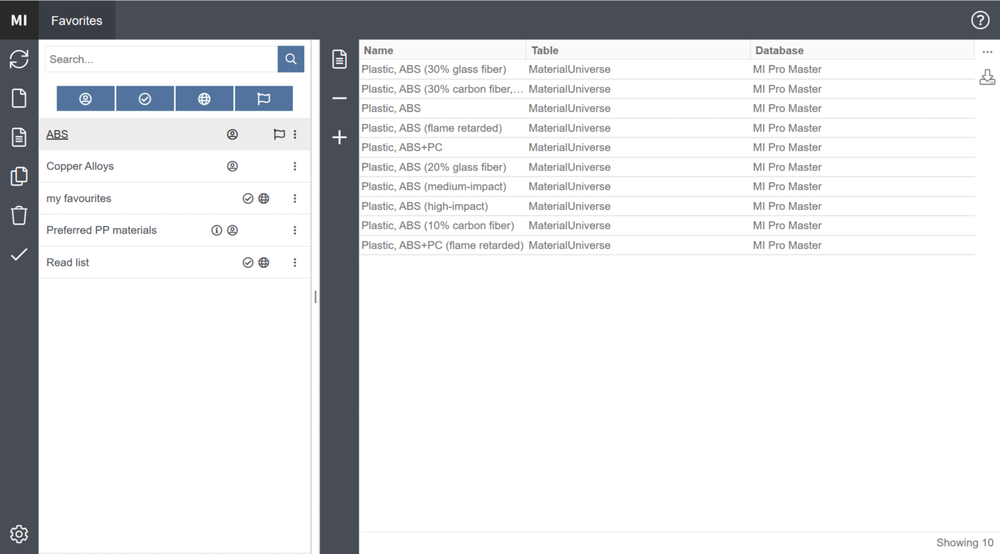
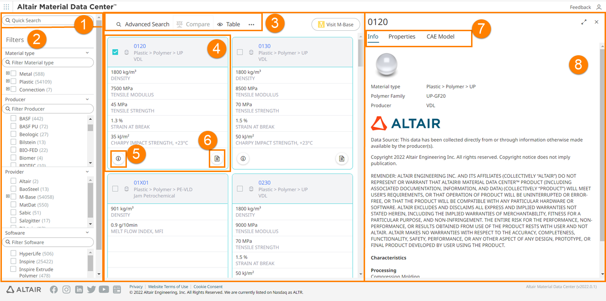
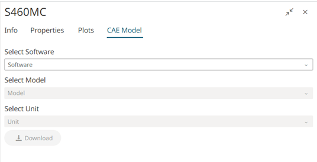
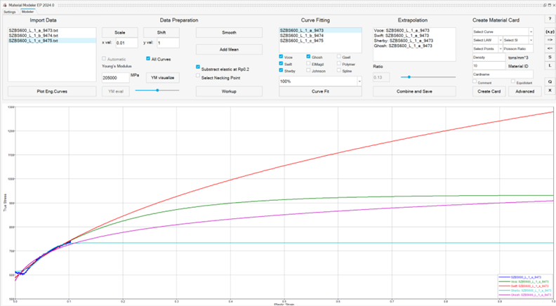
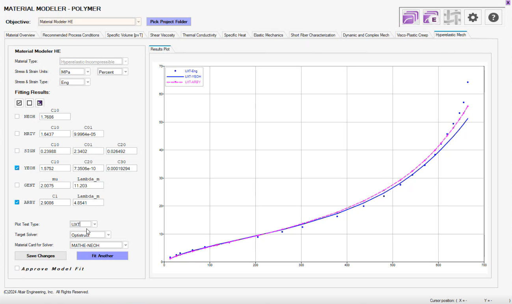

# UX Reference Gallery

These images are official public product screenshots retained only as internal design references.
They are not implementation specifications and must not be copied pixel-for-pixel.

Codex must open every local image before changing the frontend. For each image, identify the
interaction principle, the information hierarchy to adapt, and the proprietary or brand-specific
details that must not be copied.

## 1. Ansys Granta MI — dense material list

Apply:
- a stable navigation/filter area and a comparison-friendly material list
- restrained visual hierarchy with data taking priority over decorative cards
- clear selection state and immediate access to a chosen record

Do not copy:
- product branding, icons, exact colors, labels, or proprietary database structure

Source: https://www.ansys.com/products/materials/granta-mi-pro

## 2. Altair Material Data Center — search, filter, result and detail

Apply:
- search and filters remain spatially stable while results change
- selected material opens contextual detail instead of adding another dashboard page
- table/tile choice is secondary to finding and comparing materials

Source: https://help.altair.com/2022/altairone/prod_help/altair_amdc/topics/materialsdb/tutorial_amdc_interface_r.htm

## 3. Altair Material Data Center — CAE model delivery

Apply:
- solver, material law and unit selection form a short delivery flow
- the download action becomes enabled only when required choices are complete
- mapping or compatibility warnings stay visible without exposing internal IDs

Source: https://2022.help.altair.com/2022/altairone/prod_help/altair_amdc/topics/materialsdb/tutorial_advsearch_caemodel_r.htm

## 4. Altair Material Modeler — graph-centered fitting

Apply:
- the engineering graph is the dominant work area
- curve selection, candidate fitting, extrapolation and card creation remain visibly connected
- controls are compact and task-specific rather than separate nested cards

Source: https://help.altair.com/material_modeler/topics/material_modeler/curve_fitting_t.htm

## 5. Altair Material Modeler — fitting result comparison

Apply:
- experimental points and fitted candidates are compared in one persistent plot
- model controls support the plot instead of competing with it
- approval/export follows review of the actual response curve

Source: https://help.altair.com/material_modeler/topics/material_modeler/hyperelastic_r.htm

## Required interpretation

The target product should combine these principles:

1. Granta-style material discovery and dense list comparison
2. Material Data Center-style filter/result/detail continuity
3. Material Modeler-style persistent graph and compact engineering controls
4. a direct path from selected material or reviewed fit to a solver card
5. progressive disclosure for revision, provenance, recipes, batches and mapping evidence

The images are copyrighted by their respective owners and are retained in this private repository
solely for product research and internal implementation guidance. Do not redistribute them.
