# GUI 기능·사용성 동등성 제품 계획

Status: `authoritative corrective plan`

Date: `2026-07-19`

이 문서는 CAE Material Platform의 제품 GUI를 **GRANTA MI / Material Data Center 계열의
Material Information System**과 **Altair Material Modeler 계열의 Material Modeling
Workbench**에 익숙한 엔지니어가 별도 API 지식 없이 사용할 수 있는 수준으로 다시 설계하는
기준 문서다.

기존 `product-experience-spec.md`의 방향은 유지하지만, 단순히 화면·그래프·API가 존재한다는
사실을 제품 완료로 인정했던 T-79~T-81의 판정 기준은 이 문서로 대체한다.

## 1. 새 개발 목표

다음 문장을 새 goal의 권장 objective로 사용한다.

> 검증된 기존 엔진과 7/9 단계 작업의 안정된 체크포인트를 보존하면서, 현재 개발 콘솔형 GUI와
> 잘못된 제품 완료 판정을 철회하고 GRANTA MI/Material Data Center 및 Altair Material
> Modeler의 공개 사용자 기능을 기준으로 기능·정보구조·조작성 동등성을 갖춘 제품 GUI를
> 완성한다. Material Database는 계층 Contents Tree, Layout Datasheet, 검색·facet·비교,
> exact-revision 링크 이동을 제공한다. Material Modeling은 화면 진입 즉시 실제 곡선을
> 표시하고 Dataset/curve 목록, 대형 graph, Prepare/Fit/Extrapolate/Card 작업 패널을
> 고정하며, 그래프 직접 조작과 즉시 preview를 지원한다. Recipe·batch·Neutral JSON·명시적
> solver mapping·Abaqus/OpenRadioss native card를 하나의 작업 흐름으로 연결한다. UUID, API,
> token과 raw JSON은 일반 작업에서 숨긴다. 각 단계는 기존 계산·DB 계약 회귀 없이 실제
> Docker/PostgreSQL E2E, GUI 캡처와 사용자 매뉴얼까지 통과해야 완료한다.

## 2. 여기서 말하는 “클론 수준”

클론 수준은 공개된 업무 흐름과 사용자 편의성의 **기능적 동등성**을 뜻한다.

- 같은 종류의 엔지니어 업무를 비슷한 정보 구조와 조작 횟수로 끝낼 수 있어야 한다.
- 상용 제품 경험자가 트리, datasheet, curve preparation, fitting, extrapolation, card 흐름을
  별도 교육 없이 알아볼 수 있어야 한다.
- 화면 진입 직후 의미 있는 demo 또는 사용자의 마지막 작업 상태가 보여야 한다.
- 그래프에서 곡선·구간·후보를 선택하고 결과를 즉시 비교할 수 있어야 한다.
- 내부 API, UUID, digest, JSON 편집은 정상 업무 경로를 대신할 수 없다.

다음은 복제하지 않는다.

- 상용 제품 로고, 명칭, pixel-perfect skin
- 비공개 schema, file format, optimizer, 초기값 database
- proprietary constitutive model 또는 역공학으로 얻은 동작

독립 UI와 공개 수식·공식 solver 문서를 사용하되, 공개 사용자 업무에는 동등한 결과와 편의성을
제공한다.

### 2.1 모던 UI와 상용 업무 흐름을 함께 적용하는 기준

`2026-07-20` 재조사 결과, “클론 수준”을 오래된 화면의 색·테두리까지 복제하는 것으로 해석하지
않는다. 최신 제품 UI의 시각 위계에 GRANTA/Material Modeler의 검증된 업무 배치를 결합한다.

- [Granta MI 2026 R1 Contents Tree](https://ansyshelp.ansys.com/public/Views/Secured/Granta/v261/en/MI_Viewer_Help/MI_Viewer/GetStart_Profile.html)는
  Database/Profile가 Table·Folder·Record와 검색 범위를 결정하고 Subset이 tree와 결과를 함께
  제한하는 것을 기준으로 삼는다. Tree는 장식 navigation이 아니라 실제 record 탐색기다.
- [Granta MI 2026 R1 변경사항](https://ansyshelp.ansys.com/public/Views/Secured/Granta/v261/en/Granta_MI_Rel_Notes/release_notes/what_s_new_mi.html)은
  web Record Tree, record version 비교, data view를 최신 기준으로 삼는다.
- [Altair Material Modeler 2025 Extrapolation](https://help.altair.com/material_modeler/topics/material_modeler/extrapolation_t.htm)은
  후보 두 개 선택, ratio slider, raw/fitted/extrapolated/derivative 동시 확인, 명시적 Save 순서를
  금속 작업 흐름의 직접 기준으로 삼는다.
- [Microsoft Fluent 2 Tree](https://fluent2.microsoft.design/components/web/react/core/tree/usage)는
  hierarchy 탐색과 detail panel의 역할 분리, 짧은 label, keyboard navigation을 적용한다.
- [Microsoft Fluent 2 Drawer](https://fluent2.microsoft.design/components/web/react/core/drawer/usage)는
  왼쪽 탐색·오른쪽 문맥 action을 고정 inline surface로 배치하는 기준이다.
- [Carbon Data Table](https://carbondesignsystem.com/components/data-table/usage/)과
  [Disclosure pattern](https://carbondesignsystem.com/patterns/disclosures-pattern/)은 search/filter/action
  toolbar와 보조 정보의 progressive disclosure를 적용하는 기준이다.

따라서 모든 GUI PR은 다음 visual acceptance를 통과한다.

| 검사 항목 | 합격 기준 |
| --- | --- |
| 작업 초점 | 1440×900 첫 화면에서 주 graph 또는 Datasheet가 가장 큰 surface이고 한 개의 primary action만 강조된다. |
| pane 역할 | 왼쪽은 hierarchy/curve/step 탐색, 중앙은 비교할 본문, 오른쪽은 선택 항목의 action·warning만 표시한다. |
| 정보 위계 | 설명, digest, 과거 결과, raw JSON, 통계 상세는 drawer/details/Diagnostics로 접고 기본 surface를 밀어내지 않는다. |
| 시각 체계 | 중립 surface, 8px 기반 spacing, 작은 radius, 제한된 accent, 일관된 type scale과 상태 색을 사용한다. 큰 marketing hero와 중첩 card 남용을 금지한다. |
| 직접 조작 | graph 선택·slider·candidate toggle의 결과가 1초 내 preview/progress로 보이며 generic JSON/input을 정상 경로로 사용하지 않는다. |
| 연속성 | Datasheet/Test Data/최근 session에서 Material·State·Dataset·Recipe exact revision이 자동 복원된다. 사용자는 UUID를 입력하지 않는다. |
| 회귀 검수 | 공식 reference, 직전 accepted screenshot, 현재 1440×900/1280×800 screenshot을 나란히 검토한다. 자동 test만으로 GUI를 완료 처리하지 않는다. |

## 3. 현재 상태와 7/9 단계 안전 조치

### 3.1 보존할 기반

다음은 폐기하거나 다시 만들지 않는다.

- PostgreSQL stable identity / immutable revision
- typed configurable Attribute, Layout, Subset, Link Type
- exact-revision Record Link와 Material workflow graph
- canonical Test Data JSON과 CSV/TSV/XLSX adapter
- Mapping Profile, Processing Method, Recipe, Batch engine
- 금속 hardening, polymer Prony/shift, elastomer multi-mode fitting engine
- Neutral Material JSON과 Abaqus/OpenRadioss exporter
- audit, provenance, artifact, job, Administrator/User access 기반

### 3.2 안정된 체크포인트

브랜치 `codex/t81-reviewed-delivery`에서 다음 두 커밋을 안전 기준점으로 사용한다.

- `3b5c11c`: 호환 Test Data/Mapping Profile 자동 선택 및 첫 계산 graph 자동 표시
- `be3442d`: reviewed Neutral/mapping/native-card 전달 기반

두 커밋은 frontend 32개 test file, 69개 test, TypeScript, Vite production build와 bundle
budget을 통과했다. 새 GUI는 이 엔진 연결을 characterization test로 고정한 뒤 교체한다.

### 3.3 현재 화면의 판정

| 영역 | 현재 판정 | 조치 |
| --- | --- | --- |
| 자동 demo session과 제품 navigation | 유지 | 시각 밀도와 task naming만 보완 |
| Database/Profile/Table/Folder/Record API | 유지 | GUI tree와 datasheet 상호작용을 재감사 |
| 현재 Material Database 3-pane shell | `partial` | tree density, selected context, search/compare와 link 이동을 사용성 기준으로 보완 |
| Processing/fitting/export backend | 유지 | 계산 결과와 상태 계약을 그대로 사용 |
| 현재 `/modeling`의 큰 hero와 연속 form | 교체 | desktop engineering application shell로 재구성 |
| generic step option input | advanced로 이동 | method별 slider, selector, graph selection 제공 |
| raw Mapping/Recipe JSON textarea | advanced로 이동 | 정상 사용자는 guided editor 사용 |
| 현재 graph | 교체 | axis/unit/tick/tooltip/zoom/pan/selection/visibility/residual 추가 |
| T-79~T-81 제품 완료 표기 | 철회 | engine-connected/partial로 정정 |
| Neutral/card delivery engine | 유지 | Card 단계의 동일 작업 화면 안에 재배치 |

기존 uncommitted 파일을 통째로 삭제하지 않는다. 먼저 엔진 연결 test를 고정하고 새 component를
route 내부에서 점진 교체한다. 단계별 E2E가 통과한 뒤에만 기존 component를 제거한다.

## 4. 핵심 사용자와 성공 업무

### Materials engineer

- 트리 또는 검색으로 재료와 상태를 찾는다.
- datasheet에서 scalar, curve, 시험, model, card와 관련 record를 본다.
- 시험 곡선을 modeling session으로 열고 전처리·피팅·외삽한다.
- 후보를 비교하고 Neutral JSON과 solver card를 만든다.

### CAE analyst

- 재료, 상태, 적용 범위와 승인 상태를 확인한다.
- solver/version을 선택하고 mapping 차이를 검토한다.
- native ASCII card와 근거 package를 내려받는다.

### Database administrator

- migration 없이 Table, Attribute, Layout, Folder, Subset, Link Type을 구성한다.
- Administrator/User와 기능 권한을 설정한다.
- 내부 authorization 표현식이나 API token을 다루지 않는다.

## 5. 제품 정보 구조

전역 navigation은 다음 다섯 개만 유지한다.

```text
Dashboard | Material Database | Material Modeling | Jobs & Reviews | Administration
```

Material Database와 Material Modeling은 서로 단절된 module이 아니다.

```text
Material Database record
  -> linked Test Data revision
  -> Modeling Session / Recipe / Processing Run
  -> selected Neutral Material revision
  -> Mapping Report / Solver Card
  -> linked Material datasheet
```

모든 링크는 사람이 읽을 수 있는 label을 기본으로 표시한다. revision number와 상태는 보조
정보로 보여주며 UUID와 digest는 Diagnostics에서만 확인한다.

## 6. GRANTA 계열 Material Database GUI

### 6.1 고정 desktop shell

```text
+----------------------+-----------------------------------------+----------------------+
| Contents             | Results / Datasheet / Compare           | Context              |
| quick search         | breadcrumb + record title + revision    | Related records      |
| Database/Profile     | Overview Properties Curves Test Data    | Revisions            |
|  Table               | Models CAE Cards Links                  | Files / actions      |
|   Folder             |                                         |                      |
|    Record            | Layout-driven values and curves         |                      |
+----------------------+-----------------------------------------+----------------------+
```

- 왼쪽 Contents Tree는 record와 link를 열어도 사라지지 않는다.
- Database/Profile → Table → nested Folder → Record를 lazy expansion한다.
- 선택 node, ancestor path, loading, empty, error 상태를 구분한다.
- keyboard navigation, expand/collapse all, pinned/favorite, recent record를 제공한다.
- Tree와 search result는 동일한 datasheet를 연다.
- Workflow projection은 별도 toggle로 Material → State → Test/Specimen → Dataset → Processing →
  Neutral → Card → Release를 보여준다.

### 6.2 Datasheet

기본 tab은 다음과 같다.

```text
Overview | Properties | Curves | Test Data | Models | CAE Cards | Links
```

- 관리자가 만든 Layout 순서와 section으로 값을 표시한다.
- number는 display unit을 전환할 수 있고 original value/unit을 함께 확인할 수 있다.
- curve/table/file은 data type에 맞는 viewer를 사용한다.
- linked value와 local value를 시각적으로 구분한다.
- revision history를 time line과 side-by-side diff로 본다.
- Link panel에서 forward/reverse 관계를 확인하고 클릭으로 대상 record에 이동한다.
- back/forward 이동 시 tree expansion, search/filter, scroll 위치를 보존한다.

### 6.3 Search와 Compare

- 단일 quick search와 typed advanced search를 제공한다.
- Table/Folder/material family/maker/grade/state/status/discrete/numeric range facet을 제공한다.
- numeric filter는 normalized value로 계산하고 선택 unit으로 표시한다.
- result table의 column을 Layout/Attribute에서 선택한다.
- 여러 record를 선택하여 Layout 기준 scalar/table/curve를 나란히 비교한다.
- 검색식을 저장하면 Subset으로 tree에서 다시 열 수 있다.

### 6.4 Administration

- Database design: Table, Attribute, Layout, Folder, Subset, Link Type
- Users & access: Administrator/User와 기능 grant
- Attribute editor는 type별 form을 제공하고 unit/quantity 호환 오류를 즉시 설명한다.
- 향후 resource/action/scope 확장을 위한 내부 모델은 유지하지만 기본 화면에 노출하지 않는다.

## 7. Material Modeler 계열 GUI

### 7.1 application shell

큰 marketing hero와 세로로 이어지는 card/form을 제거하고 아래 desktop workbench를 기본으로 한다.

```text
+----------------------------------------------------------------------------------+
| Session / Material / Objective       Import  Prepare  Fit  Extrapolate  Card      |
+----------------------+------------------------------------------+----------------+
| Test files & curves  | Main graph                               | Task panel     |
| [x] specimen 01      | raw / processed / fit / extrapolation    | method options |
| [x] specimen 02      | zoom, pan, range pick, point pick         | sliders        |
| mean / excluded      | axis/unit, legend, cursor coordinates    | warnings       |
|                      | residual/derivative split view            | apply/save     |
+----------------------+------------------------------------------+----------------+
| stage history / Recipe / run status / messages                                   |
+----------------------------------------------------------------------------------+
```

화면 진입 후 5초 이내에 다음 중 하나가 반드시 보인다.

- 사용자가 직전에 연 session과 계산된 곡선
- Material/Test Data link에서 전달된 곡선
- 처음 방문한 demo 사용자를 위한 현실적인 synthetic example

빈 graph와 “먼저 API를 연결하라/ID를 입력하라”는 안내는 허용하지 않는다.

### 7.2 공통 graph 동작

- axis title, quantity, unit, major/minor tick, scientific/engineering notation
- mouse wheel zoom, drag pan, box zoom, reset view
- crosshair와 x/y tooltip, point index와 specimen label
- legend click으로 curve show/hide, isolate, color/style 변경
- raw/normalized/processed/fitted/extrapolated 구간의 일관된 line semantics
- domain range handle 또는 graph drag selection
- necking/proof/transition point marker의 자동 후보와 수동 이동
- residual 또는 first-derivative split view
- 변경 후 300 ms debounce preview, 이전 요청 취소, calculating/progress/error 상태
- 원본 curve는 항상 다시 표시할 수 있고 어떤 preview도 source를 덮어쓰지 않음

### 7.3 Import와 Mapping

- 새 session에서 objective/material family/test mode를 선택한다.
- JSON/CSV/TSV/XLSX와 기존 Material Database Test Data를 추가한다.
- file별 preview table과 curve를 즉시 표시한다.
- x/y channel, quantity semantics, original/normalized unit을 guided form으로 매핑한다.
- 자동 추정은 제안으로만 표시하고 사용자가 확인한다.
- mapping 오류는 해당 column 옆에서 수정한다.
- Mapping Profile을 이름과 적용 조건으로 저장·불러온다.

### 7.4 Prepare

- curve 포함/제외, crop, scale, shift, sort/duplicate, missing policy
- resampling/interpolation
- moving average, Savitzky–Golay, smoothing spline
- curve alignment
- 개별 curve와 mean/median, SD/MAD/IQR/confidence band
- 처리 전후 overlay와 undo/redo 가능한 stage history
- 순서를 drag-and-drop하고 각 method option을 right panel에서 조작
- 전체 pipeline을 Recipe draft/published revision으로 저장

### 7.5 금속 탄소성 track

공개 Material Modeler plastic-behavior workflow와 같은 업무를 지원한다.

1. tensile curve를 file 또는 Material Database에서 연다.
2. `YM Eval`이 자동 elastic region과 Young's modulus를 계산하고 graph에 fit line을 표시한다.
3. regression/robust/chord/secant/manual 방법과 구간을 직접 선택한다.
4. manual E slider를 움직이면 elastic line과 이후 변환 preview가 즉시 갱신된다.
5. All Curves, Smooth, Add Mean을 graph 옆의 직접 action으로 제공한다.
6. 0.2% 또는 사용자 offset proof stress를 marker와 함께 계산한다.
7. peak 후보 또는 graph point click으로 necking point를 정한다.
8. engineering → true stress/strain → true plastic strain Workup을 비교한다.
9. Voce, Swift, Hockett–Sherby, Ghosh를 동시에 fit하고 checkbox/legend로 비교한다.
10. fit domain, parameter/bounds, RMSE와 first derivative를 확인한다.
11. primary/secondary family와 ratio slider를 조정한다.
12. 지정 strain까지 extrapolate하고 observed/extrapolated 구간을 구분한다.
13. 선택 곡선을 저장하고 Neutral Material로 승격한다.
14. solver/version/material law/ID/name을 선택하여 card를 review/download한다.

### 7.6 폴리머 점탄성 track

- relaxation/DMA curve 목록과 temperature/time condition
- linear/log axis 전환과 log-domain resampling
- Prony term 수, initial/bounds, automatic/manual candidate 선택
- measured/predicted/residual graph와 term table
- WLF/Arrhenius shift 선택, shift factor graph와 master curve
- 적용 time/temperature domain과 extrapolation warning
- Neutral generalized Maxwell/Prony 모델과 Abaqus/OpenRadioss mapping/card

### 7.7 엘라스토머 track

- uniaxial/planar/biaxial curve를 역할별 그룹으로 표시
- curve별 include/holdout/weight/domain
- Neo-Hookean, Mooney–Rivlin, Yeoh, Ogden 후보와 multistart 비교
- parameter/bounds/objective/residual/identifiability/stability
- test-mode별 observed/predicted overlay와 holdout 결과
- Prony overlay와 hyper-viscoelastic applicability
- Neutral model과 Abaqus/OpenRadioss mapping/card

### 7.8 Recipe와 Batch

- 사용자가 현재 Mapping+ordered steps+method versions+options를 Recipe로 저장한다.
- Recipe Library에서 미리보기, 복제, 새 revision, publish를 수행한다.
- 여러 Dataset 또는 검색 결과에 compatibility preflight 후 batch 실행한다.
- 행별 queued/running/succeeded/warning/failed와 원인을 표시한다.
- 실패한 항목만 재실행하며 성공 output을 보존한다.

### 7.9 Card 단계

Card는 별도 기술 화면이 아니라 같은 workbench의 마지막 task다.

- selected Neutral summary와 source curve/domain
- solver와 version, material law, card name/ID
- exact/transformed/approximated/ignored/unsupported/not_applicable mapping table
- approximation/unsupported의 명시적 확인
- native ASCII preview와 line number/search/copy/download
- Neutral JSON, mapping report, Abaqus/OpenRadioss card와 bulk ZIP
- Material datasheet로 돌아가는 link

## 8. GUI 원칙

- 정상 사용 흐름에서 UUID, API URL, bearer token, tenant/RLS, digest를 표시하지 않는다.
- 내부 ID는 `Diagnostics`에 복사 가능한 형태로 제공한다.
- advanced JSON editor는 guided editor를 대체하지 않고 expert escape hatch로만 둔다.
- primary action은 화면마다 하나를 명확히 표시한다.
- form label은 기술 schema key가 아니라 엔지니어 용어를 사용한다.
- 계산 중 graph를 지우지 않고 이전 결과 위에 progress를 표시한다.
- warning은 결과 근처에 원인과 recovery action을 함께 표시한다.
- desktop 1440×900에서 주요 graph와 task panel이 fold 위에 보여야 한다.
- 1280 px까지 3-pane을 유지하고 그보다 작으면 context panel을 drawer로 전환한다.
- keyboard, focus, contrast, screen-reader label을 E2E로 검증한다.

## 9. Backend/API 재사용과 필요한 보강

### 그대로 재사용

- 목록/검색/tree/record/link/revision API
- canonical Test JSON import/export
- common processing preview/commit
- Recipe/Batch execution
- family fitting/calibration
- Neutral promotion/import/export
- solver preflight/card/bulk package

### GUI를 위해 보강할 API

- modeling session summary와 last-open state
- curve preview downsampling과 multi-curve payload
- cancellable/debounced preview request correlation
- graph marker/range selection을 step option으로 변환하는 typed command
- stage diff, residual, derivative와 candidate summary의 bounded response
- tree selection/search state를 복원하는 stable deep link
- task-oriented error code, message와 suggested recovery

API 보강은 UI에서 실제 사용하는 경우에만 추가한다. 새로운 범용 foundation을 먼저 만들지 않는다.

## 10. 기능 대응표와 완료 증거

각 capability는 `docs/00-research/product-capability-map.md`에서 아래 단위로 관리한다.

| 공개 사용자 동작 | 우리 제품 동작 | Engine | GUI | E2E | 상태 |
| --- | --- | --- | --- | --- | --- |
| Contents Tree에서 record 탐색 | persistent Database/Profile/Table/Folder/Record tree | 기존 | 재감사 | tree→datasheet | partial |
| Layout datasheet | admin-defined section/value/curve tabs | 기존 | 재감사 | search/tree 동일 record | partial |
| YM Eval | auto E + fit line + method/range control | 기존 계산 | 교체 | method별 golden + graph | partial |
| Smooth / Add Mean | direct action + before/after overlay | 기존 계산 | 교체 | deterministic overlay | partial |
| Necking 선택 | candidate marker + graph point 선택 | 기존 계산 일부 | 보강 | marker→workup | partial |
| 4-family extrapolation | simultaneous fit + derivative + ratio slider | 기존 계산 | 교체 | ratio card 재현 | partial |
| Material card review | same-workbench mapping + native preview/download | 기존 | 재배치 | two solver downloads | partial |
| Recipe reuse/batch | library/preflight/monitor/retry | 기존 | 재배치 | multi-dataset E2E | partial |

`implemented`는 Engine, GUI와 clean-deployment E2E가 모두 통과할 때만 사용한다.

## 11. 10단계 구현 순서

### 1. T-84 — 제품 상태 정정과 interaction inventory

- T-79~T-81을 `engine connected / GUI partial`로 정정한다.
- 공식 공개 tutorial의 click/action/result를 세부 대응표로 만든다.
- 현재 route/component/API를 유지·재배치·교체·누락으로 분류한다.
- 기존 engine characterization test와 screenshot baseline을 고정한다.

### 2. T-85 — Engineering application shell과 graph foundation

- Dashboard는 제품 소개 hero가 아니라 작업 선택 화면이다. 상단에서 `Material Database` 경로와
  `Material Modeling` 경로를 나란히 보여주고, Database 검색/tree 진입 및 진행 중 modeling/import를
  한 번의 동작으로 시작한다. 가족별 demo journey는 코어 목적을 설명하는 상단 영역이 아니라
  두 경로 아래의 reference workflow로 배치한다.
- 큰 hero/form stack을 compact application shell로 교체한다.
- session/objective, curve rail, persistent graph, task panel, stage/status bar를 구현한다.
- 첫 진입 auto data/preview, axis/unit/tick/tooltip/zoom/pan/legend/visibility를 구현한다.

**2026-07-20 checkpoint:** compact header, semantic family-compatible curve rail, reusable
`EngineeringCurvePlot`, series별 독립 sampling grid, axis/unit/tick/crosshair, zoom/pan/reset과
legend visibility가 실제 Compose DP780 preview에서 검증됐다. 후속 checkpoint에서 ephemeral
range/point selection을 Recipe step option으로 적용하고, 300 ms debounce와 이전 preview request
취소를 연결했으며 Dashboard를 Database/Modeling 두 작업 레인으로 교체했다. Datasheet/session
deep-link와 method-specific direct task control은 아직 남아 있으므로 T-85 전체 완료나 Material
Modeler 동등성으로 판정하지 않는다.

### 3. T-86 — Metal Prepare 직접 조작

- curve selection, crop, scale/shift, smoothing, Add Mean, statistics band
- elastic method/range/manual slider와 fit line
- proof marker, necking candidate/manual point, true/plastic Workup
- option 변경 즉시 preview와 stage history

### 4. T-87 — Metal Fit/Extrapolate 직접 조작

- 4 family 동시 graph, parameter/bounds/RMSE table
- fit domain selection, residual/first derivative
- primary/secondary selection과 ratio slider
- observed/extrapolated domain, combine/save

### 5. T-88 — 동일 workbench Card delivery

- Neutral review와 promotion
- solver/version/law/name/ID guided form
- six-state mapping, acknowledgement, native preview/download
- Abaqus/OpenRadioss와 bulk package E2E

### 6. T-89 — Polymer workbench parity

- relaxation/DMA preparation, log resampling
- Prony candidates/terms/bounds/residual
- WLF/Arrhenius master curve와 applicability
- Neutral/card vertical journey

### 7. T-90 — Elastomer workbench parity

- multi-mode curve rail과 roles/weights/holdout
- 4-family/multistart candidate, residual/stability
- Prony overlay, Neutral/card vertical journey

### 8. T-91 — Material Database tree/datasheet parity audit

- persistent tree density, keyboard/breadcrumb/deep-link/state restore
- Layout datasheet tabs, curve/table/file viewer, revision diff
- forward/reverse link navigation과 workflow projection

### 9. T-92 — Search/Compare/Admin 및 Recipe/Batch polish

- typed facet/range/search/subset/compare
- guided schema/Attribute/Layout/Link Type administration
- Recipe Library, compatibility, batch monitor/retry
- 일반 화면에서 기술 용어 완전 제거

### 10. T-93 — Clean product acceptance와 사용자 문서

- clean Docker/PostgreSQL seed에서 home→Database→Test→Modeling→Neutral→two cards→Material return
- metal/polymer/elastomer 독립 E2E
- 1440×900와 1280×800 screenshot 및 Playwright capture
- 사용자·관리자 따라하기 문서와 screenshot manifest 갱신
- frontend/Python/PostgreSQL/`make ci` 전체 통과

앞 단계가 깨진 상태로 다음 단계에 넘어가지 않는다. 각 단계는 의미 있는 commit/PR로 분리한다.

## 12. 단계별 Definition of Done

각 Task는 모두 만족해야 완료다.

1. 실제 domain/API 또는 기존 engine 연결
2. 일반 사용자가 쓸 수 있는 GUI
3. 계산·mapping의 unit/numeric regression
4. 실제 Docker/PostgreSQL Playwright journey
5. 현재 GUI screenshot
6. 사용자 guide 반영
7. capability map과 implementation status 정정
8. 관련 frontend/backend test와 `make ci`

다음은 완료 증거가 아니다.

- endpoint가 존재한다.
- database table이 존재한다.
- graph component가 빈 상태로 렌더링된다.
- raw JSON textarea에서 값을 바꿀 수 있다.
- UUID를 문서에서 복사하면 deep route가 열린다.
- isolated component test만 통과한다.

## 13. 정량 사용성 합격 기준

- demo 첫 `/database`와 `/modeling`에서 5초 이내 의미 있는 content 표시
- Material search 결과에서 datasheet까지 2회 이하 action
- datasheet Test Data에서 modeling graph까지 2회 이하 action
- metal demo에서 E method 변경 후 1초 이내 preview 또는 progress 표시
- necking candidate 확정에서 true/plastic Workup까지 2회 이하 action
- hardening family ratio 변경에서 graph update까지 1초 이내
- Neutral에서 card preview까지 solver 선택 포함 4회 이하 action
- 정상 demo journey에서 UUID/API/token 입력 0회
- 모든 primary graph에 axis title/unit/tick/legend/tooltip 제공
- 모든 approximation과 unsupported mapping은 card 생성 전에 사용자 확인

## 14. 공식 기능 근거

- [Granta MI Contents Tree와 Profile](https://ansyshelp.ansys.com/public/Views/Secured/Granta/v261/en/MI_Viewer_Help/MI_Viewer/GetStart_Profile.html)
- [Granta MI Attribute 관리](https://ansyshelp.ansys.com/public/Views/Secured/Granta/v261/en/Granta_MI/mi_admin_and_config/managing_attributes.html)
- [Granta MI Record Links](https://developer.ansys.com/docs/granta-mi-scripting-toolkit-4-2/samples/streamlined/16_Link_Records.md)
- [Altair Material Modeler 개요](https://help.altair.com/material_modeler/topics/material_modeler/altair_material_modeler_about_r.htm)
- [Altair Material Modeler plastic behavior tutorial](https://help.altair.com/material_modeler/topics/material_modeler/tutorials/amm_material_plastic_behavior.htm)
- [Altair Material Modeler extrapolation](https://help.altair.com/material_modeler/topics/material_modeler/extrapolation_t.htm)
- [Simcenter Material Modeler](https://www.siemens.com/en-us/products/simcenter/materials-science-management/material-modeler/)

이 자료는 공개 사용자 기능과 업무 순서를 확인하는 근거다. 비공개 구현을 추정하거나 복제하는
근거로 사용하지 않는다.

## 15. 공식 GUI 시각 기준

아래 이미지는 `2026-07-19`에 공식 Ansys/Altair 도움말에서 수집한 **기획·acceptance 전용
reference**다. 이미지 파일을 우리 제품 UI asset으로 재사용하지 않는다. 색상이나 pixel 배치를
복제하는 것이 아니라, 화면 밀도·정보 위치·직접 조작·업무 연속성을 구현하고 검토할 때 사용한다.

### 15.1 GRANTA — Profile과 Contents Tree

[공식 Profile/Contents Tree 도움말](https://ansyshelp.ansys.com/public/Views/Secured/Granta/v261/en/MI_Viewer_Help/MI_Viewer/GetStart_Profile.html)

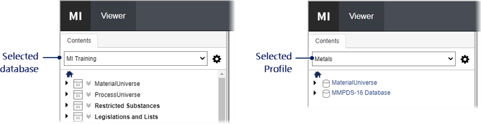

반영할 기준:

- profile은 연결 설정이 아니라 사용자가 보는 데이터 범위를 선택하는 제품 개념이다.
- database/table/subset/layout 조합은 사람이 읽을 수 있는 이름으로 전환한다.
- API 주소나 tenant ID를 입력하지 않는다.

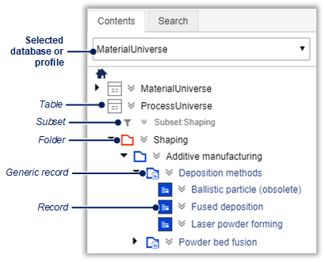

반영할 기준:

- 왼쪽 tree에서 database/table/folder/record 계층과 현재 선택 위치를 즉시 이해한다.
- folder와 record의 시각적 위계, expand/collapse, selection highlight를 유지한다.
- 중앙 datasheet나 search result를 열어도 tree가 사라지지 않는다.

현재 CMP 차이:

- engine-backed 계층은 있으나 demo hierarchy와 row density, keyboard/state restoration을 T-91에서
  다시 검증해야 한다.

### 15.2 GRANTA — Search result와 embedded Datasheet

[공식 search result list 도움말](https://ansyshelp.ansys.com/public/Views/Secured/Granta/v252/en/Granta_MI/one_mi/tab_list.html)

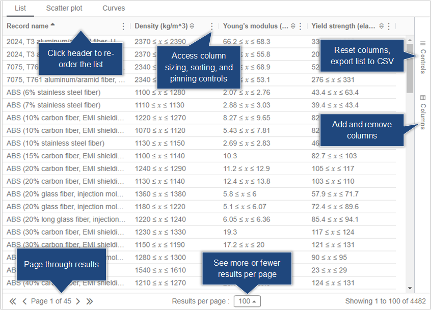

반영할 기준:

- 검색 조건과 결과가 한 workspace에 있고 사용자가 column을 추가·삭제·정렬한다.
- result 선택은 embedded datasheet 또는 동일 record의 full datasheet로 이어진다.
- 여러 record를 선택해 compare/export 작업을 시작할 수 있다.

[공식 datasheet 도움말](https://ansyshelp.ansys.com/public/Views/Secured/Granta/v252/en/Granta_MI/one_mi/datasheet.html)

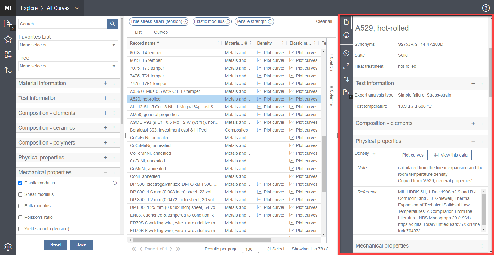

반영할 기준:

- result와 datasheet를 오가며 탐색 context를 잃지 않는다.
- Layout heading, attribute name/value/unit이 촘촘하지만 읽을 수 있게 정렬된다.
- toolbar는 record 작업에 한정되고 global 개발 기능을 섞지 않는다.

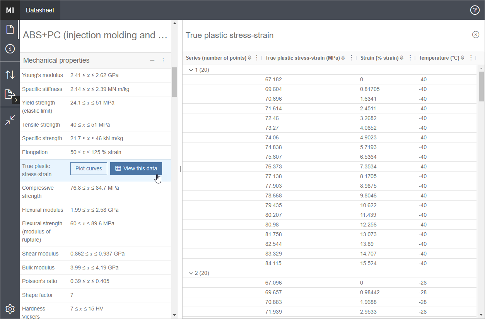

반영할 기준:

- full datasheet는 Layout section과 rich value를 한 record context에서 제공한다.
- functional/table/file/linked data를 타입에 맞게 열 수 있다.
- record name과 version 상태는 고정 header에서 확인한다.

현재 CMP 차이:

- Layout value와 unit은 표시되지만 search/list/datasheet/compare 전환의 밀도와 context 보존은
  T-91/T-92 acceptance가 필요하다.

### 15.3 GRANTA — Curves와 functional data editing

[공식 Curves page 도움말](https://ansyshelp.ansys.com/public/Views/Secured/Granta/v252/en/Granta_MI/one_mi/tab_curves.html)

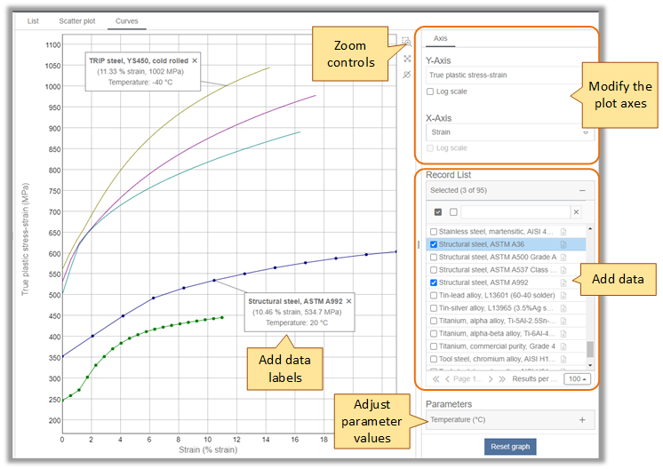

반영할 기준:

- curve plot과 record/curve selection 목록을 같은 화면에서 본다.
- axis property, unit/scale, selected curves와 legend를 직접 바꾼다.
- curve에서 해당 record datasheet로 이동한다.

[공식 data editing 도움말](https://ansyshelp.ansys.com/public/Views/Secured/Granta/v252/en/Granta_MI/one_mi/records_edit.html)

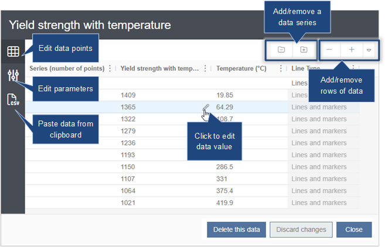

반영할 기준:

- functional value는 opaque artifact ID가 아니라 table+graph로 확인한다.
- parameter와 unit을 curve 옆에서 편집·검증한다.
- 원본/현재 revision 구분과 명시적 save가 필요하다.

현재 CMP 차이:

- Catalog curve Artifact provenance는 있으나 일반 datasheet의 타입별 curve/table editor/viewer가
  충분하지 않다. T-91에서 구현한다.

### 15.4 GRANTA — Administrator schema, Table과 Layout

[공식 Schema tool 도움말](https://ansyshelp.ansys.com/public/Views/Secured/Granta/v252/en/Granta_MI/mi_admin_and_config/mischema_schematool.html)

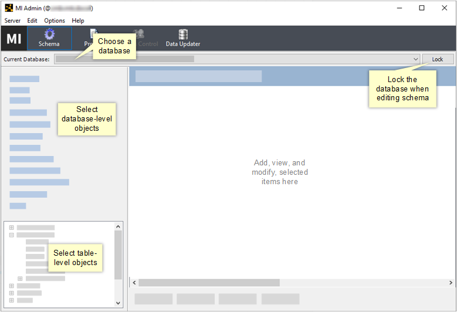

반영할 기준:

- 관리자는 database와 table context를 먼저 선택하고 해당 schema object를 편집한다.
- Table/Attribute/Layout/Subset/Link Type은 서로 관련된 schema 작업으로 묶는다.
- 일반 사용자 화면과 관리자 구성 화면을 분리한다.

[공식 Tables 도움말](https://ansyshelp.ansys.com/public/Views/Secured/Granta/v252/en/Granta_MI/mi_admin_and_config/mischema_table.html)

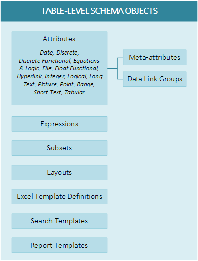

반영할 기준:

- 하나의 Table 아래 Attribute, Subset, Layout, template와 관련 object가 구조적으로 보인다.
- 새 Attribute 추가가 개별 record의 임의 JSON 편집으로 보이지 않는다.

[공식 Layout 관리 도움말](https://ansyshelp.ansys.com/public/Views/Secured/Granta/v252/en/Granta_MI/mi_admin_and_config/mischema_layouts_manage.html)

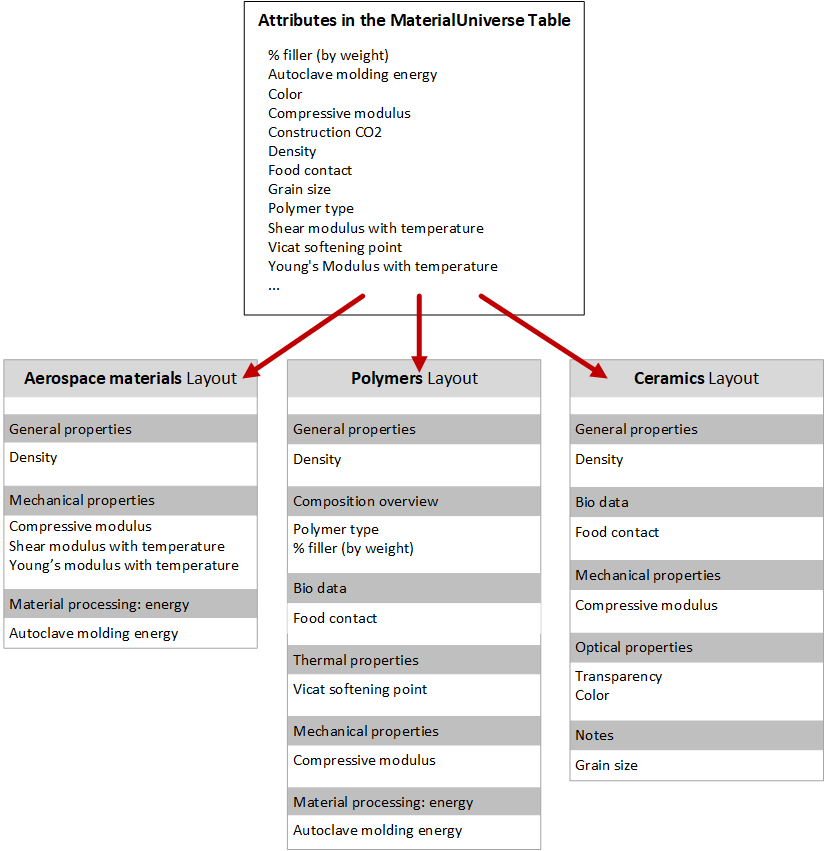

반영할 기준:

- Layout은 section heading과 ordered Attribute/Record Link Group을 직접 구성한다.
- datasheet에서 보이는 결과를 preview한다.
- required/read-only/visibility를 guided control로 설정한다.

현재 CMP 차이:

- typed schema engine과 기본 관리 화면은 있지만 object 관계, ordered layout authoring과 result
  preview 편의성은 T-92에서 재설계한다.

### 15.5 GRANTA — Record Link 표시와 편집

[공식 Record Link Group 도움말](https://ansyshelp.ansys.com/public/Views/Secured/Granta/v252/en/Granta_MI/mi_admin_and_config/mischema_rlinkgrp.html)

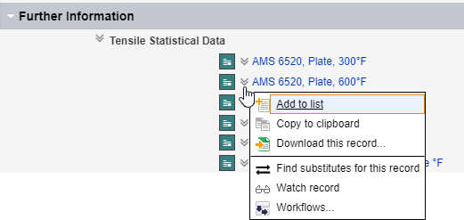

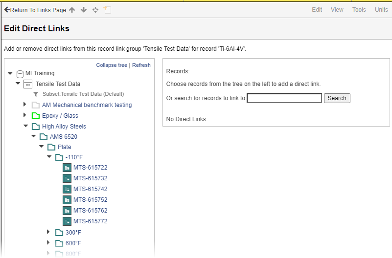

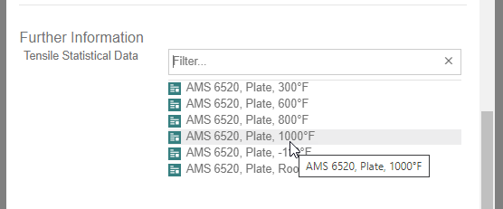

반영할 기준:

- 관련 record는 datasheet의 의미 있는 section에 사람이 읽을 수 있는 이름으로 표시한다.
- 편집자는 대상 table/tree/search에서 record를 찾아 link한다.
- forward/reverse 방향과 관계 이름을 이해할 수 있고 click으로 대상 datasheet에 이동한다.
- CMP 내부에서는 링크 양 끝을 exact revision에 pin하되 UUID는 일반 화면에 표시하지 않는다.

현재 CMP 차이:

- exact-revision Link Type/endpoint/cardinality engine은 강점이다. T-91/T-92는 이를 사용자에게
  자연스러운 related-record navigation으로 보여주는 데 집중한다.

### 15.6 Material Modeler — 시작 데이터와 작업 화면 밀도

[공식 plastic behavior tutorial](https://help.altair.com/material_modeler/topics/material_modeler/tutorials/amm_material_plastic_behavior.htm)

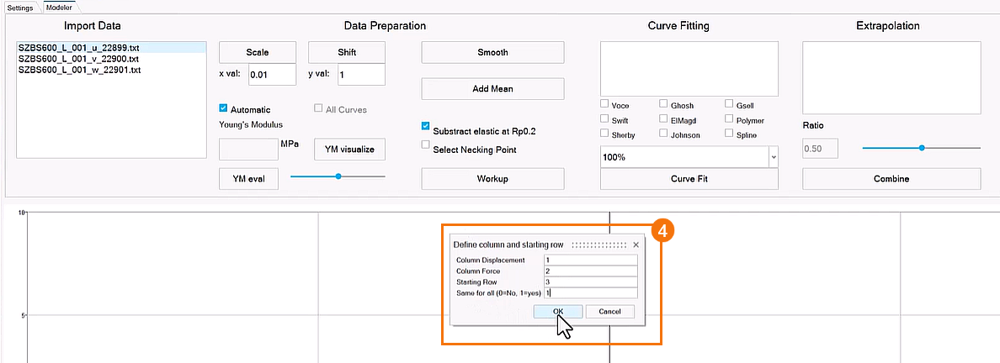

반영할 기준:

- 왼쪽 file/curve 목록, 중앙 graph, 오른쪽 작업 control을 동시에 본다.
- 선택한 objective가 필요한 file 역할과 processing action을 안내한다.
- raw curve가 첫 진입부터 보이고 각 file을 즉시 선택·편집한다.

현재 CMP 차이:

- 최근 체크포인트에서 demo curve auto preview는 추가했지만 큰 hero, setup card와 method button이
  graph 위 공간을 차지한다. T-85는 위 이미지와 같은 engineering application density로 교체한다.

### 15.7 Material Modeler — Young’s modulus 자동 평가

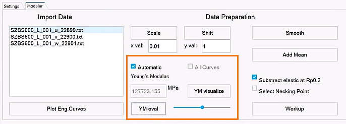

반영할 기준:

- `YM Eval` action 후 같은 context에 elastic fit graph와 계산 E가 즉시 나타난다.
- 계산 방법, 선택 domain, fit quality와 사용 curve가 명확하다.
- graph는 결과 없는 placeholder로 돌아가지 않는다.

T-86 수용 상태:

- robust/OLS/chord/secant/manual 선택, graph range, manual GPa slider, elastic fit line과 수치 evidence를
  persistent engineering graph와 task panel에 노출했다. candidate 비교/derivative는 T-87에서 확장한다.

### 15.8 Material Modeler — Young’s modulus 수동 조정

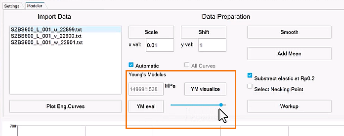

반영할 기준:

- Automatic/manual toggle, numeric value와 slider가 하나의 control group이다.
- slider를 움직이면 fit line과 후속 Workup preview가 즉시 갱신된다.
- `All Curves`, `Smooth`, `Add Mean`을 반복 curve 업무의 direct action으로 제공한다.

T-86 수용 상태:

- slider와 guided option은 300 ms debounce/cancellation으로 server preview를 갱신한다. exact curve
  include/exclude와 `Add mean & band`는 primary graph에서 직접 사용한다.

### 15.9 Material Modeler — Necking point와 Workup

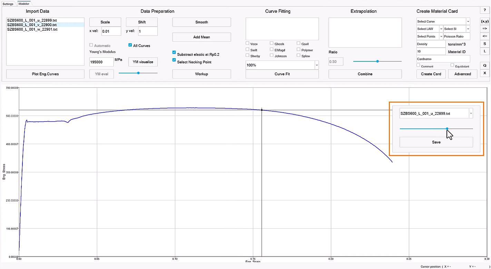

반영할 기준:

- curve 위 marker와 selected point를 직접 보고 necking point를 선택한다.
- automatic peak 후보와 수동 확정을 구분한다.
- Workup 이후 true stress/true plastic strain과 잘린 domain을 즉시 비교한다.

T-86 수용 상태:

- 자동 peak candidate marker와 graph point pick을 제공하며, 선택한 source index를 downstream
  true/plastic Workup option에 명시적으로 기록한다. 저장 전에는 Recipe draft preview로만 유지한다.

### 15.10 Material Modeler — 4-family fitting과 extrapolation

[공식 extrapolation 도움말](https://help.altair.com/material_modeler/topics/material_modeler/extrapolation_t.htm)

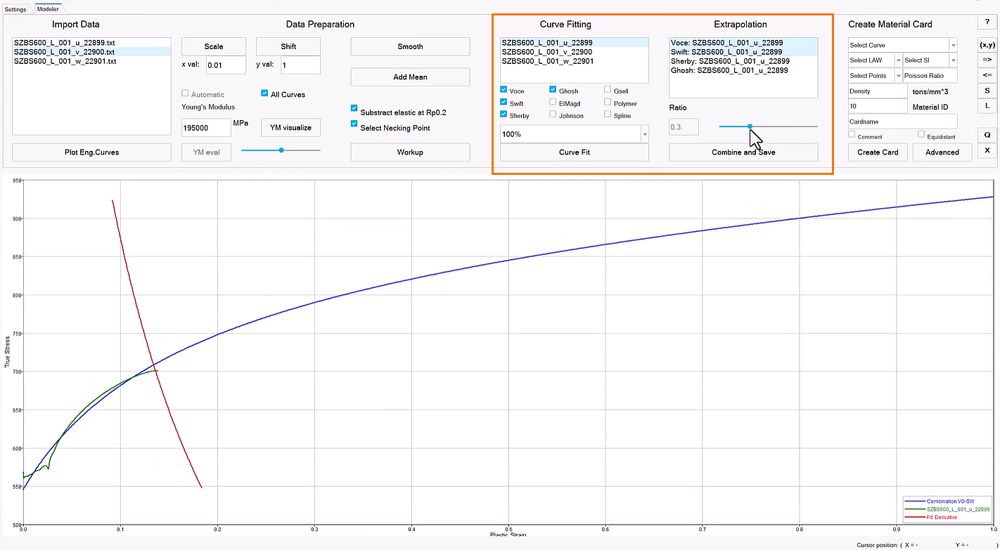

반영할 기준:

- Voce, Swift, Hockett–Sherby, Ghosh 후보를 같은 graph와 목록에서 동시에 비교한다.
- 후보 show/hide, fit domain, observed/extrapolated 구간과 first derivative를 확인한다.
- primary/secondary 후보와 ratio slider를 바꾸면 resultant curve가 즉시 갱신된다.
- combine/save가 현재 선택과 parameter를 명시적으로 보존한다.

T-87 수용 상태:

- 네 공개식과 observed plastic workup을 한 graph에 표시하고 candidate visibility, fit-domain range,
  primary/secondary와 blend slider를 직접 조작한다.
- Stress response, predicted-minus-observed Residual, numerical Tangent Modulus를 같은 graph에서
  전환하며 observed boundary 이후를 shaded/dashed unobserved domain으로 표시한다.
- relative RMSE를 첫 화면에서 비교하고 fitted parameter/lower/upper와 bound warning을 inspector에서
  검토한다. 선택 이유와 bounded extrapolation option은 Recipe revision에 함께 저장한다.
- 현재 제품 screenshot과 browser evidence는
  `docs/15-demo/evidence/t87-metal-fit-extrapolation.md`에 고정한다. Neutral/Card delivery는 T-88이다.

### 15.11 Material Modeler — CAE card 생성과 검토

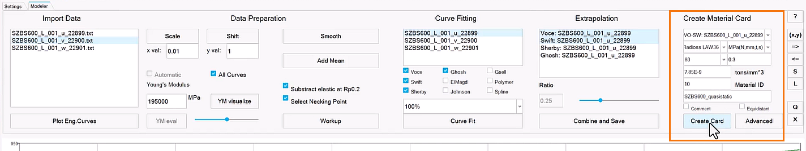

반영할 기준:

- solver/version/material law/material ID/name을 같은 Card task에서 guided control로 입력한다.
- 모델 선택 결과가 어떤 solver law로 변환되는지 생성 전에 확인한다.

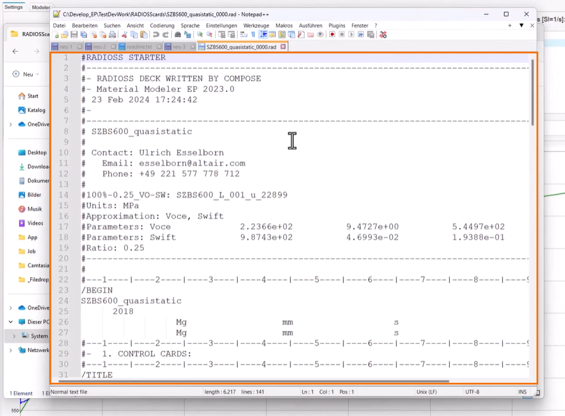

반영할 기준:

- native ASCII card를 line-oriented viewer에서 검토한다.
- source/model/mapping warning과 download를 같은 result context에 둔다.
- CMP는 여기에 six-state mapping과 approximation acknowledgement를 추가하여 silent mapping을
  막는다.

현재 CMP 차이:

- exporter와 ASCII preview는 연결되어 있지만 긴 페이지 아래의 별도 delivery panel이다. T-88은
  이를 persistent graph workbench의 마지막 Card task로 재배치한다.

### 15.12 이미지 기반 PR 검토 규칙

T-85 이후 모든 GUI PR은 다음을 포함한다.

1. 이 section의 해당 공식 reference image 링크
2. 변경 전 CMP screenshot
3. 변경 후 CMP screenshot
4. reference에서 채택한 interaction 목록
5. 의도적으로 채택하지 않은 요소와 이유
6. Playwright action/result assertion

검토자는 “비슷한 색인가”가 아니라 “동일한 엔지니어 업무를 같은 수준의 가시성과 직접성으로
끝내는가”를 기준으로 승인한다.
