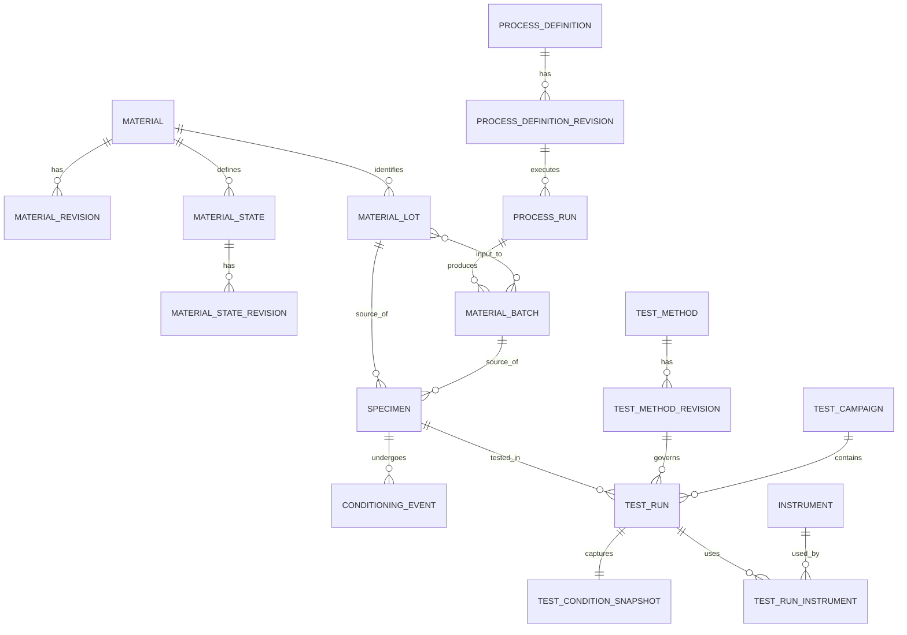
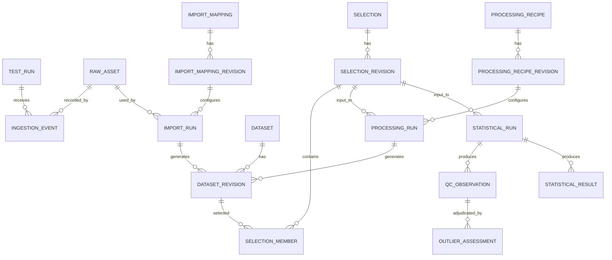
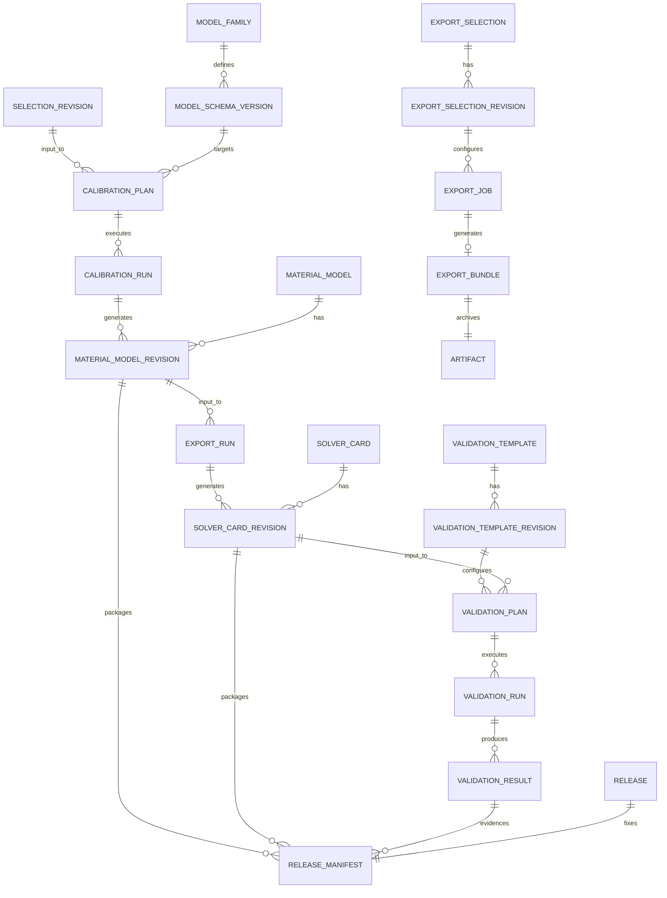

# Canonical Domain Model 및 ERD

## 1. 모델링 원칙

1. **Identity와 Revision 분리**: 사람에게 동일 대상으로 인식되는 안정 ID와 시점별 immutable content를 분리한다.
2. **물리적 대상과 디지털 표현 분리**: Specimen은 물리적 쿠폰이고 Dataset은 측정 데이터다.
3. **정의와 실행 분리**: Test Method/Process Definition/Recipe/Template과 실제 Run을 구분한다.
4. **문맥과 측정 분리**: Material State와 Test Condition은 다르다.
5. **대형 배열의 외부화**: DB는 식별·관계·schema·digest·summary를 관리하고 point array는 columnar object로 저장한다.
6. **확장 metadata의 schema 강제**: JSONB를 자유 메모장처럼 쓰지 않고 plugin JSON Schema와 schema version으로 검증한다.
7. **파생 관계는 provenance에서 표현**: 모든 도메인 table에 임의의 upstream FK를 늘리는 대신 typed provenance relation을 사용한다.

## 2. 핵심 용어의 정확한 구분

### 2.1 Material

조성, grade, formulation 또는 조직이 동일 재료로 관리하는 개념적 identity다. 공급 lot이나 시험 상태가 아니다.

예: 특정 강종 grade, 특정 polymer formulation. 이름·분류·명목 조성의 변경은 `MaterialRevision`이다.

### 2.2 Material State

동일 Material의 물성에 영향을 주는 상태 정의다. 열처리 상태, temper, aging, 수분 상태, 결정화 상태, irradiation history 같은 **재료 자체의 상태**를 표현한다.

시험 중 온도, crosshead speed, chamber humidity 같은 값은 `TestConditionSnapshot`이다. 시험 전에 정해진 시간 동안 conditioning한 이력은 `SpecimenConditioningEvent`이고, 그 결과를 Material State assignment로 연결할 수 있다.

### 2.3 Manufacturing Process, Process Run

- `ManufacturingProcessDefinition`: 공정의 의도·recipe·허용범위
- `ProcessRun`: 실제 시각, 설비, operator, 측정된 parameter로 수행된 실행

공정명 하나를 Material State에 문자열로 넣지 않는다.

### 2.4 Lot과 Batch

- `MaterialLot`: 공급자/생산자가 동일 생산 단위로 식별한 추적 단위
- `MaterialBatch`: 플랫폼 사용 조직이 실제로 함께 혼합·성형·열처리·가공한 물질 묶음

Batch는 여러 input lot을 소비할 수 있고, 한 lot은 여러 batch에 나뉠 수 있다. `BatchInput`이 material balance와 관계를 표현한다. 조직 용어가 다르면 UI label을 바꿀 수 있지만 canonical 의미는 유지한다.

T-07의 현재 bounded 구현은 `ProcessDefinition`, `MaterialLot(kind=lot|batch)`,
`StateGenealogy`를 stable identity와 immutable revision으로 분리한다. `StateGenealogyRevision`은
하나의 concrete Material State revision과 선택된 manufacturing/heat-treatment Process
revision, Material Lot revision을 정확히 고정한다. 기존 State의 문자열 descriptor는 과거
입력 보존용이며 governed link를 대신하지 않는다. `ProcessRun`, 별도 `MaterialBatch`,
`BatchInput`, split/merge와 multi-lot material balance는 이 bounded 구현에 포함되지 않으며
위 canonical 모델의 후속 T-07 범위로 유지한다(ADR-0024).

### 2.5 Specimen

시험에 사용되는 물리적 개체다. source lot/batch, 채취 위치, orientation, nominal/actual geometry, preparation, conditioning을 갖는다. 하나의 specimen에 여러 비파괴 test run이 있을 수 있으나 파괴시험 재사용은 method policy로 경고한다.

### 2.6 Test Method, Campaign, Run, Condition

- `TestMethodDefinitionRevision`: 표준/사내 method, required channels, metadata schema, QC profile
- `TestCampaignRevision`: 시험 목적, population, 계획
- `TestRunRevision`: 한 specimen에 수행된 실제 시험 사건
- `TestConditionSnapshot`: 시험 시점의 설정값과 관측값

Method의 default가 바뀌어도 과거 Run은 당시 method revision과 condition snapshot을 유지한다.

### 2.7 Configurable catalog와 계산 구성

- **Catalog Table**: 관리자가 정의하는 record 종류의 stable identity
- **Attribute Definition Revision**: 데이터형, quantity/unit, validation과 표시 규칙의 immutable 정의
- **Catalog Record / Record Revision**: 자유 schema record의 stable identity와 immutable content
- **Layout Revision**: record datasheet에 보일 Attribute와 순서·그룹
- **Subset Revision**: Table 범위에 저장된 typed filter/search 정의
- **Link Type Revision**: 허용 source/target Table, 방향명과 cardinality
- **Record Link Revision**: 두 exact Record Revision 사이의 사용자 정의 관계
- **Mapping Profile Revision**: Attribute/채널을 계산 quantity에 연결하는 immutable 계약
- **Processing Recipe Revision**: ordered method/version/options와 compatibility 계약
- **Processing Batch**: exact input Selection과 Recipe를 여러 member Run으로 실행한 집합

고정 Material/State/Property aggregate는 기존 API와 solver workflow의 호환 projection으로
유지한다. 새 configurable record가 기존 identity를 복제하지 않도록 record reference가 기존
revision을 가리킬 수 있으며, Workflow Explorer는 이 관계를 읽기 전용 tree projection으로
표현한다.

## 3. Aggregate와 entity 목록

### 3.1 재료·공정·시편

| Aggregate | 안정 identity | 주요 revision/content | 불변조건 |
| --- | --- | --- | --- |
| Material | `material` | `material_revision` | released revision의 content update 금지 |
| Material State | `material_state` | `material_state_revision` | material revision과 state descriptor 명시 |
| Process Definition | `process_definition` | `process_definition_revision` | plugin schema version 고정 |
| Process Run | `process_run` | run facts + input/output relation | 완료 후 fact 수정 대신 correction revision |
| Material Lot | `material_lot` | `material_lot_revision` | producer lot code와 source organization 보존 |
| Material Batch | `material_batch` | `material_batch_revision` | input lot/batch relation과 process run 연결 |
| Specimen | `specimen` | `specimen_revision` | physical identity 유지; geometry는 measured/nominal 구분 |
| Conditioning | event identity | immutable event | specimen, start/end, environment, procedure 연결 |

### 3.2 시험과 데이터

| Aggregate | 안정 identity | 주요 revision/content | 불변조건 |
| --- | --- | --- | --- |
| Test Method | `test_method` | `test_method_revision` | plugin/schema/version 고정 |
| Test Campaign | `test_campaign` | `test_campaign_revision` | 목적·population·plan 보존 |
| Test Run | `test_run` | `test_run_revision` | specimen 1개와 당시 condition snapshot 참조 |
| Instrument | `instrument` | `instrument_revision` | serial/asset identity와 calibration history 분리 |
| Raw Asset | content identity | `raw_asset` + ingestion event | raw bytes immutable, SHA-256 필수 |
| Import Mapping | `import_mapping` | `import_mapping_revision` | source column→semantic/unit mapping 고정 |
| Dataset | `dataset` | `dataset_revision` | revision은 immutable artifact manifest 참조 |
| Selection | `selection` | `selection_revision` + members | 계산 input membership 고정 |

### 3.3 분석·모델·검증

| Aggregate | 안정 identity | 주요 revision/content | 불변조건 |
| --- | --- | --- | --- |
| Processing Recipe | `processing_recipe` | `processing_recipe_revision` | ordered steps와 plugin schema digest 고정 |
| Processing Run | `processing_run` | plan snapshot, attempts, result refs | input revision head-follow 금지 |
| Statistical Plan/Run | `statistical_plan`, `statistical_run` | grouping, methods, outputs | replicate unit와 assumptions 필수 |
| QC Observation | immutable observation | rule, evidence, severity | input을 수정하지 않음 |
| Outlier Assessment | append-only decision | scope, decision, reason, actor | candidate와 사람 판정 분리 |
| Model Family | plugin definition | schema/capability | core가 constitutive payload를 해석하지 않음 |
| Calibration Plan/Run | stable plan/run | input, algorithm, config, attempts | failed run도 보존 |
| Calibration Candidate Selection | stable selection | selected Candidate/SHA-256, human reason | one succeeded Run identity; convergence and human acceptance are separate |
| Material Model | `material_model` | `material_model_revision` | IR document와 digest 필수 |
| Solver Card | `solver_card` | `solver_card_revision` | IR revision과 exporter run에 연결 |
| Validation Template | `validation_template` | revisioned geometry/BC/extraction | 변경 시 새 revision |
| Validation Plan/Run | stable plan/run | solver inputs/results/metrics | numerical/experimental verdict 분리 |
| Release | stable release ID | immutable release manifest | 구성 revision 고정; 삭제 대신 withdraw |
| Export Selection | `export_selection` | `export_selection_revision` + ordered members | exact revision/artifact와 requested representation 고정 |
| Export Bundle | immutable result identity | manifest Artifact + archive Artifact | retry/re-export는 새 result 또는 digest reuse; 기존 bytes 수정 금지 |

### 3.4 플랫폼·거버넌스

| Entity | 설명 |
| --- | --- |
| Organization / Project Space | 데이터 소유·격리 경계 |
| Principal / Group / Role Binding | identity와 권한 연결 |
| Plugin Definition / Plugin Package | 논리 plugin과 immutable 배포 package/digest |
| Runner | plugin/solver 실행 endpoint와 capability |
| Job / Job Attempt | durable async state와 실행 시도 |
| Review Request / Review Decision | 검토 snapshot과 append-only 판정 |
| Audit Event | security/business change의 append-only 기록 |
| Provenance Entity/Activity/Agent/Relations | 데이터 생성·사용·책임 관계 |

### 3.5 Configurable catalog와 reusable execution

| Aggregate/Entity | 의미 | Stable ID | Revision ID |
| --- | --- | --- | --- |
| Catalog Table | 관리자가 정의한 record type | O | O |
| Attribute Definition | typed attribute와 unit/validation | O | O |
| Catalog Folder | Table 안의 탐색 계층 | O | O |
| Catalog Record | 자유 schema record | O | O |
| Typed Attribute Value | Record Revision이 소유한 type별 값 | X | owner revision으로 고정 |
| Layout / Subset | datasheet와 saved query | O | O |
| Link Type | 관계 endpoint/cardinality 계약 | O | O |
| Record Link | exact revision 사이의 방향 관계 | O | O |
| Mapping Profile | 계산 quantity binding | O | O |
| Processing Recipe | ordered method pipeline | O | O |
| Processing Batch | 여러 exact Dataset 실행 | O | attempt/member 기록 |

## 4. ERD — 재료·공정·시편·시험



`MATERIAL_LOT`과 `MATERIAL_BATCH`의 실제 many-to-many는 `batch_input` association entity로 구현한다. ERD의 간결성을 위해 관계명으로 표시했다.

## 5. ERD — 원본·dataset·분석



## 6. ERD — 보정·IR·card·검증·발행



## 7. Revision 공통 필드

각 typed revision table은 다음 공통 필드를 갖는다.

| 필드 | 의미 |
| --- | --- |
| `id UUID` | revision identity |
| `<aggregate>_id UUID` | 안정 aggregate identity |
| `revision_no BIGINT` | aggregate 내 단조 증가 번호 |
| `based_on_revision_id UUID?` | 편집 기반 revision |
| `schema_id`, `schema_version` | content validator |
| `content JSONB` 또는 typed columns | domain content |
| `content_hash CHAR(64)` | canonical serialization digest |
| `created_at`, `created_by` | 생성 시간·agent |
| `change_reason` | 변경 이유 |
| `lifecycle_state` | draft/submitted/approved 등 projection |
| `organization_id`, `project_id`, `classification` | 소유·접근 경계 |

모든 공통 필드를 하나의 generic revision/EAV table에 몰아넣지 않는다. typed table과 foreign key가 domain integrity를 지키며, JSONB는 plugin-owned extension payload에 제한한다.

## 8. Artifact Manifest

대형 또는 파일형 content는 공통 `artifact` record로 표현한다.

```json
{
  "artifact_id": "uuid",
  "media_type": "application/vnd.apache.parquet",
  "size_bytes": 123456,
  "sha256": "hex",
  "storage_key": "sha256/ab/cd/...",
  "schema_ref": "urn:cmp:schema:dataset:curve:v1",
  "encryption_profile": "enterprise-default",
  "created_at": "RFC3339",
  "integrity_status": "verified"
}
```

`storage_key`는 사용자 API에 직접 노출하지 않는다. 다운로드는 권한 검사 후 짧은 수명의 transfer token 또는 streaming endpoint로 제공한다.

## 9. Dataset Revision Manifest

```json
{
  "dataset_revision_id": "uuid",
  "dataset_kind": "curve_set",
  "representation": "normalized",
  "rows_or_points": 150000,
  "replicate_unit": "specimen",
  "artifacts": [{"artifact_id": "uuid", "role": "primary-data"}],
  "channels": [
    {
      "key": "strain",
      "role": "independent",
      "quantity_kind": "engineering_strain",
      "dtype": "float64",
      "original_unit_text": "%",
      "normalized_unit": "1",
      "missing_policy": "mask"
    },
    {
      "key": "stress",
      "role": "dependent",
      "quantity_kind": "engineering_stress",
      "dtype": "float64",
      "original_unit_text": "MPa",
      "normalized_unit": "Pa",
      "missing_policy": "mask"
    }
  ]
}
```

`engineering_strain`과 `true_strain`은 둘 다 dimensionless라도 다른 `quantity_kind`다. 단위 라이브러리만으로 의미 변환을 처리하지 않는다.

## 10. 주요 불변조건

1. raw asset의 byte digest는 생성 후 변경되지 않는다.
2. released revision은 수정할 수 없고 새 revision 또는 lifecycle event만 허용한다.
3. run은 aggregate head가 아니라 구체 revision ID만 참조한다.
4. result artifact는 성공한 activity 없이 생성될 수 없다.
5. 모든 normalized channel은 original unit text 또는 `not_provided` 상태와 normalized unit을 가진다.
6. selection revision의 membership은 변경되지 않는다.
7. outlier assessment는 dataset membership을 수정하지 않는다.
8. Material Model IR revision 없이 production solver card를 생성할 수 없다.
9. release manifest의 모든 구성요소 digest는 생성 시 고정된다.
10. organization/project 격리 key는 모든 소유 domain row와 provenance projection에 존재한다.

## 11. 아직 결정하지 않은 domain detail

- `OQ-TEST-001` 대표 인장시험의 표준·재료군별 필수 metadata
- `OQ-MAT-001` 조성과 제조이력을 어느 수준까지 canonical column으로 승격할지
- `OQ-BATCH-001` 실제 고객 조직의 Lot/Batch 용어와 ERP key mapping
- `OQ-INST-001` 교정 성적서·불확도까지 MVP에 포함할지
- `OQ-DATA-001` raw 시험기 파일 외에 영상/DIC 같은 multi-modal asset을 MVP에서 다룰지
- `OQ-EXPORT-001` production-pilot 이후 proprietary PLM/CAE connector와 장기 Bundle retention

이 항목은 extension payload로 임시 수용할 수 있지만, 여러 plugin에서 반복되면 ADR을 거쳐 core concept로 승격한다.

