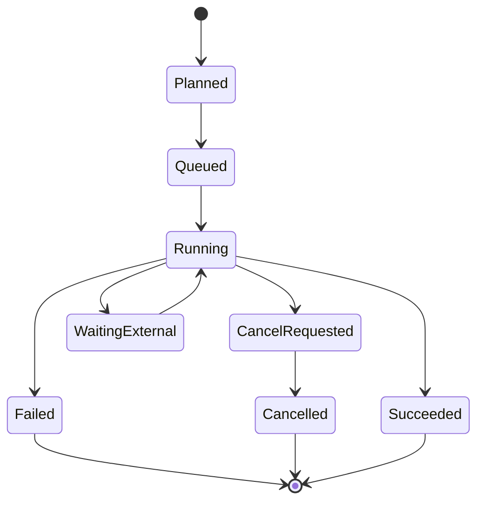
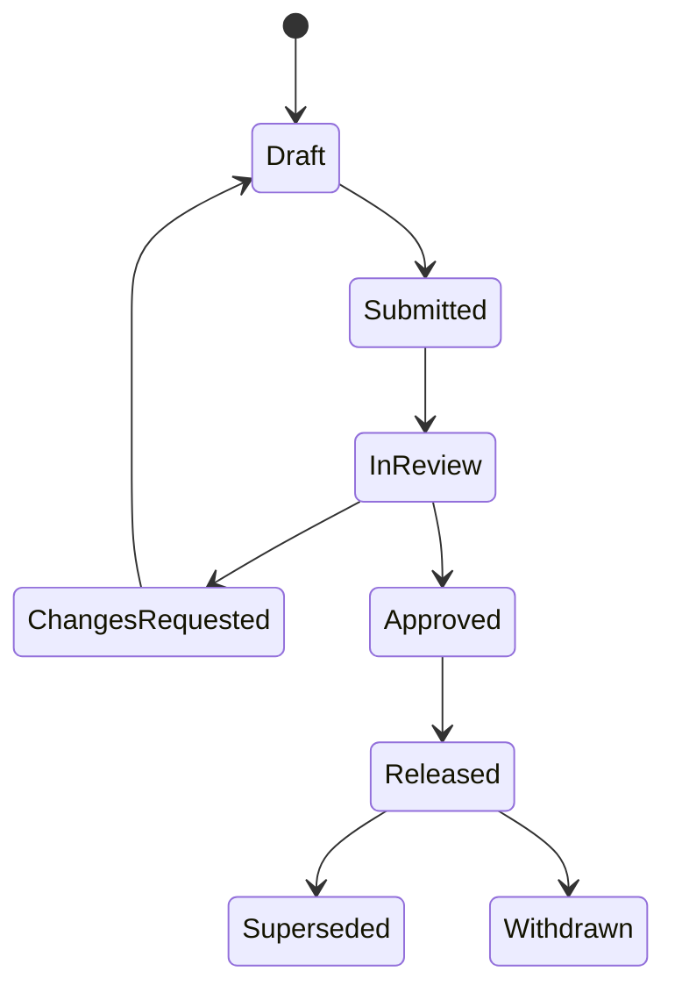

# 데이터 Revision과 Provenance 모델

## 1. 서로 다른 세 개의 이력

이 플랫폼은 다음을 한 종류의 `history`로 섞지 않는다.

| 이력 | 질문 | 표현 |
| --- | --- | --- |
| Content Revision | 같은 논리 대상의 내용이 어떻게 바뀌었는가? | aggregate identity + immutable revision + `wasRevisionOf` |
| Computational Provenance | 어떤 입력과 활동이 결과를 만들었는가? | Entity–Activity–Agent typed relations |
| Audit Trail | 누가 시스템에서 어떤 보안·업무 행위를 했는가? | append-only audit event |

예를 들어 metadata 오타 수정은 content revision이고, raw curve를 smoothing한 것은 derivation이며, 사용자가 수정 API를 호출한 사실은 audit event다. 세 이력은 연결되지만 대체 관계가 아니다.

### 1.1 Recipe/Batch 실행 결과의 모델 승격

성공한 common Processing Batch Attempt가 exact Output revision과 published Recipe revision 사이의
authoritative relation이다. Modeling은 Output head나 Recipe head를 추측하지 않고 이 Attempt를
역조회하여 Recipe digest, Batch, Member, Attempt와 Output revision을 한 evidence로 고정한다.
Recipe 없이 직접 commit된 과거 Output은 덮어쓰지 않으며 `processing_recipe=not_applicable`로
남는다. Recipe 기반 Output만 Neutral JSON에서 `processing_recipe=exact_revision`을 주장할 수 있다.

### 1.2 Canonical Test Data에서 Export까지의 exact source projection

`governed_source`는 클라이언트가 선언한 이름 일치가 아니라 application service가 확인한
세 exact revision pin이다. 좁은 integration adapter가 Test Run의 exact revision을 읽고 그
Run이 고정한 Specimen revision, Specimen이 고정한 Material/Material State revision, State가
고정한 Material revision을 각각 authorized application-service read로 해석하고
classification/scope 일치를 모두 확인한다. Datasets core는 Catalog/Testing persistence를
직접 읽지 않는다.

검증된 pin은 Canonical Test Data revision content hash에 포함되지만 canonical Test Data JSON
Artifact bytes에는 포함되지 않는다. Common Processing Output preflight는 exact Test Data
revision을 읽어 같은 proof를 immutable Output content와 `cmp.processing-output` Artifact에
복사한다. 과거/JSON-only source의 `null`은 의미 있는 “증명 없음” 상태이며 backfill하거나
browser session pin으로 대체하지 않는다. 이 projection은 source eligibility만 증명하고,
ephemeral target preview나 delivered Solver Card event를 만들지는 않는다. UXC-06C1 preview는 이
immutable projection을 read-only로 검증해 deterministic text/digest만 반환한다. 이는 Entity/Activity를
생성하지 않으며 C2 receipt와 delivered Solver Card event를 대신하지 않는다.

## 2. W3C PROV의 선택적 적용

W3C PROV-DM은 provenance를 domain-agnostic한 Entity, Activity, Agent와 관계로 정의한다. 이 설계는 그 의미론을 따르되 RDF/OWL 저장이나 graph DB를 요구하지 않는다. [W3C PROV-DM](https://www.w3.org/TR/prov-dm/)

### 2.1 매핑

| W3C 개념 | 플랫폼 매핑 | 예시 |
| --- | --- | --- |
| Entity | immutable revision 또는 artifact | Raw Asset, Dataset Revision, IR Revision, Card Artifact |
| Activity | 실행·변환·결정 | Import Run, Processing Run, Calibration Run, Export Run |
| Agent | 책임 주체 | User, Service Account, Plugin Package, Organization |
| used | activity가 input entity 사용 | Calibration Run used Selection Revision |
| wasGeneratedBy | entity가 activity에서 생성 | IR Revision wasGeneratedBy Calibration Run |
| wasDerivedFrom | 새 entity의 의미적 source | Processed Dataset derivedFrom Normalized Dataset |
| wasAssociatedWith | activity 실행 책임 | Run associatedWith user/plugin/runner |
| wasRevisionOf | 동일 aggregate의 새 content | Material Revision 3 revisionOf Revision 2 |
| wasAttributedTo | entity의 작성 책임 | Review Report attributedTo reviewer |

## 3. PostgreSQL typed provenance schema

### 3.1 Node tables

```text
prov_entity(
  id, organization_id, project_id,
  entity_type, domain_ref_table, domain_ref_id,
  content_hash, created_at, classification
)

prov_activity(
  id, organization_id, project_id,
  activity_type, domain_run_type, domain_run_id,
  started_at, ended_at, status, trace_id
)

prov_agent(
  id, organization_id,
  agent_type, principal_id?, plugin_package_id?, service_id?
)
```

`domain_ref_table`은 허용 목록으로 제한하고 application service가 referenced row 존재를 검증한다. 핵심 entity에는 가능한 경우 별도 unique foreign-key mapping table을 두어 polymorphic reference의 약점을 보완한다.

### 3.2 Typed relation tables

```text
prov_usage(
  activity_id FK, entity_id FK,
  role, ordinal, usage_metadata JSONB,
  PRIMARY KEY(activity_id, entity_id, role)
)

prov_generation(
  entity_id FK, activity_id FK,
  role, generated_at,
  PRIMARY KEY(entity_id)
)

prov_derivation(
  generated_entity_id FK, used_entity_id FK,
  activity_id FK?, derivation_kind,
  PRIMARY KEY(generated_entity_id, used_entity_id, derivation_kind)
)

prov_association(
  activity_id FK, agent_id FK,
  role, plan_entity_id FK?,
  PRIMARY KEY(activity_id, agent_id, role)
)

prov_revision(
  newer_entity_id FK UNIQUE,
  prior_entity_id FK,
  change_reason
)

prov_attribution(
  entity_id FK, agent_id FK, role,
  PRIMARY KEY(entity_id, agent_id, role)
)
```

관계 종류를 하나의 unrestricted `edge_type` 문자열에 몰아넣지 않는다. 핵심 relation은 typed table과 constraint로 관리한다. 아직 공통화되지 않은 plugin relation만 `prov_extension_relation`에 namespaced type과 JSON Schema를 요구한다.

## 4. Revision 저장 규칙

### 4.1 안정 identity와 append-only revision

```text
material(id, organization_id, project_id, current_revision_id, created_at)
material_revision(id, material_id, revision_no, based_on_revision_id,
                  content, content_hash, created_at, created_by, change_reason)
```

- `material.current_revision_id`는 조회 편의를 위한 head pointer다.
- revision content row는 `INSERT`만 허용한다.
- head pointer update에는 `expected_current_revision_id`를 사용해 lost update를 막는다.
- revision 생성 transaction은 새 revision, provenance revision relation, audit event, head pointer를 함께 기록한다.
- `DELETE`/`UPDATE`는 DB role과 trigger로 차단한다. lifecycle projection 같은 제한된 운영 필드는 별도 table에 둔다.

### 4.2 Draft 편집 전략

MVP는 **사용자 저장마다 revision 생성**을 기준으로 한다. UI의 아직 저장하지 않은 form state는 client/session 임시 상태이며 domain revision이 아니다. 큰 JSON 문서의 빈번한 autosave가 필요해지면 mutable working copy를 별도 도입할 수 있지만 release/provenance 입력은 commit된 immutable revision만 허용한다.

### 4.3 Correction과 supersession

- 원본 파일 오류: raw asset을 바꾸지 않고 corrected source를 새 raw asset로 ingest하고 관계·사유를 기록한다.
- metadata 오류: Test Run 또는 Import Mapping의 correction revision을 만든다.
- 계산 설정 오류: 기존 run을 실패/invalidated로 표시하고 새 run을 만든다.
- 승인 모델 교체: 새 release를 발행하고 이전 release를 superseded로 전환한다.
- 법적·보안상 사용 중지: withdrawn event를 추가한다. 물리 삭제와 동일하지 않다.

## 5. 계산 Activity 생명주기



### 5.1 실행 전

1. input entity revision과 selection membership을 검증한다.
2. plan/config를 canonical JSON으로 직렬화하고 digest를 계산한다.
3. plugin package, runner capability, resource policy를 고정한다.
4. `prov_activity`와 `prov_usage`, association을 생성한다.
5. durable job을 queue한다.

### 5.2 실행 성공

1. runner가 Result Manifest와 output artifact를 staging 영역에 쓴다.
2. 플랫폼이 digest, schema, size, expected role을 검증한다.
3. content-addressed final key로 승격한다.
4. DB transaction에서 artifact/entity, generation/derivation, run status, outbox event를 기록한다.
5. final object 존재와 digest를 reconciliation 대상에 등록한다.

### 5.3 실행 실패

실패 run도 activity다. input usage, plugin/runner, logs, failure category, partial artifact를 보존한다. partial output은 `diagnostic` role만 가질 수 있으며 downstream scientific input으로 자동 선택되지 않는다.

## 6. 객체 저장소와 DB의 비원자성 처리

객체 저장소와 PostgreSQL은 하나의 ACID transaction을 공유하지 않는다. 이를 숨기지 않고 상태와 복구 절차를 둔다.

1. upload는 random staging key에 수행한다.
2. digest와 size 검증 후 `artifact_pending`을 기록한다.
3. content-addressed immutable key로 server-side copy/commit한다.
4. DB artifact를 `available`로 전환하고 provenance generation을 commit한다.
5. background reconciler가 `pending`, missing object, orphan object, digest mismatch를 탐지한다.
6. orphan staging object는 retention window 후 삭제할 수 있지만 raw/released final object에는 lifecycle retention policy를 적용한다.

사용자에게 성공을 반환하는 시점은 DB와 final object가 모두 확인된 뒤다.

## 7. Lifecycle와 Release

### 7.1 Revision lifecycle



Content revision 자체를 update해 상태를 바꾸지 않고 `lifecycle_event`를 append하고 현재 상태 projection을 갱신한다.

### 7.2 Release manifest

Release는 최소 다음을 digest로 고정한다.

- Material 및 Material State revision
- input Selection revisions
- processing/statistical/calibration run IDs
- Material Model IR revision
- solver card revision과 mapping report
- validation template/run/result
- review decisions
- plugin package digests
- human-readable report
- provenance snapshot 또는 query root

release package 생성 후 구성요소를 교체하지 않는다.

## 8. Lineage query

PostgreSQL recursive CTE는 tree/hierarchy와 graph traversal에 사용할 수 있다. [PostgreSQL recursive query 문서](https://www.postgresql.org/docs/current/queries-with.html)

MVP query 유형은 알려져 있다.

- entity의 모든 direct/indirect upstream
- entity에서 파생된 downstream
- 특정 activity type까지만 탐색
- 특정 release에 포함된 provenance subgraph
- 영향을 받는 release impact analysis
- orphan/missing-generation 검사

cycle은 허용 relation과 금지 relation을 구분한다. `wasRevisionOf`, derivation, usage-generation 계보는 논리적 DAG여야 하며 write 시 cycle check를 한다. 조직 규모가 커지면 transitive closure/materialized path cache를 추가하되 typed relation이 source of truth다.

## 9. Graph DB 비교

| 기준 | PostgreSQL typed relation + provenance edge | 별도 graph DB |
| --- | --- | --- |
| Domain 무결성 | FK, unique, check, transaction으로 강함 | domain record와 이중화 시 consistency 관리 필요 |
| Revision·승인 transaction | 같은 DB transaction에 포함 가능 | 보통 분산 transaction 또는 eventual consistency |
| 권한 격리 | 기존 RBAC/RLS와 결합 가능 | graph별 권한 모델 별도 검증 필요 |
| 알려진 lineage traversal | recursive CTE와 index로 충분 | 자연스럽고 표현이 간결함 |
| 임의 다중-hop 탐색 | query가 복잡해질 수 있음 | graph query language가 유리 |
| 운영 복잡도 | DB 한 종류 | backup, HA, monitoring, driver 추가 |
| 분석/시각화 | export 또는 projection 필요 | graph analytics 생태계 유리 |
| MVP 적합성 | 높음 | 낮음 |

### 최종 권고

`DECISION`: PostgreSQL typed provenance relation을 source of truth로 사용한다. graph-shaped data가 있다는 이유만으로 graph DB를 도입하지 않는다.

다음 조건이 실제 측정으로 확인되면 read-only graph projection을 검토한다.

- provenance edge가 수억 건 이상이고 임의 5~20 hop interactive 탐색이 핵심 사용자 기능이 됨
- graph centrality/community/path analytics가 제품 가치가 됨
- recursive CTE 및 closure cache로 SLO를 충족하지 못함
- 별도 graph projection의 eventual consistency를 업무가 허용함

그 경우에도 PostgreSQL을 authoritative store로 유지하고 outbox에서 graph read model을 만든다.

## 10. Audit event

Audit event는 다음을 포함한다.

```json
{
  "event_id": "uuid",
  "occurred_at": "RFC3339",
  "actor": {"type": "user", "id": "uuid"},
  "organization_id": "uuid",
  "project_id": "uuid",
  "action": "material.revision.create",
  "target": {"type": "material_revision", "id": "uuid"},
  "outcome": "success",
  "request_id": "uuid",
  "trace_id": "hex",
  "ip_or_client": "policy-redacted",
  "reason": "metadata correction",
  "previous_hash": "hex",
  "event_hash": "hex"
}
```

민감한 raw payload와 secret은 audit에 넣지 않는다. audit integrity는 append-only DB permission, hash chain/periodic signed root, 외부 WORM retention으로 강화한다.

## 11. Provenance completeness 규칙

Release 전 자동 검사한다.

1. 모든 output entity에 정확히 하나의 primary generation activity가 있다.
2. 모든 run input이 immutable entity revision이다.
3. 모든 activity에 실행 user/service, plugin package 또는 명시적 manual activity agent가 있다.
4. 모든 artifact digest가 검증되었다.
5. 모든 unit conversion과 manual edit가 activity/recipe로 표현되었다.
6. card는 IR revision과 exporter package에서 파생되었다.
7. validation은 template, solver/card, runner, result extraction version을 가진다.
8. review decision은 검토한 release-candidate manifest digest를 참조한다.
9. a Calibration-promoted Material Model IR references the exact current Candidate Selection
   revision, converged Candidate digest, Calibration Run, and diagnostics Artifact digest; it never
   replaces the evaluated IR revision.
10. a T-27 Validation Run records the same terminal Result Manifest provenance shape for managed
    mock and manual attachment: exact Plan/Template/IR/Card/Selection usage plus immutable
    deck/log/native-result/manifest Artifact generation. A normal termination is evidence only and
    must not be represented as a validation verdict.
11. a T-28 Validation Result is a separate immutable interpretation activity. It uses the frozen
    terminal Result Manifest and experimental Selection revision, generates separate normalized
    response, numerical-health-report, and comparison-result Artifacts, and records their digests
    without changing the Run, Manifest, native Artifact, source Dataset, IR, Card, or a prior
   result. Its pass/fail/not-evaluated value is an explicit reference profile outcome, never a
   replacement for approval or release provenance.
12. a T-29 Review Request pins one immutable aggregate revision and manifest digest. A Review
    Decision is append-only, records the separated reviewer and exact digest, advances the shared
    lifecycle projection transactionally, and never mutates the candidate. `changes_requested`
    applies only to that revision; resubmission requires a newly created revision.
13. a T-30 reference Release pins one explicit candidate manifest: Material/State/Property
    revisions, Material Model IR revision, Solver Card and mapping/card digests, a passed
    Validation Result, the approved T-29 Review Request/Decision digest, and a provenance snapshot
    digest. The Release Manifest and package Artifact are immutable and tenant/classification scoped;
    the completeness gate rejects stale, draft, unsupported, approximated, cross-tenant, or
    partially approved inputs. The reference package is not a production object-store publication
    and has no supersede/withdraw transition until T-31.

14. T-31 keeps that Release evidence immutable and records lifecycle separately. A typed
    supersede/withdraw event names the source Release and (for supersede) an explicit same-scope
    successor; a projection exposes only the current terminal state. Download and consume facts
    are append-only usages accepted only while released. Impact reads include predecessor,
    successor, transition history, usage, and terminal warnings without changing any Release,
    Manifest, package, Material Model, Solver Card, or validation revision.

