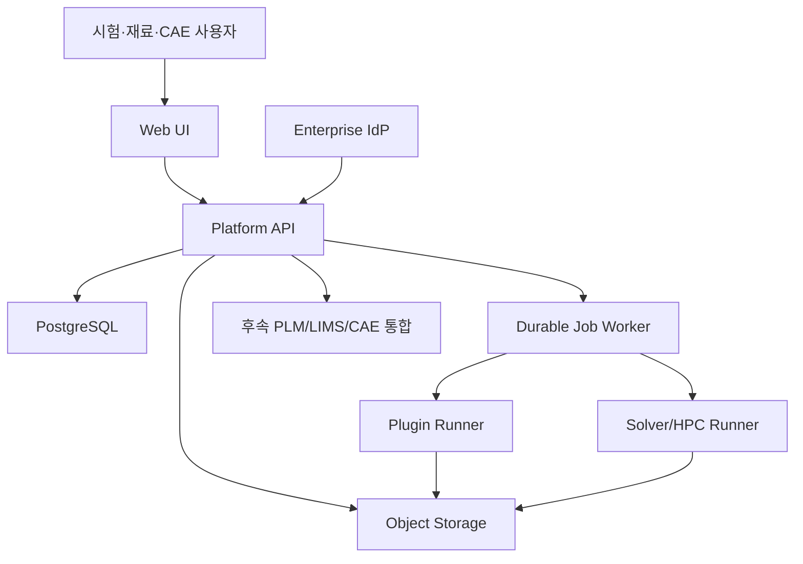
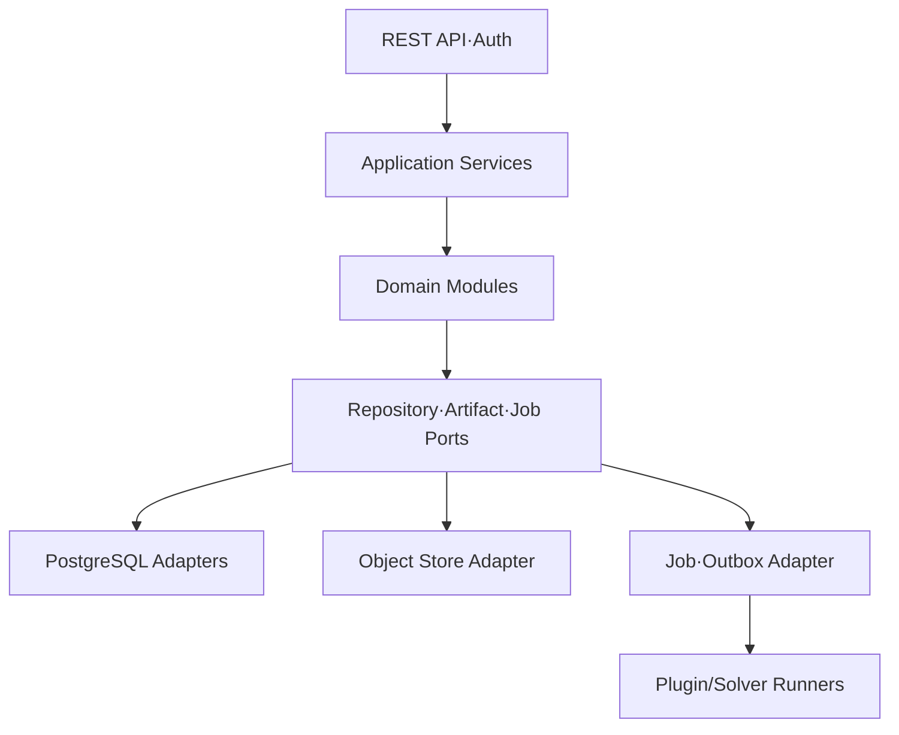
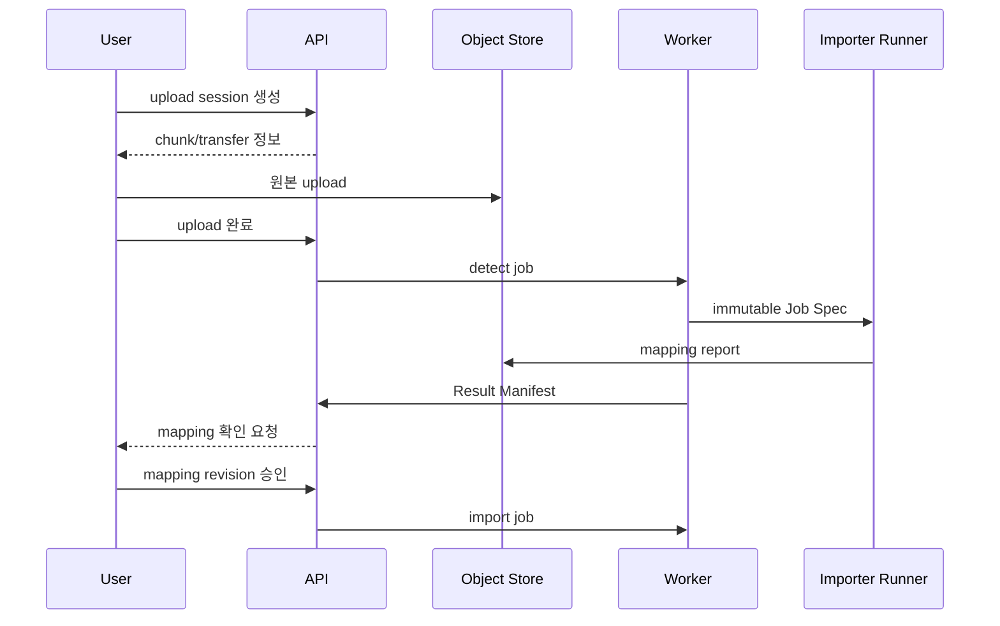
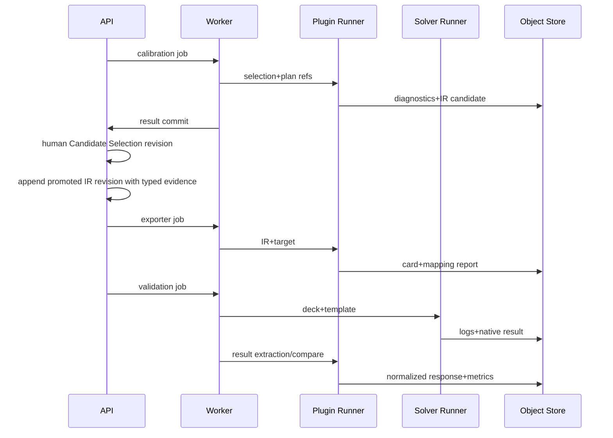

# 시스템 아키텍처, 기술 스택 비교 및 최종 권고

## 1. 아키텍처 목표

- 특정 시험·재료모델·solver와 core를 분리한다.
- raw부터 release까지 transactionally 일관된 metadata와 완전한 lineage를 제공한다.
- 수치 계산과 상용 solver의 긴 실행을 API process에서 격리한다.
- 첫 제품의 운영 복잡도를 통제하면서 module/service 추출 경계를 보존한다.
- 온프레미스·사설 클라우드의 enterprise identity, object storage, HPC 환경에 연결할 수 있다.

## 2. 모듈형 모놀리스 대 마이크로서비스

| 기준 | 모듈형 모놀리스 | 초기 마이크로서비스 |
| --- | --- | --- |
| Domain 경계가 아직 변하는 단계 | 단일 transaction과 빠른 refactoring에 유리 | 잘못 나눈 service 경계가 API·event 부채가 됨 |
| Revision/provenance 일관성 | 한 DB transaction으로 보장 가능 | distributed consistency와 saga 필요 |
| 팀 규모 | 소수 제품·도메인 팀에 적합 | service별 독립 팀이 없으면 운영 부담만 증가 |
| 배포·관측·장애 대응 | 단순 | gateway, service discovery, broker, tracing, 다중 배포 필요 |
| 수치/HPC 격리 | worker/runner process로 충분 | compute service로 분리 가능하지만 필수 아님 |
| 독립 확장 | API/worker를 역할별 scale 가능 | service별 세밀한 scale 가능 |
| 기술 다양성 | 제한적 | 필요한 경우 service별 언어 선택 가능 |

### 최종 권고

`DECISION`: **모듈형 모놀리스 + 격리된 실행 plane**으로 시작한다.

- 하나의 repository와 versioned release train
- 하나의 authoritative PostgreSQL cluster
- 같은 application codebase에서 API process와 durable worker process를 별도 배포
- plugin code는 별도 runner process/container에서 실행
- 상용 solver는 HPC/solver runner에서 실행
- module 간 접근은 application interface와 event를 사용하고 다른 module table을 임의 query하지 않음
- schema를 module별 PostgreSQL schema로 구분

이는 모든 코드를 한 process에 넣는 전통적 monolith가 아니다. **업무 transaction은 함께 두고, 위험하고 무거운 계산은 격리**하는 구조다.

## 3. 시스템 context

## 4. Logical component

`T-27` keeps the reference virtual-specimen runner inside the Validation bounded module at the
application/persistence boundary. Its current `reference_inline_mock` and manual evidence paths do
not invoke a solver executable or scheduler; they persist typed Template/Plan/Run/Result Manifest
facts and immutable Artifact evidence through existing Artifact, Provenance, Audit, and RLS ports.
Real solver/HPC execution remains an adapter decision. `T-28` now keeps typed response extraction,
numerical-health assessment, observed-grid comparison, and reference verdict calculation in the
same Validation bounded module. It reads Dataset/Model revisions only through their public
application ports and stores explicit Validation-owned rows/Artifacts; it does not import a solver,
test importer, fitting engine, or generic property/EAV payload. A reference verdict is not a
production solver, material, review, or release decision (ADR-0014).

`T-29` keeps review governance in `review_release`: requests pin the aggregate type/id, exact
revision, and manifest digest; decisions are append-only and advance the existing lifecycle event
and projection inside one PostgreSQL transaction. The request author cannot decide it, a stale
manifest or newer revision is rejected, and `changes_requested` leaves the old revision immutable
so a new revision is required before resubmission. Release composition remains T-30.

`T-30` keeps the first Release channel in the same `review_release` bounded module. A reference
Release is a stable identity plus one immutable typed Manifest and one immutable package Artifact.
The persistence adapter validates explicit Material Model, Solver Card, Validation Result, Review,
and provenance digests inside the tenant/classification scope before inserting the three rows. The
package is intentionally a small database-backed reference artifact for this slice; production
object-store publication and supersede/withdraw transitions remain separate T-31 work. No generic
EAV or catch-all release payload is introduced.

의존성 방향은 외부 adapter에서 domain/application 쪽으로 향한다. domain module은 FastAPI, SQLAlchemy, S3 SDK, solver SDK를 import하지 않는다.

## 5. Bounded module

| Module | 책임 | 소유 데이터 | 금지 사항 |
| --- | --- | --- | --- |
| `identity_access` | principal, group, role binding, policy context | identity projection, bindings | domain content 해석 |
| `catalog` | material/state/process/lot/batch/specimen | catalog schema | 시험 데이터 point 저장 |
| `testing` | method/campaign/run/condition/instrument | testing schema | 특정 시험 parser 내장 |
| `artifacts` | upload, digest, immutable object lifecycle | artifact schema | domain 의미 추론 |
| `datasets` | dataset/schema/selection/revision | dataset schema | hidden transformation |
| `processing` | recipe/run/step orchestration | processing schema | plugin code 직접 실행 |
| `statistics` | plan/run/QC/outlier assessment | statistics schema | input dataset mutation |
| `modeling` | model family registry, calibration, IR revision | modeling schema | solver keyword 내장 |
| `exporting` | exporter capability, card generation record | exporting schema | model fitting 수행 |
| `validation` | template/plan/run/result | validation schema | solver binary를 API에서 실행 |
| `review_release` | lifecycle, review, release channel | governance schema | revision content 수정 |
| `provenance` | entity/activity/agent relation, lineage query | provenance schema | audit를 대체 |
| `audit` | append-only audit trail | audit schema | scientific provenance 해석 |
| `plugins` | manifest/package/signature/compatibility | plugin schema | third-party code import |
| `jobs` | job, attempt, lease, runner registry | job schema | scientific result 판정 |

Module 간 FK는 허용하되 write는 소유 module의 application service만 수행한다. cross-module read는 public query service 또는 materialized read model을 사용한다.

## 6. 기술 스택 비교

### 6.1 Backend 언어

| 후보 | 장점 | 약점 | 판정 |
| --- | --- | --- | --- |
| Python | NumPy/SciPy/PyArrow 및 재료 보정 생태계, 빠른 plugin 개발 | CPU-bound 성능, dependency 충돌, runtime typing | `권고` |
| Kotlin/Java | 강한 type, enterprise 운영, 높은 concurrency | scientific plugin과 별도 bridge 필요 | 대규모 조직의 대안 |
| C#/.NET | enterprise/Windows/HPC 연계, type 안정성 | Python scientific 생태계 연결 필요 | Windows 중심 대안 |
| Rust | 성능·안전성·single binary | 제품/도메인 iteration 비용 | hot path/plugin용 선택지 |

`DECISION`: Python 3.12+를 API/application/scientific SDK 기준으로 사용한다. runtime contract는 Pydantic/JSON Schema로 검증하고, CPU-intensive 계산은 process/container로 격리한다. 필요하면 compiled library나 다른 언어 runner를 Job Spec/Result Manifest로 연결한다.

### 6.2 API framework와 persistence

- FastAPI: OpenAPI 생성, async I/O, Pydantic v2 integration
- SQLAlchemy 2.x: repository adapter와 transaction control
- Alembic: forward migration 및 migration test
- PostgreSQL 16+ baseline: typed relation, JSONB, recursive CTE, transaction, RLS

PostgreSQL은 JSON/SQL을 transaction 안에서 함께 다룰 수 있고 JSONB query/index를 제공한다. [PostgreSQL JSON 문서](https://www.postgresql.org/docs/current/datatype-json.html) JSONB는 plugin extension에 쓰되 core relation을 대체하지 않는다.

### 6.3 Metadata DB

| 후보 | 장점 | 약점 | 판정 |
| --- | --- | --- | --- |
| PostgreSQL | ACID, FK, RLS, JSONB, recursive CTE, 운영 성숙도 | 임의 graph analytics는 복잡 | `권고` |
| Graph DB | variable-depth traversal과 graph query | authoritative domain data와 이중화, RLS/transaction 복잡 | read projection 조건부 |
| Document DB | schema 변화와 JSON 저장 | typed relation·join·approval transaction 약함 | 비권고 |

### 6.4 Artifact storage와 데이터 형식

| 영역 | 후보 | 결정 |
| --- | --- | --- |
| Raw/file artifact | DB BLOB vs filesystem vs object store | S3-compatible object storage |
| Normalized curve/table | CSV/JSON vs HDF5 vs Arrow/Parquet | Arrow schema + Parquet artifact |
| Small config/manifest | YAML vs JSON | canonical JSON; 사람이 편집하는 source만 YAML 허용 |
| Solver result | proprietary native + extracted table | native 원본과 normalized extraction 모두 보존 |

Parquet은 columnar, typed, 압축 및 partial read에 유리하다. HDF5는 단일 파일·HPC workflow에 유용하지만 object-store 병렬 접근과 언어 간 계약에서는 Parquet을 기본으로 두고 HDF5 importer/exporter를 plugin으로 허용한다.

### 6.5 비동기 실행

| 후보 | 장점 | 약점 | 초기 선택 |
| --- | --- | --- | --- |
| PostgreSQL durable job table + lease | 운영 요소 최소, transaction/outbox 결합 | 초고처리량 queue에는 한계 | `권고` |
| Celery + Redis/RabbitMQ | Python 생태계와 task 기능 | result/backend 정합성, 장기 solver task 관리 주의 | 필요 시 adapter |
| NATS/RabbitMQ/Kafka | 높은 event throughput, decoupling | MVP 운영 복잡도 | scale 후 event transport |
| Temporal | 장기 workflow, retry, durable orchestration | 별도 cluster와 학습 비용 | 복잡 workflow 증가 시 재평가 |

MVP는 job/attempt/lease/heartbeat/cancel을 명시적으로 구현한다. PostgreSQL `FOR UPDATE SKIP LOCKED` 기반 claim과 transactional outbox를 사용한다. 사용자에게 전달되는 domain event 형식은 transport와 분리한다.

### 6.6 Frontend

`DECISION`: React + TypeScript + Vite 기반 SPA.

- server state: TanStack Query
- table: TanStack Table 또는 enterprise grid adapter
- curve/diagnostic plot: Plotly.js 또는 검증된 WebGL plot adapter
- generated API client: OpenAPI
- 대용량 curve: server-side level-of-detail/downsampling artifact

SSR은 enterprise application의 핵심 가치가 아니므로 MVP에서 제외한다.

### 6.7 계약과 관측

- REST: OpenAPI 3.1
- Event: CloudEvents 1.0 envelope, AsyncAPI 문서
- Schema: JSON Schema 2020-12
- Trace: OpenTelemetry, W3C Trace Context
- Plugin image: OCI image digest 및 signed provenance

CloudEvents는 event data를 공통 방식으로 기술하기 위한 명세다. [CloudEvents](https://cloudevents.io/) AsyncAPI 문서는 sender/receiver 사이 message contract를 표현한다. [AsyncAPI](https://www.asyncapi.com/docs/concepts/asyncapi-document)

## 7. Data flow

### 7.1 Upload/import

### 7.2 Calibration/export/validation

## 8. Plugin 및 solver 실행 plane

### 8.1 개발 환경

- plugin runner subprocess
- local filesystem staging
- network default deny를 가능한 범위에서 적용
- same Job Spec/Result Manifest contract

### 8.2 production

- signed OCI image 또는 승인된 immutable package
- read-only input mount 또는 scoped object token
- ephemeral workspace
- CPU/memory/GPU/time quota
- network deny-by-default 및 allowlist
- non-root execution
- runner heartbeat와 cancellation
- output path/size/type allowlist

Solver runner는 라이선스 서버와 HPC scheduler 접근이 필요하므로 일반 plugin runner와 다른 network/security zone에 둔다.

## 9. Reliability pattern

- 모든 command write에 optimistic concurrency
- create/job submit에 idempotency key
- DB transaction과 outbox atomic commit
- event at-least-once, consumer inbox/dedup
- job lease와 heartbeat; lease 만료 후 새 attempt
- output content digest로 retry dedup
- object/DB reconciler
- poison job quarantine 및 manual retry reason
- cancellation은 cooperative; solver kill 결과와 partial artifact 보존
- backpressure: organization/job class quota

## 10. 권고 배포 topology

### 10.1 MVP 단일 기업

- 2개 이상의 API replica
- 1개 이상의 general worker replica
- plugin runner pool
- 별도 solver gateway/runner
- managed 또는 HA PostgreSQL
- versioning/replication 가능한 object storage
- enterprise reverse proxy/WAF와 IdP
- OpenTelemetry collector와 중앙 log/metric backend

### 10.2 개발자 laptop

- API + worker local processes
- PostgreSQL container
- S3-compatible local object store 또는 filesystem adapter
- synthetic plugin runner
- commercial solver 없이 mock runner

개발용 adapter가 production contract를 약화시키면 안 된다.

## 11. Service 추출 조건

다음 조건 중 하나가 측정되기 전에는 microservice로 분리하지 않는다.

- 독립 배포가 필요한 별도 팀과 release cadence가 생김
- 특정 module이 다른 module보다 10배 이상 독립적으로 scale해야 함
- 별도 규제/보안 경계가 요구됨
- 장애 격리 요구가 module 내 process 분리로 해결되지 않음
- 다른 언어/runtime가 명백한 운영 이점을 제공함

첫 추출 후보는 artifact transfer, plugin execution, solver gateway다. Catalog, revision, review, provenance를 조기에 분리하면 분산 transaction 비용이 크다.

## 12. 최종 기술 권고 요약

| 층 | 권고 |
| --- | --- |
| UI | React, TypeScript, Vite |
| API/Application | Python 3.12+, FastAPI, Pydantic v2 |
| Domain/Persistence | SQLAlchemy 2.x, Alembic |
| Metadata | PostgreSQL 16+; schema-per-module, RLS |
| Artifact | S3-compatible object storage, SHA-256 content addressing |
| Numeric data | Arrow schema, Parquet |
| Scientific | NumPy, SciPy, PyArrow; plugin별 lock/digest |
| Jobs | PostgreSQL durable job/attempt/lease + transactional outbox |
| Plugin | Python SDK + language-neutral Job Spec/Result Manifest; isolated runner |
| Solver | customer license/HPC runner adapter |
| Contracts | OpenAPI 3.1, JSON Schema 2020-12, CloudEvents, AsyncAPI |
| Observability | OpenTelemetry + W3C trace context |
| Packaging | OCI image/package digest, signature, SBOM |

### T-31 release lifecycle boundary (2026-07-25)

The release module keeps the T-30 immutable Release, Manifest, and package facts unchanged. Its
current lifecycle is a separate tenant-scoped projection, and every supersede/withdraw action is
an append-only lifecycle event. Usage is a typed append-only fact; the impact query combines
incoming/outgoing replacement links, transition history, and usage without mutating any source
revision. The API rejects terminal download/consume and never performs automatic PLM replacement.

