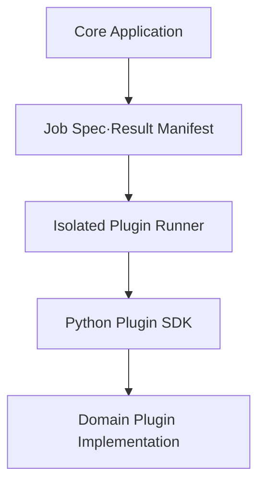

# Plugin SDK와 확장 인터페이스

## 1. 목표와 비목표

### 목표

- 시험 포맷, 처리법, 통계법, 구성방정식, 보정 알고리즘, 검증법, solver card를 core release와 독립적으로 추가한다.
- plugin 실행의 입력·출력·버전·환경을 고정하여 재현한다.
- core DB와 object store credential을 plugin에 직접 주지 않는다.
- Python 외 구현도 language-neutral runner contract를 통해 허용한다.
- 도메인 전문가와 software developer의 책임 경계를 명시한다.

### 비목표

- 임의의 신뢰되지 않은 코드를 web server process에 loading하는 범용 marketplace
- plugin이 core DB schema를 직접 migration하거나 query하는 방식
- UI 화면 전체를 plugin이 임의 JavaScript로 교체하는 방식
- plugin semantic version만 기록하고 실제 package digest를 생략하는 방식

## 2. 두 층의 계약



1. **Runner Contract**: JSON/JSON Schema와 artifact reference로 통신하는 language-neutral 외부 계약
2. **Python SDK**: 도메인 plugin 작성 편의를 위한 typed interface와 test kit

core는 implementation package를 import하지 않고 manifest와 runner capability만 읽는다.

## 3. Plugin package manifest

```json
{
  "manifest_version": "1.0",
  "plugin_id": "com.example.materials.tensile-importer",
  "display_name": "Tensile Test Importer",
  "plugin_version": "1.2.0",
  "package_digest": "sha256:...",
  "contract_api": ">=1.0 <2.0",
  "sdk": {"name": "cmp-python-sdk", "version": "1.1.0"},
  "extensions": [
    {
      "type": "importer",
      "entrypoint": "plugin.importer:TensileImporter",
      "capabilities": ["detect", "mapping-proposal", "import"],
      "input_schema": "schemas/import-request-v1.json",
      "output_schema": "schemas/dataset-manifest-v1.json"
    }
  ],
  "determinism": {"declared": true, "seed_required": false},
  "permissions": {
    "network": "none",
    "artifact_read_roles": ["raw-input"],
    "artifact_write_roles": ["normalized-data", "diagnostic"],
    "max_output_bytes": 2147483648
  },
  "resources": {"cpu": 2, "memory_mb": 4096, "gpu": 0, "timeout_s": 1800},
  "schemas": [{"id": "urn:cmp:plugin:example:tensile:v1", "sha256": "..."}],
  "compatibility": {
    "platform": ">=0.1 <0.2",
    "os_arch": ["linux/amd64"],
    "python": ">=3.12 <3.14"
  },
  "supply_chain": {
    "signature": "registry-reference",
    "sbom": "artifact-reference",
    "source_commit": "git-sha"
  }
}
```

### Manifest 불변조건

- `plugin_id + plugin_version`은 하나의 `package_digest`에만 대응한다. 다른 digest는 새 version이어야 한다.
- schema 파일 자체도 digest로 고정한다.
- capability는 실제 contract test로 검증한다.
- `network: none`이 기본값이다.
- resource declaration은 요청값이며 platform policy가 더 낮게 제한할 수 있다.
- display name은 identity로 사용하지 않는다.

## 4. 공통 Job Spec

```json
{
  "job_spec_version": "1.0",
  "job_id": "uuid",
  "attempt_id": "uuid",
  "extension": {
    "type": "processor",
    "plugin_id": "com.example.processor",
    "plugin_version": "1.0.0",
    "package_digest": "sha256:..."
  },
  "operation": "run",
  "inputs": [
    {
      "role": "dataset",
      "entity_revision_id": "uuid",
      "artifact_id": "uuid",
      "sha256": "hex",
      "media_type": "application/vnd.apache.parquet",
      "access": "runner-scoped-token"
    }
  ],
  "config": {},
  "config_schema_ref": "urn:cmp:schema:processor-config:v1",
  "expected_outputs": [
    {"role": "processed-dataset", "schema_ref": "urn:cmp:schema:dataset:v1"}
  ],
  "execution": {
    "seed": 12345,
    "deadline": "RFC3339",
    "traceparent": "W3C value",
    "locale": "C",
    "timezone": "UTC"
  }
}
```

Job Spec는 구체 revision과 digest만 참조한다. `latest`, path wildcard, mutable URL은 허용하지 않는다.

## 5. 공통 Result Manifest

```json
{
  "result_manifest_version": "1.0",
  "job_id": "uuid",
  "attempt_id": "uuid",
  "status": "succeeded",
  "started_at": "RFC3339",
  "ended_at": "RFC3339",
  "outputs": [
    {
      "role": "processed-dataset",
      "media_type": "application/vnd.apache.parquet",
      "schema_ref": "urn:cmp:schema:dataset:v1",
      "staged_artifact": "runner-output-reference",
      "sha256": "hex",
      "size_bytes": 1000
    }
  ],
  "diagnostics": [
    {"code": "CMP-PROC-0001", "severity": "warning", "message": "...", "evidence": {}}
  ],
  "metrics": {"wall_time_s": 2.1, "peak_memory_mb": 300},
  "reproducibility": {
    "package_digest": "sha256:...",
    "dependency_lock_digest": "sha256:...",
    "seed": 12345,
    "hardware_summary": "cpu"
  }
}
```

`status=failed`인 경우에도 diagnostic/log output을 반환할 수 있다. 예상하지 않은 output role, media type, schema, size는 core가 거부한다.

## 6. 공통 Python SDK protocol

개념적 interface는 다음과 같다. 실제 코드 생성은 repository bootstrap 단계에서 수행한다.

```python
class PluginExtension(Protocol):
    def describe(self) -> ExtensionDescriptor: ...
    def validate_job(self, job: JobSpec) -> ValidationReport: ...
    def run(self, context: RunContext, job: JobSpec) -> ResultManifest: ...
```

`RunContext`는 다음만 제공한다.

- scoped input artifact reader
- bounded output artifact writer
- structured logger/metrics
- cancellation/deadline signal
- temporary workspace
- deterministic RNG helper

DB session, application service, unrestricted HTTP client, permanent filesystem은 제공하지 않는다.

## 7. 확장 인터페이스별 계약

### 7.1 Importer

#### 책임

- raw file format 탐지
- metadata/column/unit mapping proposal
- 사용자가 승인한 mapping revision으로 canonical dataset 생성

#### Operations

```text
detect(raw_asset) -> DetectionReport
propose_mapping(raw_asset, hints?) -> ImportMappingProposal
import(raw_asset, approved_mapping_revision) -> DatasetRevisionManifest
```

#### 입력

- immutable Raw Asset
- optional source context: Test Run/Specimen identifiers
- 승인된 mapping revision

#### 출력

- file type confidence와 근거
- unresolved/ambiguous field 목록
- channel schema, original unit string, normalized unit
- normalized Parquet artifact와 import diagnostics

#### 금지

- low confidence mapping을 자동 확정
- raw asset 수정
- 도메인 entity를 임의 생성·병합

### 7.2 Processor

#### 책임

명시적 ordered operation으로 dataset을 변환한다.

#### Operation

```text
describe_steps() -> StepDescriptors
validate_recipe(input_schema, recipe) -> ValidationReport
run(input_dataset_revisions, recipe_revision) -> DatasetRevisionManifest + diagnostics
```

#### Step descriptor

- input/output semantic schema
- parameter JSON Schema
- deterministic 여부
- unit behavior
- mask/NaN behavior
- edge handling
- diagnostics

#### 예시 범주

crop, zero/offset correction, channel transform, unit normalization, smoothing, resampling/alignment, feature extraction, manual control-point edit. 구체 step은 domain plugin에서 결정한다.

### 7.3 Statistical Analyzer

#### 책임

- immutable Selection Revision의 scalar/functional statistics 계산
- QC observation과 outlier candidate 생성
- grouping/assumption/method를 결과에 포함

#### Operation

```text
validate_plan(selection_schema, statistical_plan) -> ValidationReport
analyze(selection_revision, statistical_plan_revision)
    -> StatisticalResultManifest + QCObservation[] + OutlierCandidate[]
```

#### 금지

- input membership 변경
- outlier 자동 삭제
- 숨은 curve alignment/extrapolation

### 7.4 Material Model

#### 책임

- model family payload schema 제공
- parameter·table·convention semantic validation
- 주어진 experiment/response descriptor에서 model prediction 또는 material-point response 제공
- IR payload 생성/검증

#### Operation

```text
get_model_schema() -> ModelSchemaDescriptor
validate_ir(ir_document) -> ValidationReport
evaluate(evaluation_request, parameter_set) -> PredictedResponse
physical_checks(ir_document) -> PhysicalCheckReport
```

#### 주의

모든 model을 하나의 `stress = f(strain)` 함수로 축소하지 않는다. history, tensor, temperature, rate, internal variable가 필요한 model은 plugin schema와 evaluator capability로 표현한다.

### 7.5 Calibrator

#### 책임

- objective, weights, bounds, constraints, optimizer settings를 적용
- Material Model evaluator를 호출해 parameter를 식별
- convergence, residual, candidate, uncertainty/identifiability diagnostics 생성

#### Operation

```text
validate_plan(model_schema, data_schema, calibration_plan) -> ValidationReport
calibrate(model_evaluator, selection_revision, calibration_plan_revision)
    -> CalibrationResultManifest
```

논리 interface는 분리하되 성능을 위해 runner가 Material Model과 Calibrator를 같은 isolated process/container에 load할 수 있다. core는 두 package digest와 interface를 각각 기록한다.

### 7.6 Validator

#### 책임

- IR semantic/physical rule 검사
- calibration result와 holdout data 비교
- solver result extraction 후 experimental response와 비교
- validation metric 및 verdict evidence 생성

#### Operation

```text
validate_plan(validation_plan) -> ValidationReport
validate_artifact(input_entities, plan_revision) -> ValidationResultManifest
```

Validator는 solver 실행 자체를 수행할 수도 있지만 권고 구조는 별도 `SolverRunnerAdapter`가 실행하고 Validator가 결과를 판정하는 것이다.

### 7.7 Solver Exporter

#### 책임

- 지원 solver/version/card/IR capability 선언
- preflight mapping report 생성
- approved mapping policy 아래 card 생성
- syntax/semantic normalization hook 제공

#### Operation

```text
capabilities() -> ExportCapabilityDescriptor
preflight(ir_revision, target, options) -> MappingReport
export(ir_revision, approved_mapping_report, target, options)
    -> SolverCardManifest
validate_card(card_artifact, target) -> ValidationReport
normalize_for_comparison(card_artifact, target) -> SemanticCardRepresentation
```

`preflight`와 `export` 사이 IR, exporter digest, target/options가 달라지면 mapping approval은 무효다.

## 8. 보조 확장점

다음은 MVP 필수 7종 외의 platform adapter다.

| 확장점 | 목적 |
| --- | --- |
| `SolverRunnerAdapter` | local/HPC scheduler, license, submit/poll/cancel/result collect |
| `ValidationTemplateProvider` | geometry/mesh/BC/extraction template bundle |
| `IdentityProviderAdapter` | enterprise group/claim mapping |
| `EnterpriseConnector` | PLM/LIMS/ERP/CAE downstream integration |
| `ReportRenderer` | release/validation human-readable report |

## 9. Plugin 설치와 활성화

1. package upload/registry reference 등록
2. digest, signature, SBOM, license policy 확인
3. manifest/schema validation
4. malware/vulnerability scan
5. compatibility test kit 실행
6. domain evidence와 reviewer 승인
7. organization/project allowlist에 activation
8. runner image pull/cache 및 smoke test
9. 활성화 event/audit 기록

폐기된 plugin으로 과거 run을 조회할 수 있어야 한다. 재실행이 필요하면 동일 digest image를 retention하거나 `unavailable-for-rerun` 상태를 명시한다.

## 10. Version compatibility

| 대상 | 정책 |
| --- | --- |
| Runner contract | major breaking, minor additive |
| Python SDK | semantic version; adapter/deprecation window |
| Plugin manifest | JSON Schema version 고정 |
| Model payload | model family별 독립 schema version |
| Material Model IR envelope | platform-wide version |
| Result artifact schema | media type + schema version |

core는 plugin `contract_api` range를 검사한다. 자동 shim은 의미가 명확한 additive change에만 사용한다. 과학 semantic change는 migration plugin과 새 revision을 요구한다.

## 11. Compatibility Test Kit

모든 plugin은 다음을 통과해야 한다.

- manifest/schema positive·negative test
- declared capability consistency
- deterministic/reseed behavior
- corrupt/missing input artifact handling
- unit and quantity-kind mismatch handling
- cancellation/deadline
- output role/type/size limit
- no-network policy
- path traversal/symlink escape
- resource exhaustion
- structured diagnostic code
- provenance fields completeness
- plugin-specific scientific reference fixtures
- backward compatibility fixtures

Solver Exporter는 추가로 golden-file, semantic parse/normalize, unsupported mapping, unit-system conversion, solver-version fixture를 통과한다.

## 12. 책임 분담

| 작업 | Software Developer | Domain Expert |
| --- | --- | --- |
| SDK/runner/security | 주 담당 | 요구 검토 |
| JSON Schema/contract | 주 담당 | semantic 필드 승인 |
| 시험 format parser | 구현 | sample·mapping·예외 승인 |
| Processor numeric step | 안정적 구현·테스트 | 수학·물리 방법과 parameter 승인 |
| Statistical method | 구현·reference test | population/assumption/판정 정책 승인 |
| Material Model evaluator | 수치 구현 | 방정식·convention·validity 승인 |
| Calibrator | optimizer 구현 | objective/constraint/identifiability 승인 |
| Solver Exporter | parser/formatter 구현 | solver keyword/mapping/unit 승인 |
| Validation Template | runner/automation 구현 | geometry/BC/metric/threshold 승인 |
| Plugin release | supply-chain/compatibility | scientific acceptance |

production plugin은 두 책임 축의 승인 없이 활성화하지 않는다.

