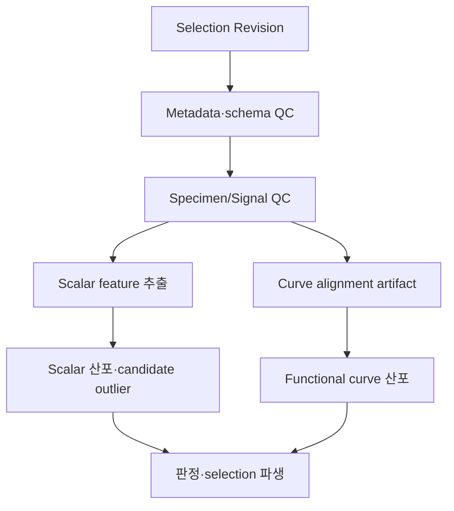

# 반복시험 산포 분석 및 통계 모듈 요구사항

## 1. 목적

반복시험에서 개별 specimen의 차이, 측정 품질, lot/batch 및 시험조건 효과를 보존하면서 보정에 사용할 데이터 population을 설명한다. 통계 모듈은 평균 곡선을 만들어 원본을 대체하는 도구가 아니다.

NIST는 outlier를 다른 관측치에서 현저히 벗어난 관측치로 설명하지만, 정상 관측의 특성을 먼저 정하고 방법의 가정을 확인해야 한다고 강조한다. [NIST Outlier Detection](https://www.itl.nist.gov/div898/handbook/eda/section3/eda35h.htm) Curve 자체가 관측값인 functional data에는 scalar 통계와 다른 접근이 필요하다. [NIST Functional Analysis of Variance](https://www.nist.gov/programs-projects/functional-analysis-variance)

## 2. 통계 단위

### 2.1 기본 독립 표본

기본 replicate unit은 `Specimen` 또는 독립된 `Test Run`이다. 한 curve의 수천 point는 수천 개의 독립 표본이 아니다.

### 2.2 Population key

모든 Statistical Plan은 최소 다음 key를 명시한다.

- Material Revision
- Material State Revision
- source Lot/Batch 또는 grouping policy
- Test Method Revision
- specimen orientation/geometry class
- Test Condition strata: temperature, rate, humidity 등
- conditioning/preparation policy
- 포함 Selection Revision
- replicate unit

값이 다르거나 누락된 group을 무조건 합치지 않는다. merge에는 명시적 policy와 경고가 필요하다.

## 3. 분석 단계



Curve alignment는 Processor run이며 Statistical Analyzer 내부의 숨은 변환이 아니다.

## 4. QC 계층

| 계층 | 예시 검사 | 결과 |
| --- | --- | --- |
| Import QC | parse, row count, encoding, duplicate time | import diagnostic |
| Schema/Unit QC | required channel, unit dimension, quantity kind | blocking/warning observation |
| Metadata QC | specimen, lot/batch, method, condition completeness | issue/observation |
| Signal QC | time monotonicity, saturation, gaps, NaN, oscillation | specimen-channel evidence |
| Specimen QC | geometry range, orientation, failure location | specimen observation |
| Cross-replicate QC | feature/curve deviation, population inconsistency | outlier candidate |
| Model-readiness QC | 필요한 loading mode/rate/temp coverage | calibration-readiness report |

QC result 상태는 `pass`, `warning`, `fail`, `not_evaluated`다. `not_evaluated`를 pass처럼 표시하지 않는다.

## 5. Scalar feature

구체 feature는 시험 plugin이 정의한다. 플랫폼은 다음 공통 contract를 제공한다.

```json
{
  "feature_id": "plugin-stable-id",
  "display_name": "TBD",
  "quantity_kind": "TBD",
  "value": 0.0,
  "unit": "TBD",
  "specimen_id": "uuid",
  "test_run_revision_id": "uuid",
  "extraction_method": {
    "plugin_package_digest": "sha256:...",
    "config": {},
    "source_curve_revision_id": "uuid"
  },
  "quality": "valid | censored | missing | invalid",
  "evidence": {}
}
```

Feature 이름만 같고 extraction method가 다르면 같은 값으로 합치지 않는다.

## 6. Scalar descriptive statistics

### 6.1 MVP 지원

- count `n`, missing/invalid/censored count
- mean, sample standard deviation, standard error
- median, MAD, IQR
- min/max, configurable quantiles
- coefficient of variation; mean이 0에 가깝거나 scale 의미가 없으면 undefined/warning
- confidence interval: method와 confidence level 명시
- bootstrap interval: specimen/test-run을 resampling unit으로 사용

### 6.2 보고 규칙

- `n` 없이 평균/분산을 표시하지 않는다.
- confidence interval, prediction interval, tolerance interval을 같은 이름으로 쓰지 않는다.
- small `n`에서 정규성 가정 기반 결과는 assumption warning을 표시한다.
- 반올림 전 machine value와 표시 precision을 분리한다.
- 단위 변환 후 statistics를 계산한 경우 normalized unit과 변환 provenance를 표시한다.

## 7. Curve ensemble statistics

### 7.1 전제 조건

곡선끼리 pointwise statistic을 계산하려면 다음이 동일하거나 명시적으로 변환되어야 한다.

- x-axis quantity kind와 measure
- y-axis quantity kind와 measure
- units
- loading segment/방향
- monotonic/order policy
- domain과 grid

### 7.2 Alignment/Resampling recipe

```json
{
  "domain_policy": "intersection | union_with_mask | explicit",
  "grid_policy": "reference_curve | fixed_step | fixed_count | explicit",
  "interpolation": "linear | monotone_cubic | plugin_defined",
  "extrapolation": "none",
  "event_alignment": "none | plugin_defined",
  "segment_selection": "plugin_defined",
  "missing_policy": "mask"
}
```

기본값은 `intersection` 또는 `union_with_mask`, `extrapolation=none`이다. failure 이후 point가 없는 specimen을 임의로 연장하지 않는다.

### 7.3 결과

- pointwise `n(x)`
- mean/median curve
- SD/MAD/IQR/quantile band
- confidence band는 pointwise인지 simultaneous인지 명시
- each-specimen residual/deviation curve
- curve coverage/mask
- display용 downsampled artifact와 계산용 full artifact 분리

Pointwise mean curve가 실제 가능한 material response인지 자동 가정하지 않는다. 보정 입력으로 사용하려면 별도 Selection/Processing decision이 필요하다.

## 8. Outlier candidate와 판정

### 8.1 후보 방법

MVP는 plugin으로 다음 범주를 허용한다.

- metadata/rule violation
- robust univariate score: median/MAD, IQR 기반
- distribution-assumption test: Grubbs/Tietjen-Moore 등, 가정·sample size가 맞을 때만
- curve distance: integrated normalized residual, feature-vector distance
- domain rule: failure outside gauge, grip slip, sensor saturation

NIST는 Grubbs test가 mean과 standard deviation에 대한 최대 표준화 편차를 사용하며 정상성 가정을 전제로 한다. [NIST Grubbs Test](https://www.itl.nist.gov/div898/handbook/eda/section3/eda35h1.htm) 따라서 이를 모든 dataset의 기본 삭제 규칙으로 사용하지 않는다.

### 8.2 Candidate schema

```json
{
  "candidate_id": "uuid",
  "subject": {"type": "test_run", "id": "uuid"},
  "scope": {"feature_id": "TBD", "range": null},
  "method": {
    "id": "TBD",
    "plugin_digest": "sha256:...",
    "parameters": {},
    "assumptions": []
  },
  "score": 0.0,
  "threshold": 0.0,
  "evidence_artifact_id": "uuid",
  "status": "candidate"
}
```

### 8.3 사람 판정

| Decision | 의미 |
| --- | --- |
| `not_outlier` | 후보를 기각하고 포함 유지 |
| `exclude_for_analysis` | 지정 analysis/selection에서만 제외 |
| `exclude_for_calibration` | 지정 calibration input에서만 제외 |
| `invalid_test` | 시험 자체가 무효라는 기술 판정; 데이터는 보존 |
| `needs_retest` | 재시험 issue 생성 |
| `needs_investigation` | 결론 보류 |

판정에는 reason code, free-text rationale, evidence, reviewer, scope, timestamp가 필수다. 일괄 판정도 각 subject에 decision record를 만든다.

## 9. Lot/Batch 및 조건 효과

### MVP

- strata별 summary와 visualization
- group별 n/mean/SD/median/MAD
- variance equality/shift test는 method와 assumptions를 표시
- lot/batch, orientation, temperature, rate의 비교 table/plot

### 후속

- nested/hierarchical model
- random/mixed effects로 lot, operator, instrument 분해
- Gauge R&R/measurement system analysis
- functional ANOVA/functional PCA
- tolerance basis 및 allowables workflow
- calibration uncertainty propagation ensemble

표본 설계가 없는 데이터에서 variance component를 억지로 계산하지 않는다.

## 10. Repeatability, reproducibility, uncertainty

- Repeatability: 동일 또는 충분히 유사한 조건의 반복 산포
- Reproducibility: laboratory/operator/instrument/day 등의 조건 변화까지 포함한 산포
- Measurement uncertainty: measurand와 측정 방법, calibration, repeatability/reproducibility 등 근거가 필요

NIST는 measurand가 특정 measurement method로 정의될 때 그 방법과 uncertainty 근거를 명확히 보고해야 한다고 설명한다. [NIST Technical Note 1297](https://emtoolbox.nist.gov/publications/nisttechnicalnote1297s.pdf)

MVP는 반복시험 descriptive scatter를 제공하되 이를 완전한 measurement uncertainty budget이라고 부르지 않는다.

## 11. Statistical Plan

```json
{
  "plan_revision_id": "uuid",
  "input_selection_revision_id": "uuid",
  "replicate_unit": "specimen",
  "grouping_keys": ["material_state", "lot", "test_condition.temperature"],
  "features": ["plugin-feature-id"],
  "scalar_methods": [{"id": "descriptive-v1", "config": {}}],
  "curve_method": {
    "aligned_dataset_revision_id": "uuid",
    "statistics": ["mean", "median", "sd", "q05", "q95"]
  },
  "outlier_detectors": [],
  "confidence_level": 0.95,
  "bootstrap": {"enabled": true, "resampling_unit": "specimen", "seed": 12345},
  "assumption_policy": "warn_and_continue | fail"
}
```

## 12. Statistical Result Manifest

결과에는 다음이 필수다.

- plan/input selection IDs와 digests
- plugin package/schema versions
- population/group definitions
- n/missing/censored
- scalar result artifact
- full curve-statistics artifact
- visualization artifact
- assumptions/checks/warnings
- QC observations/outlier candidates
- seed/environment
- provenance activity ID

## 13. UI 요구사항

- 개별 curve와 summary band를 동시에 표시
- raw/processed/aligned 상태를 명확히 label
- 동일 scale/units로 비교; 자동 단위 변환 시 표시
- specimen/lot/batch/condition filter
- curve hover에서 specimen/test-run provenance
- outlier candidate를 숨기지 않고 style로 표시
- exclusion on/off에 따른 결과 비교
- `n(x)`가 감소하는 domain 표시
- 통계 method, assumptions, plan revision 접근
- plot 선택이 dataset을 직접 수정하지 않음

## 14. 테스트 요구사항

- analytically known scalar fixture
- small-n, all-equal, one-value, missing, zero-mean CV edge cases
- unit-converted equivalent dataset invariance
- point count 증가가 replicate n을 바꾸지 않는 test
- alignment domain/mask/extrapolation negative test
- bootstrap seed reproducibility
- outlier candidate 생성 후 input digest 불변 test
- adjudication scope isolation
- group leakage 및 Simpson's paradox 경고 fixture
- curve result full artifact와 display downsample 분리 test

## 15. 책임 분담

| 항목 | Software Developer | Domain/Statistics Expert |
| --- | --- | --- |
| execution/schema/performance | 주 담당 | 검토 |
| replicate/population 정의 | 구현 지원 | 주 담당 |
| feature/QC rule 정의 | 구현 | 주 담당 |
| statistical method/assumption | 안정적 구현 | 선택·승인 |
| outlier 판정 정책 | workflow 구현 | 주 담당 |
| reference dataset/tolerance | harness 구현 | expected result 승인 |

