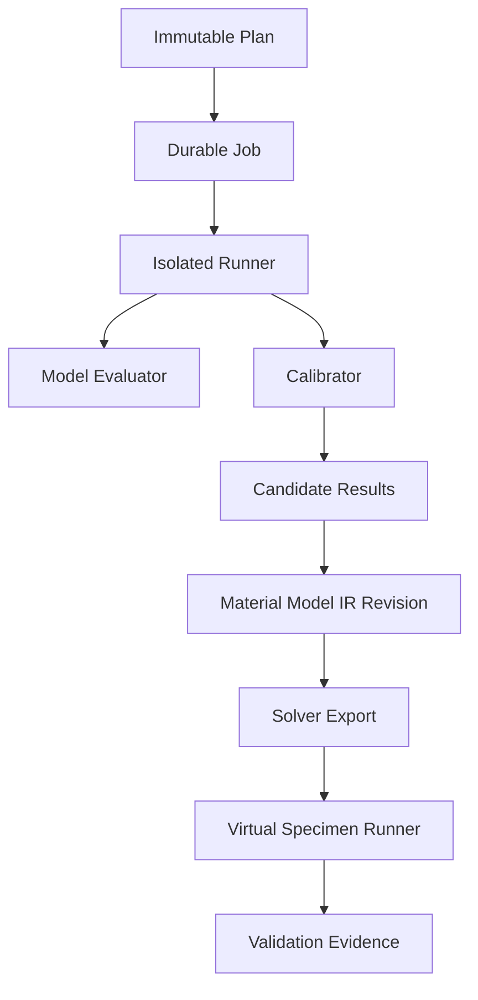

# Fitting 및 검증 실행 구조

## 1. 핵심 구분

| 개념 | 역할 |
| --- | --- |
| Material Model | 주어진 parameter와 history/condition에서 response를 정의 |
| Calibrator | data와 model response의 차이를 줄이도록 parameter 탐색 |
| Processing | calibration에 들어갈 관측량을 명시적으로 변환 |
| Calibration Check | optimizer/convergence/residual/identifiability 점검 |
| Validation | 보정에 사용하지 않은 evidence 또는 가상 시험으로 사용 목적 적합성 평가 |
| Solver Export | IR을 target solver representation으로 mapping |
| Numerical Verification | solver/card/template가 의도대로 계산되는지 점검 |

낮은 objective value만으로 validation pass를 만들지 않는다.

제품의 우선순위는 Material data management와 solver card 활용이다. 따라서 첫
Material→IR→card 수직 기능은 calibration 없이 manual typed property로 시작한다.
Calibration은 이후 `Processing`, `Modeling`, `Validation`에 흡수되는 bounded
capability이며 MCalibration형 독립 제품이나 module을 만들지 않는다(ADR-006).

## 2. 실행 계층



core는 plan, job, artifact, provenance, lifecycle을 관리한다. model calculation은 plugin runner, solver calculation은 solver/HPC runner가 수행한다.

## 3. Calibration Plan

```json
{
  "calibration_plan_version": "1.0",
  "plan_revision_id": "uuid",
  "input_selection_revision_id": "uuid",
  "processed_dataset_revision_ids": ["uuid"],
  "model_family": {
    "id": "TBD",
    "schema_version": "TBD",
    "plugin_package_digest": "sha256:..."
  },
  "calibrator": {
    "plugin_id": "TBD",
    "package_digest": "sha256:...",
    "algorithm": "TBD"
  },
  "parameters": [
    {
      "id": "TBD",
      "initial": null,
      "lower": null,
      "upper": null,
      "unit": "TBD",
      "transform": "none | log | plugin_defined"
    }
  ],
  "objective": {
    "terms": [],
    "aggregation": "TBD",
    "normalization": "TBD"
  },
  "constraints": [],
  "optimizer_settings": {},
  "multi_start": {"count": 1, "strategy": "TBD"},
  "seed": 12345,
  "stopping": {},
  "resource_profile": "cpu-standard"
}
```

모델·solver가 결정되지 않았으므로 구체 objective/parameter를 확정하지 않는다.

## 4. Objective와 weighting contract

각 objective term은 최소 다음을 가진다.

- observable/response semantic
- specimen/test/run selection
- x/domain selection
- residual definition
- normalization/scale
- point/curve/specimen weight
- missing/censoring policy
- aggregation order

중요한 규칙:

1. point가 많은 curve가 자동으로 더 큰 specimen weight를 갖지 않도록 aggregation을 명시한다.
2. 서로 다른 단위 response는 normalization 없이 단순 합산하지 않는다.
3. smoothing/resampling은 objective 내부에 숨기지 않고 processed input revision으로 고정한다.
4. fitting domain 밖 extrapolation은 별도 penalty 또는 validation 문제로 명시한다.
5. 사용자 수동 weight 변경은 plan revision을 만든다.

## 5. Model evaluation

Model plugin은 supported evaluation mode를 선언한다.

| Mode | 설명 |
| --- | --- |
| `closed_form_curve` | 입력 curve coordinate에서 직접 response 계산 |
| `material_point` | increment history를 따라 constitutive update |
| `reduced_specimen` | 경량 internal numerical model |
| `external_solver_required` | fitting loop 또는 validation에 solver 필요 |

모든 model을 closed-form curve로 가정하지 않는다. internal state가 있는 model은 state initialization, time integration, convergence, tangent/cutback behavior를 evaluator contract에 포함한다.

## 6. Calibration run과 attempt

### 6.1 Run

하나의 고정된 plan을 실행하는 논리 activity다.

### 6.2 Attempt

worker/runner 재시도 또는 multi-start candidate 실행 단위다. infrastructure retry와 optimizer multi-start를 별도 field로 구분한다.

### 6.3 기록 항목

- plan/config canonical digest
- input entity/artifact digests
- model/calibrator package and schema digests
- dependency lock, OS/container, source commit
- seed/RNG version
- CPU/GPU/hardware summary
- started/ended/elapsed
- initial parameter, bounds, scaled parameter
- convergence code/reason
- objective history and final terms
- residual artifact
- warnings, exception category, partial results
- peak memory/resource usage

## 7. Calibration result

```json
{
  "status": "converged | stopped | failed | invalid",
  "candidate_id": "uuid",
  "parameters": [],
  "objective": {"total": null, "terms": []},
  "convergence": {
    "iterations": 0,
    "evaluations": 0,
    "reason": "TBD",
    "gradient_or_step_norm": null
  },
  "residual_artifact_id": "uuid",
  "prediction_artifact_id": "uuid",
  "identifiability": {
    "status": "provided | not_provided | warning",
    "artifact_id": null
  },
  "uncertainty": {
    "status": "provided | not_provided | warning",
    "artifact_id": null
  },
  "diagnostics": []
}
```

`converged`는 domain acceptance가 아니다. 사용자가 candidate를 IR로 승격할 때 이유와 비교 evidence를 기록한다.

## 8. Reproducibility 수준

| 수준 | 의미 |
| --- | --- |
| R0 | 설정 이름만 있음; release 불가 |
| R1 | input/config/plugin version 있음 |
| R2 | digest, dependency lock, seed, environment 있음 |
| R3 | 재실행 결과가 declared tolerance 내 일치 |
| R4 | independent reference implementation/solver와 교차 검증 |

MVP production release는 최소 R2, deterministic reference workflow는 R3를 요구한다.

Floating-point, parallel reduction, external solver 때문에 byte identity가 불가능하면 plugin이 field별 absolute/relative tolerance와 nondeterministic source를 선언한다.

## 9. Validation hierarchy

### 9.1 V0 Schema/semantic

- IR schema, units, required fields
- parameter range, table ordering
- convention consistency

### 9.2 V1 Material-point/analytical verification

- known limit behavior
- invariance/symmetry/monotonicity/energy checks
- plugin reference fixture

### 9.3 V2 Calibration data diagnostic

- fitted response와 input comparison
- residual structure
- per-specimen/group error

이는 validation이 아니라 fit diagnostic에 가깝다.

### 9.4 V3 Holdout validation

- calibration에 포함되지 않은 specimen/condition
- 사전에 고정한 metrics/threshold
- input overlap 검사

### 9.5 V4 Virtual specimen solver validation

- target solver card와 versioned specimen template
- 실험 response extraction과 solver result comparison
- numerical health와 experimental metric 분리

### 9.6 V5 Application validation

실제 component/loading application에서 확인한다. MVP 비범위이지만 release profile이 필요 시 evidence를 요구할 수 있다.

## 10. Virtual Specimen Template

Template bundle은 다음을 digest로 고정한다.

- geometry source와 version
- mesh 또는 mesh-generation parameters
- element formulation/integration settings
- coordinate/material orientation
- boundary/loading history
- contact 및 numerical controls
- requested output
- result extraction script/plugin
- reference experimental observable mapping
- numerical health rule
- comparison metrics/threshold profile

Template는 solver-neutral일 수 있는 부분과 target-specific deck fragment를 구분한다. 모든 solver에 완전 중립인 mesh/BC representation을 억지로 만들지 않는다.

## 11. Validation Plan

```json
{
  "plan_revision_id": "uuid",
  "kind": "virtual_specimen",
  "material_model_ir_revision_id": "uuid",
  "solver_card_revision_id": "uuid",
  "validation_template_revision_id": "uuid",
  "experimental_selection_revision_id": "uuid",
  "solver_target": {"name": "TBD", "version": "TBD"},
  "runner_capability_id": "uuid",
  "execution_options": {},
  "extraction_plugin_digest": "sha256:...",
  "metrics_profile_revision_id": "uuid",
  "pass_policy_revision_id": "uuid"
}
```

## 12. Solver runner flow

1. exporter output과 mapping report digest 확인
2. template bundle + card로 immutable solver input deck 생성
3. license/HPC preflight
4. scheduler submit; external ID 기록
5. queue/license/run 상태 polling 또는 callback
6. stdout/stderr/termination/native result 수집
7. result artifact digest 검증
8. extractor plugin으로 normalized response 생성
9. validator plugin으로 metrics/verdict 생성
10. provenance와 result commit

Solver 실행 성공과 validation pass를 같은 status로 쓰지 않는다.

## 13. Numerical health

구체 solver rule은 plugin이 정의하지만 공통 schema는 다음을 수용한다.

- 정상/비정상 termination
- warning/error code count
- time increment/cutback behavior
- nonconvergence/divergence
- mass/energy balance 또는 solver-specific diagnostic
- element distortion/deletion 같은 상태
- NaN/Inf output
- requested end time/step 도달 여부

수치 health fail이면 experimental error가 낮아도 release validation을 통과하지 않는다.

## 14. Experimental comparison metric

Metric plugin은 다음을 선언한다.

- response quantity/units/measure
- time/strain/event alignment
- comparison domain
- normalization
- scalar metric formula
- aggregation across specimens
- threshold와 direction
- missing/truncated curve policy

예시 범주는 RMSE, normalized error, peak/area/characteristic-point error, curve distance다. 실제 MVP metric은 `TBD`다.

## 15. Failure taxonomy

| Category | 예시 | 자동 retry |
| --- | --- | --- |
| `input_invalid` | schema/unit/missing metadata | 아니오 |
| `model_invalid` | parameter/physical rule violation | 아니오 |
| `optimizer_failed` | line search/convergence | plan policy에 따라 |
| `resource_exhausted` | memory/time quota | 더 큰 profile 승인 후 |
| `runner_unavailable` | worker/HPC outage | 예, backoff |
| `license_unavailable` | license queue/denial | policy에 따라 |
| `solver_failed` | abnormal termination | 원인에 따라 수동 |
| `output_invalid` | missing/corrupt result | 제한적 |
| `validation_failed` | metric threshold fail | 아니오; 결과 보존 |
| `cancelled` | 사용자/policy 취소 | 아니오 |

실패를 모두 generic exception으로 저장하지 않는다.

## 16. Release gate

최소 조건:

- selected calibration candidate와 이유
- model/IR L0~L3 validation
- calibration input과 validation input overlap report
- required virtual specimen run 완료
- numerical health pass
- metrics profile에 따른 validation 결과
- exporter mapping에 unsupported 0건
- approximation은 승인된 exception
- complete provenance와 artifact integrity
- domain reviewer/approver decision

## 17. 첫 vertical slice 결정 게이트

도메인 전문가가 다음을 확정해야 production plugin 개발을 시작한다.

1. 재료군과 시험 표준
2. raw file sample 및 channel/metadata
3. engineering/true stress-strain 변환 책임과 necking 이후 처리
4. model family/parameterization
5. objective, weighting, bounds, constraints
6. first solver/version/card
7. virtual specimen template와 extracted response
8. acceptance metric/threshold
9. 최소 golden card와 reference simulation

결정 전 core는 synthetic curve와 analytic model을 사용한 reference plugin으로 orchestration과 provenance만 검증한다. 이 reference는 production 재료모델로 발행할 수 없다.

## 18. 책임 분담

| 영역 | Software Developer | Domain Expert |
| --- | --- | --- |
| job/runner/retry/artifact | 주 담당 | 운영 요구 검토 |
| optimizer implementation | 수치 안정 구현 | 방법·parameter 승인 |
| constitutive evaluator | code·test | 방정식·convention·limit 승인 |
| objective/weight | framework | 정의·승인 |
| solver template automation | 구현 | geometry/BC/output 승인 |
| result extraction | 구현 | observable mapping 승인 |
| metric/threshold | 계산 구현 | 적합성 기준 승인 |
| release evidence | 자동 gate | 기술 승인 |

