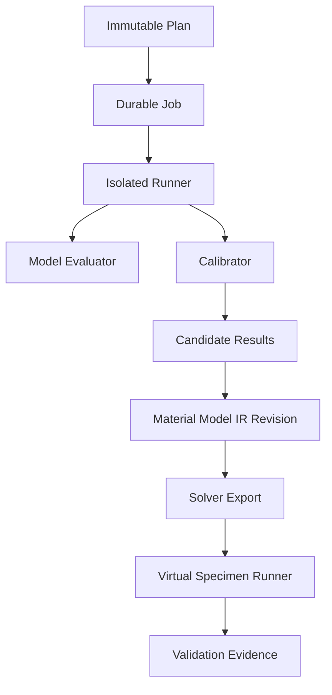

# Fitting 및 검증 실행 구조

## 1. 핵심 구분

| 개념 | 역할 |
| --- | --- |
| Material Model | 주어진 parameter와 history/condition에서 response를 정의 |
| Calibrator | data와 model response의 차이를 줄이도록 parameter 탐색 |
| Processing | calibration에 들어갈 관측량을 명시적으로 변환 |
| Calibration Check | optimizer/convergence/residual/identifiability 점검 |
| Validation | 보정에 사용하지 않은 evidence 또는 가상 시험으로 사용 목적 적합성 평가 |
| Solver Export | IR을 target solver representation으로 mapping |
| Numerical Verification | solver/card/template가 의도대로 계산되는지 점검 |

낮은 objective value만으로 validation pass를 만들지 않는다.

제품의 우선순위는 Material data management와 solver card 활용이다. 따라서 첫
Material→IR→card 수직 기능은 calibration 없이 manual typed property로 시작한다.
Calibration은 이후 `Processing`, `Modeling`, `Validation`에 흡수되는 bounded
capability이며 MCalibration형 독립 제품이나 module을 만들지 않는다(ADR-006).

### 1.1 ADR-0019의 현재 실행 경계

현재 구현 순서는 live PostgreSQL gate(`P0-1`)와 multi-replicate processing/statistics
vertical(`P0-2`) 다음에 nonlinear calibration-to-card(`P1`)를 둔다. P1의 첫 evaluator는
synthetic monotonic tensile fixture에 한정한 non-production reference Voce saturation law다.

```text
sigma_y(epsilon_p) = sigma_0 + Q * (1 - exp(-b * epsilon_p))
```

SciPy `least_squares`는 첫 reference `OptimizerAdapter`일 뿐 production optimizer policy가
아니다. initial value, lower/upper bounds, scaling/transform, seed, multistart, stop reason과
library version을 Plan/Attempt evidence로 고정한다. `TestModeAdapter`,
`MaterialModelEvaluator`, `ObjectiveEngine`, `OptimizerAdapter` 경계는 분리하고, objective
term/curve/specimen/point weights와 missing-data/domain policy를 암묵적으로 채우지 않는다.

Candidate 선택은 calibrated solver-neutral IR revision을 append한다. 기존 두 exporter에
전달할 tabulated-plasticity IR은 별도 deterministic projection activity로 만들고 sampling
grid, Artifact digest, source Candidate/Selection, applicability와 extrapolation을 보존한다.
P1 검증 범위는 아래 V1 material-model response와 V3 disjoint holdout까지다. V4 실제
OpenRadioss/Abaqus execution, data-check/dry-run, HPC와 solver qualification은 제품 소유자
결정에 따라 P2로 보류한다. 기존 T-27/T-28 reference records는 유지하되 solver pass로
해석하지 않는다.

## 2. 실행 계층



core는 plan, job, artifact, provenance, lifecycle을 관리한다. model calculation은 plugin runner, solver calculation은 solver/HPC runner가 수행한다.

## 3. Calibration Plan

```json
{
  "calibration_plan_version": "1.0",
  "plan_revision_id": "uuid",
  "input_selection_revision_id": "uuid",
  "processed_dataset_revision_ids": ["uuid"],
  "model_family": {
    "id": "TBD",
    "schema_version": "TBD",
    "plugin_package_digest": "sha256:..."
  },
  "calibrator": {
    "plugin_id": "TBD",
    "package_digest": "sha256:...",
    "algorithm": "TBD"
  },
  "parameters": [
    {
      "id": "TBD",
      "initial": null,
      "lower": null,
      "upper": null,
      "unit": "TBD",
      "transform": "none | log | plugin_defined"
    }
  ],
  "objective": {
    "terms": [],
    "aggregation": "TBD",
    "normalization": "TBD"
  },
  "constraints": [],
  "optimizer_settings": {},
  "multi_start": {"count": 1, "strategy": "TBD"},
  "seed": 12345,
  "stopping": {},
  "resource_profile": "cpu-standard"
}
```

모델·solver가 결정되지 않았으므로 구체 objective/parameter를 확정하지 않는다.

## 4. Objective와 weighting contract

각 objective term은 최소 다음을 가진다.

- observable/response semantic
- specimen/test/run selection
- x/domain selection
- residual definition
- normalization/scale
- point/curve/specimen weight
- missing/censoring policy
- aggregation order

중요한 규칙:

1. point가 많은 curve가 자동으로 더 큰 specimen weight를 갖지 않도록 aggregation을 명시한다.
2. 서로 다른 단위 response는 normalization 없이 단순 합산하지 않는다.
3. smoothing/resampling은 objective 내부에 숨기지 않고 processed input revision으로 고정한다.
4. fitting domain 밖 extrapolation은 별도 penalty 또는 validation 문제로 명시한다.
5. 사용자 수동 weight 변경은 plan revision을 만든다.

## 5. Model evaluation

Model plugin은 supported evaluation mode를 선언한다.

| Mode | 설명 |
| --- | --- |
| `closed_form_curve` | 입력 curve coordinate에서 직접 response 계산 |
| `material_point` | increment history를 따라 constitutive update |
| `reduced_specimen` | 경량 internal numerical model |
| `external_solver_required` | fitting loop 또는 validation에 solver 필요 |

모든 model을 closed-form curve로 가정하지 않는다. internal state가 있는 model은 state initialization, time integration, convergence, tangent/cutback behavior를 evaluator contract에 포함한다.

## 6. Calibration run과 attempt

### 6.1 Run

하나의 고정된 plan을 실행하는 논리 activity다.

### 6.2 Attempt

worker/runner 재시도 또는 multi-start candidate 실행 단위다. infrastructure retry와 optimizer multi-start를 별도 field로 구분한다.

### 6.3 기록 항목

- plan/config canonical digest
- input entity/artifact digests
- model/calibrator package and schema digests
- dependency lock, OS/container, source commit
- seed/RNG version
- CPU/GPU/hardware summary
- started/ended/elapsed
- initial parameter, bounds, scaled parameter
- convergence code/reason
- objective history and final terms
- residual artifact
- warnings, exception category, partial results
- peak memory/resource usage

## 7. Calibration result

```json
{
  "status": "converged | stopped | failed | invalid",
  "candidate_id": "uuid",
  "parameters": [],
  "objective": {"total": null, "terms": []},
  "convergence": {
    "iterations": 0,
    "evaluations": 0,
    "reason": "TBD",
    "gradient_or_step_norm": null
  },
  "residual_artifact_id": "uuid",
  "prediction_artifact_id": "uuid",
  "identifiability": {
    "status": "provided | not_provided | warning",
    "artifact_id": null
  },
  "uncertainty": {
    "status": "provided | not_provided | warning",
    "artifact_id": null
  },
  "diagnostics": []
}
```

`converged`는 domain acceptance가 아니다. 사용자가 candidate를 IR로 승격할 때 이유와 비교 evidence를 기록한다.

### 7.1.1 Implemented bounded multi-test Ogden evidence

T-43 migration 054와 protected API는 one-term incompressible Ogden reference fitting에 대해
다음 concrete 계약을 구현한다.

- Plan은 exact scientific Profile, Material State, baseline Ogden--Prony IR과 1~24 governed
  normalized Dataset revisions를 pin한다.
- 각 member는 calibration/holdout 역할, uniaxial/planar/equibiaxial mode와 positive weight를
  명시하며 같은 Dataset revision을 중복 사용하지 않는다. Governed Dataset의 Test Run은
  해당 mode의 explicit reference Test Method revision도 고정한다.
- normalized weighted residual은 point, curve, mode 순서로 집계한다. mode별 curve 수와
  point 수가 많다는 이유만으로 objective를 지배하지 않는다.
- deterministic PCG64 multistart와 SciPy `least_squares(method="trf")` 결과마다 초기값,
  parameter, objective terms, RMSE, convergence, bound sticking, Jacobian rank/condition을 저장한다.
- full-rank와 충분한 자유도가 있을 때 Jacobian covariance 기반 standard error와 95% CI를
  저장한다. 계산할 수 없으면 이유별 `not_estimable_*` 상태이며 null을 성공처럼 채우지 않는다.
- observed/predicted/residual/effective-weight point는 immutable Parquet Artifact다. 단일 mode와
  holdout 부재는 warning이며 source Dataset이나 baseline IR을 변경하지 않는다.
- 이 Run은 solver를 실행하지 않고 Candidate를 자동 승인 또는 승격하지 않는다.

T-55E extends this exact-revision Run without discarding the earlier Ogden evidence. The same
calibration/holdout members are also fitted to public incompressible Neo-Hookean, Mooney--Rivlin,
Yeoh and one-term Ogden families. Each family has an explicit parameter shape, one deterministic
best multistart Candidate, per-mode objective, normalized calibration/holdout RMSE, fitted-domain
monotonicity status and warnings. Migration 069 stores these values in typed columns rather than a
generic payload. Migration 070 pins each family's observed/predicted/residual points to a verified
Parquet Artifact. A low objective never auto-selects or promotes a family; that human decision and
the solver-neutral exchange envelope are T-56 responsibilities.

### 7.2 반복 calibration promotion

ADR-0026은 같은 logical Material Model의 재보정을 새 stable identity로 분리하지 않는다.
새 Candidate Selection은 current IR revision에 compare-and-swap하고 다음 immutable revision을
append한다. 각 IR revision은 자신의 exact Selection/Run/Candidate/diagnostics evidence만
소유하며 과거 evidence를 덮어쓰거나 하나의 mutable list로 합치지 않는다. Card와 Release는
계속 한 concrete IR revision을 pin한다. T-44의 Ogden--Prony 구현은 strong `If-Match`, mandatory
human reason, revision-owned typed evidence, reused Candidate/Selection uniqueness와 newest-first
revision comparison을 제공한다. 새 calibration Plan은 항상 그 시점의 current IR revision을
baseline으로 다시 pin해야 하며 자동 Candidate 선택이나 solver 실행은 수행하지 않는다.

## 8. Reproducibility 수준

| 수준 | 의미 |
| --- | --- |
| R0 | 설정 이름만 있음; release 불가 |
| R1 | input/config/plugin version 있음 |
| R2 | digest, dependency lock, seed, environment 있음 |
| R3 | 재실행 결과가 declared tolerance 내 일치 |
| R4 | independent reference implementation/solver와 교차 검증 |

MVP production release는 최소 R2, deterministic reference workflow는 R3를 요구한다.

Floating-point, parallel reduction, external solver 때문에 byte identity가 불가능하면 plugin이 field별 absolute/relative tolerance와 nondeterministic source를 선언한다.

## 9. Validation hierarchy

### 9.1 V0 Schema/semantic

- IR schema, units, required fields
- parameter range, table ordering
- convention consistency

### 9.2 V1 Material-point/analytical verification

- known limit behavior
- invariance/symmetry/monotonicity/energy checks
- plugin reference fixture

### 9.3 V2 Calibration data diagnostic

- fitted response와 input comparison
- residual structure
- per-specimen/group error

이는 validation이 아니라 fit diagnostic에 가깝다.

### 9.4 V3 Holdout validation

- calibration에 포함되지 않은 specimen/condition
- 사전에 고정한 metrics/threshold
- input overlap 검사

### 9.5 V4 Virtual specimen solver validation

- target solver card와 versioned specimen template
- 실험 response extraction과 solver result comparison
- numerical health와 experimental metric 분리

### 9.6 V5 Application validation

실제 component/loading application에서 확인한다. MVP 비범위이지만 release profile이 필요 시 evidence를 요구할 수 있다.

## 10. Virtual Specimen Template

Template bundle은 다음을 digest로 고정한다.

- geometry source와 version
- mesh 또는 mesh-generation parameters
- element formulation/integration settings
- coordinate/material orientation
- boundary/loading history
- contact 및 numerical controls
- requested output
- result extraction script/plugin
- reference experimental observable mapping
- numerical health rule
- comparison metrics/threshold profile

Template는 solver-neutral일 수 있는 부분과 target-specific deck fragment를 구분한다. 모든 solver에 완전 중립인 mesh/BC representation을 억지로 만들지 않는다.

## 11. Validation Plan

```json
{
  "plan_revision_id": "uuid",
  "kind": "virtual_specimen",
  "material_model_ir_revision_id": "uuid",
  "solver_card_revision_id": "uuid",
  "validation_template_revision_id": "uuid",
  "experimental_selection_revision_id": "uuid",
  "solver_target": {"name": "TBD", "version": "TBD"},
  "runner_capability_id": "uuid",
  "execution_options": {},
  "extraction_plugin_digest": "sha256:...",
  "metrics_profile_revision_id": "uuid",
  "pass_policy_revision_id": "uuid"
}
```

### 11.1 Implemented T-27 reference evidence boundary

`T-27` implements only the evidence-preservation portion of this model. A stable Validation
Template and Validation Plan append typed immutable revisions; the Plan pins exact Template,
Material Model IR, Solver Card, and experimental Selection revisions. The initial reference
Template is a one-dimensional tensile bar for the already-declared OpenRadioss 2025 `kg_m_s`
target. Its deck is explicitly a non-production reference assembly, not a qualified executable
solver input.

`reference_inline_mock` and `manual_attach` both produce a single typed immutable Result Manifest
shape containing deck, stdout, stderr, optional native result, termination, opaque external-job
reference where applicable, Artifact digests, provenance, and audit facts. Shell command text is
not accepted. `normal` solver termination is evidence only: extraction, numerical-health,
metrics, thresholds, and a validation verdict remain `T-28` responsibilities (ADR-0013).

### 11.2 Implemented T-28 reference result interpretation boundary

`T-28` appends a typed response extraction, numerical health report, and Validation Result only
after a terminal `T-27` Result Manifest exists. It never rewrites the Run, native output, source
Selection/Dataset revision, Material Model IR, Solver Card, or a previously recorded result.

The initial profile is deliberately narrow and non-production:

- native output is parsed as a typed SI engineering strain/stress response; declared units, target,
  finite values, and strictly increasing strain are checked explicitly;
- numerical health separately records termination, native-output availability, expected/observed
  curve count, completeness, finite values, and monotonicity;
- comparison is linear interpolation only at the observed experimental strain grid and only inside
  the simulated domain; extrapolation is rejected;
- relative RMSE is normalized by the maximum absolute observed stress and uses a fixed reference
  threshold of `0.05`;
- abnormal/unhealthy/no-output/unit-invalid/alignment-invalid runs and calibration-selection overlap
  are `not_evaluated`, never `passed` or `failed`;
- `passed`/`failed` remains a reference-profile metric outcome, not solver qualification, Material
  approval, review, release, or a production acceptance threshold.

The validation API exposes an explicit evaluate command, immutable result read resource, and bounded
curve preview. The workbench displays source Artifact pointers, health, holdout-independence state,
metric/threshold, and observed-versus-simulated curve without performing a browser-side calculation.
See ADR-0014 for the frozen profile and revisit conditions.

## 12. Solver runner flow

1. exporter output과 mapping report digest 확인
2. template bundle + card로 immutable solver input deck 생성
3. license/HPC preflight
4. scheduler submit; external ID 기록
5. queue/license/run 상태 polling 또는 callback
6. stdout/stderr/termination/native result 수집
7. result artifact digest 검증
8. extractor plugin으로 normalized response 생성
9. validator plugin으로 metrics/verdict 생성
10. provenance와 result commit

Solver 실행 성공과 validation pass를 같은 status로 쓰지 않는다.

## 13. Numerical health

구체 solver rule은 plugin이 정의하지만 공통 schema는 다음을 수용한다.

- 정상/비정상 termination
- warning/error code count
- time increment/cutback behavior
- nonconvergence/divergence
- mass/energy balance 또는 solver-specific diagnostic
- element distortion/deletion 같은 상태
- NaN/Inf output
- requested end time/step 도달 여부

수치 health fail이면 experimental error가 낮아도 release validation을 통과하지 않는다.

## 14. Experimental comparison metric

Metric plugin은 다음을 선언한다.

- response quantity/units/measure
- time/strain/event alignment
- comparison domain
- normalization
- scalar metric formula
- aggregation across specimens
- threshold와 direction
- missing/truncated curve policy

예시 범주는 RMSE, normalized error, peak/area/characteristic-point error, curve distance다. 실제 MVP metric은 `TBD`다.

## 15. Failure taxonomy

| Category | 예시 | 자동 retry |
| --- | --- | --- |
| `input_invalid` | schema/unit/missing metadata | 아니오 |
| `model_invalid` | parameter/physical rule violation | 아니오 |
| `optimizer_failed` | line search/convergence | plan policy에 따라 |
| `resource_exhausted` | memory/time quota | 더 큰 profile 승인 후 |
| `runner_unavailable` | worker/HPC outage | 예, backoff |
| `license_unavailable` | license queue/denial | policy에 따라 |
| `solver_failed` | abnormal termination | 원인에 따라 수동 |
| `output_invalid` | missing/corrupt result | 제한적 |
| `validation_failed` | metric threshold fail | 아니오; 결과 보존 |
| `cancelled` | 사용자/policy 취소 | 아니오 |

실패를 모두 generic exception으로 저장하지 않는다.

## 16. Release gate

최소 조건:

- selected calibration candidate와 이유
- model/IR L0~L3 validation
- calibration input과 validation input overlap report
- required virtual specimen run 완료
- numerical health pass
- metrics profile에 따른 validation 결과
- exporter mapping에 unsupported 0건
- approximation은 승인된 exception
- complete provenance와 artifact integrity
- domain reviewer/approver decision

## 17. 첫 vertical slice 결정 게이트

도메인 전문가가 다음을 확정해야 production plugin 개발을 시작한다.

1. 재료군과 시험 표준
2. raw file sample 및 channel/metadata
3. engineering/true stress-strain 변환 책임과 necking 이후 처리
4. model family/parameterization
5. objective, weighting, bounds, constraints
6. first solver/version/card
7. virtual specimen template와 extracted response
8. acceptance metric/threshold
9. 최소 golden card와 reference simulation

결정 전 core는 synthetic curve와 analytic model을 사용한 reference plugin으로 orchestration과 provenance만 검증한다. 이 reference는 production 재료모델로 발행할 수 없다.

## 18. 책임 분담

| 영역 | Software Developer | Domain Expert |
| --- | --- | --- |
| job/runner/retry/artifact | 주 담당 | 운영 요구 검토 |
| optimizer implementation | 수치 안정 구현 | 방법·parameter 승인 |
| constitutive evaluator | code·test | 방정식·convention·limit 승인 |
| objective/weight | framework | 정의·승인 |
| solver template automation | 구현 | geometry/BC/output 승인 |
| result extraction | 구현 | observable mapping 승인 |
| metric/threshold | 계산 구현 | 적합성 기준 승인 |
| release evidence | 자동 gate | 기술 승인 |

## 19. P1 reference Voce holdout validation

The implemented P1 holdout boundary validates the accepted calibrated material-model response,
not a solver executable or generated card. A stable `ReferenceVoceHoldoutPlan` revision pins one
calibrated `1.1` Voce-derived Material Model revision and one normalized or processed tensile
Dataset revision. The application and PostgreSQL constraints require the holdout Dataset revision
and Test Run revision to be disjoint from every member of the calibration input Scope, including
members a reviewer excluded from fitting.

Execution adapts the independent uniaxial curve using the same public `TestModeAdapter` rules and
evaluates the frozen Voce parameters at those observed plastic-strain points. It never optimizes,
refits, interpolates, executes OpenRadioss/Abaqus, or parses a card. The immutable Result preserves
the observed/predicted/residual point rows, source and comparison Artifact digests, RMSE, normalized
RMSE, characterized domain, exact calibration Candidate/Selection/Scope revisions, and provenance
activity. The versioned reference threshold is relative RMSE `<= 0.05`; pass/fail is explicitly
non-production and is not a review, release, card, or solver qualification decision.

Actual solver data-check/execution, numerical-health parsing, experimental comparison of solver
outputs, and approved acceptance thresholds remain P2. Existing T-27/T-28 evidence boundaries stay
available and are not relabeled as successful solver qualification.

## 20. Configurable Processing Workbench and batch contract

The common Workbench is driven by a method registry rather than hard-coded workflow order. A method
declares immutable ID/version, required input quantities, output quantities, JSON Schema for
options, applicability, deterministic status and diagnostics. The initial common library contains
explicit sort/duplicate/missing policies, crop, scale/shift, resampling, moving-average,
Savitzky–Golay and spline smoothing, curve alignment and replicate statistics. Preview output is
ephemeral and cannot be promoted.

A committed `Processing Recipe Revision` pins one Mapping Profile revision and ordered method
steps. Editing a published recipe creates a new draft revision. A committed `Processing Run` pins
exact Dataset, Mapping Profile and Recipe revisions and stores each stage as a distinct derived
artifact/revision. Raw, normalized, processed, fitted and extrapolated stages are never collapsed
into one mutable curve.

A batch pins an ordered Selection Revision. Preflight reports compatibility for every member before
execution. Each member has an independent Run/Attempt and terminal status; successful outputs
survive another member's failure. Retry targets failed members with the same pinned inputs and adds
an attempt rather than overwriting a result. Deterministic methods must reproduce within their
declared numeric tolerance.

For polymer Recipe batches, the successful Attempt is the authoritative execution edge. Promotion
resolves the exact Output revision back to its published Recipe, persists the Batch/Member/Attempt
identity in IR evidence, and exports the Recipe as an exact Neutral source. A direct Output may not
claim that evidence. Batch retry appends a new Attempt; promotion pins the particular successful
attempt that produced the selected Output.

Family-specific methods use the same registry and run contract:

- metal: multiple elastic-modulus/proof-stress methods, explicit engineering/true conversion,
  manual/automatic necking candidate, multiple public hardening fits and explicit extrapolation;
- polymer: log-time processing, generalized Maxwell/Prony term selection and optional
  manual/WLF/Arrhenius temperature shift;
- elastomer: weighted uniaxial/planar/biaxial fitting for public hyperelastic families, multistart,
  stability diagnostics and optional Prony overlay.

Actual licensed solver execution remains outside this Workbench. Mapping preflight and native card
generation follow only after selection and promotion to an IR revision.
## 21. 금속 hardening reference 검증 계약 v1

### 21.1 범위와 권위

이 절은 `FR-MOD-M-005~007`과 `FR-CAL-001~007` 가운데 금속 tensile
reference fitting에 필요한 공학 검증 경계만 고정한다. 공개식 evaluator, synthetic
reference 값, residual/objective 부호, 식별성 판정, 설정 경계와 저장 증거를 다룬다.
실제 재료 적합성, production optimizer 정책, solver card qualification은 결정하지 않는다.

수식 variant가 서로 다르면 이번 v1에서는
[Altair Material Modeler 2025 Curve Fitting 표](https://2025.help.altair.com/2025/material_modeler/topics/material_modeler/curve_fitting_t.htm)를
규범 정의로 사용한다. 원 논문은 family의 출처를 확인하는 primary bibliography이며,
Altair 2025에 표시된 parameterization을 다른 문헌 variant로 바꾸는 근거로 사용하지 않는다.
Material Modeler의 fit range, derivative 확인, 두 곡선 조합 흐름은 공개 workflow 근거일
뿐 비공개 objective, initial value, bounds, stopping rule 또는 추천 정책의 근거가 아니다.

| Family | 규범 수식·workflow | 원 출처 |
| --- | --- | --- |
| Voce | [Altair 2025 Curve Fitting](https://2025.help.altair.com/2025/material_modeler/topics/material_modeler/curve_fitting_t.htm) | E. Voce, *Journal of the Institute of Metals* 74 (1948) 537–562, [bibliographic record](https://cir.nii.ac.jp/crid/1570854176063010304) |
| Swift | 같은 Altair 표 | H. W. Swift, *J. Mech. Phys. Solids* 1(1) (1952) 1–18, [DOI](https://doi.org/10.1016/0022-5096(52)90002-1) |
| Hockett–Sherby | 같은 Altair 표의 `Sherby` 행 | J. E. Hockett and O. D. Sherby, *J. Mech. Phys. Solids* 23(2) (1975) 87–98, [DOI](https://doi.org/10.1016/0022-5096(75)90018-6) |
| Ghosh | 같은 Altair 표 | A. K. Ghosh, *Acta Metallurgica* 25(12) (1977) 1413–1424, [DOI](https://doi.org/10.1016/0001-6160(77)90072-4) |

### 21.2 공통 기호와 단위

\(\epsilon_p\)는 true plastic strain이며 단위는 \(1\)이다. \(\sigma\)는 true flow
stress이며 단위는 Pa다. analytical tangent는 다음과 같이 정의한다.

\[
H(\epsilon_p)=\frac{\mathrm d\sigma}{\mathrm d\epsilon_p}
\]

\(\epsilon_p\)가 무차원이므로 \(H\)의 단위도 Pa다. 모든 stress형 parameter는 Pa,
지수·rate형 parameter와 strain offset은 \(1\)이다. Fixture는 SI 값만 저장하며 다른
단위계 변환은 이 reference set의 범위가 아니다.

### 21.3 Voce variant

Altair 표의 \(K_0\)를 플랫폼의 \(\sigma_0\)와 같은 값으로 둔다.

\[
\sigma(\epsilon_p)=K_0+Q\left(1-\exp(-B\epsilon_p)\right)
\]

\[
H(\epsilon_p)=QB\exp(-B\epsilon_p)
\]

| 기호 | 플랫폼 이름 | 단위 | 제약·의미 |
| --- | --- | --- | --- |
| \(K_0\) | `sigma_0_pa` | Pa | \(\epsilon_p=0\)에서의 stress |
| \(Q\) | `q_pa` | Pa | saturation 증가량, reference에서 \(Q\ge0\) |
| \(B\) | `b` | \(1\) | saturation rate, reference에서 \(B\ge0\) |

\(\epsilon_p=0\)에서 \(\sigma=K_0\), \(H=QB\)다. \(B>0\)이면
\(\epsilon_p\rightarrow\infty\)에서 \(\sigma\rightarrow K_0+Q\),
\(H\rightarrow0\)다. \(Q=0\)이면 곡선은 상수가 되고 \(B\)는 식별되지 않는다.

### 21.4 Swift variant

Altair 표의 \(A\)를 플랫폼의 stress coefficient `k_pa`에 대응시킨다.

\[
\sigma(\epsilon_p)=A(\epsilon_p+\epsilon_0)^n
\]

\[
H(\epsilon_p)=An(\epsilon_p+\epsilon_0)^{n-1}
\]

| 기호 | 플랫폼 이름 | 단위 | 제약·의미 |
| --- | --- | --- | --- |
| \(A\) | `k_pa` | Pa | stress coefficient, \(A>0\) |
| \(\epsilon_0\) | `epsilon_0` | \(1\) | positive strain offset |
| \(n\) | `n` | \(1\) | hardening exponent, reference에서 \(n\ge0\) |

Reference 입력은 \(\epsilon_p\ge0\), \(\epsilon_0>0\)로 제한한다. \(n=0\)이면
\(\sigma=A\), \(H=0\)이므로 \(\epsilon_0\)는 식별되지 않는다.

### 21.5 Hockett–Sherby variant

Altair 2025의 `Sherby` 행을 그대로 쓰면 다음과 같다.

\[
\sigma(\epsilon_p)=Q_s-(Q_s-Q_0)\exp(-m\epsilon_p^n)
\]

\[
H(\epsilon_p)=(Q_s-Q_0)mn\epsilon_p^{n-1}
\exp(-m\epsilon_p^n)
\]

플랫폼 evaluator의 기존 대수적 표현은
\(\sigma_0+Q(1-\exp(-B\epsilon_p^n))\)이며 다음 mapping에서 완전히 같다.

| Altair 기호 | 플랫폼 이름·mapping | 단위 |
| --- | --- | --- |
| \(Q_s\) | `sigma_0_pa + q_pa` | Pa |
| \(Q_0\) | `sigma_0_pa` | Pa |
| \(m\) | `b` | \(1\) |
| \(n\) | `n` | \(1\) |

Reference 제약은 \(Q_s\ge Q_0>0\), \(m\ge0\), \(n>0\)이다.
\(\epsilon_p=0\)에서 \(\sigma=Q_0\), 큰 strain에서 \(\sigma\rightarrow Q_s\)와
\(H\rightarrow0\)다. \(0<n<1\)이면 \(H(0^+)\rightarrow+\infty\)이므로
zero-strain tangent를 임의의 큰 유한값으로 대체하지 않는다. \(Q_s=Q_0\)이면
\(m\)과 \(n\)은 식별되지 않는다.

### 21.6 Ghosh Altair 2025 variant와 구조적 식별성

이번 v1의 Ghosh 정의는 다음 식이다.

\[
\sigma(\epsilon_p)=K(\epsilon_0-\epsilon_p)^{n-p}
\]

\[
H(\epsilon_p)=K(p-n)(\epsilon_0-\epsilon_p)^{n-p-1}
\]

| 기호 | 공개 evaluator 이름 | 단위 | 제약·의미 |
| --- | --- | --- | --- |
| \(K\) | `k_pa` | Pa | positive stress coefficient |
| \(\epsilon_0\) | `epsilon_0` | \(1\) | 식의 upper strain domain |
| \(n\) | `n` | \(1\) | 공개식 exponent 성분 |
| \(p\) | `p` | \(1\) | 공개식 exponent 성분 |

실수 범위 계산에는 반드시

\[
0\le\epsilon_p<\epsilon_0
\]

조건이 필요하다. Monotonic hardening reference는 \(p>n\)으로 두며
\(\epsilon_p\rightarrow\epsilon_0^-\)에서 stress와 tangent가 모두 발산한다.
\(n=p\)이면 \(\sigma=K\), \(H=0\)이다.

이 식은 \(n\)과 \(p\)를 각각 식별할 수 없다. 모든 \(c\)에 대해
\((n,p)\rightarrow(n+c,p+c)\) 변환이 stress와 tangent를 바꾸지 않고,

\[
\frac{\partial\sigma}{\partial n}
=-\frac{\partial\sigma}{\partial p}
\]

이기 때문이다. 따라서 공개식 evaluator는 \(K,\epsilon_0,n,p\) 네 값을 받아 식 자체를
검증하지만, reference fitting과 evidence 저장은 다음 identifiable parameterization만
사용한다.

\[
\delta=p-n,\qquad
\sigma(\epsilon_p)=K(\epsilon_0-\epsilon_p)^{-\delta}
\]

저장 parameter는 `k_pa`, `epsilon_0`, `delta_p_minus_n`이다. Fitter가 \(n\)과
\(p\)를 각각 복원했다고 표시하거나 두 값을 개별 parameter evidence로 저장하면 실패다.
기존의 \(K(\epsilon_0+\epsilon_p)^n-d\) 식과 `d_pa`는 이 계약과 호환되지 않는다.

### 21.7 독립 deterministic reference set

`fixtures/synthetic/metal-hardening-reference-v1.json`은 family 4개, 각 6개 strain
지점, 총 24개 stress/tangent 행을 고정한다. 공통 strain은
\(0,0.01,0.05,0.1,0.2,0.4\)다.

| Family | Reference parameter |
| --- | --- |
| Voce | \(K_0=300\,\mathrm{MPa}\), \(Q=220\,\mathrm{MPa}\), \(B=11\) |
| Swift | \(A=650\,\mathrm{MPa}\), \(\epsilon_0=0.015\), \(n=0.24\) |
| Hockett–Sherby | \(Q_s=570\,\mathrm{MPa}\), \(Q_0=310\,\mathrm{MPa}\), \(m=8.5\), \(n=0.72\) |
| Ghosh | \(K=420\,\mathrm{MPa}\), \(\epsilon_0=0.8\), \(n=0.18\), \(p=0.42\), \(\delta=0.24\) |

Expected 값은 production `evaluate_hardening_family` 또는
`fit_hardening_candidates`를 호출하지 않고 CPython 3.12.13 표준
`decimal.Decimal` 60자리 정밀도로 계산했다. Non-integer power는 positive base에서

\[
x^a=\exp(a\ln x)
\]

로 계산하고, stress와 위 analytical tangent를 각각 독립 평가한 뒤 17자리 유효숫자로
한 번만 반올림했다. Hockett–Sherby의 zero-strain singular tangent는 JSON `null`과
`positive_infinity` limit로 저장한다. JSON 마지막 newline을 포함한 정확한 byte의
SHA-256은 manifest에 고정한다.

재현 순서는 다음과 같다.

1. 모든 parameter와 strain을 decimal 문자열에서 읽는다.
2. 위 네 식과 tangent 식을 60자리 Decimal로 평가한다.
3. 유한값을 17자리 유효숫자로 직렬화하고 singular limit는 명시 상태로 기록한다.
4. two-space indent, LF, final newline인 JSON byte에 SHA-256을 계산한다.
5. JSON의 source ID, case 수, 단위와 digest를 manifest와 대조한다.

### 21.8 Residual과 objective reference

Residual 부호는 predicted-minus-observed로 고정한다.

\[
r_i=\frac{\sigma_i^{\mathrm{pred}}-\sigma_i^{\mathrm{obs}}}
{S},\qquad S=100\,\mathrm{MPa}
\]

\[
J=\sum_i r_i^2,\qquad
\mathrm{cost}_{\mathrm{SciPy}}=\frac12J,\qquad
\mathrm{RMSE}=\sqrt{\frac1N\sum_i
(\sigma_i^{\mathrm{pred}}-\sigma_i^{\mathrm{obs}})^2}
\]

Noiseless curve는 residual, \(J\), cost와 RMSE가 모두 정확히 0이다. Residual 부호와
aggregation이 우연히 0이라서 가려지는 것을 막기 위해, 각 family curve에 공통으로
\([1000,-2000,3000,-4000,5000,-6000]\) Pa를 observed offset으로 적용하는 별도
deterministic case를 둔다. Expected predicted-minus-observed residual은
\([-1000,2000,-3000,4000,-5000,6000]\) Pa이고,

\[
J=9.1\times10^{-9},\qquad
\mathrm{cost}_{\mathrm{SciPy}}=4.55\times10^{-9}
\]

\[
\mathrm{RMSE}=3894.4404818493075\ \mathrm{Pa}
\]

이다. 이 값은 optimizer 성능 기준이 아니라 objective 구현과 저장 round-trip의 기준이다.

### 21.9 Parameter recovery와 identifiability 판정

Synthetic curve 재현, parameter recovery와 material validity는 서로 다른 판정이다.

1. **Equation reproduction**은 알려진 parameter에서 stress와 tangent가 fixture와 tolerance
   내 일치하는지만 본다.
2. **Noiseless recovery**는 같은 식으로 만든 곡선에서 optimizer가 parameter를 되찾는
   수치 회귀다. 먼저 scaled analytical Jacobian의 rank가 full인지 확인해야 한다.
3. **Identifiability**가 부족하면 개별 parameter 일치를 요구하지 않는다. Curve,
   residual/objective, Jacobian rank, bound evidence와 식별 가능한 parameter 조합으로
   판정한다.
4. **Material validity/production acceptance**는 이 fixture로 판정하지 않는다.

Rank에는 다음 scaled Jacobian을 사용한다.

\[
J^{\mathrm{scaled}}_{ij}=
\frac{1}{S}\frac{\partial\sigma_i}{\partial\theta_j}
\max(|\theta_j|,s_j^{\mathrm{floor}})
\]

Fixture scale floor는 stress parameter에 \(1\) Pa, dimensionless parameter에
\(10^{-12}\)를 사용한다. 따라서 실제 parameter가 0인 boundary case도 Jacobian column
scale이 0이 되지 않는다. Binary64 rank tolerance는
\(\max(N,P)\epsilon_{\mathrm{mach}}s_{\max}\)다. Condition number는 evidence로 기록하지만
v1은 production pass threshold를 정하지 않는다.

Voce, Swift, Hockett–Sherby reference case는 각각 rank 3, 3, 4를 기대한다. Ghosh의
공개 네 parameter Jacobian은 \(n,p\) column dependency 때문에 rank 3만 기대한다.
\(K,\epsilon_0,\delta\) fit parameterization은 rank 3을 기대한다. Ghosh의 \(n,p\)
개별 recovery test는 반드시 `not_applicable_structural_non_identifiability`다.

Fixture-only recovery 비교는 stress parameter에 absolute \(10^{-2}\) Pa,
dimensionless parameter에 absolute \(10^{-9}\), 전체에 relative \(10^{-7}\)를 사용한다.
이는 noiseless synthetic numerical regression용이며 production 합격 기준이 아니다.

### 21.10 Analytical stress, tangent와 limit gate

| Gate | 방법 | 실패 예 |
| --- | --- | --- |
| Stress | 각 fixture point에서 독립 closed form과 production evaluator를 각각 fixture에 비교 | 식의 부호·parameter 순서·mapping 오류 |
| Tangent | 위 analytical derivative를 fixture에 비교하고 내부점에서 감소하는 \(h\)의 central difference와 교차 확인 | 지수의 \(-1\), chain-rule 부호 누락 |
| Initial limit | \(\epsilon_p=0\)의 finite 값 또는 명시 singular limit 확인 | Hockett singular tangent를 임의 유한값으로 저장 |
| Asymptotic/domain limit | Voce/Hockett saturation, Ghosh \(\epsilon_0^-\) domain, constant boundary 확인 | Ghosh에서 \(\epsilon_p\ge\epsilon_0\) 허용 |
| Monotonicity | Reference grid의 analytical tangent 부호와 response difference를 함께 확인 | Ghosh \(n-p\)와 \(p-n\) 부호 혼동 |

Finite difference는 fixture expected 값을 생성하는 수단이 아니며 derivative 구현의
독립 교차 검사다. Boundary와 singular point에서는 one-sided limit 또는 closed-form
limit를 쓰고 central difference 합격을 요구하지 않는다.

### 21.11 정상·경계·오류·metamorphic 검증 계획

| 대상 | 정상 | 경계 | 오류 | Metamorphic |
| --- | --- | --- | --- | --- |
| Formula | 4 family × 6 points의 stress/tangent | \(\epsilon_p=0\), saturation/constant/singular limit | NaN/Inf, negative strain, 잘못된 parameter 수, Ghosh \(\epsilon_p\ge\epsilon_0\) | stress 단위 scale을 parameter·prediction·normalization에 같이 적용하면 normalized residual 불변 |
| Identifiability | full-rank family의 fixture-only recovery | Voce \(Q=0\), Swift \(n=0\), Hockett \(Q_s=Q_0\), Ghosh \(n=p\) | rank deficient인데 개별 recovery 성공으로 표시 | Ghosh \((n,p)\rightarrow(n+c,p+c)\)에서 curve/tangent 불변 |
| Fit range | 정렬된 관측점 5개 이상과 내부 range | minimum 0, endpoint 포함 | minimum \(\ge\) maximum, range 안 point 5개 미만 | 같은 subset과 설정이면 원본에 range 밖 점을 더해도 objective 불변 |
| Extrapolation | fitted와 extrapolated domain을 분리 표시 | existing reference upper bound, Ghosh \(\epsilon_0\) 바로 아래 | extrapolation maximum이 fit maximum 이하, reference upper bound 초과, Ghosh domain 침범 | output point 수가 달라도 공통 좌표의 closed-form response 일치 |
| Candidate order | 2~4개 unique family, primary/secondary 모두 포함 | family 2개·4개 | 중복/unknown family, 선택 후보 누락 | family 평가 순서를 바꿔도 family별 metric과 curve 불변 |
| Blend | \(0<w<1\)의 명시적 두 후보 조합 | \(w=0\), \(w=1\) | \(w<0\), \(w>1\) | \(wA+(1-w)B=(1-w)B+wA\) |
| Normalization | positive finite \(S\) | 작은 positive finite 값 | 0, negative, NaN/Inf | stress·\(S\)를 같은 양의 scale로 바꾸면 normalized objective 불변 |
| Output points | integer 21~501 | 21, 501 | bool, non-integer, 범위 밖 | nested grid의 공통 좌표 response 일치 |
| Maximum evaluations | integer 50~100000 | 50, 100000 | bool, non-integer, 범위 밖 | evaluation budget만 늘려 이미 수렴한 deterministic result를 악화시키지 않음 |

표의 수치 경계는 현재 bounded non-production reference adapter의 회귀 범위다. Altair의
비공개 설정을 추정한 값도 아니고 향후 production optimizer 정책도 아니다.

### 21.12 Persistence와 tamper rejection 계획

작업 3B의 save/reload 검증은 다음 값을 exact revision evidence로 보존해야 한다.

- input Processing Output revision과 curve digest
- family order, fit/extrapolation range, output points, normalization, maximum evaluations
- objective/residual 부호·aggregation version
- candidate별 response, residual, analytical tangent, parameter와 lower/initial/fitted/upper
- convergence, function evaluations, Jacobian rank/condition과 identifiability status
- primary/secondary, blend weight, selection reason과 warning acknowledgement
- fitted domain과 extrapolated domain

Reload 뒤 수치 배열, 단위, parameter 이름, decision과 digest가 같아야 한다. Ghosh는
`delta_p_minus_n`만 fit evidence로 복원하며 \(n,p\) 개별값을 합성하지 않는다. JSON
fixture의 한 byte, manifest digest, source ID, unit, family ID, parameter 이름 또는
objective 부호를 변경한 tamper case는 거부한다. 과거 revision은 새 fit이나 upstream
변경으로 덮어쓰지 않고 current pointer만 stale 처리한다.

이번 초안은 persistence schema, API 또는 GUI를 구현하지 않는다. 위 항목은 후속 작업 3B가
검증해야 할 저장 계약이다.

### 21.13 Tolerance와 판정 근거

Binary64 비교는 다음 규칙을 사용한다.

\[
|x-x_{\mathrm{ref}}|\le
\max(\mathrm{atol},\mathrm{rtol}|x_{\mathrm{ref}}|)
\]

| Quantity | Absolute tolerance | Relative tolerance | 근거 |
| --- | ---: | ---: | --- |
| strain | \(10^{-15}\) | 0 | JSON에 고정한 단순 decimal 좌표 |
| stress | \(10^{-6}\) Pa | \(5\times10^{-13}\) | 60자리 reference를 17자리로 직렬화한 뒤 binary64 `exp/pow`와 비교 |
| tangent | \(10^{-4}\) Pa | \(2\times10^{-12}\) | chain rule과 singular 근처의 더 큰 condition을 허용하되 식 오류보다 충분히 작음 |
| residual | \(10^{-9}\) Pa | 0 | deterministic integer perturbation |
| objective | \(10^{-20}\) | \(5\times10^{-13}\) | 여섯 항의 명시적 합과 직렬화 오차만 허용 |

`atol`만 쓰면 큰 stress에서 지나치게 엄격하고 `rtol`만 쓰면 0 residual과 limit를
보호하지 못하므로 둘을 함께 쓴다. Tolerance를 넓혀 formula variant, 부호, 단위 또는
parameter mapping 오류를 통과시키면 안 된다. 실제 시험 산포, 재료모델 선택, solver
qualification tolerance는 별도 도메인 결정이다.

### 21.14 요구사항 trace와 미결정 경계

| Requirement | 이번 v1 판정 |
| --- | --- |
| `FR-CAL-001` | 독립 fixture 생성이 production evaluator/calibrator를 호출하지 않아 evaluator와 calibrator를 분리 |
| `FR-CAL-002` | objective·normalization·bounds evidence 항목을 고정하되 production 값은 미결정 |
| `FR-CAL-003` | fixture generation runtime·method와 digest 기록; production package/container 증거는 3B |
| `FR-CAL-004` | response/residual/tangent/convergence/warning 저장 항목 정의; 실제 persistence는 3B |
| `FR-CAL-005` | candidate 순서·비교·명시적 blend 검증 계획; multistart 정책은 미결정 |
| `FR-CAL-006` | calibration/holdout 분리는 기존 절을 유지하며 이 analytical fixture에는 N/A |
| `FR-CAL-007` | scaled Jacobian과 structural non-identifiability 판정 정의 |
| `FR-MOD-M-001~004` | upstream Process 범위이므로 이 reference set에는 N/A |
| `FR-MOD-M-005` | 네 공개식, tangent, residual과 독립 fixture로 직접 적용 |
| `FR-MOD-M-006` | blend 정상·경계·오류·metamorphic 및 persistence 계획으로 적용 |
| `FR-MOD-M-007` | fitted/extrapolated/Ghosh formula domain을 분리해 적용 |

다음은 이 절과 fixture가 결정하지 않는다.

- production 재료군·시험표준·구성방정식 승인
- optimizer, initial value, bounds, scaling, multistart, stop 및 ranking 정책
- 실제 시험 데이터의 합격 RMSE, parameter uncertainty threshold 또는 extrapolation 허용치
- 자동 추천·자동 선택·자동 승인
- solver mapping, card 생성 또는 virtual specimen qualification
- Material Modeler의 비공개 계산 방식

따라서 fixture 통과는 “공개 수식과 reference 계산 계약을 재현했다”는 뜻일 뿐
“재료모델이 생산 사용에 적합하다”는 뜻이 아니다.
