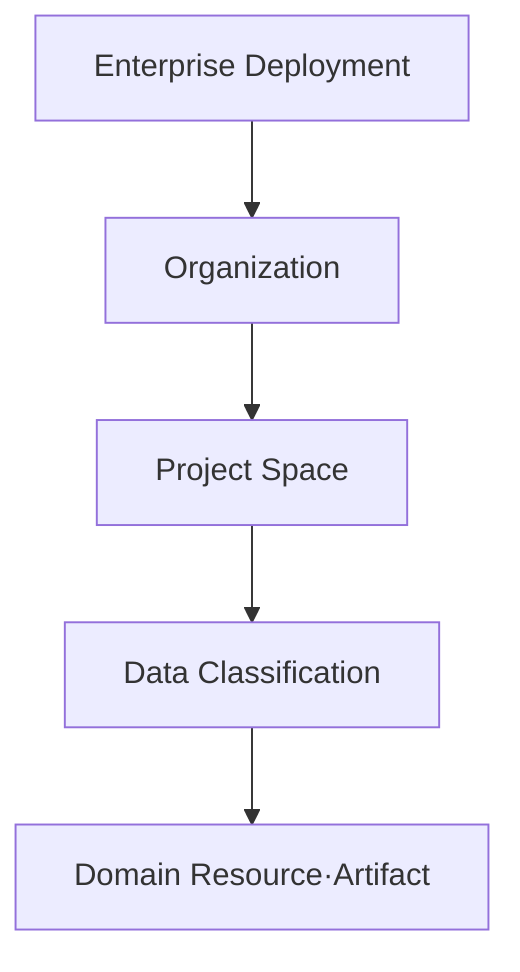

# 권한, 감사로그, 보안 및 데이터 격리

## 1. 보안 가정

- `ASSUMPTION` 첫 운영은 단일 기업 전용 온프레미스 또는 사설 클라우드다.
- 하나의 deployment 안에 여러 organization/project space가 있을 수 있다.
- 초기 plugin은 검토·서명된 내부/파트너 package만 허용한다.
- 상용 solver와 license server는 고객사 신뢰 영역에 있다.
- 규제 인증 또는 법적 전자서명 준수는 `TBD`이며 MVP가 자동 충족한다고 주장하지 않는다.

## 2. 격리 계층

### 2.1 Organization

최상위 소유·정책 경계다. encryption key, retention, plugin allowlist, IdP group mapping을 organization별로 설정할 수 있다.

### 2.2 Project Space

업무 협업과 기본 row-level 격리 단위다. material은 organization-wide 또는 project-scoped일 수 있으나 명시적 promotion/release 없이 project 밖으로 보이지 않는다.

### 2.3 Data Classification

권고 초기 값:

- `internal`
- `confidential`
- `restricted`
- `export_controlled`

실제 조직 정책과 용어는 `TBD`다. classification은 UI label만이 아니라 download/export/search facet/event delivery/runner 배치에 적용한다.

## 3. 인증

- OIDC Authorization Code + PKCE를 기본으로 한다.
- enterprise MFA, password, account lifecycle은 IdP에 위임한다.
- service account는 client credential 또는 workload identity를 사용한다.
- short-lived access token과 key rotation을 사용한다.
- local emergency admin은 break-glass 절차와 별도 audit를 요구한다.
- external callback은 scoped signed token, nonce/replay 방지를 사용한다.

### 3.1 T-03 access-token 신뢰 경계

- API resource server는 `typ=at+jwt` 또는 `application/at+jwt`인 JWT access token만 받으며
  OIDC ID token과 혼용하지 않는다.
- 서명 key는 운영자가 지정한 HTTPS JWKS endpoint에서만 가져온다. Token이 제공하는 URL이나
  임의 discovery 결과를 따라가지 않는다. Loopback HTTP는 명시적인 개발 설정에서만 허용한다.
- issuer와 audience는 exact match, 알고리즘은 비대칭 allowlist, `exp`/`iat`와 필수 claim은
  fail-closed로 검증한다.
- external identity key `(issuer, subject)`는 생성 후 바꾸거나 삭제하지 않는다. Principal의
  display name과 active 상태만 별도 projection으로 변경할 수 있다.
- JIT provisioning은 기본적으로 꺼져 있다. 켜더라도 동일 external identity의 동시 요청은
  PostgreSQL transaction lock으로 한 principal에 수렴한다.
- organization/project claim은 request의 선택 context다. 실제 membership, role, classification
  권한과 RLS session 설정은 T-04 전까지 구현 완료로 간주하지 않는다.

검증 기준은 [RFC 6750](https://www.rfc-editor.org/rfc/rfc6750),
[RFC 8725](https://www.rfc-editor.org/rfc/rfc8725),
[RFC 9068](https://www.rfc-editor.org/rfc/rfc9068)을 따른다.

## 4. 권한 모델

### 4.1 RBAC role

| Role | 대표 권한 |
| --- | --- |
| `platform_admin` | deployment/runner/global policy; domain approval 권한은 자동 부여하지 않음 |
| `org_admin` | organization member/group/project/plugin allowlist 관리 |
| `project_admin` | project membership, workflow profile |
| `test_engineer` | specimen/test/raw ingest 생성 |
| `data_steward` | mapping/metadata correction, QC issue 관리 |
| `statistical_analyst` | statistical plan/run, candidate 생성 |
| `material_modeler` | processing/calibration/IR candidate |
| `cae_analyst` | exporter/solver card/validation plan/run |
| `domain_reviewer` | technical review decision |
| `release_approver` | release 승인 |
| `consumer` | released channel read/download |
| `plugin_maintainer` | package submit; self-activation 불가 |
| `auditor` | read-only audit/provenance |

### 4.2 ABAC attribute

- organization/project membership
- data classification/compartment
- lifecycle state
- resource owner/team
- export-control/nationality attribute가 필요한지 `TBD`
- action purpose 및 runner trust zone

RBAC가 action 범위를 주고 ABAC가 resource context를 제한한다.

### 4.3 Separation of duties

기본 policy:

- revision author는 자신의 release candidate의 유일한 final approver가 될 수 없다.
- plugin submitter는 같은 package를 단독 activate할 수 없다.
- platform admin은 기술적으로 DB를 운영할 수 있어도 business release approval role을 자동 보유하지 않는다.
- emergency override는 reason, second-person review, audit flag가 필요하다.

조직 규모가 작아 분리가 불가능하면 exception policy와 audit report를 명시한다.

## 5. PostgreSQL RLS

PostgreSQL row security는 user/role별로 조회·변경 가능한 row를 제한할 수 있고 policy가 없으면 default-deny를 사용할 수 있다. [PostgreSQL Row Security](https://www.postgresql.org/docs/current/ddl-rowsecurity.html)

### 원칙

- 모든 tenant-owned table에 `organization_id`, 필요 시 `project_id`, `classification`을 둔다.
- application DB role은 superuser, owner, `BYPASSRLS`가 아니다.
- request transaction 시작 시 검증된 security context를 DB local setting으로 전달한다.
- RLS와 service-layer authorization을 함께 적용한다.
- foreign-key/unique error를 통한 covert information leak을 threat test한다.
- background worker도 user/service actor와 project context를 전달한다.
- backup, migration, reconciliation role은 별도이며 사용과 audit를 제한한다.

Search count, facet, autocomplete, event payload도 동일 정책을 적용한다.

## 6. Object storage 보안

- content-addressed final key는 사용자에게 직접 노출하지 않는다.
- API authorization 후 short-lived scoped transfer 또는 server streaming을 제공한다.
- raw/release bucket은 versioning/object lock 사용을 권고한다.
- organization별 prefix와 가능하면 encryption key context를 분리한다.
- server-side encryption, TLS, bucket public access block을 적용한다.
- upload token은 경로·size·media type·expiry를 제한한다.
- plugin input token은 필요한 artifact read-only, output token은 staging prefix write-only다.
- digest/size 검증 전 artifact를 `available`로 전환하지 않는다.
- malware scanning이 과학 파일을 변환하지 않도록 scan은 read-only다.

## 7. Plugin sandbox

### 7.1 기본 정책

- non-root user
- read-only root filesystem
- read-only input 또는 scoped token
- ephemeral working/output directory
- network deny-by-default
- CPU/memory/process/file/time quota
- no host socket, no Docker socket
- syscall/profile hardening이 가능한 runtime 사용
- output path traversal와 symlink escape 차단
- package digest/signature/SBOM 고정

### 7.2 신뢰 수준

| Level | 출처 | 실행 정책 |
| --- | --- | --- |
| `first_party` | core team | isolated runner, standard scan |
| `reviewed_partner` | 승인 partner | stricter review, network deny |
| `internal_experimental` | 조직 연구자 | non-production project만, release 차단 |
| `untrusted` | 외부 임의 코드 | MVP 미지원; 별도 sandbox service 필요 |

검토된 plugin도 안전하다고 가정하지 않고 process/container 격리를 유지한다.

## 8. Solver/HPC trust zone

Solver runner는 license server, scheduler, shared filesystem에 접근할 수 있어 일반 plugin보다 위험하다.

- runner별 allowed solver/version/queue/project를 등록한다.
- API가 scheduler credential을 보유하지 않고 runner 또는 secret broker가 보유한다.
- input deck/card를 untrusted text로 처리한다.
- command line은 allowlisted template에서 생성하고 shell interpolation을 금지한다.
- job directory를 격리하고 path를 server가 생성한다.
- solver output parser에 fuzz/size limits를 적용한다.
- license/server address와 credential을 log/artifact에 남기지 않는다.
- 외부 result attach는 digest, signer/uploader, source job ID를 기록하고 managed execution과 구분한다.

## 9. 감사로그

### 9.1 기록 대상

- login/logout/failure와 privilege change
- organization/project membership과 role binding
- raw upload/다운로드/export
- metadata/revision 생성
- selection/outlier 판정
- calibration/export/validation submit/cancel/retry
- review/approve/release/supersede/withdraw
- plugin submit/scan/activate/deactivate
- runner 등록·capability 변경
- retention/legal hold/admin override
- audit 조회와 bulk export

### 9.2 보장

- append-only application API
- database privilege/trigger로 update/delete 차단
- per-event hash chain 또는 batch Merkle/signed root
- 주기적으로 외부 WORM target에 root/segment 보관
- 시간 동기화와 monotonic sequence
- 민감 payload·secret 제외
- retention 및 접근 권한 분리

Audit tamper evidence는 intrusion prevention을 대체하지 않는다.

## 10. 데이터 보호와 secret

- TLS 1.2+ 또는 조직 기준
- DB/object/backup encryption at rest
- KMS/Vault 계열 secret manager
- source repository·config·job spec에 secret 금지
- credential rotation과 revocation
- sensitive metadata field-level masking 필요 여부 `TBD`
- backup encryption key와 restore 권한 분리
- production data를 개발 환경에 복제하지 않고 synthetic/de-identified fixture 사용

## 11. Retention, archive, legal hold

| 대상 | 기본 원칙 |
| --- | --- |
| Raw Asset | 원본 불변; organization retention에 따라 archive, 일반 사용자 hard delete 금지 |
| Derived Dataset | referenced/released이면 보존; 미참조 preview는 정책 후 purge 가능 |
| Failed Run Log | 원인 분석 기간 보존; secret redaction |
| Release Package | 장기 보존, supersede/withdraw 후에도 삭제 금지 |
| Audit Log | 조직·법규 retention; 별도 WORM 권고 |
| Plugin Image | 과거 release 재현 window 동안 보존 |

법적 삭제 요구와 engineering traceability가 충돌할 수 있으므로 실제 관할·계약 기준은 `OQ-SEC-004`로 남긴다.

## 12. Threat와 control

| Threat | 주요 control |
| --- | --- |
| 다른 project 데이터 열람 | service auth + RLS + object scoped token + negative test |
| raw/release 변조 | content digest, object lock/versioning, reconciliation |
| malicious plugin | signature, allowlist, sandbox, no network, quota |
| solver command injection | allowlisted executable/args, no shell, isolated job dir |
| unit/metadata silent corruption | schema/semantic validation, explicit mapping approval |
| replay/duplicate command | idempotency key, nonce, event inbox |
| privilege escalation | deny-by-default, SoD, admin role split, audit |
| provenance forgery | application-only relation write, digest, activity/agent constraints |
| secret leakage in logs | structured redaction, restricted logs, secret scanner |
| supply-chain compromise | lockfile, SBOM, signed digest, vulnerability policy |
| backup omission from RLS | privileged backup role, restore/digest drill, RLS-off error checks |

## 13. Secure SDLC

- threat model과 data-flow review
- dependency lock, SBOM, signature
- secret scanning, SAST, dependency/container scanning
- API authorization matrix test
- RLS test fixture
- parser fuzzing
- plugin sandbox escape test
- penetration test 전 production release
- backup/restore 및 incident response drill
- critical finding release gate

## 14. 규제·전자서명

MVP의 approval은 authenticated append-only business decision이다. 이것을 21 CFR Part 11, ISO 17025, AS9100 또는 특정 QMS 전자서명 준수라고 자동 주장하지 않는다.

규제 대상이면 다음을 별도 gap assessment한다.

- identity proofing과 signature manifestation
- signature meaning과 re-authentication
- record retention/inspection export
- validated system lifecycle
- change control/training
- time source와 audit review
- laboratory method/calibration/accreditation 요구

## 15. 미결정 사항

- `OQ-SEC-001` 실제 deployment: single enterprise vs SaaS
- `OQ-SEC-002` data classification/export-control 속성
- `OQ-SEC-003` 전자서명·QMS 적용 범위
- `OQ-SEC-004` retention 및 법적 삭제 정책
- `OQ-SEC-005` external partner access와 collaboration boundary
- `OQ-SEC-006` plugin network allowlist가 필요한 use case

