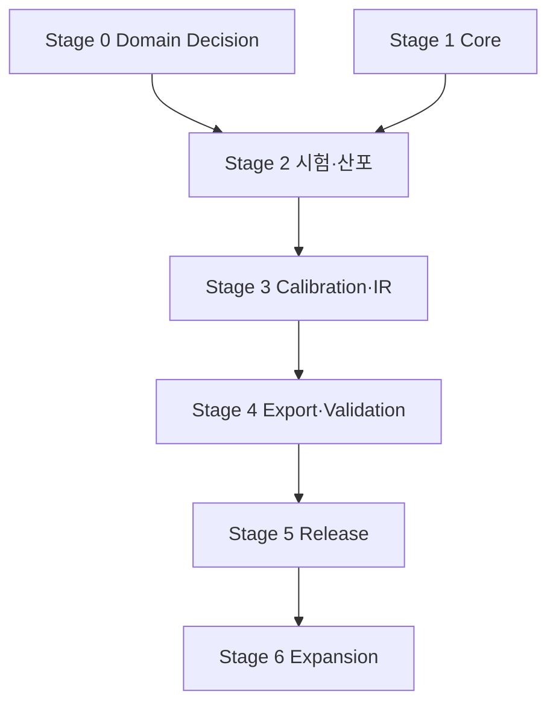

# MVP와 후속 단계 로드맵

## 1. 로드맵 원칙

- 화면별 개발이 아니라 raw→release 수직 흐름을 단계적으로 완성한다.
- 구체 모델·solver가 결정되기 전에는 synthetic reference plugin으로 core contract를 검증한다.
- 각 단계는 demo가 아니라 exit gate와 regression evidence로 완료한다.
- graph DB, microservice, AI 기능은 측정된 필요가 생기기 전에는 도입하지 않는다.

## 2. Stage 0 — Domain decision과 reference 확보

### 목표

첫 production vertical slice의 과학적 범위를 결정한다.

### 산출물

- 대표 재료군·인장시험 표준 결정
- 최소 10개 이상 반복시험 sample file과 metadata inventory 권고
- column/unit/quantity-kind mapping
- first model family와 calibration objective/constraint
- first solver/version/card/unit system
- virtual specimen template/metric/threshold
- 기준 card와 기준 simulation result
- 용어사전 및 Lot/Batch mapping

### Exit gate

- `OQ-TEST-*`, `OQ-IR-001`, `OQ-SOLVER-*`, `OQ-VSPEC-*`에 승인된 결정이 있다.
- domain expert가 sample과 expected result 사용 권한을 확인한다.

Stage 0 미완료가 core foundation 개발을 막지는 않지만 production plugin 완료를 막는다.

## 3. Stage 1 — Core foundation

### 목표

불변 raw, revision, provenance, artifact, job, security의 최소 플랫폼을 만든다.

### 범위

- repository/module skeleton과 ADR
- PostgreSQL schema-per-module, migration
- OIDC/RBAC/project context/RLS
- upload/raw artifact/content digest
- aggregate/revision common pattern
- typed provenance and audit
- durable job/attempt/lease/outbox
- plugin manifest/runner contract
- synthetic importer/processor plugin
- OpenAPI/JSON Schema baseline

### Exit gate

- synthetic file upload→normalized dataset revision까지 실행
- raw overwrite negative test
- upstream/downstream lineage test
- worker restart/retry test
- cross-project access negative test

## 4. Stage 2 — 시험 데이터와 산포

### 목표

실제 또는 승인 sample의 반복 인장시험을 specimen 단위로 관리하고 QC·산포를 재현한다.

### 범위

- Material/State/Process/Lot/Batch/Specimen/Test domain
- first Importer detect/mapping/import
- original/normalized units와 channel semantics
- curve viewer와 metadata/QC UI
- Selection Revision
- Processing recipe skeleton과 alignment
- scalar feature/QC/statistics/outlier candidate
- outlier adjudication과 selection comparison

### Exit gate

- sample campaign 전체 import
- unit mapping round-trip evidence
- 개별 curve와 summary band 표시
- candidate 판정 전후 분석 재현
- point count가 replicate n을 오염시키지 않는 regression

## 5. Stage 3 — Processing, calibration, IR

### 목표

선택된 model을 core 변경 없이 plugin으로 보정하고 IR candidate를 만든다.

### 범위

- versioned processing steps/recipe/run
- Material Model plugin schema/evaluator
- Calibrator plugin, plan/run/attempt/multistart
- objective/residual/convergence diagnostics
- parameter source/bounds/uncertainty status
- IR envelope/payload validation L0~L4
- candidate comparison/selection UI

### Exit gate

- 동일 plan 재실행 R3 tolerance 충족
- 실패/non-identifiable fixture 처리
- model schema가 core DB migration 없이 등록
- IR에서 raw data까지 lineage 완성

## 6. Stage 4 — Solver export와 virtual specimen

### 목표

IR에서 한 종류 card를 생성하고 target solver에서 검증한다.

### 범위

- first Solver Exporter capability/preflight/export
- mapping report와 approval policy
- golden card fixture
- versioned validation template
- solver/HPC runner 또는 수동 result attach
- native result 보존과 extraction plugin
- numerical health + experimental metrics

### Exit gate

- unsupported mapping negative test
- 승인 IR→card golden pass
- card→solver→extracted curve end-to-end
- managed/manual result가 같은 manifest/provenance 요구 충족
- solver/card/version 변경이 새 artifact를 생성

## 7. Stage 5 — Review, release, enterprise hardening

### 목표

승인된 material model package만 downstream에 공급한다.

### 범위

- lifecycle/review/SoD
- provenance completeness policy
- immutable release manifest/package
- released search/download channel
- supersede/withdraw/impact analysis
- audit tamper evidence와 export
- backup/restore/integrity drill
- performance/security/penetration hardening
- 운영 runbook/observability

### Exit gate

- author-only approval 차단
- incomplete evidence release 차단
- release package digest 재검증
- superseded card 사용 경고
- restore 후 release/raw digest 일치

## 8. Stage 6 — 확장 제품화

우선순위는 실제 사용·가치로 결정한다.

- 추가 인장/압축/전단/다축/온도/속도 시험 plugin
- hyperelastic/viscoelastic/viscoplastic/damage/failure model plugin
- 추가 solver exporter 및 card parser
- batch/lot hierarchical statistics, Gauge R&R, uncertainty propagation
- PLM/LIMS/ERP/CAE connectors
- template/report designer
- multi-organization SaaS hardening
- external plugin marketplace 수준 sandbox
- graph read projection
- AI-assisted metadata mapping/anomaly suggestion; 사람 승인 필수

## 9. 단계별 의존성

Stage 1과 Stage 0은 병행할 수 있다. Stage 3 이후에는 concrete domain 결정이 필수다.

## 10. MVP Definition of Done

1. 승인된 sample 반복시험을 원본 그대로 ingest한다.
2. original/normalized unit과 metadata가 추적된다.
3. specimen QC, scalar/curve scatter, outlier adjudication을 재현한다.
4. versioned processing과 selected model calibration을 실행한다.
5. solver-neutral IR을 생성·검증한다.
6. 한 solver card를 mapping report와 함께 생성한다.
7. virtual specimen solver result와 실험을 비교한다.
8. review/approval/release package를 생성한다.
9. release에서 모든 raw asset까지 lineage가 연결된다.
10. golden, security, integrity, restore test가 통과한다.

## 11. 후속으로 미루는 이유가 명확한 항목

| 항목 | 미루는 이유 | 재검토 trigger |
| --- | --- | --- |
| Microservices | domain 경계·팀·scale 미확정 | 독립 팀/scale/SLA 요구 |
| Graph DB | known lineage query는 PostgreSQL로 가능 | 수억 edge/임의 탐색 SLO 실패 |
| General marketplace | untrusted code sandbox 비용 | 외부 ecosystem 사업 결정 |
| AI prediction | data/evidence/governance 선행 | 충분한 curated released data |
| 모든 solver/model | validation 비용이 선형 이상 증가 | 사용자 가치/수요 우선순위 |
| PLM/LIMS full integration | core identity/release 안정화 필요 | target enterprise system 결정 |

## 12. 권고 조직 역할

최소 기능 역할이며 동일 인물이 일부 겸임할 수 있다.

- Product Owner/CAE domain lead
- Material testing domain expert
- Constitutive modeling/calibration expert
- Solver/export/validation expert
- Backend/data engineer
- Scientific computing engineer
- Frontend engineer
- Platform/security engineer
- QA/test automation

production scientific plugin과 golden result는 software engineer 단독 승인 대상이 아니다.

