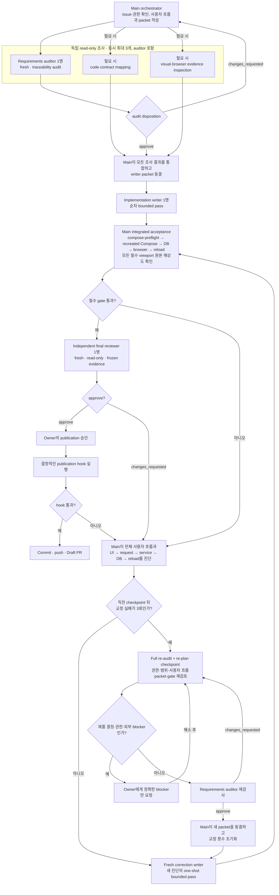

# Codex 작업 오케스트레이션

이 문서는 한 작업 단위가 요구사항 확인부터 PR까지 이동하는 방식을 짧게 설명합니다. 규칙의
최종 권한은 저장소 루트의 `AGENTS.md`에 있으며, 이 문서는 역할과 흐름을 사람이 빨리 확인할 수
있도록 풀어 쓴 안내서입니다.

## 사용자 작업이 출발점

검사는 테스트 자체를 만족시키기 위해 만들지 않습니다. 먼저 실제 사용자가 무엇을 선택하고,
화면에서 무엇을 판단하며, 저장 후 무엇이 유지되어야 하고, 잘못된 입력에서 어떻게 회복하는지를
한 흐름으로 적습니다. 자동 테스트와 화면 캡처는 이 흐름이 실제로 동작한다는 증거입니다.

구현 packet에는 다음 항목을 고정합니다.

1. 권한이 있는 issue, backlog 단위, 요구사항, 계약, 승인 화면
2. 현실적인 주 사용자 흐름과 별도의 오류·회복 흐름
3. fixture와 시작 상태, 사용자의 정확한 행동
4. 화면 결과, 저장·재접속 결과, 보존해야 할 데이터와 상태
5. 담당 파일, 금지된 우회 방법, 자동·Compose·DB·브라우저 gate
6. 필요한 모든 viewport와 원본 해상도 화면 확인 조건

## 역할과 병렬 실행 범위

| 역할 | 책임 |
| --- | --- |
| Main orchestrator | 요구사항 해석, packet 작성, 결과 통합, 전체 원인 진단, live Compose·DB·브라우저 확인, GitHub 전달을 책임집니다. |
| Requirements auditor | 구현 전에 새 읽기 전용 상태로 packet과 원문을 대조합니다. 빠진 사용자 행동·화면·저장·회복·검증 조건이 있으면 구현을 막습니다. |
| 선택적 조사 lane | 코드·계약 위치 확인이나 화면 증거 점검처럼 서로 독립적인 읽기 전용 질문만 처리합니다. auditor를 포함해 동시에 최대 3개입니다. |
| Implementation/correction writer | 한 번에 한 명만 정해진 파일을 수정합니다. 교정 writer는 매번 새 상태로 시작합니다. |
| Final reviewer | 모든 gate 뒤 새 읽기 전용 상태로 전체 증거와 모든 필수 viewport 원본을 다시 보고 승인 여부를 결정합니다. |
| Publication hook | 문서·링크·이미지·diff 같은 결정적인 검사만 수행합니다. 모델 리뷰를 자동으로 호출하지 않습니다. |

읽기 전용 조사는 독립적일 때만 병렬로 실행합니다. 같은 checkout에서 writer를 동시에 실행하지
않으므로 수정 충돌과 책임 혼선을 피합니다. 조사 lane도 필요하지 않으면 만들지 않습니다.

## 전체 흐름

## 실패를 모아서 고치는 방법

Main은 한 문제가 보였다고 즉시 같은 검사를 처음부터 반복하지 않습니다. 계속 확인해도 안전하고
증거가 유효하면 해당 checkpoint의 나머지 검사를 끝까지 실행해 실패를 모두 수집합니다. 같은
원인에서 나온 현상은 하나로 묶고, 새 진단과 관찰 가능한 합격 조건을 한 correction packet에
담습니다.

세 번의 교정 실패는 작업 포기가 아니라 재감사 지점입니다. Main과 auditor가 권한, 범위, 사용자
흐름, packet, gate, 동결된 증거를 다시 검토합니다. 제품 결정, 추가 권한, 위험한 조치 또는 외부
상태 변경이 정말 필요할 때만 사용자에게 요청합니다. 그렇지 않으면 실패 횟수를 초기화하고 새
진단으로 계속합니다. 같은 지시를 그대로 반복하는 것은 새 시도로 세지 않습니다.

## 최종 확인과 게시

Main의 live 검사는 `compose-preflight`, 새로 build/recreate한 canonical Compose, DB 결과, 실제
브라우저 행동, 저장 후 reload, 모든 필수 viewport 원본 확인 순으로 진행합니다. 그 뒤 fresh final
reviewer가 동결된 전체 증거를 승인해야 합니다. 게시 승인을 받은 뒤 결정적인 pre-publish hook을
통과한 commit만 push하고 Draft PR을 엽니다. 자동 모델 검토 정책과 명령은
[Pre-publish 게이트와 독립 리뷰 실험](codex-pre-publish-review.md)에 따릅니다.
