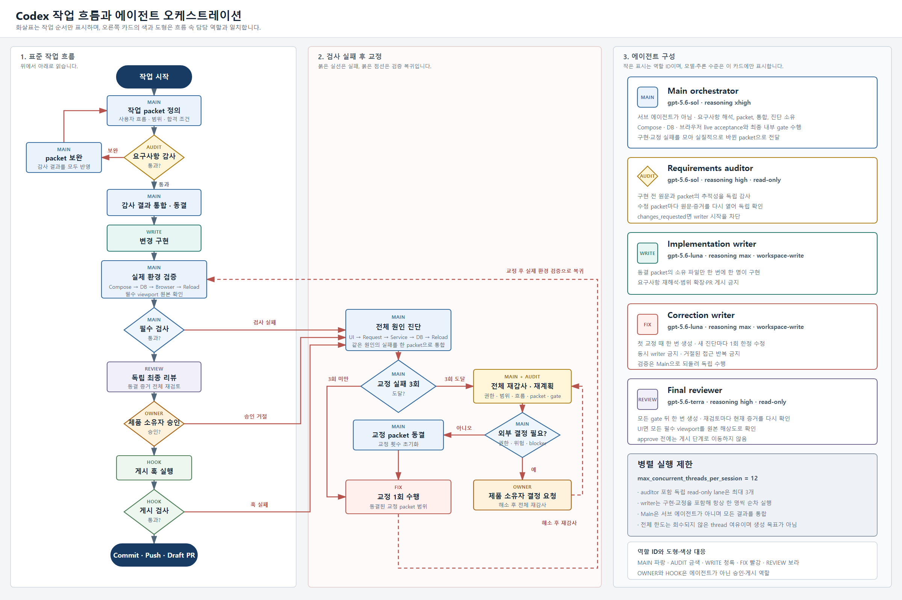

# Codex 작업 오케스트레이션

이 문서는 한 작업 단위가 요구사항 확인부터 PR까지 이동하는 방식을 짧게 설명합니다. 규칙의
최종 권한은 저장소 루트의 `AGENTS.md`에 있으며, 이 문서는 역할과 흐름을 사람이 빨리 확인할 수
있도록 풀어 쓴 안내서입니다.

## Full workflow 사용자 작업이 출발점

Full workflow에서는 검사를 테스트 자체를 만족시키기 위해 만들지 않습니다. 먼저 실제 사용자가
무엇을 선택하고, 화면에서 무엇을 판단하며, 저장 후 무엇이 유지되어야 하고, 잘못된 입력에서
어떻게 회복하는지를 한 흐름으로 적습니다. 자동 테스트와 화면 캡처는 이 흐름이 실제로
동작한다는 증거입니다.

Full workflow 구현 packet에는 다음 항목을 고정합니다.

1. 권한이 있는 issue, backlog 단위, 요구사항, 계약, 승인 화면
2. 현실적인 주 사용자 흐름과 별도의 오류·회복 흐름
3. fixture와 시작 상태, 사용자의 정확한 행동
4. 화면 결과, 저장·재접속 결과, 보존해야 할 데이터와 상태
5. 담당 파일, 금지된 우회 방법, 자동·Compose·DB·브라우저 gate
6. 필요한 모든 viewport와 원본 해상도 화면 확인 조건

## 경로를 먼저 선택합니다

Main은 시작할 때 `Administrative direct path`, `Trivial maintenance fast path`, `Full workflow`
중 하나와 의미·운영 위험을 한 문장으로 선언하고, 일상적인 권한 질문은 하지 않습니다. 분류는
파일·라인 수가 아니라 의미와 위험으로 하며, 명시적인 사용자 `full workflow` 또는 `main-direct`
지시가 우선합니다. 외부 fact가 아닌 repository 변경, 새 정책·계약·요구사항·제품 판단,
시각 승인, 범위 확대 또는 fast-path gate의 broader impact는 Full workflow로 승격합니다.

- **Administrative direct path:** issue checkbox/comment, 이미 알려진 merge SHA 같은 외부 fact만
  정확히 쓰고 다시 읽습니다. repository 파일을 바꾸지 않으며 dirty worktree를 보존하는
  fingerprint를 전후 비교하고 auditor/writer/reviewer를 기계적으로 호출하지 않습니다.
- **Trivial maintenance fast path:** 이미 승인된 사실의 의미 보존 docs/metadata 수선, typo,
  내부 링크 복구만 대상으로 scoped diff, `git diff --check`, user-guide/docs-impact 및 변경 경로
  gate를 실행합니다. 의미·범위가 넓어지면 Full workflow로 승격합니다.
- **Full workflow:** code/UI/calculation/API/schema/data/migration, security/authorization,
  test/build policy, product requirement, `AGENTS.md`, skill, orchestration policy, visual 또는
  product-owner 판단 변경을 포함하며 아래 역할·gate loop를 적용합니다.

세 경로의 9개 trace 필드와 N/A/deferred/stop, 권위 우선순위와 Process known-bad/accepted
calibration은 [main orchestrator acceptance trace](main-orchestrator-acceptance.md)에 기록합니다.
경로 분류는 commit, push, PR, ready-for-review 또는 merge 권한을 부여하지 않습니다. 이름이 적힌
외부 행동만 별도 승인으로 허용되며 pre-publish 실패는 모든 경로에서 게시를 막습니다.

## Full workflow 역할과 병렬 실행 범위

다음 역할 경계와 병렬 실행 제한은 Full workflow에만 적용합니다. Administrative direct path와
Trivial maintenance fast path는 각 경로의 계약을 따르며 이 역할 loop를 기계적으로 호출하지
않습니다.

| 역할 | 책임 |
| --- | --- |
| Main orchestrator | Full workflow의 요구사항 해석, packet 작성, 결과 통합, 전체 원인 진단, packet-applicable live gate 확인, GitHub 전달을 책임집니다. |
| Requirements auditor | Full workflow 구현 전에 독립된 읽기 전용 역할로 packet과 원문을 대조합니다. 같은 agent가 수정 packet과 재감사에서도 현재 원문을 다시 열며, 이전 결론은 권위가 아닙니다. |
| 선택적 조사 lane | 코드·계약 위치 확인이나 화면 증거 점검처럼 서로 독립적인 읽기 전용 질문만 처리합니다. auditor를 포함해 동시에 최대 3개입니다. |
| Implementation/correction writer | 구현 writer와 교정 writer는 서로 다른 설정 역할이며 한 번에 한 명만 정해진 파일을 수정합니다. 교정 writer는 첫 실패 때 한 번 생성하고 packet별로 한 번씩 수정합니다. |
| Final reviewer | Full workflow의 모든 applicable gate 뒤 독립된 읽기 전용 역할로 전체 증거와 모든 필수 viewport 원본을 다시 보고 승인 여부를 결정합니다. 재검토 때도 현재 증거를 다시 엽니다. |
| Publication hook | 문서·링크·이미지·diff 같은 결정적인 검사만 수행합니다. 모델 리뷰를 자동으로 호출하지 않습니다. |

읽기 전용 조사는 독립적일 때만 병렬로 실행합니다. 같은 checkout에서 writer를 동시에 실행하지
않으므로 수정 충돌과 책임 혼선을 피합니다. 조사 lane도 필요하지 않으면 만들지 않습니다.
각 configured role은 root task에서 처음 한 번만 `fork_turns: "none"`으로 생성하고, 수정 packet은
`followup_task`로 같은 역할에 전달합니다. 이는 새 agent를 부모 이력 없이 만드는 옵션이지 기존
agent를 reset하는 기능이 아닙니다. 전체 thread 한도 12는 회수되지 않은 thread를 위한 여유이며,
채우기 위한 목표가 아닙니다. 역할이 사용할 수 없으면 같은 task에서 대체 agent를 누적하지 않고
현재 상태를 checkpoint한 뒤 새 root task에서 이어갑니다.

## 렌더링된 구성도

아래 구성도는 **Full workflow**의 표준 작업 흐름과 실패 후 교정 흐름, 실제로 설정된 에이전트의
역할·모델·추론 수준을 보여줍니다. Administrative direct path와 Trivial maintenance fast path는
이 loop를 기계적으로 실행하지 않습니다. 작은 표시는 역할 ID이며 모델과 추론 수준은 오른쪽
구성 카드에만 표시합니다.



- [영문 PNG](codex-orchestration/workflow-en.png)
- [한글 SVG](codex-orchestration/workflow-ko.svg) · [영문 SVG](codex-orchestration/workflow-en.svg)
- [브라우저용 HTML](codex-orchestration/workflow.html)

레이아웃과 문구의 편집 원본은 `codex-orchestration/workflow-template.html`입니다. 다음 명령은
`.codex/config.toml`과 `.codex/agents/*.toml`에서 모델·추론·sandbox·병렬 실행 설정을 읽어
HTML, 한글·영문 SVG와 PNG를 함께 다시 만듭니다. 생성된 파일은 직접 수정하지 않습니다.

```powershell
uv run --with playwright==1.62.0 python docs/14-testing/codex-orchestration/render.py
```

## Full workflow 전체 흐름

다음 loop는 위에서 Full workflow로 분류한 작업에만 적용합니다. Main이 packet을 동결하고
canonical requirements auditor의 `approve`를 받은 뒤 한 명의 bounded writer, main acceptance,
canonical independent reviewer 순으로 진행합니다.

```mermaid
flowchart TB
    START([작업 시작<br/>Issue · backlog 단위 확정])
    PACKET[Main orchestrator<br/>실제 사용자 흐름 · 범위 · 합격 조건 작성]
    AUDIT{요구사항 감사<br/>통과?}
    REVISE[빠진 행동 · 결과 · 복구 · 검증 조건 보완]
    FREEZE[조사 결과 통합<br/>구현 packet 동결]
    WRITE[Implementation writer 1명<br/>한정된 파일만 순차 구현]
    LIVE[Main packet-applicable live gates<br/>Compose · DB · Browser · Reload (applicable only)<br/>visual이면 필수 viewport 원본 확인]
    GATE{모든 gate<br/>통과?}
    REVIEW[Canonical final reviewer<br/>현재 동결 증거 독립 검토]
    APPROVE{최종 승인?}
    OWNER[제품 소유자<br/>게시 승인]
    HOOK[결정적 publication hook]
    HOOK_OK{Hook 통과?}
    DONE([Commit → Push → Draft PR])

    DIAGNOSE[Main 전체 원인 진단<br/>UI → Request → Service → DB → Reload]
    THREE{Checkpoint 뒤<br/>교정 실패 3회?}
    CORRECT[Canonical correction writer<br/>새 진단마다 1회 한정 교정]
    REAUDIT[전체 재감사 · 재계획<br/>범위 · packet · gate 다시 확인]
    BLOCKER{제품 결정 · 추가 권한 ·<br/>외부 blocker 필요?}
    ASK[/제품 소유자에게<br/>정확한 결정만 요청/]
    RESET[새 packet 동결<br/>교정 횟수 초기화]

    START --> PACKET --> AUDIT
    AUDIT -->|아니오| REVISE --> PACKET
    AUDIT -->|예| FREEZE --> WRITE --> LIVE --> GATE
    GATE -->|예| REVIEW --> APPROVE
    APPROVE -->|예| OWNER --> HOOK --> HOOK_OK
    HOOK_OK -->|예| DONE

    GATE -->|아니오| DIAGNOSE
    APPROVE -->|아니오| DIAGNOSE
    HOOK_OK -->|아니오| DIAGNOSE
    DIAGNOSE --> THREE
    THREE -->|아니오| CORRECT --> LIVE
    THREE -->|예| REAUDIT --> BLOCKER
    BLOCKER -->|예| ASK -->|해소 후| REAUDIT
    BLOCKER -->|아니오| RESET --> CORRECT

    classDef terminal fill:#173b63,color:#ffffff,stroke:#173b63,stroke-width:2px;
    classDef main fill:#edf4fb,color:#172b3f,stroke:#4e78a0,stroke-width:1.5px;
    classDef writer fill:#f2f5f7,color:#172b3f,stroke:#71808d,stroke-width:1.5px;
    classDef decision fill:#fff6dc,color:#382f18,stroke:#b58a28,stroke-width:1.5px;
    classDef recovery fill:#fff0ee,color:#442522,stroke:#ba6258,stroke-width:1.5px;
    classDef publish fill:#edf7ef,color:#17331d,stroke:#5c8f65,stroke-width:1.5px;

    class START,DONE terminal;
    class PACKET,FREEZE,LIVE,REVIEW main;
    class WRITE,CORRECT writer;
    class AUDIT,GATE,APPROVE,HOOK_OK,THREE,BLOCKER decision;
    class REVISE,DIAGNOSE,REAUDIT,ASK,RESET recovery;
    class OWNER,HOOK publish;
```

그림의 `Commit → Push → Draft PR`는 해당 외부 행동이 명시적으로 승인된 경우에만 의미가
있습니다. ready-for-review와 merge는 별도 권한이며 이 그림이나 경로 선언만으로 승인되지
않습니다.

## Full workflow 실패를 모아서 고치는 방법

Main은 한 문제가 보였다고 즉시 같은 검사를 처음부터 반복하지 않습니다. 계속 확인해도 안전하고
frozen evidence가 유효하면 해당 checkpoint의 나머지 안전한 applicable 검사를 끝까지 실행해
실패를 모두 수집합니다. 계속하는 것이 unsafe하거나 실패한 prerequisite가 나머지 증거를 무효로
만들 때만 discovery를 멈추며, 그 정확한 경계와 이후 검사가 유효하지 않은 이유를 기록합니다.
같은 원인에서 나온 현상은 하나로 묶고, 새 진단과 관찰 가능한 합격 조건을 담은 **실질적으로
바뀐** correction packet을 만듭니다. 변경하지 않은 packet은 다시 실행하지 않습니다.

세 번의 교정 실패는 작업 포기가 아니라 재감사 지점입니다. Main과 auditor가 권한, 범위, 사용자
흐름, packet, gate, 동결된 증거를 다시 검토합니다. 제품 결정, 추가 권한, 위험한 조치 또는 외부
상태 변경이 정말 필요할 때만 사용자에게 요청합니다. 그렇지 않으면 실패 횟수를 초기화하고 새
진단으로 계속합니다. 같은 지시를 그대로 반복하는 것은 새 시도로 세지 않습니다.

## Full workflow 최종 확인과 게시

Full workflow에서 Main은 packet에 applicable로 고정한 live gate만 독립적으로 실행합니다. Compose
gate가 적용되면 `compose-preflight` 뒤 canonical Compose를 새로 build/recreate하고, DB 결과,
브라우저 행동, 저장 후 reload는 packet이 요구할 때 확인합니다. Visual 작업이면 모든 필수 viewport
원본을 확인합니다. 적용되지 않는 gate 유형은 그 이유와 함께 N/A 또는 deferred로 기록합니다. 그
뒤 canonical final reviewer가 현재 동결된 전체 증거를 승인해야 합니다. 게시 승인을 받은 뒤 결정적인
pre-publish hook을 통과한 commit만 push하고 Draft PR을 엽니다. 자동 모델 검토 정책과 명령은
[Pre-publish 게이트와 독립 리뷰 실험](codex-pre-publish-review.md)에 따릅니다.
