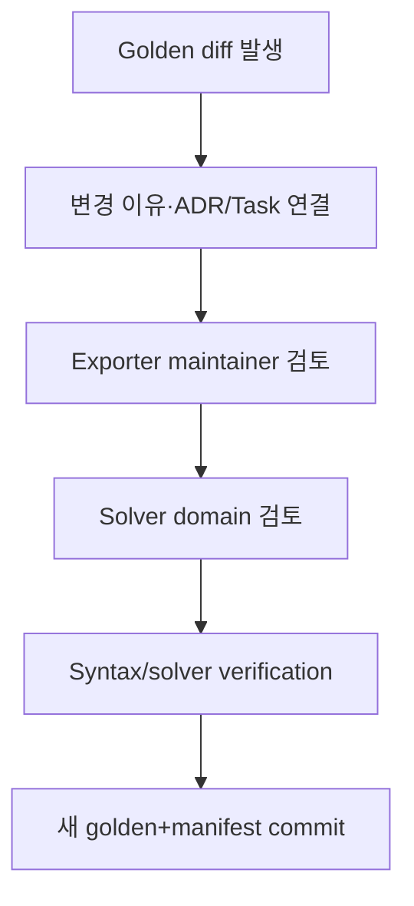

# 테스트 전략과 Solver-card Golden-file 테스트

## 1. 품질 목표

이 플랫폼의 실패는 단순 UI 오류뿐 아니라 단위 변환 오류, provenance 누락, 잘못된 parameter, solver card semantic 변화처럼 눈에 잘 띄지 않는 공학 오류를 포함한다. 따라서 일반 software test와 scientific validation을 분리하되 release gate에서 결합한다.

## 2. 테스트 분류

| ID prefix | 범주 | 실행 주기 |
| --- | --- | --- |
| `UT-*` | pure unit/domain/numeric function | 모든 PR |
| `PT-*` | property-based/metamorphic | 모든 PR 또는 nightly |
| `CT-*` | OpenAPI/event/job/plugin/schema contract | 모든 PR |
| `IT-*` | PostgreSQL/object store/worker/runner integration | 모든 PR |
| `ST-*` | security/RLS/sandbox/parser fuzz | PR + nightly |
| `NT-*` | numeric/scientific reference | 모든 scientific 변경 |
| `GT-*` | solver-card golden/semantic | exporter 변경마다 |
| `SV-*` | licensed solver verification | nightly/release candidate |
| `MT-*` | migration/upgrade/restore | release candidate |
| `PF-*` | performance/load/soak/fault injection | nightly/release candidate |
| `E2E-*` | raw→release vertical scenario | release candidate |

## 3. 일반 software test

### 3.1 Domain unit test

- aggregate/revision immutability
- lifecycle transition
- optimistic concurrency
- organization/project classification propagation
- selection membership hash
- job state machine/retry policy
- mapping report policy
- release completeness policy

DB/framework 없이 실행 가능한 domain test를 우선한다.

### 3.2 Contract test

- OpenAPI request/response와 generated client
- JSON Schema positive/negative fixtures
- CloudEvents envelope와 event data schema
- Job Spec/Result Manifest
- plugin manifest/version range
- IR envelope/model payload
- backward/forward compatibility와 breaking-change detection

Consumer-driven contract가 필요한 외부 PLM/HPC adapter는 target 결정 후 추가한다.

### 3.3 Integration test

Ephemeral PostgreSQL과 S3-compatible test storage를 사용한다.

- transaction + RLS
- multipart upload/staging/finalization
- worker claim/lease/crash/retry
- outbox publish/dedup
- plugin runner artifact I/O/sandbox
- provenance completeness/recursive query
- backup/restore fixture

Mock repository만으로 통과하는 test를 persistence integration의 대체로 쓰지 않는다.

## 4. Scientific numeric test

### 4.1 Reference test

각 numeric plugin/function은 다음을 갖는다.

- reference dataset의 출처·license
- expected values/curves
- absolute/relative/ULP tolerance 선택 이유
- input domain과 invalid cases
- 독립 계산 또는 domain expert 승인
- algorithm/plugin/dependency version

상용 제품 출력을 무단 복제한 fixture를 사용하지 않는다. 공개 표준, analytic solution, synthetic data 또는 사용 권한이 있는 내부 reference를 사용한다.

### 4.2 Property/metamorphic test

구체 모델에 맞는 property를 domain expert가 선택한다.

- unit conversion round-trip 또는 normalized equivalence
- 동일 point 중복/재정렬에 대한 명시된 behavior
- positive scale change와 response relation
- parameter bound enforcement
- symmetry/invariance
- monotonicity/energy/stability 조건
- 동일 seed reproducibility
- resampling density가 specimen weight를 바꾸지 않음

모든 material model에 monotonicity 같은 property를 일괄 적용하지 않는다.

### 4.3 Numeric tolerance

- 금액처럼 exact한 metadata/digest/schema는 exact equality
- deterministic serialized artifact는 byte equality가 목표
- floating result는 method별 abs/rel tolerance
- solver result는 metric/curve tolerance와 solver/platform matrix
- tolerance 완화는 code review와 domain approval 필요
- NaN/Inf는 explicit expected case 외에는 실패

## 5. 통계 test fixture

- hand-calculated mean/SD/median/MAD/IQR
- single observation, all equal, missing/censored, near-zero mean
- lot/batch strata와 unbalanced group
- curves with unequal grids/domains/truncation
- intersection/union-with-mask behavior
- bootstrap fixed-seed result
- outlier candidate와 adjudication scope
- converged Calibration Candidate versus explicit human Selection reason/current-revision promotion
- reference Validation Template/Plan exact revision pinning; mock/manual Result Manifest parity;
  normal/abnormal/not-available termination; shell-like external-job rejection; target/native-result
  mismatch; immutable deck/log/manifest evidence without a validation verdict
- T-28 reference interpretation: SI unit/target validation, finite/monotonic/truncated output,
  explicit observed-grid interpolation with no extrapolation, fixed relative-RMSE threshold,
  abnormal-output `not_evaluated`, and calibration Selection/holdout overlap rejection
- T-29 review governance: immutable request/decision rows, draft→review→approved or
  changes_requested transitions, manifest digest pinning, stale revision rejection, and
  author/reviewer separation of duties
- curve point 수를 늘려도 replicate `n` 불변
- display downsample과 full calculation 분리

## 6. Provenance·revision test

### 필수 invariants

1. output entity는 primary generation activity 하나를 가진다.
2. activity input은 구체 immutable entity revision이다.
3. derivation/revision DAG에 금지 cycle이 없다.
4. release에서 raw까지 complete path가 있다.
5. raw/released artifact digest는 변하지 않는다.
6. failure/cancel run도 usage/agent/log lineage를 가진다.
7. outlier decision은 input artifact를 변경하지 않는다.
8. migration은 old entity를 보존하고 explicit activity를 만든다.
9. a promoted IR must pin the current Candidate Selection revision, exact Candidate/diagnostics
   digests, and evaluated source IR revision; superseded selections and stale IR heads fail.
10. a T-28 Validation Result must pin the terminal Result Manifest and exact experimental Selection
    revision, create separate response/health/result Artifacts, and preserve every earlier Run,
    Manifest, Dataset, IR, Card, and result fact. The result cannot pass after abnormal/unhealthy
    evidence or fit/holdout overlap.

Property-based graph fixture와 intentionally corrupt DB fixture를 모두 둔다.

## 7. Solver-card golden-file 전략

### 7.1 Golden의 목적

Exporter code, unit conversion, formatting, solver version support가 바뀔 때 승인된 card의 text와 의미가 의도치 않게 바뀌는 것을 탐지한다.

Golden은 solver 정확성을 단독으로 증명하지 않는다. syntax/semantic regression과 licensed solver verification을 연결하는 기준이다.

### 7.2 Fixture matrix

각 golden case는 다음 tuple로 식별한다.

```text
(ir_fixture_id,
 ir_schema_version,
 exporter_plugin_digest,
 target_solver,
 target_solver_version,
 card_type,
 unit_system,
 export_options_profile)
```

Production model/solver가 `TBD`인 동안 synthetic exporter fixture만 둔다.

### 7.3 비교 단계

1. IR fixture schema/semantic validation
2. exporter preflight mapping report 비교
3. card 생성
4. raw byte 또는 canonical text 비교
5. parser/normalizer가 있으면 semantic representation 비교
6. syntax checker/dry-run hook
7. licensed solver smoke/virtual specimen reference

## Reference elastoplastic multi-solver regression matrix

The bounded tensile-to-card slice is verified at four distinct boundaries:

1. Domain tests verify engineering-to-true stress/log-strain/true-plastic-strain equations,
   first-maximum necking cutoff, monotone hardening, explicit yield anchor, rejection of softening,
   and mandatory post-necking approximation acknowledgement.
2. Artifact/application tests verify pinned Property Set and Dataset revisions, verified SI
   Parquet input, immutable hardening Parquet output, source/excluded point counts, scope and
   classification equality, and no source revision mutation.
3. Mapping/API/browser tests verify explicit OpenRadioss/Abaqus target tuples, all mapping-status
   values including visible `approximated`, report-digest acknowledgement, card preview/download,
   and the connected Material State workbench flow.
4. Golden regressions compare byte-exact OpenRadioss `/MAT/LAW36` + `/FUNCT` `.rad` and Abaqus
   `*DENSITY` + `*ELASTIC` + isotropic `*PLASTIC` `.inp` output. A golden match establishes
   deterministic mapping regression only; it is not solver qualification.

PostgreSQL-marked coverage additionally checks the organization/project/classification composite
source FKs, explicit transformation-count constraint, hardening Artifact guard, family-stability
guard, and forced RLS. It requires the disposable PostgreSQL DSN described below. Licensed or
installed solver execution is not part of normal CI; an eventual production gate must add
OpenRadioss Starter/dry-run and licensed Abaqus data-check fixtures under an approved version
matrix.

### Metal hardening reference gate

`tests/unit/test_metal_hardening_reference_fixture.py` is the independent gate for the Voce,
Swift, Hockett–Sherby, and Altair Material Modeler 2025 Ghosh equations. It must not import the
production hardening evaluator or fitter. The gate verifies the manifest SHA-256, 24 independent
stress/tangent rows, analytical limits and finite-difference cross-checks, residual/objective sign,
scaled Jacobian rank, noiseless fixture-only recovery, option normal/boundary/error cases, declared
metamorphic relations, and canonical snapshot reload/tamper detection. Production evaluator,
fit-decision, browser warning, and model-promotion tests remain separate comparison gates.

## T-43 governed multi-test Ogden regression matrix

The bounded elastomer calibration slice is verified independently of solver execution:

1. Domain tests pin the public one-term incompressible Ogden nominal-stress equations for
   uniaxial, planar and equibiaxial tension, deterministic PCG64 multistart, normalized weighted
   point → curve → mode aggregation, calibration/holdout separation and single-mode warnings.
2. Diagnostics tests verify parameter recovery, per-mode objective, calibration/holdout RMSE,
   convergence facts, Jacobian rank/condition, covariance or an explicit not-estimable status,
   and exact Parquet diagnostic points.
3. API and browser tests verify exact Dataset/Profile/State/baseline revision Plan members,
   immutable Candidates, candidate comparison, fitted/residual chart and warning visibility.
4. PostgreSQL tests migrate through T-43, exercise composite organization/project/classification
   foreign keys, forced RLS, immutable triggers, exact Artifact evidence and project isolation.

The live synthetic gate can be prepared with
`uv run python scripts/seed_ogden_calibration_demo.py`. It creates governed public fixtures only;
recovering the analytical `mu` and `alpha` is a scientific regression for this reference equation,
not constitutive-model validation or Abaqus/OpenRadioss qualification. Candidate-to-IR promotion
is deliberately tested separately in T-44. T-44 tests require a strong current ETag, reject stale
heads, preserve one-time Candidate/Selection use, enforce organization/project/classification and
exact Run/Candidate/diagnostics lineage in PostgreSQL, append r2/r3 on one stable identity, expose
revision-owned evidence in the browser, and prove that an earlier Solver Card payload and SHA-256
do not change after a later promotion.

## Cross-platform repository CI and byte boundaries

`uv run python scripts/repository_tasks.py ci` is the authoritative task sequence on Linux and
Windows; Make and bash are compatibility wrappers only. Repository-owned text that participates in
the `contract_echo` package digest is checked out as LF through `.gitattributes`. Canonical JSON
serialization likewise produces deterministic repository text bytes.

This text policy does not apply to uploaded raw bytes or released package bytes. Their SHA-256 and
size are computed from the exact received or emitted byte sequence, so CRLF and LF payloads remain
different immutable artifacts. Tests exercise a CRLF checkout separately from raw/released-byte
substitution and never normalize an immutable payload to make a digest pass.

## T-31 PostgreSQL integration prerequisites

The PostgreSQL integration modules carry both `postgresql` and `container_service`. The first marker
states the database contract; the second identifies tests that the repository CI must provision with
an external service. They are conditional when invoked directly and are skipped when
`CMP_TEST_POSTGRES_DSN` is not set; a skipped result is not a passing database verification.
The DSN must point to a reachable disposable PostgreSQL 16+ server and be accepted by
SQLAlchemy/psycopg. Never use a production, shared development, or otherwise valuable database.

### P0-1 Windows/Compose verification runbook

The repository Compose file is the canonical local P0-1 environment. Docker Desktop must already
be installed, started, and configured with the WSL 2 backend. From the repository root in
PowerShell:

```powershell
docker version
docker compose version
docker compose -f deploy/compose/docker-compose.demo.yml config --quiet
docker compose -f deploy/compose/docker-compose.demo.yml up --build -d
docker compose -f deploy/compose/docker-compose.demo.yml --profile test up -d postgres-test
docker compose -f deploy/compose/docker-compose.demo.yml ps --all
Invoke-RestMethod http://127.0.0.1:8000/api/v1/health
```

Expected state:

- `postgres`, `postgres-test`, `api`, `worker`, and `web` are running; both PostgreSQL services and API become healthy;
- `migrate`, `reference-plugins`, and `seed` exit with code 0;
- the health response reports success and `http://127.0.0.1:5173` opens;
- the browser's local demo identity can read the seeded Material/Dataset/IR/cards.

The SCRAM-authenticated demo database on `127.0.0.1:54329` is for the running product. Do not weaken
it for the test harness. The `test` profile starts a separate localhost-only PostgreSQL 16 owner on
`127.0.0.1:54330`, backed by tmpfs and configured for passwordless temporary application roles.
Use this disposable owner DSN for the marked suites:

```powershell
$env:CMP_TEST_POSTGRES_DSN = "postgresql+psycopg://cmp_test_owner@127.0.0.1:54330/postgres"
uv run pytest -m container_service tests/integration -ra
```

The P0-1 pass condition is **zero failures and zero container-service skips**. The exact count is
collected at runtime rather than fixed because migrations and modules may add tests. With the same
environment variable still set, execute the CI-equivalent suite:

```powershell
uv run python scripts/repository_tasks.py ci --require-container-tests
```

On a shell with GNU Make, the equivalent commands are:

```bash
CMP_TEST_POSTGRES_DSN=postgresql+psycopg://cmp_test_owner@127.0.0.1:54330/postgres make test-postgresql
CMP_TEST_POSTGRES_DSN=postgresql+psycopg://cmp_test_owner@127.0.0.1:54330/postgres \
  uv run python scripts/repository_tasks.py ci --require-container-tests
```

The GitHub Actions Linux job provisions only `postgres-test` and runs this same command. The Windows
job does not require Docker and runs `uv run python scripts/repository_tasks.py ci --host-only`; its
log includes the marker name and exact exclusion count. Marker collection is scoped to
`tests/integration`, and any `postgresql and not container_service` item fails before the pytest step.

The test owner needs permission to create an isolated temporary database and application role.
Tests migrate each temporary database to `head`, exercise non-owner RLS paths, and remove the
temporary database. `cmp_app` is intentionally unsuitable because application roles must not create
databases, roles, schemas, RLS helper functions, triggers, or extensions.

Collect diagnostic evidence before teardown when a step fails:

```powershell
docker compose -f deploy/compose/docker-compose.demo.yml ps --all
docker compose -f deploy/compose/docker-compose.demo.yml logs --no-color postgres migrate api seed
```

After verification, remove the development containers and synthetic volumes:

```powershell
Remove-Item Env:CMP_TEST_POSTGRES_DSN -ErrorAction SilentlyContinue
docker compose -f deploy/compose/docker-compose.demo.yml down -v
```

`down -v` permanently removes only the explicitly disposable local demo volume when this canonical
composition is used. Do not copy this teardown command to another project or production context.

Docker is not required by host-only CI or by the Python test implementation itself; another
disposable PostgreSQL 16+ server is acceptable when the same owner privileges and isolation rules are
satisfied. The live
P0-1 gate completed on 2026-07-27: the marker suite recorded 62 passed with zero skips or failures,
and the CI-equivalent run recorded 452 Python tests plus 21 Vitest tests. The count may grow; skip
zero and failure zero remain the contract. Evidence is recorded in `IMPLEMENTATION_STATUS.md`.

T-31 additionally verifies append-only release lifecycle events, terminal projections, explicit
usage facts, successor/predecessor impact, and tenant-scoped RLS. A withdrawn or superseded
release is never deleted or silently replaced, and package download/consume is rejected after the
terminal transition.

The T-33/T-34 browser regression suite also exercises the protected evidence boundary: curve
workbench previews keep representation/unit and deterministic sampling metadata visible, while the
Lineage and Audit Inspector calls entity, bounded lineage, completeness, event, and integrity APIs
without reconstructing a graph in the browser. Graph truncation and invalid audit integrity remain
visible warning states. These browser tests use mocked HTTP responses; live tenant/RLS behavior
still requires the PostgreSQL prerequisite above.

### 7.4 Volatile field 처리

timestamp, absolute path, random ID처럼 의미 없는 field는 exporter가 deterministic mode에서 제거하는 것이 우선이다. 제거할 수 없으면 `golden-normalization-policy`에 path와 이유를 allowlist한다.

숫자, keyword, parameter, units, table ordering, sign, interpolation option을 volatile 처리해서는 안 된다.

### 7.5 Golden update workflow



자동 `--update-golden` 결과를 검토 없이 commit하지 않는다.

### 7.6 Golden manifest

```json
{
  "case_id": "GT-TBD-001",
  "ir_fixture_sha256": "hex",
  "exporter_package_digest": "sha256:...",
  "target": {"solver": "TBD", "version": "TBD", "card_type": "TBD"},
  "unit_system": "TBD",
  "mapping_report_sha256": "hex",
  "card_sha256": "hex",
  "semantic_sha256": "hex",
  "approved_by": ["software-review-id", "domain-review-id"],
  "approval_date": "RFC3339",
  "reference_solver_run_id": null
}
```

## 8. Licensed solver test tier

Commercial solver license 때문에 모든 PR에서 solver를 실행하지 못할 수 있다.

| Tier | 환경 | 내용 |
| --- | --- | --- |
| Tier 0 | PR public/internal CI | exporter unit, golden text, parser, mock runner |
| Tier 1 | nightly licensed runner | card syntax/small virtual specimen |
| Tier 2 | release candidate | full selected validation template/reference |
| Tier 3 | periodic certification | supported solver/version matrix |

Tier 1 이상 결과는 solver version, platform, executable digest/installation ID, license context, runner, deck/result digest를 기록한다.

## 9. Plugin TCK

- manifest/schema/capability
- declared determinism
- corrupt/missing artifact
- cancel/deadline/resource quota
- no-network and filesystem escape
- structured diagnostics
- output role/media/schema/size
- provenance fields
- backward compatibility
- extension-specific scientific reference

TCK 통과는 scientific validity를 자동 보증하지 않는다. domain acceptance suite가 추가로 필요하다.

## 10. Security test

- role-action matrix와 SoD
- cross-organization/project/classification RLS
- list/count/facet/autocomplete leak
- object token scope/expiry/replay
- upload path/size/media/digest
- parser fuzz, decompression bomb, malformed solver output
- plugin network/path/symlink/process escape
- solver command injection
- secret/log redaction
- audit mutation/reorder/delete
- supply-chain digest/signature substitution
- backup privileged path와 restore access

## 11. Migration·upgrade test

- clean install latest schema
- supported previous release→latest migration
- rollback이 필요한 경우 명시; data migration은 forward-fix 우선
- revision/content hash 보존
- old IR/plugin/event compatibility
- migration provenance
- large-table lock/time budget
- backup restore 후 migration rehearsal

Migration script가 released/raw record를 재작성하면 명시적 ADR, before/after digest report, domain approval을 요구한다.

## 12. Performance·resilience test

- 2 GiB streaming upload 또는 합의한 최대값
- 10 million-point dataset import/view
- 10,000 material/release search
- 10,000-edge lineage traversal
- concurrent worker claim과 organization quota
- long solver wait/heartbeat
- object store transient failure
- DB failover/connection loss
- plugin memory/time exhaustion
- event publisher crash/duplicate
- backup/restore RPO/RTO drill

수치는 실제 sample 측정 후 NFR을 갱신한다.

## 13. E2E vertical scenario

Release candidate마다 다음을 자동 또는 반자동 실행한다.

```text
synthetic/approved raw tensile files
→ material/state/lot/batch/specimen/test context
→ upload/digest/import mapping
→ normalized dataset/original units
→ QC/statistics/outlier assessment
→ processing selection
→ calibration candidates
→ IR revision
→ exporter preflight/card golden
→ mock/licensed virtual specimen
→ review/approval/release
→ release-to-raw lineage and package digest verification
```

구체 production model/card는 결정 전까지 synthetic reference로 대체하고 release channel은 `non-production`으로 표시한다.

## 14. Test data governance

- 실제 기업 시험 데이터는 source control에 commit하지 않는다.
- fixture는 synthetic, anonymized 또는 명시적 사용 권한이 있어야 한다.
- fixture manifest에 source/license/classification/owner/retention을 기록한다.
- raw fixture도 immutable digest로 관리한다.
- domain golden은 변경 이유와 승인 history를 보존한다.
- production incident data를 test에 넣을 때 secret/IP/개인정보를 검토한다.

## 15. Release gate

### 모든 release

- lint/type/unit/contract/integration
- migration dry run
- RLS/security critical suite
- provenance invariants
- synthetic E2E

### Scientific/plugin/exporter 변경

- numeric reference/property tests
- plugin TCK
- domain reviewer approval
- golden diff review
- 해당 solver licensed tier 결과

### Production release

- critical/high unresolved security finding 0 또는 공식 risk acceptance
- backup/restore drill 유효
- NFR benchmark report
- release package integrity verification

## 16. 실패 처리

- flaky test는 자동 재실행만으로 숨기지 않고 owner/issue/expiry가 있는 quarantine에 둔다.
- numeric tolerance 초과를 단순 tolerance 확대만으로 해결하지 않는다.
- golden diff를 snapshot update로 덮지 않는다.
- solver version/environment 차이를 결과 metadata에서 숨기지 않는다.
- failing scientific test가 있으면 관련 plugin/release activation을 차단한다.

## 17. 사용자 가이드와 GUI evidence gate

User-visible route, navigation, form, plot, status, warning 또는 download가 변경되면 관련
`docs/user-guide/` page와 screenshot manifest가 같은 PR에서 갱신되어야 한다. Deterministic
demo seed의 browser E2E는 guide의 주요 경로가 실제 API/PostgreSQL resource와 연결되는지
검증한다. Screenshot은 1440x900 기준이며 token, confidential data와 개인 경로를 포함하지
않는다. 역사적 E2E evidence 이미지는 덮어쓰지 않고 새 검증 record를 만든다.

T-45 Bulk Export tests additionally verify deterministic ZIP ordering/timestamps/digest, exact
source revisions, manifest/checksum completeness, no silent omission, cross-tenant/classification
denial, retry idempotency, size/component limits and downloaded archive integrity.

T-47 external assembly tests force work above the inline boundary and require byte-for-byte equality
with the inline deterministic builder. They also verify streaming Artifact staging/finalization,
`queued→running→succeeded` transitions, immutable output-commit digest/size, and
`reconciliation_required→reconciling→succeeded` recovery without reading source components or
assembling a second archive. Migration 058 tests add heartbeat extension, unexpired-claim exclusion,
expired `running` reclamation with an incremented attempt, direct expired-heartbeat rejection and
stale-token fencing of terminal writes. PostgreSQL migration tests cover transition/attempt guards,
composite tenant/classification foreign keys, RLS, a 057 active-Job→058 bootstrap recovery and the
058→057→058 round trip. Downgrade must fail while an active leased Job exists. Frontend tests require
Job state, attempt, worker heartbeat/recovery deadline and committed-output evidence to remain
visible before Bundle linkage. The API must never expose the fencing token.

### T-30 Release completeness invariants

Release tests must verify a stable candidate-manifest digest, exact Material Model/Solver Card/
Validation/Review/provenance identity matching, passed-validation and approved-review requirements,
unsupported or approximated mapping rejection, organization/project/classification isolation, and
immutable Manifest/Artifact rows. The authenticated download must return the package digest as an
ETag and the package bytes must verify against the stored SHA-256.

### P0-2 multi-replicate Selection gate

The first P0-2 increment adds these mandatory checks:

- unit: 2..50 ordered members, distinct Dataset/Test Run revisions, one Material State and tenant
  scope, append-only revision history, and mixed-state rejection;
- migration/PostgreSQL: explicit member table and FKs, Dataset/Test Run uniqueness,
  normalized/processed representation guard, exact deferred member count, forced RLS, immutable
  rows, and downgrade refusal while multi-member evidence exists;
- contract/API: create, list-by-Material-State, get-current, and append-revision operations match
  source and runtime OpenAPI contracts;
- browser: member controls use concrete Dataset revision IDs, prior revisions are not edited, and
  pinned curves share one SI plot scale with member identity visible;
- demo regression: three synthetic calibration Test Runs produce three independent Dataset
  revisions and one replicate Selection, while a fourth Test Run/Dataset remains disjoint for
  holdout validation, all through protected HTTP APIs.

### P1 Voce-to-card and holdout gate

- unit: public Voce response evaluation, bounded deterministic calibration, parameter diagnostics,
  fixed tabulated projection, exact-response holdout pass, perturbed-response fail, and no refit;
- PostgreSQL/migration: explicit Plan/Attempt/Candidate/Selection/IR and holdout Plan/Run/Result/
  point tables, exact foreign keys, immutable guards, forced RLS, no JSONB/EAV payload, and online
  upgrade/downgrade/re-upgrade through migration 037;
- API/contract: calibration, Candidate acceptance, IR promotion, two-solver preflight/card preview/
  download, holdout Plan execution, complete lineage identifiers, Artifact digests, and explicit
  `solver_execution=not_used`;
- browser: experimental/fitted/residual Candidate comparison, human acceptance, calibrated card
  controls, independent Dataset selector, observed/predicted holdout curve, RMSE and reference
  verdict;
- regression: reject calibration/holdout Dataset or Test Run overlap, stale revisions, cross-scope
  inputs, malformed Artifacts, unsupported IR versions, and silent solver approximation.

The gate proves only the non-production reference material-model workflow. Golden cards verify
deterministic mapping, not solver acceptance. Real OpenRadioss/Abaqus execution and qualification
remain P2 and must receive separate fixtures, licenses, version matrices, parsers, and owner-approved
thresholds before their tests can be enabled.

The second P0-2 increment extends this gate with:

- unit: strictly increasing input strain, exact common intersection, deterministic declared grid,
  piecewise-linear expected values, and hard rejection of extrapolation/non-overlap;
- migration/PostgreSQL: typed grid/policy columns, crop/alignment shape constraints, batch/member
  uniqueness, Selection-member/Recipe-kind guards, immutable terminal transitions, and provenance
  activity/plan finalization limited to the creating request;
- contract/API: explicit policy request/response and grouped member outputs with concrete processed
  Dataset revision links;
- browser: editable grid start/end/count, visible fixed policies, committed batch summary, and a
  separate processed-revision overlay;
- regression: output point count may differ from input without abusing crop `removed_point_count`,
  while each source normalized revision and Artifact digest remain unchanged.

Pointwise statistics may now consume only these explicit aligned processed revisions; it still may
not align or interpolate inputs internally.

The third P0-2 increment adds a domain-kernel gate before persistence is connected:

- specimen count, rather than point count, defines `n` and the sample standard deviation;
- scalar and every pointwise row retain mean, sample SD, median, MAD, IQR, min/max, CV, and the
  declared two-sided 95% Student-t mean interval;
- an unequal exact processed grid is rejected and Statistics performs no hidden alignment;
- the typed Parquet round trip preserves all declared statistics and rejects a different schema;
- the immutable plan canonical form pins one Selection revision and declares processed-only input,
  exact-grid policy, quantile method, and confidence-interval method.

The fourth P0-2 increment makes the persisted Statistics/QC gate mandatory:

- migration/PostgreSQL: explicit Plan/Revision, Run/ordered Member, Result/Revision, and QC tables;
  exact-count and pin-consistency guards; append-only revisions; terminal Run transitions; indexes;
  forced RLS; and no JSONB/EAV fallback;
- migration lifecycle: fresh upgrade to `20260730_033_p02`, downgrade to 032, and re-upgrade against
  disposable PostgreSQL 16 without losing prior P0-2 evidence;
- service/API: Plan sample count equals the pinned Selection member count, only processed revisions
  are accepted, exact members and QC are returned, and bounded curve preview verifies Artifact
  digest/schema/point count;
- provenance: the Result generation activity uses the exact Selection and Plan revisions and
  derives the immutable Result and curve Artifact under the same tenant/classification scope;
- browser: alignment outputs require a separate explicit Selection before Plan creation; Run QC,
  specimen scalar statistics, observed range, mean, and Student-t 95% CI band are rendered from the
  protected API; and no display data becomes a calculation input;
- regression: source normalized/processed Dataset revisions and Artifacts remain unchanged, the
  legacy two-selection pair flow remains valid, and authorization includes only the explicit
  Artifact read needed for curve preview.

The fifth P0-2 gate adds multi-member outlier evidence and append-only human assessment. Tests prove
that candidates are not deletions, assessments never mutate candidates or source data, no automatic
exclusion occurs, and calibration exclusion is fixed to a concrete scope revision. The gate now
includes modified-z and MAD-zero unit tests, protected API and React flow regressions, the migration
suite, a `033 → 034 → 033 → 034` PostgreSQL exercise, and a live two-candidate flow that records
one retained and one calibration-only excluded Assessment before producing a 2-included/
1-excluded immutable Scope.

### P2 Material-class and viscoelastic gates

- Catalog: legacy v1 revisions remain hash-stable and read as `unclassified`; v2 revisions require
  a checked class, support tenant-scoped filtering, and cannot be updated in place.
- Steel regression: existing tabulated/Voce IR, two-solver preflight, preview, download and golden
  files remain byte/semantically stable after classification routing.
- Linear viscoelasticity: Prony ratio sums, positive ordered relaxation times, finite values,
  deterministic response evaluation, typed persistence/RLS, Abaqus golden card, and explicit
  missing-bulk acknowledgement are mandatory.
- Data/calibration: raw and normalized shear-relaxation curves remain distinct; processing is an
  explicit revisioned activity; bounded deterministic fitting stores attempts, candidates,
  residuals, selection reason and promoted IR lineage.
- Hyper-viscoelasticity: canonical Ogden/Prony conventions and solver transforms require analytical
  equivalence tests; non-representable bulk relaxation must be `unsupported` for LAW62.

#### ADR-0023 bounded Ogden–Prony gate

The reference elastomer slice must pass all of the following without external solver execution:

- domain invariants for positive finite μ/α, one-to-five positive ordered relaxation times,
  normalized shear-ratio sum below one, exact source revision pins, and elastomer-only routing;
- analytical N=1 incompressible uniaxial reference response checks;
- byte-exact Abaqus and OpenRadioss golden fixtures plus card SHA-256 verification;
- preflight digest acknowledgement and explicit `exact`/`transformed`/`approximated`/
  `not_applicable` statuses, including mandatory `approximated` LAW62 volumetric response;
- PostgreSQL migration, tenant/classification FK, RLS, immutable revision, deferred term-count/order,
  and source-IR/card-term equality checks;
- protected API create/list/read/preflight/create-card/preview/download and Material State browser
  workflow for both targets.

Solver execution and solver-result equivalence are intentionally excluded by product decision.
They require a separate version/license/element/formulation matrix and must not be inferred from
keyword rendering or golden text equality.
- End to end: Material class -> State -> property/test data -> exact IR revision -> mapping report
 -> preview/download must pass in the browser against PostgreSQL. Golden/semantic tests do not
  claim real solver acceptance.

#### T-42 replicate/TTS/master-curve gate

- numeric fixtures prove log10 common-intersection alignment, piecewise-linear interpolation,
  sample statistics by replicate count, no extrapolation, manual shift behavior and deterministic
  WLF recovery with at least three distinct temperatures;
- migration/PostgreSQL tests require exact Selection member and Test Run temperature pins, typed
  Plan/Run/shift/output rows, child-count deferred validation, composite tenant/classification FKs,
  forced RLS, immutable revisions and three separately typed provenance output subactivities;
- API and contract tests create/read Selection, Plan and terminal Run resources, preview all three
  output Artifacts after digest/schema verification and reject missing temperatures, no-overlap,
  cross-project and unsupported input representation;
- the browser regression selects multiple normalized curves, executes manual/WLF processing and
  renders individual shifted replicates, reference temperature, `n`, sample band, outlier status and
  master curve without treating displayed SVG data as a calculation input;
- source raw/normalized Dataset revisions and Artifacts remain byte/digest stable. These tests do
  not qualify WLF parameters, a Prony model or an Abaqus material card for production use.

The first linear-viscoelastic gate is implemented by migration 040 and its offline migration test,
domain limit/invariant tests, a PostgreSQL repository integration that restores ordered terms and
exact source revision pins, protected OpenAPI/JSON Schema contract checks, and a React regression
that creates an IR and renders the backend response curve. The Docker demo was also exercised with
a synthetic polymer Material: two terms produced 41 response points and the expected instantaneous
to long-time shear-modulus decrease. The Abaqus golden/export gate is implemented by migration
041, typed term persistence, official keyword mapping evidence and byte-golden regression. The
shear-relaxation ingress gate is implemented by migration 042, CSV mapping/unit/parser tests,
raw-versus-normalized revision constraints, PostgreSQL migration execution, protected contract
checks and the connected React workflow. Migration 043 implements the Processing half with
observed-point crop unit tests, protected API tests, typed/non-EAV offline migration assertions,
live PostgreSQL migration and Run execution, source/output revision checks, two-input provenance
verification, React regression and production frontend build. The bounded calibration half remains
implemented by migration 044 with deterministic synthetic-recovery unit tests, diagnostic Parquet
round-trip, protected API tests, typed/non-EAV offline migration assertions, PostgreSQL migration,
live four-start Run execution, persisted Candidate readback, and connected React/build regression.
The gate preserves exact Dataset/model revision pins, rejects fewer than five processed points,
shows bound/rank/uncertainty status, and proves that execution does not create a selection or IR
revision. Migration 045 implements the separate human selection/promotion gate. Tests require an
explicit selection reason, exact succeeded-Run/converged-Candidate membership and digests,
compare-and-swap against the still-current baseline, stable Material Model identity with revision
increment, schema 1.1 promotion evidence, typed non-EAV persistence, forced RLS and DB trigger
validation. A browser regression proves no Candidate is selected automatically. The Abaqus
regression uses promoted evidence-bearing IR content, pins the exact promoted revision, previews
`*VISCOELASTIC`, downloads the same bytes and verifies the card digest.
The 2026-07-16 CI-equivalent evidence for migration 043 is 527 Python tests and 27 Vitest tests with
zero failures, plus a successful TypeScript/Vite production build and live Docker Run execution.

The migration 044 gate on 2026-07-16 recorded `make ci` as 467 passed plus 64 expected
PostgreSQL-without-DSN skips, 27 Vitest passed, and a successful production build. Re-running the
PostgreSQL marker suite against Compose PostgreSQL 16 with the isolated test DSN produced 64
passed, zero skipped and zero failed. Live demo persistence also produced one six-point processed
Dataset, four Candidates, and six diagnostic rows per Candidate.

The migration 045 gate on 2026-07-16 recorded 471 Python tests and 27 Vitest tests with zero
failures, a successful production frontend build, and 64/64 PostgreSQL marker tests against the
isolated Compose PostgreSQL 16 service. Live verification promoted one reviewed Candidate to
revision 2 of the same model, generated an Abaqus card from that exact revision, and matched the
downloaded bytes to the persisted card SHA-256.
# T-07 Catalog genealogy verification

The bounded Process/Lot/State Genealogy vertical is verified at four layers:

- domain tests reject an empty genealogy and identity/revision half-pairs;
- API tests prove that selected Process and Lot revision IDs, never `latest`, cross the HTTP
  contract;
- PostgreSQL tests create and revise the full Material -> State -> Process/Lot -> Genealogy graph,
  verify forced RLS, tenant isolation, composite scoped foreign keys, and immutable-row triggers;
- frontend tests prove that visible governed selections submit the exact revision IDs returned by
  the API.

Future full T-07 fixtures must add multi-lot acceptance, split/merge, Process Run input/output,
cycle rejection, and material-balance cases without weakening these revision-pinning regressions.

## Live user E2E evidence gate (2026-07-16)

The Compose demo must be capable of completing one clean, protected, PostgreSQL-backed path from
experimental-data registration to a downloadable material card without replacing any source or
published revision. The recorded run used a newly created polymer Material and proved:

1. typed Material, State and basic Property Set revisions were committed;
2. a Specimen and shear-relaxation Test Run pinned the exact State and Method revisions;
3. the CSV upload completed as an immutable Raw Asset/Artifact, then produced separate normalized
   and processed Dataset identities;
4. the explicit crop Run reduced six normalized observations to five processed observations;
5. a deterministic five-start bounded Prony Run persisted five converged Candidates and five-point
   observed/predicted/residual diagnostics per Candidate;
6. a human reason and exact Candidate digest produced an immutable Candidate Selection, and
   promotion appended Material Model revision 2 based on revision 1 under the same stable identity;
7. Abaqus mapping preflight was exportable and its SHA-256 was acknowledged before the card row was
   committed;
8. preview contained `*DENSITY`, `*ELASTIC`, and `*VISCOELASTIC`; HTTP download returned 418 bytes
   whose SHA-256 exactly matched the stored card digest.

The browser scenario additionally verifies the processed curve, sorted Candidates, residual view,
promoted IR/card preview, OpenRadioss LAW62 approximation notice, and exact Process/Lot genealogy.
Past run output is retained in Git history; current acceptance comes from the executable tests and
registered current user-guide captures.

## T-47 observability and isolated recovery gate

The first operational-hardening slice is accepted only when all of the following pass:

- unit tests redact bearer/JWT/DSN/password/secret fixtures, discard arbitrary log extras and
  exception messages, bound route cardinality and verify API-to-worker trace continuation;
- contract tests require `audit.read`, `Cache-Control: no-store`, route-template series and no
  tenant identifier, request payload, URL, query, header or credential field in the response;
- the Compose Collector receives API/worker traces and metrics, and its Prometheus endpoint is live;
- `cmp-restore-drill` uses a server-major-matched PostgreSQL client, restores only to a random
  isolated database, copies objects to a distinct report directory, verifies count/digest/lineage
  evidence and removes the temporary database on success or failure;
- a source without a Release records `not_present_in_source` rather than claiming Release recovery.

Run the live drill with:

```powershell
docker compose -f deploy/compose/docker-compose.demo.yml --profile operations run --rm restore-drill
```

The 2026-07-16 reference run passed in 32.018 seconds with raw assets 18/18, total object samples
100/100, matching metadata counts and zero dangling provenance edges. A production acceptance run
must additionally contain at least one approved Release, use the scheduled/versioned backup source,
exercise KMS/object-lock access and record operator-approved RPO/RTO evidence.

## T-47 supply-chain and frontend budget gate

The release-quality command is a separate, reproducible delivery gate because it requires already
built container images and a current vulnerability database:

```powershell
docker compose -f deploy/compose/docker-compose.demo.yml --profile operations build api worker web restore-drill
uv run cmp-release-quality generate --root . --ephemeral-local-key
uv run cmp-release-quality verify --bundle .cache/release-quality/<run-id>
```

Acceptance requires production-only Python and Node CycloneDX documents, explicit audit JSON,
container SBOM and HIGH/CRITICAL reports for all four images, zero known Python/Node findings, zero
critical image findings, exact source commit and image IDs, and a verified canonical manifest.
Unit regressions substitute manifest bytes, signature bytes, the public key and evidence bytes and
also exercise path traversal, duplicate path and malformed scanner boundaries. A production signer
must additionally pass `--trusted-public-key`; an ephemeral local key proves bundle integrity only.

Issue #189 closes the frontend budget and cold-route measurement contract. Run the deterministic
bundle gate and route harness from the repository root (the latter requires a production dist):

```powershell
npm run test:bundle-budget --workspace @cmp/web
npm run build --workspace @cmp/web
npm run measure:modeling-route --workspace @cmp/web
npm run measure:modeling-route --workspace @cmp/web -- --compare docs/14-testing/baselines/modeling-web-route.json
```

The checker measures exact JavaScript raw bytes (`Buffer.byteLength`/`stat`) and records gzip only as
`node:zlib.gzipSync(..., { level: 9 })` observation. Defaults are entry warning/error 285,000/300,000
and lazy warning/error 128,000/131,000 bytes. Raw values below warning are `ok`, warning through
the inclusive error value are `warning`, and values above error are `error`; headroom is
`error - raw`. Raw is the build policy and gzip never changes status. The four overrides
(`CMP_WEB_ENTRY_WARNING_BYTES`, `CMP_WEB_ENTRY_BUDGET_BYTES`, `CMP_WEB_LAZY_CHUNK_WARNING_BYTES`,
`CMP_WEB_LAZY_CHUNK_BUDGET_BYTES`) accept positive safe integers only and must keep warning below
error. Overrides are explicit owner-authorized diagnostics, never acceptance evidence, baselines or
trend triggers. The checker rejects missing assets, a non-exact hashed logical name, duplicate
logical names and anything other than one `index` entry; its compatibility `violations` list contains
errors only. Rationale: [Vite chunkSizeWarningLimit](https://vite.dev/config/build-options.html#build-chunksizewarninglimit)
describes a raw execution warning, [webpack performance budgets](https://webpack.js.org/configuration/performance/)
separate warning/error hints, [Angular budgets](https://angular.dev/tools/cli/build) distinguish bundle
types and severities, and [web.dev performance budgets](https://web.dev/articles/performance-budgets-101)
supports combining transfer and execution signals rather than copying another tool's number.

The route harness is the `cmp.web-modeling-route-profile.v1` profile: Process, Fit and Export are
measured in that order, five fresh headless Chromium processes each, 1440×900/DPR1, `en-US`, light,
reduced motion, disabled cache/service workers, CDP CPU throttle 4, 100 µs profiler, 10,000,000 /
5,000,000 bits/s and 40 ms latency, with a fixed 400 ms settle (greater than the product timer).
Process performs one non-persisting `processing:preview` with process-only steps; Fit performs the
single Candidate-evidence drawer action after exact saved Fit restore; Export restores the exact Fit
and reads the declared exporter capability without creating a target. The synthetic fixture is
non-production metal only, pins all session references and revisions, serves only the documented
GETs, rejects every durable/persistence mutation (the one Process preview POST is explicitly
non-persisting), and records zero durable writes. Resource Timing `encodedBodySize`
must equal the filesystem gzip observation for every same-origin `/assets/*.js`; transfer bytes/span,
trace parse (`v8.parseOnBackground`/`v8.compileModule`), CDP ScriptDuration and CPU-profile node
URLs are attributed per emitted chunk, while leaf samples provide the sampled CPU cost (which may be
zero for a required chunk). Each route aggregate is the sorted-middle median of five;
bytes are integers and milliseconds are rounded to three decimals after the median.

The baseline is append-only and owner-controlled. `docs/14-testing/baselines/modeling-web-route.json`
has the exact `cmp.web-modeling-route-baseline.v1` envelope; no automatic write or `--write-baseline`
mode exists. A reviewed accepted-main observation stores the complete profile, hashes, environment,
policy, bundle, fixture and route/chunk rows with sequence 1, then strictly increasing sequences;
active overrides are rejected. Profile, fixture, action or metric semantic changes require a profile
version bump and a new owner baseline. Measurement-profile, harness, fixture or policy mismatches are
`not_comparable`; build fingerprints may differ between observations. Checkout line endings and only
the #226 Process/Fit entries inside the fixture's `readinessSelectors` arrays are canonicalized because
they do not change the measured action, timing window, or application code. The same selector text in
any other fixture or harness code changes the hash; all other harness, fixture, profile, action, and
metric changes remain distinct. Numeric candidates require both strict thresholds: transfer bytes >5% and
>4096 B, transfer span >10% and >20 ms, parse >10% and >2
ms, execute >10% and >10 ms. Required/loaded logical-chunk changes are candidates. Equality is not a
candidate. A candidate is advisory and does not fail the command; malformed baselines fail with the
contracted `BASELINE_*` diagnostics.

The current inventory is common 118,572 raw / 29,811 gzip; Data Intake 25,912 / 7,399; Process Panel
6,578 / 2,299; Fit Hardening Options 4,058 / 1,162; Fit Decision 13,795 / 3,773; Export
Prerequisites 10,965 / 3,051; Target Preview 24,290 / 7,038; Validation 12,797 / 3,748. Common is
below the 128,000 warning and 131,000 error, so no production React/CSS split is part of #189.
Its remaining responsibilities are exact hydration/session invalidation/stage navigation/persistent
graph/current-history; Data/Mapping authoring; closed Advanced Recipe/Batch; the Process controller;
the Fit controller (including the exact restore consumed by Export); and a small Export bridge.
Ordered future candidates are: (A) disclosure-only Advanced processing library (Recipe/Batch
state/API/JSX, preserving draft callbacks, exact revisions, conflict and batch read-back); (B) the
Data-only mapping-definition author/retry surface with the shared verified profile reference and
canonical JSON; (C) a Process controller for preview/sanitize/workup/commit/history/ensemble with
immutable snapshots to the shared graph; (D) a Fit controller plus one separate exact-fit-restore
shared module preserving coalesced GET/digest/saved/stale/recovery/selection/export plot; and (E) no
Export split unless attribution identifies a concrete remainder. At each candidate, remeasure every
route, run contract tests, reject byte shuffling or state breaks, and stop when the trigger resolves.

Triggers are analysis, never automatic splitting: raw >131,000 is an immediate error; two consecutive
accepted observations with common status warning/error start review; persistent sub-warning growth
needs three consecutive accepted observations with both common transitions ≥1,024 raw bytes and ≥1.0%.
One, flat, decreasing or below-either transition does not trigger. Gzip-only movement never triggers;
only a confirmed cold-route regression can establish material gzip impact. A route candidate becomes
a split trigger only when the same route and metric repeats in two independently invoked five-sample
compares with identical current build, profile, harness, fixture and environment. A default increase
requires a product-owner comment naming old/new values and exact diff, the accepted-main full table,
two independent comparable five-sample reports, the dependency inventory, a measured split experiment
or contract rejection for every candidate, affected regressions, and proposed headroom/follow-up.

## T-47 bounded full-stack performance/security gate

`cmp-performance-acceptance` uses the running Docker API rather than a mocked transport. It measures
Catalog reads, appends a real 2 MiB/32-part upload, proves a tampered upload capability is denied,
downloads an existing governed Bundle through a short-lived transfer authorization and assembles
the full 64-MiB inline Bundle boundary through the production domain builder. All uploaded and
downloaded bytes are digest/size checked. Unauthenticated, malformed-bearer and unsafe-filename
negative requests must remain rejected without reflecting secrets or unsafe input.

Harness unit tests cover nearest-rank percentile correctness, non-finite samples, actual Bundle
construction/checksum coverage, report canonicalization/digest substitution, unsafe base URLs and
absolute transfer-path normalization. The live command requires an explicit immutable-write
acknowledgement and a clean Git tree.

On 2026-07-16 the bounded gate recorded Catalog p95/p99 44.292/45.978 ms, 2 MiB upload at 1.266
MiB/s, governed Bundle download p95 21.894 ms and 64 MiB inline assembly in 1.950184 seconds. The
Catalog contained 4 Materials and the upload was the documented CI fixture, so 10,000-Material
search and 2-GiB infrastructure streaming remain `not_evaluated_at_production_scale`. A release
environment must run `--require-production-scale`; a laptop pass cannot waive those NFRs.

### Production-scale extension

The isolated production-scale composition appends deterministic immutable Material identities and
revisions until the same RLS scope contains exactly 10,000 current heads. The Catalog contract must
return the authorized total independently of its bounded page, and the count and page must derive
from the same filtered query. The 2-GiB source is generated deterministically in bounded chunks,
prehashed, uploaded through the real multipart API and accepted only when terminal server digest,
size, throughput and peak Python allocation all meet their gates.

The 2026-07-16 run evaluated both previously missing scale conditions: Catalog p95/p99 were
182.128/187.088 ms over 30 requests with 10,000 visible Materials; 2,147,483,648 bytes were uploaded
as 32 64-MiB parts in 89.048012 seconds at 22.999 MiB/s. Digest and size matched, maximum generated
chunk was 67,108,864 bytes and peak incremental Python allocation was 67,164,359 bytes under the
201,326,592-byte limit. Report SHA-256 is
`96d75ca787695ad5848b0b65562554a93f8aa63dd204b82d92e159f723cef481` and
`production_scale_accepted=true`.

This is not the soak/fault gate. The next performance unit must add a time-bounded long-running
mixed workload, controlled API/worker/object-storage/PostgreSQL interruption, recovery assertions,
immutable digest checks and resource-growth thresholds.

### Five-minute production-pilot soak and Compose fault extension

The local fault harness accepts only loopback targets, repository Compose files and explicit
service-disruption acknowledgement. It allow-lists PostgreSQL, API, worker and web faults and keeps
a reverse-order recovery stack. Workload threads retain operation name, latency, expected-fault
classification and exception class only; request/response bodies, tokens and URLs are not evidence.
Fault-window errors are expected, while any ordinary-window error fails the run. Recovery is not
declared on the first successful request: relevant Catalog, Bundle-list, health, container-state or
web probes must remain continuously stable for two seconds.

The 2026-07-16 final run lasted 373.361256 seconds with 3 concurrent workers and 3,243 samples.
There were 102 expected fault-window failures and zero ordinary failures. Catalog, Bundle-list and
health p95 were 223.419, 45.849 and 23.423 ms. PostgreSQL pause/unpause recovered in 2.809797 seconds;
API, worker and web stop/start recovered in 8.362320, 3.200068 and 2.665459 seconds. Every service
remained under the 512-MiB memory-growth gate. The final authorized Catalog count stayed at 10,000
and the same 21,822-byte Bundle retained SHA-256
`04f6aeca5f0f0ff48448dcb0f3c2e4d3e361b890027869b7f3943562d27097ab`. Report SHA-256 is
`d68253e7ce75528a0f807b945f98019e37f55052b2f8457d54076ff6e85f535c`.

This gate exercises the local shared-volume adapter only. Independent S3-compatible service outage,
object lock/KMS/retention, multi-node failover and overnight endurance must be evaluated when those
production adapters and infrastructure are available.

### Governed S3-compatible control extension

The live storage gate requires `CMP_ENVIRONMENT=production`, the explicit S3 adapter and an operator
acknowledgement that one retained test object will remain. It must inspect versioning, Object Lock
and the exact default SSE-KMS identity, stage a deterministic payload across at least two parts,
promote with a conditional final write, independently download and rehash the final object, observe
its retention/version evidence and reject application-level final deletion. Reports hash bucket,
KMS, logical-key and version identities rather than storing raw infrastructure names.

An SDK double proves request shape in CI, but it is not live KMS/WORM evidence. The release record
must distinguish `contract_passed` from `live_infrastructure_passed`; the latter is set only by the
canonical `cmp-governed-storage-acceptance` report from the approved endpoint. External service
interruption and recovery remain an operator-controlled extension to the soak gate.

## T-47 external Bundle worker and reconciliation gate

The Compose demo deliberately sets `CMP_BULK_EXPORT_INLINE_MAXIMUM_BYTES=16384` so its small public
fixtures exercise the same external path that the default 64-MiB boundary protects. Acceptance
requires a `202` queued response, worker completion, a typed immutable output commit, Bundle
projection and a downloaded archive whose byte size and SHA-256 match the commit. The reference
2026-07-16 run produced 22 components, 21,822 bytes and SHA-256
`04f6aeca5f0f0ff48448dcb0f3c2e4d3e361b890027869b7f3943562d27097ab`.

Migration 058 adds a separate hard-kill gate. A worker-held Job must be invisible to a second worker
before `lease_expires_at`; after expiry it must complete under a new token as the next attempt. The
old token must be unable to commit output or any terminal transition, and success must clear all
lease fields. The 2026-07-16 Compose drill observed `idle` before the 15-second demo deadline and
`succeeded` at attempt 2 after it.

This gate does not claim the 5-GiB domain ceiling is operationally qualified. Per-component source
reads remain capped at 64 MiB. Long-running soak, broad fault injection and worker identity/token
rotation remain explicit release conditions; the separate production-scale extension above closes
only the 10,000-Material and 2-GiB streaming conditions.

## T-64 family-neutral solver export gate

The export gate starts from canonical `cmp.neutral-material` bytes, never from a latest model alias.
It validates metal Abaqus/OpenRadioss semantic keywords, generalized-Maxwell Abaqus Prony rows,
hyperelastic Abaqus Prony overlays and one-term Ogden OpenRadioss LAW62. A non-Ogden LAW62 request
and a linear-Prony OpenRadioss request must remain `unsupported`; stale mapping-report digests must
remain conflicts. Existing T-57 rate-independent hyperelastic card bytes are regression fixtures.

Migration tests require typed family columns, ordered Prony and mapping-item tables, composite exact
revision foreign keys, RLS and immutable triggers without JSON/EAV value storage. API/UI tests cover
both the primary `/neutral-solver-cards` resources and compatibility aliases. T-58 bundle resolution
must reproduce the report with the family-neutral dispatcher and match the stored digest before it
adds canonical JSON, report and native ASCII to the checksum package. T-65 supplies the final clean
Compose browser download evidence; actual Abaqus/OpenRadioss execution remains outside this gate.
