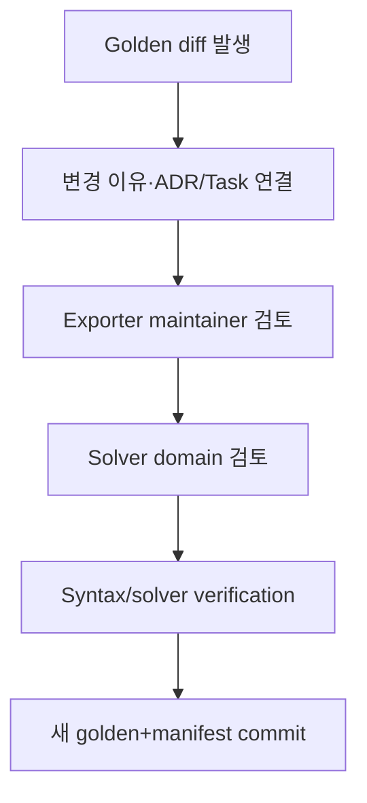

# 테스트 전략과 Solver-card Golden-file 테스트

## 1. 품질 목표

이 플랫폼의 실패는 단순 UI 오류뿐 아니라 단위 변환 오류, provenance 누락, 잘못된 parameter, solver card semantic 변화처럼 눈에 잘 띄지 않는 공학 오류를 포함한다. 따라서 일반 software test와 scientific validation을 분리하되 release gate에서 결합한다.

## 2. 테스트 분류

| ID prefix | 범주 | 실행 주기 |
| --- | --- | --- |
| `UT-*` | pure unit/domain/numeric function | 모든 PR |
| `PT-*` | property-based/metamorphic | 모든 PR 또는 nightly |
| `CT-*` | OpenAPI/event/job/plugin/schema contract | 모든 PR |
| `IT-*` | PostgreSQL/object store/worker/runner integration | 모든 PR |
| `ST-*` | security/RLS/sandbox/parser fuzz | PR + nightly |
| `NT-*` | numeric/scientific reference | 모든 scientific 변경 |
| `GT-*` | solver-card golden/semantic | exporter 변경마다 |
| `SV-*` | licensed solver verification | nightly/release candidate |
| `MT-*` | migration/upgrade/restore | release candidate |
| `PF-*` | performance/load/soak/fault injection | nightly/release candidate |
| `E2E-*` | raw→release vertical scenario | release candidate |

## 3. 일반 software test

### 3.1 Domain unit test

- aggregate/revision immutability
- lifecycle transition
- optimistic concurrency
- organization/project classification propagation
- selection membership hash
- job state machine/retry policy
- mapping report policy
- release completeness policy

DB/framework 없이 실행 가능한 domain test를 우선한다.

### 3.2 Contract test

- OpenAPI request/response와 generated client
- JSON Schema positive/negative fixtures
- CloudEvents envelope와 event data schema
- Job Spec/Result Manifest
- plugin manifest/version range
- IR envelope/model payload
- backward/forward compatibility와 breaking-change detection

Consumer-driven contract가 필요한 외부 PLM/HPC adapter는 target 결정 후 추가한다.

### 3.3 Integration test

Ephemeral PostgreSQL과 S3-compatible test storage를 사용한다.

- transaction + RLS
- multipart upload/staging/finalization
- worker claim/lease/crash/retry
- outbox publish/dedup
- plugin runner artifact I/O/sandbox
- provenance completeness/recursive query
- backup/restore fixture

Mock repository만으로 통과하는 test를 persistence integration의 대체로 쓰지 않는다.

## 4. Scientific numeric test

### 4.1 Reference test

각 numeric plugin/function은 다음을 갖는다.

- reference dataset의 출처·license
- expected values/curves
- absolute/relative/ULP tolerance 선택 이유
- input domain과 invalid cases
- 독립 계산 또는 domain expert 승인
- algorithm/plugin/dependency version

상용 제품 출력을 무단 복제한 fixture를 사용하지 않는다. 공개 표준, analytic solution, synthetic data 또는 사용 권한이 있는 내부 reference를 사용한다.

### 4.2 Property/metamorphic test

구체 모델에 맞는 property를 domain expert가 선택한다.

- unit conversion round-trip 또는 normalized equivalence
- 동일 point 중복/재정렬에 대한 명시된 behavior
- positive scale change와 response relation
- parameter bound enforcement
- symmetry/invariance
- monotonicity/energy/stability 조건
- 동일 seed reproducibility
- resampling density가 specimen weight를 바꾸지 않음

모든 material model에 monotonicity 같은 property를 일괄 적용하지 않는다.

### 4.3 Numeric tolerance

- 금액처럼 exact한 metadata/digest/schema는 exact equality
- deterministic serialized artifact는 byte equality가 목표
- floating result는 method별 abs/rel tolerance
- solver result는 metric/curve tolerance와 solver/platform matrix
- tolerance 완화는 code review와 domain approval 필요
- NaN/Inf는 explicit expected case 외에는 실패

## 5. 통계 test fixture

- hand-calculated mean/SD/median/MAD/IQR
- single observation, all equal, missing/censored, near-zero mean
- lot/batch strata와 unbalanced group
- curves with unequal grids/domains/truncation
- intersection/union-with-mask behavior
- bootstrap fixed-seed result
- outlier candidate와 adjudication scope
- converged Calibration Candidate versus explicit human Selection reason/current-revision promotion
- reference Validation Template/Plan exact revision pinning; mock/manual Result Manifest parity;
  normal/abnormal/not-available termination; shell-like external-job rejection; target/native-result
  mismatch; immutable deck/log/manifest evidence without a validation verdict
- T-28 reference interpretation: SI unit/target validation, finite/monotonic/truncated output,
  explicit observed-grid interpolation with no extrapolation, fixed relative-RMSE threshold,
  abnormal-output `not_evaluated`, and calibration Selection/holdout overlap rejection
- T-29 review governance: immutable request/decision rows, draft→review→approved or
  changes_requested transitions, manifest digest pinning, stale revision rejection, and
  author/reviewer separation of duties
- curve point 수를 늘려도 replicate `n` 불변
- display downsample과 full calculation 분리

## 6. Provenance·revision test

### 필수 invariants

1. output entity는 primary generation activity 하나를 가진다.
2. activity input은 구체 immutable entity revision이다.
3. derivation/revision DAG에 금지 cycle이 없다.
4. release에서 raw까지 complete path가 있다.
5. raw/released artifact digest는 변하지 않는다.
6. failure/cancel run도 usage/agent/log lineage를 가진다.
7. outlier decision은 input artifact를 변경하지 않는다.
8. migration은 old entity를 보존하고 explicit activity를 만든다.
9. a promoted IR must pin the current Candidate Selection revision, exact Candidate/diagnostics
   digests, and evaluated source IR revision; superseded selections and stale IR heads fail.
10. a T-28 Validation Result must pin the terminal Result Manifest and exact experimental Selection
    revision, create separate response/health/result Artifacts, and preserve every earlier Run,
    Manifest, Dataset, IR, Card, and result fact. The result cannot pass after abnormal/unhealthy
    evidence or fit/holdout overlap.

Property-based graph fixture와 intentionally corrupt DB fixture를 모두 둔다.

## 7. Solver-card golden-file 전략

### 7.1 Golden의 목적

Exporter code, unit conversion, formatting, solver version support가 바뀔 때 승인된 card의 text와 의미가 의도치 않게 바뀌는 것을 탐지한다.

Golden은 solver 정확성을 단독으로 증명하지 않는다. syntax/semantic regression과 licensed solver verification을 연결하는 기준이다.

### 7.2 Fixture matrix

각 golden case는 다음 tuple로 식별한다.

```text
(ir_fixture_id,
 ir_schema_version,
 exporter_plugin_digest,
 target_solver,
 target_solver_version,
 card_type,
 unit_system,
 export_options_profile)
```

Production model/solver가 `TBD`인 동안 synthetic exporter fixture만 둔다.

### 7.3 비교 단계

1. IR fixture schema/semantic validation
2. exporter preflight mapping report 비교
3. card 생성
4. raw byte 또는 canonical text 비교
5. parser/normalizer가 있으면 semantic representation 비교
6. syntax checker/dry-run hook
7. licensed solver smoke/virtual specimen reference

### 7.4 Volatile field 처리

timestamp, absolute path, random ID처럼 의미 없는 field는 exporter가 deterministic mode에서 제거하는 것이 우선이다. 제거할 수 없으면 `golden-normalization-policy`에 path와 이유를 allowlist한다.

숫자, keyword, parameter, units, table ordering, sign, interpolation option을 volatile 처리해서는 안 된다.

### 7.5 Golden update workflow



자동 `--update-golden` 결과를 검토 없이 commit하지 않는다.

### 7.6 Golden manifest

```json
{
  "case_id": "GT-TBD-001",
  "ir_fixture_sha256": "hex",
  "exporter_package_digest": "sha256:...",
  "target": {"solver": "TBD", "version": "TBD", "card_type": "TBD"},
  "unit_system": "TBD",
  "mapping_report_sha256": "hex",
  "card_sha256": "hex",
  "semantic_sha256": "hex",
  "approved_by": ["software-review-id", "domain-review-id"],
  "approval_date": "RFC3339",
  "reference_solver_run_id": null
}
```

## 8. Licensed solver test tier

Commercial solver license 때문에 모든 PR에서 solver를 실행하지 못할 수 있다.

| Tier | 환경 | 내용 |
| --- | --- | --- |
| Tier 0 | PR public/internal CI | exporter unit, golden text, parser, mock runner |
| Tier 1 | nightly licensed runner | card syntax/small virtual specimen |
| Tier 2 | release candidate | full selected validation template/reference |
| Tier 3 | periodic certification | supported solver/version matrix |

Tier 1 이상 결과는 solver version, platform, executable digest/installation ID, license context, runner, deck/result digest를 기록한다.

## 9. Plugin TCK

- manifest/schema/capability
- declared determinism
- corrupt/missing artifact
- cancel/deadline/resource quota
- no-network and filesystem escape
- structured diagnostics
- output role/media/schema/size
- provenance fields
- backward compatibility
- extension-specific scientific reference

TCK 통과는 scientific validity를 자동 보증하지 않는다. domain acceptance suite가 추가로 필요하다.

## 10. Security test

- role-action matrix와 SoD
- cross-organization/project/classification RLS
- list/count/facet/autocomplete leak
- object token scope/expiry/replay
- upload path/size/media/digest
- parser fuzz, decompression bomb, malformed solver output
- plugin network/path/symlink/process escape
- solver command injection
- secret/log redaction
- audit mutation/reorder/delete
- supply-chain digest/signature substitution
- backup privileged path와 restore access

## 11. Migration·upgrade test

- clean install latest schema
- supported previous release→latest migration
- rollback이 필요한 경우 명시; data migration은 forward-fix 우선
- revision/content hash 보존
- old IR/plugin/event compatibility
- migration provenance
- large-table lock/time budget
- backup restore 후 migration rehearsal

Migration script가 released/raw record를 재작성하면 명시적 ADR, before/after digest report, domain approval을 요구한다.

## 12. Performance·resilience test

- 2 GiB streaming upload 또는 합의한 최대값
- 10 million-point dataset import/view
- 10,000 material/release search
- 10,000-edge lineage traversal
- concurrent worker claim과 organization quota
- long solver wait/heartbeat
- object store transient failure
- DB failover/connection loss
- plugin memory/time exhaustion
- event publisher crash/duplicate
- backup/restore RPO/RTO drill

수치는 실제 sample 측정 후 NFR을 갱신한다.

## 13. E2E vertical scenario

Release candidate마다 다음을 자동 또는 반자동 실행한다.

```text
synthetic/approved raw tensile files
→ material/state/lot/batch/specimen/test context
→ upload/digest/import mapping
→ normalized dataset/original units
→ QC/statistics/outlier assessment
→ processing selection
→ calibration candidates
→ IR revision
→ exporter preflight/card golden
→ mock/licensed virtual specimen
→ review/approval/release
→ release-to-raw lineage and package digest verification
```

구체 production model/card는 결정 전까지 synthetic reference로 대체하고 release channel은 `non-production`으로 표시한다.

## 14. Test data governance

- 실제 기업 시험 데이터는 source control에 commit하지 않는다.
- fixture는 synthetic, anonymized 또는 명시적 사용 권한이 있어야 한다.
- fixture manifest에 source/license/classification/owner/retention을 기록한다.
- raw fixture도 immutable digest로 관리한다.
- domain golden은 변경 이유와 승인 history를 보존한다.
- production incident data를 test에 넣을 때 secret/IP/개인정보를 검토한다.

## 15. Release gate

### 모든 release

- lint/type/unit/contract/integration
- migration dry run
- RLS/security critical suite
- provenance invariants
- synthetic E2E

### Scientific/plugin/exporter 변경

- numeric reference/property tests
- plugin TCK
- domain reviewer approval
- golden diff review
- 해당 solver licensed tier 결과

### Production release

- critical/high unresolved security finding 0 또는 공식 risk acceptance
- backup/restore drill 유효
- NFR benchmark report
- release package integrity verification

## 16. 실패 처리

- flaky test는 자동 재실행만으로 숨기지 않고 owner/issue/expiry가 있는 quarantine에 둔다.
- numeric tolerance 초과를 단순 tolerance 확대만으로 해결하지 않는다.
- golden diff를 snapshot update로 덮지 않는다.
- solver version/environment 차이를 결과 metadata에서 숨기지 않는다.
- failing scientific test가 있으면 관련 plugin/release activation을 차단한다.

