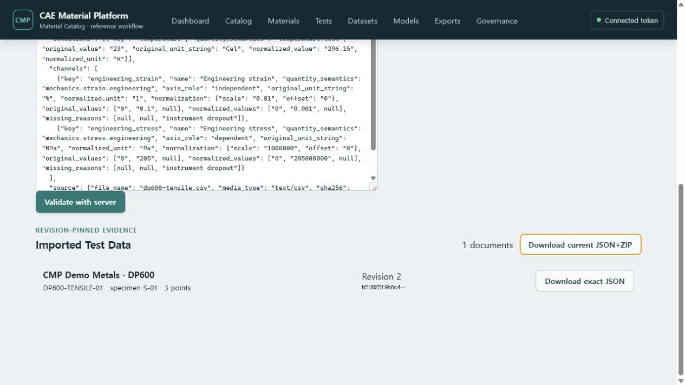
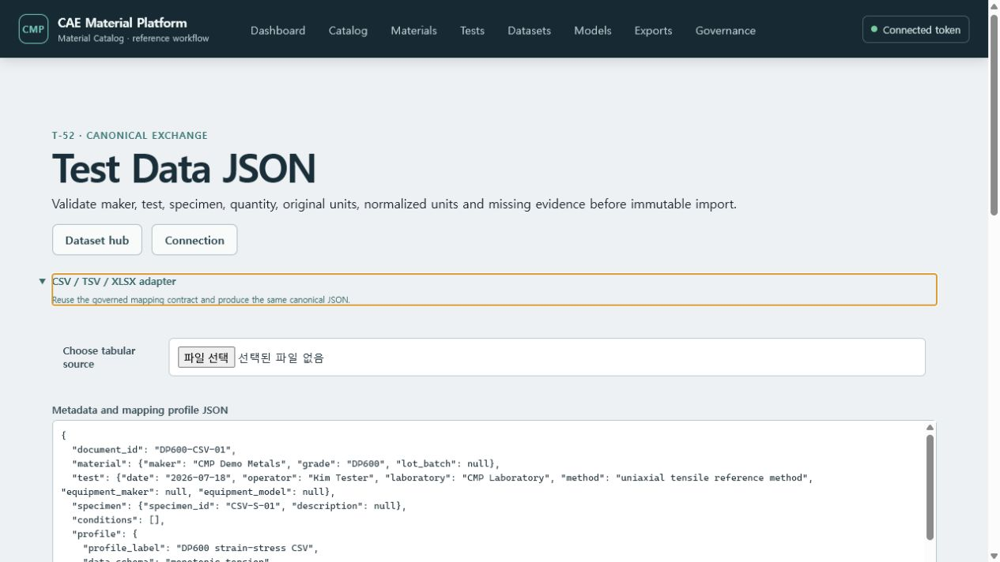

# T-52 Canonical Test Data import evidence

Verified on 2026-07-18 against the Docker Compose demo and PostgreSQL migration head
`20260828_062_test_json`.

## Demonstrated workflow

1. The user opened `/datasets/test-json` and validated a `cmp.test-data` 1.0.0 document.
2. The server displayed maker, grade, test, specimen, quantity semantics, original units,
   normalized units, missing counts and a deterministic semantic digest before persistence.
3. Import created one stable Test Data identity and immutable revision 1.
4. The revision pinned both canonical JSON and normalized Parquet Artifacts by UUID and SHA-256.
5. Listing reloaded from PostgreSQL and exposed the exact revision and canonical digest.
6. Exact-revision download returned `application/vnd.cmp.test-data+json`; the downloaded byte digest
   matched the pinned `X-Content-SHA256` value (`5f3d3e3f...a25d`).
7. Re-importing `DP600-TENSILE-01` with the exact current ETag appended revision 2 and new Artifact
   digests; downloading revision 1 still returned the original `Kim Tester` evidence.
8. The current-revision package endpoint produced deterministic ZIP bytes with UUID-safe paths,
   `manifest.json`, `checksums.sha256`, `README.txt` and canonical Test Data JSON entries.

## Evidence

- API/domain tests cover semantic preview, immutable import, list and exact-revision round-trip.
- Fresh PostgreSQL migration and the live Docker workflow verify typed condition/channel rows, RLS,
  Artifact pins and append-only revision storage.
- React tests cover server validation, unit/missing evidence and immutable import actions.
- Live adapter verification converted `310 MPa` to `310000000 Pa` while preserving both values and
  produced the same digest when the returned canonical document was validated through the JSON path.

This increment implements single-document JSON persistence and exact export. Deterministic JSON+ZIP,
CSV/XLSX canonical adapters and large-package streaming remain the next T-52 increments.
