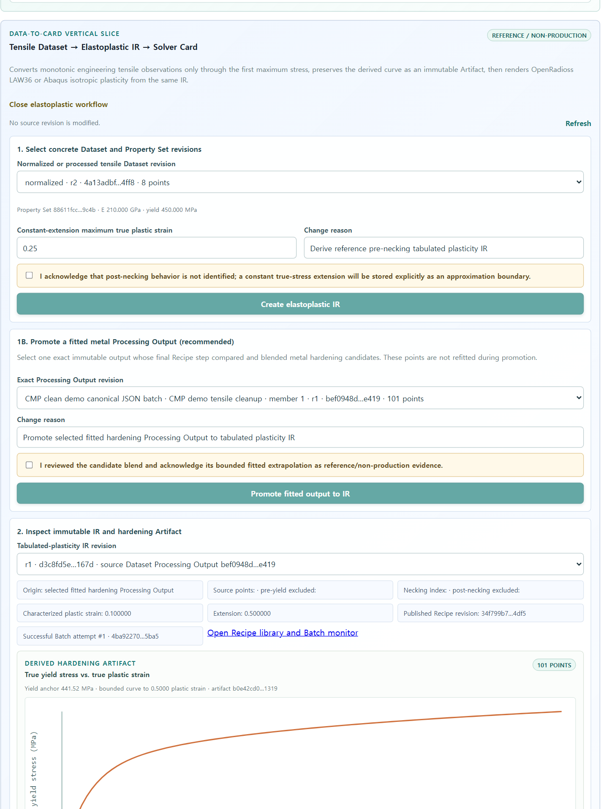

# T-70 saved metal Recipe/Batch promotion evidence

Date: `2026-07-19`

A clean Docker Compose database published the reusable metal hardening Recipe, executed it as a
common Processing Batch, promoted the successful exact Output to tabulated-plasticity IR schema
`1.3.0`, created canonical Neutral Material JSON with `processing_recipe=exact_revision`, generated
both native cards, and assembled the complete exchange package.

| Evidence | Exact value |
| --- | --- |
| Metal Material | `eac274ed-d05f-409e-9e16-fa6b2e4be713` |
| Metal Material State | `811d9139-aae6-4270-bf82-562ff245cb7a` |
| Published Processing Recipe | `c6572caf-464c-4091-a0fc-c0c55f209477` |
| Processing Batch | `28ec1d42-aef6-4411-a7cc-50ccae081a1c` |
| Successful Batch Attempt | `4ba92270-b6dc-4521-9c39-ac3eef165ba5` |
| Tabulated-plasticity IR | `420ac8bd-0c94-4913-8a81-55f8e768bb83` |
| Neutral Material JSON | `43a01351-e9da-40a2-9501-46a7f8b39ccf` |
| Abaqus `.inp` SHA-256 | `2727fd3dc9e3a56f29561027066dc7c8507bc96df864c218bf558f9bd0e980db` |
| OpenRadioss `.rad` SHA-256 | `b5f16a945bc4e85744cf71c4754e540610465bd3b47bbec11e6777af25107a8d` |
| Metal Bulk Bundle | `93925076-4465-4bd6-9f3a-ba5c6f7755e1` |
| Bundle SHA-256 | `3c44d2e24aaacb87a173a883fd5c6d008cf892f676cbc4dde02370331cf9ed71` |
| Bundle components | `13` |

The PostgreSQL model revision pins the same Recipe revision and digest, Batch, Member, Attempt and
Output revision. The browser shows the published Recipe and successful Attempt directly on the
selected IR and provides a deep link back to the Recipe library and Batch monitor.

The protected verifier checked the exact Recipe/Batch/Output chain, Neutral Recipe pin, both native
card digests and the 13-component package representation set. The isolated PostgreSQL integration
suite passed all 76 tests. The full CI script passed 773 Python tests (with those 76 environment-
gated tests separately exercised), 61 frontend tests, the production web build, bundle budget,
architecture, OpenAPI compatibility and user-guide gates. This remains reference/non-production
evidence; it is not solver execution or material qualification.
