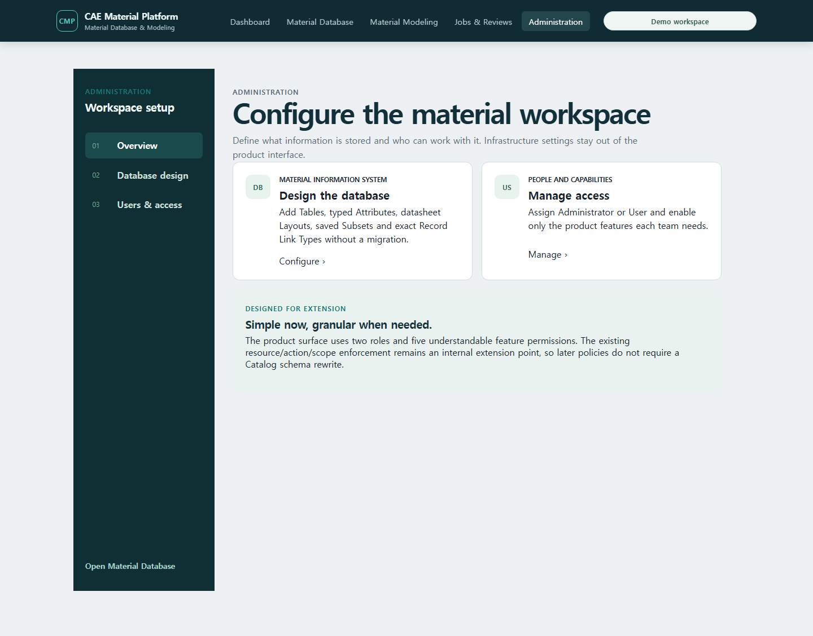
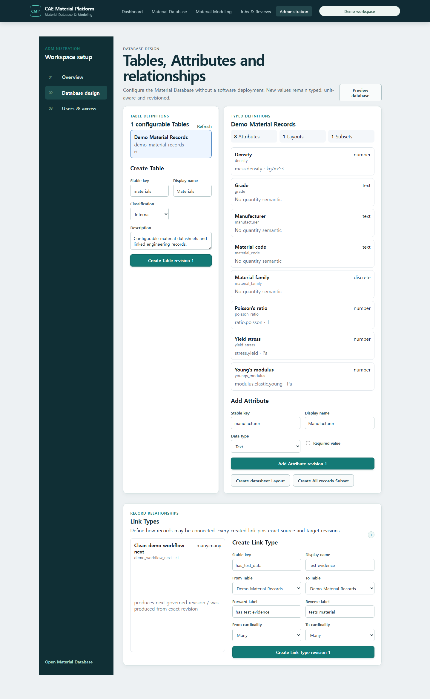
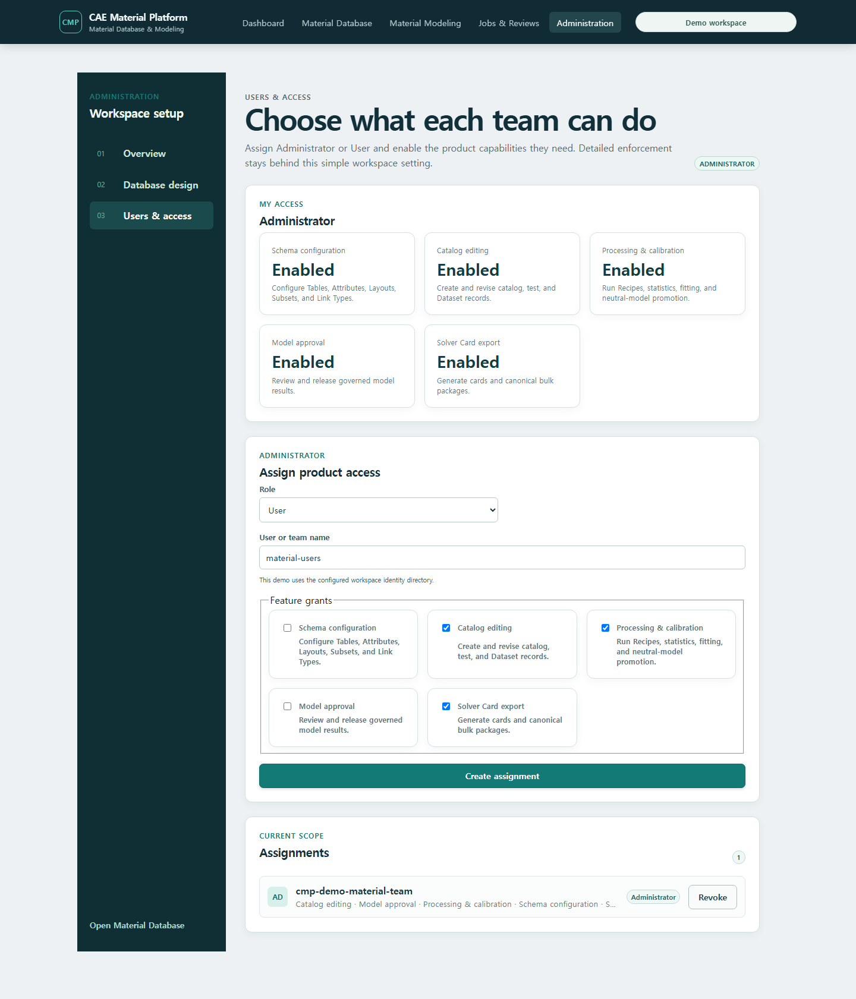

# T-78 product Administration evidence

Captured on 2026-07-19 from the Docker Compose demo at
`http://127.0.0.1:5173/administration`.

Administration is now one task-oriented product workspace rather than links to unrelated technical
pages. Its navigation has three areas:

1. **Overview** explains the two administrator jobs without API, bearer-token, tenant, RLS,
   identity-provider or policy-engine controls.
2. **Database design** manages configurable Tables, nine typed Attribute kinds, Layouts, Subsets
   and exact-revision Link Types. A Link Type fixes source/target Table revisions, forward/reverse
   labels and cardinality.
3. **Users & access** exposes only Administrator/User and five product capabilities. The current
   backend resource/action/scope enforcement remains the extension point for future granular
   permissions, but is not product-screen vocabulary.

The clean demo proves that the Administration UI reads the same configurable definitions used by
the T-77 Material Datasheet: one Table, eight typed Attributes, one Layout, one Subset and one
workflow Link Type. New definitions use the existing protected API and immutable revision engine;
this is not a static settings mock.

The access screen displays the effective Administrator assignment, human-readable capability names
and a simple User/team assignment form. Advanced issuer, principal UUID, classification scope and
legacy compatibility fields remain available to deployment integrations and protected contracts,
not to normal product users.

Verification completed before merge:

- focused Vitest covers the Administration route, hidden infrastructure/policy vocabulary,
  Administrator/User behavior, typed Attribute creation and exact-revision Link Type creation;
- TypeScript and the production Vite bundle gate pass;
- live Playwright captured all three areas against the Docker API and PostgreSQL demo;
- the complete CI command body passed Ruff, mypy over 651 files, architecture, contracts/OpenAPI,
  user-guide validation, 775 default Python tests, 68 frontend tests and the production bundle
  limit; the isolated Docker database passed all 76 PostgreSQL tests.
