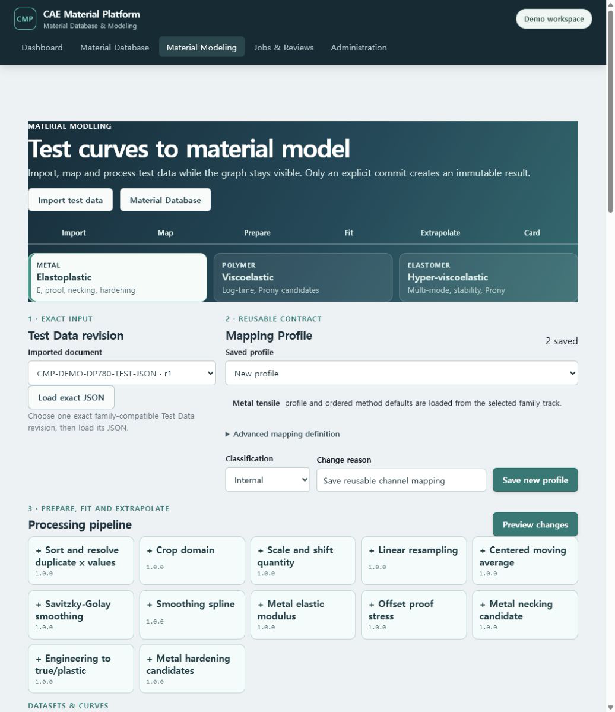
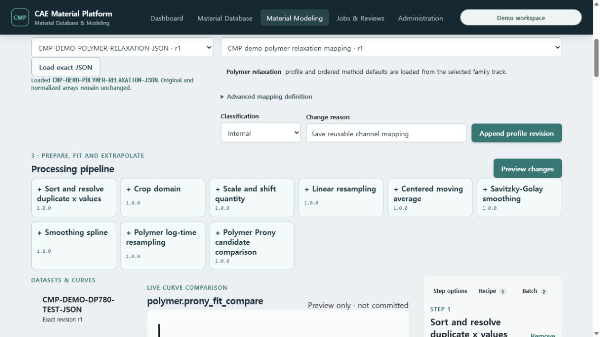
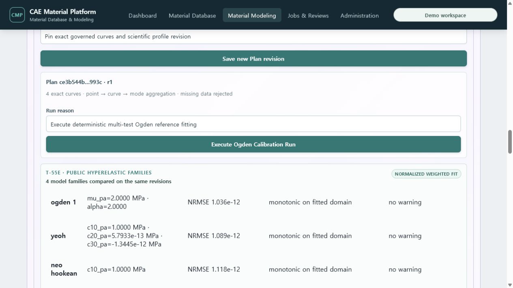

# T-80 family-aware Material Modeling evidence

Captured on 2026-07-19 from the Docker Compose demo at
`http://127.0.0.1:5173/modeling`.

T-80 keeps one Import → Map → Prepare → Fit → Extrapolate → Card shell and adds three explicit
material-family tracks. Switching a track replaces its Mapping Profile and ordered method defaults,
clears the previously selected Test Data revision, and loads a Material, Material State and typed
Property Set from the matching material class. A Test Data revision from another family is never
silently carried into the new quantity contract.

The right inspector now keeps Step options, versioned Recipe authoring and exact Batch
preflight/execution/retry beside the persistent graph. Recipe and Batch are no longer disconnected
technical sections below the workbench. Advanced Mapping Profile and Recipe JSON remain available
for audit and interchange without dominating the normal task flow.

## Live family journeys

### Metal elastoplastic

- loaded exact `CMP-DEMO-DP780-TEST-JSON` r1 and the published `CMP demo tensile cleanup` r2 Recipe;
- the server calculated engineering-to-true/plastic conversion and Voce, Swift,
  Hockett--Sherby and Ghosh hardening candidates;
- the graph showed the observed fit domain, the bounded extrapolated domain and the explicit
  selected Swift/Voce combination;
- the embedded material delivery panel loaded `DP780 synthetic demo steel` and its exact
  `As received · synthetic reference` State and exposed the existing elastoplastic IR/card flow.

### Polymer viscoelastic

- selected the Polymer track, then explicitly loaded
  `CMP-DEMO-POLYMER-RELAXATION-JSON` r1 and its saved Mapping Profile;
- server preview produced log-time resampling and Prony candidate comparison;
- the embedded panel loaded `Demo Polymer Prony` and `Reference conditioned` revisions;
- the exact reviewed Processing Output, three-term generalized-Maxwell IR, fit metrics, Neutral
  Material JSON and Abaqus/OpenRadioss mapping preflight controls remained in the same page.

### Elastomer hyper-viscoelastic

- loaded `Demo Elastomer Ogden-Prony` and `Reference cured` revisions;
- restored the saved `Public synthetic multi-test Ogden t60-reference` Plan with four exact
  normalized curves: uniaxial, planar and biaxial calibration plus an uniaxial holdout;
- executed a new deterministic Run from that exact Plan revision;
- compared Ogden, Yeoh, Neo-Hookean and Mooney--Rivlin families and eight Ogden multistart
  candidates, with observed/fitted/residual curves, holdout RMSE, rank and uncertainty evidence;
- retained the manual Ogden--Prony IR and both Abaqus/OpenRadioss card controls below the fit.

## Verification

- live Docker/PostgreSQL browser journeys completed for all three tracks;
- the browser reported no application error-level console entries; the only reconnect message was
  the expected Vite development-server restart during the CSS rebuild;
- focused tests cover track templates, Recipe/Batch inspector controls and exact material-class
  context switching;
- all 69 frontend tests and the TypeScript/Vite production bundle gate passed;
- the complete default Python suite passed 775 tests with 76 environment-gated tests skipped;
- the isolated PostgreSQL marker suite passed all 76 tests;
- Ruff, mypy, architecture, contract/OpenAPI and user-guide gates passed.

T-80 does not claim the final reviewed-delivery step. T-81 consolidates candidate approval, exact
Recipe/Batch/Attempt evidence, Neutral JSON, six-state mapping report, native card downloads, bulk
package and Material Datasheet return into the last step of this same workspace.
