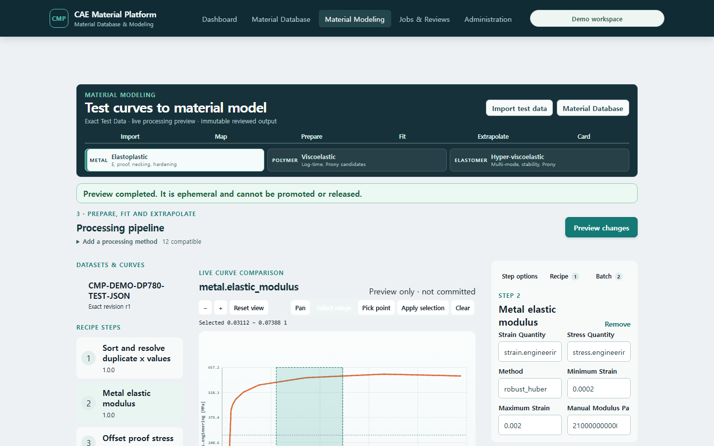

# T-85 Engineering Modeling Shell — checkpoint evidence

Date: 2026-07-20

This is an implementation checkpoint, not a claim that T-85 or GUI parity is complete.

## Live product evidence

- Dashboard: the former marketing hero is replaced by explicit Material Database and Material Modeling
  work lanes, each with a one-action entry point; reference family journeys are supporting content.
- Runtime: the web container was rebuilt against the demo PostgreSQL and API services.
- Route and viewport: `/modeling`, 1440×900.
- Input: synthetic DP780 Test Data, exact revision 1.
- Semantic routing: the Metal rail is populated from explicit strain/stress quantity semantics; the polymer relaxation document is excluded.
- First server preview: four public hardening candidates and the selected blend are visible without API, token, tenant, UUID, or digest input.
- Plot interaction: titled axes and units, ticks, crosshair coordinates, cursor-centred zoom, drag pan, reset, and five independently visible series.
- Workbench coordination: selecting a Recipe step changes the graph stage and the right-hand task inspector; hiding a legend series changes the plotted series immediately.
- Direct graph command: range and point modes remain ephemeral until Apply; Apply converts the selection
  to a compatible step option in the Recipe draft, after which an existing Save action creates a new revision.
- Preview lifetime: changes debounce for 300 ms, abort the preceding preview request and only let the latest
  response update the graph.




## Automated evidence

```text
npm test --workspace @cmp/web -- --run src/engineering-curve-plot.test.tsx src/common-processing-workbench.test.tsx src/material-modeling-workspace.test.tsx
3 test files passed, 13 tests passed

npm run build --workspace @cmp/web
TypeScript, Vite build, and bundle budgets passed
```

## Still open before T-85 completion

- Datasheet/recent-session deep links that restore Material, Dataset, Recipe and objective context.
- Fit-domain handles, modulus and blend sliders, necking marker, residual/derivative panels.
- Complete T-86 through T-90 family workflows and T-93 clean-environment acceptance.

