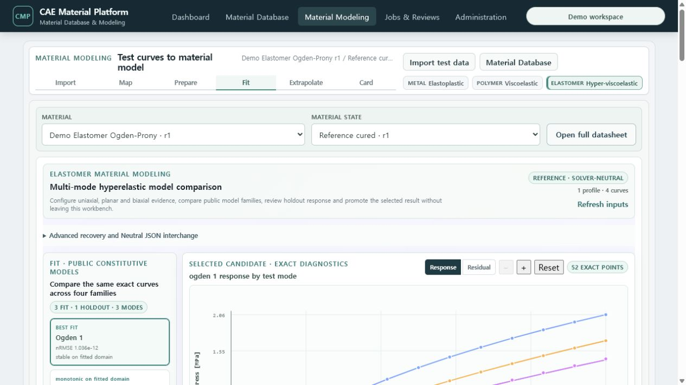
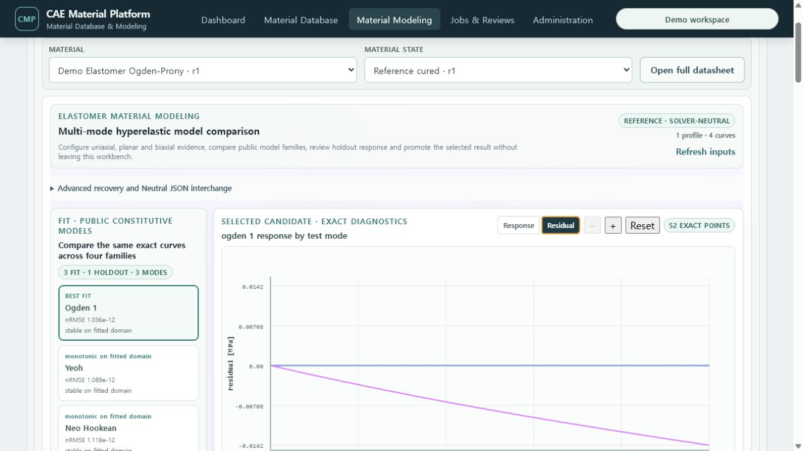
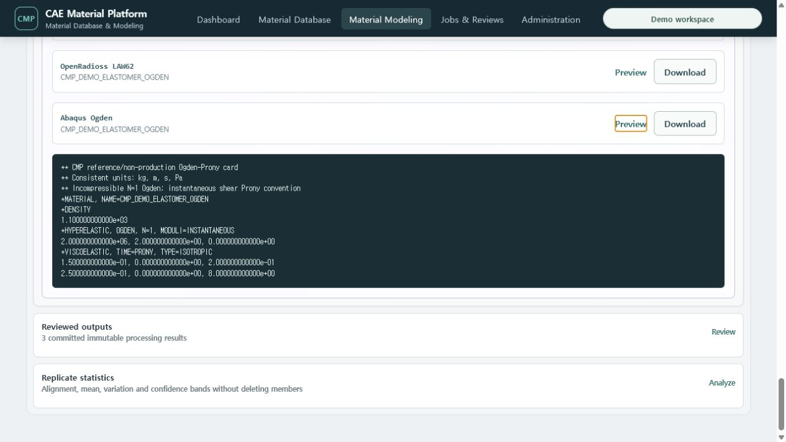
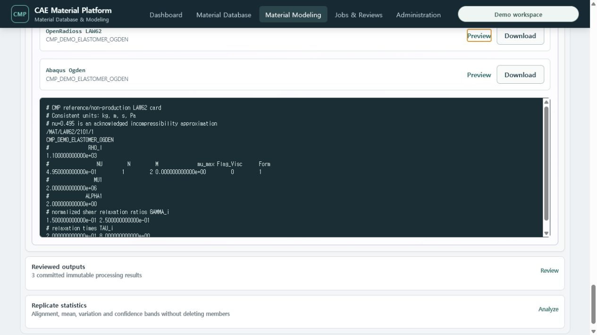

# T-90 Elastomer multi-mode workbench evidence

T-90 replaces the generic Elastomer processing surface with a graph-centered, exact-data
engineering workbench. The normal path no longer asks for a Run UUID. Opening **Elastomer → Fit**
restores the latest saved Calibration Plan, its exact Dataset roles/modes/weights, the reviewed Run,
the selected family Candidate and its diagnostics.

## Accepted browser journey

The Docker/PostgreSQL demo loaded the following immutable evidence in a 1440×900 browser:

- 4 normalized curves: three calibration curves and one holdout curve;
- uniaxial, planar and biaxial test modes;
- Neo-Hookean, Mooney–Rivlin, Yeoh and one-term Ogden family results;
- 8 deterministic multistart Ogden Candidates;
- 52 exact diagnostic points with measured/predicted response and residual views;
- the exact two-term Prony relaxation overlay from the current model revision;
- a reviewed Neutral Material JSON revision;
- native Abaqus Ogden+Prony and OpenRadioss LAW62 cards.

The family rail and persistent plot share the first desktop viewport. The plot has quantity/unit
axes, engineering ticks, legend, per-mode and holdout roles, point tooltips, response/residual tabs,
zoom and reset. Long Plan editing, promotion and recovery controls remain below the primary graph or
inside progressive disclosure.

## Solver delivery evidence

The same product session restored both existing native cards and previewed their real ASCII content.
The Abaqus card contains `*HYPERELASTIC, OGDEN, N=1` and `*VISCOELASTIC, TIME=PRONY`. The
OpenRadioss card contains `/MAT/LAW62` and the ordered normalized shear-relaxation ratios and times.
OpenRadioss incompressibility remains an explicit `approximated` mapping. A mapping report that
contains `approximated` or `ignored` items now requires a visible review acknowledgement before a new
card can be generated.

This is reference/non-production engineering functionality. It does not claim actual solver-run
correlation or production material qualification.

## Verification

- Web production build and bundle budgets passed.
- All 82 web component/regression tests passed before final browser acceptance.
- The exact Docker/PostgreSQL browser journey verified Plan restoration, 3 fit + 1 holdout, three
  modes, four families, 52 diagnostics points, response/residual switching, Prony terms and both
  native card previews.

