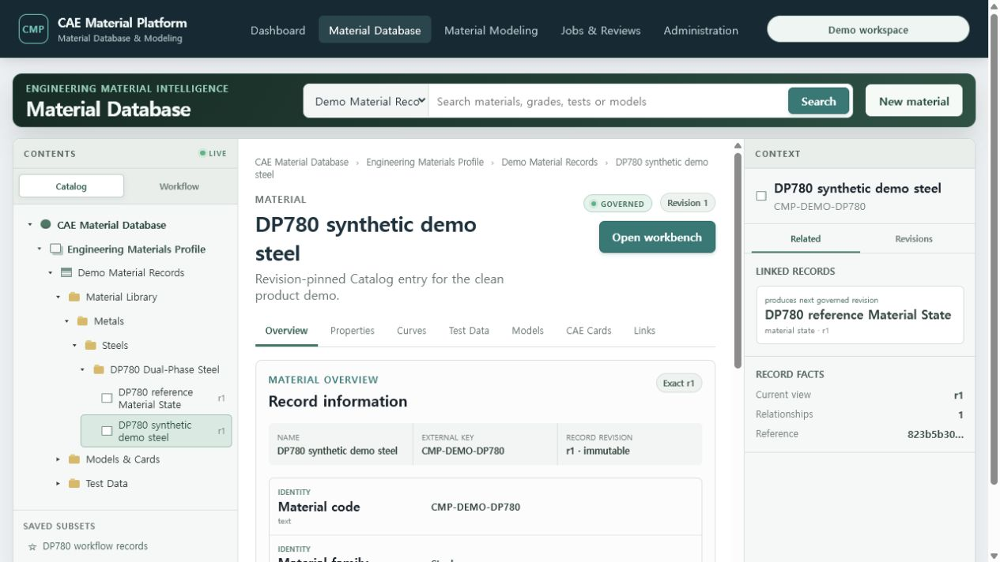
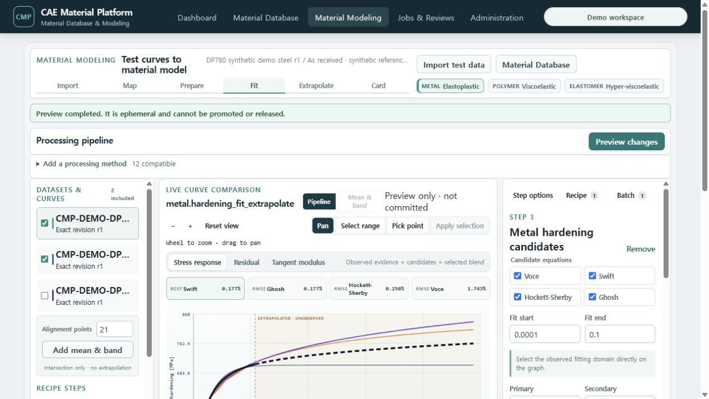
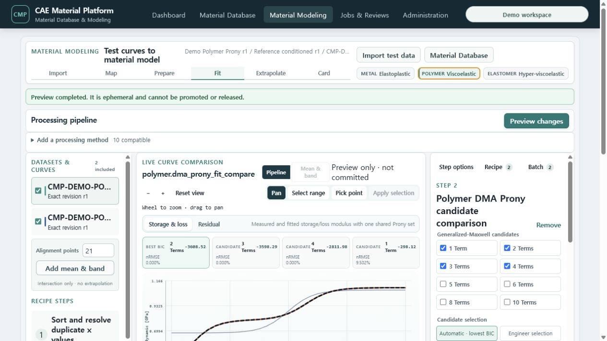
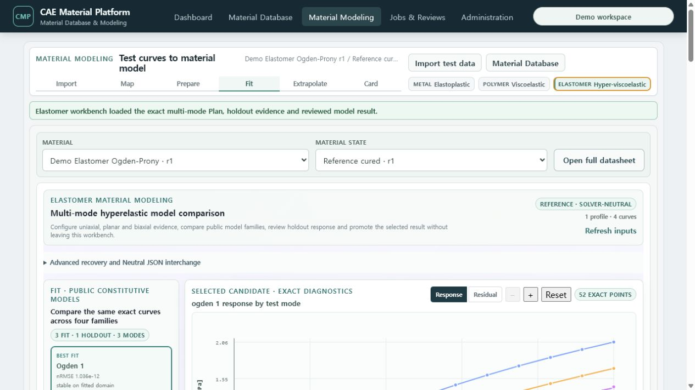

# T-93 clean product acceptance

Date: 2026-07-20

## Clean-room procedure

1. Removed the demo PostgreSQL and object-storage volumes.
2. Rebuilt API, worker, web, migration, seed and reference-plugin images.
3. Applied every PostgreSQL migration to a new volume.
4. Ran the synthetic seed once, then ran the independent full-demo verifier.
5. Opened the new service in the browser and exercised Dashboard, Database and all three Modeling tracks.

No prior demo aggregate or object artifact was retained.

## Reproduced product evidence

- Material Database: 8 exact Workflow records, nested Folder hierarchy, configured Layout Datasheet,
  typed original/normalized units and revision-pinned Related navigation.
- Metal: 3 canonical Test JSON replicates, server hardening candidates/extrapolation, exact Recipe/Batch,
  Neutral JSON, Abaqus/OpenRadioss native cards and a 19-component checksum bundle.
- Polymer: relaxation and DMA Prony paths, WLF/Arrhenius evidence, exact promotion and both bounded cards.
- Elastomer: 4 multi-mode/holdout Datasets, 4 public families, 52 diagnostic points, 2 Prony terms,
  Neutral JSON and both bounded cards.
- Browser session recovery: an exact revision saved before the clean reseed falls back to the new valid
  Catalog record instead of leaving an empty database pane.

## Browser evidence

## Regression evidence

- Ruff: passed
- mypy: 652 source files passed
- architecture and OpenAPI lint/compat: passed
- Python: 779 passed, 76 expected PostgreSQL skips
- isolated actual PostgreSQL: 76 passed, 123 deselected
- frontend: 34 files, 83 tests passed, including the clean-reseed stale-session regression
- production TypeScript/Vite build and bundle budgets: passed
- user-guide checker and clean full-demo verifier: passed

## Acceptance boundary

This accepts the independently implemented, public-equation `reference/non-production` product flow.
It does not claim real Abaqus/OpenRadioss execution correlation, company-specific material qualification
or `production-approved` constitutive models.
