# Issue #160 review and publication acceptance trace

This trace records the bounded primary journey for review, Materials publication, exact
download, and recovery. It is intentionally separate from negative and technical test cases.

1. **Setup / fixture** — A synthetic Materials Record is bound to immutable Material, Test Data,
   Material Model, Neutral Material, and solver-card revisions. The demo workspace exposes the
   Administrator, User, and Reviewer personas; the Reviewer has the review decision command.
2. **Operator actions** — The User submits an exact Record or Test Data revision with its source
   digest. The Reviewer opens the pending request in Activity, records an approve or reject
   decision, and the User searches Materials and opens the resulting exact model, Neutral Material,
   or solver card route.
3. **Visible outcome** — Activity shows the requester's display-name snapshot and decision state;
   Materials shows the approved Record row and only its approved domain bindings; exact routes show
   the pinned revision, with identifiers and digests in Advanced/Evidence details. A Neutral card
   delivery shows its receipt and lifecycle state.
4. **Persistence / read-back** — PostgreSQL stores immutable request, decision, lifecycle event,
   review projection, publication marker, exact domain binding, outbox event, and delivery receipt.
   Reloading the Materials route, direct exact URL, or Activity context reads the same stable and
   revision pins; replaying a delivery returns the existing receipt.
5. **Preserved contract and state** — Raw bytes and revisions remain immutable; publication is
   current-head and exact-binding aware; changing an upstream head invalidates the old projection
   without rewriting history. Authorization remains enforced in the service and database, and
   grandfathered pre-#160 validation-result approvals remain readable without creating a new typed
   publication bypass.
6. **Recovery** — Failed request, decision, download, and delivery states retain actionable
   context. Activity recovery keys include stable identity, exact revision pins, and target, so a
   newer revision is not silently substituted; a retry resumes the same bounded operation.
7. **Owned scope** — Review evidence/resolution, publication predicates, exact links/download
   routes, multi-binding Materials surfaces, persona seed/token route, target-delivery binding and
   receipt wiring, Activity recovery, contracts, and the #160 user/evidence documentation.
8. **Forbidden shortcuts** — No `latest` or current-head substitution for direct links/downloads;
   no direct catalog visibility without an approved exact binding; no mutation of raw/released
   revisions; no UUID/hash identifiers on normal surfaces; no silent approximation, CSS scale/filler,
   or test-only database constraint bypass.
9. **Exact acceptance** — Unit/API/Vitest coverage passes for evidence, currentness, personas,
   exact routes, multi-binding rendering, and recovery; PostgreSQL integration coverage passes for
   Record/Test Data review and target delivery when an isolated `CMP_TEST_POSTGRES_DSN` is available;
   `npm run build`, documentation impact checks, and the required five viewport live captures are
   recorded by the main acceptance owner.

## Final capture and visual evidence

10. **Deterministic capture set** — The review-submission flow produced seven tracked captures from
    `2026-08-09T07:27:34+09:00` through `2026-08-09T07:28:03+09:00`, including the clean Material
    revision r19. The Reviewer Activity flow produced six tracked captures from
    `2026-08-09T07:34:59+09:00` through `2026-08-09T07:35:19+09:00`: five viewport captures and a
    1440×900 Recent outcomes history view with 24 immutable decided rows and genuine local overflow.
    The five Activity viewports are 1366×768, 1440×900, 1920×1080, 2560×1440 and 3840×2160.
11. **Visual acceptance** — Q03 visibility and wrapping, Q09 local overflow/rail behavior, and Q16
    task-surface continuity pass on the opened originals. Reviewer Activity `Needs attention` Q20
    remains **FAIL** at 2560×1440 and 3840×2160 because controls and text are tiny fixed-density.
    The Product Owner explicitly authorizes publication/merge of the current Task 1 PR with this
    exact failure carried as the next #160 Task 2 and global #184 evidence; this is not Q20 approval,
    #160 completion, or Task 2 implementation.
12. **Boundary** — #160 adds no route-specific 4K CSS, CSS `zoom`, blanket `transform: scale`,
    fabricated filler, or other workaround. The original 1920×1080, 2560×1440 and 3840×2160 Activity
    paths, the 1440×900 Recent outcomes local history, and the Q09 pass remain preserved evidence.
13. **Before/current comparison** — The five before/reference originals under
    `docs/17-evidence/images/issue-160-review-publication/before/` are the `origin/main` `b993542`
    baseline rendered through a read-only frontend connected to the same current deterministic API
    dataset. The five current Activity originals remain under `docs/user-guide/images/current/`, with
    the 1440×900 Recent outcomes history. The [visual-evidence sidecar](images/issue-160-review-publication/visual-evidence.yaml)
    records the headless Chromium, 100% browser zoom, five CSS viewports, exact before/reference/current
    paths, crop rectangles and names, SHA-256 values, and dimensions. The root opened every new original
    and crop at original resolution; each crop is a direct 1:1 pixel clone with no scaling or interpolation.
14. **Saved-view reference state** — At 1920×1080, 2560×1440 and 3840×2160, each before
    `saved-view-area` crop proves the baseline had no saved-view tabs, while the corresponding after
    `saved-view-tabs` crop records the current tabs. This is comparison evidence only: Q20 remains
    **FAIL** for the named wide Activity state, with the existing Product Owner carryover to #160 Task 2
    and global #184; it does not imply Task 2 implementation or #160 completion.

### Opened comparison artifacts

Before/reference originals:

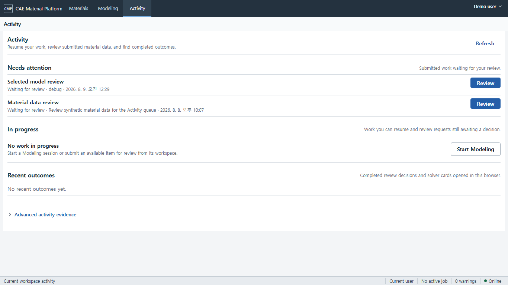
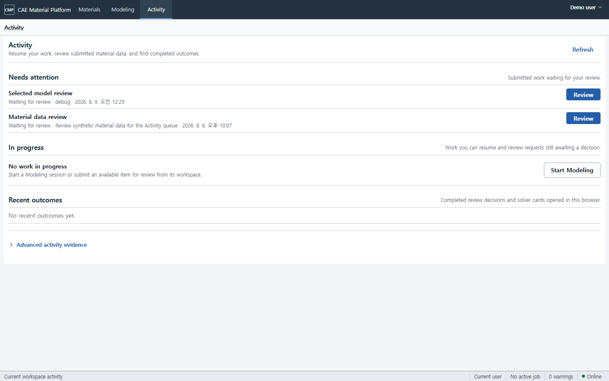
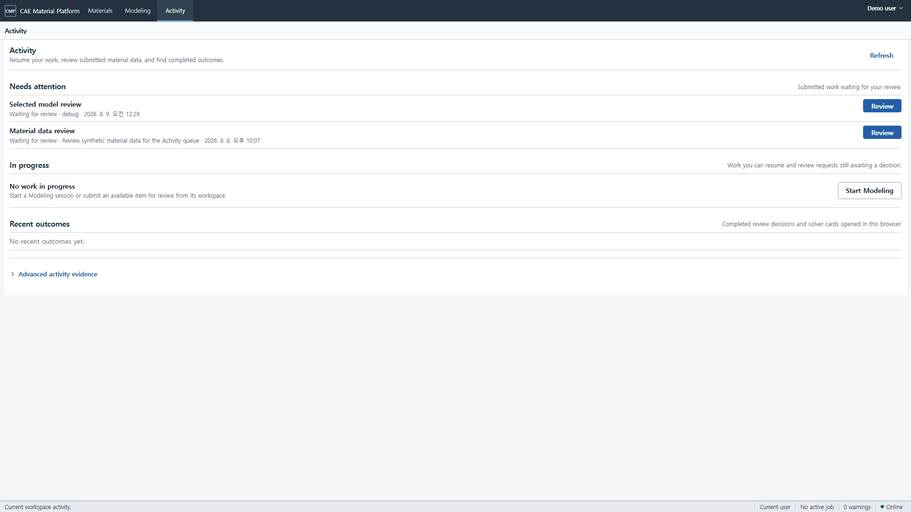
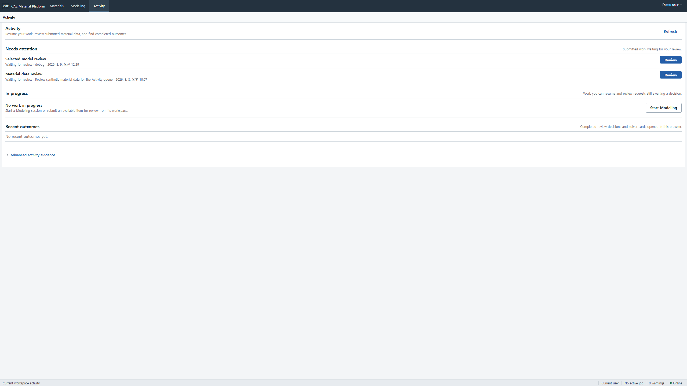
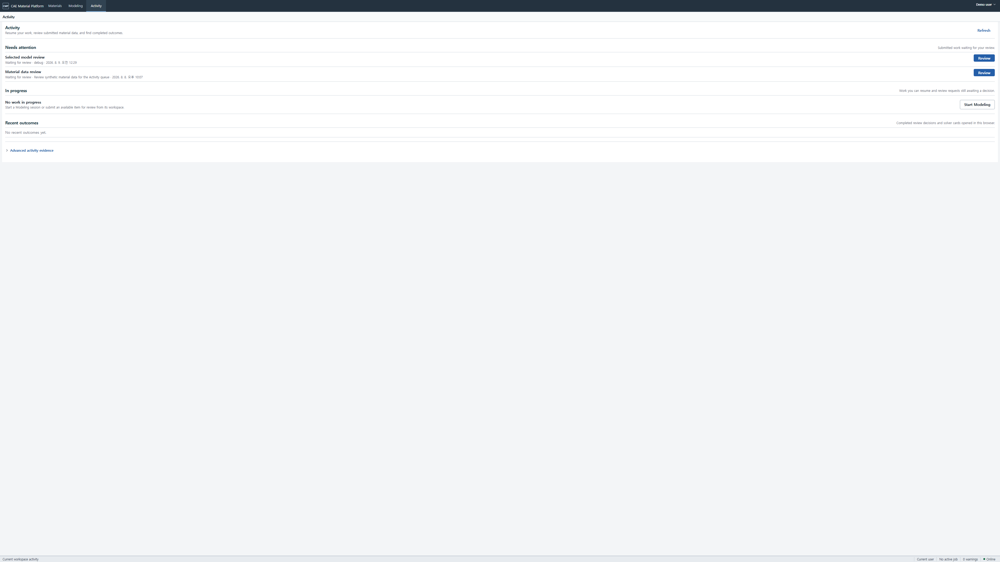

Before/reference 100%-pixel crops:

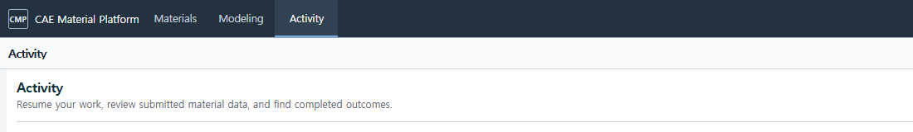

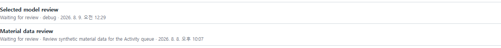

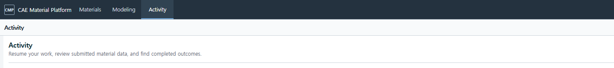

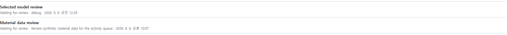

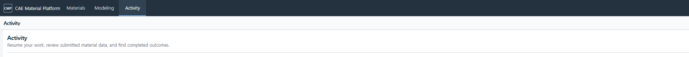

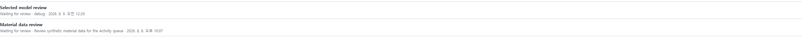

Current 100%-pixel crops:

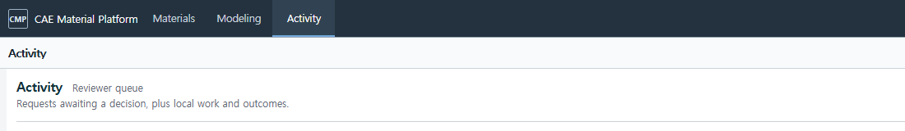

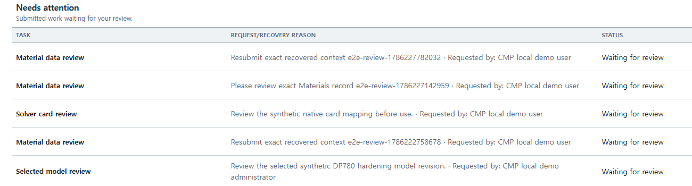
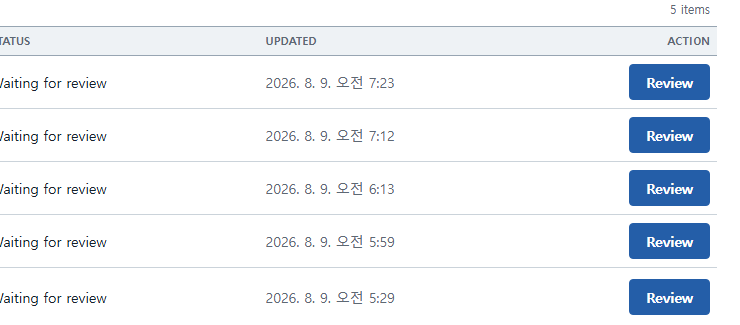
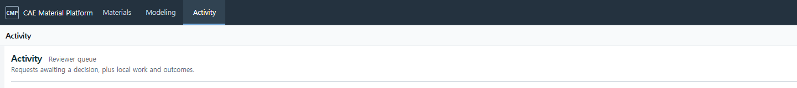

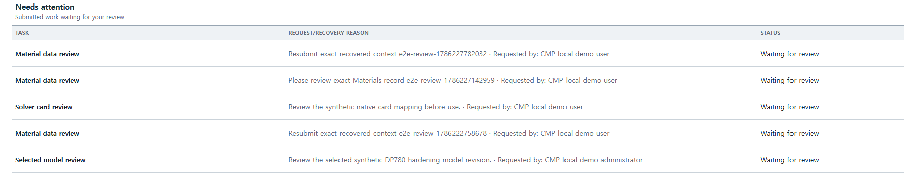
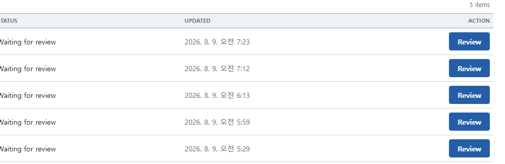
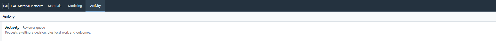

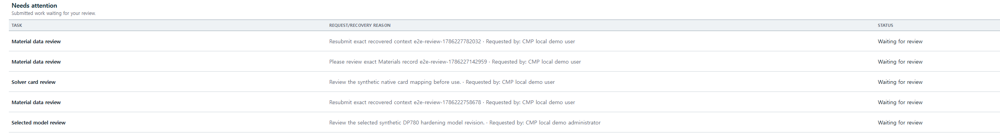
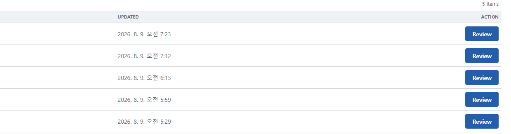
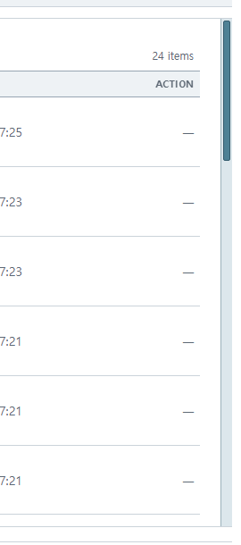
