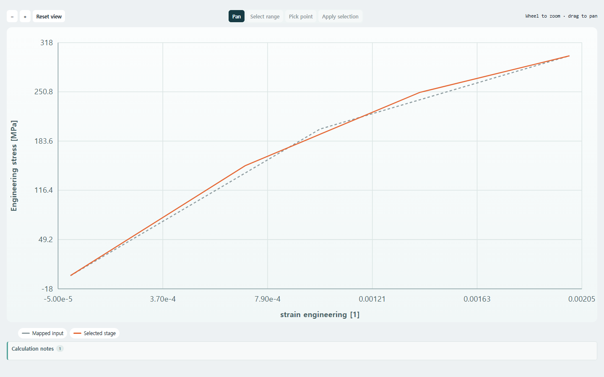
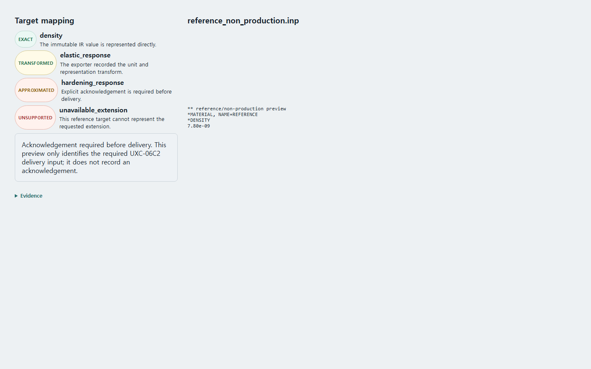

# DUI-09 Storybook component-QA evidence (historical)

These two PNGs are historical component-QA evidence, not current product-route screenshots and not
normal-user navigation. The current user-guide manifest and `docs/user-guide/images/current/` contain
only the 32 deterministic product-route captures from the PR #156 baseline.

`storybook-foundation-1440x900.png` was captured from the isolated `EngineeringCurvePlot` foundation
story at merged commit `70aca87` (PR #148). `storybook-governed-workflow-1440x900.png` was captured
from the governed workflow component story at merged commit `6b5c8f6` (PR #149), including mapping
state examples. Neither capture writes product data, approval, release, or delivery state.

To reproduce this historical component evidence locally, start Storybook and run:

```powershell
uv run --with playwright python scripts/capture_storybook_foundation.py --base-url http://127.0.0.1:6006 --scope foundation
uv run --with playwright python scripts/capture_storybook_foundation.py --base-url http://127.0.0.1:6006 --scope governed
```




