# Issue #167 service reference freeze

Status: in progress; reference authoring packet and approval evidence

Issue: [#167 — Complete service reference freeze](https://github.com/pikachu444/cae-material-platform/issues/167)

Baseline: `6e835a5b1797f237993d296ebca76736da82cb7b` on latest `main`

Requirements: `FR-NAV-003`, `FR-UX-005`, `FR-UX-010`, `FR-UX-011`,
`NFR-SEC-006`

Architecture decisions: `ADR-0028`, `ADR-0030`, `ADR-0034`

Backlog: `docs/13-delivery/desktop-engineering-ui-backlog.md` — `#167`

## Execution contract

- The main agent owns requirement interpretation, product/UX judgment, the authoring packet, direct
  image inspection, and the final disposition.
- GPT-5.6 Luna is not callable in this surface. Because #167 is a large service-wide reference
  freeze, the first bounded author is one fresh GPT-5.6 Sol High subagent under the large-change
  exception in `AGENTS.md`.
- The author must read this exact packet and work only on the bounded target below. A second writing
  agent must not run concurrently.
- After deterministic checks and main-agent inspection, one fresh GPT-5.6 Terra High read-only
  reviewer receives only the bounded reviewer packet. At most one evidence-backed correction and
  re-review is permitted.
- Automatic LLM review remains disabled under #119.
- Production React/CSS, current user-guide screenshots, backend, API, domain data, and the incoming
  package are outside this reference-only slice.

## Main-agent source inspection

The main agent read the issue, repository instructions, required visual skills, product/interaction
specifications, domain/revision/architecture contracts, API authorization rules, test strategy, and
the current Materials implementation before writing this packet.

Actual images opened at original resolution:

- `docs/00-research/ux-reference-gallery/images/granta-mi-favourites-list.png`
- `docs/00-research/ux-reference-gallery/images/material-data-center-search-detail.png`
- `docs/00-research/images/gui-reference/granta-profile.png`
- `docs/00-research/images/gui-reference/granta-list-results.png`
- `docs/17-evidence/images/ux-layout-review/materials-1440x900.jpg`
- `docs/17-evidence/images/uxc-00d-responsive-design/materials-1440x900.png`
- `docs/user-guide/images/current/materials-search-1440x900.png`

Applied principles:

- retain a stable Database/Profile/Table/Folder/Record navigator and independent tree search;
- keep the dense result grid wider and more important than optional selected context;
- update selected context in place and put the exact next command next to that context;
- use flat dividers, compact rows, restrained titles, and data-first density;
- preserve the current compact application shell and server-scoped query contract.

Explicitly excluded:

- commercial branding, icons, colors, proprietary database structure, and exact geometry;
- UXC-00D's `Manufacturer/source`, `Yield`, `Condition`, and `CAE cards` search-result projections,
  because the current scoped Materials query does not supply their governed source, quantity,
  condition, unit, or readiness semantics;
- a global Compare command, property/card claims in selected context, released-card language,
  UUIDs, hashes, classification, JSON, and provenance on the normal search screen.

## Authoring packet 01 — Materials search / normal / 1440×900

### Exact target

Create the first pending #167 reference image:

`materials-search-normal-1440x900`

This target is one image approval unit. Its HTML/CSS foundation must be responsive enough for later
1366×768 and 1920×1080 captures, but this packet captures and registers only 1440×900. Do not create
or submit the later viewport images before the product owner reviews this first image.

Required new files:

- `docs/00-research/ux-service-reference/materials-search-normal.html`
- `docs/00-research/ux-service-reference/reference.css`
- `docs/00-research/ux-service-reference/reference.js`
- `docs/00-research/ux-service-reference/capture_reference.py`
- `docs/00-research/ux-service-reference/validate_reference.py`
- `docs/01-product/service-reference-manifest.yaml`
- `docs/17-evidence/images/issue-167-service-reference/materials-search-normal-1440x900.png`
- `docs/17-evidence/images/issue-167-service-reference/materials-search-normal-1440x900.measurements.json`

The source and image paths above are exact. Reuse lessons from
`docs/00-research/ux-layout-review/materials.html`, `review.css`, and `review.js`, but do not mutate
those historical sources or reuse their invalid result projections.

### User task

A User searches for a known steel, sees a complete authorized result page, selects one row without
losing the navigator or result state, and can open its datasheet. The first viewport must make the
query, governed tree, result total, selected row, selected context, and `Open datasheet` consequence
obvious without exposing internal identifiers.

### Required screen content

Use synthetic, non-production reference copy only.

- Application bar: current compact dark shell, `CMP`, `CAE Material Platform`,
  `Materials | Modeling | Activity`, `Demo user`; no subtitle or marketing copy.
- Workspace command bar: compact `Materials` title only. Do not add generic commands.
- Search band: query value `steel`, one filled `Find` action.
- Navigator modes: `Browse | Filters | Subsets`, with `Browse` selected.
- Scope controls: `Materials Database`, `Engineering Materials`, `Demo Material Records`.
- Tree-local search: `Find folder or record`, followed by a visible
  Database → Profile → Table → Folder → Record hierarchy and selected DP780 record.
- Results: `1–6 of 6 matches`, helper text `Enter opens · select up to 3 to compare`, and exactly the
  governed columns `Compare | Material / grade | Family | Description | Status`.
- Rows: six synthetic steel-oriented reference rows whose visible values all match the query.
  The first selected row is `DP780 synthetic demo steel`, grade `DP780-REF`, family `Metal`,
  description `Synthetic local-demo data; not validated engineering data.`, status `Draft`.
  Other rows must remain plainly synthetic/non-production and must not imply a production standard,
  released card, approved model, or confidential source.
- Selected context: `Selected material`, the selected name and grade, the same description,
  `Family: Metal`, `Status: Draft`, and one `Open datasheet` action.
- Status bar: selected human name/code, `r1 · draft`, `No active job`, `0 warnings`, `Online`.

Do not show provider, manufacturer, source, Yield, condition, property values, solver availability,
card readiness, release, validation, approval, or download on this search target. Those fields have
no current server-scoped Materials search projection and belong to later exact datasheet/card
references only when their source contracts exist.

### Layout and visual authority

At 1440×900:

- application bar: 46 px;
- workspace command bar: 38 px;
- search band: 40 px;
- status bar: 24 px;
- outer workspace margin: 8 px on each side;
- navigator: 264 px;
- optional selected context: 280 px;
- divider visual: 1 px with a 5 px accessible hit region;
- result region: remaining width and at least 720 px;
- tree rows: 24–26 px, 12–13 px regular/medium labels;
- result rows: 32–36 px, 13–14 px data text;
- controls: 2–4 px radius only; persistent panes/tables: zero radius and zero shadow.

Results must be wider than selected context. Use alignment, white space, and dividers before
background, border, radius, or shadow. Do not use gradients, nested cards, badges for counts,
eyebrows, hero copy, decorative illustration, or a centered fixed-width page.

The selected row uses a flat accent background plus an accent edge. Table headers are visually
resizable and sticky in the intended production mapping. Long text truncates with a title while the
row identity remains understandable.

### Static-region → production contract mapping

| Static region | Current React/component | State/source contract | Preserved behavior |
| --- | --- | --- | --- |
| application and command bars | `ApplicationShell`, `commandsFor()` | route-derived Materials workspace | 46/38/24 shell, primary navigation, status |
| search band | `MaterialSearchPage`, `.materials-page-header`, `.materials-search-form` | `draftQuery` → `query` → `listMaterials()` | Enter/Find applies query and URL state |
| continuous workspace | `ResizableSplitPane` id `cmp-materials-results` | persisted navigator/context sizing | results remain dominant; context optional |
| navigator modes | `MaterialSearchPage` navigator | `leftMode` | Browse/Filters/Subsets remain sibling modes |
| governed tree | `MaterialsBrowseTree` | Database/Profile/Table/Folder/Record APIs and exact selected record | independent scroll/search and exact record open |
| result header/table | `MaterialSearchPage`, `EngineeringColumnResizeHandle` | `materials`, `totalCount`, `familyFacets`, sort/offset from one `listMaterials` response | same scoped total/rows/facets; local selection/compare |
| selected context | `MaterialSearchPage` context pane | selected `MaterialResponse` only | row selection updates context in place |
| status | `publishWorkspaceStatus()` | selected revision, loading/error/job state | human context first; technical evidence omitted |

The source of result content is the current `GET /materials` product query exposed by
`listMaterials()`. Organization/project authorization, RLS, result rows, total, and facets remain
one fail-closed server scope. The static page illustrates that contract; it must not invent client
enrichment or a second count.

### Required semantics and interaction

- Use semantic header/nav/main/aside/section/table/form/button elements.
- Search input has an accessible name and `Ctrl/Cmd+K` focus support.
- Tree uses `role=tree`/`treeitem`, roving focus, Up/Down/Home/End, and Enter selection.
- Result rows are keyboard focusable; Enter exposes the datasheet consequence without navigating
  away during the reference check.
- Compare checkboxes and row selection are distinct controls.
- All icon-only controls, if any, have accessible names. Color is not the sole state cue.
- The normal captured state must contain no loading/error/unfinished status and no console error.

### Deterministic capture and checks

Follow `.agents/skills/webapp-testing/SKILL.md`: this is static HTML, so inspect selectors directly,
use native headless Chromium Playwright, wait for `document.fonts.ready`, and capture exactly the
browser viewport rather than a full-page image.

`capture_reference.py` must:

- accept a target id or exact HTML/image paths without hidden current-route dependencies;
- launch headless Chromium;
- open the local HTML through an absolute file URI;
- set 1440×900 exactly and use device scale factor 1;
- assert no page-level horizontal or vertical overflow;
- assert the declared region dimensions, table/tree row density, visible context, and one selected
  row;
- exercise search focus, tree keyboard movement, and result-row Enter behavior;
- fail on browser console errors or uncaught page errors;
- write the PNG and deterministic measurement JSON.

`validate_reference.py` must:

- run with `--help` and a target/image option;
- verify required files, exact 1440×900 PNG dimensions, source/image manifest paths, SHA-256, date,
  and status vocabulary;
- verify forbidden normal-path terms/columns are absent;
- verify the manifest entry is `pending`, main-agent evaluation is initially `pending`, and
  product-owner approval is unset;
- print a compact PASS/FAIL report and exit non-zero on any failure.

The author must run:

```powershell
uv run --with playwright python docs/00-research/ux-service-reference/capture_reference.py --help
uv run --with playwright python docs/00-research/ux-service-reference/capture_reference.py --target materials-search-normal-1440x900
uv run python docs/00-research/ux-service-reference/validate_reference.py --help
uv run python docs/00-research/ux-service-reference/validate_reference.py --target materials-search-normal-1440x900
uv run cmp-check-user-guide --root .
```

Do not run `make docs-screenshots`; this slice does not change production React/CSS or current
screenshots. Do not commit, push, open a PR, or edit the GitHub issue. Return the changed paths,
commands/results, measurements, and any residual concern to the main agent.

## Main-agent evaluation 01

The main agent regenerated and opened the 1440×900 PNG at original resolution after the author
stopped writing. The image preserves the required `Navigator | Data Grid | optional Inspector`
topology, keeps the 870 px result grid dominant over the 264 px navigator and 280 px selected
context, and keeps query, total, selected row, selected context, next action, and status visible in
the first viewport. Typography, row density, hierarchy, dividers, and selection cues are readable
without cards, badges, decorative copy, overlap, clipping, or page overflow.

Visual-acceptance score: 32/32. V-01 through V-16 each score 2; no hard gate scores 0. The pane
splitters support keyboard resize, the context has the approved 1366 px collapse behavior, and
column-resize seams are visible for the intended production mapping.

Independent main-agent command results:

- deterministic recapture: passed with the registered SHA-256 unchanged;
- reference validator: 66/66 initial checks and 67/67 accepted-lifecycle checks passed;
- documentation user-guide check: passed;
- documentation impact check in worktree mode: passed;
- Ruff, JavaScript syntax, and `git diff --check`: passed;
- console errors, page errors, nested persistent cards, and page overflow: zero.

The bounded fresh reviewer packet is
`docs/17-evidence/reports/issue-167-reviewer-packet-01.md`.

Fresh GPT-5.6 Terra High read-only review returned `approve`, 32/32, no hard-gate failure, no
findings, and no residual concern. The product owner approved this image in conversation on
2026-07-28.

## Image disposition

Reference image:
[materials-search-normal-1440x900.png](../images/issue-167-service-reference/materials-search-normal-1440x900.png)

| Target | Main-agent evaluation | Product-owner status | Date |
| --- | --- | --- | --- |
| `materials-search-normal-1440x900` | accepted (32/32) | approved | 2026-07-28 |

## Current execution handoff for approval unit 02

The repository-local custom agents are enabled by `.codex/config.toml`, and the active execution
surface exposes the exact configured `implementer_luna_max`, `reviewer_terra_high`, and
`correction_terra_high` roles. The statement in the original approval-unit-01 execution record about
Luna availability describes that prior run only. It does not apply to this continuation. Approval
unit 02 therefore uses one `implementer_luna_max` writer followed, after deterministic and
main-agent gates, by one fresh read-only `reviewer_terra_high`.

The product owner has already approved
`Materials / search-results / normal / 1440×900`. That image, its measurements, manifest lifecycle,
and SHA-256 are frozen inputs. They must not be regenerated, resubmitted, or changed.

## Main-agent source inspection for approval unit 02

The main agent directly inspected:

- issue #167 and the repository instructions, current branch, uncommitted handoff, documentation
  manifest, reference manifest, and approval-unit-01 evidence;
- the approved original-resolution
  `docs/17-evidence/images/issue-167-service-reference/materials-search-normal-1440x900.png`;
- the current original-resolution
  `docs/user-guide/images/current/materials-search-1366x768.png` and
  `docs/user-guide/images/current/materials-search-1440x900.png`;
- the historical responsive comparison
  `docs/17-evidence/images/uxc-00d-responsive-design/materials-1366x768.png`;
- the governed navigator/list references
  `docs/00-research/images/gui-reference/granta-profile.png` and
  `docs/00-research/images/gui-reference/granta-list-results.png`;
- `MaterialSearchPage`, `MaterialsBrowseTree`, `ResizableSplitPane`,
  `EngineeringColumnResizeHandle`, `listMaterials()`, the Catalog material query repository/API,
  current navigation contract, UI specification, product specification, and visual rubric.

The preserved production contracts are:

- `draftQuery → query → listMaterials()` with URL-preserved query, mode, sort, offset, and selection;
- one fail-closed organization/project/classification-scoped server query for rows, total, and
  material-class facets;
- Database/Profile/Table/Folder/Record navigation with independent tree search, exact Record
  selection, roving focus, arrow/Home/End/Enter behavior, and virtualized rows;
- local compare selection distinct from row selection; row selection updates context in place;
- compact viewport defaults from `ResizableSplitPane` and
  `docs/user-guide/navigation-contract.yaml`: 244 px navigator, 1,102 px nominal main region, and
  Context collapsed before the result grid is compressed;
- user-visible normal search fields limited to Material/grade, Family, Description, and Status.

The approved shared static source already implements the compact breakpoint at `max-width: 1399px`:
244 px navigator, one 5 px navigator divider, dominant result grid, and hidden optional Context.
Approval unit 02 derives from that existing responsive source. It is not authorization to revise the
approved 1440×900 topology or production React/CSS.

## Authoring packet 02 — Materials search / normal / 1366×768

### Exact target and ownership

Create exactly one new approval image:

`materials-search-normal-1366x768`

The single writer owns only the bounded capture/validation/registration work below. Do not create a
1920×1080 image or any other screen/state. Do not edit production React/CSS, backend, API, domain
data, current user-guide screenshots, the incoming package, GitHub, or approval-unit-01 lifecycle
evidence.

Expected changed or added paths:

- `docs/00-research/ux-service-reference/capture_reference.py`
- `docs/00-research/ux-service-reference/validate_reference.py`
- `docs/01-product/service-reference-manifest.yaml`
- `docs/17-evidence/images/issue-167-service-reference/materials-search-normal-1366x768.png`
- `docs/17-evidence/images/issue-167-service-reference/materials-search-normal-1366x768.measurements.json`

Capture registration: [materials-search-normal-1366x768.png](../images/issue-167-service-reference/materials-search-normal-1366x768.png)

The approved shared sources are inputs and must remain byte-identical:

- `docs/00-research/ux-service-reference/materials-search-normal.html`
- `docs/00-research/ux-service-reference/reference.css`
- `docs/00-research/ux-service-reference/reference.js`

The approved 1440×900 PNG, measurement JSON, manifest entry, and registered SHA-256
`8f99dba3ec20cc75f29ab938dfa42682ff741ef624fcdd495b89fd673e49c53b` must remain unchanged.
Do not run the 1440 capture target. If the existing responsive source cannot satisfy this packet,
stop and report the exact deterministic failure instead of redesigning it.

### User task and visible result

A User searches for `steel`, scans six authorized synthetic results beside the governed hierarchy,
keeps the selected DP780 row visible, and can use Enter on that row to expose the datasheet
consequence. At this compact viewport the optional selected-material Context is intentionally
collapsed before the grid is compressed. The selected human name/code and revision remain visible in
the status bar. This is the product-spec compact behavior, not missing content.

Preserve exactly the approved copy, six synthetic rows, governed column inventory, selected row/tree
state, flat dividers, and one filled `Find` command. Do not add a compact-only banner, inspector
replacement, card, toolbar, floating command, unsupported property/card claim, or technical
identifier. Do not expose provider/manufacturer/source, Yield, condition, property values, solver or
card readiness, validation/approval/release, or download.

### Responsive acceptance at 1366×768

- exact browser viewport 1366×768 at device scale factor 1;
- application/command/search/status heights 46/38/40/24 px;
- 8 px left and right workspace margins;
- navigator 244 px;
- visible navigator divider 5 px hit region with 1 px visual rule;
- result region 1,101 px, at least 720 px, and the dominant workspace area;
- selected Context and its divider not visible in the captured compact default;
- tree rows 25 px and result rows 36 px;
- six visible result rows, exactly one selected result row and one selected Record tree row;
- sticky governed headers `Compare | Material / grade | Family | Description | Status`;
- one filled primary command, zero nested persistent cards, zero page-level overflow;
- no clipping or overlap in the application bar, search, tree, grid headers/rows, or status bar;
- `Ctrl/Cmd+K`, search submit, tree Up/Down/Home/End/Enter, and result-row Enter all pass even while
  optional Context is collapsed.

The measurement JSON must record the compact Context as collapsed/not visible rather than fabricating
a zero-width visible pane. Hidden regions may be represented as `null` or an explicit collapsed
state, but the target-specific validator must check that representation deterministically.

### Capture and validation implementation

Extend the existing scripts to use per-target configuration instead of a single hard-coded viewport.
Both the approved 1440 target and the new 1366 target must remain valid CLI choices. Target-specific
configuration must own viewport, image/measurement paths, navigator width, Context visibility and
width, expected divider count, and expected result width or safe range. Shared content and
interaction assertions remain shared.

`capture_reference.py` must capture only the requested target, wait for
`document.fonts.ready`, measure only visible splitters, fail on console/page errors, assert the
target-specific compact topology, and write a viewport screenshot rather than a full-page image.
It must not rewrite or touch another target's files.

`validate_reference.py` must resolve expected paths and dimensions by target, verify one unique
manifest entry, source paths, PNG dimensions, measurement target/viewport/hash, date and lifecycle,
the approved forbidden-term/column/copy contract, console/page errors, interactions, and zero
overflow. For the new target it must require `status: pending`,
`main_agent_evaluation.status: pending` with no notes, and no product-owner approval. For the
existing target it must continue to accept the recorded approved/accepted lifecycle without
weakening its checks.

Register the new manifest entry with the shared source paths, exact 1366×768 viewport, generated
image/measurement paths, computed SHA-256, date `2026-07-28`, `status: pending`, pending main-agent
evaluation, and no product-owner approval.

### Required deterministic commands

Run and report all results:

```powershell
uv run --with playwright python docs/00-research/ux-service-reference/capture_reference.py --help
uv run --with playwright python docs/00-research/ux-service-reference/capture_reference.py --target materials-search-normal-1366x768
uv run python docs/00-research/ux-service-reference/validate_reference.py --help
uv run python docs/00-research/ux-service-reference/validate_reference.py --target materials-search-normal-1366x768 --expect-main-agent-status pending
uv run python docs/00-research/ux-service-reference/validate_reference.py --target materials-search-normal-1440x900 --expect-main-agent-status accepted
uv run ruff check docs/00-research/ux-service-reference/capture_reference.py docs/00-research/ux-service-reference/validate_reference.py
node --check docs/00-research/ux-service-reference/reference.js
uv run cmp-check-user-guide --root .
uv run cmp-check-doc-impact --root . --mode worktree
git diff --check
```

Also compute and report the current SHA-256 of both PNGs and confirm the approved 1440 hash above is
unchanged. Do not run `make docs-screenshots`; there is no production visual change. Do not commit,
push, open a PR, merge, write to GitHub, or request product-owner approval. Return changed paths,
measurements, command results, and residual concerns to the main agent.

## Main-agent evaluation 02

The main agent independently reran the 1366×768 capture, opened the resulting PNG at original
resolution, and compared it with the approved 1440×900 reference, current 1366×768 product capture,
historical responsive proposal, and governed tree/list references.

The compact reference preserves the same task and hierarchy as the approved standard viewport while
applying the authoritative compact rule: a 244 px navigator, 5 px accessible divider, 1,101 px
dominant result grid, and optional Context collapsed before result compression. Query, complete
authorized result count, six rows, selected DP780 row, selected tree Record, status, and the
row-Enter datasheet consequence remain available. The first viewport has no overlap, clipping that
loses task meaning, nested persistent cards, or page-level overflow. Truncated tree text retains its
full title and the selected identity remains readable in the grid and status bar.

Visual-acceptance score: 32/32. V-01 through V-16 each score 2; no hard gate scores 0. V-05 passes
through the approved compact Context-collapse behavior and visible navigator divider. V-12 passes
because selection updates the same row/context/status state without remounting, while the compact
default intentionally keeps optional Context closed. V-16's legacy selector inventory is zero.

Independent main-agent results:

- deterministic 1366 recapture: passed; navigator/results/context = 244/1,101/collapsed;
- 1366 reference validator: 84/84 checks passed with pending product-owner lifecycle;
- frozen 1440 validator: 86/86 checks passed; approved SHA-256 unchanged;
- Ruff and JavaScript syntax: passed;
- user-guide image/link/manifest check: passed;
- worktree documentation-impact check: passed with 0 production visual sources;
- whitespace check: passed;
- console errors, page errors, nested persistent cards, and page overflow: zero;
- latest Web Interface Guidelines audit: no new finding; shared approved HTML/CSS/JS was unchanged.

SHA-256:

- 1366×768:
  `e835d486d04e643d009e15cd6cb02b0009fdcafae75a950940ad5220970c63ea`;
- frozen approved 1440×900:
  `8f99dba3ec20cc75f29ab938dfa42682ff741ef624fcdd495b89fd673e49c53b`.

The bounded fresh reviewer packet is
`docs/17-evidence/reports/issue-167-reviewer-packet-02.md`. Product-owner status remains pending.

## Approval-unit-02 disposition

Reference image:
[materials-search-normal-1366x768.png](../images/issue-167-service-reference/materials-search-normal-1366x768.png)

| Target | Main-agent evaluation | Product-owner status | Date |
| --- | --- | --- | --- |
| `materials-search-normal-1366x768` | accepted (32/32) | pending | 2026-07-28 |

## Correction packet 02-A — lifecycle validator transition

Status: one evidence-backed correction authorized after the deterministic main-agent gate

Observed failure:

```text
uv run python docs/00-research/ux-service-reference/validate_reference.py \
  --target materials-search-normal-1366x768 \
  --expect-main-agent-status accepted

FAIL main-agent-evaluation: expected 'pending', got 'accepted'
```

Cause boundary:

- `validate_reference.py` stores the authoring-time default
  `evaluation_status: pending` for the 1366 target;
- the main-agent evaluation correctly advanced the manifest entry to `accepted` with notes;
- the validator still unconditionally compares the manifest to the authoring-time default before
  applying `--expect-main-agent-status`, so its explicit lifecycle override cannot validate the
  post-evaluation state.

Exact correction:

- edit only `docs/00-research/ux-service-reference/validate_reference.py`;
- when `--expect-main-agent-status` is supplied, use it as the target's expected evaluation status;
- otherwise retain the per-target authoring-time default, so the initial pending gate remains
  deterministic;
- avoid duplicate or contradictory status checks and retain the existing pending-notes/completed-
  notes rules;
- do not edit the manifest, images, measurements, shared HTML/CSS/JS, evidence conclusions, or any
  production/current file.

Required gates:

```powershell
uv run python docs/00-research/ux-service-reference/validate_reference.py --target materials-search-normal-1366x768 --expect-main-agent-status accepted
uv run python docs/00-research/ux-service-reference/validate_reference.py --target materials-search-normal-1440x900 --expect-main-agent-status accepted
uv run ruff check docs/00-research/ux-service-reference/validate_reference.py
uv run cmp-check-user-guide --root .
uv run cmp-check-doc-impact --root . --mode worktree
git diff --check
```

Return the exact changed lines and command results. This is the sole correction pass for approval
unit 02. Do not commit, push, write to GitHub, start another writer, or request approval.

### Correction 02-A result

Fresh `correction_terra_high` changed only `validate_reference.py`: the explicit
`--expect-main-agent-status` now selects the expected lifecycle value, while omitting the option
retains each target's authoring-time default. The contradictory duplicate comparison was removed;
pending/completed notes rules remain intact.

The main agent independently reran the full bounded gates after the correction:

- 1366 accepted lifecycle: 84/84 checks passed;
- frozen 1440 accepted lifecycle: 86/86 checks passed;
- both registered image SHA-256 values unchanged;
- Ruff, JavaScript syntax, user-guide, documentation-impact, and whitespace checks passed;
- production visual sources changed: zero.

No further correction pass is available or required.

## Independent reviewer disposition 02

Fresh `reviewer_terra_high` completed the bounded read-only review on 2026-07-28 with `approve`.
V-01 through V-16 scored 2 each for 32/32; no hard gate scored 0. The reviewer independently reran
the 1366 84/84 and frozen 1440 86/86 validators, confirmed both registered hashes, and reported no
finding or residual compact-usability/reference-authority concern. Product-owner approval remains
unset.

## Product-owner review 02 — changes requested

The product owner reviewed the submitted 1366×768 image on 2026-07-28 and did not approve it. Two
visible defects override the earlier main-agent and independent-reviewer acceptance:

1. the submitted compact image removes the selected-material region that is present in the supplied
   service reference and in the already approved 1440×900 reference;
2. the right edges of the governed tree-kind labels `Database`, `Profile`, `Table`, `Folder`, and
   `Record` are clipped.

Direct source inspection confirms both causes. The `max-width: 1399px` rule in `reference.css`
explicitly hides `.context-divider` and `.selected-context`. The same compact rule reduces the
navigator to 244 px while `.material-tree` retains a 252 px minimum width, creating pane-local
horizontal overflow that the page-level overflow gate did not measure.

The current PNG remains registered only as an unapproved historical attempt. Its earlier 32/32
evaluation is superseded by the product-owner review and must not be presented again for approval.

### Main-agent service and engineering judgment

The local Granta and Altair Material Data Center references support a deliberate two-level pattern,
not indiscriminate column removal:

- Granta list results permit property columns to be selected, resized, sorted and pinned, but the
  engineering values carry quantity, unit, condition or range semantics. A condition-dependent
  property such as Yield must therefore never be a universal fixed column. If a later server-scoped
  metal query exposes Yield, the comparable condition and unit must travel with it.
- Altair and embedded Granta views keep a selected-record detail region beside the result set. This
  is useful for identity, classification, a small number of governed attributes, and the transition
  to full detail.
- A full property sheet, curve plot, linked data and solver-card evidence need the wider Datasheet
  workspace shown by Granta's full Datasheet. They must not be compressed into a 280 px context
  pane.

The platform decision is therefore:

- keep the search-result defaults `Material / grade | Family | Description | Status`;
- do not add fixed `Yield`, `Condition`, or `CAE Cards` columns to this normal search reference;
- restore the 280 px selected-material summary at 1366×768 with the supported identity,
  description, Family, Status, and `Open datasheet` action;
- keep the result grid wider than the selected context and at least 720 px;
- treat condition-aware property columns as later server-backed column choices, never client
  inference or unconditional fields;
- show the complete `Overview | Properties | Curves | CAE Cards | Related | Evidence` Datasheet in
  its own #167 detail approval unit, where the center result region changes in place and the
  navigator/query context remains recoverable.

With the 1,350 px workspace, 244 px navigator, two 5 px splitter hit areas and 280 px selected
context, the corrected result region is 816 px. This satisfies the 720 px safety rail and remains
wider than the optional context.

## Prepared visual re-authoring packet 02-B

Status: prepared by the main agent, but not executable without an explicit process exception because
correction 02-A is recorded above as the sole correction pass for approval unit 02.

Target exactly one replacement approval image:

`materials-search-normal-1366x768`

Preserve byte-for-byte:

- approved `materials-search-normal-1440x900.png` and SHA-256
  `8f99dba3ec20cc75f29ab938dfa42682ff741ef624fcdd495b89fd673e49c53b`;
- approved shared `materials-search-normal.html`, `reference.css`, and `reference.js`;
- production React/CSS, API/state contracts, current user-guide captures, and all other #167
  approval units.

Use a target-specific static CSS override for the 1366 capture rather than changing the shared
approved source. The bounded author may change only:

- one new target-specific 1366 CSS source;
- `capture_reference.py` and `validate_reference.py`;
- the 1366 manifest entry;
- the 1366 PNG and measurement JSON.

Required visual result:

- 244 px navigator, 5 px divider, 816 px result grid, 5 px divider, 280 px selected context;
- selected context visibly contains the supported selected-material summary and `Open datasheet`;
- all `Database`, `Profile`, `Table`, `Folder`, and `Record` kind labels are fully visible;
- the tree scroller has zero horizontal overflow, and every visible `.tree-kind` right edge remains
  inside the navigator content edge;
- default result headers remain exactly `Compare`, `Material / grade`, `Family`, `Description`,
  `Status`;
- result rows may truncate descriptive text but must preserve full Material identity through the
  existing title/grade contract;
- no fixed Yield, Condition or CAE Cards column, no inferred property/card state, no full Datasheet
  squeezed into the context pane, no nested cards, overlap, clipping or page overflow.

The capture and validator must record and assert context visibility, both splitters, exact region
widths, tree-scroller horizontal overflow, tree-kind edge containment, the unchanged governed
headers, interaction consequences, and zero console/page errors. After recapture, reset the 1366
manifest lifecycle to `status: pending` and `main_agent_evaluation.status: pending` with no
product-owner approval. Recompute only the 1366 image hash.

The bounded deterministic gates are:

```powershell
uv run --with playwright python docs/00-research/ux-service-reference/capture_reference.py --help
uv run --with playwright python docs/00-research/ux-service-reference/capture_reference.py --target materials-search-normal-1366x768
uv run python docs/00-research/ux-service-reference/validate_reference.py --help
uv run python docs/00-research/ux-service-reference/validate_reference.py --target materials-search-normal-1366x768 --expect-main-agent-status pending
uv run python docs/00-research/ux-service-reference/validate_reference.py --target materials-search-normal-1440x900 --expect-main-agent-status accepted
uv run ruff check docs/00-research/ux-service-reference/capture_reference.py docs/00-research/ux-service-reference/validate_reference.py
node --check docs/00-research/ux-service-reference/reference.js
uv run cmp-check-user-guide --root .
uv run cmp-check-doc-impact --root . --mode worktree
git diff --check
```

Do not create any other image, edit production sources, commit, push, open a PR, write to GitHub, or
request approval. A fresh read-only review may begin only after the deterministic and direct
main-agent image gates pass.

### Product-owner process exception and correction 02-B result

The product owner explicitly approved treating correction 02-A as a validator-only incident outside
the visual-correction count. The approved exception allowed exactly one fresh
`correction_terra_high` visual writer for packet 02-B and, if the deterministic and main-agent gates
passed, exactly one fresh read-only `reviewer_terra_high`. It did not change model roles, permit a
second concurrent writer, or authorize any later image, commit, push, PR, merge, GitHub write, or
production React/CSS work.

The single visual correction writer changed only:

- `docs/00-research/ux-service-reference/materials-search-normal-1366x768.css`;
- `docs/00-research/ux-service-reference/capture_reference.py`;
- `docs/00-research/ux-service-reference/validate_reference.py`;
- the 1366 entry in `docs/01-product/service-reference-manifest.yaml`;
- the 1366 PNG and measurement JSON.

The target-only stylesheet restores the 280 px selected context and gives the 244 px navigator tree
zero internal minimum-width overflow. The approved shared HTML/CSS/JS remain byte-identical, and the
approved 1440 PNG remains byte-identical.

### Main-agent evaluation 02-B

The main agent independently reran the capture and every bounded deterministic gate, then opened the
corrected 1366 PNG and approved 1440 PNG at original resolution and compared them directly with the
local Granta list/embedded/full Datasheet and Altair search/detail references.

Observed corrected topology:

- navigator: 244 px;
- navigator divider: 5 px hit area / 1 px visible rule;
- result grid: 816 px;
- context divider: 5 px hit area / 1 px visible rule;
- selected-material context: 280 px;
- tree and result rows: 25 px and 36 px;
- visible splitters: 2;
- page and tree horizontal overflow: 0;
- all seven tree-kind right edges: 245 px, within the 252 px navigator content edge;
- selected result row, selected tree Record, selected summary and `Open datasheet`: present;
- default result columns:
  `Compare | Material / grade | Family | Description | Status`;
- filled primary commands: 1;
- nested persistent cards, console errors and page errors: 0;
- search shortcut, tree keyboard path and result Enter Datasheet consequence: passed.

Independent gate results:

- 1366 deterministic recapture: passed;
- 1366 validator with pending lifecycle: 89/89;
- frozen 1440 validator with accepted lifecycle: 87/87;
- Ruff and JavaScript syntax: passed;
- user-guide image/link/manifest check: passed;
- worktree documentation-impact check: passed with 0 production visual sources;
- whitespace check: passed.

SHA-256:

- corrected 1366 PNG:
  `b1fc0cfeaaa0734e22d6678eef3ef6ca03cecdbce3d6588d8bee18f4a9572065`;
- frozen approved 1440 PNG:
  `8f99dba3ec20cc75f29ab938dfa42682ff741ef624fcdd495b89fd673e49c53b`;
- frozen shared HTML:
  `ff9f6367f2369778734f7255ca5beb7ac86508dbf215cf6133721ce60cfe5988`;
- frozen shared CSS:
  `0f09dae7b9350e73613d21b3c2694e609b71b9486ecfd3c8546fcd691758b589`;
- frozen shared JavaScript:
  `788cb8278e7bc50dd2cdee8bad06517488bd8a6fffb04af2424fc32321c7c2af`.

Main-agent visual acceptance: 32/32. V-01 through V-16 each score 2 and no hard gate scores 0. The
result grid remains the dominant task region despite restoring context; every governed tree kind is
readable; no engineering property is shown without condition/unit semantics; and full attributes,
curves, links and CAE Cards remain assigned to the later Datasheet approval unit rather than being
compressed into the search inspector.

The manifest main-agent evaluation is now `accepted`; the reference itself remains `pending` and has
no product-owner approval. A fresh read-only review is the next permitted action.

### Fresh read-only reviewer disposition 02-B

Fresh `reviewer_terra_high` returned `changes_requested`, V-05 = 0 and all other criteria = 2, for
30/32. No hard-gate criterion scored zero. The reviewer confirmed that the two product-owner visual
findings are resolved and found no additional condition/unit semantics or source-authority issue.

The remaining defect is functional. The target-only CSS fixes the complete grid to
`244px 5px 816px 5px 280px`, while the preserved splitter keyboard handler changes only
`--navigator-width` or `--context-width`. The ARIA value therefore changes without a visible layout
change. The capture gate does not currently exercise splitter resizing.

The main agent independently reproduced the finding:

```text
initial      [244, 816, 280]  navigator aria=264  context aria=280
nav-right    [244, 816, 280]  navigator aria=272  context aria=280
context-left [244, 816, 280]  navigator aria=272  context aria=288
```

This is not acceptable for engineering software: a visible separator with a resize affordance must
change the corresponding workspace geometry, keep its ARIA value synchronized, and retain enough
result width to compare data. The corrected image is not submitted for product-owner approval. The
manifest main-agent evaluation is superseded to `rejected`; product-owner approval remains unset.

The product-owner-approved exception authorized one visual correction and one fresh re-review. Both
have now been consumed, so no further writer or reviewer may be started without another explicit
process exception.

## Product-owner exception and correction packet 02-C

The product owner explicitly authorized one additional fresh `correction_terra_high` visual writer
and, only after deterministic and direct main-agent acceptance, one additional fresh read-only
`reviewer_terra_high`. This exception is limited to the V-05 splitter defect in the same
`materials-search-normal-1366x768` approval unit. It does not authorize another image, a different
model/role, concurrent writers, production React/CSS, commit, push, PR, merge, or GitHub write.

Status: ready for exactly one writer

### Exact defect and engineering decision

The failed 1366 override fixes the complete grid to
`244px 5px 816px 5px 280px`. The preserved shared handler changes
`--navigator-width`/`--context-width`, so ARIA state changes without a visible layout consequence.
The initial navigator is also visually 244 px while the inherited `aria-valuenow` remains 264.

Do not patch this with another fixed grid, hide the splitters, merely alter ARIA, weaken V-05, or
change only the screenshot. A visible engineering-workspace separator must:

- move the corresponding pane on ArrowLeft/ArrowRight/Home/End;
- keep `aria-valuenow` equal to the actual pane width;
- expose a truthful current `aria-valuemin`/`aria-valuemax`;
- keep the selected context visible;
- keep the result grid at least 720 px;
- keep page and tree horizontal overflow at zero;
- preserve tree-kind containment and the approved information boundary.

The 1,350 px workspace has two 5 px splitter hit areas. With a 720 px minimum result region, the
combined navigator and context budget is 620 px. Starting widths remain navigator 244 px, results
816 px and context 280 px. Dynamic maxima therefore depend on the other pane:

```text
navigator maximum = min(360, 620 - current context width)
context maximum   = min(480, 620 - current navigator width)
```

At the default state the truthful maxima are navigator 340 px and context 376 px. Navigator End and
Context End must each produce a 720 px result region without clipping or overflow.

### Bounded implementation ownership

Preserve byte-for-byte:

- `materials-search-normal.html`;
- shared `reference.css` and `reference.js`;
- approved 1440 PNG, measurement JSON and SHA-256
  `8f99dba3ec20cc75f29ab938dfa42682ff741ef624fcdd495b89fd673e49c53b`;
- production React/CSS, API/state contracts, current user-guide captures and all other #167 units.

The single writer may change only:

- `docs/00-research/ux-service-reference/materials-search-normal-1366x768.css`;
- one new target-specific
  `docs/00-research/ux-service-reference/materials-search-normal-1366x768.js`;
- `docs/00-research/ux-service-reference/capture_reference.py`;
- `docs/00-research/ux-service-reference/validate_reference.py`;
- the 1366 manifest entry;
- the 1366 PNG and measurement JSON.

Register the target-specific JavaScript as `sources.javascript_override` and inject it only for the
registered 1366 capture, after the target CSS. It must own 1366 splitter key handling without editing
the frozen shared handler. A document capture-phase handler may stop the inherited splitter event
before the target listener, then apply the bounded variable layout. Do not block unrelated keyboard
events.

The 1366 CSS must use the live variables rather than fixed pane columns:

```css
:root {
  --navigator-width: 244px;
  --context-width: 280px;
}

.materials-workspace {
  grid-template-columns:
    var(--navigator-width)
    var(--splitter-hit)
    minmax(720px, 1fr)
    var(--splitter-hit)
    var(--context-width);
}
```

Retain the existing context visibility and zero-minimum-width tree corrections.

The target JavaScript must initialize ARIA from the actual 244/280 pane widths, update both dynamic
maxima whenever either pane moves, clamp Home/End and arrow moves to the truthful range, write CSS
variables and ARIA together, and leave the result region at or above 720 px. Layout reads and writes
must be bounded to initialization and splitter input; do not add polling or animation.

### Deterministic interaction evidence

Enhance `capture_reference.py` so the registered 1366 target exercises the target script before
capturing the normal default image. It may reload and reinject the registered target overrides
between bounded interaction sequences so the final screenshot returns to the 244/816/280 default.
Record exact before/after geometry and ARIA evidence in the measurement JSON.

At minimum assert:

```text
default:       navigator/results/context = 244/816/280; aria now = 244/280
navigator +8:  navigator/results/context = 252/808/280; navigator aria now = 252
navigator Home: navigator = 200; result >= 720; aria now = 200
navigator End:  navigator = 340; result = 720; aria now/max = 340
context +8:    navigator/results/context = 244/808/288; context aria now = 288
context Home:  context = 260; result >= 720; aria now = 260
context End:   context = 376; result = 720; aria now/max = 376
```

For every exercised state assert page overflow zero, selected context visible, results at least
720 px, and visible/ARIA widths synchronized. The final default capture must still assert:

- navigator/results/context 244/816/280;
- two functional splitters;
- tree horizontal overflow zero and all tree-kind right edges inside the navigator content edge;
- selected-material summary and `Open datasheet`;
- governed default columns only;
- six result rows, one selected result/tree row, one primary command, no nested cards;
- search, tree keyboard and result Enter Datasheet consequences;
- no console or page errors.

Update `validate_reference.py` to require the target JavaScript source registration and all stored
splitter evidence. Do not weaken the approved 1440 lifecycle/hash checks. Reset only the 1366
manifest lifecycle to `status: pending`, `main_agent_evaluation.status: pending`, no notes and no
product-owner approval, then recompute only the 1366 PNG hash.

### Required gates

```powershell
uv run --with playwright python docs/00-research/ux-service-reference/capture_reference.py --help
uv run --with playwright python docs/00-research/ux-service-reference/capture_reference.py --target materials-search-normal-1366x768
uv run python docs/00-research/ux-service-reference/validate_reference.py --help
uv run python docs/00-research/ux-service-reference/validate_reference.py --target materials-search-normal-1366x768 --expect-main-agent-status pending
uv run python docs/00-research/ux-service-reference/validate_reference.py --target materials-search-normal-1440x900 --expect-main-agent-status accepted
uv run ruff check docs/00-research/ux-service-reference/capture_reference.py docs/00-research/ux-service-reference/validate_reference.py
node --check docs/00-research/ux-service-reference/reference.js
node --check docs/00-research/ux-service-reference/materials-search-normal-1366x768.js
uv run cmp-check-user-guide --root .
uv run cmp-check-doc-impact --root . --mode worktree
git diff --check
```

Report exact changed paths, default and extreme measurements, both PNG hashes, all command results
and residual concerns. Do not create or submit another image, edit production sources, commit, push,
write to GitHub, start another agent, or request product-owner approval.

### Correction 02-C result and main-agent evaluation

The single authorized `correction_terra_high` writer changed only the packet-owned 1366 target CSS,
new target JavaScript, capture/validator, 1366 manifest entry, PNG and measurement JSON. Shared
HTML/CSS/JavaScript, approved 1440 assets and production sources remain byte-identical.

The main agent independently audited the target code, reran the registered capture and all bounded
gates, used a separate native Playwright exercise for every required splitter state, and opened the
1366 and approved 1440 PNGs at original resolution.

Independent splitter reproduction:

```text
default:        widths 244/816/280; navigator now/max 244/340; context now/max 280/376
navigator +8:   widths 252/808/280; navigator now/max 252/340
navigator Home: widths 200/860/280; navigator now/max 200/340
navigator End:  widths 340/720/280; navigator now/max 340/340
context +8:     widths 244/808/288; context now/max 288/376
context Home:   widths 244/836/260; context now/max 260/376
context End:    widths 244/720/376; context now/max 376/376
```

Every state kept page/body horizontal overflow at zero, the selected context visible, actual pane
width equal to `aria-valuenow`, and results at or above 720 px. The target capture-phase listener
handles only splitter ArrowLeft/ArrowRight/Home/End input; ordinary search, tree and result keyboard
paths still pass.

Independent gate results:

- 1366 deterministic recapture: passed;
- 1366 validator with pending lifecycle: 148/148;
- frozen 1440 validator with accepted lifecycle: 88/88;
- Ruff and both shared/target JavaScript syntax checks: passed;
- user-guide and documentation-impact checks: passed, with 0 production visual sources;
- whitespace check: passed;
- shared HTML/CSS/JavaScript SHA-256 values unchanged;
- approved 1440 PNG SHA-256 unchanged:
  `8f99dba3ec20cc75f29ab938dfa42682ff741ef624fcdd495b89fd673e49c53b`;
- corrected 1366 PNG SHA-256:
  `b1fc0cfeaaa0734e22d6678eef3ef6ca03cecdbce3d6588d8bee18f4a9572065`.

The default PNG is byte-identical to the visually corrected 02-B image because 02-C corrects the
previously false splitter affordance without changing the default geometry. Direct image review
confirms the selected-material context, readable governed tree kinds, dominant 816 px result region,
restrained flat density, supported default columns and absence of overlap/clipping.

Latest Web Interface Guidelines audit: no new finding. The target listener has a visible semantic
separator as its exact input, handles keyboard state and ARIA together, and performs bounded layout
reads only during initialization and explicit splitter input.

Main-agent visual acceptance: 32/32. V-01 through V-16 each score 2; no hard gate scores zero.
Manifest main-agent evaluation is `accepted`; reference status remains `pending` and product-owner
approval is unset. The next permitted action is one fresh read-only review against a new bounded
reviewer packet.

### Fresh read-only reviewer disposition 02-C

Fresh `reviewer_terra_high` independently returned `approve`, 32/32, with V-01 through V-16 each
scoring 2, no hard-gate zero, no actionable finding and no residual concern.

The reviewer reran the 1366 148-check and frozen 1440 88-check validators, confirmed both hashes,
opened both images at original resolution, independently exercised both splitters through default,
Arrow, Home and End, and verified ordinary search/tree/result keyboard paths plus in-place selected
context updates. Actual pane width, dynamic ARIA, 720 px minimum result width, zero
document/body/tree overflow, target-only source registration, frozen shared/1440 authority and the
condition/unit information boundary all passed.

Approval unit 02 is ready for product-owner review. Only the corrected
`materials-search-normal-1366x768.png` may be submitted. Reference status remains `pending`;
product-owner approval is unset. No later image, commit, push, PR, merge, GitHub write or production
React/CSS work is authorized before the product owner responds.

### Product-owner approval 02

The product owner approved correction 02-C in conversation on 2026-07-28. Manifest status is now
`approved` with the exact image SHA-256
`b1fc0cfeaaa0734e22d6678eef3ef6ca03cecdbce3d6588d8bee18f4a9572065`.

The next unapproved same-screen responsive approval unit is
`Materials / search-results / normal / 1920×1080`. It must begin as a new main-agent packet and use
one configured Luna Max implementer, deterministic gates, direct main-agent image review, a separate
reviewer packet and one fresh Terra High read-only reviewer. The two approved 1440×900 and 1366×768
images, their source registrations, measurements, hashes and lifecycle records are frozen inputs and
must not be regenerated, resubmitted or changed.

## Implementer packet 03 — Materials search normal 1920×1080

Status: ready for exactly one configured `implementer_luna_max` writer

Approval unit:

```text
Materials / search-results / normal / 1920×1080
```

Reference image:
[materials-search-normal-1920x1080.png](../images/issue-167-service-reference/materials-search-normal-1920x1080.png)

This is the next unapproved #167 reference. It is a new responsive approval unit, not permission to
change production React/CSS or to revisit either approved image.

### Main-agent source and contract review

The main agent directly inspected GitHub #167, the two approved images at original resolution,
their registered static sources and measurements, the current `/materials` React workspace,
`listMaterials` request/response state, URL restoration, row/tree selection and Datasheet navigation,
the responsive pane contract, current 1920 live capture, and the Granta and Altair research images.

The exact frozen visual inputs are:

- approved 1440×900 PNG SHA-256
  `8f99dba3ec20cc75f29ab938dfa42682ff741ef624fcdd495b89fd673e49c53b`;
- approved 1366×768 PNG SHA-256
  `b1fc0cfeaaa0734e22d6678eef3ef6ca03cecdbce3d6588d8bee18f4a9572065`;
- shared HTML SHA-256
  `ff9f6367f2369778734f7255ca5beb7ac86508dbf215cf6133721ce60cfe5988`;
- shared CSS SHA-256
  `0f09dae7b9350e73613d21b3c2694e609b71b9486ecfd3c8546fcd691758b589`;
- shared JavaScript SHA-256
  `788cb8278e7bc50dd2cdee8bad06517488bd8a6fffb04af2424fc32321c7c2af`.

The current application contract preserves:

- one continuous navigator/result/selected-context workspace;
- Database → Profile → Table → Folder → Record browsing and keyboard selection;
- URL-restored query, family, sort, direction, mode, selected material and offset;
- rows, total and material-class facet counts from the same scoped server request;
- result selection updating the context pane without replacing the result grid;
- Enter, double click and `Open datasheet` navigating to the selected Datasheet;
- Compare, Material/grade, Family, Description and Status as the normal default columns.

The production wide contract is navigator 280 px, optional context 300 px and a result region no
smaller than 720 px. The static shell has 8 px horizontal workspace padding and two 5 px splitter
hit areas, so its exact 1920 default geometry is:

```text
navigator / results / context = 280 / 1314 / 300 px
workspace = 1904 px
```

The static geometry is evidence for topology and dominance, not a replacement for the production
component's own container calculation.

### Engineering and information-boundary decision

Do not add fixed Yield, Condition, CAE Card, provider, mapping, approval or release columns merely
because the wide viewport has room. Yield is condition-dependent and valid only when a compatible
server projection supplies property definition, value, unit, condition and source. The existing
search response does not supply that governed projection. Inventing those columns would make the
wide screenshot look denser while teaching a false domain contract.

Use the additional width to improve row scanning and Description continuity. Keep the selected
material summary at 300 px with its supported identity, Family, Status and `Open datasheet`
consequence. Full attribute tables, conditions, units, curves, linked data and solver-card evidence
belong to the later Materials Datasheet/detail/card approval units. This follows the useful part of
Granta/Altair: stable search context plus a deliberate detail transition, without copying a
property-rich result schema that this service does not yet provide.

### Static region to application/contract mapping

| Static reference region | Existing application/contract to preserve |
| --- | --- |
| application and command bars | `/materials` normal-user shell and compact Materials title |
| search band | server-scoped query plus URL-restored search state |
| 280 px navigator | governed catalog scope and Database/Profile/Table/Folder/Record tree |
| 1314 px result region | `MaterialSearchPage` result table, total, selection and compare behavior |
| 300 px selected context | selected row summary and explicit Datasheet navigation |
| two separators | `ResizableSplitPane` navigator/context keyboard resize contract |
| status bar | unobtrusive workspace status, not a competing task card |

### Target-specific implementation

Preserve byte-for-byte:

- `materials-search-normal.html`, `reference.css` and `reference.js`;
- both approved PNGs, measurement JSON files, SHA-256 values, source registrations, accepted
  main-agent evaluations and product-owner approvals;
- the approved 1366 target CSS and JavaScript;
- all production React/CSS/API/state sources and current user-guide captures;
- every other #167 approval unit.

The single writer may change only:

- one new
  `docs/00-research/ux-service-reference/materials-search-normal-1920x1080.js`;
- `docs/00-research/ux-service-reference/capture_reference.py`;
- `docs/00-research/ux-service-reference/validate_reference.py`;
- the new 1920 entry in `docs/01-product/service-reference-manifest.yaml`;
- one new 1920 PNG and one new measurement JSON under
  `docs/17-evidence/images/issue-167-service-reference/`.

No target CSS override is required: the frozen shared `@media (min-width: 1700px)` rule already
sets the required 280/300 widths. The HTML's inherited navigator `aria-valuenow="264"` and context
`aria-valuenow="280"` are not truthful at this viewport. Add a target-only JavaScript initializer,
registered as `sources.javascript_override`, which reads the rendered navigator and selected-context
widths once after target injection and synchronizes only the two separators' `aria-valuenow`.
The shared handler must continue to own ArrowLeft/ArrowRight/Home/End behavior and the existing
200–360 navigator and 260–480 context ranges. Do not duplicate its event handler, use polling, alter
HTML, or hide the resize affordance.

Generalize the capture's splitter exercise by target configuration instead of adding another
target-id-only branch. The final normal screenshot must be taken after a clean reload and target
override reinjection, at the default 280/1314/300 geometry. Register and capture only
`materials-search-normal-1920x1080`; do not recapture approved targets.

### Deterministic interaction evidence

The new measurement JSON must store and the capture/validator must assert:

```text
default:         280 / 1314 / 300; aria now 280 / 300; max 360 / 480
navigator +8:    288 / 1306 / 300; navigator aria now 288
navigator Home:  200 / 1394 / 300; navigator aria now 200
navigator End:   360 / 1234 / 300; navigator aria now/max 360
context +8:      280 / 1306 / 308; context aria now 308
context Home:    280 / 1354 / 260; context aria now 260
context End:     280 / 1134 / 480; context aria now/max 480
```

For every splitter state, assert actual pane widths equal ARIA current values, both ARIA ranges stay
truthful, the selected context remains visible, result width stays at least 720 px and page/body
horizontal overflow is zero. For the final default capture also assert:

- exact viewport 1920×1080 and default region geometry 280/1314/300;
- exactly two visible 1 px divider lines inside 5 px keyboard hit areas;
- tree horizontal overflow zero and every Database/Profile/Table/Folder/Record kind fully contained;
- result grid is the dominant area, with six dense rows and no nested cards;
- default columns remain exactly Compare, Material/grade, Family, Description and Status;
- no forbidden visible Yield/Condition/CAE/provider/mapping/approval/release terms;
- one selected result/tree record, selected summary and `Open datasheet`;
- search, tree keyboard, row selection and result Enter/Datasheet consequences;
- one primary command and no console or uncaught page errors.

Update the validator lifecycle expectations so the two frozen references require
`status: approved` and accepted main-agent evaluation. The new 1920 manifest entry starts with
`status: pending`, `main_agent_evaluation.status: pending`, no evaluation notes and no
`product_owner_approval`. Record the exact shared sources, the target-only JavaScript, PNG,
measurement path, viewport, date and computed PNG SHA-256.

### Forbidden shortcuts

Do not edit production code, introduce target CSS, change shared or approved target sources, weaken
existing checks, change test expectations to tolerate clipping, generate a different visual design,
add unsupported engineering data, embed the PNG, edit another approval unit, commit, push, create a
PR, merge, write to GitHub, start another agent, or request product-owner approval.

### Required gates

```powershell
uv run --with playwright python docs/00-research/ux-service-reference/capture_reference.py --help
uv run --with playwright python docs/00-research/ux-service-reference/capture_reference.py --target materials-search-normal-1920x1080
uv run python docs/00-research/ux-service-reference/validate_reference.py --help
uv run python docs/00-research/ux-service-reference/validate_reference.py --target materials-search-normal-1920x1080 --expect-main-agent-status pending
uv run python docs/00-research/ux-service-reference/validate_reference.py --target materials-search-normal-1440x900 --expect-main-agent-status accepted
uv run python docs/00-research/ux-service-reference/validate_reference.py --target materials-search-normal-1366x768 --expect-main-agent-status accepted
uv run ruff check docs/00-research/ux-service-reference/capture_reference.py docs/00-research/ux-service-reference/validate_reference.py
node --check docs/00-research/ux-service-reference/reference.js
node --check docs/00-research/ux-service-reference/materials-search-normal-1366x768.js
node --check docs/00-research/ux-service-reference/materials-search-normal-1920x1080.js
uv run cmp-check-user-guide --root .
uv run cmp-check-doc-impact --root . --mode worktree
git diff --check
```

Report exact changed paths, all default/extreme measurements, the two frozen and new PNG hashes,
every command result and residual concerns. Stop after implementation and local gates; the main
agent owns direct image judgment, reviewer packet creation and reviewer authorization.

### Implementer result 03 and main-agent rejection

The configured `implementer_luna_max` loaded successfully and completed only the packet-owned
1920 source registration, one-time ARIA initializer, generalized capture/validator, pending manifest
entry, PNG and measurement JSON. The writer reported all required gates passing. The main agent
independently reran the 1920 capture and every gate:

- 1920 pending validator: 147/147;
- frozen 1440 accepted validator: 88/88;
- frozen 1366 accepted validator: 150/150;
- Ruff, all JavaScript syntax checks, user-guide inventory, documentation impact and whitespace:
  passed;
- shared HTML/CSS/JavaScript and both approved PNG hashes: unchanged;
- new 1920 PNG SHA-256:
  `b92757e5f80cbcd020f73d54af65cd700112497a76e40f412cfc0a60988ef191`.

The main agent opened the 1920, approved 1440 and approved 1366 PNGs at original resolution. The
1920 default image preserves the continuous 280/1314/300 workspace, dominant result region, readable
default tree kinds, selected-material summary, supported five columns, flat density and absence of
unsupported property/card fields. Ordinary search, tree Home/End/Arrow/Enter, result selection,
context update and Datasheet consequence also pass without browser errors.

The main agent then used a separate native Playwright session rather than the stored measurement
JSON. Default, Arrow and maximum pane states matched the packet, but navigator Home exposed a
functional responsive defect:

```text
navigator Home: widths 200/1394/300; aria now 200/300
document overflow 0; body overflow 0; tree horizontal overflow 52
tree content edge 208; every tree-kind right edge 253
```

At the registered 200 px minimum, the base `.material-tree { min-width: 252px; }` pushes
Database/Profile/Table/Folder/Record kinds beyond the visible navigator. This recreates the exact
class of clipping the product owner previously identified. A valid ARIA value and a large result
region do not make the pane usable when governed catalog kinds disappear.

Main-agent disposition: `rejected`. No reviewer is authorized for this implementation. Reference
status remains `pending`, product-owner approval remains unset, and no image is submitted.

## Sole correction packet 03-A — 1920 navigator minimum containment

Status: ready for exactly one fresh configured `correction_terra_high` writer

This is the one correction allowed for approval unit
`Materials / search-results / normal / 1920×1080`. It addresses only the independently reproduced
tree containment defect. It does not authorize redesign, another model/role, a second correction,
production code, another reference unit, commit, push, PR, merge or GitHub write.

### Exact correction

Add one target-only stylesheet:

```text
docs/00-research/ux-service-reference/materials-search-normal-1920x1080.css
```

Its only layout correction must allow the existing grid row tracks to shrink inside the resizable
navigator:

```css
.material-tree {
  min-width: 0;
}
```

A short capture-only comment is allowed. Do not change pane defaults/ranges, spacing, typography,
colors, row content or any shared source. Register it as `sources.css_override` for the 1920 target
and inject it only for that registered capture. Keep the existing 1920 JavaScript initializer and
the shared splitter handler unchanged.

The main agent separately injected this rule in memory at navigator Home and measured:

```text
navigator/results/context = 200/1394/300
tree horizontal overflow = 0
tree content edge = 208
tree-kind right edges = 201
```

This demonstrates a bounded correction; it is not authority to make additional changes.

### Bounded correction ownership

Preserve byte-for-byte every shared source, the approved 1440 and 1366 sources/assets/lifecycle,
production code and all other #167 units. The sole correction writer may change only:

- new `materials-search-normal-1920x1080.css`;
- `capture_reference.py`;
- `validate_reference.py`;
- only the 1920 manifest entry;
- only the 1920 PNG and measurement JSON.

Do not edit the 1920 JavaScript unless a syntax/source-registration correction is necessary; no such
defect is currently known. Do not edit this packet.

### Strengthened deterministic evidence

For every stored 1920 splitter state—not only the final default—capture and validate:

- tree scroller horizontal overflow equals zero;
- every `.tree-kind` right edge is at or inside the navigator/tree content edge;
- page/body horizontal overflow equals zero;
- actual navigator/context widths equal ARIA current values;
- result width remains at least 720 px and selected context remains visible.

The required 1920 pane/ARIA values remain exactly:

```text
default          280/1314/300; now 280/300; max 360/480
navigator +8     288/1306/300; now 288/300
navigator Home   200/1394/300; now 200/300
navigator End    360/1234/300; now 360/300
context +8       280/1306/308; now 280/308
context Home     280/1354/260; now 280/260
context End      280/1134/480; now 280/480
```

After the correction, reset only the 1920 main-agent evaluation to `pending` with no notes; keep
reference status `pending` and product-owner approval absent. Recompute the 1920 PNG hash even if the
default image is byte-identical.

Run every gate from implementer packet 03 with 1920 expected `pending`, 1440 and 1366 expected
`accepted`, plus JavaScript syntax checks. Report exact paths, all seven pane/ARIA/tree states, all
three PNG hashes, every gate result and residual concern, then stop. Do not start a reviewer or ask
for product-owner approval.

### Correction 03-A result and main-agent evaluation

The one fresh configured `correction_terra_high` writer added only the registered 1920 target CSS,
strengthened capture/validator tree evidence, reset the 1920 lifecycle, and recaptured its PNG and
measurement JSON. The target rule is exactly `.material-tree { min-width: 0; }`; it changes no
default geometry or visible styling.

The main agent independently audited the correction, reran the 1920 capture and all deterministic
gates, opened the corrected 1920 and both approved same-state images at original resolution, and
used a fresh native Playwright page with only the registered 1920 CSS/JavaScript injected.

Independent geometry and containment:

```text
default          280/1314/300  now 280/300  tree overflow 0  kind right 281 <= edge 288
navigator +8     288/1306/300  now 288/300  tree overflow 0  kind right 289 <= edge 296
navigator Home   200/1394/300  now 200/300  tree overflow 0  kind right 201 <= edge 208
navigator End    360/1234/300  now 360/300  tree overflow 0  kind right 361 <= edge 368
context +8       280/1306/308  now 280/308  tree overflow 0  kind right 281 <= edge 288
context Home     280/1354/260  now 280/260  tree overflow 0  kind right 281 <= edge 288
context End      280/1134/480  now 280/480  tree overflow 0  kind right 281 <= edge 288
```

Every state also kept document/body horizontal overflow zero, selected context visible, navigator
range 200–360, context range 260–480 and results at least 1134 px. Independent ordinary-task
exercise passed Ctrl+K/submit, tree Home/End/Arrow/Enter, DP600 row selection with in-place context
update and DP600 Datasheet consequence. Headers remain exactly
`Compare | Material / grade | Family | Description | Status`; no visible Yield, Condition, CAE Card,
provider, mapping, approval or release term was found; console and page errors were empty.

Independent gates:

- 1920 validator with pending main lifecycle: 162/162;
- approved 1440 validator: 88/88;
- approved 1366 validator: 150/150;
- capture/validator help, Ruff, shared/1366/1920 JavaScript syntax, user-guide inventory,
  documentation impact and whitespace: passed;
- shared HTML/CSS/JavaScript and both approved PNG hashes: unchanged;
- corrected 1920 PNG SHA-256:
  `b92757e5f80cbcd020f73d54af65cd700112497a76e40f412cfc0a60988ef191`.

The corrected default PNG is byte-identical to the initial 03 image because the correction removes
only minimum-width interaction overflow. Direct image judgment confirms a full-width desktop
workspace, restrained shell, flat dividers, readable 25/36 px tree/result rows, dominant scan-first
result area, selected-material continuity and no visual attempt to fill wide space with unsupported
engineering fields.

Main-agent visual acceptance: 32/32. V-01 through V-16 each score 2; no hard gate scores zero.
Manifest main-agent evaluation is `accepted`; reference status remains `pending` and product-owner
approval is unset. The next permitted action is one fresh read-only review against reviewer packet
03.

### Fresh read-only reviewer disposition 03

Fresh `reviewer_terra_high` independently returned `approve`, 32/32, with V-01 through V-16 each
scoring 2, no hard-gate zero, no actionable finding and no residual concern.

The reviewer opened all three supplied PNGs at original resolution, reran the accepted-lifecycle
1920/1440/1366 validators at 162/88/150 checks, independently exercised both 1920 splitters through
default, Arrow, Home and End, and confirmed ordinary search/tree/result/context/Datasheet behavior.
Actual pane/ARIA synchronization, minimum 1134 px results, selected context, zero
document/body/tree overflow, navigator Home kind containment, target-only source registration,
frozen shared/approved hashes and the condition/unit information boundary all passed.

Approval unit 03 is ready for product-owner review. Only
`materials-search-normal-1920x1080.png` may be submitted. Reference status remains `pending`;
product-owner approval is unset. No later image, commit, push, PR, merge, GitHub write or production
React/CSS work is authorized before the product owner responds.

### Product-owner approval 03

The product owner approved the 1920×1080 image in conversation on 2026-07-28 after confirming that
the apparent smaller text came from fit-to-window image scaling rather than a viewport-specific font
change, then explicitly requested the next work. Manifest status is now `approved` with exact image
SHA-256 `b92757e5f80cbcd020f73d54af65cd700112497a76e40f412cfc0a60988ef191`.

The complete `Materials / search-results / normal` responsive set at 1366×768, 1440×900 and
1920×1080 is now approved and frozen. The next approval unit must be selected from the remaining
#167 inventory after direct issue/product-contract inspection; none of these three images, sources,
measurements, hashes or lifecycle records may be regenerated, resubmitted or changed.

## Approval-sequence decision 04

GitHub #167 does not prescribe an image-by-image order inside its screen inventory. The main agent
therefore applied the issue's user-flow order and the canonical product contract. The three approved
search-result images already contain the persistent Browse navigator and visible
Database/Profile/Table/Folder/Record tree, so creating another normal tree-only screenshot would
duplicate the same workspace without advancing the user's task.

The next unapproved approval unit is:

```text
Materials / datasheet overview / normal / 1440×900
```

It advances the selected Record from search/tree context into governed detail. Responsive 1366 and
1920 variants follow only after the 1440 structure is product-owner approved. CAE card preview is a
later separate screen; this overview exposes only the supported visible preview/download entry
points.

## Implementer packet 04 — Materials datasheet overview normal 1440×900

Status: ready for exactly one configured `implementer_luna_max` writer

Reference image:
[materials-datasheet-overview-normal-1440x900.png](../images/issue-167-service-reference/materials-datasheet-overview-normal-1440x900.png)

### Main-agent source and contract review

The main agent directly inspected:

- GitHub #167 and the complete current reference manifest/evidence;
- all three approved search-result images and their frozen HTML/CSS/JavaScript;
- `docs/00-research/ux-layout-review/detail.html`, `review.css` and
  `docs/17-evidence/images/ux-layout-review/detail-1440x900.jpg`;
- current live `material-detail-1440x900.png` and the historical DUI-02 datasheet;
- Granta embedded/full Datasheet and typed Record-link images;
- Altair Material Data Center search/detail and CAE-model images;
- current `MaterialDetailPage`, route matching, return-path storage, `MaterialsBrowseTree`,
  `ResizableSplitPane`, Material/Property Set/Catalog graph contracts, card discovery/evidence
  actions and tests;
- canonical product/UI specifications and the Materials Detail visual rubric.

The old layout-review image supplies useful two-region datasheet structure but is not #167
authority. It has a tree overlap, five tabs, an indirect `Related and Evidence` action and status/
property assumptions that must not be copied. The current live capture keeps real state contracts
but permanently spends width on a Related context, hides Related inside Evidence, and can render a
long repetitive card rail. This new reference resolves the target product structure without editing
production code.

### User task and product judgment

The task is:

```text
selected DP780 synthetic Record
→ assess typed applicability
→ inspect representative response
→ see available native card formats
→ open Preview or Download
```

Search context remains recoverable through `Back to results`; the selected Record remains visible in
the Browse Tree. The main datasheet, not a permanent third context pane, owns detail.

Do not fill the overview with disconnected KPI cards. Use a compact property sheet:

```text
Property | Value | Unit | Condition | Source
```

Yield is forbidden as an unconditional search column, but is valid here because the selected metal
Record's typed Property Set supplies value, unit/source semantics and applicability. The static data
must be explicitly synthetic/non-production. Do not invent a production tensile standard, solver
policy, validation result or release event.

Use six directly accessible tabs:

```text
Overview | Properties | Curves | CAE Cards | Related | Evidence
```

`Related` is not hidden inside Evidence. Full IDs, hashes, classification, change reason and mapping
reports remain absent from the normal overview.

### Static region to current application/contract mapping

| Static region | Preserved application/contract |
| --- | --- |
| dark application bar | `ApplicationShell`; Materials/Modeling/Activity |
| compact detail command bar | stored `/materials?...` return path and selected Material context |
| 264 px Browse navigator | `MaterialsBrowseTree`, exact selected Record and keyboard path |
| one 5 px separator | `ResizableSplitPane` navigator range 200–360 |
| record header | `getMaterialDetail().material.current_revision` and human material identity |
| six-tab strip | canonical Material Datasheet contract; active Overview URL consequence |
| compact property sheet | typed `PropertySetContent`, normalized unit, applicability and source |
| representative curve | existing `representativeCurve`/engineering plot projection |
| condition summary | typed applicability plus selected Material State; missing values stay explicit |
| CAE delivery summary | graph/bulk-discovered `SolverCardSummary`; preview/download evidence gate |
| bottom status bar | current selection, exact revision status, jobs/warnings/connection |

Production currently has five tabs and a permanent Related context. This reference intentionally
sets the #159 target contract: Related becomes a first-class tab and the normal Overview is a
two-region navigator/datasheet workspace. This is not authorization to edit React now.

### Exact 1440 geometry and visual grammar

Reuse the approved search reference's `reference.css` unchanged for application tokens, typography,
focus, controls, tree density and status grammar. Add a detail-specific stylesheet; never modify the
frozen shared file.

At 1440×900:

```text
application bar = 46 px
detail command bar = 38 px
status bar = 24 px
workspace = x 8, width 1424 px, height 792 px
navigator / divider / datasheet = 264 / 5 / 1155 px
datasheet main content / internal aside ≈ 840–854 / 300 px
```

The result/datasheet region must remain at least 720 px across navigator
ArrowLeft/ArrowRight/Home/End. Tree and body/page horizontal overflow must stay zero at every state.
Tree rows remain 25 px; property rows target 30–34 px. Use flat rules and alignment, no nested
persistent cards, shadows, gradients, pill badges or large explanatory header.

The first viewport must show:

- selected `DP780 synthetic demo steel` and `DP780-REF`;
- explicit `Synthetic reference data · not validated engineering data`;
- Draft status without implying review/release;
- all six tabs with Overview active;
- Density, Young's modulus, Yield strength and Poisson ratio with separate Value, Unit, Condition
  and Source columns;
- a readable representative curve with axis labels and legend;
- application condition/state summary;
- exactly two synthetic reference native formats, Abaqus `.inp` and OpenRadioss `.rad`;
- visible Preview and Download entry points without scrolling;
- one filled primary command total;
- no full UUID/hash/mapping report/provenance text.

If card delivery status needs wording, use `Reference card` or `Available` only. Do not claim
Validated, Approved, Released or Delivered.

### Accessible static interactions

Create semantic HTML and one target JavaScript with bounded behavior:

- `Ctrl/Cmd+K` focuses the navigator search;
- navigator search submit records a DP780 tree-search consequence without losing ancestors;
- tree Up/Down/Home/End moves focus; Enter selects the DP780 Record;
- the single separator initializes truthful ARIA from the rendered 264 px pane and changes actual
  width plus `aria-valuenow` on ArrowLeft/ArrowRight/Home/End;
- `Back to results` records restoration of the prior query/selection;
- the six semantic tab buttons support click plus Left/Right/Home/End keyboard focus/selection and
  record a route consequence; Overview is restored before the final capture;
- Preview OpenRadioss records the exact card-preview consequence;
- Download `.rad` records a delivery consequence without creating a real file or claiming a release;
- all focus states remain visible and no unrelated key input is intercepted.

Use buttons for actions and anchors only for actual static navigation. Every input has a label,
meaningful name and `autocomplete="off"`. Decorative icons are hidden from assistive technology.
No polling, animation or layout read in a render loop.

### New bounded sources and ownership

The single writer may create/change only:

- new `docs/00-research/ux-service-reference/materials-datasheet-overview-normal.html`;
- new `docs/00-research/ux-service-reference/materials-datasheet.css`;
- new `docs/00-research/ux-service-reference/materials-datasheet.js`;
- new `docs/00-research/ux-service-reference/capture_materials_datasheet.py`;
- new `docs/00-research/ux-service-reference/validate_materials_datasheet.py`;
- one new 1440 entry in `docs/01-product/service-reference-manifest.yaml`;
- one new PNG and measurement JSON under
  `docs/17-evidence/images/issue-167-service-reference/`.

The HTML may link the frozen `reference.css` followed by the new detail stylesheet. Register both
exact paths in the manifest. The new capture/validator must be standalone so approved search
capture/validator behavior is not changed.

Preserve byte-for-byte:

- all approved search HTML/CSS/JavaScript, target overrides, PNGs, measurements, hashes and
  lifecycle entries;
- all production React/CSS/API/state/test/user-guide sources and current captures;
- every historical/research/reference input;
- configuration and evidence packets not owned above.

### Deterministic capture and validation

Register only target id `materials-datasheet-overview-normal-1440x900`.
`capture_materials_datasheet.py` must:

- expose `--help` and `--target`;
- launch headless Chromium at exact 1440×900, device scale factor 1;
- load the static HTML and wait for fonts;
- exercise the splitter and ordinary interactions, reloading before the final normal screenshot;
- reject console/page errors;
- store exact measurements, interaction consequences and computed PNG SHA-256.

Store and assert splitter states:

```text
default:        navigator/divider/datasheet = 264/5/1155; aria now 264; min/max 200/360
navigator +8:   272/5/1147; aria now 272
navigator Home: 200/5/1219; aria now 200
navigator End:  360/5/1059; aria now/max 360
```

For every state assert:

- actual navigator width equals `aria-valuenow`;
- datasheet width remains at least 720 px;
- document/body/tree horizontal overflow equals zero;
- every tree-kind right edge is inside the navigator content edge;
- selected Record and first-viewport delivery commands remain visible.

Final default measurements/DOM validation must include:

- exact viewport, region geometry and one 5 px splitter with a 1 px visible rule;
- 25 px tree rows and 30–34 px property rows;
- selected tree Record count 1;
- six tabs, Overview selected, Related directly visible;
- property headers exactly `Property | Value | Unit | Condition | Source`;
- four property rows with non-empty unit/condition/source semantics;
- exactly two solver formats and visible Preview/Download;
- one filled primary command and zero nested persistent cards;
- no forbidden visible UUID/hash/checksum/Mapping Profile/Recipe/Batch/provenance text;
- no unsupported review/release/validated/approved/delivered label;
- all recorded ordinary interaction consequences true;
- no page/body vertical or horizontal overflow at the final normal viewport.

The manifest entry starts:

```text
screen: materials-datasheet-overview
state: normal
viewport: 1440×900 @ 1
status: pending
main_agent_evaluation.status: pending
product_owner_approval: absent
date: 2026-07-28
```

### Required gates

```powershell
uv run --with playwright python docs/00-research/ux-service-reference/capture_materials_datasheet.py --help
uv run --with playwright python docs/00-research/ux-service-reference/capture_materials_datasheet.py --target materials-datasheet-overview-normal-1440x900
uv run python docs/00-research/ux-service-reference/validate_materials_datasheet.py --help
uv run python docs/00-research/ux-service-reference/validate_materials_datasheet.py --target materials-datasheet-overview-normal-1440x900 --expect-main-agent-status pending
uv run python docs/00-research/ux-service-reference/validate_reference.py --target materials-search-normal-1440x900 --expect-main-agent-status accepted
uv run python docs/00-research/ux-service-reference/validate_reference.py --target materials-search-normal-1366x768 --expect-main-agent-status accepted
uv run python docs/00-research/ux-service-reference/validate_reference.py --target materials-search-normal-1920x1080 --expect-main-agent-status accepted
uv run ruff check docs/00-research/ux-service-reference/capture_materials_datasheet.py docs/00-research/ux-service-reference/validate_materials_datasheet.py
node --check docs/00-research/ux-service-reference/materials-datasheet.js
uv run cmp-check-user-guide --root .
uv run cmp-check-doc-impact --root . --mode worktree
git diff --check
```

Report exact changed paths, default/extreme measurements, image hash, all three frozen image hashes,
all command results and residual concerns. Stop after implementation and local gates. Do not edit
production sources, approved assets, evidence packet, configuration, commit, push, write GitHub,
start another agent or request product-owner approval.

## Main-agent evaluation 04 — Materials datasheet overview normal 1440×900

Date: 2026-07-28

Result: `accepted` at 32/32 with no visual hard-gate failure.

The configured `implementer_luna_max` writer created only the Packet 04 sources, pending manifest
entry and target evidence. During the still-active initial writer pass, the main agent opened the
first PNG at original resolution and rejected fixed-width tree-kind clipping: `Database` and the
selected `Record` kind were visually shortened. The writer changed the detail-scoped tree grid so
kind labels retain max-content width, removed the inherited selected-kind prefix in this navigator,
and added exact-text/client-width/containment checks for every splitter state. This was completed
inside the original writer turn; no correction agent was used.

The final registered PNG is:

```text
docs/17-evidence/images/issue-167-service-reference/
  materials-datasheet-overview-normal-1440x900.png
SHA-256 bf2f2e20bcde69ddefc24f8701837ba8805d2f377cbfcab6be30b3f5eaf14c8a
```

The main agent opened that PNG again at original 1440×900 and directly compared it with the approved
search-result 1440×900 authority. The same application/navigation/tree/status grammar is preserved.
The detail replaces the search result/context columns with one dominant datasheet while retaining
the selected Record in the navigator. The internal 855/300 content/aside division keeps a readable
typed property sheet and representative curve beside application condition and bounded CAE-card
delivery. The overview does not become a KPI-card dashboard or expose Evidence-only identifiers.

Product judgment:

- condition-aware Yield is appropriate in the selected metal Record's typed datasheet, but remains
  excluded from universal search-result columns;
- separate `Value | Unit | Condition | Source` columns preserve engineering meaning;
- the representative curve remains the largest data graphic;
- exactly two clearly synthetic native reference formats expose Preview/Download without claiming a
  production standard, validation, review, approval, release or delivery event;
- all six canonical tabs are directly visible, including Related as distinct from Evidence;
- the flat explorer/datasheet workspace uses dividers instead of nested cards or decoration.

Independent native Playwright reproduced:

```text
default          264/5/1155  aria 264
navigator +8     272/5/1147  aria 272
navigator Home   200/5/1219  aria 200
navigator End    360/5/1059  aria 360
```

Every state kept actual and ARIA width equal, datasheet width above 720 px, and
document/body/tree horizontal overflow at zero. Exact visible kind texts were
`Database/Profile/Table/Folder/Folder/Record/Record`; every kind had
`scrollWidth <= clientWidth` and stayed inside the tree content edge. Ctrl+K focus, DP780 tree
search, tree Enter selection, tab End/Home/ArrowRight, Overview restoration, OpenRadioss Preview,
OpenRadioss `.rad` Download and Back-to-results restoration all produced their registered
consequences with no console or page errors.

The main agent reran the complete Packet 04 gate set. The datasheet capture and pending validator
passed before lifecycle advancement; the approved search validators passed at 88/150/164 checks and
their registered hashes remained:

```text
1440 8f99dba3ec20cc75f29ab938dfa42682ff741ef624fcdd495b89fd673e49c53b
1366 b1fc0cfeaaa0734e22d6678eef3ef6ca03cecdbce3d6588d8bee18f4a9572065
1920 b92757e5f80cbcd020f73d54af65cd700112497a76e40f412cfc0a60988ef191
```

Ruff, JavaScript syntax, user-guide classification/link/image checks, documentation-impact and
`git diff --check` passed. Production React/CSS/API/state/test sources and all approved reference
assets remain unchanged.

The reference remains `pending` with product-owner approval absent. It may advance only to a fresh,
read-only reviewer after a separate reviewer packet is stored.

## Product-owner feedback and sole correction packet 04-A — graph range headroom

Date: 2026-07-28

Status: ready for exactly one configured `correction_terra_high` writer.

The product owner did not approve the first submitted datasheet image. The exact finding was that
the graph range appears fitted to the maximum x/y values, leaving the response curve visually
cramped against the upper and right plot boundaries.

The main agent reopened the submitted 1440×900 PNG and the plot source at original resolution. The
finding is valid: the current synthetic curve ends at the right plot boundary (`x = 732`) and above
the top `800 MPa` grid line (`y = 17`, while the grid begins at `y = 27`). The issue is axis-domain
selection, not graph size, typography or surrounding datasheet topology.

### Engineering judgment

Use stable rounded "nice" engineering axes instead of fitting the domain to the last data point:

```text
x range: 0.00–0.25 engineering strain
y range: 0–1,000 MPa engineering stress
synthetic curve still ends near 0.20 strain and approximately 850 MPa
```

This leaves about 20% horizontal domain headroom and 15% vertical headroom while keeping familiar
round ticks. Do not change the synthetic data values or imply a tensile standard, extrapolation,
validation result or production suitability. The extra range is display margin only.

### Exact visual correction

Keep the SVG view box, graph frame, legend, section height and the complete surrounding page
geometry unchanged.

Within the existing plot area (`x 64–732`, `y 27–191`):

- remap the existing response curve from a fitted 0.20/approximately-850 domain to the
  0.25/1,000 domain;
- the curve must start at the origin and end near plot coordinate `(598, 52)`;
- preserve the existing curve shape and stroke; do not extrapolate it toward the new axes;
- use vertical grid positions for 0.00, 0.05, 0.10, 0.15, 0.20 and 0.25;
- use horizontal grid positions for 0, 250, 500, 750 and 1,000 MPa;
- visibly label at least `0`, `0.10`, `0.20`, `0.25` on x and `0`, `500`,
  `1,000 MPa` on y;
- retain `Engineering strain`, `Engineering stress`, the representative-response legend and the
  condition line;
- update the accessible SVG description so it states that the synthetic curve ends near 0.20 strain
  while the displayed axes extend to 0.25 strain and 1,000 MPa.

The target should retain at least 120 SVG units of right headroom and at least 20 SVG units of top
headroom between the response path bounding box and plot boundary. The response path must remain
fully inside the plot area.

### Scope and preservation

The sole correction writer may change only:

- the existing graph SVG in
  `docs/00-research/ux-service-reference/materials-datasheet-overview-normal.html`;
- plot-domain/headroom capture evidence in
  `docs/00-research/ux-service-reference/capture_materials_datasheet.py`;
- matching deterministic assertions in
  `docs/00-research/ux-service-reference/validate_materials_datasheet.py`;
- the datasheet entry's image hash/lifecycle in
  `docs/01-product/service-reference-manifest.yaml`;
- the existing datasheet PNG and measurements JSON.

Preserve byte-for-byte:

- `materials-datasheet.css` and `materials-datasheet.js`;
- every non-graph HTML region and all displayed property/condition/card values;
- navigator/splitter/datasheet geometry and interactions;
- all approved search sources, images, measurements, hashes and lifecycle;
- production React/CSS/API/state/test/user-guide sources;
- configuration, evidence and reviewer packets.

The corrected manifest entry must remain:

```text
status: pending
main_agent_evaluation.status: pending
product_owner_approval: absent
```

### Deterministic evidence and gates

Extend the standalone datasheet capture/validator to store and assert:

- declared axis maxima `x = 0.25`, `y = 1000 MPa`;
- response-path bounding box and endpoint;
- plot-area bounds;
- right headroom at least 120 SVG units;
- top headroom at least 20 SVG units;
- response path fully inside the plot area;
- required visible tick/axis/legend/condition text.

Rerun:

```powershell
uv run --with playwright python docs/00-research/ux-service-reference/capture_materials_datasheet.py --help
uv run --with playwright python docs/00-research/ux-service-reference/capture_materials_datasheet.py --target materials-datasheet-overview-normal-1440x900
uv run python docs/00-research/ux-service-reference/validate_materials_datasheet.py --help
uv run python docs/00-research/ux-service-reference/validate_materials_datasheet.py --target materials-datasheet-overview-normal-1440x900 --expect-main-agent-status pending
uv run python docs/00-research/ux-service-reference/validate_reference.py --target materials-search-normal-1440x900 --expect-main-agent-status accepted
uv run python docs/00-research/ux-service-reference/validate_reference.py --target materials-search-normal-1366x768 --expect-main-agent-status accepted
uv run python docs/00-research/ux-service-reference/validate_reference.py --target materials-search-normal-1920x1080 --expect-main-agent-status accepted
uv run ruff check docs/00-research/ux-service-reference/capture_materials_datasheet.py docs/00-research/ux-service-reference/validate_materials_datasheet.py
node --check docs/00-research/ux-service-reference/materials-datasheet.js
uv run cmp-check-user-guide --root .
uv run cmp-check-doc-impact --root . --mode worktree
git diff --check
```

Report exact changed paths, plot bounds/path/headroom, new image hash, preserved CSS/JavaScript and
approved-image hashes, all gate results and residual concerns. Stop after correction and local
gates. Do not edit production, use a second writer, commit, push, write GitHub, open a PR or request
product-owner approval.

## Main-agent evaluation 04-A — corrected graph range

Date: 2026-07-28

Result: `accepted` at 32/32 with no visual hard-gate failure.

The configured `correction_terra_high` writer performed the only correction allowed for this
approval unit. It changed only the graph SVG, standalone plot evidence/assertions, target manifest
hash/lifecycle and target image/measurements. The frozen detail CSS/JavaScript hashes remained:

```text
materials-datasheet.css
  3ccb42ddc80c597472d1858898add18be8d10dba0d63bfe27c92847b15b404f6
materials-datasheet.js
  2bf6bb304314c7f38a9d73ecf6159be2e55336b76d60a88122372abf6b75d101
```

The corrected registered PNG is:

```text
docs/17-evidence/images/issue-167-service-reference/
  materials-datasheet-overview-normal-1440x900.png
SHA-256 ff99eb5fd091ef44ebdc03967641dad94b327beb6428adb0d13ccf514c6c5f9e
```

The main agent opened the corrected PNG at original 1440×900. The product-owner finding is resolved:
the response now ends at the `0.20` vertical grid position while the x axis continues to `0.25`;
the approximately 850 MPa endpoint sits below a rounded `1,000 MPa` ceiling. The resulting empty
space reads as intentional engineering-plot range rather than clipping. The curve remains the
dominant graphic, and neither the plot frame nor surrounding datasheet topology changed.

Independent native Playwright measured:

```text
plot area       left 64 / right 732 / top 27 / bottom 191
path start      64 / 191
path endpoint   598.4000 / 51.8000
right headroom  133.6000 SVG units
top headroom     24.8000 SVG units
axis maxima      0.25 strain / 1,000 MPa
```

The full response-path bounding box remained inside the plot. Required visible tick/axis labels and
the accessible description passed. The independent browser also reproduced all navigator states:

```text
default          264/5/1155  aria 264
navigator +8     272/5/1147  aria 272
navigator Home   200/5/1219  aria 200
navigator End    360/5/1059  aria 360
```

Every state retained zero document/body/tree horizontal overflow and fully rendered tree kinds.
Ctrl+K search, DP780 consequence, tab selection/restoration, OpenRadioss Preview/Download and
Back-to-results restoration remained intact with no console/page errors.

The main agent reran the complete 04-A gate set. The corrected datasheet capture and pending
validator passed; all three approved search validators passed at 88/150/164 checks and their hashes
remained `8f99…c53b`, `b1fc…2065` and `b927…f191`. Ruff, JavaScript syntax, user-guide,
documentation-impact and `git diff --check` passed. No production source changed.

The target main-agent evaluation advanced to `accepted`; the reference remains `pending` with
product-owner approval absent. A separate fresh read-only re-review is required before resubmission.

## Product-owner refinement 04-A.1 — data-relative domain policy

Date: 2026-07-28

Status: continuation of the same sole correction writer before re-review.

Before re-review began, the product owner clarified that `0.25` and `1,000 MPa` must not be
hard-coded axis policy. The displayed domain must be derived from the actual data range by a
proportional offset.

This clarification is correct and supersedes any interpretation of the 04-A rounded maxima as fixed
values. The current synthetic series happens to resolve to the same visible maxima, but the
reference must register the derivation so another material or curve cannot reuse those numbers
blindly.

Use this deterministic policy:

```text
data minima: x = 0.00 strain, y = 0 MPa
data maxima: x = 0.20 strain, y = 850 MPa
upper headroom ratio: 10% of each data span
target intervals: x = 5, y = 4
nice step factors: 1, 2, 2.5, 5, 10 × 10^n

paddedMax = dataMax + (dataMax - dataMin) × 0.10
roughStep = (paddedMax - dataMin) / targetIntervals
niceStep = smallest allowed nice step >= roughStep
domainMax = ceil(paddedMax / niceStep) × niceStep
```

For this series only, the derived result is:

```text
x padded max 0.22 → nice step 0.05 → domain max 0.25
y padded max 935 MPa → nice step 250 MPa → domain max 1,000 MPa
```

The zero origin is preserved because this selected synthetic stress-strain response begins at the
physical origin. Do not add symmetric negative padding.

The same `correction_terra_high` writer must continue; do not start another writer. It may update
only the already authorized 04-A paths. The serialized static SVG may contain the derived rendering
coordinates, but it must declare:

- series minima/maxima;
- headroom ratio;
- target interval counts;
- nice-step factors or policy identifier;
- resulting derived axis maxima.

The capture and validator must independently recompute the padded maxima, nice steps, domain maxima
and expected curve endpoint from those declared data extrema/policy. They must fail if the serialized
axis or endpoint stops matching the derivation. The endpoint for exactly 850 MPa on the derived
1,000 MPa domain is approximately `(598.4, 51.6)` in the existing plot area.

Retain the visual headroom, tick labels and page geometry from 04-A. Re-run the complete 04-A gate
set and report the declared inputs, recomputed domain, endpoint/headroom, image hash and preserved
assets. The target lifecycle returns to `pending/pending/absent` until main evaluation and fresh
re-review are repeated.

## Main-agent evaluation 04-A.1 — data-relative graph domain

Date: 2026-07-28

Result: `accepted` at 32/32 with no visual hard-gate failure.

The same sole `correction_terra_high` writer continued before re-review. No second writer or
correction agent was started. The final registered PNG is:

```text
docs/17-evidence/images/issue-167-service-reference/
  materials-datasheet-overview-normal-1440x900.png
SHA-256 c54bcab3b473ea0b6a451cb5def06b672d88efde8d7007c185d26d94802b54c8
```

The reference now declares the curve data extrema and domain policy separately from the serialized
axis result:

```text
series strain       0.00–0.20
series stress       0–850 MPa
upper padding       10% of data span
target intervals    x 5 / y 4
nice factors        1 / 2 / 2.5 / 5 / 10 × 10^n
```

The standalone capture and validator each recompute:

```text
strain padded max   0.22
strain rough/step   0.044 / 0.05
strain domain max   0.25
stress padded max   935 MPa
stress rough/step   233.75 / 250 MPa
stress domain max   1,000 MPa
derived endpoint    598.4 / 51.6
```

They fail if the serialized axis maxima or response endpoint no longer matches those declared data
inputs and policy. The static SVG stores the deterministic rendered result; `0.25` and `1,000` are
therefore evidence outputs for this synthetic series, not reusable fixed product policy.

The main agent reopened the final PNG at original 1440×900. It retains the intended visible
headroom and the curve still ends at the `0.20` grid position below the `1,000 MPa` ceiling. The
response bounding box remains inside the plot with 133.6 right and 24.6 top SVG units of space.

A separate main-agent Python/Playwright sequence independently read the declared DOM inputs and
implemented the nice-step derivation without calling the project capture/validator helpers. It
reproduced both domains and endpoint, then passed all four navigator states, exact tree-kind
containment, search, tab, Preview/Download and Back-to-results consequences with no browser errors.

The complete 04-A gate set passed again. Frozen detail CSS/JavaScript and all three approved search
images/hashes remained unchanged. Production sources were not touched.

The main-agent lifecycle advanced to `accepted`; the reference remains `pending` with
product-owner approval absent. A fresh read-only re-review is required before resubmission.

## Product-owner approval 04 and approval-sequence decision 05

Date: 2026-07-28

The product owner approved the final corrected reference in conversation:

```text
Materials / datasheet overview / normal / 1440×900
SHA-256 c54bcab3b473ea0b6a451cb5def06b672d88efde8d7007c185d26d94802b54c8
```

Approval followed the data-relative 10% span headroom refinement and fresh 32/32 read-only
re-review. The manifest status is now `approved`, main-agent evaluation remains `accepted`, and
product-owner approval/date/evidence are recorded. This exact image, data-relative domain policy,
sources and measurement evidence are frozen and must not be regenerated or resubmitted.

GitHub #167 remains open and its scope is unchanged. The approved search-result responsive trio and
the approved 1440 datasheet overview now establish the selected-Record flow. Per approval-sequence
decision 04, responsive datasheet variants follow the 1440 structural approval.

The next unapproved approval unit is:

```text
Materials / datasheet overview / normal / 1366×768
```

This compact viewport comes before 1920×1080 because it is the harder safety case: the Browse
navigator, typed property sheet, representative graph and CAE delivery entry points must remain
readable without clipping or collapsing detail into cards. It must reuse the approved 1440
structure and data-relative graph-domain policy, not redesign them.

After product-owner approval of the 1366 image, the next planned unit is:

```text
Materials / datasheet overview / normal / 1920×1080
```

The CAE-card preview/download screen remains a separate later approval unit after the normal
datasheet responsive trio. No next image, packet, writer, commit, push, PR or production source work
was started while answering the product owner's sequence question.

## Implementer packet 05 — Materials datasheet overview normal 1366×768

Date: 2026-07-28

Writer: exactly one configured `implementer_luna_max`

Approval unit:

```text
Materials / datasheet overview / normal / 1366×768
target id: materials-datasheet-overview-normal-1366x768
```

This packet is the main Sol agent's authoritative bounded instruction. The writer implements it; the
writer does not reinterpret the issue, redesign the approved datasheet, change production React/CSS,
or begin the 1920 reference.

### Frozen authority and source boundary

The exact approved parent reference is:

```text
docs/17-evidence/images/issue-167-service-reference/
  materials-datasheet-overview-normal-1440x900.png
SHA-256 c54bcab3b473ea0b6a451cb5def06b672d88efde8d7007c185d26d94802b54c8
```

The responsive grammar also follows the approved compact search reference:

```text
docs/17-evidence/images/issue-167-service-reference/
  materials-search-normal-1366x768.png
SHA-256 b1fc0cfeaaa0734e22d6678eef3ef6ca03cecdbce3d6588d8bee18f4a9572065
```

The following shared datasheet sources and approved 1440 evidence are frozen byte-for-byte:

```text
docs/00-research/ux-service-reference/materials-datasheet-overview-normal.html
SHA-256 7b9611b6398f6cbd21db52663e654c4eba60da8feea28ba9d4ec76b2e1e00de6

docs/00-research/ux-service-reference/materials-datasheet.css
SHA-256 3ccb42ddc80c597472d1858898add18be8d10dba0d63bfe27c92847b15b404f6

docs/00-research/ux-service-reference/materials-datasheet.js
SHA-256 2bf6bb304314c7f38a9d73ecf6159be2e55336b76d60a88122372abf6b75d101

docs/17-evidence/images/issue-167-service-reference/
  materials-datasheet-overview-normal-1440x900.png
docs/17-evidence/images/issue-167-service-reference/
  materials-datasheet-overview-normal-1440x900.measurements.json
```

Do not regenerate, rewrite, reformat, or update lifecycle data for the approved 1440 target. All
three approved Materials search images, measurements, source hashes and lifecycle records are also
frozen.

The only expected additions/changes are:

```text
docs/00-research/ux-service-reference/
  materials-datasheet-overview-normal-1366x768.css               new
  materials-datasheet-overview-normal-1366x768.js                new
  capture_materials_datasheet.py                                target support
  validate_materials_datasheet.py                               target support
docs/01-product/service-reference-manifest.yaml                 new target entry only
docs/17-evidence/images/issue-167-service-reference/
  materials-datasheet-overview-normal-1366x768.png              new
  materials-datasheet-overview-normal-1366x768.measurements.json new
```

If another path appears necessary, stop and report it instead of expanding scope.

### User task and preserved product contracts

The normal user continues from a selected `Record` in Materials search to one continuous datasheet
workspace. The first viewport must expose:

- the compact Browse navigator with the selected DP780 record;
- material identity and synthetic/Draft state;
- the six direct tabs `Overview | Properties | Curves | CAE Cards | Related | Evidence`;
- the four governed property rows with columns
  `Property | Value | Unit | Condition | Source`;
- the representative response and its application condition;
- CAE delivery readiness with OpenRadioss and Abaqus formats plus Preview/Download consequences.

Preserve the existing static interactions and semantics: Ctrl+K search, typed tree selection,
keyboard tabs with restoration, Back-to-results restoration, splitter keyboard control, and both
delivery actions. Preserve native controls, labels, visible focus, ARIA relationships and URL/state
consequences. Do not add full IDs, hashes, provenance, mapping JSON, Yield, condition facets, solver
card columns, or another permanent inspector.

The static-region to future production-contract mapping remains:

| Static region | Production component/contract to preserve later |
|---|---|
| Browse navigator | `MaterialsBrowseTree`, catalog graph, selected record and stored return path |
| Datasheet identity | `MaterialDetailPage`, `getMaterialDetail`, `MaterialDetail` |
| Governed properties | `PropertySetContent` and condition/unit/source semantics |
| Representative response | `representativeCurve`; data-relative display domain only |
| CAE delivery | existing solver-card availability and Preview/Download consequences |
| Split workspace | `ResizableSplitPane`; one navigator separator, no permanent third inspector |

This approval unit changes reference evidence only. It does not port that mapping into production.

### Exact compact responsive rule

Do not reduce any approved font size. At 1366×768 the app/command/status bars remain 46/38/24 px,
and the workspace remains at x=8 with width 1350 and height 660. Reclaim width for governed data by
using only these target-local CSS changes:

```css
:root {
  --navigator-width: 244px;
}

.overview-grid {
  grid-template-columns: minmax(0, 1fr) 280px;
}
```

Do not introduce target-local font, row-height, plot-height, card, padding, overflow, or content
overrides. The default measured geometry must be:

```text
navigator / divider / datasheet       244 / 5 / 1101
main data / CAE delivery              821 / 280
plot frame width                      797
```

The 1366 target-local JavaScript must derive the compact navigator maximum once from rendered
geometry rather than store the result as an unexplained constant:

```text
compactMax =
  min(
    360,
    floor(workspaceWidth - dividerWidth - asideWidth - 720)
  )

at 1366×768:
  min(360, floor(1350 - 5 - 280 - 720)) = 345
```

Set the separator's `aria-valuemax` to that result and synchronize `aria-valuenow` with the actual
244 px navigator width. The shared keyboard handler must then produce:

```text
default          244 / 5 / 1101   main 821 / aside 280   plot 797   aria 244/345
ArrowRight       252 / 5 / 1093   main 813 / aside 280   plot 789   aria 252/345
Home             200 / 5 / 1145   main 865 / aside 280   plot 841   aria 200/345
End              345 / 5 / 1000   main 720 / aside 280   plot 696   aria 345/345
```

The 720 px main-data width is the safety rail from the product responsive contract, not a general
new product constant. The target script must not intercept unrelated keys, create a second splitter
handler, or mutate shared source. The actual navigator width and ARIA value must agree in every
state.

### Graph and information-design authority

The graph must remain the approved data-relative rendering:

```text
series strain       0.00–0.20
series stress       0–850 MPa
upper padding       10% of each data span
target intervals    x 5 / y 4
nice factors        1 / 2 / 2.5 / 5 / 10 × 10^n
derived domains     0.25 strain / 1,000 MPa
derived endpoint    598.4 / 51.6 in the existing SVG coordinate system
```

The displayed maxima are outputs for this series, not hard-coded reusable axis policy. Preserve the
visible right/top headroom, tick labels, legend and accessible description. The plot and property
rows remain more visually important than metadata or CAE delivery. Retain the approved flat
divider-led topology: no nested cards, decorative gradients, badge proliferation, sticky overlay,
or route-specific presentation layer.

### Capture and registration

Extend the existing standalone capture so it accepts both datasheet target IDs. For every page load
phase used by capture or interaction checks, use a target-aware load helper that:

1. opens the shared approved HTML;
2. injects the target CSS after the base/detail styles;
3. injects the target JavaScript after the target CSS;
4. waits for `document.fonts.ready`.

Do this for initial capture, splitter states, interaction checks and final capture. A plain reload
must not silently lose the injected override. Do not add the 1366 assets to the shared HTML.

Register a new manifest target whose source list contains the shared HTML, base CSS, detail CSS and
shared JavaScript plus explicit `css_override` and `javascript_override` fields for the two new
target files. Register the capture and validator, viewport, image, measurements, date and SHA-256.
Lifecycle starts exactly as:

```yaml
status: pending
main_agent_evaluation:
  status: pending
product_owner_approval:
  status: absent
```

Do not claim main-agent, reviewer, or product-owner acceptance.

### Deterministic acceptance

The 1366 capture/validator must fail unless all of the following are true:

- viewport and PNG are exactly 1366×768;
- measured default and four navigator states equal the geometry above within the existing
  measurement tolerance;
- main data width never drops below 720 px;
- separator min/max/now are truthful at 200/345/current width;
- document, body, datasheet panel and tree horizontal overflow are zero in every state;
- `Database`, `Profile`, `Table`, `Folder`, and `Record` are present and their rendered right edges
  remain inside the tree content edge in every state;
- the selected DP780 record, all six tabs, four property rows, representative graph, application
  condition, CAE delivery summary, both formats, Preview and Download remain visible in the first
  viewport;
- no property header/body cell is horizontally clipped in any splitter state;
- graph inputs, nice-step derivation, domains and endpoint independently recompute to the approved
  policy; response path remains contained with visible top/right headroom;
- search, tree selection, keyboard tabs, splitter keys, Preview, Download and Back-to-results have
  their existing visible consequences;
- no console error, page error, unintended page scrollbar or layout overlap occurs;
- shared source and every approved image/evidence hash remain unchanged.

Audit the result against the current Web Interface Guidelines: semantic buttons/links/tabs,
associated labels, visible keyboard focus, no new fake controls, no new ellipsis label for a
non-dialog action, no render-time layout loop, and deliberate containment/truncation. Record the
audit outcome in measurements evidence.

Run and report at minimum:

```text
uv run --with playwright python docs/00-research/ux-service-reference/capture_materials_datasheet.py --help
uv run --with playwright python docs/00-research/ux-service-reference/capture_materials_datasheet.py --target materials-datasheet-overview-normal-1366x768
uv run python docs/00-research/ux-service-reference/validate_materials_datasheet.py --help
uv run python docs/00-research/ux-service-reference/validate_materials_datasheet.py --target materials-datasheet-overview-normal-1366x768 --expect-main-agent-status pending
uv run python docs/00-research/ux-service-reference/validate_materials_datasheet.py --target materials-datasheet-overview-normal-1440x900 --expect-main-agent-status accepted
uv run python docs/00-research/ux-service-reference/validate_reference.py --target materials-search-normal-1440x900 --expect-status approved
uv run python docs/00-research/ux-service-reference/validate_reference.py --target materials-search-normal-1366x768 --expect-status approved
uv run python docs/00-research/ux-service-reference/validate_reference.py --target materials-search-normal-1920x1080 --expect-status approved
uv run ruff check docs/00-research/ux-service-reference/capture_materials_datasheet.py docs/00-research/ux-service-reference/validate_materials_datasheet.py
node --check docs/00-research/ux-service-reference/materials-datasheet.js
node --check docs/00-research/ux-service-reference/materials-datasheet-overview-normal-1366x768.js
uv run cmp-check-user-guide
uv run cmp-check-doc-impact
git diff --check
```

Open the final PNG at original resolution before reporting. Report changed paths, exact measured
states, target SHA-256, full gate results, frozen-asset hash confirmation and any residual concern.
Do not commit, push, open or modify a PR, update GitHub, start another writer/reviewer, or request
product-owner approval.

## Main-agent implementation inspection 05 and correction packet 05-A

Date: 2026-07-28

The configured `implementer_luna_max` completed packet 05 without a model-call error or
substitution. The registered candidate is:

[materials-datasheet-overview-normal-1366x768.png](../images/issue-167-service-reference/materials-datasheet-overview-normal-1366x768.png)

```text
SHA-256 362b5ad430f7e10ef9533589e34186c42bce28cca6d9bbf799c91e5538ca5a98
```

The main Sol agent opened this candidate and the approved 1440 parent at original resolution. The
candidate preserves the approved font sizes, six-tab topology, four governed property rows,
data-relative plot and 280 px CAE delivery region. All intended first-viewport content is visible,
the tree kinds are readable, the property cells appear contained, and the graph retains useful
right/top headroom. No visual redesign finding was identified.

The main code inspection did identify one deterministic-gate defect. The writer's native browser
run measured the required splitter states correctly, but the serialized `splitter_evidence` and
validator assert only total datasheet width. They do not serialize and independently require the
per-state main/aside/plot widths or property-cell containment. In particular,
`assert_splitter()` checks `widths["datasheet"] >= 720`; packet 05 requires the inner main-data
region itself to remain at least 720 px. A future regression could therefore pass the registered
validator while violating the compact safety rail.

This fails the main-agent deterministic gate. Use the one permitted fresh configured
`correction_terra_high` writer for correction 05-A. Do not change any visual source or redesign the
candidate. Authorized paths are limited to:

```text
docs/00-research/ux-service-reference/capture_materials_datasheet.py
docs/00-research/ux-service-reference/validate_materials_datasheet.py
docs/01-product/service-reference-manifest.yaml
docs/17-evidence/images/issue-167-service-reference/
  materials-datasheet-overview-normal-1366x768.png
  materials-datasheet-overview-normal-1366x768.measurements.json
```

The manifest and PNG are authorized only if the deterministic recapture changes their registered
digest. The expected result is no visual-source change and no intentional visual difference.
Approved 1440 evidence, all search evidence, shared HTML/CSS/JavaScript, 1366 target CSS/JavaScript
and production sources are frozen.

Correction requirements:

1. Extend every splitter snapshot with rendered widths for `.overview-main`, `.overview-aside` and
   `.plot-frame`.
2. Extend every splitter snapshot with property-table containment evidence. It must identify all
   header/body cells, require every cell's rendered box to stay inside the property table's visible
   horizontal boundary, require each cell's scroll width not to exceed its client width within the
   existing tolerance, and require no table/container horizontal overflow.
3. Capture and independently validate these exact per-state widths:

```text
default       main 821 / aside 280 / plot 797
ArrowRight    main 813 / aside 280 / plot 789
Home          main 865 / aside 280 / plot 841
End           main 720 / aside 280 / plot 696
```

4. Change the safety-rail assertion to the inner main-data width. Every state must fail below
   720 px. Keep total navigator/divider/datasheet and ARIA assertions unchanged.
5. For the default final viewport, serialize and validate that the selected DP780 record, all six
   tabs, four property rows and headers, representative graph, application-condition region,
   CAE-delivery region, both formats and all Preview/Download controls have rendered boxes inside
   the 1366×768 viewport above the status bar. `checkVisibility()` alone is insufficient.
6. Keep the target-aware load/injection sequence and existing interaction/plot derivation gates.
   Do not weaken a 1440 or approved-search check.
7. Recapture 1366, rerun the packet 05 gates using each validator's actual supported CLI, and open
   the final PNG at original resolution. `cmp-check-user-guide` must now pass because the candidate
   has a Markdown evidence link in this section.

Report the new serialized per-state evidence, final candidate digest, frozen hashes, complete gate
results and residual concerns. Do not start a reviewer, commit, push, modify GitHub, or request
product-owner approval.

## Main-agent evaluation 05-A — Materials datasheet overview normal 1366×768

Date: 2026-07-28

Result: `accepted` at 32/32 with no visual hard-gate failure.

The only configured `correction_terra_high` writer changed the standalone capture/validator and
regenerated 1366 measurements. It did not change the manifest, PNG, shared source, 1366 target
CSS/JavaScript or production source. The candidate remains:

[materials-datasheet-overview-normal-1366x768.png](../images/issue-167-service-reference/materials-datasheet-overview-normal-1366x768.png)

```text
SHA-256 362b5ad430f7e10ef9533589e34186c42bce28cca6d9bbf799c91e5538ca5a98
```

The strengthened serialized and independently validated splitter evidence is:

```text
state         navigator/divider/datasheet   main/aside/plot   ARIA now/max
default       244/5/1101                    821/280/797       244/345
ArrowRight    252/5/1093                    813/280/789       252/345
Home          200/5/1145                    865/280/841       200/345
End           345/5/1000                    720/280/696       345/345
```

Every state contains 5 property header and 20 body cells. All 25 rendered boxes stay within the
table boundary, each cell scroll width fits its client width, table/container overflow is zero, and
the inner main-data region never falls below 720 px. Document, body and tree overflow also remain
zero, with all typed tree kinds inside the content edge.

At the default 1366×768 state the status bar begins at y=744. The selected DP780 record, six tabs,
five property headers, four property rows, representative graph, application-condition region,
CAE-delivery region, two formats, two Preview controls and two Download controls all have rendered
boxes inside the viewport above that boundary.

The main Sol agent recaptured the target, opened it again at original resolution and compared it
directly with the approved 1440 parent. Font sizes and data density are preserved; the compact
navigator and 280 px delivery summary give the property sheet and graph more space without altering
the approved region structure. The tree types and values are readable, the property table is not
clipped, both CAE actions are visible, and the graph keeps the approved top/right range headroom.

A separate main-agent inline Python/Playwright sequence did not call the project capture/validator
helpers. It independently reproduced all four layouts and ARIA values, checked all 25 property cells
and tree-kind edges in every state, confirmed first-viewport boxes, exercised search and
OpenRadioss Preview/Download, and observed no console/page errors. Reading the DOM series/policy and
implementing the nice-step calculation independently produced `0.25` strain and `1,000 MPa`; the
response bounding box remained in `64/27–732/191` with endpoint approximately `598.4/51.6`.

The main agent reran the complete registered gate set:

```text
1366 capture                                      pass
1366 datasheet validator, pending lifecycle      pass
1440 datasheet validator, accepted lifecycle     pass
1440/1366/1920 search validators                 pass, 88/150/164 checks
Ruff and both JavaScript syntax checks            pass
user-guide and documentation-impact checks       pass
git diff --check                                  pass
```

After this evaluation the 1366 target manifest lifecycle advances to main-agent `accepted`. The
reference remains `pending` and product-owner approval remains absent. A separate fresh
`reviewer_terra_high` read-only review is required before the image may be submitted.

## Fresh reviewer disposition 05

Date: 2026-07-28

The configured fresh `reviewer_terra_high` completed an independent read-only review:

```text
disposition     approve
V-01–V-16       2 each
total           32/32
hard-gate zero  none
findings        none
residuals       none
```

The reviewer matched all registered/approved hashes and lifecycle, reran the complete gate set, and
used a separate native Playwright path without trusting capture/helper measurements. It reproduced
all four compact splitter layouts, truthful ARIA, 25 contained property cells, zero page/table/tree
overflow and first-viewport containment above y=744.

It independently recomputed the data-relative domain and response endpoint, varied input extrema to
confirm the maxima are not fixed display policy, and exercised search, tree, tabs,
Back-to-results and Preview/Download without browser errors. Direct original-resolution comparison
found preserved approved topology, readable text, property/graph dominance and restrained delivery.

The reference remains `pending`, main-agent evaluation is `accepted`, and product-owner approval is
absent. Exactly the registered 1366 PNG may now be submitted; no next reference, commit, push, PR,
merge or production visual work may start before the product owner's decision.

## Product-owner approval 05 and inventory-count audit

Date: 2026-07-28

The product owner approved the submitted reference in conversation:

```text
Materials / datasheet overview / normal / 1366×768
SHA-256 362b5ad430f7e10ef9533589e34186c42bce28cca6d9bbf799c91e5538ca5a98
```

The manifest status is now `approved`, main-agent evaluation remains `accepted`, and product-owner
approval/date/evidence are recorded. This exact image, target override, responsive safety rails and
measurement evidence are frozen.

The product owner then requested an exact #167 progress count because the image-by-image workflow is
too slow. GitHub #167 does not currently define a finite final image count. The `AGENTS.md`
shorthand can be mechanically decomposed into 19 named functional categories; assigning one
independent normal-state image to every category at all three viewports would produce a provisional
57-image planning denominator. The issue does not state that every named category must be a separate
image—continuous workspaces can cover more than one—and it additionally requires relevant
long-label, empty, loading, blocked and error states without assigning those states to exact
screens. Therefore 57 is not an official minimum or final total; the authoritative total remains
undefined until a target-by-state inventory is frozen.

The current manifest contains five registered images, all approved:

```text
Materials search normal             1366×768 / 1440×900 / 1920×1080
Materials datasheet overview normal 1366×768 / 1440×900
```

The fifth registered image is the approval recorded above. Against the provisional 57-image
planning denominator, progress is 5/57 (8.8%) with 52 provisional normal slots remaining. Category
co-location may reduce that denominator, while required state variants will increase it. No next
image was started while reporting this count.

## Product-owner workflow authorization 06 — bounded parallel bundles

Date: 2026-07-29

The product owner authorized replacing sequential image-by-image execution with dependency-aware
parallel screen-family work and batch approval. They also requested materially fewer progress
messages.

The repository rules now permit, for #167 only:

- at most two dependency-independent family writers at once;
- disjoint family source/capture/image ownership with no concurrent edits to shared source,
  manifest or common evidence;
- one writer and at most one correction per family bundle;
- three normal viewport images in one implementation/review bundle;
- one canonical 1440×900 image for a topology-changing exceptional state, with deterministic
  1366/1440/1920 browser evidence;
- additional compact/wide exceptional images only after measured responsive topology divergence;
- fresh read-only review per family bundle, with independent reviewers allowed in parallel;
- one product-owner response approving multiple explicitly listed image paths and hashes.

Every image still receives its own manifest lifecycle, and the main agent still opens and evaluates
every original. User-facing progress suppresses per-command logs and reports only material blockers,
model-call failures and completed approval bundles.

## Authoritative finite inventory 07

Date: 2026-07-29

The previous provisional 57-image denominator is superseded by the finite inventory:

[service-reference-inventory.yaml](../../01-product/service-reference-inventory.yaml)

```text
screen families          18
implementation bundles   13
normal images             54  (18 × 3 viewports)
canonical exceptions      18  (1440×900)
total images              72
approved at inventory      5
remaining                 67
```

Same-topology long, empty, loading, blocked and error variants remain mandatory deterministic
1366/1440/1920 evidence but do not create duplicate approval PNGs. An inventory version bump and
product-owner approval are required if testing proves an exceptional state needs its own compact or
wide topology image.

The inventory records the dependency DAG and truthful capability boundaries. Activity recovery is
`Not configured` because the current product has no readable user-task recovery projection.
Administration publish is `Not configured` because configurable catalog resources are draft-only
and have no publication transition/policy endpoint. Neither reference may fabricate a successful
job recovery, receipt, release or catalog publish event.

The deterministic inventory validator passed:

```text
PASS issue-167 service-reference inventory:
18 families, 13 bundles, 54 normal + 18 exceptional = 72 images
progress at freeze: 5/72 approved; 67 remaining
first parallel wave: MAT-DETAIL + MOD-DATA
```

The first parallel approval wave is:

```text
MAT-DETAIL
  materials-datasheet-overview-normal-1920x1080
  materials-datasheet-related-long-1440x900
  materials-datasheet-empty-1440x900

MOD-DATA
  modeling-data-normal-1366x768
  modeling-data-normal-1440x900
  modeling-data-normal-1920x1080
  modeling-data-empty-new-session-1440x900
  modeling-data-long-invalid-mapping-blocked-1440x900
```

`MAT-DETAIL` is unblocked by the approved MAT-EXP normal selected-Record trio. `MOD-DATA` depends
only on the frozen shared Modeling shell/session contract. Their source, capture and image ownership
must be disjoint. The common manifest and this evidence report remain main-agent integration paths.

## WAVE-01 implementation, correction and main-agent gate 08

Date: 2026-07-29

The main Sol agent directly inspected the approved MAT-DETAIL parents, Modeling reference/current
captures, production React/API/state contracts and responsive rules, then persisted two bounded
packets before calling writers:

- [MAT-DETAIL implementer packet](issue-167-implementer-packet-mat-detail-wave-01.md)
- [MOD-DATA implementer packet](issue-167-implementer-packet-mod-data-wave-01.md)

Two configured `implementer_luna_max` agents loaded successfully and worked concurrently on
disjoint family paths. Neither edited production code, the inventory, the common manifest or this
report, and no substitute model was used.

Both writer capture/validation sets passed. Direct original-resolution inspection by the main agent
then rejected the first MAT-DETAIL exceptional-state result for two packet misses: Empty had removed
the selected DP780 Record header, and Related used short generic direction labels instead of proving
long forward/reverse Link Type containment. The main agent persisted the
[sole correction packet](issue-167-correction-packet-mat-detail-wave-01.md), and one fresh configured
`correction_terra_high` corrected only those paths and strengthened the deterministic assertions.
The normal 1920 asset and both approved parents remained unchanged.

The final registered candidates are:

```text
MAT-DETAIL
materials-datasheet-overview-normal-1920x1080
  eda9da6037d7dec12fd4c4c5ce5fa77e993a1faa37f5853b3da5c2203bd35849
materials-datasheet-related-long-1440x900
  810394678a9a77c1c35adc4a1848ca45eadd71a1a95a69ea94af7266405079b6
materials-datasheet-empty-1440x900
  8df98559459f03db925e02251e10a84265b9ff1e21cd8f4573dd9d2a090548e6

MOD-DATA
modeling-data-normal-1366x768
  07ca35cd91a01b10616d171ff2f7efb68f1f0adb4e73fa77e381cf6853693e95
modeling-data-normal-1440x900
  fa4c2bbae72a56fcbeac21e7b62a7471be44fb7f602058c155d0a128cb5bdb6f
modeling-data-normal-1920x1080
  b75163296be31a39b567943ccecd8a85005647ae692272f2cdf7d134b0ea27f5
modeling-data-empty-new-session-1440x900
  d646d6bca74671114f46504d43a86f6115b6163607cbb0c9cb124962a31cf668
modeling-data-long-invalid-mapping-blocked-1440x900
  9ea42420431f3b220ce94d6dbe33c23548a589fc4fda68f63129e021f09e53f1
```

The main agent recaptured both families from the final source state, reran their registered
validators after common-manifest integration and independently exercised the pages through native
Playwright without calling either family helper:

```text
MAT-DETAIL family capture and accepted-lifecycle validator     pass
MOD-DATA family capture and accepted-lifecycle validator       pass
inventory, Ruff and JavaScript syntax gates                    pass
independent MAT normal/Related/Empty interactions              pass
independent MOD normal at 1366/1440/1920                       pass
independent MOD Empty/Invalid/Error interactions               pass
console/page errors and horizontal overflow                    zero
```

Main-agent visual disposition:

| Family/targets | Score | Hard-gate failure | Result |
| --- | ---: | --- | --- |
| MAT-DETAIL three candidates | 32/32 | none | accepted |
| MOD-DATA five candidates | 32/32 | none | accepted |

The wide Materials reference keeps a restrained 280 px navigator, one 5 px divider, 1319 px
datasheet main and 300 px application/delivery context. Related retains the selected Record and
wraps long human Link Type labels; Empty preserves Record identity and has one safe return without
fabricated data.

Modeling uses the required 184/192/208 px rails and gives the persistent graph 1177/1243/1707 px at
the three normal viewports. The selected exact Test Data, inclusion/visibility controls,
Library/Local/JSON source decisions and explicit unsaved preview remain continuous. Empty has no
inherited downstream pointer and one Local-file next step. Invalid retains raw samples, explicit
axis/quantity/raw/normalized-unit mapping, adjacent conflict, disabled preview/save and the clearly
stale last-valid graph.

All eight manifest rows remain `pending`, main-agent evaluation is `accepted`, and product-owner
approval is absent. Two bounded fresh read-only reviewer packets are required before WAVE-01 may be
submitted as one approval batch.

### WAVE-01 image evidence index

Canonical approval candidates:

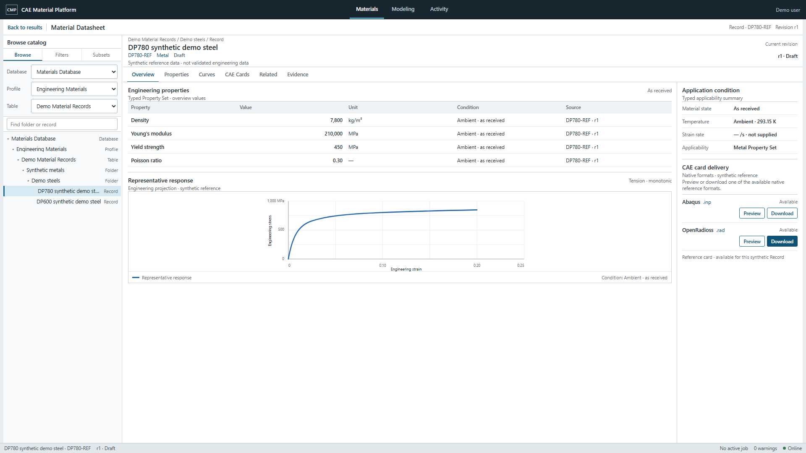

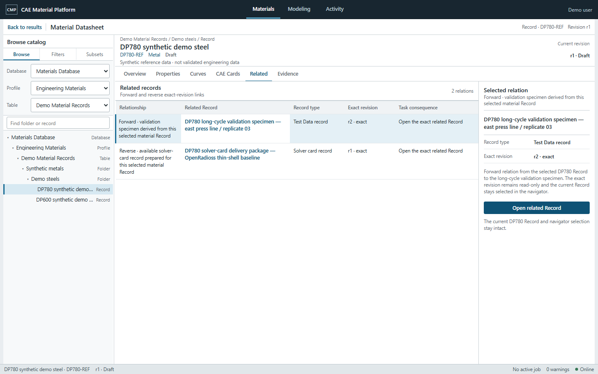

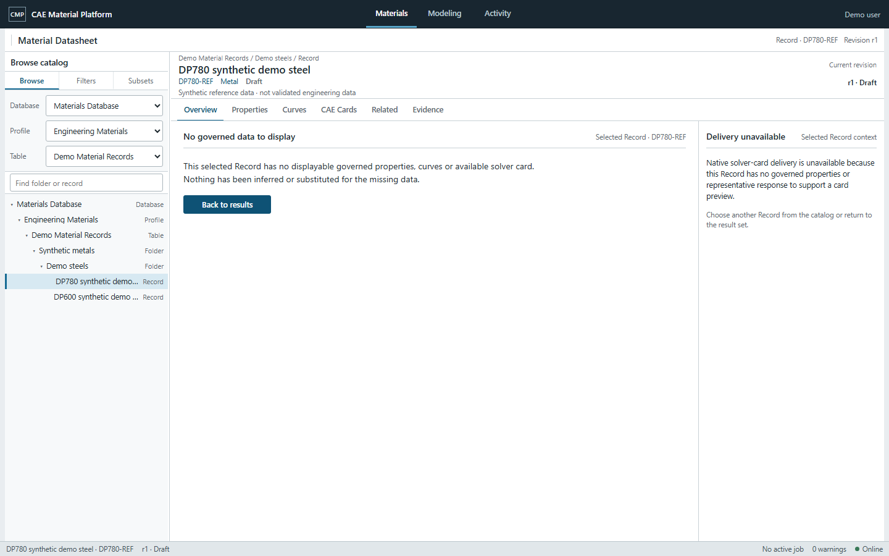

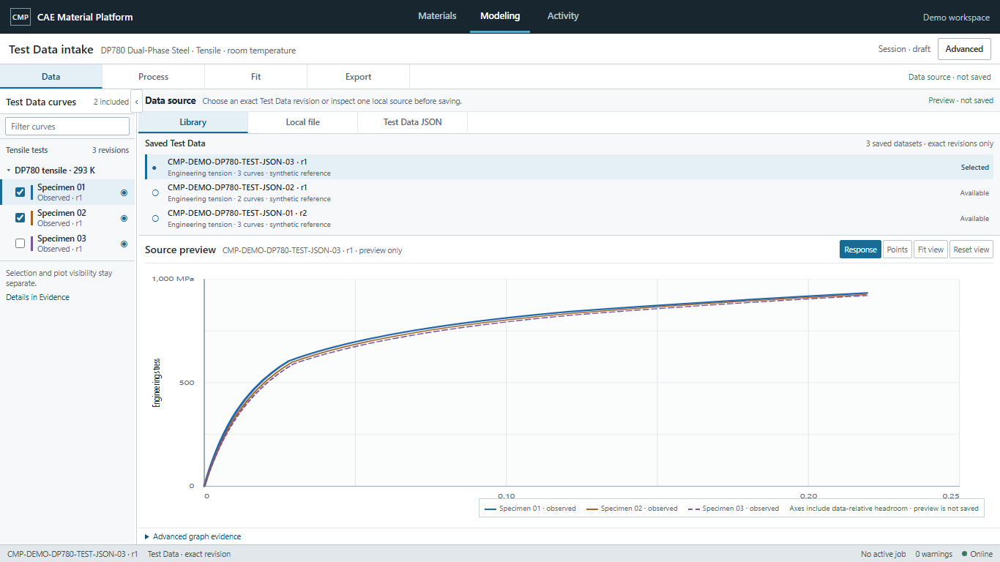

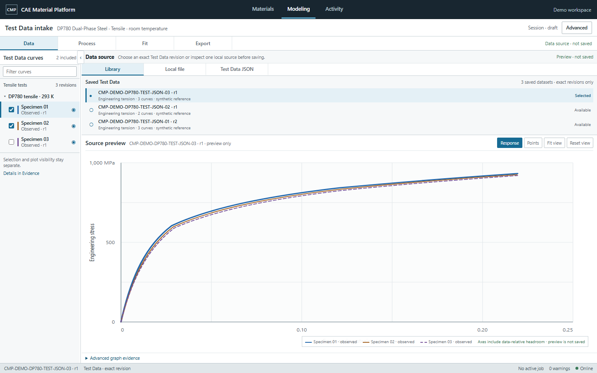

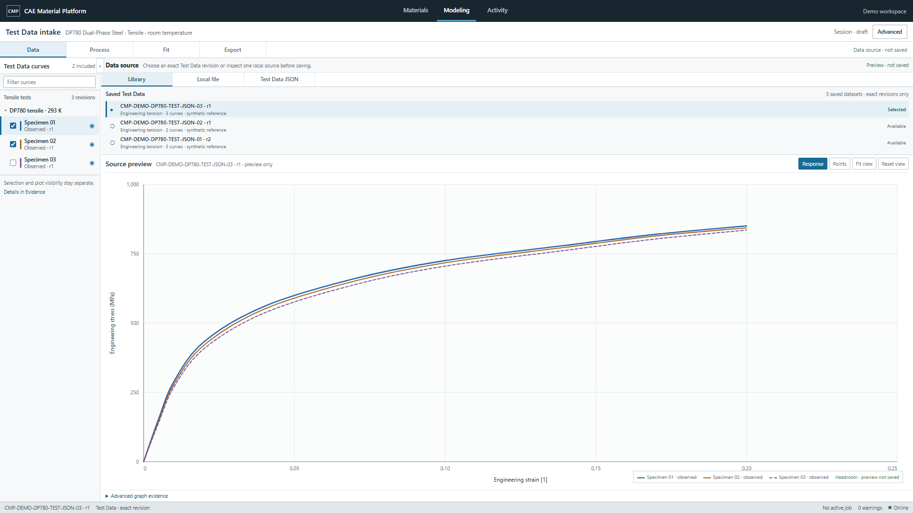

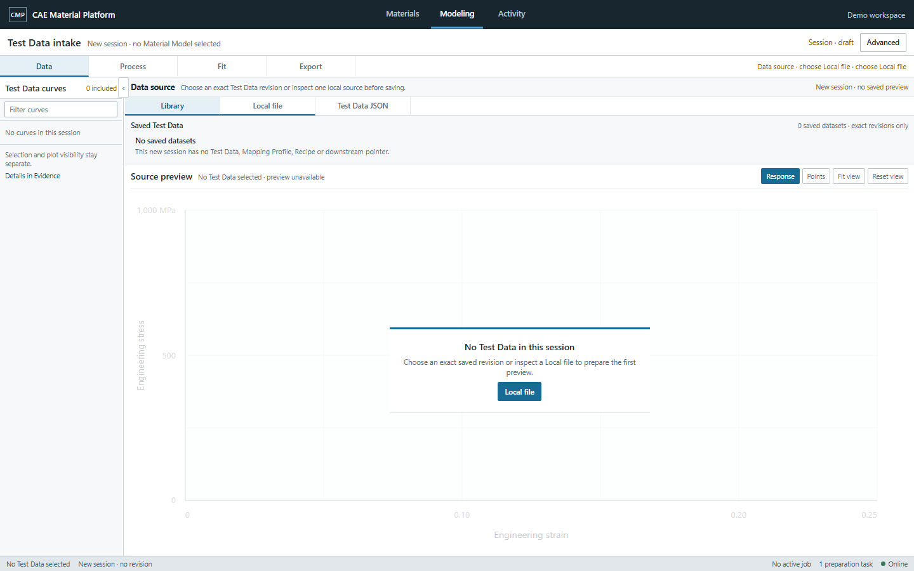

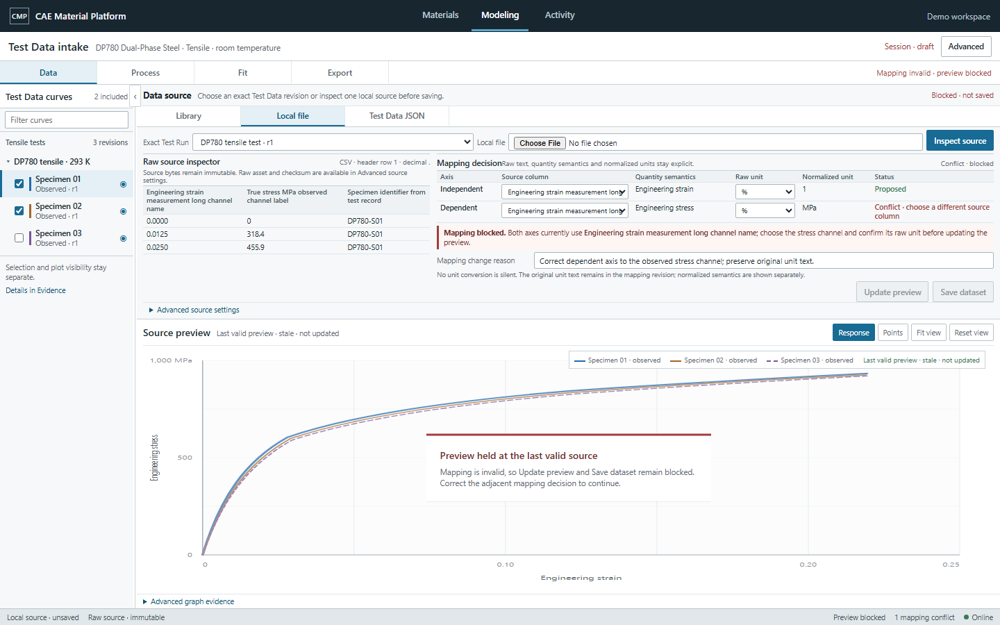

Exceptional-state responsive evidence:

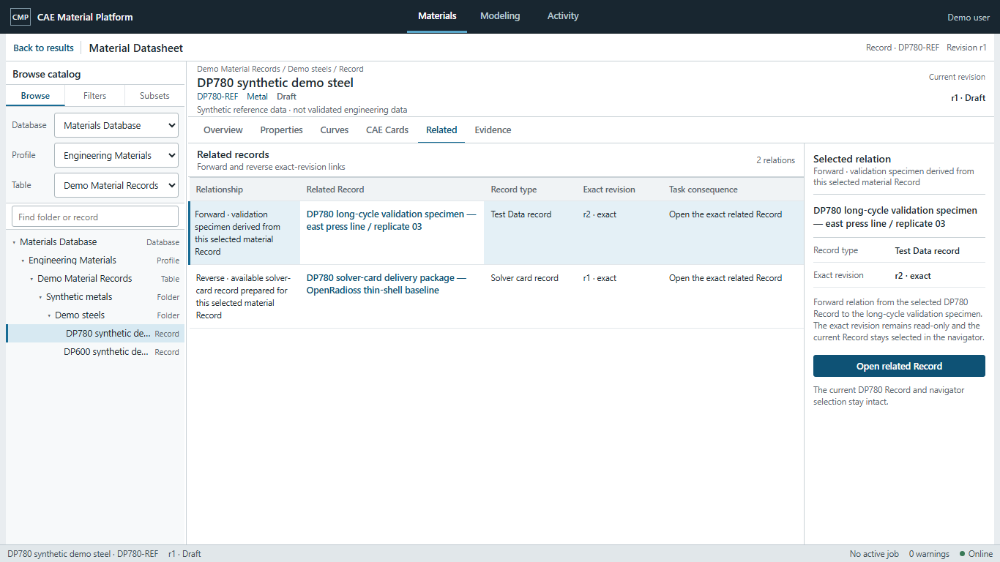

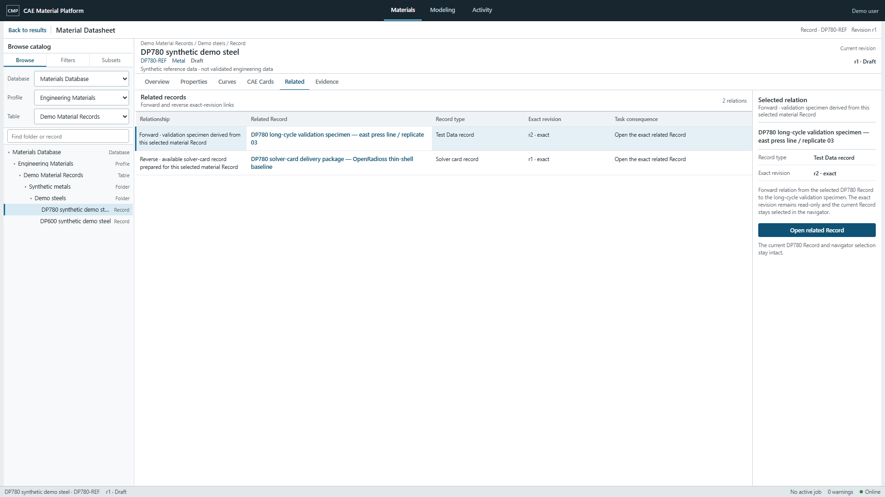

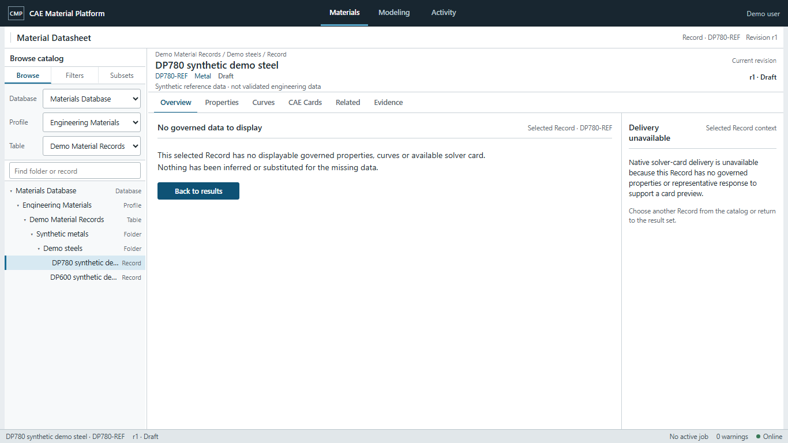

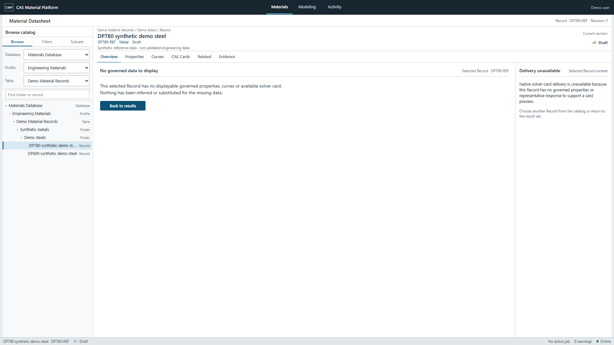

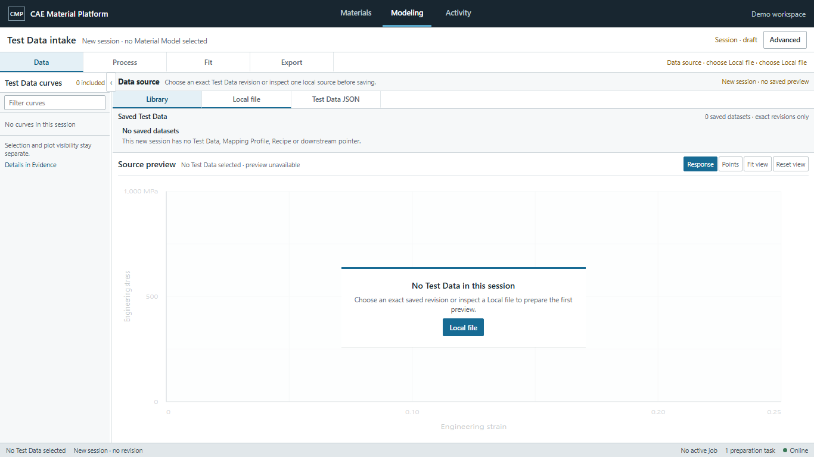

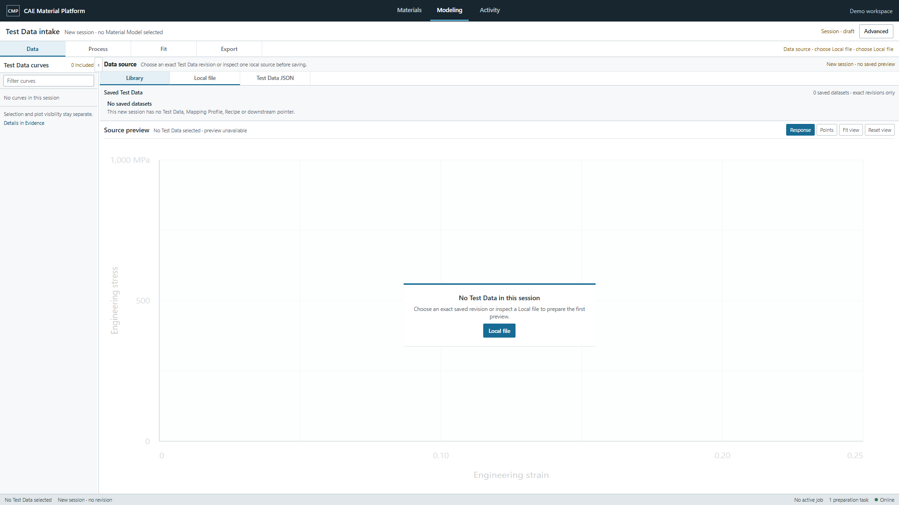

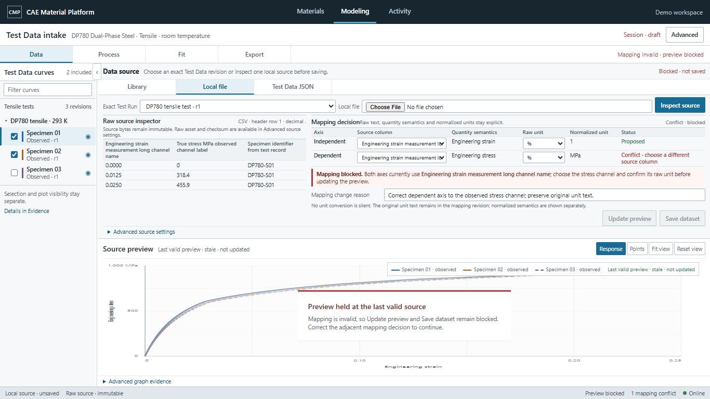

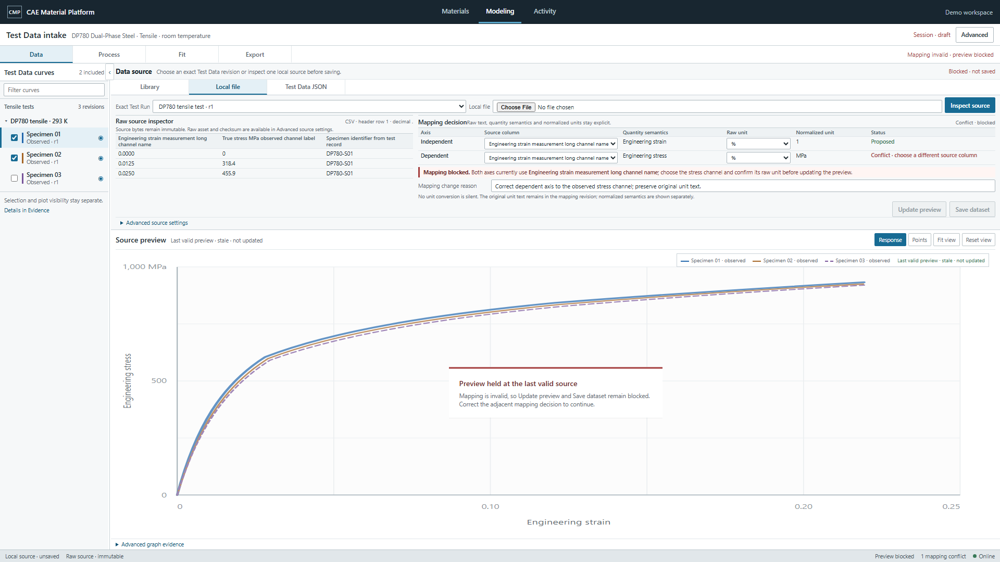

## WAVE-01 reviewer and MOD-DATA correction gate 09

Date: 2026-07-29

Two fresh configured `reviewer_terra_high` agents reviewed the disjoint families read-only.
MAT-DETAIL was approved at 32/32 with no finding or hard-gate failure. The first MOD-DATA review
scored 31/32 and requested one bounded correction: at 1366×768 the invalid state's auto-height Data
ribbon used about 73% of the workspace and left only 103 px of graph canvas; the canonical
1440×900 canvas was 235 px. This failed Modeling's required persistent dominant-graph topology
despite otherwise complete interaction, containment and lifecycle evidence.

The main agent persisted the
[sole MOD-DATA correction packet](issue-167-correction-packet-mod-data-wave-01.md) before calling one
fresh configured `correction_terra_high`. The invalid-only source now places the raw inspector
beside the complete mapping decision. No required mapping field, conflict, reason, disabled action
or stale-preview boundary was removed, and normal/Empty canonical images remained unchanged.

Direct original-resolution inspection and independent native Playwright produced:

| Viewport | Data ribbon | Graph / main workspace | Graph canvas | Result |
| --- | ---: | ---: | ---: | --- |
| 1366×768 | 338 px | 263 / 622 px (42%) | 218 px | accepted |
| 1440×900 | 338 px | 395 / 754 px (52%) | 350 px | accepted |
| 1920×1080 | 320 px | 593 / 934 px (63%) | 548 px | accepted |

The independent run also reproduced the complete raw inspector, two mapping rows, adjacent
same-column conflict, change reason, disabled Update preview/Save dataset, exact stale graph
context, three plot curves, truthful splitter ARIA/actual width and zero document, body or table
horizontal overflow. The corrected canonical hash is:

```text
modeling-data-long-invalid-mapping-blocked-1440x900
  9ea42420431f3b220ce94d6dbe33c23548a589fc4fda68f63129e021f09e53f1
```

Canonical 1440 exceptional images now serve as their own middle responsive evidence. Redundant
same-pixel 1440 siblings were removed from both families; 1366 and 1920 responsive siblings remain.
This mechanical evidence de-duplication did not change any canonical Materials hash, any normal
Modeling hash or the Empty Modeling hash. Both integrated family validators, inventory, Ruff,
JavaScript syntax, whitespace, user-guide and documentation-impact checks pass.

The fresh bounded MOD-DATA re-review scored the corrected visuals 32/32. Its first disposition
identified one evidence-package mismatch only: the packet's 1366 responsive SHA did not match the
final recapture, and the validator did not yet bind responsive image bytes to state evidence. The
main agent corrected the packet hash and added path, existence, SHA-256 and dimension assertions;
no source or image changed. The same fresh reviewer verified both actions read-only and returned
`approve`. The prior evidence-integrity hard-gate failure is resolved.

Final reviewer dispositions:

| Family | Reviewer result | Score | Hard-gate failure |
| --- | --- | ---: | --- |
| MAT-DETAIL | approve | 32/32 | none |
| MOD-DATA after sole correction | approve | 32/32 | none |

WAVE-01 is now `product-owner-pending`. All eight manifest entries remain `pending`, their
main-agent evaluation remains `accepted`, and product-owner approval remains `absent`.

## Product-owner approval 10 — WAVE-01

Date: 2026-07-29

The product owner approved all eight explicitly submitted WAVE-01 images and hashes in one
conversation response. Each target now has its own `approved` manifest lifecycle and
product-owner approval evidence:

```text
materials-datasheet-overview-normal-1920x1080
  eda9da6037d7dec12fd4c4c5ce5fa77e993a1faa37f5853b3da5c2203bd35849
materials-datasheet-related-long-1440x900
  810394678a9a77c1c35adc4a1848ca45eadd71a1a95a69ea94af7266405079b6
materials-datasheet-empty-1440x900
  8df98559459f03db925e02251e10a84265b9ff1e21cd8f4573dd9d2a090548e6
modeling-data-normal-1366x768
  07ca35cd91a01b10616d171ff2f7efb68f1f0adb4e73fa77e381cf6853693e95
modeling-data-normal-1440x900
  fa4c2bbae72a56fcbeac21e7b62a7471be44fb7f602058c155d0a128cb5bdb6f
modeling-data-normal-1920x1080
  b75163296be31a39b567943ccecd8a85005647ae692272f2cdf7d134b0ea27f5
modeling-data-empty-new-session-1440x900
  d646d6bca74671114f46504d43a86f6115b6163607cbb0c9cb124962a31cf668
modeling-data-long-invalid-mapping-blocked-1440x900
  9ea42420431f3b220ce94d6dbe33c23548a589fc4fda68f63129e021f09e53f1
```

Inventory progress is now 13/72 approved with 59 remaining. WAVE-01 is closed as `approved`.
The next inventory-ordered independent bundles are MAT-CARD, now unblocked by MAT-DETAIL, and
MOD-PROCESS, now unblocked by MOD-DATA. No production React/CSS, commit, push, PR or merge is
authorized by this approval.

## 11. WAVE-02 start — MAT-CARD + MOD-PROCESS

Date: 2026-07-29

The main agent directly re-opened issue #167, the approved prerequisite HTML/CSS and original PNGs,
the current live screenshots, the React/API/state contracts, the responsive rules, the canonical
component registry and the user-flow/visual acceptance gates. The two inventory-ordered families
are independent after their approved prerequisites:

- `MAT-CARD` depends on approved `MAT-DETAIL`;
- `MOD-PROCESS` depends on approved `MOD-DATA`.

The bounded parallel rule therefore permits two disjoint configured Luna Max writers. Their
main-agent-authored authoritative packets are:

- `docs/17-evidence/reports/issue-167-implementer-packet-mat-card-wave-02.md`
- `docs/17-evidence/reports/issue-167-implementer-packet-mod-process-wave-02.md`

MAT-CARD owns only `materials-card-preview*` source/capture/validator/staging evidence and its five
target images. MOD-PROCESS owns only `modeling-process*` source/capture/validator/staging evidence
and its four target images. Neither writer may edit shared CSS/JavaScript, inventory, manifest,
common evidence, production code or the other family. Shared integration remains serially owned by
the main agent after both handoffs.

## 12. WAVE-02 implementation, sole corrections and main-agent gate

Date: 2026-07-29

The two configured Luna Max writers completed disjoint MAT-CARD and MOD-PROCESS sources, capture
helpers, validators, target measurements and responsive/state evidence without touching shared or
production files. Both writer gate sets passed.

The main agent then opened all nine approval PNGs at original resolution. Two main-agent visual
failures were found before review:

- MAT-CARD normal/approximation native previews retained a fixed approximately 400 px height,
  leaving the 1440 and especially 1920 engineering workspace underused; the delivery-sheet header
  also repeated a clipped status in exceptional states.
- MOD-PROCESS 1366 and 1440 placed the Engineering strain axis label under the right-aligned
  legend/status, visibly clipping the label; `Preview changes` was duplicated in the title row and
  operation band.

Each family therefore used its one permitted fresh Terra High correction:

- MAT-CARD now fills the full available native-pane height (`443/443`, `569/569`, `749/749` for the
  three normal viewports), preserves independent scrolling and records zero clipped decision text.
- MOD-PROCESS now reserves separate contained axis-label and legend/status lanes and retains one
  title-row Preview command plus the sole filled `Save processed curves` commit action.

After correction, the main agent re-opened every approval PNG at original resolution and accepted
all nine. The direct inspection confirmed the approved prerequisite shells, exact context,
task/result continuity, responsive topology, readable engineering evidence, proportional graph
headroom, explicit approximation/unsupported/prerequisite boundaries and absence of clipping,
overlap, nested-card hard-gate failures or page overflow.

Final approval-image SHA-256:

```text
materials-card-preview-normal-1366x768
  60497b5fef2239cd17a468b4e8fcf1316e0bccca5b753600aff5f240b21a4372
materials-card-preview-normal-1440x900
  74f06d51955b1d7b8f95fed9aaa8f17af147ca00435d7e04f619638c977b2f21
materials-card-preview-normal-1920x1080
  8b9758160f441197c440aa11c8c5886cae75ce5e07e001a2aa4cf2fee60a1513
materials-card-approximation-blocked-1440x900
  2ea15b1bb5d0984296bab458a7d8572111f816c12f87ba5830ec3cbef7d7be92
materials-card-unsupported-blocked-1440x900
  688a0fd8bd9d4d72042f2ad21813df3b8f7ede78b128f75d3cfb1a6c63466d6d
modeling-process-normal-1366x768
  07e7c5f0dd913ac69d17a5c650f48ccd8e4a1930254a5e2d370987ecd3bf3358
modeling-process-normal-1440x900
  f1afcc0c0fbde30d255405abe31777c9642d08cbab779cabe2e16b7a513137d9
modeling-process-normal-1920x1080
  6354707d8e11e31808326e975a62ad9ca062297dd96aa437351b143076d57533
modeling-process-prerequisite-blocked-1440x900
  9511259e95654421a71c70bd198ccbf005a1df060cd40a0ab182c4bd0a03c76c
```

Main-agent deterministic gates passed for both family validators, responsive/state evidence,
inventory, Ruff, JavaScript syntax and `git diff --check`. Product-owner approval remains absent
and no dependent family, production change, commit, push, PR or merge has started.

## 13. WAVE-02 fresh reviewer dispositions

Date: 2026-07-29

Fresh configured Terra High read-only reviews were run independently from:

- `docs/17-evidence/reports/issue-167-reviewer-packet-wave-02-mat-card.md`
- `docs/17-evidence/reports/issue-167-reviewer-packet-wave-02-mod-process.md`

Both reviews returned `changes_requested` after each family had already used its one permitted
correction. No second correction, re-review or product-owner image submission is authorized by the
bounded #167 rule.

### MAT-CARD

- Visual score: 32/32; no V-01–V-16 hard-gate failure.
- Blocking evidence finding: the required error-state capture clicks Retry before recording its
  screenshot/snapshot. The resulting three error entries report `state: normal` and
  `error_visible: false`; the validator checks retained preview text but does not assert the actual
  pre-retry error state.
- Direct paths:
  `docs/00-research/ux-service-reference/capture_materials_card_wave02.py`,
  `docs/00-research/ux-service-reference/validate_materials_card_wave02.py`,
  `docs/00-research/ux-service-reference/materials-card-wave02.state-evidence.json`.

### MOD-PROCESS

- Visual score: 31/32; no hard-gate zero.
- Blocking accessibility finding: each curve row is a focusable `role="button"` containing an
  inclusion checkbox and an icon button. The nested interactive structure makes the outer row and
  eye button both resolve as the `Hide Specimen 02 from plot` button in a fresh role query.
- Direct path:
  `docs/00-research/ux-service-reference/modeling-process-normal.html`.

Candidate images and manifest registrations remain `pending`, with main-agent visual evaluation
accepted and product-owner approval absent. No image was submitted for approval, no dependent
family was started and no production/commit/push/PR/merge action was taken.

## 14. Product-owner-authorized WAVE-02 second correction

Date: 2026-07-29

After the first fresh reviews reported the two bounded failures above, the product owner explicitly
authorized a second correction followed by re-review. This is a recorded WAVE-02 exception to the
default one-correction limit; it does not authorize redesign, a third correction, dependent-family
work, production changes, commit, push, PR or merge.

The main agent re-inspected both findings and persisted the exact correction packets before calling
writers:

- `docs/17-evidence/reports/issue-167-second-correction-packet-wave-02-mat-card.md`
- `docs/17-evidence/reports/issue-167-second-correction-packet-wave-02-mod-process.md`

The families remain independent with disjoint ownership. MAT-CARD is limited to capturing the
actual pre-retry error state and separately proving recovery. MOD-PROCESS is limited to replacing
the nested interactive curve row with sibling semantic controls and proving unique accessible names
and keyboard behavior. Shared manifest and evidence integration remains main-agent-only and
serial.

## 15. WAVE-02 second-correction main-agent gate

Date: 2026-07-29

Two fresh configured Terra High correction writers completed the disjoint packets. MAT-CARD changed
only its capture/validator and regenerated family evidence. Its five approval-image hashes remained
unchanged. MOD-PROCESS replaced the interactive row wrapper with sibling checkbox, curve-selection
button and visibility button semantics, also separating the resize separator from its collapse
button; its four approval-image hashes changed and were integrated serially into the manifest.

The main agent independently inspected the changed source, all three MAT-CARD error/recovery
records and all three MOD-PROCESS accessibility/keyboard records. The results are:

```text
MAT-CARD pre-retry state/error/Retry/preview/context            pass at 1366/1440/1920
MAT-CARD separate normal recovery/announcement/context         pass at 1366/1440/1920
MOD-PROCESS exact Hide Specimen 02 role count                  1 at 1366/1440/1920
MOD-PROCESS distinct Select Specimen 02 role count/name        1 / pass
MOD-PROCESS nested interactive descendants                    0
MOD-PROCESS pointer/keyboard selection and control preservation pass
family validators, inventory, Ruff, Node and diff checks       pass
browser/page errors, page overflow and clipped decision text   zero
```

The main agent opened all nine approval PNGs at original resolution after the second correction.
The five MAT-CARD images retain the previously accepted visual appearance. The four recaptured
MOD-PROCESS images retain the approved shell, graph dominance, proportional range headroom,
separate axis/legend lanes, complete task/result continuity and blocked recovery, without new
overlap, clipping or visual topology changes.

Final approval-image SHA-256:

```text
materials-card-preview-normal-1366x768
  60497b5fef2239cd17a468b4e8fcf1316e0bccca5b753600aff5f240b21a4372
materials-card-preview-normal-1440x900
  74f06d51955b1d7b8f95fed9aaa8f17af147ca00435d7e04f619638c977b2f21
materials-card-preview-normal-1920x1080
  8b9758160f441197c440aa11c8c5886cae75ce5e07e001a2aa4cf2fee60a1513
materials-card-approximation-blocked-1440x900
  2ea15b1bb5d0984296bab458a7d8572111f816c12f87ba5830ec3cbef7d7be92
materials-card-unsupported-blocked-1440x900
  688a0fd8bd9d4d72042f2ad21813df3b8f7ede78b128f75d3cfb1a6c63466d6d
modeling-process-normal-1366x768
  1ff458abf035810ed9ad41c7a157e26010f734477c53993de886970c1cb51c8a
modeling-process-normal-1440x900
  670075447a9e24848ac65efef5c996c8d601eda3917fb62d5b1d5f5a5a6f4dc4
modeling-process-normal-1920x1080
  d959b4a3d229b43b5062db67881823c38bec47b14d6601addf5baeff71c00eb6
modeling-process-prerequisite-blocked-1440x900
  533f19b7bfc9c1bec1a6cc97a37a3666df50482196f0a0c905e13f4200c08bdd
```

Both families remain `pending` with main-agent evaluation accepted and product-owner approval
absent. The bounded fresh re-review packets are:

- `docs/17-evidence/reports/issue-167-rereviewer-packet-wave-02-mat-card.md`
- `docs/17-evidence/reports/issue-167-rereviewer-packet-wave-02-mod-process.md`

No dependent family, production change, commit, push, PR or merge has started.

## 16. WAVE-02 second-correction re-review dispositions

Date: 2026-07-29

Both independent read-only re-reviews returned `changes_requested`, so the nine candidate images
were not submitted for product-owner approval.

The MAT-CARD review used a newly created configured Terra High reviewer. A second new reviewer
thread could not be created because the agent runtime returned `agent thread limit reached`. No
model was substituted. MOD-PROCESS was therefore reviewed in a new read-only turn by an existing
configured Terra High reviewer that had no prior MOD-PROCESS involvement. This runtime limitation
and both failing results keep the bundle unapproved.

### MAT-CARD — 29/32, hard-gate failure

- V-16 scored `0`: the family records no active-route legacy-selector report for
  `page-stack`, `page-heading`, `content-card`, `module-material-card`, `hero-actions`, `eyebrow`,
  `status-badge` and `count-chip`.
- Long, loading, error and Retry-recovery screenshots are captured only in memory. Their JSON
  snapshots and hashes cannot be independently opened because the browser-evidence PNGs are not
  persisted with paths and hash binding.
- V-06 scored `1`: computed 13 px body/data typography is not recorded and validated across the
  required viewports.
- Direct paths:
  `docs/00-research/ux-service-reference/capture_materials_card_wave02.py`,
  `docs/00-research/ux-service-reference/validate_materials_card_wave02.py`,
  `docs/00-research/ux-service-reference/materials-card-wave02.state-evidence.json`.

### MOD-PROCESS — 31/32, no hard-gate failure

- The requested nested-interactive correction passed: exact semantic curve controls, zero nested
  interactive descendants and pointer/keyboard behavior all verified.
- V-06 scored `1`: `docs/00-research/ux-service-reference/modeling-process.css` reduces
  `.setting small` decision metadata to 8 px at 1366×768 and 8.5 px at another compact breakpoint,
  conflicting with the required readable 12–13 px metadata range.
- The shallow ribbon and graph must be revalidated for clipping/overflow after restoring readable
  metadata size.

The default one-correction limit was already exceeded under the product owner's explicit
second-correction exception. A third correction is not authorized. Both families remain
`pending`, product-owner approval remains absent, and no dependent family, production change,
commit, push, PR or merge has started.

## 17. Product-owner-authorized main Sol High direct completion

Date: 2026-07-29

The product owner subsequently authorized the main Sol High agent to perform the correction
directly and requested a joint product-owner review when complete. No implementation or correction
subagent was called, no reviewer agent was substituted, and this section supersedes only the
authorization state at the end of section 16. It does not authorize approval, dependent-family
work, production changes, commit, push, PR or merge.

The main agent applied the two bounded corrections:

- MAT-CARD capture now records a zero-count active-route report for `page-stack`, `page-heading`,
  `content-card`, `module-material-card`, `hero-actions`, `eyebrow`, `status-badge` and
  `count-chip`; it also records and validates computed 13 px body and 12–12.5 px representative
  tree/data/metadata text.
- MAT-CARD long, loading and pre-Retry error states now persist one PNG at each required viewport.
  The three Retry recoveries persist separately. The validator opens all 12 files, checks exact
  dimensions and binds every file to its recorded SHA-256.
- MOD-PROCESS `.setting small` decision metadata now computes to 12 px with a 14 px line height,
  wraps normally and is not ellipsized. The ribbon, settings grid and graph bounds are recorded and
  validated after the typography change.

The user-requested skills influenced the correction as follows:

- `desktop-engineering-ui` kept the approved shell and region topology fixed while treating the
  original PNGs and measured layout as the visual gate.
- `frontend-ui-engineering` and `web-design-guidelines` required readable metadata, semantic
  controls, visible focus, deliberate wrapping and zero nested interactive controls.
- `webapp-testing` required browser capture at 1366×768, 1440×900 and 1920×1080, persisted
  screenshots, console/page error collection and deterministic geometry assertions.

The scoped Web Interface Guidelines audit found no `transition: all`, suppressed focus outline,
zoom restriction, non-semantic click target or new nested interactive control. Existing semantic
buttons, labels, `aria-label` values, tabs, separators and graph descriptions remain intact.

Deterministic evidence:

```text
MAT-CARD approval captures                              pass 5/5
MAT-CARD responsive/state evidence                     pass
MAT-CARD persisted state PNGs                          9 primary + 3 recoveries
MAT-CARD missing/hash-mismatched state PNGs            0
MAT-CARD legacy-selector count across captured states  0
MAT-CARD body/data/metadata typography                 13 / 12–12.5 px
MOD-PROCESS approval captures                          pass 4/4
MOD-PROCESS decision metadata                          12 px / 14 px / 0 clipped
MOD-PROCESS ribbon heights                             192 / 198 / 184 px normal
MOD-PROCESS blocked ribbon height                      228 px
MOD-PROCESS graph heights                              407 / 531 / 725 px normal
MOD-PROCESS blocked graph height                       501 px
MOD-PROCESS document overflow                         0 / 0 at every target
browser console errors / page errors                  0 / 0
Ruff / Node syntax / inventory / diff checks          pass
```

The main agent opened all 12 new MAT-CARD state PNGs and all four changed MOD-PROCESS approval PNGs
at original resolution. The five MAT-CARD approval PNG bytes remain unchanged from the previously
accepted visual inspection. Long/loading/error/recovery states retain the selected Record,
identity, delivery and native-preview context without clipping or page overflow. The 12 px
MOD-PROCESS metadata is materially more readable; natural wrapping increases the shallow ribbon
only as needed while the persistent engineering graph remains dominant, the axis/legend lanes stay
separate, and blocked recovery remains adjacent to the unmet prerequisite.

Product-owner review bundle:

```text
materials-card-preview-normal-1366x768
  60497b5fef2239cd17a468b4e8fcf1316e0bccca5b753600aff5f240b21a4372
materials-card-preview-normal-1440x900
  74f06d51955b1d7b8f95fed9aaa8f17af147ca00435d7e04f619638c977b2f21
materials-card-preview-normal-1920x1080
  8b9758160f441197c440aa11c8c5886cae75ce5e07e001a2aa4cf2fee60a1513
materials-card-approximation-blocked-1440x900
  2ea15b1bb5d0984296bab458a7d8572111f816c12f87ba5830ec3cbef7d7be92
materials-card-unsupported-blocked-1440x900
  688a0fd8bd9d4d72042f2ad21813df3b8f7ede78b128f75d3cfb1a6c63466d6d
modeling-process-normal-1366x768
  c537c7caf60d668a82021e50cdc0307b185faf118d5091edc41c10d9c5ef0cad
modeling-process-normal-1440x900
  57d5c9e8f9ebbf21315ca94f76eb21e11ce116526afffc717973ebb514417461
modeling-process-normal-1920x1080
  154c21e6679b999ee63ca65c10ac6e7af8a8ebdb54b69490be67460078ce53c1
modeling-process-prerequisite-blocked-1440x900
  9d71022e7c9bff6a5b88de70985a34aaf2e30d3bd1715a69a5e7c5bbd40b9868
```

All nine references remain `pending`, and `product_owner_approval` remains `absent` until the user
reviews and explicitly approves this bundle.

## 18. WAVE-02 product-owner approval

Date: 2026-07-29

The product owner explicitly approved the complete nine-image bundle listed in section 17. The main
agent advanced each MAT-CARD and MOD-PROCESS manifest entry independently to `approved`, recorded
the approval date and conversation evidence, and advanced the authoritative inventory to 22/72
approved with 50 images remaining.

The approved targets are:

```text
materials-card-preview-normal-1366x768
materials-card-preview-normal-1440x900
materials-card-preview-normal-1920x1080
materials-card-approximation-blocked-1440x900
materials-card-unsupported-blocked-1440x900
modeling-process-normal-1366x768
modeling-process-normal-1440x900
modeling-process-normal-1920x1080
modeling-process-prerequisite-blocked-1440x900
```

The remaining 50 references are finite and grouped as follows:

```text
MAT-EXP exceptional long/empty states                 2
MOD-FIT                                                4
MOD-EXPORT                                             6
ACT-QUEUE user/reviewer                                7
ACT-RECOVERY                                           3
ADM-SCHEMA-CORE database/table/attribute              11
ADM-SCHEMA-RELATIONS layout/subset/link                9
ADM-ACCESS                                             5
ADM-PUBLISH                                            3
                                                      --
                                                      50
```

The next dependency-ready candidates are the two remaining MAT-EXP exceptional references,
MOD-FIT, ACT-QUEUE and ADM-SCHEMA-CORE. Under the bounded parallel rule, at most two disjoint
families may be written concurrently after the main agent prepares their packets. MOD-EXPORT waits
for MOD-FIT; ACT-RECOVERY waits for the shared Activity queue topology; Administration relations,
access and publish follow their recorded core dependencies.

No production change, commit, push, PR or merge was performed.

## 19. WAVE-03 start — MAT-EXP exceptional states + MOD-FIT

Date: 2026-07-29

The main Sol agent directly re-opened issue #167, the complete authority set, current manifest and
inventory, the approved Materials normal sources/images, the approved MOD-DATA and MOD-PROCESS
sources/images, the Fit reference comparison and `modeling.html`/`review.css`, and the current
React/API/state contracts. The next six approval units form two dependency-ready, disjoint bundles:

- `MAT-EXP` adds only the canonical 1440×900 long-results and empty-results exceptional states to
  the already approved three-viewport Materials search family.
- `MOD-FIT` follows approved MOD-DATA and MOD-PROCESS with three normal viewports and one canonical
  1440×900 long candidate-parameters state.

The main-agent-authored implementation packets are:

- [MAT-EXP WAVE-03 implementer packet](issue-167-implementer-packet-mat-exp-wave-03.md)
- [MOD-FIT WAVE-03 implementer packet](issue-167-implementer-packet-mod-fit-wave-03.md)

The configured `implementer_luna_max` role was present in the active agent registry and two fresh
writers were started concurrently. MAT-EXP owns only its new exceptional-state source, capture,
validation, staging and image paths. MOD-FIT owns only its new Fit source, capture, validation,
staging and image paths. Neither writer may edit shared CSS/JavaScript, the common manifest,
inventory or this report; prerequisite sources and approved images remain frozen. The main agent
will integrate common lifecycle evidence serially only after both family gates and independent
reviews pass.

## 20. WAVE-03 completed gate and product-owner review bundle

Date: 2026-07-29

Both configured Luna Max writers completed their disjoint family assignments without editing the
shared manifest, inventory, evidence report or production UI. Luna was callable; no model
substitution occurred. The main agent corrected two packet command/lifecycle statements before
final execution: the MOD-FIT browser validator runs with the Playwright environment, and the
already approved MOD-DATA parent uses `main_agent_evaluation.status: accepted`.

### MAT-EXP result

The initial empty image retained a stale selected DP780 tree row and selected revision. The same
initial writer cleared every result/tree/context selection, removed the datasheet action, added one
Clear search recovery and recaptured the evidence. The final family validator passed all 18 images:
two canonical approval references, four compact/wide responsive siblings and 12 loading/error state
captures.

The main agent opened all 18 final images at original resolution. Long preserves one selected
record/context, 50 rows from 126 server-scoped matches and independent result scrolling. Empty
preserves the catalog hierarchy while showing no selected material or revision. Loading, tree-lazy
loading, query error and tree error retain truthful context and adjacent recovery with no clipping,
overflow or browser errors.

Fresh read-only Terra High review:

```text
disposition                                                approve
V-01–V-16                                                  2 each
total                                                       32/32
hard-gate failures / actionable findings                    none / none
```

Reviewer packet:
`docs/17-evidence/reports/issue-167-reviewer-packet-wave-03-mat-exp.md`.

### MOD-FIT result

Main-agent inspection rejected the initial reference until the same Luna writer:

- replaced boundary-ending/fixed-looking plot paths with finite plotted data, 10% proportional
  headroom, nice derived 0.50 strain / 1400 MPa limits and an altered-extrema proof;
- restored 13 px body/data/control text and 12 px metadata/help text;
- contained the long candidate table, complete candidate rows, selection, law-specific parameter
  value/unit/bounds, reason and warning acknowledgement while keeping the graph mounted;
- made the stale state set the actual Target strain input and all explanatory copy to `1.20`,
  clear the selection and disable Save at every viewport.

The main agent opened all four final approval images and all 12 state images at original resolution.
Normal references keep the compact curve/sequence rail, shallow Fit ribbon and persistent graph;
recommendation remains evidence, no engineer selection is implied and Save remains disabled with
its reason. Empty, calculating, stale/blocked and calculation-error states retain exact source,
rail, inputs and graph without blanking the workspace.

Fresh read-only Terra High review:

```text
disposition                                                approve
V-01–V-13 / V-14 / V-15–V-16                              2 each / 1 / 2 each
total                                                       31/32
hard-gate failures                                          none
non-blocking production-port concern                        status bar should reflect selected candidate
```

The reviewer accepted the static reference because selection is explicitly reflected in the
decision ribbon and long disclosure. The production port must also reflect selected-candidate/task
text in its status bar. The long disclosure intentionally shows four law-specific parameter rows;
blend/domain/target inputs remain visible in the ribbon and must remain accessible in production.

Reviewer packet:
`docs/17-evidence/reports/issue-167-reviewer-packet-wave-03-mod-fit.md`.

### Integrated deterministic gate

```text
MAT-EXP approval/responsive/state targets                   18 / pass
MOD-FIT approval/state targets                              4 + 12 / pass
all main-agent original-image inspections                   34 / pass
MOD-FIT x/y finite extrema                                  0.42 / 1260
MOD-FIT derived limits / headroom                           0.50 / 1400 / 10%
altered-extrema derivation                                  pass
splitter/input/selection/save/graph/disclosure interactions pass
legacy active-route selectors / nested controls             zero / zero
console errors / page errors / document overflow            zero / zero / zero
Ruff / Node syntax / diff checks                            pass
service-reference inventory                                 18 families / 72 images / pass
```

The main agent registered every candidate independently with `status: pending`,
`main_agent_evaluation.status: accepted` and `product_owner_approval.status: absent`.

Product-owner review bundle:

```text
materials-search-long-1440x900
  8c70f5790ed02d1864d456f5947975871122b712d28d523096330e021e2b7f06
materials-search-empty-1440x900
  19bb7a9e50496786a87eb22f0c8a9f31a1da944bcc76a55f451b1d157135648e
modeling-fit-normal-1366x768
  33e84e09265d07a5c836c82c21622b64ca1f35fbd9646a1fe1aeb1589bf0efe7
modeling-fit-normal-1440x900
  194c1cad19ae8712b0c29d82b0b0c439989cf556d9a812468a13712066b7e9c3
modeling-fit-normal-1920x1080
  82cdcb393097c9ba767e82c3cddf8f582787f81f6496018ac3eea0ce064c96c4
modeling-fit-candidate-parameters-long-1440x900
  d16c32e031d17bc34aed6ba660d0f7796e9bd214dc7ee6601922a075c0f6aae0
```

All six references remain pending product-owner approval. Authoritative progress therefore remains
22/72 approved with 50 remaining. Explicit approval of this six-image bundle will advance progress
to 28/72 approved with 44 remaining. No dependent family, production change, commit, push, PR or
merge has started.

## 21. WAVE-03 product-owner correction authorization

Date: 2026-07-29

The product owner rejected mechanical-only acceptance of the pending six-image WAVE-03 bundle and
authorized one qualitative correction before re-review. The main Sol agent reviewed the supplied
GRANTA MI photographs and the product owner's clarification: they show Administrator-configured
Material/Neutral Material datasheets, and any graph renders an exact linked saved Record/revision
rather than a client-side reprocessing result. They are not Fit topology authority.

The correction applies only to the six pending WAVE-03 candidates. The three approved Materials
normal parents and the approved MOD-DATA/MOD-PROCESS parents remain byte-frozen and lifecycle-frozen.
After reviewing the corrected candidates, any consistency-driven proposal to reopen an approved
reference must explicitly name the image and receive separate product-owner authorization.

Main-agent-authored correction packets:

- [MAT-EXP WAVE-03 correction packet](issue-167-correction-packet-wave-03-mat-exp.md)
- [MOD-FIT WAVE-03 correction packet](issue-167-correction-packet-wave-03-mod-fit.md)

MAT-EXP must make tree/result scrolling discoverable, reduce tree indentation/type-label width tax
and preserve longer engineering identities. MOD-FIT must restore graph dominance, use a compact rail,
move on-demand parameters into a bounded bottom drawer, standardize engineering axis titles/units and
prove proportional data-derived ranges. Each family will receive one configured fresh Terra High
correction writer, deterministic and main-agent original-image gates, then a fresh read-only Terra
High re-review. The pending lifecycle and 22/72 approved count remain unchanged.

## 22. WAVE-03 correction implementation and main-agent gate

Date: 2026-07-29

Two configured fresh Terra High correction writers completed the disjoint MAT-EXP and MOD-FIT
families. No model substitution, approved-parent change, production change or GitHub action
occurred. The main agent serially registered only the six corrected pending hashes and temporarily
reset their main-agent lifecycle to `pending` for fresh re-review.

The main agent opened all 18 corrected MAT-EXP images and all 16 corrected MOD-FIT images at
original resolution. It required additional same-writer corrections before accepting the review
packets:

- the first long Fit drawer left an actual plot below the 230 px target;
- the Fit footer did not initially identify the explicitly selected candidate/task;
- a subsequent 1366 normal capture forced the Fit ribbon into one clipped line;
- the no-candidate 1366 evidence opened an empty drawer and reduced the graph to about 60 px.

The final bundle resolves all four. MAT-EXP has visible independent tree/result scrolling,
25 px tree rows, 9 px depth increments and no repeated full-width node-type label. Fit has a clean
two-row 1366 ribbon, centered unit-bearing axis titles, numeric-only ticks, a graph-first normal
layout, a bounded bottom drawer with a 230 px or taller long-state plot, truthful footer selection
state, and a closed-drawer empty state.

Integrated deterministic result:

```text
MAT-EXP approval/responsive/state targets                   18 / pass
MOD-FIT approval/state targets                              4 + 12 / pass
main-agent original-resolution inspections                  34 / pass
approved parent validators and hashes                       pass / unchanged
tree and result local wheel/PageDown scrolling              pass
normal Fit actual plot share                                >=45%
long Fit actual plot / drawer share                         >=230 px, >=30% / <=35%
axis notation, centering and collision gates                pass
empty Fit drawer / useful graph                             closed / pass
selection footer and invalidation reset                     pass
console/page errors / document overflow / nested controls   zero
Ruff / Node syntax / inventory / diff checks                pass
```

Fresh read-only reviewer packets:

- [MAT-EXP WAVE-03 re-review packet](issue-167-rereviewer-packet-wave-03-mat-exp.md)
- [MOD-FIT WAVE-03 re-review packet](issue-167-rereviewer-packet-wave-03-mod-fit.md)

The six images remain pending product-owner approval. Authoritative progress remains 22/72
approved with 50 remaining.

## 23. WAVE-03 correction findings and final re-review

Date: 2026-07-29

The first fresh read-only reviewers identified two concrete issues that the deterministic checks
had not yet excluded:

- the MAT-EXP empty state rendered `Find` and `Clear search` as two filled primary actions;
- the visible long-state Fit `Stress (MPa)` overlay intersected the `700` tick while the validator
  measured a hidden SVG label.

The same single authorized correction writer for each family resolved its bounded finding. No
replacement writer, model substitution, approved-parent edit, production change or GitHub action
occurred. The MAT-EXP validator now requires `Find` to be the sole visible filled action and keeps
`Clear search` as a secondary recovery. The MOD-FIT capture and validator now measure the actually
visible axis title and reject title/tick/legend intersection.

The main agent reopened all 18 final MAT-EXP and all 16 final MOD-FIT images at original resolution,
then reran the integrated gates. Two newly configured fresh Terra High read-only reviewers each
opened the complete family bundle and independently returned `approve`, V-01–V-16 all `2`, total
`32/32`, with no hard-gate or actionable finding. MAT-EXP retains one non-blocking caution: its
358 px tree minimum creates 93–129 px of local horizontal overflow, so later work should not expand
that dependency.

Final product-owner candidates:

```text
materials-search-long-1440x900
  c754705a8e8b2bcc2c960cadc820c982a132721c35c7840c756afa516dcf5d9a
materials-search-empty-1440x900
  32943f5f7890046c02c5ad127c3dacd162a5c1308d87ed41da35daff72f646af
modeling-fit-normal-1366x768
  06b8a7c434a389ab2ed7fd1a7a0e86bc9e66e3a0d00dba1550a7387cb685647b
modeling-fit-normal-1440x900
  d0b91783896a5d12ba71b463621123b58a064d1ce91ce15a56d58b03821db904
modeling-fit-normal-1920x1080
  d74a8ba9a2c906cf06e9661c093c468df07ce792659e07ebcf146828dd31b0e9
modeling-fit-candidate-parameters-long-1440x900
  32f3752f97e20a4d8baeadab82fa9bcece1b83e82eeb5d610d488158dcb724fb
```

The six entries remain `pending` with product-owner approval absent; their main-agent evaluation is
now `accepted`. Progress therefore remains 22/72 approved with 50 remaining. Approval of this exact
six-image batch advances progress to 28/72 approved with 44 remaining. Approved parents remain
frozen. No dependent family, production change, commit, push, PR or merge has started.

## 24. WAVE-03 product-owner visual rejection after re-review

Date: 2026-07-29

Before approving the six-image batch, the product owner identified two visible defects that the
main-agent and independent review had missed:

- MAT-EXP's synthetic vertical scrollbar indicator overpainted long tree identity text instead of
  occupying a reserved native scrollbar gutter;
- MOD-FIT proved only non-intersection, not compact engineering-axis spacing. The Y title/ticks/axis
  consumed too much horizontal gutter, while the X title sat too far below its ticks and therefore
  appeared absent. The unused bottom SVG space also reduced the effective plot height.

The product-owner criticism is accepted as a review-gate failure. The six references are not being
submitted for approval and their main-agent lifecycle has returned to `pending`. The main Sol agent
will directly remove the tree overlay scrollbar, rely on a reserved native gutter, tighten and
measure title/tick/axis adjacency, make the X title visibly persistent at 13 px, and reduce unused
plot insets. Existing approved parents remain frozen.

## 25. WAVE-03 direct main-agent correction and reviewer handoff

Date: 2026-07-29

The main Sol agent directly corrected the two product-owner findings without changing an approved
parent, production UI or another reference family:

- MAT-EXP removed the synthetic tree scrollbar element. The overflowing tree now uses its native
  scrollbar with a measured 15 px reserved gutter and no custom overlay over identity text at
  1366×768, 1440×900 or 1920×1080.
- MOD-FIT now keeps a visible centered 13 px `Equivalent plastic strain` title, bounds its
  title/tick/axis gaps, reduces unused SVG/footer insets and uses the same engineering-axis grammar
  in normal and long states. At 1366×768 the measured x-title-to-tick, y-title-to-tick and
  y-tick-to-axis gaps are approximately 4.6 px, 5.0 px and 7.4 px; plot left/right/bottom inset
  ratios are approximately 6.0%, 5.8% and 10.7%. The finite-data-derived 10% range headroom is
  unchanged.

The main agent opened both MAT-EXP candidates, their four responsive siblings, all 12 MAT-EXP state
images, all four MOD-FIT candidates and all 12 MOD-FIT state images at original resolution. It
found no remaining title/scrollbar overlap, missing axis title, axis collision, page overflow or
topology regression.

Deterministic result before fresh read-only re-review:

```text
MAT-EXP approval/responsive/state targets                   18 / pass
MOD-FIT approval/state targets                              4 + 12 / pass
approved Materials normal validators and hashes             3 / pass / unchanged
approved MOD-DATA / MOD-PROCESS parent validators            pass / unchanged
native tree gutter / custom overlay                         15 px / absent
visible x title / x-title-to-tick gap                       13 px / 0–18 px
y-title-to-tick / y-tick-to-axis gaps                       2–24 px / 2–12 px
plot left/right/bottom inset ratios                         <=6.5% / <=6.5% / <=11.5%
Ruff / Node syntax / inventory / diff checks                pass
inventory progress                                           22/72 approved; 50 remaining
```

Current pending candidate hashes:

```text
materials-search-long-1440x900
  bc3812759e3fae464fde19782767e5680f10ba343898f3beb9d59b362613a66d
materials-search-empty-1440x900
  35e814d1e807468f97e3daaa6507a4ae98bba1a1e5d3fa2dc731a0e77a922725
modeling-fit-normal-1366x768
  5d3a59d3fb6a947defd23450fee2f979f81fb16687381343bea5b94de962f504
modeling-fit-normal-1440x900
  be4a9b051a266c4f8c55ebb0136046c3c016e6beaf278669200c91046ead8749
modeling-fit-normal-1920x1080
  4bd100acbe61bcaa5359949da9ef602ac7b64493799fb66ecaeb65a58ef0a4bf
modeling-fit-candidate-parameters-long-1440x900
  84d5ba46d5fa81850376558595c75b73f1a1a6b5c7a4c9a0721e782155f3d545
```

Two fresh read-only Terra High reviewers independently opened their complete family bundles at
original resolution and returned `approve`, V-01–V-16 all `2`, total `32/32`, with no hard-gate
failure or actionable finding. MAT-EXP has no material residual concern. MOD-FIT retains one
non-blocking observation: calculation/stale/error overlays intentionally cross the upper plot area,
but remain readable and preserve the graph/context at all three viewports.

All six family lifecycles remain `pending`, main-agent evaluation is now `accepted`, and
product-owner approval remains absent. Progress remains 22/72 approved with 50 remaining until the
product owner approves these exact hashes.

## 26. WAVE-03 product-owner rebuild authorization

Date: 2026-07-29

The product owner did not approve the six candidates in section 25. In addition to the earlier
scrollbar and axis-spacing defects, direct review identified that:

- both long tree and result regions need discoverable local scrolling and more usable long-identity
  access;
- the Fit ribbon, decision band, horizontal legend and parameter drawer still reduce graph
  visibility;
- the fixed SVG uses `preserveAspectRatio="none"`, visibly distorting engineering typography at
  wider viewports;
- the hardening response is mislabeled and physically inconsistent: it plots `(0, 0)` although the
  current contract is positive true yield stress versus true plastic strain.

The product owner authorized rebuilding the same six still-pending candidates with all eight
findings applied together. The existing direct-main-agent exception remains in force: the main Sol
High agent owns the rebuild, followed by deterministic gates, original-resolution inspection and
one fresh configured Terra High read-only review. No other writing model is substituted.

The authoritative rebuild packet is
[WAVE-03 product-owner rebuild packet](issue-167-product-owner-rebuild-packet-wave-03.md).
Lifecycle progress remains 22/72 approved with 50 remaining. Approved parents, production code and
all later bundles remain frozen.

## 27. WAVE-03 integrated eight-finding rebuild and reviewer handoff

Date: 2026-07-29

The user-authorized main Sol High rebuild applied the complete eight-finding packet to the same six
still-pending references. No approved parent, production React/CSS, other family, inventory
denominator or GitHub state changed.

MAT-EXP now has independent native tree and long-result scrolling. The 1440 long tree measures
249 px client width against 558 px scroll width, with 190 px vertical and 309 px horizontal
overflow. Arrow-key horizontal scrolling and wheel/PageDown vertical scrolling produce local
consequences without moving the document. Full Database/Profile/Table/Folder/Record identities and
accessible labels are retained instead of permanently truncating their underlying strings. The
long result keeps 50 of 126 rows, one truthful selected material and 1127 px of independently
scrollable vertical result overflow.

MOD-FIT now uses a measured responsive SVG whose viewBox exactly matches its rendered width and
height at every capture; `preserveAspectRatio="none"` and non-uniform scaling are absent. A compact
11 px tick / 11.5 px title grammar, centered `True plastic strain [1]` x title, unit-bearing
`True yield stress (MPa)` y title and right-side legend leave the graph dominant. The 1440 normal
actual plot is 481 px high and uses 80.2% of the Fit workspace; the long state retains an
approximately 375 px plot above a 148 px independently scrollable candidate drawer. The synthetic
hardening fixtures use deterministic public law forms, start every curve at zero true plastic
strain and positive 312 MPa initial yield stress, and derive the displayed 0–0.50 / 200–1400 MPa
nice ranges from finite plotted spans plus 10% proportional headroom.

The main agent opened all 18 MAT-EXP and 16 MOD-FIT images at original resolution. It found the
information density, local-scroll behavior, graph dominance, compact axis typography, right-side
legend, undistorted responsive geometry and state continuity acceptable. Loading, empty,
stale/blocked and error states preserve their relevant graph/source or selection context without
page overflow.

Deterministic result before fresh read-only review:

```text
MAT-EXP approval/responsive/state targets                   18 / pass
MOD-FIT approval/state targets                              4 + 12 / pass
tree/result independent scrolling and native bars           pass
full tree identity access / no text-covering overlay         pass
responsive SVG viewBox/rendered size / scale delta           exact / 0
quantity/unit/start-point contracts                          pass
axis/legend containment and collision gates                 pass
normal/long graph dominance and drawer bounds                pass
console/page errors / document overflow / nested controls   zero
Web Interface Guidelines audit                              pass
approved-parent validators and hashes                       pass / unchanged
Ruff / Node syntax / inventory / diff checks                pass
inventory progress                                           22/72 approved; 50 remaining
```

Current pending candidate hashes:

```text
materials-search-long-1440x900
  c486fc6f6236c44083e2d8a52502be6d59729f2e8849ffcb46301ca9ef2365a2
materials-search-empty-1440x900
  9ce804bf79dcb083ccb979a15b2245847e30fae6da5849dba6a6c351706d03b0
modeling-fit-normal-1366x768
  6752cb38650332daadf0273903e99319ca807e92c4d797a0ca4c314304524543
modeling-fit-normal-1440x900
  6c4ad9a9b73f956cb3986017e7afc403f19fb8dfe9450ac078ee69c937be57ac
modeling-fit-normal-1920x1080
  ee2d95c45fc8c01e0ed02eb96832bcdaa8c290341e2c211ac8209378b2bd00c5
modeling-fit-candidate-parameters-long-1440x900
  336eafcad832cf0f149d32fc7aad2c880b97b9ba0c1df000a7cc8fe4f847b180
```

The bounded fresh review packet is
[WAVE-03 integrated rebuild reviewer packet](issue-167-reviewer-packet-wave-03-rebuild.md).
All six references remain `pending`, main-agent evaluation is `accepted`, product-owner approval is
absent, and progress remains 22/72 approved with 50 remaining.

The configured fresh Terra High read-only reviewer then opened the complete 18-image MAT-EXP and
16-image MOD-FIT bundles at original resolution, verified every listed hash/dimension and reran the
bounded non-mutating gates. It returned `approve`, V-01–V-16 all `2`, total `32/32`, with no hard
gate failure or actionable finding. The only residual observation is the expected pending
product-owner lifecycle.

## 28. WAVE-03 final product-owner tree/legend amendment

Date: 2026-07-29

The product owner did not approve the section 27 hashes. Direct inspection established two defects
that deterministic DOM overflow checks and the earlier qualitative review failed to catch:

- the Materials tree/result panes are technically scrollable, but the captured pixels do not make
  their operating scrollbars discoverable; verbose explanation appended to nearly every tree node
  also makes the navigator coarser than the supplied compact tree reference;
- the Fit curve legend still taxes graph width as a permanent right column although the current
  response leaves a safe lower-right plot region.

These are cumulative findings 9 and 10 in the updated
[WAVE-03 product-owner rebuild packet](issue-167-product-owner-rebuild-packet-wave-03.md), not a
replacement for findings 1–8. The product-wide desktop UI specification and visual acceptance
matrix now require perceptually visible reserved scroll controls, concise tree identities and a
collision-checked plot-internal curve legend with measured fallback.

The six section 27 images and hashes remain historical unapproved evidence. Their lifecycle remains
`pending`; main-agent evaluation is reset to `pending-rebuild`, product-owner approval remains
absent, and inventory progress remains 22/72 approved with 50 remaining. The authorized main Sol
High direct correction, deterministic gates, original-resolution main-agent inspection and one
fresh configured Terra High read-only review remain the required execution path. Approved parents,
production React/CSS, other families and GitHub state remain frozen.

## 29. WAVE-03 cumulative ten-finding rebuild and final reviewer handoff

Date: 2026-07-29

The main Sol High agent applied the section 28 amendment to the same six pending references. The
product-wide specification, UI component contract, visual acceptance matrix and WAVE-03 rebuild
packet now retain all ten cumulative findings.

MAT-EXP now uses reserved application-owned scrollbar rails synchronized with the native scrolling
viewport. At 1440×900 the tree measures 251 px client width against 561 px content width, with
199 px vertical and 310 px horizontal overflow. Its vertical and horizontal thumbs measure 363 px
and 111 px, remain outside the text viewport and are operable by pointer, keyboard and wheel. The
long result has 1127 px local vertical overflow and a 270 px proportional thumb. The empty result
has no fake rail. Tree labels are concise stored identities with regular disclosure/type glyphs;
the complete few genuinely long identities remain reachable through the conditional horizontal
rail.

MOD-FIT no longer reserves an external legend column. The curve-only legend uses the measured
lower-right plot region at 1366×768, 1440×900, 1920×1080 and the 1440×900 long state. Independent
segment sampling reports zero curve intersection, the placement algorithm reports zero collision,
the legend stays inside the plot stage and external width tax is 0 px. Plot widths are respectively
1177 px, 1243 px, 1707 px and 1243 px. The long state keeps a 336 px actual plot above the bounded
candidate drawer. A geometry-aware alternate-quadrant search and compact docked fallback remain
available when changed data would occupy the current region.

The main agent opened all 18 MAT-EXP and all 16 MOD-FIT images at original resolution. It found the
scroll controls perceptually discoverable, tree density materially improved, graph width recovered,
axis typography/quantities consistent and curve/legend/state-overlay relationships clear at every
viewport. Loading, empty, stale/blocked and error states retain the applicable result/source,
selection and recovery context without page overflow.

Deterministic result before fresh read-only review:

```text
MAT-EXP approval/responsive/state targets                   18 / pass
MOD-FIT approval/state targets                              4 + 12 / pass
tree visible vertical/horizontal rails and thumb contrast   pass
tree/result pointer, keyboard and wheel consequences        pass
empty result fake scrollbar                                absent
Fit lower-right legend / collision / external width tax     pass / 0 / 0 px
responsive SVG viewBox/rendered size / scale delta           exact / 0
quantity/unit/start-point and proportional range contracts  pass
axis/title/legend containment and graph dominance           pass
loading/empty/stale/error continuity                        pass
console/page errors / document overflow / nested controls   zero
Web Interface Guidelines audit                              pass
approved-parent validators and hashes                       pass / unchanged
Ruff / Node syntax / inventory / documentation impact       pass
user-guide image-reference check                            not a #167 gate; reports the existing
                                                            untracked service-reference image set
inventory progress                                           22/72 approved; 50 remaining
```

Current pending candidate hashes:

```text
materials-search-long-1440x900
  43f146e60baf2d933265d952e22fce5cd0c1e2ca0e9145eea0e72a9677da2484
materials-search-empty-1440x900
  d9e4fed1d8c17ca86b7c14dfe57909591b44ff8ec300286bb49f3a940fb5e1b1
modeling-fit-normal-1366x768
  eb8c23a9df376f1ab9a7604f29088bf022af10f49a0f9310f55c8308fbeb0843
modeling-fit-normal-1440x900
  0cacfb3970d015a78f231c160f3f2b8fa15a917653740acdbf51aed874b31fd8
modeling-fit-normal-1920x1080
  06ef5ba17d8fdfc6eb2ef80cb592b55d8b18fd0f99067472b81da5fc674fa18b
modeling-fit-candidate-parameters-long-1440x900
  ad8166d12a647f0908fbc59997eeb87d063b79fa44a4bb095b45d8ed22346424
```

The bounded final review packet is
[WAVE-03 final scroll/legend reviewer packet](issue-167-reviewer-packet-wave-03-final-scroll-legend.md).
All six references remain `pending`; main-agent evaluation is `accepted`, product-owner approval is
absent and progress remains 22/72 approved with 50 remaining.

Fresh configured Terra High read-only review result:

```text
disposition                                  approve for product-owner review
V-01–V-16 / total                            2 each / 32 of 32
hard gates / actionable findings             pass / none
original artifact evidence                   34 of 34 dimensions and hashes matched
bounded validators / Ruff / Node / diff      pass
non-blocking residual                        seven-entry Fit legend is compact at 1366×768,
                                             but readable, contained and curve-free
```

This reviewer disposition does not change lifecycle state. The six references still await explicit
product-owner approval and inventory progress remains 22/72 approved with 50 remaining.

## 30. WAVE-03 Fit navigator visual-consistency amendment

Date: 2026-07-29

The product owner accepted the corrected Materials tree treatment but found the Fit left rail
qualitatively awkward in typography and arrangement. Direct comparison confirmed that the rail's
function was correct but its bold 13 px specimen names, circular color marks, uppercase section
chrome and weak parent/child indentation compressed several distinct decisions into a coarse visual
block. This was not detected by the prior numeric row-height and graph-dominance gates.

The product specification, canonical UI contract, visual acceptance matrix and WAVE-03 rebuild
packet now retain this as cumulative finding 11. Modeling does not copy the Database/Profile/Table/
Folder/Record hierarchy. It adopts the same flat desktop grammar while keeping its stage-specific
membership checkbox, curve selection, plot-color sample and visibility command.

The main Sol High agent corrected the existing Fit reference directly:

- responsive rail widths remain 184/192/208 px, so no graph-width tax or stage-topology change was
  introduced;
- section labels use sentence case and 11.5 px metadata;
- specimen identities use regular 12.5 px text with secondary 11.5 px revision text;
- the method parent has an aligned disclosure/type glyph and its children have one stable indent;
- plot colors use 3×16 px vertical samples rather than circular badges;
- selected rows use the same restrained fill and 3 px leading accent as Materials;
- `True/plastic conversion` fits at the 184 px minimum rather than truncating;
- overflow remains local with a stable conditional scrollbar gutter.

The deterministic navigator gate independently proves all three specimen identities, revisions and
four sequence labels are unclipped at every required viewport; identity weight is 400, hierarchy
indentation is within the 8–24 px contract, section text transformation is `none`, the curve sample
is a square-cornered line, selected fill differs from the rail background, and injected long rail
content scrolls without changing graph width.

The main agent opened the four approval candidates and all twelve empty/calculating/stale/error
captures at original resolution. It found the rail materially calmer and more legible, with clearer
method/specimen/sequence hierarchy and no loss of graph dominance, axis/legend quality, drawer
containment or recovery context.

Current corrected Fit hashes:

```text
modeling-fit-normal-1366x768
  41a775d88b32c9528d742858fdfbcf86dda6b391f3ad704337ee9d9781487a93
modeling-fit-normal-1440x900
  7ba66c5f5d5605dd897f1bb511fcaa888985c5472d378a56ce849ded55ed0db5
modeling-fit-normal-1920x1080
  f7a6aaf8720659bdadf1559347e08b8d1c5b920633c8ce954b34ba39aa7ee261
modeling-fit-candidate-parameters-long-1440x900
  500e66fa38e8b7f6adde92f7aa3f309a41aa7f27cb5ef3ebe322fad07abce881
```

The two Materials candidates and their hashes are unchanged. All six WAVE-03 candidates remain
`pending` for product-owner approval; inventory progress remains 22/72 approved with 50 remaining.

Fresh configured Terra High read-only review result:

```text
disposition                                  approve for product-owner review
V-01–V-16 / total                            2 each / 32 of 32
hard gates / actionable findings             pass / none
four candidates + twelve state images        original-resolution review and hashes pass
Fit validator / Ruff / Node / diff           pass
non-blocking residual                        long rail scroll is deterministic interaction evidence;
                                             the short normal rail does not itself overflow
```

This disposition does not alter lifecycle. The four corrected Fit references still require explicit
product-owner approval.

## 31. WAVE-03 corrected Modeling Fit product-owner approval

Date: 2026-07-29

The product owner explicitly approved the four corrected Modeling Fit references submitted from
section 30:

```text
modeling-fit-normal-1366x768
  41a775d88b32c9528d742858fdfbcf86dda6b391f3ad704337ee9d9781487a93
modeling-fit-normal-1440x900
  7ba66c5f5d5605dd897f1bb511fcaa888985c5472d378a56ce849ded55ed0db5
modeling-fit-normal-1920x1080
  f7a6aaf8720659bdadf1559347e08b8d1c5b920633c8ce954b34ba39aa7ee261
modeling-fit-candidate-parameters-long-1440x900
  500e66fa38e8b7f6adde92f7aa3f309a41aa7f27cb5ef3ebe322fad07abce881
```

Each exact manifest lifecycle is now `approved`, with product-owner approval dated 2026-07-29.
The two unchanged Materials WAVE-03 candidates were not part of the four-image submission and remain
`pending`; they are not inferred as approved from the Fit response. Inventory progress advances to
26/72 approved with 46 remaining. No later reference, production React/CSS, commit, push, PR or merge
was started as part of this lifecycle update.

Post-approval validation passed the 18-family/13-bundle inventory reconciliation, all four MOD-FIT
approval targets and state/interaction gates, and the scoped diff check.

## 32. Qualitative review workflow hardening

Date: 2026-07-29

After auditing the prior review outcomes, the product owner retained the fresh Terra High reviewer as
an independent contract, evidence, accessibility and full-screen usability gate, but explicitly
rejected treating its numeric score as final design approval. The main agent remains responsible for
product/UX judgment and the product owner remains the final visual approver.

The visual acceptance matrix now owns one mandatory Q-01–Q-11 qualitative checklist containing the
eleven cumulative product-owner findings. The desktop-engineering skill, root instructions and Terra
reviewer configuration require independent original-resolution checklist evidence. An applicable
qualitative failure blocks handoff even when deterministic gates and V-01–V-16 pass. A generic Web
Interface Guidelines audit remains supplemental rather than CAE design authority.

Project `.codex/config.toml` now pins future project sessions to `gpt-5.6-sol` with `xhigh` reasoning.
The fresh reviewer remains `gpt-5.6-terra` with `high` reasoning and read-only access. The active
turn inherited the pre-existing global `gpt-5.6-sol`/`xhigh` configuration and cannot change model
mid-turn. The active `/root` primary agent and the main agent are the same role; implementer and
reviewer are subordinate agents. Future sessions can verify the project pin directly instead of
inferring identity from the role name.

This process change does not alter any approved or pending reference lifecycle, image, hash,
production React/CSS, commit, push, PR or merge state.

## 33. GitHub #167 progress checklist synchronization

Date: 2026-07-29

GitHub issue #167 previously contained no task checkboxes and retained the older Sol High,
single-writer and score-oriented reviewer wording. Its body now matches the repository authority:

- the active `/root` primary agent is the Sol XHigh main agent;
- #167 may use at most two dependency-independent, disjoint screen-family writers;
- both main agent and fresh Terra High reviewer must complete Q-01–Q-11 at original resolution;
- reviewer score cannot replace main-agent judgment or product-owner approval.

The issue now records the verified 18-family/13-bundle/72-image inventory, lifecycle evidence system,
five fully approved bundles, MAT-EXP at 3/5 and total progress at 26/72. Only completed facts are
checked. The remaining 46 images, whole-set deterministic gate and #167 PR/merge remain unchecked;
the issue remains open.

## 34. WAVE-04 bounded batch start

Date: 2026-07-29

To reduce product-owner wait time without weakening the per-image lifecycle, the main `/root` Sol
XHigh agent inspected the next dependency-independent families and their exact current contracts:

- `MOD-EXPORT` depends on the approved `MOD-FIT` bundle and owns six approval candidates;
- `ACT-QUEUE` freezes ACT-U before its ACT-R role extension and owns seven approval candidates.

The main agent compared the approved Modeling Fit graph/source shell, approved Materials native-card
preview, prior reference-only Export/Activity captures, current React/API/state contracts and the
Q-01–Q-11 qualitative owner checklist. It then persisted two disjoint implementer packets:

- `issue-167-implementer-packet-mod-export-wave-04.md`
- `issue-167-implementer-packet-act-queue-wave-04.md`

The packets prohibit shared CSS/JavaScript, manifest, inventory, common-evidence and production
edits. They reserve separate source/capture/image ownership and require original-resolution
qualitative self-review in addition to deterministic gates. One configured Luna Max implementer may
now write each family concurrently under the bounded #167 two-writer rule.

No new reference has been generated, reviewed or approved at this point. The two pending MAT-EXP
references remain unchanged. Inventory progress remains 26/72 approved with 46 remaining.

## 35. WAVE-04 MOD-EXPORT main-agent rejection and sole correction

Date: 2026-07-29

The Luna Max MOD-EXPORT writer completed six approval images and twelve responsive state images. Its
capture, family validator, approved Fit dependency validator, inventory, Ruff, JavaScript syntax and
scoped diff gates passed. The active `/root` main agent nevertheless rejected the family after
opening all six approval images at original resolution.

The deterministic gate had missed contradictory state labels, inconsistent mapping counts/visible
rows, an incorrect stress unit attached to plastic strain, an absent delivered-receipt action and an
unsafe source-blocked command hierarchy. The source graph also retained axis/legend glyphs too small
for useful 1366/1440 inspection. Q-11 was incorrectly marked applicable to an Export properties pane
that has no Fit rail.

These findings are persisted in
`issue-167-correction-packet-wave-04-mod-export.md`. Under the configured one-correction rule, one
fresh Terra High correction implementer will update only writer-owned MOD-EXPORT paths, strengthen
the validator and regenerate the evidence. No lifecycle status changes: the six candidates remain
pending/not accepted, the two MAT-EXP candidates remain pending and inventory progress remains
26/72 approved with 46 remaining.

## 36. WAVE-04 ACT-QUEUE main-agent rejection and sole correction

Date: 2026-07-29

The Luna Max ACT-QUEUE writer completed seven approval images and twenty-one responsive state images.
Its family validator, inventory, Ruff, JavaScript syntax and scoped diff gates passed. The active
`/root` main agent opened all seven approval images at original resolution. The six User/Reviewer
normal images passed the main qualitative topology check, but the canonical Reviewer long-decision-
error image did not.

The preserved non-empty reason was paired with `Reason is required`, the initial page status still
said `Ready`, and filled `Record decision` plus a separate Retry created an ambiguous duplicate
recovery. The automated gate had checked that the form and Retry existed but not their coherent
relationship.

The bounded correction is persisted in
`issue-167-correction-packet-wave-04-act-queue.md`. One fresh Terra High correction implementer will
update only ACT-QUEUE-owned paths, strengthen the state assertions and regenerate the bundle. No
lifecycle status changes: all seven Activity candidates remain pending/not accepted, the six Export
candidates remain in correction, the two MAT-EXP candidates remain pending and progress remains
26/72 approved with 46 remaining.

## 37. WAVE-04 ACT-QUEUE corrected main-agent acceptance

Date: 2026-07-29

The sole Terra High correction resolved the three contradictions identified in section 36. The
active `/root` Sol XHigh main agent then opened all seven approval images and all twenty-one
responsive state images at original resolution. The corrected service-error state preserves the
selected request, decision and non-empty reason, reports `Decision not recorded` and exposes one
`Retry decision`. The stale/unauthorized state separately reports that review access needs refresh,
retains the selected request and reason, exposes one `Refresh access` and cannot submit a decision.

The main qualitative record is Q-02 and Q-09 pass: the compact Reviewer queue has a distinct local
overflow rail and the empty User result has no fake rail; pointer, wheel and keyboard consequences
are persisted. Q-01 and Q-03–Q-08/Q-10/Q-11 are not applicable because Activity has no navigator
tree, Materials navigator, Fit graph/axes/legend or Fit rail.

Final approval candidates:

| Reference | SHA-256 |
| --- | --- |
| `activity-user-normal-1366x768.png` | `45ecff451bdd3b3f7d11cf8b6afb1f25cda17be19a4118c68ba5d4c37745e523` |
| `activity-user-normal-1440x900.png` | `12b9cb7bd6d16ae57521ac69ac5dd61160d8ce3423d13e00ee66361cedfcc2aa` |
| `activity-user-normal-1920x1080.png` | `46cfb14e2a1ca9c8953d408004e9eff47d25c1fc7c4c311ff761509c4bd652ce` |
| `activity-reviewer-normal-1366x768.png` | `8139b08582acb9ff1595490a88486f6b4eff684271f5775a14b357c125f0b29b` |
| `activity-reviewer-normal-1440x900.png` | `daf7a2bacafaf0ae2f3c254a8a055fd4e57f6eb3dda05480726a90e9521fef3b` |
| `activity-reviewer-normal-1920x1080.png` | `517ffdde4f5b1c49da291acd97c2f6abab9a8318e7793f05ceebeabb9db50c7b` |
| `activity-reviewer-long-decision-error-1440x900.png` | `bbcfcadd5555273afd030973f1f9e0da5ea18494722e975de3796eb0a90baaaa` |

The final family validator passes all seven approval targets, all seven three-viewport state
bundles and deterministic pointer/keyboard/recovery evidence. Inventory, Ruff, JavaScript syntax
and scoped diff checks pass. The seven common-manifest entries remain `pending`, record main-agent
acceptance and intentionally have product-owner approval absent. A bounded fresh read-only reviewer
packet is persisted at `issue-167-reviewer-packet-wave-04-act-queue.md`.

The fresh Terra High reviewer independently opened the same twenty-eight images at original
resolution and reran the bounded validator. Disposition: `approve`; V-01–V-16 all `2` for `32/32`;
Q-02/Q-09 pass with the same direct queue/overflow evidence; all other Q items are not applicable
for the recorded topology. There is no hard-gate failure, actionable finding or material residual
concern. Product-owner approval remains absent.

## 38. WAVE-04 MOD-EXPORT corrected main-agent acceptance

Date: 2026-07-29

The sole Terra High correction resolved the section 35 rejection. Before reviewer handoff, the
active `/root` Sol XHigh main agent opened the six approval images, twelve same-topology state images
and six exceptional responsive siblings at original resolution. This direct review found and
corrected additional automated-gate gaps: an ellipsized source-context quantity, concrete target
defaults in the no-target state, loading status/action contradictions, an incoherent delivery-retry
label, inaccessible long mapping rows and missing three-viewport evidence for the topology-changing
approval states.

The final source graph labels `Yield stress (MPa)` against `True plastic strain [1]`, starts at a
positive initial yield stress, preserves responsive glyph/stroke proportions and keeps its compact
legend in a curve-free region. The long mapping evidence exposes all 28 wrapped identities through
a reserved local scroll rail. Source-blocked, approximation-blocked and delivered preserve truthful
action/lifecycle boundaries at 1366, 1440 and 1920.

Final approval candidates:

| Reference | SHA-256 |
| --- | --- |
| `modeling-export-normal-1366x768.png` | `2e19f612f7ff6edc026f11541e64e32c7c03e75738fcc39af2c17df87d37ab43` |
| `modeling-export-normal-1440x900.png` | `514a88da7d0106b1a5522724de58b173bc98998eb543370f681c1c1572493a92` |
| `modeling-export-normal-1920x1080.png` | `2798779cb7c87a160a7a41014eb0de690c92dfb672399c513aefc48b20006e7c` |
| `modeling-export-source-blocked-1440x900.png` | `25cf93f53351919643775fb79789e8a0b9eace914a0c17e131446161cc934554` |
| `modeling-export-approximation-blocked-1440x900.png` | `374ac6b28dbc5723aac6ae73db1dfe3994eb67ad987c7bde66e8bd974d82efae` |
| `modeling-export-delivered-1440x900.png` | `de49f9feeec1e90f57d7f89587c450bf903d005d9cececfd8f6eeb3dfb44b134` |

The main qualitative record is Q-05–Q-10 pass. Q-01–Q-04 and Q-11 are not applicable because
Export has no navigator tree, result list, Materials navigator, Fit control ribbon or Fit curve
rail. The final capture/validator, MOD-FIT dependency validator, inventory, Ruff, JavaScript syntax
and scoped diff checks pass. Six common-manifest entries remain `pending`, record main-agent
acceptance and intentionally have product-owner approval absent. The fresh read-only reviewer packet
is persisted at `issue-167-reviewer-packet-wave-04-mod-export.md`.

The fresh Terra High reviewer independently opened all twenty-four final images at original
resolution and reran the bounded validator. Disposition: `approve`; V-01–V-16 all `2` for `32/32`;
Q-05–Q-10 pass and Q-01–Q-04/Q-11 are not applicable for the recorded topology. All image hashes,
the 28-row local scroll ranges, state semantics and responsive evidence match. There is no
hard-gate failure, actionable finding or material residual concern. Product-owner approval remains
absent.

## 39. WAVE-04 MOD-EXPORT product-owner layout and semantics rework

Date: 2026-07-29

The product owner did not approve the section 38 candidates. The independent reviewer result did not
override the product-owner findings: the full-width shallow graph compressed the result, the black
native-card surface was visually alien to the rest of the workspace, and developer/governance-first
labels such as `Export preflight`, `Next safe action`, `Mapping sheet`, `Preflight evidence` and
normal-path `receipt/evidence` did not explain a user task.

The product owner approved a rough region direction with Destination and generation status at left,
a dominant light Solver Card preview in the center, and read-only Mapping details above a compact Fit
source preview at right. Follow-up discussion clarified:

- Mapping rows/statuses are deterministic for one exact source/target tuple but change when the
  source family, solver/version/unit capability or representability changes.
- Density and other physical source values are read-only in Export. Export may change their output
  representation but never edits the governed source revision.
- Material State is source/applicability context unless it becomes an actual target dependency; it
  is not counted merely to produce another exact mapping.
- Export status has three user states: Ready to create, Review required and Cannot create.
- metal, linear-viscoelastic and hyperelastic sources retain one region topology but require
  family-specific mapping rows and graph quantities.

Direct contract inspection also found that the old static preview labelled the target `kg_m_s` while
emitting tonne/mm³ and MPa-scale native values. The replacement reference must use internally
consistent synthetic kg/m³ and Pa values and show Source/Output units. It must preserve the backend
technical mapping report under Advanced rather than changing exact/transformed/approximated/
unsupported semantics for visual convenience.

The clarified product rules are now authoritative in the product spec, UI field contract and
Modeling Export acceptance gate. The main agent persisted the bounded replacement packet at:

`docs/17-evidence/reports/issue-167-product-owner-rework-packet-wave-04-mod-export.md`

One configured Luna Max writer may replace only unapproved MOD-EXPORT-owned source/capture/evidence.
The six manifest entries remain pending, their previous hashes remain historical unapproved evidence
until serial main-agent integration, and progress remains 26/72. No approved dependency, production
React/API/backend, inventory count, commit, push, PR or merge is changed.

## 40. WAVE-04 MOD-EXPORT product rework — corrected main-agent acceptance

Date: 2026-07-29

The configured Luna Max writer replaced the unapproved section 38 candidates from the product-owner
packet in section 39. Its first result passed the family validator but failed Ruff and the main
agent's original-resolution product/contract gate. One fresh configured Terra High correction agent
then remained the sole correction writer while the active `/root` Sol XHigh main agent completed the
full approval/state/family image review.

That direct review blocked issues which numeric success alone did not prove:

- source-blocked copy retained a stale saved Fit identity;
- OpenRadioss incorrectly inherited Abaqus's transformed unit status;
- normal delivered copy exposed receipt vocabulary instead of Delivery details;
- linear-viscoelastic and hyperelastic readiness claimed an approximation while their rows counted
  zero;
- the hyperelastic x-axis title fell behind the status bar and the viscoelastic legend crossed its
  descending curve;
- rejected `preflight`/`evidence` language survived in exceptional states;
- delivery error exposed two retry actions;
- no-target fabricated a concrete version/unit/mapping result and dimmed an otherwise exact upstream
  Fit source.

The corrected two-pane workspace now keeps Destination and Export check at left, a dominant light
native Solver Card preview in the center, and Mapping details above a compact family-specific Fit
source at right. Physical source values are read-only. The normal kg-m-s fixture consistently uses
kg/m³ and Pa; target mappings show Source/Output consequences. Abaqus reports Exact 2 /
Transformed 3 / Approximated 1, while the OpenRadioss review state correctly reports Exact 3 /
Transformed 2 / Approximated 1. No-target exposes no concrete target tuple or mapping result.
Source-blocked exposes no stale Fit identity. Delivered exposes `Open solver card` and
`Delivery details`, with receipt identity disclosed only after that bounded action or Advanced.

Family evidence preserves the same topology while changing actual quantities and rows:

- metal: `True stress (MPa)` versus `True plastic strain [1]`, positive initial yield stress;
- linear viscoelastic: `Normalized shear modulus [1]` versus `log time (s)`, upper-right curve-free
  legend;
- hyperelastic: `Nominal stress (kPa)` versus `Stretch ratio [1]`, with selected mode controls.

The main qualitative owner checklist is:

| Item | Result | Direct evidence |
| --- | --- | --- |
| Q-01 | not-applicable | Export has no navigator tree. |
| Q-02 | not-applicable | Mapping details are decision consequences, not a result list; their overflow is covered by Q-09. |
| Q-03 | not-applicable | Materials navigation is not mounted in Modeling Export. |
| Q-04 | not-applicable | Fit controls/candidate drawer are upstream; Export retains only source context. |
| Q-05 | pass | All three family graphs show compact quantity/unit titles, clear ticks and titles above the status bar. |
| Q-06 | pass | Legends remain compact and inside the bounded Fit source rather than forming a footer. |
| Q-07 | pass | SVGs use uniform `preserveAspectRatio`, stable glyph/stroke scale and validated container bounds. |
| Q-08 | pass | Metal uses true stress versus true plastic strain and begins at positive stress at zero plastic strain. |
| Q-09 | pass | Setup, Mapping details and native preview reserve local tracks; 28-row/long-native pointer, wheel and keyboard evidence passes. |
| Q-10 | pass | Metal/hyperelastic legends use curve-free lower-right space; viscoelastic uses curve-free upper-right space with deterministic collision checks. |
| Q-11 | not-applicable | Export has no Fit curve rail. |

Final approval candidates:

| Reference | SHA-256 |
| --- | --- |
| `modeling-export-normal-1366x768.png` | `5a4b4f3c728cb9844f092bbbc57f5fc378068962247919d10374239c72d59b6d` |
| `modeling-export-normal-1440x900.png` | `8fcb8a8465ecc1cebdfc596ef6df5382ca3313c35d68d343161e92ddbbf389e5` |
| `modeling-export-normal-1920x1080.png` | `77260893b0808266b02b1940fe54a11fec9464680542a591fbd6ceb2e54a4f74` |
| `modeling-export-source-blocked-1440x900.png` | `376c4134269f964e7d408636c22ed08aab563589a4a2c57bf10067e5af321d37` |
| `modeling-export-approximation-blocked-1440x900.png` | `dae621e1ed1ef4835b50c919dd30d9cc560b964d5d31bef3fda9ab3acd8f2bc8` |
| `modeling-export-delivered-1440x900.png` | `9bbe26cc0b68a4efe582d8daff16f4de3aed18aa2518ab4c2ea4f3763d044922` |

The MOD-EXPORT validator passes all six targets, seven state bundles, two family adaptations,
interaction invalidation, acknowledgement, immutable creation, receipt-disclosure, action-count,
language, overflow, accessibility, graph-bound and legend-collision gates. The accepted MOD-FIT
dependency validator, inventory, Ruff, JavaScript syntax, Web Interface Guidelines audit and
`git diff --check` pass. The six common-manifest entries remain `pending`, now contain the final
hashes and main-agent acceptance, and intentionally retain product-owner approval `absent`.

The bounded fresh read-only reviewer packet is:

`docs/17-evidence/reports/issue-167-reviewer-packet-wave-04-mod-export-product-rework.md`

## 41. WAVE-04 MOD-EXPORT product rework — fresh review and final internal gate

Date: 2026-07-29

One fresh configured Terra High read-only reviewer opened all 26 final MOD-EXPORT approval, state,
responsive and family images at original resolution, excluding only the rough layout concept. It
reran the bounded MOD-EXPORT validator with pending lifecycle and returned `approve`.

Independent results:

- V-01–V-16: 32/32, no hard-gate failure;
- Q-05–Q-10: pass;
- Q-01–Q-04 and Q-11: justified not-applicable for Export topology;
- hashes, source/target/unit consistency, Abaqus/OpenRadioss mapping difference, no-target and
  source-blocked truth boundaries, exact acknowledgement, immutable Solver Card creation, bounded
  receipt disclosure, family-specific readiness/axes/legend placement, local overflow, keyboard
  paths and discarded-language absence all pass;
- no actionable finding or residual reviewer concern.

After that disposition, the active `/root` Sol XHigh main agent reopened the six approval images at
original resolution. The final internal product/UX judgment remains accepted: the light native
preview is dominant, the setup/result-context topology remains coherent at all three normal
viewports, status/actions follow the actual state, engineering graph quantities and legends remain
professional and readable, and no clipping/overlap/semantic contradiction blocks product-owner
handoff.

The six references remain `pending` with product-owner approval `absent`. No later reference,
production React/CSS, commit, push, PR or merge starts before the product owner responds.

## 42. WAVE-04 MOD-EXPORT post-review product-owner rejection and main-agent correction

Date: 2026-07-29

The product owner rejected the section 41 images after the configured writer, sole correction and
fresh re-review had completed. Therefore the section 41 reviewer disposition remains valid only for
its recorded hashes and is superseded for the current candidates. The product owner explicitly
authorized the active `/root` main agent to make this correction directly. No substitute writer and
no additional LLM reviewer was invoked.

The correction treats the feedback as a product-language and information-composition failure, not a
set of isolated pixel requests:

- the Fit source plot now computes ten-percent headroom from each displayed data span rather than
  absolute constants; the metal zero-plastic-strain anchor remains at zero, curves clear the frame,
  SVG geometry stays uniform and each material family keeps its own quantities and units;
- the left setup pane now contains only selected model/Fit identity, Destination and one Export
  check. Duplicate Density, Source/Output, Saved/Pinned and explanatory lineage prose were removed;
- Mapping details now use one compact title/value/status grammar. Technical mapping counts and
  classifications remain under the closed Advanced disclosure instead of being narrated in every
  row;
- readiness appears once as `Ready to create`, `Review required` or `Cannot create`, followed by one
  exact action or blocker. Preview and Mapping details no longer repeat the same state in competing
  alert treatments;
- the native solver-card preview remains dominant. Six normal mapping rows fit without a decorative
  scrollbar; genuine long mapping and native output expose independent visible proportional scroll
  affordances.

These findings are now permanent policy in the canonical qualitative owner checklist as Q-12–Q-16,
in addition to the earlier Q-01–Q-11 requirements. The Export UI field contracts and product policy
record the same information-economy, readiness, graph-domain and local-overflow rules so later
implementation and review packets cannot rely on chat memory.

Current approval hashes:

| Approval image | SHA-256 |
| --- | --- |
| `modeling-export-normal-1366x768.png` | `f78a74e87f0274405908443f0aae5971b9a35c2c480d03a5b6a9f6db3d6171dc` |
| `modeling-export-normal-1440x900.png` | `ea159468e2f39396f0fdbe1167c6c6ac85eb20795ac95f2784c0e3731caab874` |
| `modeling-export-normal-1920x1080.png` | `fa5be024fc5e664827a6a94b6f42b7495af0b153fea8f81697a0470ef45efd05` |
| `modeling-export-source-blocked-1440x900.png` | `d36f108bcd930f8ccfa50db974175e272293b3669c188225e82dd4f665468ebe` |
| `modeling-export-approximation-blocked-1440x900.png` | `bf50a54ee9e3425f7f74568099f1e11265437961f98ce0708cfed003fd28d9e4` |
| `modeling-export-delivered-1440x900.png` | `9a6e05688192149a829b1fd3b60613a17cc2fa68d73bf6dbd7f1e960763cfe29` |

The active main agent reopened all 26 current approval, responsive state and family-adaptation images
at original resolution. Q-12–Q-16 pass where applicable: setup/result copy is coherent, state
emphasis is not duplicated, normal content has no fake scrollbar, long content has visible local
scrolling, the preview remains dominant, and metal/linear-viscoelastic/hyperelastic graphs use
professional compact typography, correct family axes and data-proportional clearance. Deterministic
recapture reproduced all six hashes. The MOD-EXPORT six-target/state/family/interaction validator,
the accepted MOD-FIT dependency validator, 18-family inventory, Ruff, JavaScript syntax,
manifest/staging/image hash and pending-lifecycle checks, Q-01–Q-16 completeness and
the current Web Interface Guidelines audit plus `git diff --check` all pass.

The six references remain `pending` with product-owner approval `absent`. This correction proceeds
directly to product-owner visual review. No later reference, production React/CSS, commit, push, PR
or merge starts before that response.

## 43. WAVE-04 MOD-EXPORT selected-model branch and exact-link correction

Date: 2026-07-29

The product owner asked how one experiment is managed when multiple fitting methods produce solver
cards, and whether platform data remains linked. The canonical answer is now recorded in the product
and UI specifications instead of being left in chat:

- one exact Test Data or Processing Output revision may branch into multiple independently saved
  model decisions, such as Swift, Voce and a Swift/Voce blend; sibling branches are immutable and do
  not overwrite one another;
- each saved branch promotes to its own Material Model IR revision;
- every Solver Card pins one exact Material Model IR revision, exporter target tuple and mapping
  digest, so multiple target-specific cards from the same experiment can coexist;
- the derivation chain remains explicit through immutable revision references:
  Test Data → Processing Output → selected decision/Material Model IR → Solver Card;
- current workspace pointers are conveniences only. No derived entity follows `latest`, and
  `Open in Fit` returns to the exact selected branch.

This did not justify another normal-surface lineage panel. The Export page already carries the
experiment, method and condition as page context. The setup pane now names only the selected model,
which is the branch the user is about to export. The ambiguous `Fit result / r1 · Tensile` row and
all visible `Fit r1` shorthand were removed. Exact revision identifiers and the full provenance
chain stay in Advanced, Evidence and history.

Current approval hashes, superseding the section 42 candidates:

| Approval image | SHA-256 |
| --- | --- |
| `modeling-export-normal-1366x768.png` | `60e59283aaece5de88cdf134a5c2fcc2c593cee945ff442573295f81bc969cda` |
| `modeling-export-normal-1440x900.png` | `bc6b87f1eb1a6b74a30615aaee7b892cf5c426d2eae061ccfbd3d2dd4e9763c6` |
| `modeling-export-normal-1920x1080.png` | `52dbfc0b47b5c8df2f7a743443a41db5c0c218f2313b675c8ad7b32fcdb24898` |
| `modeling-export-source-blocked-1440x900.png` | `0a5cfced5fc8a9f5098f9e7b9ef35f0e1e9023aa0cf4f623fcb0f4182c830483` |
| `modeling-export-approximation-blocked-1440x900.png` | `ebf7cedfd88554a8d8017cd2afc9b697e38a732b585966cc2a82759fadea0515` |
| `modeling-export-delivered-1440x900.png` | `eadcd9eb3eead872758ad9387916c3d2cd9ee4fac276aca6b2623e3f0a023db4` |

Family-adaptation hashes:

| Evidence image | SHA-256 |
| --- | --- |
| `modeling-export-linear-viscoelastic-1440x900.png` | `a8a8987dc4cc4e0bdd715a04ec5254745044dc8ef621def173c49991dc9c5b76` |
| `modeling-export-hyperelastic-1440x900.png` | `fa6bb422dc2e5edaa59ddafc6add0790c409bb360c4c2af425c47c205dfbfc60` |

The active main agent reopened all 26 recaptured approval, responsive-state and family-adaptation
images at original resolution. The selected model is consistent across setup, preview, bounded
source context and status; no normal surface exposes ambiguous `r1`; blocked state fabricates no
branch identity; and the earlier graph, information-economy, responsive, overflow and family
findings remain corrected. The six-target/state/family/interaction validator passes with zero
console errors, page errors or overflow. No additional writer or reviewer was invoked for this
product-owner-authorized direct main-agent correction.

The six references remain `pending`, main-agent evaluation is `accepted`, and product-owner approval
is `absent`. No later reference, production React/CSS, commit, push, PR or merge starts before the
product owner responds.

## 44. WAVE-04 MOD-EXPORT unit-system capability correction

Date: 2026-07-29

The product owner identified that a read-only `Output units` value made the unit system look like a
fixed property of the product rather than part of the exporter target tuple. The active main agent
accepted the discoverability finding but rejected a flow that knowingly accepts an unsupported unit
system and only then opens a warning or disables `Create solver card`.

The corrected policy and reference use one capability-backed `Output unit system` selector:

- the selector remains visible even when the selected reference exporter offers one supported value;
- only exporter-declared supported values are selectable;
- capability-declared unavailable alternatives may be shown disabled with their reason, so the
  selection concept remains discoverable without creating an invalid intermediate state;
- a valid unit-system change clears preview, acknowledgement and delivery pointers and requires a
  new Export check;
- without a Destination the unit selector is disabled and shows no inferred tuple.

No additional production unit system was invented. The current synthetic non-production exporter
still declares only `kg_m_s`; the normal closed selector shows `kg · m · s`, while its disabled
capability row states that other unit systems are unavailable.

Current approval hashes, superseding the section 43 candidates:

| Approval image | SHA-256 |
| --- | --- |
| `modeling-export-normal-1366x768.png` | `235b25e7bdd8668b341316c9c0b7e48c64c55f3098c1bb2208b6c23161cec770` |
| `modeling-export-normal-1440x900.png` | `38e6e300d7aa1258bf4523b0d768920df42653956a9e1659aabf9232bdd2d0b0` |
| `modeling-export-normal-1920x1080.png` | `363516b847e3298ed85ca7c7c06e1bef564fbaddca93ff17baba1cc8bd2d7a85` |
| `modeling-export-source-blocked-1440x900.png` | `2b406f84eb8180d994a87766da021b1e09c3e7b0869907d02bc9614bc5c6320f` |
| `modeling-export-approximation-blocked-1440x900.png` | `04a85b17f8eb6490aaf0edfe2cb3c898336329bfa33b40a66ee7c41c3215dbc9` |
| `modeling-export-delivered-1440x900.png` | `4979f4d070e17d0703052efcb2e0152d0858043467bc549e091b25204effc1cc` |

Family-adaptation hashes:

| Evidence image | SHA-256 |
| --- | --- |
| `modeling-export-linear-viscoelastic-1440x900.png` | `b76e0ed4dfbad72b27d26351f77205efa3d03ace9ed76d68edfe23395a04eecf` |
| `modeling-export-hyperelastic-1440x900.png` | `f13385ff93498ae0be83d35b6799640da85210a3624eb3dca2e095c3884d7bc4` |

The active main agent reopened all 26 approval, responsive-state and family-adaptation images at
original resolution. The added selector does not crowd the 1366×768 setup pane, clip labels, reduce
the dominant preview below its gate or change responsive topology. Source-blocked, review-required,
delivered, loading, error and long-content states remain coherent. The no-Destination state disables
the unit selector without leaking a target tuple. Metal, linear-viscoelastic and hyperelastic
adaptations retain the same family-correct mapping and graph contracts.

The full validator passes six approval targets, seven state bundles, two family adaptations,
capability discoverability, tuple invalidation, acknowledgement, immutable delivery, accessibility
and zero overflow/browser errors. No additional writer or reviewer was invoked for this
product-owner-authorized direct main-agent correction.

The six references remain `pending`, main-agent evaluation is `accepted`, and product-owner approval
is `absent`. No later reference, production React/CSS, commit, push, PR or merge starts before the
product owner responds.

## 45. WAVE-04 MOD-EXPORT product-owner approval

Date: 2026-07-29

The product owner explicitly approved the MOD-EXPORT result after the capability-backed
`Output unit system` correction. The approval applies independently to these six registered
references and their existing SHA-256 values:

| Approved reference | SHA-256 |
| --- | --- |
| `modeling-export-normal-1366x768.png` | `235b25e7bdd8668b341316c9c0b7e48c64c55f3098c1bb2208b6c23161cec770` |
| `modeling-export-normal-1440x900.png` | `38e6e300d7aa1258bf4523b0d768920df42653956a9e1659aabf9232bdd2d0b0` |
| `modeling-export-normal-1920x1080.png` | `363516b847e3298ed85ca7c7c06e1bef564fbaddca93ff17baba1cc8bd2d7a85` |
| `modeling-export-source-blocked-1440x900.png` | `2b406f84eb8180d994a87766da021b1e09c3e7b0869907d02bc9614bc5c6320f` |
| `modeling-export-approximation-blocked-1440x900.png` | `04a85b17f8eb6490aaf0edfe2cb3c898336329bfa33b40a66ee7c41c3215dbc9` |
| `modeling-export-delivered-1440x900.png` | `4979f4d070e17d0703052efcb2e0152d0858043467bc549e091b25204effc1cc` |

All six manifest entries are now `approved` with an individual product-owner lifecycle record.
The authoritative progress is 32/72 approved with 40 images remaining. This approval unlocks no
production React/CSS work; it only completes the MOD-EXPORT reference-family gate.

## 46. WAVE-05 ADM-SCHEMA-CORE main-agent acceptance

Date: 2026-07-29

The configured Luna Max implementer completed the independent ADM-SCHEMA-CORE bundle under the
main-agent-authored packet. The active `/root` main agent reran its eleven-target, eighteen-state,
three-viewport, interaction and accessibility validator, the finite inventory validator and
`git diff --check`, then opened all eleven approval images at original resolution.

The main-agent qualitative gate accepts the current candidates:

- Database, Table edit and Attribute edit use one continuous three-pane desktop workspace:
  `Schema objects | Object list | Property editor`;
- the former redundant persistent setup/sidebar is absent, so the workspace never becomes four
  columns;
- 12–13 px schema and metadata text, dense rows, flat dividers and restrained state color keep the
  Administration workspace consistent with the approved Materials explorer without copying its
  domain-specific tree;
- Table and Attribute forms distinguish stable identity from editable definition and make
  `Save new revision` the governed consequence; hashes and ETags remain in Advanced/Evidence;
- the stale-conflict state preserves the local draft and gives reload, keep-as-new-revision and
  cancel as explicit recovery paths;
- the long-invalid Attribute keeps the application shell and selection fixed while the editor uses
  local scrolling, adjacent error text and a truthfully disabled Save action;
- all three normal viewports preserve the same topology without page overflow, overlap, clipped
  controls, nested cards or a permanent fourth inspector.

Current approval candidates:

| Pending reference | SHA-256 |
| --- | --- |
| `administration-database-normal-1366x768.png` | `e0c2951b04d473c3d6b7e133c815446a22810037e7cfe1ae0b6664d9e0af07d6` |
| `administration-database-normal-1440x900.png` | `901f13632255d95added7455eb539ff78c9e8cefaa115f9aaa23b043af088ea9` |
| `administration-database-normal-1920x1080.png` | `b54ac84e90ea3dac980e8f7c0bc71fd10687d4777cffa11106ad519fac99e1f6` |
| `administration-table-edit-draft-1366x768.png` | `e95e21879f7877d4054a263005df835da8fb86a2d487e8375ccc463e751c758e` |
| `administration-table-edit-draft-1440x900.png` | `91edbc0bc8913832ee5f48f495e38d570a725407baaf76fa5bcb278b7d17c34f` |
| `administration-table-edit-draft-1920x1080.png` | `c8102c5e056a9848e7788aae183864fa65e774fad830eb96da62aad9a3cc46c3` |
| `administration-attribute-edit-draft-1366x768.png` | `e037e9b409bd3a16bafa4e4287454c2a3a2372a06b6d92c47fd8b5fd80ab47b7` |
| `administration-attribute-edit-draft-1440x900.png` | `e0f2ee98460f5ef5d5669aa37f26391763e3fc09085a314d85b2448dc3f02d11` |
| `administration-attribute-edit-draft-1920x1080.png` | `228757c2613d8dc552ec10db510780bb0ed0bae45a400c2122d0e0035117de32` |
| `administration-edit-stale-conflict-1440x900.png` | `7a6befe06cf47a5eacbbe552658258d88e87336c57957832908a45b9a58b9d9e` |
| `administration-attribute-long-invalid-1440x900.png` | `eaf1e78c4be5e5c488f81f494144ff4d8464cd962768a969bc58a18d3a9ce766` |

The candidates remain `pending` with product-owner approval `absent`. A bounded reviewer packet and
one fresh read-only Terra High review are still required before product-owner handoff.

## 47. WAVE-05 ADM-SCHEMA-CORE main-agent correction gate

Date: 2026-07-29

The main agent continued the required original-resolution review across all 54 evidence-only
captures and rejected two issues that had passed the first deterministic run:

- conditional discrete, Record-reference and text states leaked Density draft values into the
  selected Attribute editor;
- the long-invalid Attribute name crossed its Name cell and collided with Definition text.

The sole configured Terra High correction writer received the persisted correction packet at
`docs/17-evidence/reports/issue-167-correction-packet-wave-05-adm-typed-state-semantics.md`.
The correction initializes every visible draft from the selected Attribute and deterministically
binds the selected row, editor title, name, reference key, value type, typed fields and guidance.
Long names now ellipsize inside the Name cell, with measured non-overlap through Definition and Rev.

The main agent opened the nine corrected typed-state images, all three corrected long-invalid
responsive images and all three identical long-scroll evidence images at original resolution.
The Database, Table and ordinary Attribute approval targets remain byte-for-byte unchanged. The
required containment correction changes only the long-invalid approval candidate:

| Corrected pending reference | SHA-256 |
| --- | --- |
| `administration-attribute-long-invalid-1440x900.png` | `eaf1e78c4be5e5c488f81f494144ff4d8464cd962768a969bc58a18d3a9ce766` |

The full ADM validator, inventory validator, focused user-guide tests, Ruff, JavaScript syntax,
structured image registration and `git diff --check` must pass again before the fresh reviewer is
started. Product-owner approval remains absent.

## 48. WAVE-05 ADM-SCHEMA-CORE independent review and final internal gate

Date: 2026-07-29

A new read-only configured Terra High reviewer independently opened all eleven approval images and
all 54 evidence-only images at original resolution. After the reviewer packet's environment command
was corrected from `uv run python` to the repository's Playwright-enabled `python`, the ADM
validator, finite inventory, Ruff, JavaScript syntax and `git diff --check` all passed.

The reviewer returned `approve`, V-01 through V-16 at 2/2 each for 32/32, with no hard-gate failure,
actionable finding or residual concern. Applicable qualitative checklist results passed for local
list overflow and long-content scroll/containment; Materials/Modeling/Export-only checks were
recorded not applicable. The reviewer explicitly confirmed:

- all typed Attribute states keep selection, title, name, reference, value type, typed fields and
  guidance semantically aligned;
- the long Attribute name ellipsizes inside Name without crossing Definition or Rev;
- all three viewports retain one flat three-pane workspace with no fourth inspector, nested-card
  composition, page overflow or clipped control;
- stale-conflict recovery preserves the local draft and exposes the three intended choices.

After the reviewer disposition, the main `/root` agent reopened all eleven approval images at
original resolution and repeated the product/UX gate. It accepts the complete ADM-SCHEMA-CORE
bundle for product-owner review. All eleven manifest entries remain individually `pending` with
product-owner approval `absent`; no dependent Administration bundle is authorized until approval.

## 49. WAVE-05 ADM-SCHEMA-CORE product-owner list/Add correction and main gate

Date: 2026-07-30

The product owner accepted the overall three-pane Administration layout and rejected the center
Object list's information economy. Small purpose/quantity/help phrases inside Name and a clipped
Definition sentence duplicated the adjacent editor and made the list harder to scan. The product
owner also required proof that an Administrator can add Tables and user-selected typed Attributes,
and required later Link Type evidence to preserve non-one-to-one exact-revision branches.

The canonical product/UI policy and Mandatory qualitative owner checklist now record:

- Table lists as `Name | Rev` and Attribute lists as `Name | Value type | Rev`;
- no clipped description or helper prose inside Name;
- Add Table/Add Attribute as right-pane new-definition drafts that retain navigator, current Table
  and Object list context;
- user-selected Attribute revisions as the source of later Record-entry and datasheet fields;
- one/many Link Type cardinality and exact revision pins as a gate for the dependent relations
  bundle, with no implied universal one-to-one or `latest` chain.

The primary `/root` agent applied this product-owner correction directly because the configured
writer/correction cycle had already used its sole correction. No substitute writer was used. The
static reference now provides full-width identity-first rows, an explicit `Add Table` command and
draft, and an explicit `Add Attribute` command whose editable Value type controls applicable fields.
The Add states remain evidence-only because they do not change the approved three-pane topology, so
the authoritative target denominator remains 72.

During the first original-resolution pass, the main agent rejected a row-width regression introduced
while removing the secondary list prose: row backgrounds shrank to their content width. The row was
corrected to fill its list pane and all images were recaptured. The main agent then opened and
evaluated all 60 registered images at original resolution, including every viewport and all six Add
captures. It found no remaining overlap, clipped control, page overflow, hidden task action,
cross-type value leakage or broken recovery state.

Deterministic results before independent review:

- eleven approval targets and twenty evidence states at all three viewports passed;
- Add Table/Add Attribute interactions retained selection, Table scope and Object list;
- new Attribute Value type was editable and exposed only its applicable fields;
- Table rows had two columns, Attribute rows had three, and `.object-name small` count was zero;
- splitter, local-scroll, duplicate-submit, conflict recovery, hash/dimension and zero-browser-error
  assertions passed.

Main-agent Q-01–Q-19 result:

| Check | Result | Evidence |
| --- | --- | --- |
| Q-01 | not-applicable | This is Administration, not a Materials graph/result workspace. |
| Q-02 | pass | List/editor overflow is local; 1366 long-invalid retains shell and selection. |
| Q-03–Q-16 | not-applicable | The checks are scoped to Materials, Modeling or Export topology absent from this bundle. |
| Q-17 | pass | Tables show `Name | Rev`; Attributes show `Name | Value type | Rev`; no clipped secondary prose remains. |
| Q-18 | pass for current-core scope | Add Table and Add Attribute preserve context and exercise conditional typed fields. Layout/Record preview remains a named dependency gate for the later bundle. |
| Q-19 | not-applicable | Link Type/Related belongs to ADM-SCHEMA-RELATIONS; current-core contains no one-to-one or `latest` claim. |

Corrected pending approval candidates:

| Pending reference | SHA-256 |
| --- | --- |
| `administration-database-normal-1366x768.png` | `9995b53dae3a9907fe95f33ad9eed0b4a96a19fe1d7e7d19f61f89249f313724` |
| `administration-database-normal-1440x900.png` | `1b2491632ca17a96bbcd32efeac6d8d4cc5555b5ee43eaaa016085538828a2bf` |
| `administration-database-normal-1920x1080.png` | `a8b088bcf69f6047e9bc85558415c585825cede677ef4e4114a8d821155cc56d` |
| `administration-table-edit-draft-1366x768.png` | `9de662dd7dfa2453a66c0b0da830193b4061c25796406b3d88803f8ec5fc8c69` |
| `administration-table-edit-draft-1440x900.png` | `2390d47c2b9828f9aa4ae2a0d47d1829b2b4567c2584f13aac5863d0561cb284` |
| `administration-table-edit-draft-1920x1080.png` | `eace016ff08a9b76577ba30761e35e99a43eee3d525b39f66c65e7c2d6fc6909` |
| `administration-attribute-edit-draft-1366x768.png` | `e5c3c38265828ef22054ae5b99b41dec34bec8c9c5d32c926ff9abd603cfcf6c` |
| `administration-attribute-edit-draft-1440x900.png` | `268d91e523b73fc39feba7cd05e32eeea0c02515f5a90cbb4908df0974b3c63e` |
| `administration-attribute-edit-draft-1920x1080.png` | `b853473a282ee2c93dc7fe158afd06222809fdb4bead211078c784145aecb349` |
| `administration-edit-stale-conflict-1440x900.png` | `e64c034fb1ad3fd6428ca319d91bde6ec7c675b95b5332d7cb2db49a9552cd21` |
| `administration-attribute-long-invalid-1440x900.png` | `0f103bfa1b19b90e60aca2a90be2a1ea7070d7666bd45a47e437e65a2d4c823f` |

Product-owner approval remains absent. A fresh configured Terra High read-only review is required
before the corrected bundle is handed back for approval.

## 50. WAVE-05 ADM-SCHEMA-CORE visible-scroll correction and main re-gate

Date: 2026-07-30

The fresh read-only reviewer rejected the preceding bundle on Q-09 even though all deterministic
overflow assertions passed. The editor genuinely scrolled and reserved native scrollbar width, but
the 1366/1440/1920 images did not paint a perceptually distinct track and proportional thumb.
V-01–V-16, Q-17 and Q-18 passed; Q-19 remained correctly not applicable.

The primary `/root` agent applied the bounded correction directly. The property editor now exposes
one accessible scrollbar control only when actual content exceeds its local pane. Its thumb height
and position are computed from `clientHeight`, `scrollHeight` and `scrollTop`; Home, End,
ArrowUp/Down, PageUp/Down, wheel, track click and thumb drag operate the real editor rather than a
decorative proxy. Redundant outer bottom padding was removed so trivial padding does not create a
false rail.

The capture records track/thumb geometry and ARIA range/position. The validator requires the rail
visibility to match genuine overflow, verifies a 12–16 px track, a proportional contained thumb,
and checks ARIA-to-scroll synchronization. Interaction evidence exercises End, Home and ArrowDown.

The main agent reopened all fifteen images that now contain a rail at original resolution, including
all responsive long-invalid and long-scroll images. It verified that every thumb is proportional,
fields remain unobscured, short states do not gain padding-only rails, and the shell, navigator,
selection and status remain fixed. Q-09 now passes the main qualitative gate.

Final pending approval candidates:

| Pending reference | SHA-256 |
| --- | --- |
| `administration-database-normal-1366x768.png` | `9995b53dae3a9907fe95f33ad9eed0b4a96a19fe1d7e7d19f61f89249f313724` |
| `administration-database-normal-1440x900.png` | `1b2491632ca17a96bbcd32efeac6d8d4cc5555b5ee43eaaa016085538828a2bf` |
| `administration-database-normal-1920x1080.png` | `a8b088bcf69f6047e9bc85558415c585825cede677ef4e4114a8d821155cc56d` |
| `administration-table-edit-draft-1366x768.png` | `9de662dd7dfa2453a66c0b0da830193b4061c25796406b3d88803f8ec5fc8c69` |
| `administration-table-edit-draft-1440x900.png` | `2390d47c2b9828f9aa4ae2a0d47d1829b2b4567c2584f13aac5863d0561cb284` |
| `administration-table-edit-draft-1920x1080.png` | `eace016ff08a9b76577ba30761e35e99a43eee3d525b39f66c65e7c2d6fc6909` |
| `administration-attribute-edit-draft-1366x768.png` | `e6682346823355eb99da5eb72eb5c795a31b4847a025d5f554a572e607d7dfd0` |
| `administration-attribute-edit-draft-1440x900.png` | `3db6cd5a26221bf62d13bcedd07c7d3a309df3984ef81914a5828da47f9a1a62` |
| `administration-attribute-edit-draft-1920x1080.png` | `b853473a282ee2c93dc7fe158afd06222809fdb4bead211078c784145aecb349` |
| `administration-edit-stale-conflict-1440x900.png` | `e64c034fb1ad3fd6428ca319d91bde6ec7c675b95b5332d7cb2db49a9552cd21` |
| `administration-attribute-long-invalid-1440x900.png` | `51157e7802a56e093d228a74770cd43b6ad85bc7cb4be2161eca1859087f3994` |

All eleven manifest entries remain `pending` with product-owner approval `absent`. A new fresh
read-only Terra High re-review is required before product-owner handoff.

## 51. WAVE-05 ADM-SCHEMA-CORE fresh re-review and final internal gate

Date: 2026-07-30

The new fresh read-only configured Terra High reviewer returned `approve` with no actionable
finding, hard-gate failure or material residual concern. It independently reran all packet gates,
verified the eleven approval hashes, opened the registered regression images at original resolution
and focused on all fifteen visible-rail states.

V-01–V-16 passed. Q-09 passed because the track and proportional thumb are perceptually distinct,
right-gutter-reserved, state-bound to genuine overflow and connected to real keyboard, wheel and
pointer consequences. Q-17 and Q-18 remained intact. Q-19 passed as a dependency-boundary check:
the current bundle does not imply universal one-to-one or `latest`, and the dependent relations
packet still owns explicit cardinality and exact-revision evidence.

Independent runtime values were:

- 1366×768: actual and ARIA maximum 354; End 354, Home 0, ArrowDown 36;
- 1440×900: actual and ARIA maximum 222; End 222, Home 0, ArrowDown 36;
- 1920×1080: actual and ARIA maximum 46; End 46, Home 0, ArrowDown 36;
- normal 1440×900: no editor overflow and no visible rail.

After that disposition, the main `/root` agent repeated its final product/UX judgment against the
eleven approval candidates and the fifteen changed original-resolution images. It accepts the
bundle for product-owner review. All manifest lifecycles correctly remain individually `pending`
with product-owner approval `absent`; dependent Administration reference work remains blocked until
the product owner approves this bundle.

## 52. Wide-screen semantic-allocation correction start

Date: 2026-07-30

The product owner authorized a correction of references that leave avoidable blank regions or
compress engineering results on the expected 1920×1080, 2560×1440 and 3840×2160 user displays. The
main `/root` agent re-opened GitHub #167, the manifest and evidence handoff, the original reference
images, current static sources and the corresponding React/API/state contracts before defining the
change.

The active project configuration is loaded as written:

```text
main                    gpt-5.6-sol / xhigh
initial implementer     gpt-5.6-luna / max
sole correction         gpt-5.6-terra / high
independent reviewer    gpt-5.6-terra / high / read-only
```

The cumulative policy now records wide-screen semantic elasticity and Q-20. Bounded navigator/list/
form rails retain readable widths; graphs, native/data results and real Layout/Record previews use
the remaining region. Wide-only content must project the same current record, layout, mapping, curve
or workflow contract. Fabricated filler, stretched prose and non-uniform SVG geometry are forbidden.
The registered inventory remains 18 families and 72 images; 2560×1440 and 3840×2160 are supporting
evidence unless they introduce a materially different topology.

Two dependency-ready, source-disjoint #167 correction packets are persisted:

- [MAT-DETAIL wide correction](issue-167-implementer-packet-wide-mat-detail.md)
- [ADM-SCHEMA-CORE wide correction](issue-167-implementer-packet-wide-adm-schema-core.md)

MAT-DETAIL owns only its 1920 override, family capture/validator/staging and corrected/wide image
evidence. The approved 1366 and 1440 references are frozen. ADM-SCHEMA-CORE builds on the current
uncommitted handoff and owns only its family source/capture/validator/staging/images; its 1366 and
1440 candidates are frozen. Neither writer may edit common policy, manifest, this report or
production React/CSS. Common lifecycle integration remains serial and owned by `/root`.

## 53. MAT-DETAIL wide correction and main-agent gate

Date: 2026-07-30

The configured Luna Max implementer corrected only the MAT-DETAIL 1920 override and its bounded
capture/validation evidence. The approved 1366×768 and 1440×900 images remain byte-identical at
`362b5ad430f7e10ef9533589e34186c42bce28cca6d9bbf799c91e5538ca5a98` and
`c54bcab3b473ea0b6a451cb5def06b672d88efde8d7007c185d26d94802b54c8`.

The main agent rejected an initial 3840 capture that left roughly 750 px of avoidable blank space
below a fixed-height plot. The corrected implementation derives the plot height from the container
and viewport, then recomputes one matching SVG coordinate system for the viewBox, frame, axes, ticks,
titles, response path and legend. Final SVG heights are 480 px at 1920, 840 px at 2560 and
1,542.23 px at 3840. Rendered-box/viewBox aspect deltas are zero. The data contract remains
engineering strain `0–0.20`, engineering stress `0–850 MPa`, with data-span-relative padding to
`0–0.25` and `0–1,000 MPa`.

The main agent opened all three final wide images at original resolution. The graph is dominant
without stretching text or strokes, both titles remain attached and compact, the endpoint retains
material top/right headroom, and the compact legend and 300 px application/delivery rail do not
compete with the result. No filler, duplicated prose, clipping, collision, overflow or browser error
was found.

Main-agent Q-01–Q-20 result:

| Check | Result | Evidence |
| --- | --- | --- |
| Q-01 | not-applicable | The selected short tree does not overflow; existing navigator keyboard/splitter behavior and approved lower pixels are preserved. |
| Q-02 | not-applicable | The target is a datasheet, not a result-list state. |
| Q-03 | pass | The compact Materials tree rhythm, reachable selected identity and reserved pane boundary remain unchanged. |
| Q-04 | not-applicable | No Fit ribbon or candidate drawer exists in this screen. |
| Q-05 | pass | Compact numeric ticks, centered `Engineering strain`, `Engineering stress (MPa)` and the plot frame remain separated at 1920/2560/3840. |
| Q-06 | pass | The single-series legend remains one compact line below the plot and does not become a wide competing footer. |
| Q-07 | pass | ViewBox and rendered-box ratios match; geometry is recomputed rather than non-uniformly stretched. |
| Q-08 | not-applicable | This is the existing engineering stress–engineering strain response, not a true-plastic-strain hardening plot. |
| Q-09 | not-applicable | This short normal state has no genuine local overflow requiring a visible rail. |
| Q-10–Q-14 | not-applicable | These checks apply to Fit or Export topology absent here. |
| Q-15 | pass | The existing data-span-relative domain and zero anchors remain exact, with visible top/right headroom. |
| Q-16–Q-19 | not-applicable | Export and Administration topology is absent. |
| Q-20 | pass | Bounded rails retain readable widths while the existing engineering result consumes the useful wide region; no fabricated filler is added. |

Deterministic capture, complete family validation, frozen-hash assertions, Ruff, Python compilation,
JavaScript syntax and `git diff --check` passed. Final pending candidate/evidence hashes:

| Viewport | Path | SHA-256 |
| --- | --- | --- |
| 1920×1080 approval target | `materials-datasheet-overview-normal-1920x1080.png` | `4ceec3f13fc2a6ef5731ccaf46c90ba25e793fc6ccb9831c0b96caaeddde4220` |
| 2560×1440 evidence | `materials-datasheet-overview-normal-1920x1080.wide-evidence-2560x1440.png` | `3018b68b21b1e545cd86f7ccc7678070623173ee9659ec92e7b4dadda8f86460` |
| 3840×2160 evidence | `materials-datasheet-overview-normal-1920x1080.wide-evidence-3840x2160.png` | `7d6906e275912e50951529182c83e9c5b800ea69f6b72bc147ce6888c35ce9aa` |

Because the 1920 image replaces a previously approved pixel artifact, its lifecycle is reopened as
`pending` with product-owner approval `absent`. The authoritative progress is temporarily 31/72
until the replacement is approved.

## 54. ADM-SCHEMA-CORE wide correction, state-truth correction and main-agent re-gate

Date: 2026-07-30

The configured Luna Max implementer added a contract-backed, Layout-driven saved Record preview
inside the existing third Administration pane at 1920×1080 and above. Schema objects and Object list
remain bounded; the property editor and preview are adjacent subregions separated by an internal
content divider. At 2560 and 3840, Record values and ordered Layout fields use the available width
side-by-side rather than stretching one prose column. The command row has one preview toggle, and
the preview contains compact identity/value/type tables instead of duplicated explanatory copy.

The initial deterministic gate passed, but the main agent opened all changed 1920 state images at
original resolution and rejected two state-contract errors that the first assertions missed:

- the zero-Table state still showed the previous `Materials master` Layout fields;
- the new unsaved Table draft still showed the previous Table's Layout fields.

The sole configured Terra High correction removed those stale projections and added explicit
regression assertions. `No Table yet` now shows only the concise prerequisite to create a Table and
configure its Layout. A new Table draft states that no saved Record or Layout projection exists
until the Table is saved/configured. Neither state displays `Materials master`, the DP780 Record,
`Material datasheet`, or inherited ordered fields. Normal, edit, loading-with-stale-context,
error-with-stale-context, saving, save-error, conflict and Attribute states retain the synchronized
saved projection.

The main agent opened the three corrected 1920 approval targets, all twenty 1920 state captures, both
wide evidence images and the two corrected empty/new-Table images at original resolution. It found
no remaining stale projection, conflicting toggle, fourth-pane topology, clipped Object identity,
scrollbar/text collision, duplicated field explanation, document overflow or hidden recovery
action. The large vertical remainder on a sparse Administration definition remains intentionally
empty where no further truthful projection exists; no synthetic filler is introduced.

Main-agent Q-01–Q-20 result:

| Check | Result | Evidence |
| --- | --- | --- |
| Q-01 | not-applicable | Administration has no Materials navigator tree in this bundle. |
| Q-02 | pass | Object lists retain independent local scrolling; the zero-item state shows no fake result rail. |
| Q-03–Q-08 | not-applicable | Materials and Modeling graph topology is absent. |
| Q-09 | pass | Genuine long editor states retain the previously approved reserved track, proportional thumb and keyboard/wheel/pointer consequences without covering preview text. |
| Q-10–Q-16 | not-applicable | Fit and Export topology is absent. |
| Q-17 | pass | Table rows remain `Name | Rev`; Attribute rows remain `Name | Value type | Rev`; definition prose stays in the editor. |
| Q-18 | pass | Add Table/Add Attribute retain scope and list context; typed fields remain conditional; the saved Record preview is driven by four explicit ordered Layout fields, while a new Table exposes no inherited projection. |
| Q-19 | not-applicable | This core bundle does not configure Link Types or flatten lineage; explicit cardinality remains owned by ADM-SCHEMA-RELATIONS. |
| Q-20 | pass | At 1920/2560/3840, bounded rails/forms are paired with the current Layout/Record projection. Empty/new-Table states remain truthfully sparse instead of showing fabricated or stale filler. |

The complete eleven-target/sixty-state/two-wide capture matrix passed deterministic validation,
including keyboard splitters, conditional Attribute fields, local scroll, duplicate-submit,
selection continuity, stale-response suppression, conflict recovery, exact dimensions/hashes and
zero browser errors. Ruff, Python compilation, JavaScript syntax and `git diff --check` passed.
All frozen 1366/1440 approval hashes remain exact.

Pending 1920 approval candidates and wide supporting evidence:

| Viewport/state | Path | SHA-256 |
| --- | --- | --- |
| 1920 normal | `administration-database-normal-1920x1080.png` | `3dd9ac42672cdbea66595621af3ac6080c8bcb10d8bc4e4bef15339502d933a8` |
| 1920 Table draft | `administration-table-edit-draft-1920x1080.png` | `125a9540afe217eef599c6770d086f6c041a1e6046fe1a78c27db8e013fa5207` |
| 1920 Attribute draft | `administration-attribute-edit-draft-1920x1080.png` | `2ccda7d4191368d788d8f740c10c205092e30a91fde613845531e2ca57663791` |
| 2560 normal evidence | `administration-database-normal-wide-2560x1440.png` | `3c5137f5b9e101968259dc983eead9dc11feaf3789e5bc0324db9f7e0e02c1e6` |
| 3840 normal evidence | `administration-database-normal-wide-3840x2160.png` | `85b2d8011d2d2c5d19331a629ec756b8dc84090e67e448d47d7544d8c6a86358` |

The three changed approval images remain `pending` with product-owner approval `absent`. The other
eight ADM-SCHEMA-CORE approval candidates remain byte-identical and pending.

## 55. Wide-screen fresh reviews and final disposition

Date: 2026-07-30

The fresh configured Terra High read-only MAT-DETAIL reviewer opened the 1920 approval target and
both 2560/3840 supporting images, together with the frozen 1366/1440 references, at original
resolution. It independently reran the bounded validator and syntax gates and returned `approve`,
V-01–V-16 `32/32`, with no hard-gate failure or actionable finding. Q-20 passed: the two rails stay
bounded, the graph consumes the elastic region, its rendered box and SVG coordinate system retain
the same aspect ratio, and no filler, collision, clipping or overflow appears.

After that disposition, the main `/root` agent reopened the final 1920, 2560 and 3840 MAT-DETAIL
images at original resolution. It confirms the reviewer result and accepts the 1920 replacement for
product-owner review. The approval lifecycle remains `pending` with product-owner approval
`absent`.

The fresh configured Terra High read-only ADM-SCHEMA-CORE reviewer opened all eleven approval
captures, all sixty state captures and both wide captures at original resolution. It independently
reran the complete family validator, Ruff, Python compilation, JavaScript syntax and whitespace
gates; all deterministic checks and registered hashes passed. It nevertheless returned
`changes_requested` on Q-20:

- the 2560 workspace is 1,290 px high while its normal editor content remains 388 px high;
- the 3840 workspace is 2,010 px high while the same content remains 388 px high;
- two four-row preview sections stretch to roughly 1,134.5 px each at 3840, then leave a dominant
  avoidable blank lower region.

V-01–V-16 passed `32/32`, Q-02, Q-09, Q-17 and Q-18 passed, and the corrected zero-Table/new-Table
state truth passed. The failure is qualitative rather than deterministic. The main agent accepts
the finding and withdraws the Administration images from product-owner handoff. The bundle has
already consumed its one permitted correction on the stale-projection state-contract defect, so no
second writer or silent correction is started. The Administration lifecycle remains pending until
a separately authorized correction cycle can replace the rejected wide composition and receive a
fresh review.

The final non-mutating re-gate passed the MAT-DETAIL wide/frozen-hash validator, the complete
ADM-SCHEMA-CORE target/state/interaction validator, the 18-family/72-image inventory validator,
Ruff, Python compilation, JavaScript syntax, user-guide/documentation-impact checks and
`git diff --check`. The authoritative inventory remains 31/72 approved because the replaced
MAT-DETAIL 1920 artifact is awaiting renewed product-owner approval.

## 56. Product-owner-authorized navigator and Administration correction cycle

Date: 2026-07-30

The product owner authorized another bounded correction cycle and identified that the just-submitted
MAT-DETAIL navigator did not carry forward the later Materials tree/browser decisions. The main
agent compared the normal search/datasheet sources and images with the long MAT-EXP evidence and
confirmed the inconsistency: normal trees still use trailing visible
`Database/Profile/Table/Folder/Record` words and ellipsize the DP780 identity, while the cumulative
long-tree treatment uses economical indentation, one compact kind glyph and conditional reserved
vertical/horizontal scroll controls.

The correction therefore covers all six normal MAT-EXP/MAT-DETAIL viewports so the same navigator
grammar is not fixed only on one route. Existing exceptional long/empty pixels remain frozen.
Because this deliberately changes five previously approved normal images plus the already-pending
MAT-DETAIL 1920 image, every changed image will return through its individual lifecycle before
product-owner approval.

The main agent also inspected the rejected Administration wide composition against the configurable
catalog contracts. `curve` is a valid Attribute data type; Layout items pin exact Attribute
Definition revisions; a saved Record curve value pins an Artifact. A `Representative response`
field and linked DP780 response graph can therefore use the large region truthfully without adding
decorative filler or inventing a fourth pane.

Two source-disjoint packets are persisted:

- [Materials navigator coherence](issue-167-implementer-packet-materials-navigator-coherence.md);
- [Administration Layout/Record curve preview](issue-167-implementer-packet-wide-adm-schema-curve-preview.md).

The configured implementation writers may run concurrently under the #167 bounded two-family rule.
They may not edit common policy, manifest, inventory or this report; serial lifecycle integration,
original-resolution inspection, reviewer packets and final judgment remain owned by `/root`.

## 57. Shared Materials navigator correction and main-agent gate

Date: 2026-07-30

The configured Luna Max implementer applied one shared static navigator primitive to the six normal
MAT-EXP/MAT-DETAIL references. The active main agent opened all six approval images and all four
2560/3840 supporting images at original resolution. The visible trailing
`Database/Profile/Table/Folder/Record` words are replaced by one aligned compact kind glyph before
each stored identity. DP780 and DP600 identities are complete at default widths, short normal trees
show no fake rail, and the 200 px splitter minimum exposes genuine horizontal overflow instead of
clipping.

An injected long-content fixture records both reserved scroll rails, proportional thumbs, text/rail
separation, ARIA min/max/now and pointer/wheel/Arrow/Page/Home/End consequences. The approved
MAT-EXP long/empty and MAT-DETAIL Related/empty canonical/responsive pixels remain byte-identical.
A post-manifest deterministic gate found only stale lifecycle assumptions in the validators. The
sole fresh Terra High correction updated those validation contracts without changing any image.

Final pending approval candidates:

| Family | Viewport | Path | SHA-256 |
| --- | --- | --- | --- |
| MAT-EXP | 1366×768 | `materials-search-normal-1366x768.png` | `cca897729caeb457bc19635b55a1ae55a56525b6ffd1ab76fcce0ad72c35f53e` |
| MAT-EXP | 1440×900 | `materials-search-normal-1440x900.png` | `9315da065f39e4ca9d92b1b8192c171aae3595a5bcc82ce49607f0398ec00ecc` |
| MAT-EXP | 1920×1080 | `materials-search-normal-1920x1080.png` | `b8f515eccb3b3a85798edd20302d7d517969262eec25e4711af686f852060486` |
| MAT-DETAIL | 1366×768 | `materials-datasheet-overview-normal-1366x768.png` | `67c296ad84bce9cb67195c09d6356efa9139d7c509255edc4bb969e13337529b` |
| MAT-DETAIL | 1440×900 | `materials-datasheet-overview-normal-1440x900.png` | `fb3a6ccd943f83ac872d27c7f1736597e1c74e964b0cdb99a7e36479106bea4c` |
| MAT-DETAIL | 1920×1080 | `materials-datasheet-overview-normal-1920x1080.png` | `dc67582b5218f9f65602820d0c336097f1d3a4e28b8dbd237581eef8484031ac` |

Wide supporting hashes:

- MAT-EXP 2560/3840:
  `ac8009b61eadbbb0555434396d13c438d3696f9bcaff841adb3ac021d7fd9703` /
  `87f5ac36ae52cb43184f02ead70305645c7b3a94a931cc1282189c4b2cf00a44`;
- MAT-DETAIL 2560/3840:
  `0bc0f08cce179d32275c5b226674351628c372c900cf2298171b78ed4ade019d` /
  `640c78e719af4f2feea98aee999732133506ce7efa3f9076e0435fb2176af9fa`.

Main-agent Q-01–Q-20 result:

| Check | MAT-EXP | MAT-DETAIL |
| --- | --- | --- |
| Q-01 | pass — injected long tree exposes both reserved rails and complete identity access | pass — the same shared navigator contract and minimum-width evidence apply |
| Q-02 | pass — six truthful results retain independent result scrolling and no fake default rail | not-applicable — this target is a selected Record datasheet |
| Q-03 | pass — compact glyph/identity rhythm matches the approved long reference | pass — search and datasheet now use the same tree/browser grammar |
| Q-04 | not-applicable | not-applicable |
| Q-05–Q-07 | not-applicable | pass — compact axes/legend, proportional SVG and complete wide graph remain intact |
| Q-08 | not-applicable | not-applicable — this is engineering stress/strain, not plastic hardening input |
| Q-09 | pass — genuine overflow alone exposes external proportional rails | pass — genuine overflow alone exposes external proportional rails |
| Q-10–Q-14 | not-applicable | not-applicable |
| Q-15 | not-applicable | pass — data-span-relative `0.25 / 1,000 MPa` domains retain top/right headroom |
| Q-16–Q-19 | not-applicable | not-applicable |
| Q-20 | pass — result grid remains dominant; wide blank cells reflect the truthful six-row query | pass — the graph consumes the elastic region without filler or stretched glyphs |

The active main agent independently reran 176/141/192 MAT-EXP checks, the complete MAT-DETAIL
packet/wide/frozen-hash checks, Ruff, Python compilation, JavaScript syntax and the inventory
validator. No non-mutating gate changed an image hash. Because five formerly approved normal images
changed, they re-entered individual pending lifecycles together with the already-pending MAT-DETAIL
1920 target. Inventory progress is therefore 26/72 approved and 46 remaining before owner review.

## 58. Administration wide-graph correction rejected at the main-agent state gate

Date: 2026-07-30

The fresh Terra High sole correction successfully recomposed the normal Administration preview:
the saved linked response graph spans the lower editor region, remains complete at
1920/2560/3840, and eliminates the earlier dominant blank wide area. Record values and Layout fields
use bounded independent rails; Attribute edit states no longer show a graph heading without a plot;
zero-Table/new-Table states contain no stale projection.

The active main agent nevertheless rejected the bundle after opening every 1920 state image at
original resolution. In:

- `administration-table-saving-1920x1080.png`;
- `administration-table-save-error-1920x1080.png`;

the status/error banner increases the table form to 600/592 px while the editor client remains
490 px. At initial scroll position the lower `Save new revision` / `Discard draft` action row is
only partially visible immediately above the plot band. The available scroll rail is at the far
right edge of the entire editor/preview pane rather than adjacent to the clipped form, so the
composition reads as a broken boundary rather than a deliberate local continuation. This fails the
mandatory qualitative no-clipping/recovery judgment even though the deterministic validator marks
the controls reachable.

The three 1920 manifest entries now register the actual corrected hashes but carry
`main_agent_evaluation.status: rejected`:

- normal:
  `6f07e6a7bf59c28107fd21aaeecf72c1cfbc94effb011b67104e3adcd51bc672`;
- Table draft:
  `fdee83cea91e0375bc59eb5594972cf096e642f7a293ff947e49812226f28ad0`;
- Attribute draft:
  `2ab1f05490239ff9a77c7495af90fdb65d21df951c9eb0657171e0684dab21ae`.

The complete wide normal images are retained only as unapproved evidence:

- 2560:
  `78f89bd0754c374c9fc80f2b40e5e04b664537c69c18e3208503819f7dc29f27`;
- 3840:
  `4860aac93d0f6d27f7c03f843e122f1ed7a43e2ddd019045aac9083423130bb0`.

No reviewer was invoked for the rejected Administration bundle and no owner approval is requested.
The authorized cycle has consumed its sole correction, so the main agent did not start another
writer or silently alter the images.

## 59. Fresh Materials reviews and final rejection

Date: 2026-07-30

Both fresh configured Terra High read-only reviewers opened every packet-named image at original
resolution and independently exercised the browser contracts. Both returned
`changes_requested`.

MAT-EXP findings:

1. Selecting the DP600 Record in the tree changes only tree `aria-selected`; the selected-material
   context remains on DP780. `reference.js` updates context only from result-row selection. This
   violates the required tree Record → selected context consequence even though result selection
   works.
2. `validate_materials_search_wave03.py` still hard-codes the superseded normal-image hashes as
   frozen and fails `--all-packet-targets`. The three current normal validators pass; the
   exceptional validator must freeze only the approved exceptional bundle.

The MAT-EXP reviewer scored V-01–V-16 at 31/32 with V-12 partial. All applicable visual Q checks
passed, but the interaction contract and failed deterministic family gate block approval. The active
main agent inspected the source paths and confirms both findings.

MAT-DETAIL findings:

1. The 1366 and 1440 graph boxes non-uniformly stretch the 760×226 SVG because base CSS combines
   fluid width with fixed 190 px height. Recorded rendered/viewBox aspect deltas are 0.8214 and
   1.0003; 1920/2560/3840 are zero because only the 1920 override recomputes geometry.
2. The same 1366/1440 images label the Y axis `Engineering stress` rather than
   `Engineering stress (MPa)`. Only the 1920 override supplies the required unit-labelled title.

The MAT-DETAIL reviewer scored 78/100: Q-05, Q-07 and Q-15 fail while the V hard gates and all
deterministic checks pass. The active main agent reopened both affected originals, confirms the
visible horizontal distortion and missing unit, and rejects the family.

All six changed normal manifest entries remain `status: pending` but now carry
`main_agent_evaluation.status: rejected`; product-owner approval is absent. Their images are retained
as rejected evidence and are not submitted for approval. The Materials cycle already used its one
fresh correction on the post-integration lifecycle-validator failure, so the main agent did not
start an additional visual/interaction correction or re-review without new product-owner authority.

Together with the Administration state-gate failure in section 58, no image from this cycle is
eligible for product-owner approval.

## 60. Product-owner-authorized direct correction and main-agent acceptance

Date: 2026-07-30

The product owner authorized one additional bounded correction for the three failures in sections
58–59 and directed the active main agent to perform it. The authority and exact boundary are
persisted in
`docs/17-evidence/reports/issue-167-main-sol-direct-correction-packet-materials-admin.md`.
No production React/CSS, commit, push, PR or later family work was started.

The inspectable project configuration specifies `gpt-5.6-sol` with `xhigh` reasoning for the active
main agent. The configured Luna implementer, Terra correction writer and Terra read-only reviewer
definitions remain present in `.codex/agents/`; this direct correction did not invoke or substitute
another writer.

### MAT-EXP correction

Tree `Record` pointer and Enter selection now synchronize the matching result row, selected-material
identity, grade, description, family, status and status-bar context. Selecting a folder or other
non-Record preserves the current material. Result-row selection still synchronizes the corresponding
visible Record and Open datasheet behavior remains intact. The exceptional validator now freezes
only the approved long/empty canonical and responsive images.

The visible normal pixels remain byte-identical:

| Viewport | Path | SHA-256 |
| --- | --- | --- |
| 1366×768 | `materials-search-normal-1366x768.png` | `cca897729caeb457bc19635b55a1ae55a56525b6ffd1ab76fcce0ad72c35f53e` |
| 1440×900 | `materials-search-normal-1440x900.png` | `9315da065f39e4ca9d92b1b8192c171aae3595a5bcc82ce49607f0398ec00ecc` |
| 1920×1080 | `materials-search-normal-1920x1080.png` | `b8f515eccb3b3a85798edd20302d7d517969262eec25e4711af686f852060486` |

The 2560/3840 support hashes remain
`ac8009b61eadbbb0555434396d13c438d3696f9bcaff841adb3ac021d7fd9703` and
`87f5ac36ae52cb43184f02ead70305645c7b3a94a931cc1282189c4b2cf00a44`.

### MAT-DETAIL correction

All normal viewports now derive the SVG viewBox, axes, ticks and response path from the same rendered
box. The graph uses complete `Engineering strain` and `Engineering stress (MPa)` titles, unit-free
tick values and data-derived 10% headroom that resolves to the nice displayed domains `0.25` and
`1,000 MPa`. The 1366 and 1440 references use previously empty vertical workspace without clipping
the legend, delivery actions or status bar.

| Viewport | Path | SHA-256 |
| --- | --- | --- |
| 1366×768 | `materials-datasheet-overview-normal-1366x768.png` | `ac9e1b781974062688a12771c1c26d8b9b388ef20522f62030cb2fd19aca3d37` |
| 1440×900 | `materials-datasheet-overview-normal-1440x900.png` | `4015b2b014e895d0e990987af820b236f4c090d155aa6817abcb35f6ab75f69a` |
| 1920×1080 | `materials-datasheet-overview-normal-1920x1080.png` | `dc67582b5218f9f65602820d0c336097f1d3a4e28b8dbd237581eef8484031ac` |

The 2560/3840 support hashes remain
`0bc0f08cce179d32275c5b226674351628c372c900cf2298171b78ed4ade019d` and
`640c78e719af4f2feea98aee999732133506ce7efa3f9076e0435fb2176af9fa`.
All approved Related/empty canonical and responsive hashes remain exact.

### ADM-SCHEMA-CORE correction

At 1920×1080, Table saving and save-error use the complete editor row for the transient/recovery
task. The full form, feedback or retry action, Save new revision and Discard draft are visible in
the initial view. The saved response graph is suppressed only in these two states; the synchronized
saved Record and Layout preview remains. Normal and draft graph behavior is unchanged.

The two corrected evidence hashes are:

- `administration-table-saving-1920x1080.png`:
  `8f2acc66981be5ed9df16c5815d866d83a4443aca2aaf5168a983aa3315861e3`;
- `administration-table-save-error-1920x1080.png`:
  `6254b8265d43f29a6f48e8288233358514d1f1ecc53ec9267290ef33aaf75f8d`.

All eleven approval candidates and the two wide support images retain their registered hashes.
The complete eleven-target, sixty-state and two-wide validator passed, including action containment,
local scrolling, keyboard splitters, conditional fields, selection continuity, duplicate-submit,
stale-response and recovery evidence.

### Main-agent original-resolution qualitative gate

The active main agent opened the five MAT-EXP normal/wide images, five MAT-DETAIL normal/wide images,
all eleven Administration approval images, both Administration wide images and both corrected Table
state images at original resolution.

| Check | Result |
| --- | --- |
| Q-01–Q-03 | pass where applicable: complete navigator identities, conditional local rails, truthful result selection and matching Materials grammar |
| Q-04 | not-applicable: these three bundles do not contain Modeling process steps |
| Q-05–Q-07 | pass for MAT-DETAIL and Administration graphs: compact professional axes/legend, proportional SVG geometry, complete curve and domain visibility |
| Q-08 | not-applicable: the plotted response is engineering stress/strain, not a plastic-strain hardening input |
| Q-09 | pass: genuine overflow alone exposes reserved proportional local rails without covering content |
| Q-10–Q-14 | not-applicable: no Fit candidate ribbon or Export readiness surface is in these bundles |
| Q-15 | pass: graph domains use declared-series span plus proportional headroom rather than fixed per-image maxima |
| Q-16 | not-applicable: no solver mapping state is shown |
| Q-17–Q-19 | pass where applicable: Administration lists retain useful Name/Value type/Rev fields, configured Record/Layout links stay truthful, and no lineage is flattened |
| Q-20 | pass: wide regions carry truthful results, graph or linked preview; transient recovery prioritizes complete actions and does not add filler |

No topology, dominant-area, nested-card, clipping, overlap, graph-distortion or missing-recovery hard
gate remains. JavaScript syntax, Python compilation, Ruff, exact image dimensions/hashes, inventory,
user-guide, documentation-impact and whitespace checks passed. The Windows environment does not
provide the `make` wrapper, so its exact `cmp-check-user-guide` and `cmp-check-doc-impact` commands
were run directly and passed. The latest Web Interface Guidelines audit produced no actionable
finding; JavaScript spread syntax was the only textual `...` match.

All affected manifest entries are `pending` with `main_agent_evaluation.status: accepted` and
product-owner approval `absent`. Fresh configured read-only review is the next gate.

## 61. Fresh review disposition and final main-agent judgment

Date: 2026-07-30

Three fresh read-only reviews were requested through the configured `reviewer_terra_high` role. The
role loaded successfully for every family; no model substitution occurred. The Administration
review began after an occupied collaboration slot became available.

### Materials search/explorer

The reviewer returned `approve`, with V-01–V-16 at 32/32 and no qualitative finding. Pointer and
keyboard Record selection now update the result selection and selected-material context, while
non-Record tree selection preserves that context. The normal images remain byte-identical and the
exceptional frozen hashes are unchanged. After the reviewer disposition, the active main agent
reopened all three normal and both wide images at original resolution and accepts the family for
product-owner handoff.

### Materials datasheet

The reviewer returned `approve`, with V-01–V-16 at 32/32 and no qualitative finding. The graph keeps
one proportional rendered geometry at every viewport, complete engineering axis titles, compact
labels and data-span-relative headroom. Related and empty approved evidence remains unchanged. After
the reviewer disposition, the active main agent reopened all three normal and both wide images at
original resolution and accepts the family for product-owner handoff.

### Administration schema core

The reviewer returned `changes_requested`. In
`administration-attribute-long-invalid-1440x900.png`, the center Name row displays the descriptive
draft text `Material condition …` because the editor draft value is substituted into the object
list. This violates the accumulated Name-column rule: the governed identity must remain
`Material condition`, while the long descriptive draft belongs only in the editor field. The
reviewer otherwise passed V-01–V-16 at 32/32 and found no other qualitative failure.

The active main agent inspected the image and implementation path, confirms the finding and changes
that manifest target to `main_agent_evaluation.status: rejected`. The complete Administration family
is withheld. The authorized direct-correction packet did not permit changing this previously frozen
1440 candidate, so no further correction was made without product-owner authority.

### Handoff disposition

The three MAT-EXP and three MAT-DETAIL normal targets remain individually `pending`, main-agent
accepted and product-owner unapproved. They are eligible for one batch product-owner decision. No
Administration image is eligible in this handoff. No production React/CSS, commit, push, PR, merge
or later dependent family work has started.

## 62. Product-owner correction of the active wide-screen objective

Date: 2026-07-30

The product owner rejected the framing of section 61: this cycle was not an isolated interaction and
axis correction. Administration's avoidable large-display blank regions had triggered a
cross-family review of existing #167 references at 1920×1080, 2560×1440 and 3840×2160. Each family
must minimize awkward unassigned regions and use the display for truthful engineering results or
contract-backed companion information without stretched rows, prose or fabricated filler.

The active main agent withdrew the six-image Search/Datasheet approval request and reopened all ten
normal/wide Materials images at original resolution.

MAT-EXP now fails Q-20. Six rows occupy only 216 px while the result workspace grows to
932 px at 1920 and substantially more at 2560/3840. This is not a valid sparse-state exception:
production `MaterialSearchPage` requests up to 50 rows from the same server-scoped query, renders
pagination and explicitly avoids per-row enrichment. All three normal Search manifest entries are
therefore `main_agent_evaluation.status: rejected`.

MAT-DETAIL remains withheld rather than owner-submitted. Its graph uses the elastic region and
passes geometry/headroom checks, but the dependent family will be reconsidered after MAT-EXP
approval for whether 2560/3840 should pair the graph with response data already available from the
same curve/Record contract.

The bounded MAT-EXP correction is persisted in
[the wide result-density implementer packet](issue-167-implementer-packet-wide-mat-exp-density.md).
No Datasheet, Administration or production change is authorized by that packet.

## 63. MAT-EXP wide result-density implementation and main-agent gate

Date: 2026-07-30

The configured `implementer_luna_max` role loaded successfully for the bounded packet in
[the wide result-density implementer packet](issue-167-implementer-packet-wide-mat-exp-density.md).
No model substitution occurred. The writer changed only the packet-owned Search reference,
capture/validation and evidence paths; the active main agent retained sole ownership of the common
manifest and evidence report.

The normal fixture now represents one deterministic synthetic 50-row response out of 10,000
server-scoped matches. It retains the existing projected columns and selected-context contract
without row-detail enrichment. The sticky result header and fixed page footer remain visible while
the result body scrolls independently. A reserved proportional rail appears only when the 50 rows
overflow and is hidden at 3840×2160, where all rows fit.

During the active writer turn, the main agent opened the first capture set at original resolution
and rejected partial bottom rows at 1440, 1920 and 2560. Before writer handoff, the layout and
validator were tightened so every initially visible row is fully contained above the fixed footer.
The final complete-row counts are 14, 18, 23, 33 and 50 at 1366, 1440, 1920, 2560 and 3840
respectively.

Final evidence:

| Viewport | Path | SHA-256 |
| --- | --- | --- |
| 1366×768 | `materials-search-normal-1366x768.png` | `bd400b2f913a0d2c8c1e5dba6565c05b12055118ffbbaac1b9e5845cf6bfff89` |
| 1440×900 | `materials-search-normal-1440x900.png` | `7f96a68d0ff03eb20b95abf831354e6a1052e34f0246871c9318ede0cce367a0` |
| 1920×1080 | `materials-search-normal-1920x1080.png` | `57f136268f52386c99cb13970f694cf40a30bdb57a6bc3badcab0b70a24ed3ae` |
| 2560×1440 support | `materials-search-normal-1920x1080.wide-evidence-2560x1440.png` | `004b040f7045f7889f0264b3d418bccef605d6158d6b8dbe6bc12e62977dd50d` |
| 3840×2160 support | `materials-search-normal-1920x1080.wide-evidence-3840x2160.png` | `fec578d690b4573a2d049e7c2fd50d24540e866b20a71c89c40ccd8bc69784df` |

The active main agent opened all five final images at original resolution. Q-01–Q-03, Q-09 and Q-20
pass: complete navigator identities remain readable; result/context synchronization and the
dominant result workspace are preserved; the local rail never covers row text; no row, prose or
font is stretched to occupy a larger display; and the limited residual space at 3840 follows the
complete 50-row page rather than an under-filled fixture. No topology, clipping, overlap,
nested-card or avoidable dominant-blank hard gate remains.

The complete capture set passed, including distinct-row/range, visible-row containment,
sticky-header/fixed-footer, pointer/wheel/keyboard scrolling, selection synchronization, frozen
exceptional hashes, JavaScript syntax, Python compilation, Ruff and whitespace checks. After the
main agent registered the new image hashes, fresh configured read-only review is the next gate.

## 64. MAT-EXP fresh review and final internal judgment

Date: 2026-07-30

One fresh read-only reviewer was invoked through the configured `reviewer_terra_high` role using
[the bounded reviewer packet](issue-167-reviewer-packet-wide-mat-exp-density.md). The role loaded
successfully and no model substitution occurred.

The reviewer returned `approve` with V-01–V-16 at 32/32, no hard-gate failure and no actionable
finding. It independently matched all five image hashes, confirmed that the approved long/empty
comparison hashes remain unchanged and reran the six packet commands. Q-01–Q-03, Q-09 and Q-20
passed; Q-04–Q-08 and Q-10–Q-19 were not applicable to this Search surface.

After the reviewer disposition, the active main agent reopened all five final images at original
resolution and repeated the product/UX judgment. The 1366, 1440, 1920 and 2560 captures show
14/18/23/33 complete rows with a reserved proportional result rail. The 3840 capture shows the
complete 50-row page and correctly hides the unnecessary rail. The tree and selected-material
context remain bounded; cell text and scrollbar do not collide; header, range and paging context
remain fixed; and neither horizontal space nor residual 3840 height is filled with invented fields,
stretched rows or prose.

The final main-agent disposition is accepted for product-owner review. The three normal manifest
entries remain individually `pending`, `main_agent_evaluation.status: accepted` and
`product_owner_approval.status: absent`. Datasheet, Administration and every later family remain
withheld until this dependency receives the product-owner decision. No production React/CSS,
commit, push, PR or merge has started.

## 65. Product-owner approval — MAT-EXP normal wide-density bundle

Date: 2026-07-30

The product owner approved the submitted Materials Search normal correction after the handoff
identified it as the three-viewport Search bundle, displayed the representative 1920×1080 image and
stated that 1366, 1440, 1920, 2560 and 3840 had passed deterministic, main-agent and fresh-reviewer
gates. The three registered normal references therefore advance together to `approved`:

| Viewport | SHA-256 |
| --- | --- |
| 1366×768 | `bd400b2f913a0d2c8c1e5dba6565c05b12055118ffbbaac1b9e5845cf6bfff89` |
| 1440×900 | `7f96a68d0ff03eb20b95abf831354e6a1052e34f0246871c9318ede0cce367a0` |
| 1920×1080 | `57f136268f52386c99cb13970f694cf40a30bdb57a6bc3badcab0b70a24ed3ae` |

The 2560/3840 images remain supporting evidence rather than separate manifest lifecycle entries.
The finite inventory advances to 29/72 approved and 43 remaining. MAT-DETAIL Datasheet is now the
next permitted dependent family for the same wide-screen semantic-density review. No commit, push,
PR, merge or production React/CSS work has started.

## 66. MAT-DETAIL wide response-density rejection and implementation packet

Date: 2026-07-30

After the MAT-EXP dependency was approved, the active main agent reopened the MAT-DETAIL normal
1366/1440/1920 targets and 2560/3840 supporting images at original resolution. The compact
navigator, property table, axes, legend, Application condition and CAE delivery remain coherent.
The plot uses proportional geometry, complete quantity/unit labels and data-span-relative headroom.

The family nevertheless fails Q-20 at the wide evidence gate. At 2560 and especially 3840, one
sparse response curve expands into a very large plot even though the same linked representative
series already supplies exact ordered points that can provide useful engineering detail. This is not
a truthful sparse-state exception. The three normal manifest evaluations are reopened as `rejected`
so the responsive bundle cannot pass on the compact images alone.

The product and UI specifications plus Q-20 now make the screen-specific consequence explicit:
1920 and wider pair the still-dominant graph with a compact synchronized point grid from one exact
ordered source; 1366/1440 retain the graph without a squeezed companion. Interpolation, resampling,
smoothing, fabricated metadata and decorative wide-screen filler remain forbidden.

The bounded authoring contract is persisted in
[the MAT-DETAIL wide response-density implementer packet](issue-167-implementer-packet-wide-mat-detail-response-grid.md).
It owns only the Datasheet reference/capture/validation and image evidence paths. The common
manifest, inventory and this evidence report remain main-agent-owned. One configured Luna Max writer
is the next gate; no production React/CSS, commit, push, PR or merge is authorized.

## 67. MAT-DETAIL wide response-density implementation and main-agent gate

Date: 2026-07-30

The configured `implementer_luna_max` role loaded successfully for
[the bounded MAT-DETAIL packet](issue-167-implementer-packet-wide-mat-detail-response-grid.md).
No model substitution occurred. The writer changed only the packet-owned Datasheet reference,
capture/validation and image/staging paths; the active main agent retained ownership of common
policy, manifest and evidence integration.

The corrected reference stores one explicit ordered 29-point synthetic Engineering strain /
Engineering stress (MPa) response. The SVG polyline and point-grid rows both read that source;
neither path interpolation, resampling nor smoothing populates the table. The displayed domains
remain derived from the data span with 10% upper headroom and resolve to 0.25 strain and 1,000 MPa.

The compact 1366/1440 targets keep the graph-first topology and hide the companion grid. At
1920/2560/3840, the same `Representative response` region becomes a flat graph-plus-grid workspace
while the Application/CAE rail remains bounded at 300 px. The grid scrolls independently at
1920/2560 with a visible proportional rail and pointer/wheel/Arrow/Page/Home/End consequences. All
29 rows fit at 3840, so the fake rail disappears.

Final image evidence:

| Viewport | Path | SHA-256 |
| --- | --- | --- |
| 1366×768 | `materials-datasheet-overview-normal-1366x768.png` | `89fafcd8245fec6742d48ad32d0a8ac9909265554eac5cbe3d74c7d869b6a4d0` |
| 1440×900 | `materials-datasheet-overview-normal-1440x900.png` | `afa1c12b73b06223955a62b2ca937484be27d76a9cfc203190abd63081c353eb` |
| 1920×1080 | `materials-datasheet-overview-normal-1920x1080.png` | `ac1785993e00de1972826019aafe9b907ae0821676464310624c10e9dac4be4a` |
| 2560×1440 support | `materials-datasheet-overview-normal-1920x1080.wide-evidence-2560x1440.png` | `df5155fbecb6384558e22a83ea987d50cee9676e1deed910b173e8dad6ab72e7` |
| 3840×2160 support | `materials-datasheet-overview-normal-1920x1080.wide-evidence-3840x2160.png` | `86d4879f6b19cc4d91760862cba98d63f89527bde3b9ad25c943ccfa6d385156` |

The active main agent opened all five images at original resolution. The 1366/1440 graph remains
readable and dominant without a squeezed companion. The 1920/2560 layouts give exact numeric
inspection enough width without turning it into a third application pane. The 3840 view uses the
large region for a proportional plot plus the complete response table, keeps ordinary text/rows
unstretched and introduces no explanatory or technical filler. Property values, selected Record,
navigator, tabs, Application condition, CAE actions and status context remain intact.

Main-agent mandatory qualitative checklist:

| Check | Result | Evidence |
| --- | --- | --- |
| Q-01 | not-applicable | The selected normal tree is short; approved long-tree and shared navigator scroll behavior remain frozen. |
| Q-02 | not-applicable | This target is a Datasheet, not a result-list state. |
| Q-03 | pass | Compact 24–26 px Materials hierarchy, reachable identities and reserved pane boundary remain readable at all five viewports. |
| Q-04 | not-applicable | No Fit control ribbon or candidate drawer exists. |
| Q-05 | pass | Complete compact axis titles, ticks and frame are contained with no collision or detached x title. |
| Q-06 | pass | The single response identity stays in a compact legend and does not create a wide footer. |
| Q-07 | pass | Every rendered SVG box and viewBox has the same aspect ratio; glyphs and strokes are not non-uniformly stretched. |
| Q-08 | not-applicable | This is total Engineering strain/stress with an intentional zero/zero origin, not true plastic strain. |
| Q-09 | pass | The wide point grid shows a distinct reserved proportional rail only on real overflow, with complete input consequences and no text collision. |
| Q-10 | not-applicable | This is not the multi-candidate Fit legend-placement contract. |
| Q-11 | not-applicable | No Fit rail exists. |
| Q-12 | not-applicable | No Export setup exists. |
| Q-13 | not-applicable | No Export setup/result-column grammar exists. |
| Q-14 | not-applicable | No Export readiness state exists. |
| Q-15 | pass | The 10% data-span headroom keeps the exact curve clear of the 0.25 / 1,000 display frame at every viewport. |
| Q-16 | not-applicable | No Export native preview or Mapping details exists. |
| Q-17 | not-applicable | No Administration Object list exists. |
| Q-18 | not-applicable | No Administration definition draft exists. |
| Q-19 | not-applicable | No Administration Link Type editor exists; existing Related evidence remains frozen. |
| Q-20 | pass | Wide viewports pair the elastic graph with exact synchronized data while rails remain bounded; no avoidable dominant blank, stretched prose or fabricated filler remains. |

The writer and active main agent reran the complete normal/exceptional and wide validators, Node
syntax, Python compilation, Ruff and whitespace gates. All passed; all six approved Related/empty
canonical/responsive hashes remain byte-identical. The three normal manifest entries are `pending`,
main-agent `accepted` and owner approval `absent`.

Fresh configured read-only review now uses
[the bounded MAT-DETAIL reviewer packet](issue-167-reviewer-packet-wide-mat-detail-response-grid.md).
No production React/CSS, commit, push, PR or merge has started.

## 68. MAT-DETAIL fresh review and final internal judgment

Date: 2026-07-30

One fresh configured read-only `reviewer_terra_high` role independently reviewed the bounded
MAT-DETAIL packet. The configured role loaded successfully and no model substitution occurred. The
review disposition is `approve`: all 32 deterministic acceptance assertions passed, no hard gate or
actionable finding remains, every current image hash and all six frozen Related/empty hashes match,
and the accessibility and current Web Interface Guidelines checks pass.

The reviewer recorded Q-03, Q-05, Q-06, Q-07, Q-09, Q-15 and Q-20 as pass. Q-01, Q-02, Q-04,
Q-08, Q-10–Q-14 and Q-16–Q-19 are not applicable for this normal Datasheet target for the reasons
already recorded in the main-agent table above. In particular, the plotted quantity is total
Engineering strain/stress with an intentional zero/zero origin; it is not true plastic strain.

After the reviewer disposition, the active main agent reopened all five final images at original
resolution and repeated the full qualitative owner checklist. The final internal judgment is
`accepted`. At 1366/1440 the compact graph remains legible and dominant. At 1920 the graph and
340 px exact-point grid use the expanded workspace; at 2560 the graph and 500 px grid expand
proportionally; at 3840 all 29 exact rows fit without a false scrollbar. The 300 px CAE rail remains
bounded, graph geometry is undistorted, axis titles and values do not collide, the curve preserves
data-relative headroom, and no avoidable dominant blank area or fabricated explanatory filler
remains.

The three registered normal references remain `pending`, with main-agent evaluation `accepted` and
product-owner approval `absent`. The representative 1920×1080 image is the only image submitted for
this product-owner decision. No subsequent reference family, production React/CSS, commit, push,
PR or merge may start before that decision.

## 69. Product-owner rejection — MAT-DETAIL navigator row alignment

Date: 2026-07-30

The product owner rejected the submitted MAT-DETAIL 1920×1080 representative image because the left
navigator identity text and type glyph do not share one line. The active main agent reproduced the
failure in Chromium. There is no newline in the label; the Datasheet DOM order places the label
before the type glyph while the normal navigator CSS assigns them to columns 3 and 2. Sparse grid
auto-placement therefore moves the later glyph to a second implicit row.

Every row remains 25 px high, so the previous density/containment checks passed even though all 7
label/glyph centers differ by 12.5 px. This is an applicable Q-03 failure and invalidates the prior
main-agent and reviewer acceptance for the three pending normal targets. The cumulative product,
UI and qualitative specifications now require disclosure, type glyph and identity to occupy one
grid row with a shared vertical center.

[The bounded sole-correction packet](issue-167-correction-packet-mat-detail-tree-row-alignment.md)
requires one fresh configured Terra High correction writer, an explicit shared grid-row rule rather
than an optical nudge or HTML reorder, executable alignment evidence, recapture of the five normal
viewports and byte-identical preservation of approved Search and Datasheet Related/Empty evidence.
No subsequent reference family, production React/CSS, commit, push, PR or merge is authorized.

## 70. MAT-DETAIL tree-row correction and main-agent gate

Date: 2026-07-30

The fresh configured `correction_terra_high` role loaded successfully and completed the sole bounded
correction. No model substitution occurred. The shared normal navigator CSS now assigns
`grid-row: 1` to disclosure, type glyph and identity while retaining their existing columns. The
shared Datasheet HTML order, exceptional-state grammar, row heights, indentation, glyphs and
overflow behavior remain unchanged; no transform, positional nudge or line-height change was used.

The corrected measurements record 7 rows at each of 1366, 1440, 1920, 2560 and 3840. All components
resolve to CSS rows `1,1,1`, every splitter-width snapshot satisfies the same contract, and the
maximum vertical center delta is 0 px. Final image evidence:

| Viewport | SHA-256 |
| --- | --- |
| 1366×768 | `d7b0ff64903b655882987ce4feefb9beb456e6cf5709ff8726ec8e293de9f43d` |
| 1440×900 | `c12ab49d173016db7119f0fc8a898cb66495f0424f3b5629480cd91185c3876b` |
| 1920×1080 | `8ac1d48195a233d385743d3d9d936bcea8047f25967a63f0cff9a8a984ab06f0` |
| 2560×1440 support | `2bfca07faeb1648b681b52af0fd64a84d10768262418176297db301ea514a8ff` |
| 3840×2160 support | `357fe5e127a3ec80d2b7857bb2e85d5b66970ef74b11ed05b7e85fed72f3ef68` |

The active main agent independently reran the complete normal/exceptional validator, wide validator,
Node syntax, Python compilation, Ruff and whitespace gates; all passed. All six approved
Related/Empty images remain byte-identical. Direct SHA-256 checks also prove that the three approved
Search normal images remain byte-identical.

The active main agent opened all five corrected images at original resolution. Q-03 now passes:
disclosures, type glyphs and identities read as one compact aligned row at every viewport, including
the selected DP780 and sibling DP600 Records. The compact and wide plot/grid layouts, graph
headroom, axes, point-grid scrolling, bounded CAE rail and full-screen hierarchy show no regression.
The three registered normal entries remain `pending`, main-agent `accepted` and owner approval
`absent`.

Fresh configured read-only re-review now uses
[the bounded MAT-DETAIL alignment re-review packet](issue-167-rereviewer-packet-mat-detail-tree-row-alignment.md).
No subsequent reference family, production React/CSS, commit, push, PR or merge has started.

## 71. MAT-DETAIL alignment fresh re-review and final internal judgment

Date: 2026-07-30

One fresh configured read-only `reviewer_terra_high` role independently reviewed the corrected
MAT-DETAIL packet. The configured role loaded successfully and no model substitution occurred. The
review disposition is `approve`: all 32 deterministic acceptance assertions passed, no hard gate or
actionable finding remains, and every current and preserved image hash matches.

The reviewer recorded Q-03, Q-05, Q-06, Q-07, Q-09, Q-15 and Q-20 as pass. Q-01, Q-02, Q-04,
Q-08, Q-10–Q-14 and Q-16–Q-19 remain not applicable for this normal Datasheet target. In
particular, Q-03 now passes because the disclosure, type glyph and identity share one explicit grid
row and one vertical center at every viewport and splitter-width snapshot.

After the reviewer disposition, the active main agent reopened all five final images at original
resolution and repeated the full qualitative owner checklist. The final internal judgment is
`accepted`. The corrected tree reads as compact aligned rows at 1366, 1440, 1920, 2560 and 3840,
with no new clipping, overlap, scrollbar collision or graph/grid regression.

The product owner approved the corrected representative in conversation. The approval covers the
three explicitly registered normal viewports whose five final original-resolution images and hashes
were reported together: 1366×768, 1440×900 and 1920×1080, with 2560×1440 and 3840×2160 supporting
wide evidence. All three normal references are now `approved`; issue #167 progress is 32 of 72
approved with 40 remaining.

## 72. Follow-up audit — ACT-QUEUE wide-density rejection and implementer handoff

Date: 2026-07-30

After the product owner authorized continuation, the active main agent first revalidated the next
pending MAT-EXP exceptional pair and ACT-QUEUE family. Both family validators and every registered
image hash passed. The MAT-EXP long/empty pair remains eligible for a later combined owner handoff.

The active main agent then opened the pending Activity images at original resolution under the
current Q-20 large-display rule. The old ACT-QUEUE acceptance is no longer valid. At 1920×1080, User
normal renders only one pending request, one local session and one local card history row, leaving
most of the workspace as an avoidable blank region even though production already calls
`listReviewRequests(..., { limit: 50 })`. The User reference also places the User's own pending
request under `Needs attention`, while the current product contract places it under `In progress`.
Reviewer normal uses more rows but inherits the same deliberately under-filled fixture and has not
been reviewed at 2560×1440 or 3840×2160.

This is a Q-20 failure plus a role/state placement failure. It does not authorize fabricated
Material/Owner names, receipts, releases, duplicate local sessions, stretched rows or explanatory
cards. The main agent chose a contract-backed correction: a compact five-column queue table using a
representative 50-request page, role-correct default views, independent local scrolling and normal
wide-support evidence at 2560 and 3840.

[The bounded ACT-QUEUE implementer packet](issue-167-implementer-packet-wide-act-queue-density.md)
defines the exact writer-owned files, preserved immutable review/recovery contracts and deterministic
gates. One configured Luna Max implementer may now perform the isolated static-reference rework. No
common manifest/inventory integration, subsequent dependent family, production React/CSS, commit,
push, PR or merge is authorized before the new main/reviewer/owner gates.

## 73. ACT-QUEUE wide-density main-agent qualitative rejection

Date: 2026-07-30

The configured Luna Max implementer completed the bounded wide-density rework. The active main agent
independently reran JavaScript syntax, Python compilation, Ruff, the complete family validator, the
wide-support validator, inventory validation and the whitespace gate; all passed. The resulting
normal fixture contains 50 server review requests, split into 40 pending and 10 decided records.
User defaults to `In progress`; Reviewer defaults to `Needs attention`. At 1366, 1440, 1920, 2560
and 3840, compact rows and an independent proportional scroll rail use the available height without
stretching rows or fabricating Material/Owner identities.

The active main agent opened all eleven approval and wide-support images at original resolution.
The wide-density and role-placement failures recorded in section 72 are resolved, but the final
qualitative gate found one remaining workflow-semantic failure: User pending rows repeat
`Needs a decision` in both `Status` and `Action`. A User has no decision command for those rows, so
the second value is neither an action nor new information. This contradicts the canonical rule that
a normal visible field must have a user decision or workflow consequence.

[The bounded passive-action correction packet](issue-167-correction-packet-act-queue-passive-action.md)
requires passive action cells to render a compact, accessible no-action marker while preserving
Reviewer `Review`, browser-local `Resume Modeling` / `Open card`, the 50-request data contract and
all responsive/recovery evidence. The seven registered candidates remain `pending`, main-agent
`rejected` and product-owner approval absent. No later family, production React/CSS, commit, push,
PR or merge is authorized before correction, deterministic gates, fresh read-only re-review and
final owner confirmation.

## 74. ACT-QUEUE passive-action correction and main-agent acceptance

Date: 2026-07-30

One fresh configured Terra High correction writer loaded successfully and completed the bounded
passive-action correction without model substitution. Passive rows now expose a visible em dash
with accessible name `No available action`; lifecycle state remains solely in `Status`. Reviewer
`Review`, browser-local `Resume Modeling` and `Open card`, and governed recovery commands remain
unchanged. The validator also proves that a successful Reviewer decision removes `Review`, exposes
the passive marker and does not duplicate its new lifecycle state.

The active main agent independently reran JavaScript syntax, Python compilation, Ruff, the complete
family validator, the wide-support validator, inventory validation and `git diff --check`; all pass.
All eleven candidate/support hashes match the staging index. Seven responsive state bundles and
pointer/keyboard/recovery evidence pass. The active main agent then reopened all eleven images at
original resolution.

The final main-agent qualitative disposition is `accepted`. Q-02 passes because overflowing queues
have an independent visible proportional rail while non-overflow states do not invent one. Q-09
passes because the queue remains a flat role-aware work table with coherent real commands and
accessible passive cells. Q-20 passes because a contract-backed 50-request page fills increasing
height at stable density through 3840×2160 without stretched rows, fabricated identities or a
dominant avoidable blank region. Q-01, Q-03–Q-08 and Q-10–Q-19 are not applicable to this Activity
topology. All seven registered references remain `pending` with product-owner approval absent.

Fresh read-only re-review now uses
[the bounded ACT-QUEUE wide-density reviewer packet](issue-167-rereviewer-packet-act-queue-wide-density.md).
No subsequent family, production React/CSS, commit, push, PR or merge has started.

## 75. ACT-QUEUE fresh re-review and final internal judgment

Date: 2026-07-30

One fresh configured read-only Terra High reviewer loaded successfully without model substitution.
The reviewer opened all eleven candidate/support images and all twenty-one responsive state images
at original resolution, reran the bounded deterministic gates and returned `approve` with no
actionable finding. Q-02, Q-09 and Q-20 pass; Q-01, Q-03–Q-08 and Q-10–Q-19 are not applicable to
the Activity topology.

After receiving that disposition, the active main agent reopened all eleven final images at original
resolution and repeated the complete qualitative judgment. The final internal disposition remains
`accepted`. User pending work is correctly in `In progress`, Reviewer decisions are in
`Needs attention`, lifecycle status is not repeated as an action, and every actual command belongs
to the supported role and row. Fixed-density rows and the proportional local rail remain coherent
from 1366×768 through 3840×2160; the 50-request contract removes the prior dominant blank region
without stretching rows or inventing identities. The long decision failure still preserves request,
choice and non-empty reason and exposes only `Retry decision`.

The seven registered ACT-QUEUE candidates remain `pending`, main-agent `accepted` and
product-owner approval absent. Their final hashes are recorded in the common manifest and staging
index. The independent pending MAT-EXP long/empty pair also remains internally accepted and is
eligible for the same product-owner batch decision. No later family, production React/CSS, commit,
push, PR or merge has started.

## 76. Product-owner batch approval and prior-reference wide audit

Date: 2026-07-30

The product owner approved the nine explicitly handed-off images: MAT-EXP long and empty at
1440×900; ACT-QUEUE User normal at 1366×768, 1440×900 and 1920×1080; ACT-QUEUE Reviewer normal at
1366×768, 1440×900 and 1920×1080; and the Reviewer long-decision-error state at 1440×900. Each
manifest entry now has its own approved lifecycle. Issue #167 progress is 41 of 72 approved with 31
remaining.

The owner then asked whether all 32 references approved before this batch had also been resolved at
high resolution. A direct manifest and evidence-directory audit found that only the six normal
references in MAT-EXP and MAT-DETAIL had explicit original-resolution 2560×1440 and 3840×2160
support evidence. The remaining 26 references were accepted under the canonical responsive contract
through 1920×1080 and must not be represented as 2560/3840-complete.

This does not multiply every same-topology exceptional state into extra approval images. The
wide-screen follow-up remains family-based: each normal family needs representative 2560×1440 and
3840×2160 support evidence under Q-20; an exceptional state needs an additional wide approval image
only when measured topology changes. Existing product-owner approvals remain valid for their
recorded canonical viewports, but wide completion is a separate, finite re-audit backlog.

## 77. Existing-approved-family 2560/3840 direct audit

Date: 2026-07-30

The active main agent captured and opened the five previously approved normal families that lacked
wide evidence at 2560×1440 and 3840×2160. All ten temporary audit captures had viewport-sized
documents, no page overflow and no console or page errors. Those deterministic facts were not
treated as visual acceptance.

| Family | Wide disposition | Original-resolution finding |
| --- | --- | --- |
| MOD-DATA | rejected | Its fixed `0 0 1000 500` SVG uses `preserveAspectRatio="none"` inside a 3609×1740 rendered box. Axis text and strokes scale differently from the stable application typography and become visually oversized at 3840. |
| MAT-CARD | rejected | The short exact native card is placed in a full-height preview surface. At 3840 the few source lines remain at the upper-left while a dominant dark empty region consumes the meaningful workspace. |
| MOD-PROCESS | rejected | It repeats the fixed `0 0 1000 500` / `preserveAspectRatio="none"` graph contract in a 3609×1723 box, creating the same non-uniform engineering-plot typography and stroke scaling. |
| MOD-FIT | accepted for wide geometry | Its generated SVG viewBox exactly matches the 3627×1797 render box, keeps 11–11.5 px graph text, preserves the plot-internal legend and uses the expanded area for the persistent graph without a dominant blank panel. Persistent registered wide evidence is still required. |
| MOD-EXPORT | rejected | The short solver-card preview stretches across most of a 3840×2160 workspace while Mapping details and the linked Fit graph remain trapped in a narrow rail, leaving a dominant empty preview region instead of useful mapped/source information. |

The correction backlog is therefore four families, not all 26 previously approved references.
MOD-DATA and MAT-CARD are independent and may form the first bounded two-writer correction batch.
MOD-PROCESS follows the corrected Modeling graph contract. MOD-EXPORT can then reuse the corrected
wide result/preview density without reopening the already accepted Fit geometry. Every changed
family must recapture its canonical 1366/1440/1920 images and obtain fresh main/reviewer/owner
approval; MOD-FIT needs only deterministic persistent 2560/3840 support evidence if its canonical
sources remain byte-identical.

## 78. MOD-DATA and MAT-CARD wide correction, fresh review and owner handoff

Date: 2026-07-30

The active main agent authored and persisted the bounded implementer packets before loading the two
configured Luna Max writers. The families had disjoint source/capture/image ownership. The active
main agent then ran every deterministic family gate and opened all fourteen candidate/support
images at original resolution. It rejected the first MAT-CARD result because the 1920 preview still
used a dominant empty native-text region, then rejected the first correction because its overflowing
native text had no discoverable local scroll rail. The sole configured Terra High correction pass
resolved both findings. A separate sole MOD-DATA correction restored the agreed parenthesized
`Engineering stress (MPa)` axis notation after the first reviewer missed that qualitative contract.

Final MOD-DATA approval candidates:

| Target | SHA-256 |
| --- | --- |
| normal 1366×768 | `a5a61b1f960575ed5f266d218bc5ff748a4fb986dcc53807604c8e17d0d0e64c` |
| normal 1440×900 | `5e831b9ea26489f44d6b8ef263d104951968f0107aecb983f0cd9ed0ebcefe54` |
| normal 1920×1080 | `fc3fc35693718f5aa5e3902d6b7ade39f8f2009f33c6507fadc6733b517a0fbe` |
| empty new session 1440×900 | `c6b7949a32019ef3dc29a3c4dd27444c5a4e466798360c1f76fb650242a105e8` |
| invalid mapping blocked 1440×900 | `0c661147014fecdb5ad290a9c9ead01d9a389c84f12eb9fe87f6548cbe362356` |

MOD-DATA wide support:

| Viewport | SHA-256 |
| --- | --- |
| 2560×1440 | `598c842321ff880fecceda86c2b53849e11a704e3d1faa511045c5bb3957ae49` |
| 3840×2160 | `1130be05d5567adaeed71f8460a7161826942bc6fa44902d6bc440937e9866be` |

The graph now derives its SVG coordinate system from the rendered CSS-pixel geometry instead of
stretching a fixed `1000×500` viewBox. Graph text remains 11–12 px, strokes remain stable, and
data-derived nice bounds preserve top/right headroom through 3840. The axes read
`Engineering stress (MPa)` and `Engineering strain [1]`; exact revisions, curve inclusion versus
visibility, invalid-mapping recovery, stale-preview semantics and keyboard splitter consequences
remain intact.

Final MAT-CARD approval candidates and preserved approvals:

| Target | SHA-256 | Lifecycle consequence |
| --- | --- | --- |
| normal 1366×768 | `60497b5fef2239cd17a468b4e8fcf1316e0bccca5b753600aff5f240b21a4372` | byte-identical; prior approval retained |
| normal 1440×900 | `74f06d51955b1d7b8f95fed9aaa8f17af147ca00435d7e04f619638c977b2f21` | byte-identical; prior approval retained |
| normal 1920×1080 | `63c0947178da30fadaf16401b780234c6731551e4bf1a54bd1719bbca235eaaa` | replacement; owner approval pending |
| approximation blocked 1440×900 | `2ea15b1bb5d0984296bab458a7d8572111f816c12f87ba5830ec3cbef7d7be92` | byte-identical; prior approval retained |
| unsupported blocked 1440×900 | `688a0fd8bd9d4d72042f2ad21813df3b8f7ede78b128f75d3cfb1a6c63466d6d` | byte-identical; prior approval retained |

MAT-CARD wide support:

| Viewport | SHA-256 |
| --- | --- |
| 2560×1440 | `8544204ba6d4508ad6c041ae8ea80ba0cfdb0687d5514d273903b661a77ea427` |
| 3840×2160 | `8b2ef53ee04164b42a5ce343cb886027d319063b9545f16307e148685e3e96f2` |

At 1920 and wider, the exact native card is capped at 320 CSS px and exposes a reserved 11 px local
scroll gutter with a proportional thumb and wheel consequence. The remaining height is used by a
linked engineering response parsed from the same six `*PLASTIC` rows, not by fabricated or
reprocessed data. Its `True stress (MPa)` versus `True plastic strain [1]` plot begins at
`(0, 450 MPa)`, uses data-relative headroom, stable typography and a compact curve-free in-plot
legend. The bounded delivery sheet remains 312 px.

Two fresh configured read-only Terra High reviewers loaded successfully without model substitution.
Each reviewer returned `approve`, V-01–V-16 at 32/32, no hard-gate failure and no actionable
finding. The active main agent then repeated the original-resolution qualitative owner checklist
and retained `accepted` for both families. Q-05–Q-07, Q-15 and Q-20 pass for MOD-DATA; Q-03,
Q-05–Q-09, Q-15, Q-16 and Q-20 pass for MAT-CARD. All non-applicable checklist items are explained
in the bounded reviewer packets.

Five changed MOD-DATA references and the changed MAT-CARD 1920 reference are now `pending` with
main-agent evaluation `accepted` and product-owner approval `absent`. Four byte-identical MAT-CARD
references retain their prior approval. The temporary manifest total is therefore 35 of 72 approved;
approval of these six replacements restores 41 of 72 before the dependent MOD-PROCESS correction.
No production React/CSS, commit, push, PR or merge has started.

## 79. Product-owner MAT-CARD light-preview correction and fresh re-review

Date: 2026-07-30

During the pending owner review, the product owner rejected the MAT-CARD native preview's near-black
console surface. The active main agent compared it directly with the established Modeling Export
Solver Card preview and the canonical `E-07a` UI-spec entry, which explicitly requires a light code
surface. A Solver Card preview is a read-only engineering document rather than a terminal; the dark
surface had no state meaning, over-dominated the page and broke cross-route consistency.

The product owner explicitly directed an additional bounded correction, inspection, report and
stop. The main agent persisted
[the product-owner correction packet](issue-167-product-owner-correction-packet-mat-card-light-preview.md).
One configured fresh Terra High correction writer changed only MAT-CARD styling and its
capture/validation evidence. The final native-preview grammar is:

- surface `#f7f9fa`;
- text `#25343d`;
- border `#aab5bb`;
- overflow-only track `#dce7ec`, divider `#b6c9d2` and thumb `#4e8195`.

Exact native bytes, monospace typography, font size/line height, 312 px delivery sheet, 320 px wide
native cap, linked six-row `*PLASTIC` response, graph axes/legend/headroom, selected Record, mapping
semantics and recovery behavior remain unchanged. Normal 1366/1440 and non-overflow blocked states
show no false rail; 1920/2560/3840 retain an 80 px scroll range, visible proportional rail, text
clearance and wheel consequence.

Final approval/support hashes:

| Target | SHA-256 |
| --- | --- |
| normal 1366×768 | `1cdbb5cc46f04116f5c97f66266869669d407e8be1d9ceed4d3211570a589cb2` |
| normal 1440×900 | `07359c9cfb4d8c1429f6e046c9b22e8481c5abed9fde06f4b4c0dd535d8f6760` |
| normal 1920×1080 | `5003ea1628f12d5d9001a705af2f79e338a1acbf84be410d58dbbfe81d47b07c` |
| approximation blocked 1440×900 | `52235f10f98b4694a7124609d2aae9f6836e14ebe5415e04b24fe20814597697` |
| unsupported blocked 1440×900 | `688a0fd8bd9d4d72042f2ad21813df3b8f7ede78b128f75d3cfb1a6c63466d6d` |
| 2560×1440 support | `e3f4e699756a7d989fd339efbcee7a83d2a69784e59d14547b812f0c7e2da7fa` |
| 3840×2160 support | `f120376f1433eadf781465bcc131f47e786ead77006c369c1fe2fdf466e67926` |

The active main agent independently reran the full family validator, inventory validator, Ruff,
Node syntax, staging hash check and whitespace gate; all passed. It opened all seven final images at
original resolution and accepted the correction. The light preview is coherent with Modeling
Export, readable at every viewport, does not obscure exact text and preserves the graph-first use of
wide height.

One fresh configured read-only Terra High reviewer then opened all seven images, verified every hash,
reran the non-mutating gates and returned `approve`, V-01–V-16 at 32/32, with no hard-gate failure,
actionable finding or residual concern. Q-03, Q-05, Q-07–Q-09, Q-15 and Q-20 pass; remaining items
are not applicable for the reasons recorded in
[the final reviewer packet](issue-167-reviewer-packet-mat-card-light-preview.md).

The unsupported image is byte-identical and retains its prior approval. Normal 1366/1440/1920 and
approximation-blocked changed and are now `pending`, main-agent `accepted`, product-owner approval
`absent`. Together with the five pending MOD-DATA replacements, the temporary manifest total is
32 of 72 approved with 40 remaining. Work stops here as directed: no next family, production
React/CSS, commit, push, PR or merge has started.

## 80. Product-owner finding — MAT-CARD shared Mapping details grammar

Date: 2026-07-30

After the light-preview review, the product owner found that MAT-CARD still presents mapping items
with an uppercase bordered-pill grammar and long explanatory copy, while the already accepted
Modeling Export reference uses compact title/value/plain-status rows. The active main agent reopened
both 1440×900 images at original resolution and confirmed the inconsistency. Both routes project the
same solver-mapping item contract; a future production port must reuse one component grammar rather
than preserve this route-specific divergence.

The product and UI specifications now make the shared contract explicit. [The bounded MAT-CARD
correction packet](issue-167-correction-packet-mat-card-shared-mapping-grammar.md) requires
`Mapping details`, one compact source→target representation, a plain right-aligned consequence,
in-place `Review required` → `Reviewed` acknowledgement feedback and `Technical mapping details`
for raw classifications/counts/identifiers. The light native preview, linked response graph,
Delivery properties, exact mapping/download semantics and all responsive/recovery contracts remain
fixed.

One configured Luna Max implementer may perform this isolated static-reference correction. No
common manifest integration, later family, production React/CSS, commit, push, PR or merge is
authorized before deterministic gates, active-main-agent original-resolution review, fresh
read-only review and product-owner confirmation.

## 81. MAT-CARD shared Mapping details implementation and main-agent gate

Date: 2026-07-30

The configured Luna Max implementer loaded successfully and changed only the packet-owned MAT-CARD
static source, capture, validator, staging and image evidence. No model substitution occurred.
Modeling Export and production React/CSS remained byte-identical.

The active main agent reran the complete deterministic gate set and independently recalculated the
final hashes:

| Target | SHA-256 |
| --- | --- |
| normal 1366×768 | `b4f38c0117c13f50b9cefbccf833d389b7a91c8c719961c66b9d2226cf3950a3` |
| normal 1440×900 | `05b327f3741f27962bb6dc7ee961071ab3dedb2b840fedc5c94799ea6076c8db` |
| normal 1920×1080 | `963ac2613b244caadde2e9f576c9078ebbf6f6138177b8c25c30018797d77fb4` |
| approximation blocked 1440×900 | `6cfe99b8f20b4609c0fc509e79c8013ef13d764ba55166a617cc9b08c2402ec8` |
| unsupported blocked 1440×900 | `8eba256b6a59e6c9d61a7a3b6574e4878952dd62e690703ce25a88764fd1afc6` |
| normal support 2560×1440 | `0f3d84ac331ed902c208bddc2ba2971b502d1afd5dd4e0f7d4e906d54c9dc71c` |
| normal support 3840×2160 | `3e8a7747e37ccb99d14e600dd23c60410cd754115b001642e05f6a562ce45d9e` |

It opened all seven images at original resolution. The shared compact title/value/plain-status
grammar is readable at every viewport, approximation acknowledgement and unsupported recovery
remain explicit, and there is no row/status clipping, bordered status pill or repeated explanatory
paragraph. The light native preview remains dominant, genuine overflow retains a local rail, and
the linked true-stress/true-plastic-strain graph preserves positive yield, data-derived headroom and
stable responsive geometry through 3840.

The main-agent result is 32/32 with no hard-gate failure. Q-01, Q-03, Q-05–Q-09, Q-13–Q-16 and
Q-20 pass; every non-applicable Q item and its topology reason is recorded in
[the bounded fresh reviewer packet](issue-167-reviewer-packet-mat-card-shared-mapping-grammar.md).
The five changed canonical references are now `pending`, main-agent `accepted`, product-owner
approval `absent`. Because the previously approved unsupported image also changed, the temporary
manifest total is 31 of 72 approved with 41 remaining. Fresh independent review is the next gate.

The fresh configured read-only Terra High reviewer loaded successfully, verified every hash, opened
all seven images at original resolution, reran the non-mutating gates and returned `approve`,
V-01–V-16 at 32/32, with no hard-gate failure, actionable finding or residual concern. Its complete
Q-01–Q-20 record agrees with the independent main-agent record.

After that disposition, the active main agent reopened all seven originals and repeated the full
qualitative judgment. It again accepts the compact Mapping details grammar, the exact/review/
unsupported state consequences, native-preview priority, local overflow behavior, engineering
graph proportions and 1920/2560/3840 use of space. No clipping, overlap, fabricated filler,
non-uniform SVG geometry or cross-route Mapping divergence remains. The five canonical references
remain `pending` solely for product-owner approval; no later family, commit, push, PR, merge or
production React/CSS work has started.

## 82. Product-owner approval — MAT-CARD shared Mapping details

Date: 2026-07-30

The product owner explicitly approved the submitted MAT-CARD bundle in conversation. The approval
applies to the three registered normal viewports and two registered blocked references listed with
their final SHA-256 values in section 81. All five references are now `approved`; the 2560×1440 and
3840×2160 captures remain supporting wide evidence bound to the approved 1920 normal reference.

The authoritative inventory is now 36 of 72 approved with 36 remaining. The next existing approval
gate is the five already implemented, deterministically validated, main-agent accepted and freshly
reviewed MOD-DATA replacement references. No dependent MOD-PROCESS correction, later family,
production React/CSS, commit, push, PR or merge starts before that product-owner decision.

## 83. MOD-DATA pending replacement revalidation and owner handoff

Date: 2026-07-30

After recording the MAT-CARD approval, the active main agent revalidated the unchanged MOD-DATA
replacement family from the current worktree. The complete browser validator passed five canonical
targets, two wide-support targets and all responsive loading/error evidence; the inventory, Ruff,
Node syntax and whitespace gates also passed. Every canonical and wide SHA-256 remains identical to
the fresh reviewer packet in section 78.

The active main agent reopened all seven images at original resolution. It retains the prior
32/32 acceptance: the 184–208 px curve rail and shallow Data ribbon stay bounded; the graph remains
dominant; `Engineering stress (MPa)` and `Engineering strain [1]` are compact and collision-free;
glyph/stroke proportions remain stable through 3840; and the data-derived bounds preserve visible
top/right headroom. The empty session provides one truthful Local file consequence without
fabricated data, while the invalid mapping state retains the last-valid graph, complete mapping
context, disabled save boundary and corrective action.

No MOD-DATA source or image changed after its fresh read-only Terra High `approve` result, so that
independent review remains the applicable final review. The five canonical references remain
`pending`, main-agent `accepted`, product-owner approval `absent`.

## 84. Product-owner approval — MOD-DATA wide correction

Date: 2026-07-30

The product owner explicitly approved the submitted MOD-DATA bundle in conversation. The approval
applies to the three registered normal viewports, the empty-new-session reference and the
long-invalid-mapping blocked reference listed with their final SHA-256 values in section 78. All
five references are now `approved`; 2560×1440 and 3840×2160 remain supporting wide evidence bound
to the approved 1920 normal reference.

The authoritative inventory is now 41 of 72 approved with 31 remaining. This approval unblocks the
wide MOD-PROCESS correction identified in section 77. No production React/CSS, commit, push, PR or
merge has started.

## 85. MOD-PROCESS wide correction main-agent inspection and packet

Date: 2026-07-30

After the MOD-DATA product-owner approval, the active main agent opened the existing MOD-PROCESS
normal 1366×768, 1440×900 and 1920×1080 references and the prerequisite-blocked 1440×900 reference
at original resolution. It inspected the static HTML/CSS/JavaScript, capture and validator, current
React/API/session contracts, the corrected approved MOD-DATA renderer, the issue inventory and the
complete cumulative Q-01–Q-20 checklist.

The approved Process topology and workflow contract remain applicable: one 184–208 px curve/process
rail, one shallow operation band and one dominant persistent graph; exact Test Data; independent
selection, inclusion and plot visibility; five ordered operations; preview before one immutable
Processing Output commit; and stale downstream current pointers without historical mutation.

The direct visual and source inspection confirms the wide-audit failure from section 77. A fixed
`0 0 1000 500` SVG is non-uniformly stretched with `preserveAspectRatio="none"`. The 1920 reference
already shows Y-axis glyph and stroke inflation relative to the stable application type, and the
3840 audit measured the same coordinate system inside a 3609×1723 render box. The graph also places
`MPa` in a tick instead of the Y title, detaches the X title into a footer, mixes workflow status
with curve identity in a wide legend lane, and calculates proportional bounds without applying them
to its hard-coded paths/ticks.

The main agent therefore persisted the bounded
[MOD-PROCESS wide correction packet](issue-167-wide-correction-packet-mod-process.md). It requires
one render-sized CSS-pixel coordinate system, data-generated paths, proportional nice bounds,
`Engineering stress (MPa)` and `Engineering strain [1]`, numeric-only ticks, a compact measured
curve-free in-plot legend, stable typography/strokes through 3840, discoverable long-rail overflow,
and unchanged Process state/immutability contracts. Exactly one configured Luna Max writer owns the
family source/capture/image paths. Common manifest, inventory and report integration remain
main-agent-owned. No production React/CSS, commit, push, PR, merge or later family starts.

## 86. ACT-RECOVERY independent main-agent inspection and packet

Date: 2026-07-30

The product owner authorized continued work on bundles that have no outstanding dependency while
the MOD-PROCESS correction proceeds. The active main agent inspected the finite ACT-X inventory,
approved ACT-U/ACT-R sources and original-resolution 1440/1920/3840 references, current
`ActivityPage`, browser-local Modeling-session and solver-card-history contracts, the Job
resource/OpenAPI and the architecture truth boundary.

General Job get/retry commands exist only for an opaque job identity. The production web has no
readable Activity projection that lists a failed calculation and joins it to the user's exact
Material, Modeling session, stage and selection. Bulk Export jobs are a separate bounded feature.
The reference must therefore never fabricate a failed row, retry eligibility, progress, receipt or
successful recovery.

The active main agent persisted the bounded
[ACT-RECOVERY implementer packet](issue-167-implementer-packet-act-recovery.md). It preserves the
approved flat Activity shell and active In progress queue, states `Failed calculations · Not
available in Activity` once in a shallow strip, retains the browser-local saved Modeling session and
representative pending-request page, and makes `Resume Modeling` the single safe primary action.
User-visible projection/job/attempt/runner/receipt/release vocabulary is forbidden. The normal
family includes 1366×768, 1440×900 and 1920×1080 approval targets plus deterministic 2560×1440 and
3840×2160 support; empty/loading/action-error evidence preserves the same topology.

ACT-QUEUE is already approved, so this family is independent of MOD-PROCESS and uses the second
bounded writer slot with disjoint source/capture/image ownership. Common manifest, inventory and
report integration remain serial and main-agent-owned. No production React/CSS, commit, push, PR,
merge or dependent Administration family starts.

## 87. MOD-PROCESS wide-proportion correction and main-agent gate

Date: 2026-07-31

Both configured Luna Max calls returned the exact error `Selected model is at capacity. Please try a
different model.` No other model was silently substituted. The first MOD-PROCESS call had already
produced a bounded partial implementation before the capacity termination; the active main agent
opened its 3840×2160 output at original resolution and rejected it because the corrected graph still
occupied roughly 3,609×1,723 pixels and remained visually disproportionate to the rest of the
workspace. ACT-RECOVERY produced no capturable implementation and remains capacity-blocked.

Because MOD-PROCESS had materially failed the active-main-agent visual gate, the configured sole
fresh Terra High correction writer received the persisted
[wide-proportion correction packet](issue-167-correction-packet-mod-process-wide-proportion.md).
The final correction uses rendered CSS-pixel SVG geometry, stable 11 px ticks and 12 px titles,
non-scaling strokes, numeric-only ticks, proportional finite-data bounds with ten percent headroom,
complete `Engineering stress (MPa)` and `Engineering strain [1]` titles, and a compact
three-identity curve-free legend.

The 1366×768, 1440×900, 1920×1080 and supporting 2560×1440 layouts remain graph-first. At
3840×2160 only, the graph height is bounded to 1,421.5 pixels and the recovered 330.5-pixel result
region displays an exact ten-row `Processed response` grid from the same finite source, three
observed and processed-preview arrays. It performs no interpolation, resampling, enrichment or
filler substitution. It introduces no fake scrollbar, stretched row/prose treatment or avoidable
blank region, so this wide topology is registered as its own approval lifecycle target.

The active main agent also removed primary-workspace Mapping Profile, full identifier, algorithm
name, immutable-output, stale-pointer, recipe and active-job wording. Visible copy now describes the
saved Test Data, calculated method, preview/save consequence and processing result at the point where
the engineer needs them. The blocked state states the missing compatible saved Test Data once at the
workflow level and owns one `Back to Data` recovery action.

The final hashes are:

| Role | Target | SHA-256 |
| --- | --- | --- |
| approval target | normal 1366×768 | `7e0e53dfea8e842859dda93c7126dd75add1f5a9a1a7ddabce1d780e9e1dc339` |
| approval target | normal 1440×900 | `bc45bc41a10db0ba0af217e5ae2b60ce978abfaeaea99d19ca701bac490a8f04` |
| approval target | normal 1920×1080 | `87a861aa3e8822e4fe19645230f426f902ced609eea09e62b6fdae67f1a9cf09` |
| approval target | prerequisite blocked 1440×900 | `2f3ed351bbb22b604e6a7bed189b52cd7b9945f8620633d2442482654492ed30` |
| wide support | normal 2560×1440 | `44799e263a57c03a16ecaf36e5977596309c0cb02bf06df2bfc583b826d2be68` |
| topology approval target | normal 3840×2160 | `a17b105bb043b42b8920e7f279fc2dba62dd1029392935e2b0d409cca6764e29` |

The product/UI specifications now define the conditional wide point-grid contract, and the
authoritative inventory/manifest register the 3840 topology variant independently. The finite
inventory is therefore 54 normal plus 18 exceptional plus one topology variant, for 73 images.
Reopening the four changed canonical MOD-PROCESS references and adding the new wide candidate makes
the current count 37 of 73 approved, with 36 remaining. Approval of this five-target bundle would
raise the count to 42 of 73.

The active main agent called the capture and validator help before execution, then passed the
complete family validator, inventory validator, Ruff, Python compilation, Node syntax and whitespace
gates. It opened all six final canonical/support images and the blocked responsive/state evidence at
original resolution. Its independent qualitative record is:

| Check | Result | Direct evidence and topology reason |
| --- | --- | --- |
| Q-01 | pass | Long Process rail state captures in `modeling-process-state-evidence.json` expose an independent reserved local scrollbar; normal rails do not fake one. |
| Q-02 | not-applicable | MOD-PROCESS has no Materials result list. |
| Q-03 | not-applicable | The Materials tree-specific row grammar is not present; Process uses a curve/operation rail. |
| Q-04 | pass | All six images keep one shallow operation ribbon and a dominant graph/result region; no candidate-parameter form squeezes it. |
| Q-05 | pass | Every normal image has compact complete axis titles, numeric ticks, units in the stress title and materially reduced unused margins. |
| Q-06 | pass | All normal images use one compact three-series internal legend and no wide footer/status legend. |
| Q-07 | pass | Measurement JSON records rendered-size view boxes, stable 11/12 px glyphs, non-scaling strokes and no non-uniform stretch through 3840. |
| Q-08 | not-applicable | This screen shows engineering stress/strain processing, not true-yield-stress versus true-plastic-strain hardening. |
| Q-09 | pass | The long-state rail has a visible reserved track and real overflow; the 3840 exact point grid has no overflow and therefore no fake rail. |
| Q-10 | not-applicable | This is Process, not Fit candidate comparison. |
| Q-11 | not-applicable | The Fit-specific rail grammar is not present. |
| Q-12 | not-applicable | No Export setup or output unit-system control is present. |
| Q-13 | not-applicable | No Export setup/result columns are present. |
| Q-14 | not-applicable | No Export readiness state is present. |
| Q-15 | pass | Graph bounds derive from the displayed finite span, retain the meaningful zero anchor and ten-percent headroom, and keep extrema clear of the frame. |
| Q-16 | not-applicable | No Export native solver-card preview or Mapping details column is present. |
| Q-17 | not-applicable | No Administration object list is present. |
| Q-18 | not-applicable | No Administration add-definition workflow is present. |
| Q-19 | not-applicable | No Administration link-type editor is present. |
| Q-20 | pass | 1920/2560 keep bounded rail/ribbon plus a proportionate graph; 3840 replaces rejected plot-only enlargement with the exact synchronized point grid, without blank space, filler, stretched rows or SVG distortion. |

The main-agent gate is accepted with no hard-gate failure. The five registered approval targets are
`pending`, main-agent `accepted`, product-owner approval `absent`. The bounded
[fresh reviewer packet](issue-167-reviewer-packet-mod-process-wide-proportion.md) is the next gate.

## 88. MOD-PROCESS fresh-review rejection and final main judgment

Date: 2026-07-31

The fresh configured read-only Terra High reviewer loaded successfully, verified all six final
hashes, reran every non-mutating gate and opened the supplied targets at original resolution. It
returned `changes_requested` on Q-01, Q-09 and Q-20 despite all deterministic checks passing.

The 3840 plot/grid split corrects the original graph-only enlargement, but the six-column settings
ribbon still stretches compact inputs across the complete wide region. This creates implausibly long
controls and line lengths rather than keeping a bounded form adjacent to an elastic engineering
result. In addition, the registered state JSON records geometry for long-rail, loading and error
states but the capture helper does not persist their PNGs. The mandatory original-resolution
qualitative gate therefore cannot verify the required local rail and recovery-state usability.

After the review, the active main agent reopened the 3840 image at original resolution and agrees
with both findings. The result stack is better proportioned than the rejected plot-only version, but
the control band remains visibly unbalanced and the missing state images are a real evidence gap.
The 3840 lifecycle is now main-agent `rejected`; the complete family is withheld. The configured
correction cycle has already been used, so no second writer/correction or re-review is started
without a new product-owner decision. No dependent MOD-FIT/MOD-EXPORT wide correction, production
React/CSS, commit, push, PR or merge starts from this rejected family.

## 89. ADM-SCHEMA-CORE governed-name correction and main-agent gate

Date: 2026-07-31

The product owner authorized continued work on dependency-independent #167 families. The active main
agent reopened the Administration rejection in section 61 and confirmed the exact defect in
`renderList`: the `attribute-long-invalid` state replaced the stored object-list identity with the
editable draft name. Because the configured family correction lifecycle had already been exhausted,
the active main Sol persisted and executed the bounded
[governed-identity correction packet](issue-167-main-sol-correction-packet-adm-governed-name.md)
directly; no substitute writer was used.

The Object list now always renders the stored Attribute identity. In the long-invalid state the
selected row remains exactly `Material condition | Discrete choice | 3`, while the intentionally
long invalid text stays only in the editable Attribute name field. The validator now proves this
separation at 1366, 1440 and 1920, in addition to cell containment, disabled Save, validation
recovery and genuine visible local scrolling.

The active main agent called capture/validator help, recaptured all eleven targets and sixty
state-evidence images, and confirmed that only the three responsive long-invalid pairs and their
byte-identical long-scroll evidence pairs changed. All other canonical, state and wide hashes remain
unchanged. The new approval target is:

| Target | SHA-256 |
| --- | --- |
| `administration-attribute-long-invalid-1440x900.png` | `5e8316055d0384863322a2eb8b538181f278c728f773f4576433b00fc9ba8f43` |

The complete Administration validator, inventory validator, Ruff, Python compilation, JavaScript
syntax and whitespace gates pass. The active main agent opened all six changed images at original
resolution and accepts the correction: the list is identity-first and immediately scannable, the
long draft remains fully visible in the editor, the Value type/Rev cells stay aligned, scrollbars do
not cover content, and no new explanation, feature, badge or internal terminology was added.

Main-agent qualitative record:

| Check | Result | Direct evidence and topology reason |
| --- | --- | --- |
| Q-01 | not-applicable | Administration has no Materials navigator tree. |
| Q-02 | pass | The Object list remains an independent local list; empty evidence has no fake result rail. |
| Q-03–Q-08 | not-applicable | Materials and Modeling plot requirements are absent. |
| Q-09 | pass | All six long-invalid/long-scroll originals show the reserved proportional editor rail without covering list or form text; deterministic keyboard, wheel and pointer consequences pass. |
| Q-10–Q-16 | not-applicable | Fit and Export topology is absent. |
| Q-17 | pass | The selected list row is exactly `Material condition | Discrete choice | 3`; the long editable draft appears only in the adjacent editor. |
| Q-18 | pass | Existing Add Table/Add Attribute and saved Layout/Record evidence remain byte-identical and pass the complete family validator. |
| Q-19 | not-applicable | Link Type cardinality remains owned by the dependent relations bundle; this core correction makes no one-to-one or latest claim. |
| Q-20 | pass | Existing 1920/2560/3840 Layout/Record projection remains unchanged; the correction does not add blank space, stretched rows, filler or stale data. |

All eleven ADM-SCHEMA-CORE approval references remain `pending`, main-agent `accepted`, and
product-owner approval `absent`. The bounded
[fresh re-review packet](issue-167-rereviewer-packet-adm-governed-name.md) is the next gate; dependent
Administration relations/access/publish work remains blocked until this bundle is approved.

## 90. ADM-SCHEMA-CORE fresh re-review rejection and final main judgment

Date: 2026-07-31

The fresh configured read-only Terra High reviewer verified the six corrected hashes, opened all six
changed images and both wide images at original resolution, and reran the complete deterministic
gate set. It confirmed that the Object list now correctly retains
`Material condition | Discrete choice | 3`, but returned `changes_requested` on Q-17.

The distinct unsaved long invalid Attribute name still reaches the read-only saved Record and
Layout preview through `previewAttributeLabel`. Both preview row renderers therefore label the
stored revision with the unsaved draft text even though the draft is invalid and has not produced a
new revision. The 1920 measurement records the leakage in both the saved Record value row and
ordered Layout field row.

The active main agent inspected the source and exact measurement entries after the review and agrees.
This is not a cosmetic clipping problem: it breaks the saved-versus-draft truth boundary and the
packet's explicit requirement that the long invalid draft remain only in the editable field. The
long-invalid lifecycle returns to main-agent `rejected`, and the complete ADM-SCHEMA-CORE family is
withheld. No further correction/re-review cycle or dependent Administration relations/access/publish
work starts without a new product-owner decision.

## 91. ACT-RECOVERY implementation and main-agent rejection

Date: 2026-07-31

After the earlier capacity failures, the configured Luna Max role loaded successfully on retry and
completed the bounded ACT-RECOVERY implementation without substitution. It created five normal/wide
captures and nine empty/loading/action-error state captures, preserved every frozen ACT-QUEUE hash,
and passed its family validator, inventory, Ruff, JavaScript syntax and whitespace gates.

The active main agent opened all fourteen images at original resolution. The flat Activity shell,
41-row normal queue, stable row/type density, independent local scroll, truthful failed-calculation
boundary, saved Modeling-session action, and empty/loading/error consequences are structurally sound
at 1366, 1440, 1920, 2560 and 3840. No card stacking, stretched row height, avoidable large-display
blank region, clipping or fabricated recovery capability appears.

The main agent nevertheless rejects the first result before independent review. The normal User
queue repeatedly exposes `Import provenance`, `Processing output`, `Curve selection`, `Fit result`,
`Mapping`, `Evidence` and immutable-revision language. These belong in Evidence/Advanced or internal
workflow mechanics, not the user's primary review-request list. The availability strip also repeats
the same limitation after already stating `Not available in Activity`.

The sole configured Terra High correction writer receives the persisted
[ACT-RECOVERY product-language packet](issue-167-correction-packet-act-recovery-product-language.md).
It may replace only those visible templates and add deterministic forbidden-language assertions;
topology, density, state behavior and ACT-QUEUE authority are frozen. No common manifest integration,
product-owner request, commit, push, PR, merge or production work starts before the corrected
deterministic and original-resolution gates.

## 92. ACT-RECOVERY product-language correction and main-agent gate

Date: 2026-07-31

The sole configured Terra High correction writer changed only the visible request templates and
their deterministic forbidden-language assertions. It replaced internal workflow categories with
`Material review`, `Test Data review`, `Selected model review`, and `Solver card review`, and reduced
the capability-boundary instruction to `Resume the saved Modeling session to inspect the current
step.` The approved ACT-QUEUE sources and every unrelated family remain byte-for-byte frozen.

The active main agent opened the five corrected normal/wide images and all nine corrected
empty/loading/action-error images at original resolution. The 1366, 1440, 1920, 2560 and 3840
layouts preserve stable 13–14 px typography and compact row height; additional display height reveals
more complete request rows rather than enlarging a graph, stretching prose or creating an empty
filler region. The local Modeling session remains distinct from the 40 server review requests, the
failed-calculation boundary is concise, and the action error remains attached to the recoverable
local row. No internal/developer labels, fabricated release state, nested cards, clipping, overlap or
page overflow remain.

The main-agent Q-01–Q-20 disposition is:

| ID | Result | Direct evidence / topology reason |
| --- | --- | --- |
| Q-01 | not-applicable | Activity has no navigator tree. |
| Q-02 | pass | All normal/state images preserve the independent queue rail; empty recovery removes only the local session and does not fabricate a second result rail. |
| Q-03 | not-applicable | Activity has no Materials navigator. |
| Q-04 | not-applicable | Activity has no Fit ribbon or graph. |
| Q-05 | not-applicable | Activity has no engineering axes. |
| Q-06 | not-applicable | Activity has no curve legend. |
| Q-07 | not-applicable | Activity has no responsive plot. |
| Q-08 | not-applicable | Activity has no stress/plastic-strain response. |
| Q-09 | pass | Every viewport shows a reserved proportional local queue track; deterministic pointer, wheel and keyboard consequences pass. |
| Q-10 | not-applicable | Activity has no Fit legend. |
| Q-11 | not-applicable | Activity has no Fit rail. |
| Q-12 | not-applicable | Activity has no Export setup. |
| Q-13 | not-applicable | Activity has no Export setup/result columns. |
| Q-14 | not-applicable | Activity has no Export readiness state. |
| Q-15 | not-applicable | Activity has no engineering plot. |
| Q-16 | not-applicable | Activity has no solver-card preview or Mapping details. |
| Q-17 | not-applicable | Activity has no Administration Object list. |
| Q-18 | not-applicable | Activity has no Administration Add command. |
| Q-19 | not-applicable | Activity has no Administration Link Type editor. |
| Q-20 | pass | `activity-recovery-blocked-1920x1080.png` and the 2560/3840 support captures use additional height for the existing request contract at fixed density, without stretched rows, fabricated filler or avoidable blank regions. |

The full ACT-RECOVERY validator, frozen ACT-QUEUE hash gate, finite inventory, Ruff, Python
compilation, JavaScript syntax and whitespace gate all pass. The three lifecycle targets are
registered as `pending`, main-agent `accepted`, and product-owner approval `absent`. A fresh
read-only reviewer receives
[the bounded ACT-RECOVERY packet](issue-167-reviewer-packet-act-recovery-product-language.md);
product-owner handoff remains blocked until that independent review and the final repeated
main-agent full-screen judgment pass.

## 93. ACT-RECOVERY fresh review and final main-agent judgment

Date: 2026-07-31

The fresh configured read-only Terra High reviewer opened all fourteen corrected images at original
resolution, verified all fourteen hashes, reran every non-mutating deterministic gate, completed
Q-01–Q-20, and returned `approve` with no actionable finding. Q-02, Q-09 and Q-20 pass; every other
item is correctly not applicable to the Activity queue topology.

After receiving that disposition, the active main agent reopened the same five normal/wide and nine
empty/loading/action-error images at original resolution. The final qualitative judgment remains
accepted. At 3840 the queue is intentionally wide but not visually scaled: typography, row height,
border weight and controls remain stable, while the existing request contract uses the additional
height. At compact and canonical widths the same information hierarchy remains readable without
clipping. The capability boundary, local saved session, server review requests, loading retention and
row-local recovery error are distinct; no useless feature, fabricated outcome or internal/developer
term appears.

The three lifecycle targets are ready for product-owner batch review and remain `pending` with
product-owner approval `absent`:

| Image | SHA-256 |
| --- | --- |
| `activity-recovery-blocked-1366x768.png` | `66e93ab285651dcd0095b8f928836611ffbae84165fb6ccc765ed14c8e71c252` |
| `activity-recovery-blocked-1440x900.png` | `03aa747651b1703b269d2d3fdb96b21572343a22a5aa57ba81b55d8dfd80057d` |
| `activity-recovery-blocked-1920x1080.png` | `254750dbfeb9eeedc3ac79b9c606ceb7dcc13eb9f83f34cf7f5c831bbb54aaf1` |

The 2560×1440 and 3840×2160 captures are supporting evidence, not additional lifecycle images.
MOD-PROCESS remains withheld after its independent review found a stretched 3840 settings ribbon
and missing original-resolution state images. ADM-SCHEMA-CORE remains withheld because an unsaved
invalid Attribute name reaches the saved Record/Layout preview. Their dependent bundles do not
start, and no commit, push, PR, merge or production work is authorized.

## 94. ACT-RECOVERY product-owner approval

Date: 2026-07-31

The product owner approved all three explicitly listed ACT-RECOVERY lifecycle images from section 93
in one response. The registered image paths and SHA-256 values are unchanged. The manifest lifecycle
for 1366×768, 1440×900 and 1920×1080 is now `approved`; main-agent evaluation remains `accepted`,
and product-owner approval is recorded with this date and conversation evidence.

The finite inventory advances from 37/73 to 40/73 approved, with 33 images remaining. The 2560×1440
and 3840×2160 captures remain supporting wide evidence and do not alter the denominator. No
additional independent bundle is available: MOD-FIT and MOD-EXPORT are downstream of the withheld
MOD-PROCESS family, while Administration relations, access and publish remain downstream of the
withheld ADM-SCHEMA-CORE family. No production React/CSS, commit, push, PR or merge starts.

## 95. Product-owner authorization for two final bounded corrections

Date: 2026-07-31

After reviewing the two independent rejections in sections 88 and 90, the product owner explicitly
authorized one additional bounded correction and fresh re-review for each withheld family. The
active main agent inspected the exact source paths, current images, state/data contracts and
rejection evidence, then persisted:

- [the MOD-PROCESS final correction packet](issue-167-owner-authorized-correction-packet-mod-process-final.md);
- [the ADM-SCHEMA-CORE saved-preview-truth correction packet](issue-167-owner-authorized-correction-packet-adm-saved-preview-truth.md).

The bundles have disjoint ownership and may use the #167 two-writer exception. Each receives one
fresh configured Terra High correction writer; no model substitution or third writer is
authorized. The main agent will integrate common manifest/report changes only after deterministic
gates and original-resolution inspection, then prepare one bounded read-only packet and request one
fresh Terra High reviewer per family. The current 40/73 approval count is unchanged. No dependent
family, production React/CSS, commit, push, PR or merge starts before these gates pass.

## 96. ADM-SCHEMA-CORE saved-preview correction and main-agent gate

Date: 2026-07-31

The configured product-owner-authorized Terra High correction writer loaded successfully and changed
only the ADM-SCHEMA-CORE owned source, capture, validator, staging and measurement evidence. Saved
Record values and ordered Layout fields now always render the stored Attribute `field.name`.
The invalid local draft cannot rename either saved read-only projection before a valid save creates
a new revision.

The complete capture regenerated eleven approval targets, sixty state captures and two wide images.
Only measurement/interaction evidence changed; all PNG hashes remain stable. The validator now
proves at 1366, 1440 and 1920 that:

- the Object-list row remains `Material condition | Discrete choice | 3`;
- the distinct long draft remains in the editable Attribute name input;
- the draft is absent from Object-list Name and every saved preview heading, context, Record-value
  row and ordered Layout row;
- both saved rows retain `Material condition` and Attribute revision
  `55555555-5555-4555-8555-555555555555`;
- the Layout and Record revision pins and local scroll consequences remain unchanged.

The active main agent reran the complete Administration validator, finite inventory validator, Ruff,
Python compilation, JavaScript syntax and whitespace gates; all pass with inventory still 40/73
approved. It opened all eleven approval originals, all three responsive long-invalid originals and
the complete family topology. The three-pane hierarchy, compact Name/Value type/Rev list, draft
editor, validation rail, stale-conflict recovery and wide saved preview remain professionally
coherent. No new explanation, feature, internal term, clipped identity, overlap or fake revision was
introduced.

Main-agent qualitative disposition:

| ID | Result | Direct evidence / topology reason |
| --- | --- | --- |
| Q-01 | not-applicable | Administration has no Materials navigator tree. |
| Q-02 | pass | List and editor remain independent local panes; empty evidence does not show a fake rail. |
| Q-03–Q-08 | not-applicable | Materials and Modeling plot requirements are absent. |
| Q-09 | pass | All long-invalid/long-scroll originals retain a reserved proportional editor rail without covering the list, field values or errors; validator proves pointer, wheel and keyboard consequences. |
| Q-10–Q-16 | not-applicable | Fit and Export topology is absent. |
| Q-17 | pass | Stored Object identity, unsaved editable draft and saved Record/Layout labels are now distinct and exact. |
| Q-18 | pass | Existing Add Table/Add Attribute and immutable-revision flows retain their exact unchanged images and interaction evidence. |
| Q-19 | not-applicable | Link Type cardinality belongs to the dependent relations bundle. |
| Q-20 | pass | Existing wide Record/Layout/curve projection remains byte-identical and uses additional space without stretched controls, filler or stale draft data. |

All eleven family targets are pending, with main-agent evaluation accepted and product-owner
approval absent. The bounded
[fresh reviewer packet](issue-167-reviewer-packet-adm-saved-preview-truth-final.md) is the next gate.
Dependent Administration work remains blocked until independent review and product-owner approval.

## 97. MOD-PROCESS final correction and main-agent gate

Date: 2026-07-31

The product-owner-authorized Terra High correction writer completed the bounded MOD-PROCESS
correction without model substitution. The 3840 settings ribbon now stops at its natural working
width instead of stretching six controls across the display. The exact synchronized ten-row
Processed response grid remains the only wide-topology addition, beneath the dominant engineering
graph. The normal 1366/1440/1920 views keep the same compact rail, shallow control ribbon and graph
priority.

The correction also persisted fifteen original-resolution state images. The active main agent opened
all six lifecycle/support originals and all fifteen state originals. The long rail uses ordinary
excluded specimen rows and a reserved proportional scrollbar; it contains no invented Evidence
trace. Preview and save loading/failure each have one concise inline consequence banner, preserve
the current Test Data, settings and graph, and disable only the affected action. No repeated graph
overlay, filler row, clipped label, internal/developer term or fabricated saved outcome remains.

The complete MOD-PROCESS validator, finite inventory validator, Ruff, Python compilation,
JavaScript syntax and whitespace gates all pass. Inventory remains 40/73 approved.

Main-agent qualitative disposition:

| ID | Result | Direct evidence / topology reason |
| --- | --- | --- |
| Q-01 | not-applicable | Process uses a curve rail, not a Materials tree. |
| Q-02 | pass | Long rail evidence retains truthful curve rows and an independent scroll region; normal short rows do not show a fake thumb. |
| Q-03 | not-applicable | Materials navigation is absent. |
| Q-04 | pass | The operation controls remain a shallow graph-adjacent ribbon; no permanent inspector or nested control cards appear. |
| Q-05 | pass | Numeric ticks, centered engineering-strain title and compact stress title with units do not collide at any reviewed viewport. |
| Q-06 | pass | The three-series legend stays compact inside the lower-right curve-free plot region. |
| Q-07 | pass | Render-sized SVG coordinates preserve glyph and stroke proportions from 1366 through 3840. |
| Q-08 | pass | The response begins at zero engineering strain, keeps a finite calculated elastic segment, and uses data-relative top/right headroom. |
| Q-09 | pass | The long rail has a reserved proportional native track and pointer/wheel/keyboard consequences without covering specimen labels. |
| Q-10 | pass | Legend placement remains in-plot and clear of every response curve. |
| Q-11 | pass | The compact curve/process rail retains readable 12–13 px regular/medium text and Materials-like row rhythm without copying its tree topology. |
| Q-12–Q-16 | not-applicable | Export setup, readiness, card preview and Mapping details are downstream. |
| Q-17–Q-19 | not-applicable | Administration topology is absent. |
| Q-20 | pass | At 1920/2560/3840 typography and controls stay fixed-density; the bounded ribbon avoids horizontal stretching and the 3840 lower region exposes the exact synchronized response grid rather than filler. |

The five lifecycle targets remain `pending`, with main-agent evaluation `accepted` and
product-owner approval `absent`. The bounded
[fresh reviewer packet](issue-167-reviewer-packet-mod-process-final.md) is the next gate. MOD-FIT and
MOD-EXPORT remain blocked until independent review and product-owner approval.

## 98. MOD-PROCESS fresh-review rejection and final main judgment

Date: 2026-07-31

The fresh configured read-only Terra High reviewer opened all twenty-one required lifecycle,
support and state images at original resolution, verified every hash, reran the complete
non-mutating gate set and returned `changes_requested`.

The six persisted preview-loading/save-loading images keep the global `Preview changes` command
enabled while a preview calculation or save is already in progress. The real interaction path
disables the affected busy command, but the static state setup disables only Save. The evidence JSON
therefore records `previewButtons[0].disabled: false` during loading, and the current validator checks
only the command's text/presence instead of its busy state.

The active main agent reviewed the exact state images, source branch and evidence entry and agrees.
This is a functional concurrency and user-feedback defect, not a numeric or cosmetic issue. It
blocks the family even though V-01–V-16, graph/axis/legend quality, long-rail behavior and the
1920/2560/3840 topology otherwise pass.

All five MOD-PROCESS lifecycle targets return to main-agent `rejected`; product-owner approval
remains absent. The product-owner-authorized additional correction and fresh-review cycle described
in section 95 has been consumed. No further correction, re-review, dependent MOD-FIT/MOD-EXPORT
work, product-owner image handoff, commit, push, PR, merge or production work starts without a new
product-owner decision.

## 99. ADM-SCHEMA-CORE fresh-review finding and final main acceptance

Date: 2026-07-31

The fresh configured read-only Terra High reviewer verified the saved-preview correction in the live
DOM at 1366, 1440 and 1920, matched all thirteen staged lifecycle/wide hashes, opened the required
original images and reran every deterministic gate. The Object-list identity, invalid local draft,
saved Record/Layout labels and exact revision boundary are now correct.

The reviewer returned `changes_requested` because the visible asynchronous task/status
strings use `Loading catalog` and `Saving new revision` without a terminal ellipsis. The database
loading and Table/Attribute saving originals therefore present ongoing operations as static labels,
contrary to the project's current web-interface loading-state rule.

The active main agent reopened the three cited loading/saving originals and all eleven lifecycle
originals after the review. It confirms the punctuation inconsistency but does not classify it as a
visual or workflow acceptance blocker: both saving states already disable duplicate submission,
identify the pending response in the inline banner, and show `Saving in progress · submit is
disabled`; the database state shows retained rows plus loading skeletons. The reviewer reported every
applicable Q item as pass and V-01–V-16 as 32/32. Blocking eleven otherwise complete references for
one missing terminal glyph would be a mechanical use of the reviewer, which is advisory rather than
the final product authority.

The final main-agent disposition is therefore `accepted`, with a non-blocking production-port note
to use the canonical `Loading catalog…` and `Saving new revision…` copy. Product-owner approval
remains absent. The eleven ADM-SCHEMA-CORE lifecycle images are ready for product-owner batch review;
dependent Administration work remains blocked until that approval. No commit, push, PR, merge or
production work starts.

## 100. Product-owner rejection and authorization for ADM preview information architecture

Date: 2026-07-31

During product-owner review of the pending ADM-SCHEMA-CORE bundle, the owner rejected the visible
Record/Layout composition. `Record values` and `Layout fields` are contractually necessary
projections, but the current 1920 Attribute edit shows them simultaneously in token-height rails.
Their fixed 54 px height at 1700–2399 and 142 px height at wider viewports makes real many-Attribute
configurations difficult to scan and produces a disproportionately small scrollbar thumb. The
2560/3840 normal views worsen the hierarchy by allowing the saved response graph to dominate most of
the workspace while both Record/Layout projections remain a thin top strip. Below 1700, the visible
`Preview datasheet` command only changes a status string and does not open a preview at all.

The active main agent reopened the 1920 Attribute target and 3840 support image at original
resolution, inspected the source/CSS/interaction branch, and agrees. This is an information-
architecture, task-continuity and semantic-elasticity failure under Q-18 and Q-20; the prior internal
acceptance is withdrawn. All eleven ADM-SCHEMA-CORE lifecycle targets are withheld, the staging
lifecycle returns to `pending`, and product-owner approval remains absent.

The owner then explicitly authorized the corrected direction with `좋아 이 방향으로 수정해`.
The main agent persisted the cumulative product/UI/checklist contract changes and the bounded
[owner-authorized implementation packet](issue-167-owner-authorized-correction-packet-adm-preview-information-architecture.md).
One configured Luna Max implementer may now perform the exact ADM-owned rewrite. The rewrite uses one
active `Record preview` or `Layout definition` projection, a real reversible compact preview,
truthful local overflow and a conditional bounded linked graph. It preserves the finite 11-image
family lifecycle and every saved-versus-draft/exact-revision contract.

After capture and deterministic validation, the active main agent must inspect every original,
persist a bounded reviewer packet, obtain one fresh configured Terra High read-only review and repeat
the final qualitative gate before submitting images to the product owner. No dependent
Administration bundle, commit, push, PR, merge or production work starts before approval.

## 101. ADM preview rewrite main-agent rejection and sole correction

Date: 2026-07-31

The configured Luna Max writer completed the owner-authorized preview rewrite. The full capture
produced eleven lifecycle targets, sixty state images and two wide support images. The ADM validator,
inventory validator, Ruff, Python compilation, JavaScript syntax and diff checks all pass.

The active main agent then opened all seventy-three images at original resolution. Compact and 1920
editor/preview behavior, one active Record/Layout projection, conditional graph visibility, local
scrolling, saving/error/stale/validation states and saved-versus-draft continuity pass. The 2560 and
3840 support originals do not pass Q-20:

- `administration-database-normal-wide-2560x1440.png`
  (`23971a28799262c762921a90d35a1c0f5312ad40449392eb9c4427016738da38`)
- `administration-database-normal-wide-3840x2160.png`
  (`f363923b29d99c96bc4c9c3e199cb633f8a10f52fe6cc9118631b17baf7a7f2c`)

The linked graph is correctly bounded, but the fixed 640 px preview leaves a large unused center
between the bounded property content and preview. At 3840 the blank region dominates the available
contract-backed Record and selected-curve work. This replaces graph domination with avoidable
blank-space domination and is not acceptable merely because numeric gates pass.

All eleven ADM-SCHEMA-CORE lifecycle targets remain main-agent `rejected`, staging remains `pending`
and product-owner approval remains absent. The bounded
[wide semantic-elasticity correction packet](issue-167-correction-packet-adm-preview-wide-semantic-elasticity.md)
authorizes the single configured Terra High correction. It preserves the successful preview task
architecture and limits the correction to meaningful 2560/3840 workspace allocation plus matching
evidence gates. No fresh reviewer, dependent Administration work, commit, push, PR, merge or
production work starts before the correction passes the deterministic and main-agent gates.

## 102. Product-owner clarification — bounded left/top composition, not viewport filling

Date: 2026-07-31

While the sole ADM wide correction was in progress, the product owner clarified the wide-screen
acceptance rule. A larger viewport does not require task content to expand until it fills the
available width or height. Related components instead form one coherent cluster aligned from the
left and top, with only the normal divider or gutter between them. After each component reaches a
useful readable bound, legitimate unused space remains primarily at the far right and bottom.

The active main agent paused the correction before acceptance and updated the product/UI
specifications, Q-20 and the current correction packet. The superseded 80% working-cluster and 45%
preview-fill ratios are removed. The corrected ADM gate now measures the editor-to-preview gap,
Record-to-graph gutter, shared top edge, bounded component dimensions, real Record overflow and
complete keyboard/pointer scrolling. It explicitly rejects an empty internal column, forced
stretching and fabricated filler while permitting trailing right/bottom whitespace.

The sole configured Terra High correction remains the same correction cycle and may resume from the
updated packet. All eleven ADM-SCHEMA-CORE lifecycle targets remain main-agent `rejected`, staging
remains `pending` and product-owner approval remains absent. No dependent Administration work,
fresh review, commit, push, PR, merge or production work starts before the updated deterministic and
main-agent gates pass.

## 103. ADM bounded-composition correction — deterministic and main-agent acceptance

Date: 2026-07-31

The sole configured Terra High correction resumed against the product-owner clarification in
section 102. It kept the property editor, Record grid and selected curve at useful readable bounds,
top-aligned the Record and graph regions with a 20 px gutter, and removed the empty internal column
without forcing the working content across the complete wide viewport.

The complete recapture contains eleven lifecycle targets, sixty responsive state images and two
wide support images. The ADM validator, inventory validator, Ruff, Python compilation, JavaScript
syntax and diff checks pass independently under the main agent. At 2560/3840 the editor-to-preview
gap is 21 px and the Record-to-graph gutter is 20 px; the shared top-edge delta is zero. The Record
grid remains 460 px high with 547 px of real overflow and a proportional visible rail. Wheel,
PageDown, Home, End and pointer consequences all pass.

The active main agent opened the final 1920, 2560 and 3840 originals at original resolution. Compact
lifecycle and responsive state behavior remains covered by the earlier complete original-image
review plus the recaptured hash, interaction and overflow gates. The final Q-18 and Q-20 judgment is
`pass`: task components form a coherent left/top cluster, the graph remains bounded and secondary,
and legitimate unused space appears after the bounded content at the right and bottom. No stretched
rows, prose, plot, filler, invented internal terminology, overlap or clipping remains.

All eleven ADM-SCHEMA-CORE lifecycle targets remain `pending` for product-owner approval, with
main-agent evaluation advanced to `accepted` and staging set to `accepted`. The bounded
[final fresh reviewer packet](issue-167-reviewer-packet-adm-preview-bounded-composition-final.md)
is the next gate. Dependent Administration work, commit, push, PR, merge and production work remain
blocked.

## 104. ADM bounded-composition fresh review and final internal gate

Date: 2026-07-31

The fresh configured read-only Terra High reviewer opened all seventy-three staged PNGs at original
resolution, verified the supplied lifecycle and wide SHA-256 values and independently reran the ADM
validator, inventory validator, Ruff, Python compilation, JavaScript syntax and diff checks. All
deterministic gates passed. V-01–V-16 passed without a hard-gate failure or actionable finding.

The complete Q-01–Q-20 record passes every applicable item. Q-02 was explicitly clarified against
the canonical non-Materials-specific wording: the long Record result has an independent visible
proportional rail with pointer/wheel/PageDown/Home/End consequences, while the empty result has no
fake rail. Q-09, Q-17, Q-18 and Q-20 also pass. The reviewer found one active saved projection,
complete Object identities, a reversible compact preview, a conditional bounded graph and a
left/top wide working cluster with only trailing right/bottom whitespace. The disposition is
`approve`; residual risk is limited to future production React parity and is outside this static
reference gate.

After the reviewer disposition, the active main agent reopened the 3840×2160 original and repeated
the final product/UX judgment. It agrees with the reviewer: the Record grid and graph share a top
edge, the 20 px gutter reads as a normal relationship, the graph is secondary, and neither the
property editor nor preview content is stretched to consume the viewport. The family is internally
accepted and ready for product-owner review. Product-owner approval remains absent; dependent
Administration work, commit, push, PR, merge and production work remain blocked.

## 105. Final qualitative rejection and product-owner-authorized extra correction

Date: 2026-07-31

After the bounded-composition reviewer gate, the product owner required the active main agent to
repeat a genuinely qualitative full-screen review instead of relying on measurements and reviewer
scores. The main agent reopened the 1920/2560/3840 originals and withdrew its approval.

The Record grid and graph themselves have acceptable dimensions, engineering typography, top
alignment and a 20 px relationship gutter. The remaining defect is the task chrome around them. At
3840, `Back to editor` is detached at the far right while the task bar already exposes
`Close preview`; the two actions duplicate the same return. The full-width preview heading, tabs and
context rules also continue far beyond the bounded Record-plus-graph content. Trailing space
therefore reads as a large unfinished component interior rather than space after a coherent
left/top task cluster.

All eleven ADM-SCHEMA-CORE targets return to main-agent `rejected`, staging returns to `pending` and
product-owner approval remains absent. The product owner then explicitly authorized the bounded
[extra correction packet](issue-167-owner-authorized-extra-correction-packet-adm-preview-cluster-chrome.md)
with `응 수정해`. This exceptional correction preserves the valid table/graph composition, bounds
the complete preview chrome and leaves exactly one responsive return action. No dependent
Administration work, commit, push, PR, merge or production work starts before deterministic,
main-agent, fresh-review and product-owner gates pass.

## 106. ADM bounded preview chrome correction and renewed main-agent acceptance

Date: 2026-07-31

The fresh configured owner-authorized Terra High correction writer completed the exceptional
bounded correction without touching common integration files or another family. The complete
recapture contains eleven lifecycle targets, sixty responsive state images and two wide support
images. The responsive return contract now exposes only task-bar `Close preview` in wide layouts and
only in-preview `Back to editor` in compact layouts; both paths close the preview and restore focus.

The main agent independently reran the ADM validator, finite inventory validator, Ruff, Python
compilation, JavaScript syntax and diff checks. All pass. At 3840×2160, `.preview-content` stops at
1360 px and heading, tabs, context, Record grid and graph end as one bounded task cluster. Their
visible chrome uses a common 1327 px right bound; the Record and graph retain their shared top edge
and 20 px gutter. At 2560×1440, the same composition uses the naturally available 1055 px preview
width. The Record grid retains 547 px of genuine local overflow and all pointer, wheel, PageDown,
Home and End consequences.

The active main agent reopened the 1920, 2560 and 3840 originals at original resolution and repeated
the qualitative gate. The former detached duplicate action and unfinished full-width component
appearance are gone. Heading, tab and context rules now finish with the working cluster; unused
space begins visibly after the bounded task at the right and bottom. The Record grid remains the
primary result, the selected linked curve remains secondary, and no stretched row, prose, graph,
filler, invented term, overlap or clipping was introduced.

All eleven ADM-SCHEMA-CORE lifecycle targets remain `pending` for product-owner approval. Their
main-agent evaluation and staging state advance to `accepted`; product-owner approval remains
absent. The bounded
[final fresh reviewer packet](issue-167-reviewer-packet-adm-preview-cluster-chrome-final.md) is the
next gate. Dependent Administration work, commit, push, PR, merge and production work remain
blocked.

## 107. ADM preview-cluster fresh review and final internal judgment

Date: 2026-07-31

The fresh configured read-only Terra High reviewer opened all seventy-three staged originals,
verified every recorded hash and independently reran every non-mutating deterministic gate. The
eleven lifecycle targets, sixty responsive states and two wide support images pass. V-01–V-16 pass
without a hard-gate failure. The complete Q-01–Q-20 record reports every applicable item as pass,
including Q-02, Q-09, Q-17, Q-18 and Q-20. The reviewer found no actionable visual, contract,
accessibility, state or interaction defect and returned `approve`.

After that disposition, the active main agent reopened the final 3840×2160 original at original
resolution and repeated the qualitative judgment. The complete preview chrome now finishes with
the Record-plus-graph task cluster instead of extending into the unused viewport. The single
wide-screen `Close preview` remains near the other task commands, with no detached duplicate.
Record density and its visible local rail remain useful; the linked graph is readable and secondary,
and neither component is stretched to fill pixels. The large-screen blank region is legitimate
trailing right/bottom workspace rather than a gap between related components or an unfinished
full-width card.

The final internal disposition remains `accepted`. The eleven ADM-SCHEMA-CORE lifecycle targets are
ready for product-owner batch review, but their reference status remains `pending` and
product-owner approval remains absent. The finite inventory therefore remains 40/73 approved with
33 images outstanding. No dependent Administration family, commit, push, PR, merge or production
work starts before the product-owner decision.

## 108. ADM-SCHEMA-CORE owner approval and MOD-PROCESS 1920-cap correction

Date: 2026-07-31

The product owner reviewed and approved the complete eleven-image ADM-SCHEMA-CORE bundle after the
active main agent explicitly checked the bounded 1920/2560/3840 composition. Each of the eleven
manifest entries now records its own owner approval. The finite inventory advances from 40/73 to
51/73 approved, leaving 22 lifecycle images. The ADM-SCHEMA-RELATIONS and ADM-ACCESS dependency gate
is open, but no dependent family starts during the requested MOD-PROCESS correction.

The same owner decision rejected MOD-PROCESS wide-screen sizing and directed that the graph be
limited using the 1920 view as its maximum useful size. The main-agent measurement confirms the
reason: the graph grows from approximately 1689×680 px at 1920 to 2329×1040 px at 2560 and
3609×1407.5 px at 3840. At 3840 the five-column Processed response table also expands to roughly
3609 px. These are viewport-filling components rather than a bounded engineering task.

The product-owner-authorized
[correction packet](issue-167-owner-authorized-correction-packet-mod-process-1920-cap.md) requires a
1920-scale graph cap, a coherent bounded left/top graph-and-table cluster at 3840, and no fabricated
content. It also includes the previous fresh-review finding that loading-state evidence must visibly
disable affected Preview and Save commands. MOD-PROCESS remains pending/rejected until the complete
deterministic, active-main-agent, fresh-reviewer and product-owner gates pass. No commit, push, PR,
merge or production work starts.

## 109. MOD-PROCESS 1920-cap correction and renewed main-agent acceptance

Date: 2026-07-31

The single configured fresh Terra High correction writer completed the product-owner-authorized
MOD-PROCESS pass without touching another family or shared integration files. The full family
recapture preserves the five lifecycle targets, 2560 support target, responsive blocked evidence
and fifteen long/loading/error state originals.

The active main agent independently reran the complete family validator, finite inventory
validator, Ruff, Python compilation, JavaScript syntax and diff checks; all pass. It opened every
lifecycle original plus the 2560 support original and preview-loading evidence at original
resolution. The graph measures 1689×680 at 1920, 2560 and 3840. At 3840 the synchronized ten-row
Processed response table is content-sized at 880×330.5, shares the graph top edge and follows it
across a 20 px gutter. The result now forms one bounded left/top task cluster. The former
viewport-filling graph/table and the large internal void between related results are gone; remaining
space is trailing right/bottom workspace.

The preview-loading and commit-loading originals now visibly disable both affected commands, and
the validator proves the same state at 1366, 1440 and 1920. Graph headroom, engineering typography,
non-scaling strokes, numeric ticks, complete axis titles, curve-free legend, navigator behavior,
blocked recovery and primary product language remain intact.

The active main-agent disposition advances to `accepted`; all five lifecycle references remain
`pending` with product-owner approval absent. The bounded
[fresh reviewer packet](issue-167-reviewer-packet-mod-process-1920-cap-final.md) is the next gate.

## 110. MOD-PROCESS 1920-cap fresh review and final internal judgment

Date: 2026-07-31

The fresh configured read-only Terra High reviewer opened all twenty-three required originals:
five lifecycle targets, the 2560 support image, fifteen long/loading/error state images and two
blocked-responsive images. Every registered SHA-256 matched. The reviewer independently reran the
family and inventory validators, Ruff, Python compilation, JavaScript syntax and diff checks; all
passed.

The reviewer completed V-01–V-16 and Q-01–Q-20 with direct evidence. Every applicable item passed,
including Q-04–Q-07, Q-09–Q-11, Q-15 and Q-20. It independently confirmed that the graph is
1689×680 at 1920, 2560 and 3840; the 3840 table is 880×330.5 with a shared top edge and 20 px
gutter; and all unused wide area begins after the complete task. Both loading-state command groups
are visibly disabled at all required viewports. The reviewer returned `approve` with no actionable
finding.

After the reviewer disposition, the active main agent retained its original-resolution acceptance.
The wide graph no longer reads as an oversized poster, the five-column table no longer stretches
across the viewport, and their adjacency makes the graph/data relationship explicit. The compact
rail, shallow ribbon, professional axes, data-relative headroom and curve-free legend remain
unchanged. MOD-PROCESS is ready for product-owner review; all five lifecycle entries remain pending
and no commit, push, PR, merge, dependent family or production work starts before that decision.

## 111. MOD-PROCESS wide action alignment and topology simplification

Date: 2026-07-31

The product owner accepted the 1920 composition but rejected the 2560/3840 relationship: the graph
extended past `Save processed curves`, so the upper settings/action band and lower result did not
read as one task. The owner also removed the 3840 Processed response table and requested direct
active-main-agent inspection.

The active main agent updated the product and UI contracts, static HTML/CSS/JavaScript, capture,
validator, inventory and manifest. At 1920, graph canvas and Save still end at x=1911. At 2560 and
3840, both end at x=1257; the graph and settings outer regions both end at x=1266. The wide graph is
1035×417, preserving the 1920 graph aspect instead of stretching or becoming a mismatched poster.
The Processed response table is no longer mounted at any viewport.

Because 3840 now retains the same graph-first topology as 1920, it becomes deterministic support
evidence instead of an approval lifecycle target. The finite inventory changes from 73 to 72:
54 normal, 18 exceptional and zero topology variants. With 51 approved references, 21 remain.

The active main agent ran the complete capture and deterministic gates, then reopened the 1920,
2560 and 3840 originals at original resolution. The settings, Save action, graph toolbar and graph
form one left/top cluster with a common right boundary. Axes, headroom, legend, rail and task
language remain readable; no table, filler, overlap or clipping remains. The internal disposition
is `accepted`. Product-owner approval remains absent; commit and push remain blocked.

## 112. MOD-PROCESS wide-alignment fresh review and final internal judgment

Date: 2026-07-31

The fresh configured read-only Terra High reviewer opened all twenty-three registered lifecycle,
support, responsive and state originals at original resolution. It independently reran the
MOD-PROCESS validator, finite inventory validator, Ruff, Python compilation, JavaScript syntax and
diff checks; all passed. The reviewer completed V-01–V-16 and Q-01–Q-20 with every applicable item
passing and returned `approve` with no actionable finding.

The reviewer measured a shared Save/graph right edge at x=1911 for 1920 and x=1257 for both 2560
and 3840. The 2560 and 3840 graph canvases are both 1035×417, preserve the 1920 aspect ratio and
contain non-scaling strokes without SVG distortion. The Processed response table is absent.

After that disposition, the active main agent reopened the 2560 and 3840 originals and repeated the
qualitative product/UX gate. The shallow settings band, Save action and graph now read as one bounded
left/top task cluster; the graph is neither stretched nor poster-sized, and unused workspace remains
only to the right and below. Engineering axes, headroom, legend and curve readability remain intact.
The final internal disposition is `accepted`.

The four MOD-PROCESS lifecycle references—three normal viewports and the canonical prerequisite
blocked state—remain pending product-owner approval. The 3840 image is deterministic support
evidence because it retains the 1920 topology. Commit and push remain blocked until the product
owner decides.

## 113. MOD-PROCESS exact 1920-size wide correction

Date: 2026-07-31

The product owner correctly identified that the prior 2560/3840 graph was only proportional to,
but smaller than, the 1920 graph. The active main agent corrected only that wide sizing contract:
1920, 2560 and 3840 now use the same 1689×680 graph canvas and the same 1707 px settings width.
At all three viewports, the graph and `Save processed curves` end at x=1911. The 3840 response
table remains absent. The two wide originals were recaptured and directly opened by the active
main agent; product-owner approval remains pending.

## 114. MOD-PROCESS product-owner approval

Date: 2026-07-31

After reviewing the corrected 2560×1440 and 3840×2160 evidence, the product owner requested commit
and push. This approves the three MOD-PROCESS normal lifecycle references and the canonical
prerequisite-blocked reference. Each retains its registered SHA-256 and independent manifest
lifecycle. The finite inventory advances from 51 to 55 approved references; 17 references remain.

## 115. WAVE-06 remaining Administration references — product-owner handoff

Date: 2026-07-31

The main agent completed the finite remaining Administration reference scope on branch
`agent/complete-167-and-157` without changing production React/CSS, backend, API, migrations or
current product captures.

- `ADM-SCHEMA-RELATIONS`: Layout, Subset and Link Type — 9 approval images.
- `ADM-ACCESS`: normal, denied and revoke-confirm — 5 approval images.
- `ADM-PUBLISH`: truthful Not configured boundary — 3 approval images.
- Evidence-only states: 15 families / 45 canonical-viewport images.
- Wide evidence: 10 images at 2560x1440 and 3840x2160.

The new WAVE-06 validator passed 1,480 deterministic checks across all 72 new captures. Exact
viewport dimensions and image hashes match, browser errors and document overflow are zero, legacy
selectors and nested interactive controls are absent, keyboard pane resizing works, and every state
uses at most one active filled primary command. Family-specific checks prove ordered Layout fields
and saved Record preview, same-query Subset total/rows, exact-revision Link branching, safe access
denial/revocation, and disabled non-fabricated Catalog publishing.

The complete product-owner packet is
[issue-167-administration-remaining-product-owner-packet.md](issue-167-administration-remaining-product-owner-packet.md).
The manifest now contains all 72 finite approval targets: 55 remain approved and the 17 WAVE-06
targets are `pending` with main-agent evaluation `accepted` and product-owner approval `absent`.
A fresh configured Terra/Luna reviewer was not callable from this execution surface; no substitute
review is claimed. No PR merge or production implementation has started.
