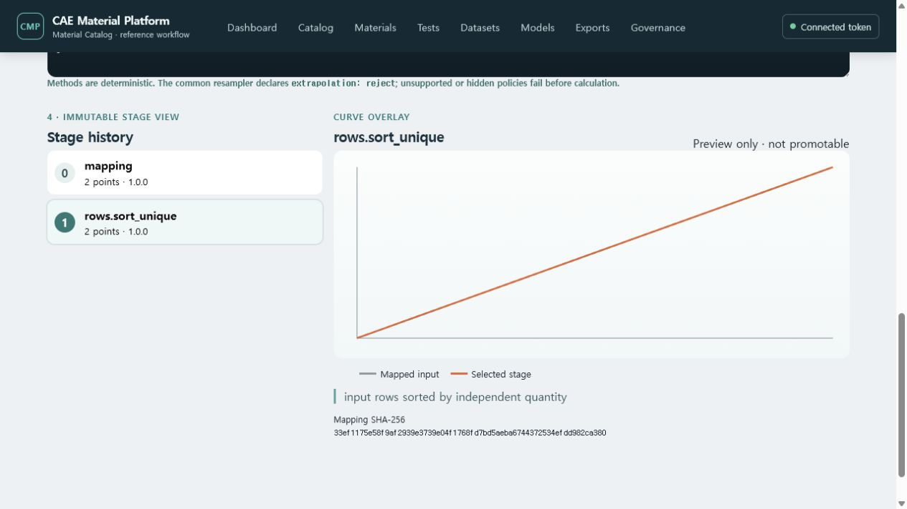
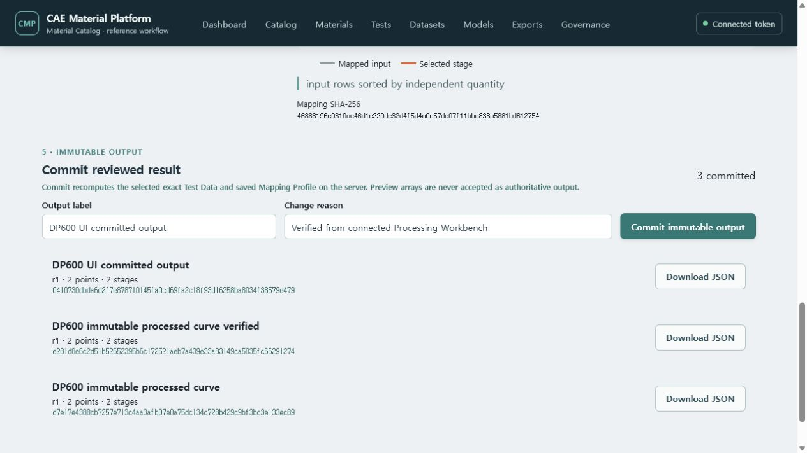

# T-53 common Mapping Profile and Processing Workbench evidence

Verified on 2026-07-18 against the Docker Compose demo and PostgreSQL migration head
`20260830_064_T53_common_processing_outputs`.

## Demonstrated workflow

1. The user opened `/datasets/processing` and selected exact DP600 Test Data revision 2.
2. The browser loaded canonical JSON through the API rather than using a UI-only fixture.
3. The user created a reusable Mapping Profile and appended revision 2 with a strong current ETag.
4. PostgreSQL retained both immutable profile revisions and typed channel binding rows.
5. The workbench loaded seven versioned deterministic processing methods from the server registry.
6. A server preview mapped engineering strain/stress, applied `rows.sort_unique`, and returned each
   intermediate curve stage, row counts, diagnostics and a Mapping Profile SHA-256.
7. The UI rendered mapped input and the selected stage on shared numeric axes. It labels the result
   `Preview only · not promotable` so an ephemeral result cannot be mistaken for stored evidence.
8. Commit ignored browser preview arrays, reloaded exact Test Data revision 2 and Mapping Profile
   revision 2, recomputed the pipeline, and created a revision-1 Processing Output.
9. PostgreSQL pins both exact revisions, semantic and canonical source digests, ordered method
   versions/options and the immutable output Artifact. Download header, bytes and DB pin all matched
   SHA-256 `e281d8e6...291274` in the API check; the connected UI then committed `0410730d...9e479`.
10. A second DP600 tensile replicate was imported as a separate stable identity and revision. The
    general ensemble preview retained both exact documents, applied the same Mapping Profile and
    preprocessing steps, aligned 21 points only on the observed domain intersection, and rejected
    extrapolation.
11. The server returned both member curves plus pointwise mean, median, sample SD (`ddof=1`),
    unscaled MAD, linear IQR and a normal-approximation 95% mean CI. At the final point the live API
    produced mean `210.125 MPa` and sample SD `7.247844 MPa`; the browser displayed the same values.

## Evidence

- Domain fixtures cover sorting, duplicate/missing policies, crop, scale/shift, interpolation,
  moving average, Savitzky–Golay, smoothing spline and invalid option/quantity paths.
- API tests cover the method registry, preview composition and immutable profile create/list/get/revise.
- A fresh PostgreSQL migration verified explicit identity/revision/channel/attribute-binding tables,
  exact catalog Attribute Definition revision pins, RLS and immutable revision triggers.
- Migration 064 adds one-revision-only Output identity/revision/step tables, composite exact Test
  Data/Profile FKs and an immutable Artifact FK. Method options use bounded schema-validated JSONB;
  they are not a catalog EAV value store.
- React tests cover exact Test Data loading, saved profile selection, a real server-preview response,
  two-member alignment, member retention and pointwise statistics rendering.

This completes T-53. General versioned Recipe persistence, exact batch Selection, partial retry and
promotion of these previews into immutable reusable batch outputs remain T-54 scope.
