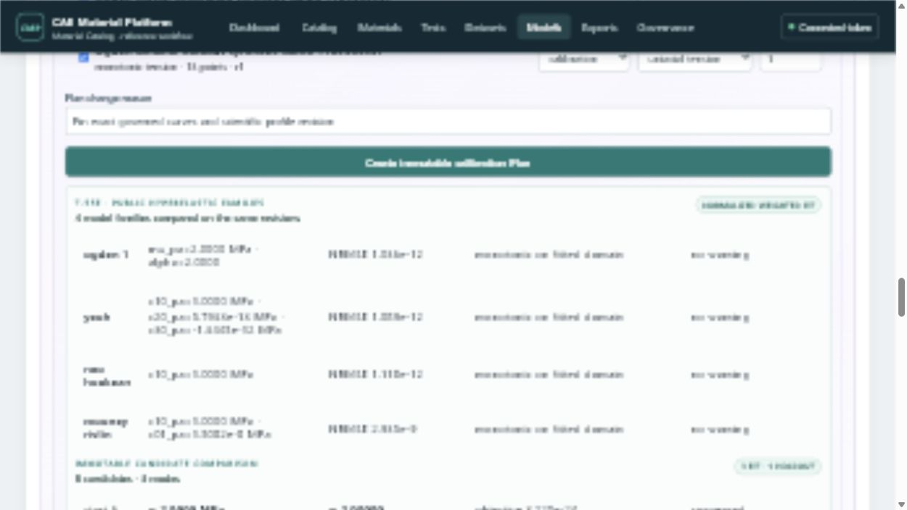

# T-55E hyperelastic family comparison evidence

## Demonstrated workflow

The Docker/PostgreSQL demo restores one immutable multi-test calibration Run by exact ID and compares
Neo-Hookean, Mooney--Rivlin, Yeoh, and one-term Ogden candidates on the same three calibration curves
and one disjoint holdout curve. Selecting a family row loads its digest-pinned Parquet diagnostics
Artifact and renders observed, fitted, and residual nominal stress without re-running the fit.

## Persisted evidence

- migration head: `20260905_070_t55e_diagnostics`
- family parameters: explicit typed columns in `modeling.hyperelastic_family_candidate`
- diagnostics: one immutable Artifact ID, SHA-256 digest, and point count per family Candidate
- supported reference equations: Neo-Hookean, Mooney--Rivlin, Yeoh, one-term Ogden
- decision boundary: family selection and Neutral Material JSON promotion are T-56; solver mapping is T-57

## Verification

The targeted Python domain/API/PostgreSQL tests, React workbench tests, web production build, and
repository `make ci` gate are run before the T-55E pull request is merged. The checked-in user guide
and screenshot manifest point to this same live Docker/PostgreSQL state.
