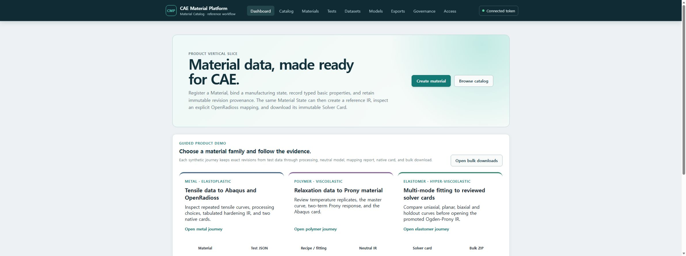

# T-60 clean three-family demo evidence

검증일: 2026-07-18

깨끗한 `cmp-local-demo` PostgreSQL/object-store 볼륨에서 migration 074까지 적용한 뒤 Compose의
`seed` 서비스가 보호된 HTTP API만 사용하여 다음 합성 자료를 만들었다.

- `CMP-DEMO-DP780`: 반복 인장 Dataset 4개, 금속 탄소성 IR, Abaqus/OpenRadioss 카드
- `CMP-DEMO-POLYMER-PRONY`: 3개 온도 × 2개 반복 완화시험, 101-point master curve,
  two-term Prony IR, Abaqus 카드
- `CMP-DEMO-ELASTOMER-OGDEN`: uniaxial/planar/biaxial calibration과 holdout, reviewed
  Candidate promotion, Ogden-Prony IR revision 2, Abaqus/OpenRadioss 카드

`make demo-verify`는 local demo identity를 발급받아 각 Material, State, current Model revision과
필수 solver card를 다시 조회한다. 검증 당시 세 Material과 다섯 native card가 모두 확인됐고 seed
컨테이너는 exit code 0으로 종료됐다.

이 자료는 공개 수식으로 만든 `reference/non-production` 합성 fixture다. 실제 재료 qualification이나
solver 실행 검증의 증거가 아니다.
