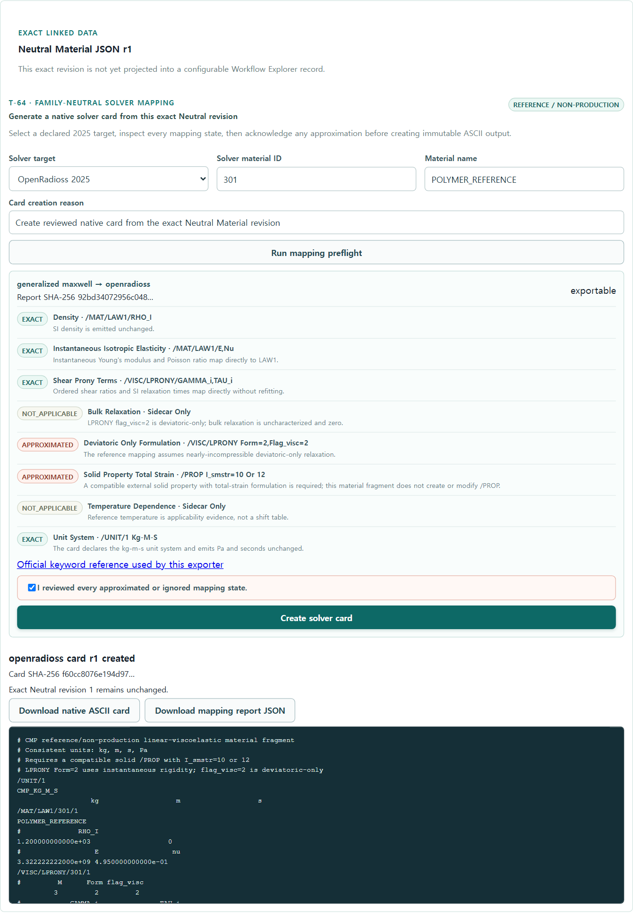

# T-68 conditional OpenRadioss LPRONY evidence

Date: `2026-07-19`

The clean Docker Compose demo promoted the exact reviewed polymer Processing Output into one
generalized-Maxwell Neutral Material revision and generated both Abaqus and OpenRadioss native
cards from it.

| Evidence | Exact value |
| --- | --- |
| Processing Output | `c76fbbc8-e348-41fe-9650-57309489da72` |
| Generalized-Maxwell IR | `9f7b39aa-8126-4d8a-8678-ee8651308a06` |
| Neutral Material JSON | `f1175977-c29a-4119-a2f2-aa71128b37ad` r1 |
| Seed OpenRadioss card | `523f95a7-ee03-4a51-9df8-da406a5e3132` r1 |
| Seed `.rad` SHA-256 | `9efdc703d5cf4cb615a3725b517773396ec30a0ebb473ad5a48f1021cdf4dcf6` |
| Browser-created card | `0239267c-f353-4978-a055-8c4084a133b4` r1 |
| Browser-created `.rad` SHA-256 | `f60cc8076e194d97e15aeee7fabc3a9db92d17f4db3f542f1efaa3d58d22b012` |

The mapping report showed density, instantaneous elasticity and ordered Prony ratios/times as
`exact`; bulk relaxation and temperature shift as `not_applicable`; and both the deviatoric-only
nearly-incompressible interpretation and external `/PROP I_smstr=10 or 12` prerequisite as
`approximated`. The browser required explicit acknowledgement before creation. The native preview
contains `/MAT/LAW1`, `/VISC/LPRONY`, Form 2 and `flag_visc=2`; it does not contain LAW62 or an
invented `/PROP`.

The protected verifier also downloaded both solver cards and verified their SHA-256 digests. This
is reference/non-production mapping evidence, not an OpenRadioss execution or qualification result.

Verification gates completed with 765 Python tests passed (76 PostgreSQL tests intentionally
skipped by the default CI environment), all 76 isolated PostgreSQL integration tests passed, 61
Vitest tests passed, OpenAPI/architecture/user-guide checks passed, and a production web build below
the 300 kB entry budget.
