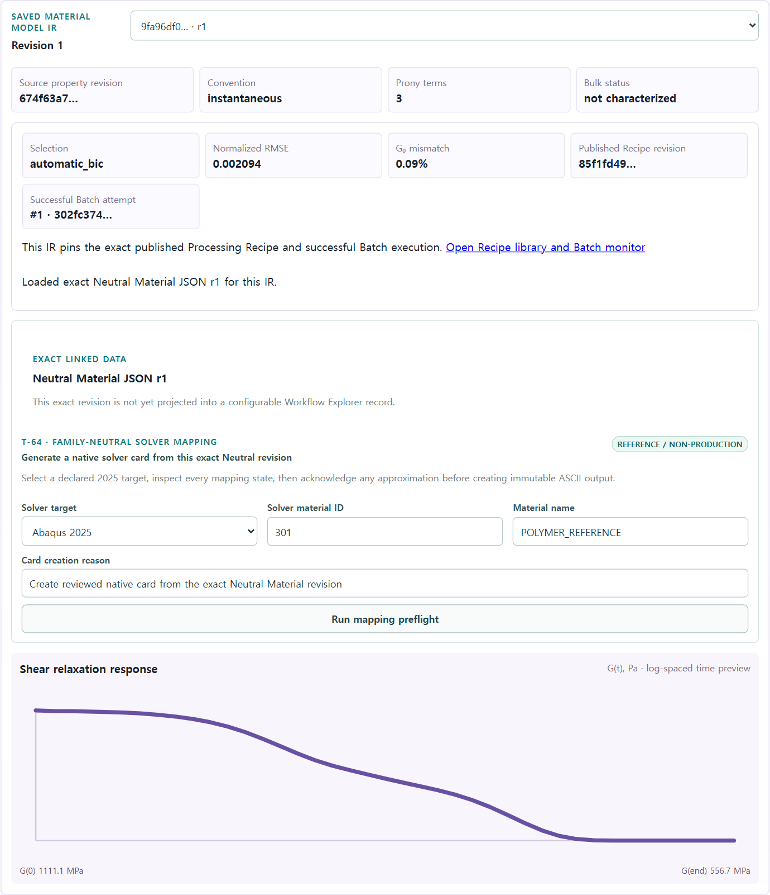
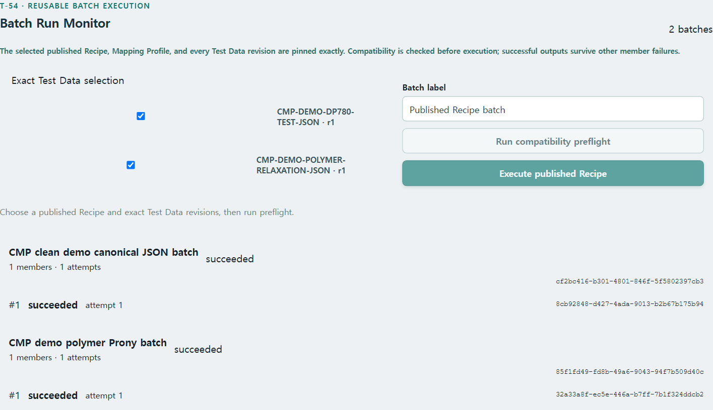

# T-69 saved polymer Recipe/Batch promotion evidence

Date: `2026-07-19`

A clean Docker Compose database published the reusable polymer Prony Recipe, executed it as a
common Processing Batch, promoted the successful exact Output to IR schema `1.3.0`, created a
canonical Neutral Material JSON with `processing_recipe=exact_revision`, generated both native
cards, and assembled the complete exchange package.

| Evidence | Exact value |
| --- | --- |
| Published Processing Recipe | `3aa1ad63-b820-4c08-ba4a-204d89d0f912` |
| Processing Batch | `a1f34870-1a7c-4e38-b23b-947726e8d799` |
| Successful Batch Attempt | `302fc374-c5d0-43b6-8f60-a8b0fcb545c3` |
| Processing Output | `9a6f9ba0-733c-4ae6-87dc-c2cc16a657d0` |
| Generalized-Maxwell IR | `9fa96df0-1fb0-4f6b-b250-99636cd2da85` |
| Neutral Material JSON | `23531544-bceb-4f63-a1ec-2dd51608d917` |
| Abaqus card | `b2b1f7dc-556b-455d-8436-6d00f4ea6afd` |
| Abaqus `.inp` SHA-256 | `42f81ca47d6beeefb63dca4183fc72241f0580194ddab5a334d32877f5888455` |
| OpenRadioss card | `47f4ed72-5f77-46a5-ae01-83eef4d5eae2` |
| OpenRadioss `.rad` SHA-256 | `9efdc703d5cf4cb615a3725b517773396ec30a0ebb473ad5a48f1021cdf4dcf6` |
| Polymer Bulk Bundle | `77786ac3-262a-4829-bedc-7df3001ff99c` |
| Bundle SHA-256 | `e6e2265769ea3edbbf7a76a3db1f8d3a34839889cca6baedd7f8385025b8b1e7` |
| Bundle components | `13` |

The PostgreSQL row pins the same Recipe revision/digest, Batch, Member, Attempt and Output revision.
The browser shows the published Recipe and successful Attempt directly on the selected IR, and the
Processing workbench shows the same polymer Batch as succeeded.

The protected verifier checked both native card digests and the package representation set. The
isolated PostgreSQL integration suite passed all 76 tests. Full `make ci` passed with 768 backend,
contract and migration tests (76 environment-gated PostgreSQL tests skipped there and exercised by
the isolated suite), 61 frontend tests, the production web build, bundle budget, architecture,
OpenAPI compatibility and user-guide gates. This remains reference/non-production evidence; it is
not solver execution or material qualification.
