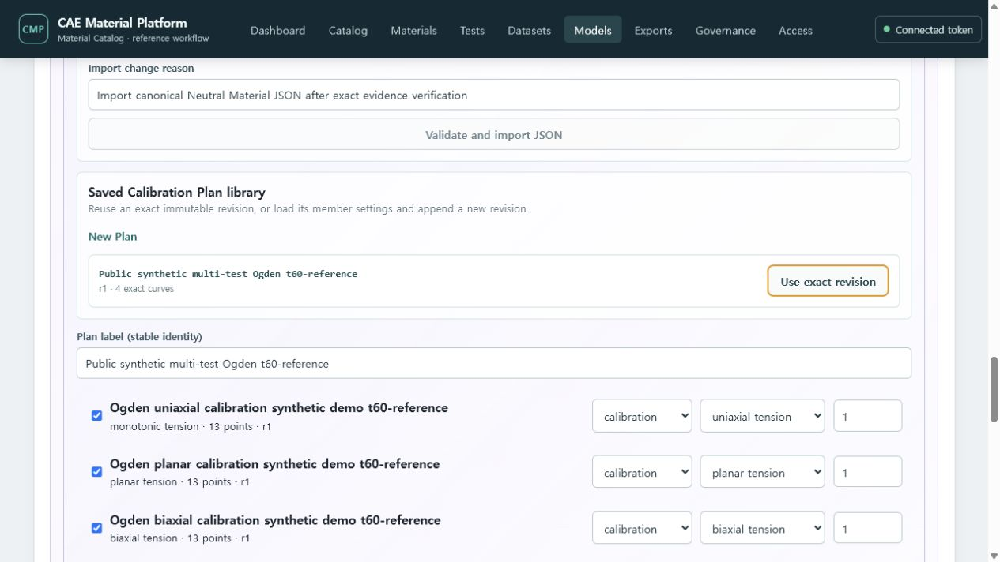

# T-72 reusable hyperelastic Calibration Plan evidence

Date: `2026-07-19`

The live Docker/PostgreSQL service listed the seeded `Public synthetic multi-test Ogden
t60-reference` Plan inside the Elastomer Modeling Workbench. Selecting **Use exact revision** loaded
the four pinned Dataset revisions with three calibration modes, one holdout role and their weights.
The UI changed to **Save new Plan revision**, while the existing exact revision remained executable.

The protected PostgreSQL regression created a Plan r1, listed and fetched its current projection,
appended r2 with a changed member weight through compare-and-swap, executed the exact r2 revision and
rejected visibility from another project. No migration was added: the existing typed Plan identity,
immutable revision and ordered member tables already provide the required storage contract.

Verification passed all 76 isolated PostgreSQL tests, 774 Python tests in the default full suite,
62 frontend tests, static typing across 650 source files, architecture and contract checks, OpenAPI
compatibility, the 55-capture user-guide gate and the production web bundle budget.

