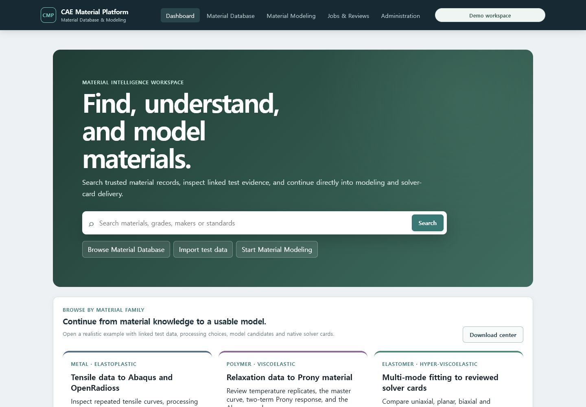

# T-75 product session and shell evidence

Captured on 2026-07-19 from the Docker Compose demo at `http://127.0.0.1:5173/`.

The application requests the explicitly enabled local demo session in the background and presents
only product navigation: Dashboard, Material Database, Material Modeling, Jobs & Reviews and
Administration. No API address, bearer credential, tenant or RLS control is present in the rendered
workspace. A non-demo deployment falls back to a normal sign-in boundary.

The Dashboard queries the live PostgreSQL-backed catalog and shows the three synthetic Metal,
Polymer and Elastomer examples. The screenshot is product-shell evidence only; T-76 through T-81
remain responsible for the hierarchical database explorer and graph-centered modeling replacement.

Verification:

- `npm test`: 30 files, 62 tests passed.
- `npm run build`: TypeScript, Vite and web bundle budget passed.
- browser DOM: automatic workspace, five product navigation areas and three demo materials.
