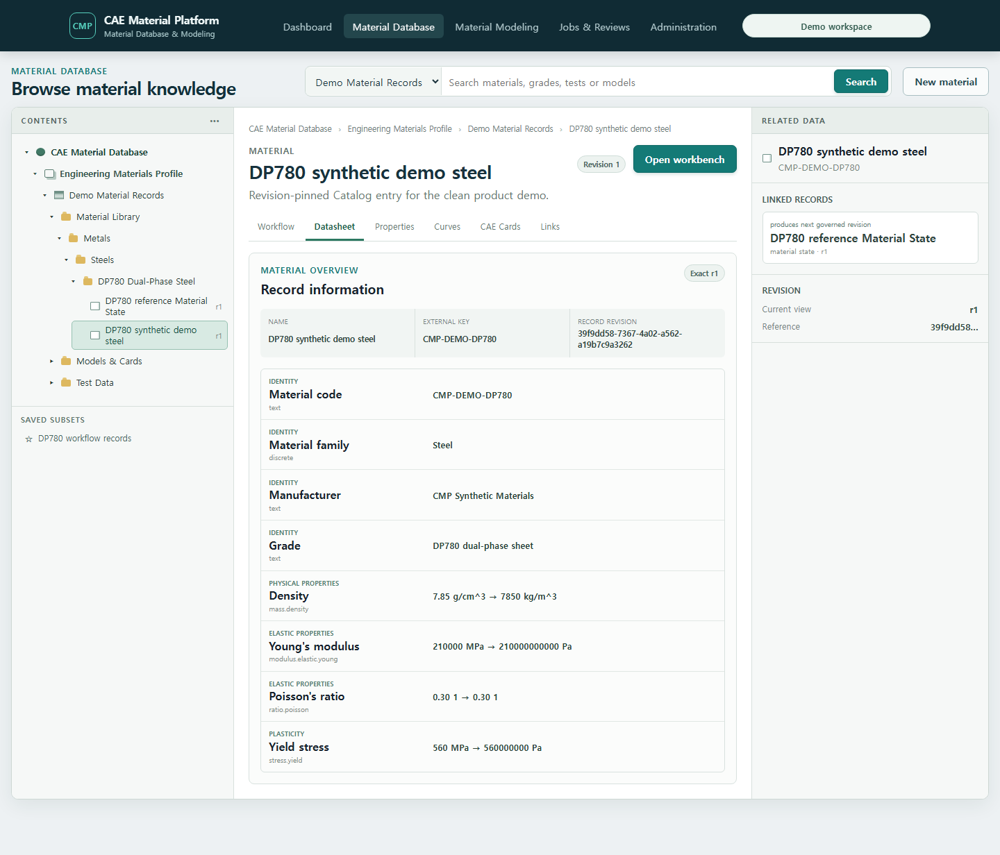

# T-77 Material Datasheet, search and comparison evidence

Captured on 2026-07-19 from the clean Docker Compose demo at
`http://127.0.0.1:5173/database`.

T-77 completes the record-reading experience inside the persistent three-pane Material Database:

- the same Record selected from the Contents Tree or search results opens one exact revision;
- the **Datasheet** follows the administrator-defined Layout and preserves original value/unit,
  normalized value/unit and quantity semantics;
- **Properties**, **Curves**, **CAE Cards** and **Links** keep the Record revision context instead of
  opening a disconnected technical editor;
- search returns live typed Records and exposes discrete facets plus normalized numeric ranges;
- users can select multiple results and compare them side by side in Layout order;
- linked Test Data, Processing, Material Model, Neutral Material and solver-card Records remain
  exact-revision navigation targets.

The synthetic DP780 Material uses a schema created through the configurable Catalog API without a
database migration: eight typed Attributes and a four-section `Material overview` Layout. The
Datasheet shows `7.85 g/cm^3 -> 7850 kg/m^3`, `210000 MPa -> 210000000000 Pa`, Poisson's ratio and
yield stress without hiding normalization.

The second capture searches `DP780`, selects the Material and Material State Records and compares
their exact current revisions. Facet counts and numeric range controls are computed by the existing
PostgreSQL typed-value search contract.

T-77 deliberately does not draw a fake generic plot from opaque curve Artifact identifiers. The
Curves tab preserves curve Attribute provenance and directs the user to exact linked Test Data.
Raw/normalized/processed curve overlay, channel semantics and immediate processing preview are the
graph-centered T-79 Material Modeling scope.

Verification:

- focused Vitest: nested hierarchy, exact workflow/Datasheet and two-Record Layout comparison, 3
  tests passed;
- TypeScript and production Vite build passed the bundle limit;
- clean seed followed by two reseeds retained the same Material Record revision
  `39f9dd58-7367-4a02-a562-a19b7c9a3262` and all linked demo identities;
- Playwright captured both screens from the live API/PostgreSQL service;
- the complete CI command body passed Ruff, mypy over 651 files, architecture, contracts/OpenAPI,
  user-guide validation, 775 default Python tests, 65 frontend tests and the production bundle
  limit; all 76 environment-gated PostgreSQL tests also passed against the isolated Docker test
  database.
