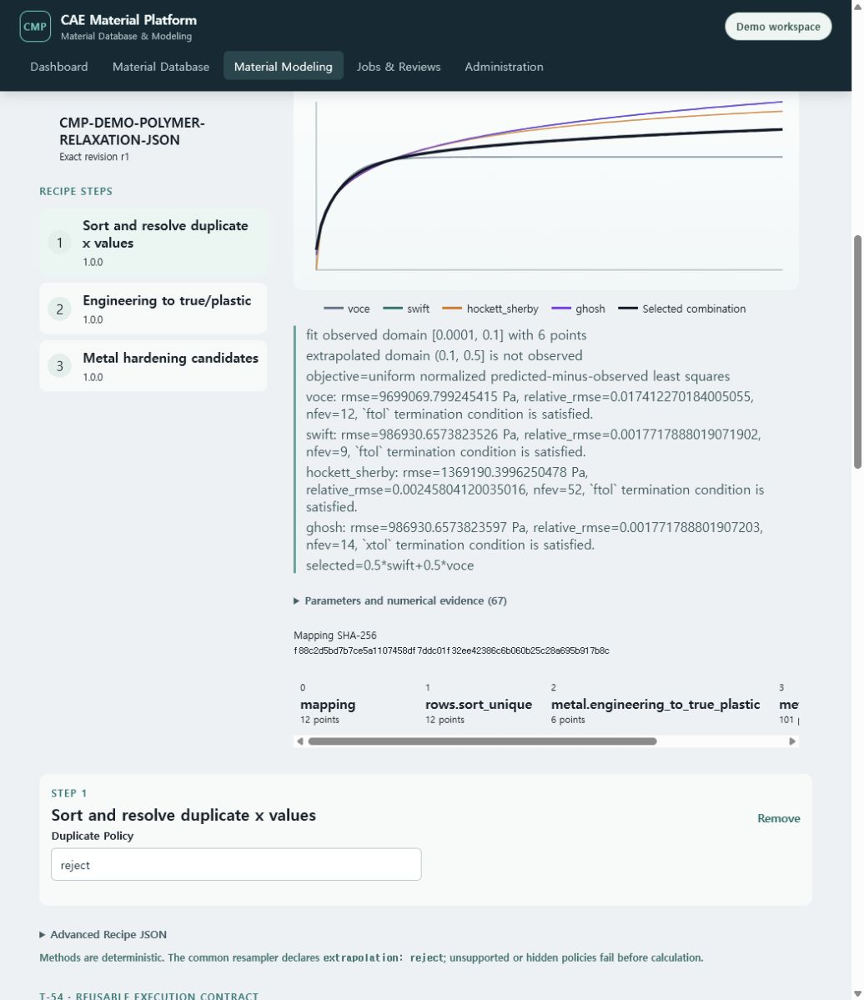

# T-79 graph-centered Material Modeling evidence

Captured on 2026-07-19 from the Docker Compose demo at
`http://127.0.0.1:5173/modeling`.

The Modeling page now makes the calculation flow visible as one product workspace:

1. select and load an exact canonical Test Data revision;
2. choose a saved or template Mapping Profile;
3. load a published Recipe or add ordered processing methods;
4. select a Recipe stage and edit its typed method options;
5. run an ephemeral server preview and compare mapped, processed, fitted and extrapolated stages;
6. explicitly commit a reviewed result through the existing immutable Processing Output contract.

The center graph remains beside the Dataset/curve and Recipe stage rail. It renders the actual API
response, not a browser-only approximation. The clean demo loaded `CMP-DEMO-DP780-TEST-JSON` r1 and
the exact published `CMP demo tensile cleanup` r2 Recipe. Preview returned mapping, sort,
engineering-to-true/plastic and hardening fitting stages. The final stage displayed Voce, Swift,
Hockett--Sherby and Ghosh candidates plus the selected combined extrapolation. Selecting an earlier
stage switches the same graph to the mapped/processed overlay.

Mapping and Recipe JSON remain available under explicit Advanced disclosures. The normal right-side
panel edits the selected method's options without requiring JSON. Full parameter, bound and
numerical evidence is likewise collapsed below the plot so it remains auditable without overwhelming
the curve-comparison workflow. Preview never creates a promotable revision; only explicit commit
recomputes on the server and appends an immutable Processing Output.

Verification before merge:

- focused Vitest covers exact Test Data load, Metal/Polymer templates, server preview, candidate
  graph, stage switching, scalar evidence and replicate statistics;
- all frontend tests and the TypeScript/Vite production bundle gate pass;
- the live Docker/PostgreSQL browser journey loaded the exact document and published Recipe, produced
  the server candidate graph and reported no browser console errors;
- the CI command body passed Ruff, mypy, architecture, contract/OpenAPI and user-guide gates,
  775 default Python tests, 68 frontend tests and the production bundle budget;
- the isolated Docker PostgreSQL marker suite passed all 76 tests in one clean run.

T-79 does not claim the complete family workbench. T-80 connects all Metal, Polymer and Elastomer
family controls plus cohesive Recipe/Batch journeys. T-81 connects reviewed results to Neutral
Material JSON, solver mapping preflight and Abaqus/OpenRadioss native card download in the final step.
