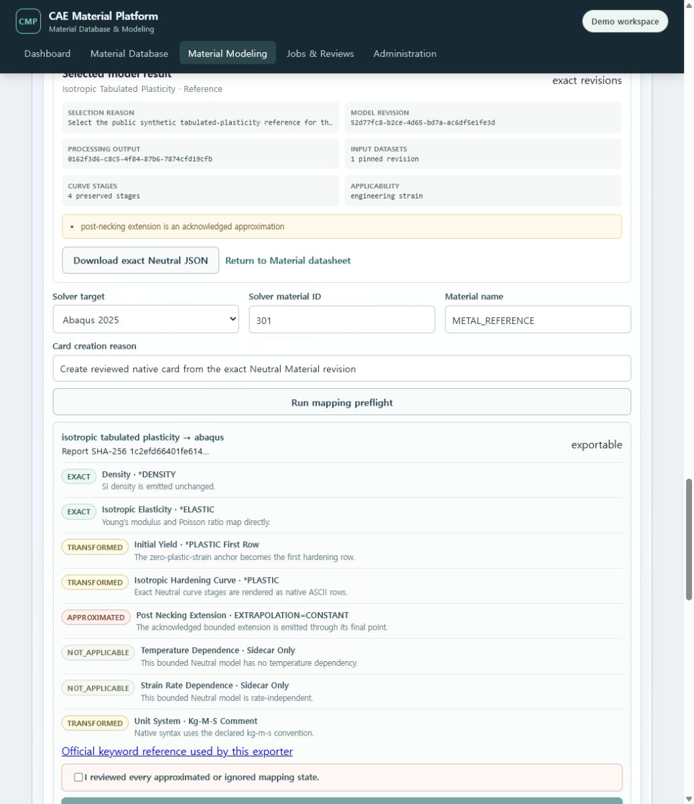

# T-81 reviewed Neutral Material and solver-card delivery evidence

Date: `2026-07-19`

## Retained engine-integration outcome

> **Product status correction:** this evidence proves that exact Neutral, mapping and native-card
> engines are connected. It does **not** prove a GRANTA/Material Modeler-level GUI. The screenshot is
> an interim baseline that T-84~T-93 must replace under
> the subsequently superseded GUI functional-parity plan.

`/modeling` now ends every material-family track with the same reviewed-delivery panel. The panel
does not create a second modeling engine. It reuses the exact candidate, Processing Output,
Neutral Material and solver exporter revisions already implemented by the metal, polymer and
elastomer workflows.

The normal user path is now visible as four explicit states:

1. review the selected result and exact evidence;
2. inspect or download the canonical `cmp.neutral-material` JSON revision;
3. run the selected Abaqus/OpenRadioss preflight and inspect every mapping state;
4. acknowledge any approximation, create the native ASCII card, preview it and download the card
   or mapping report.

The exact Material, Material State, Property Set, input Dataset, Processing Output, curve stages,
model revision and selection reason are summarized before export. Users can return to the Material
datasheet or continue to the existing bulk package screen without copying an object UUID.

## Live Docker/PostgreSQL journeys

The running service at `http://127.0.0.1:5173/modeling` was exercised with the automatic demo
session.

### Metal elastoplastic

- restored the exact DP780 Processing Output-backed Neutral Material revision instead of attempting
  a duplicate promotion;
- displayed six exact references, one input revision and four curve stages;
- showed the bounded post-necking approximation before export;
- ran the Abaqus 2025 preflight with eight explicit mapping states: two `exact`, three
  `transformed`, one `approximated` and two `not_applicable`;
- required acknowledgement of the approximation before card creation;
- created an immutable Abaqus card, rendered the complete `*MATERIAL`, `*DENSITY`, `*ELASTIC` and
  `*PLASTIC` preview and exposed native card/mapping-report downloads.

The first live attempt exposed a re-entry defect: the UI offered promotion even though the unique
Processing Output already had a Neutral revision. The server correctly rejected the duplicate.
T-81 now discovers the exact Neutral through the material's governed export candidates and replaces
the create action with `Exact Neutral JSON rN restored`.

### Polymer viscoelastic

- restored the exact generalized-Maxwell Neutral revision for the selected Prony Processing
  Output;
- displayed the exact Processing Output, one input revision, three curve stages, time applicability
  and the recorded instantaneous-modulus mismatch warning;
- exposed the same Abaqus/OpenRadioss preflight and delivery controls as the metal path.

### Elastomer hyper-viscoelastic

- reused `Public synthetic multi-test Ogden t60-reference` Plan r1;
- executed the deterministic four-family comparison with eight multistart Ogden candidates, three
  calibration modes and one holdout curve;
- selected the best Ogden family after fitted/residual/stability review;
- promoted the reviewed family to a new canonical Neutral Material revision with eight exact
  references, four input revisions and twelve preserved curve stages;
- displayed the same reviewed-delivery and solver preflight controls used by metal and polymer.

## Regression evidence

- `npm run check`: TypeScript, Vite production build, bundle budgets and all `69` frontend tests
  passed.
- The common delivery component test verifies mapping acknowledgement, immutable card creation,
  native ASCII preview, Material return and bulk-package navigation.
- The elastoplastic regression prevents a second create action after a Neutral revision is loaded.
- Existing Python semantic and integration suites cover the three closed Neutral model families,
  exact digest acknowledgement and Abaqus/OpenRadioss renderers. T-81 changes no database schema or
  exporter calculation.

## Scope boundary

T-81 delivers reviewed reference/non-production engine results. Its long form stack, generic step
options and limited graph interaction are not accepted as product completion. T-84~T-93 own the
direct-manipulation family workbenches, Database parity and clean product acceptance. Actual solver
execution and production material qualification remain outside the current scope.
