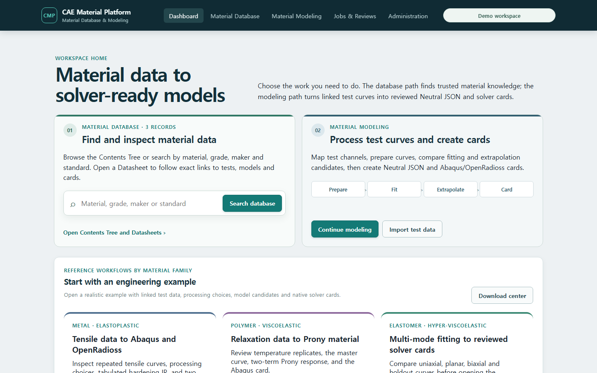
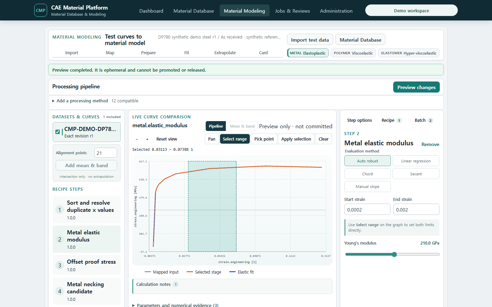

# T-85 Engineering Modeling Shell — accepted foundation evidence

Date: 2026-07-20

This accepts the T-85 shell and graph foundation. It does not claim that T-86~T-93 family modeling
and full product parity are complete.

## Live product evidence

- Dashboard: the former marketing hero is replaced by explicit Material Database and Material Modeling
  work lanes, each with a one-action entry point; reference family journeys are supporting content.
- Runtime: the web container was rebuilt against the demo PostgreSQL and API services.
- Route and viewport: `/modeling`, 1440×900.
- Input: synthetic DP780 Test Data, exact revision 1.
- Semantic routing: the Metal rail is populated from explicit strain/stress quantity semantics; the polymer relaxation document is excluded.
- First server preview: four public hardening candidates and the selected blend are visible without API, token, tenant, UUID, or digest input.
- Plot interaction: titled axes and units, ticks, crosshair coordinates, cursor-centred zoom, drag pan, reset, and five independently visible series.
- Workbench coordination: selecting a Recipe step changes the graph stage and the right-hand task inspector; hiding a legend series changes the plotted series immediately.
- Direct graph command: range and point modes remain ephemeral until Apply; Apply converts the selection
  to a compatible step option in the Recipe draft, after which an existing Save action creates a new revision.
- Preview lifetime: changes debounce for 300 ms, abort the preceding preview request and only let the latest
  response update the graph.
- Visual hierarchy: supplemental Mapping, reviewed outputs, delivery and replicate statistics are collapsed;
  the first viewport is reserved for the semantic curve/step rail, persistent graph and selected task panel.
- Guided metal controls: Elastic Modulus exposes robust/OLS/chord/secant/manual choices, graph range inputs
  and a live GPa slider rather than requiring JSON editing.
- Exact-session journey: the live browser opened Database → DP780 record → exact Material workbench →
  `Open in Material Modeling`; `/modeling` restored `DP780 synthetic demo steel r1`, its exact State and
  exact Test Data r1 without URL/token/UUID input.





## Automated evidence

```text
npm test --workspace @cmp/web -- --run
34 test files passed, 76 tests passed

npm run build --workspace @cmp/web
TypeScript, Vite build, and bundle budgets passed
```

## Still open after the T-85 foundation

- T-86 completion: smoothing/mean/statistics overlays and draggable proof/necking markers.
- T-87 completion: residual/derivative split view and accepted immutable candidate selection.
- Complete T-86 through T-90 family workflows and T-93 clean-environment acceptance.

