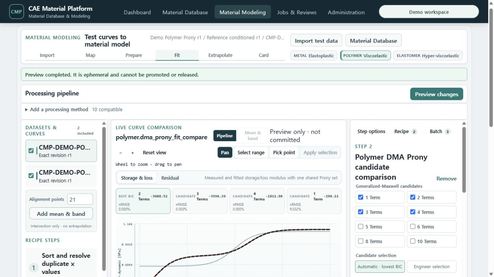
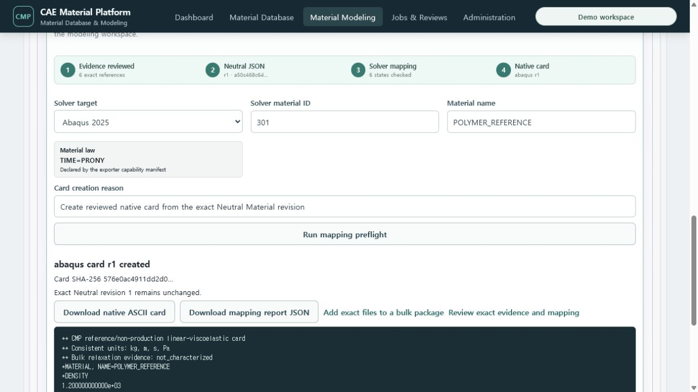
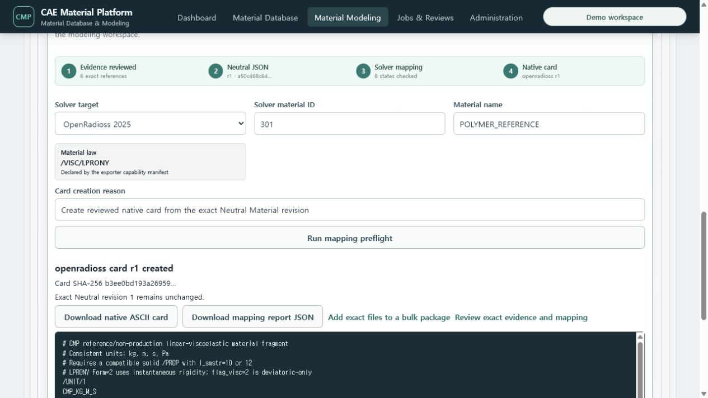
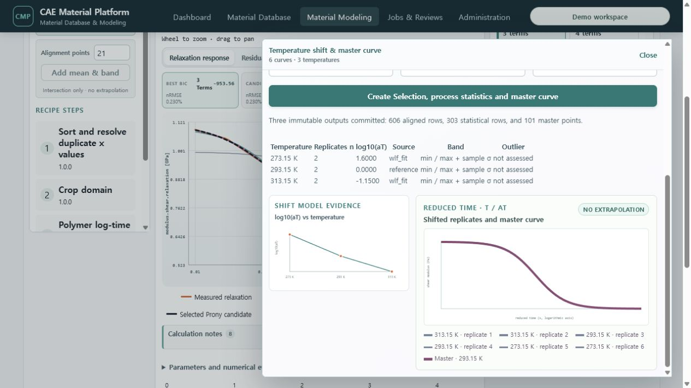

# T-89 Polymer viscoelastic workbench evidence

T-89 replaces the generic polymer form with two explicit engineering routes in the shared
Material Modeling workbench.

- Relaxation: log-time resampling, 1–10 term bounded generalized-Maxwell comparison, BIC/manual
  selection, residual review, multi-temperature WLF/Arrhenius shift evidence and master curve.
- DMA: exact `frequency.cyclic`, storage-modulus and loss-modulus mapping; one bounded Prony
  parameter set is fitted jointly to storage and loss response using the public generalized-Maxwell
  frequency equations. Candidate response, joint residual, BIC, normalized RMSE and ordered terms
  are visible on a logarithmic frequency axis.
- Both routes save a published Mapping Profile and Processing Recipe, execute an exact Batch,
  retain an immutable Processing Output, promote it to generalized-Maxwell IR and Neutral Material
  JSON, and create Abaqus and OpenRadioss native ASCII cards.
- The Card task follows the currently selected Test Data revision. Selecting DMA cannot silently
  reopen the relaxation model.

## Live Docker/PostgreSQL evidence

The public synthetic DMA input contains 33 points from 0.01–100 Hz and a known two-term response.
The live calculation selected two terms and recovered `g1=0.27273, tau1=0.08 s` and
`g2=0.45455, tau2=8 s`, with joint normalized RMSE approximately `1.0e-12`.

The exact path completed in the browser:

1. DMA Test Data JSON r1 → exact DMA Mapping Profile r1.
2. Published DMA Prony Recipe → successful Batch attempt → Processing Output r1.
3. Reviewed two-term IR r1 → Neutral Material JSON r1 with six preserved curve stages.
4. Abaqus preflight and `*VISCOELASTIC, TIME=PRONY` card.
5. OpenRadioss preflight, explicit acknowledgement of the deviatoric-only and external total-strain
   property approximations, and `/VISC/LPRONY` card.

`scripts/verify_full_demo.py` now discovers this path by exact Processing Output reference rather
than list order. Its `polymer_dma_journey` gate verifies the canonical Test JSON, Mapping Profile,
published Recipe, successful Batch, immutable Output, promoted IR, DMA Neutral source mode and both
native card downloads with SHA-256 digests.

Multi-temperature relaxation and the relaxation-derived card path are recorded separately:

## Boundary

These are deterministic reference/non-production models. The exporter does not invent bulk
relaxation, temperature-shift tables or a compatible OpenRadioss `/PROP`. Actual solver execution
and material qualification remain outside this task.
