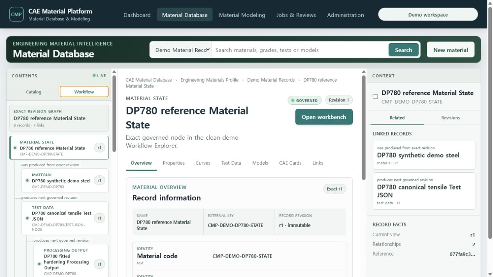

# T-91 Material Database parity evidence

Date: 2026-07-20

## Accepted product behavior

- Opening `/database` loads actual PostgreSQL catalog definitions and automatically expands a useful
  nested demo path instead of presenting an empty center pane.
- The persistent left pane switches between Catalog hierarchy and the exact-revision Workflow graph.
- The center pane renders the configured Layout plus Properties, Curves, Test Data, Models, CAE Cards
  and Links views from the selected record and graph.
- The context pane follows forward/reverse typed links and opens immutable revision history.
- Arrow Up/Down/Home/End move tree focus; Arrow Right/Left expand and collapse disclosures.
- The selected exact record revision is restored for the browser session without asking for UUIDs.

## Live evidence

The live Docker/PostgreSQL demo showed the nested Material Library → Metals → Steels → DP780 hierarchy,
an engine-connected Layout Datasheet, 8 governed Workflow records, 7 typed exact-revision links and
forward/reverse context navigation at 1440×900.

## Automated checks

- focused Material Database Vitest: automatic demo entry, keyboard disclosure, exact linked navigation,
  Layout Datasheet, search and multi-record comparison
- TypeScript production build and web bundle budgets
- full frontend suite and clean demo verifier before merge
