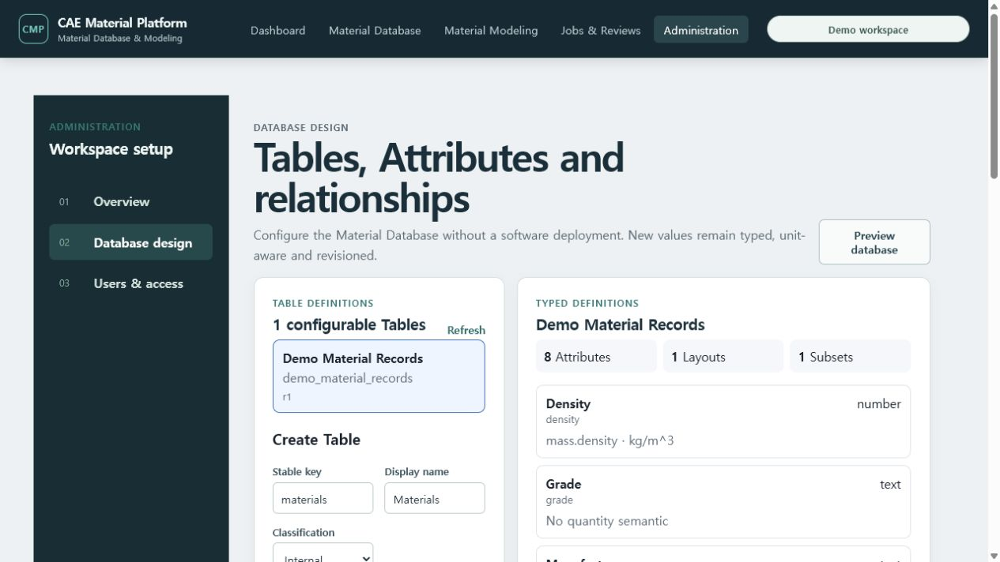
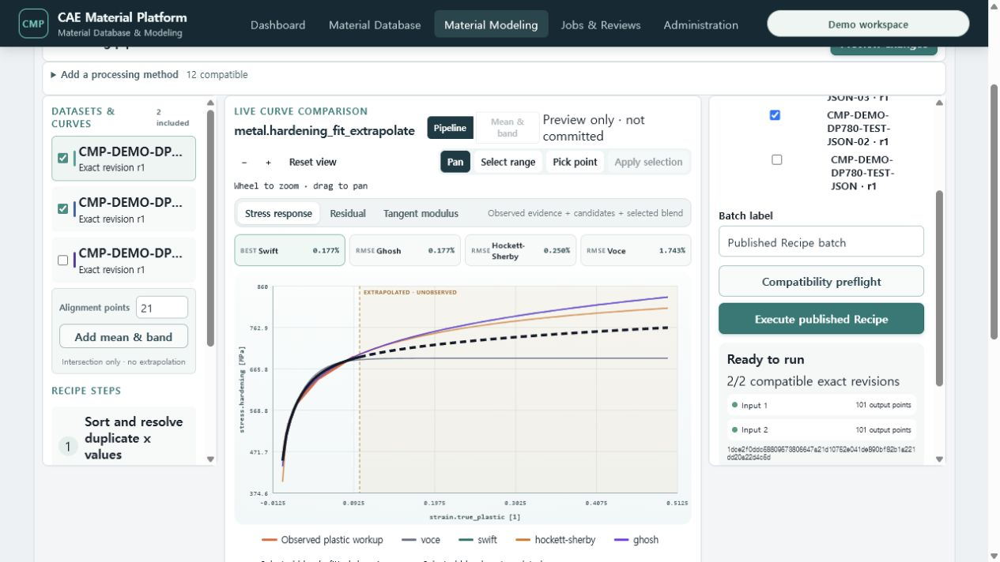

# T-92 Search, Administration, Recipe and Batch evidence

Date: 2026-07-20

## Accepted behavior

- Material Database retains typed text search, discrete facets, normalized numeric ranges, saved Subsets
  and Layout-driven multi-record comparison.
- Administration guides an Administrator through Table, typed Attribute/unit semantics, Layout, Subset
  and exact-revision Link Type configuration without exposing API or token controls.
- Material Modeling restores the current material family's latest published Recipe revision automatically.
- Recipe Library shows lifecycle and exact revision, and supports clone-as-new, append draft revision and
  publish reviewed revision without overwriting history.
- Batch Monitor filters runs by the current family, preflights every exact Test Data member and displays
  expected output points or the blocking diagnostic before execution.
- Batch history shows succeeded/total attempts and retains failed-only retry.

## Live Docker/PostgreSQL evidence

The live Metal path automatically restored `CMP demo tensile cleanup r2 · published`, selected two exact
Test JSON revisions and returned `2/2 compatible` with 101 output points each. The native Execute action
became enabled only after this server preflight.

## Checks

- Common Processing Workbench focused Vitest
- TypeScript/Vite production build and bundle budgets
- full frontend regression and user-guide screenshot verification before merge
