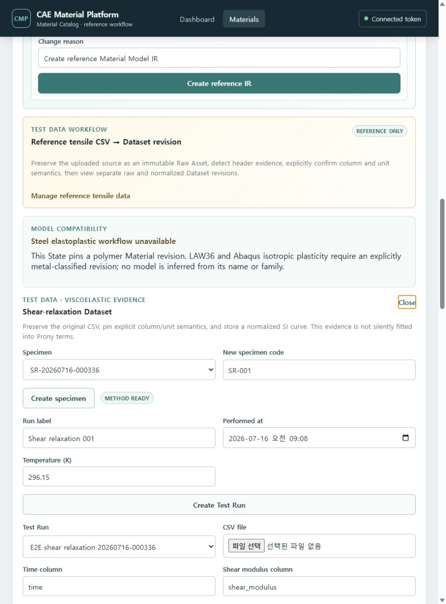
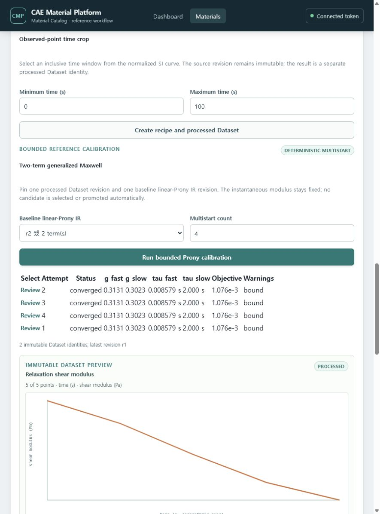
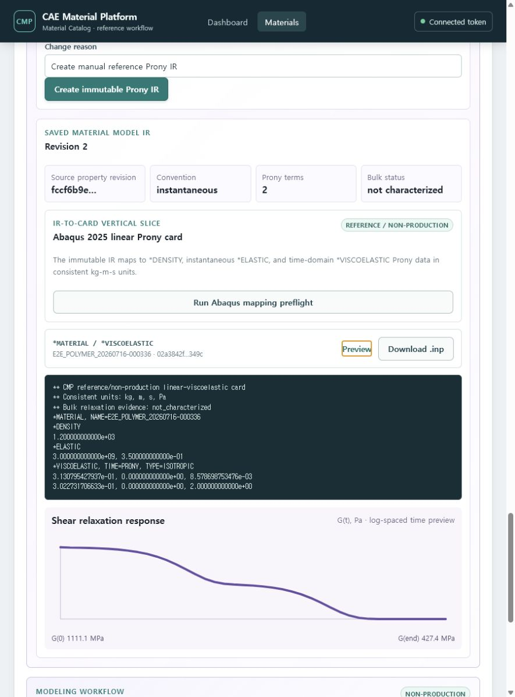
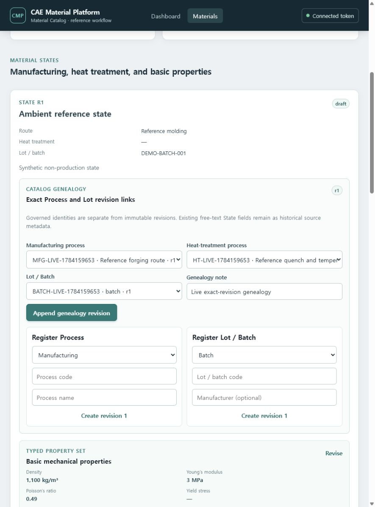
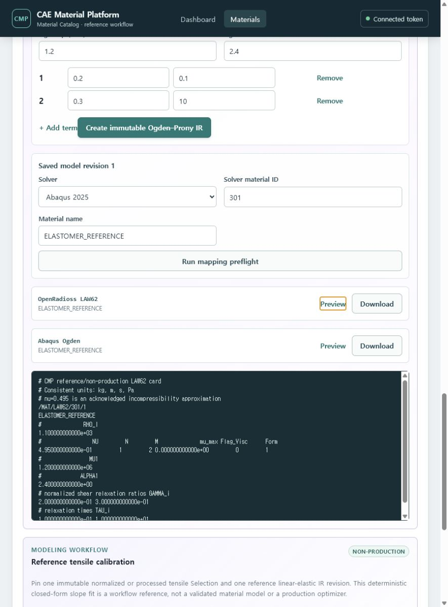
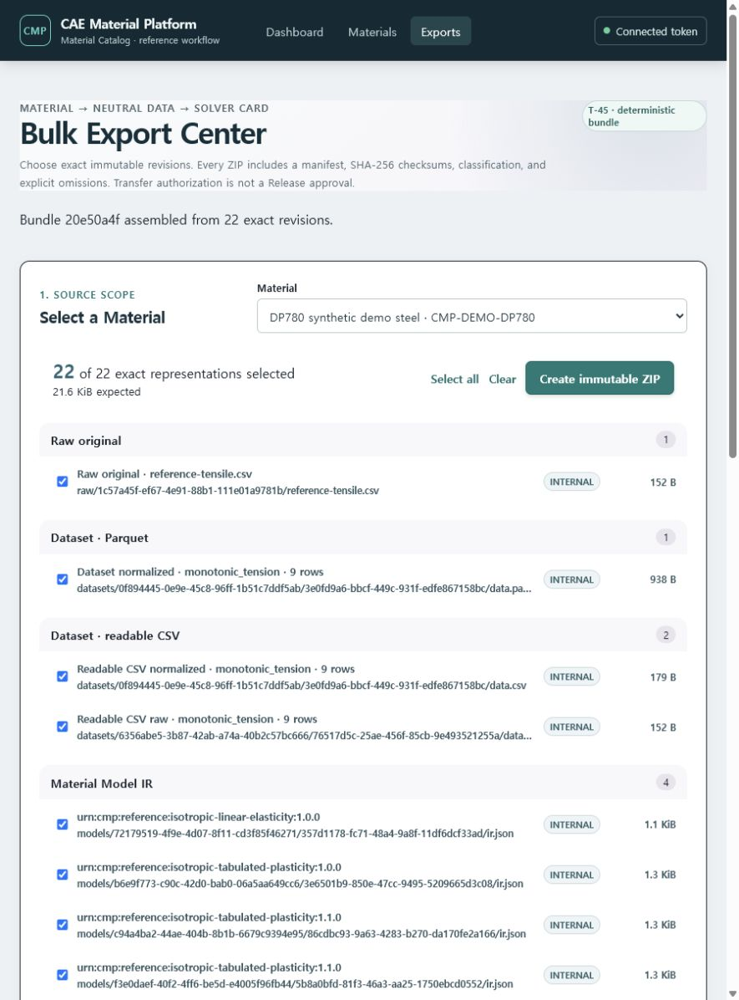
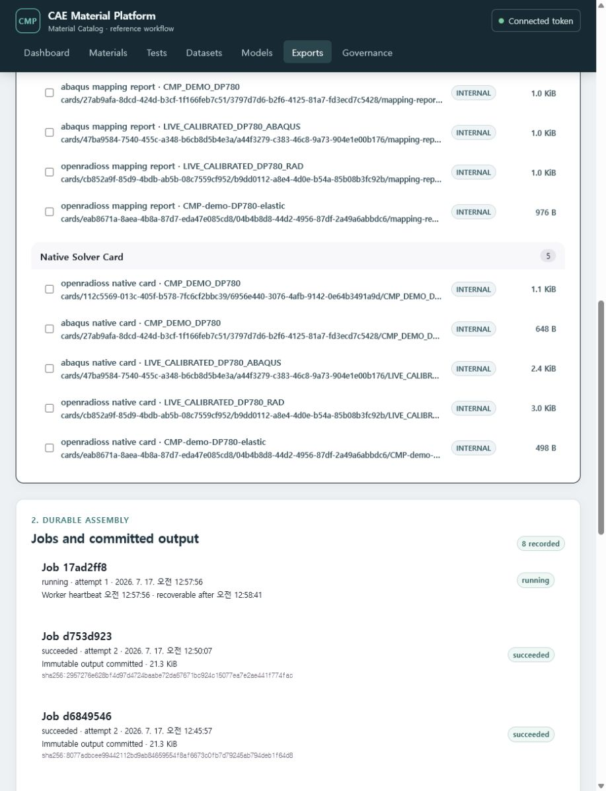
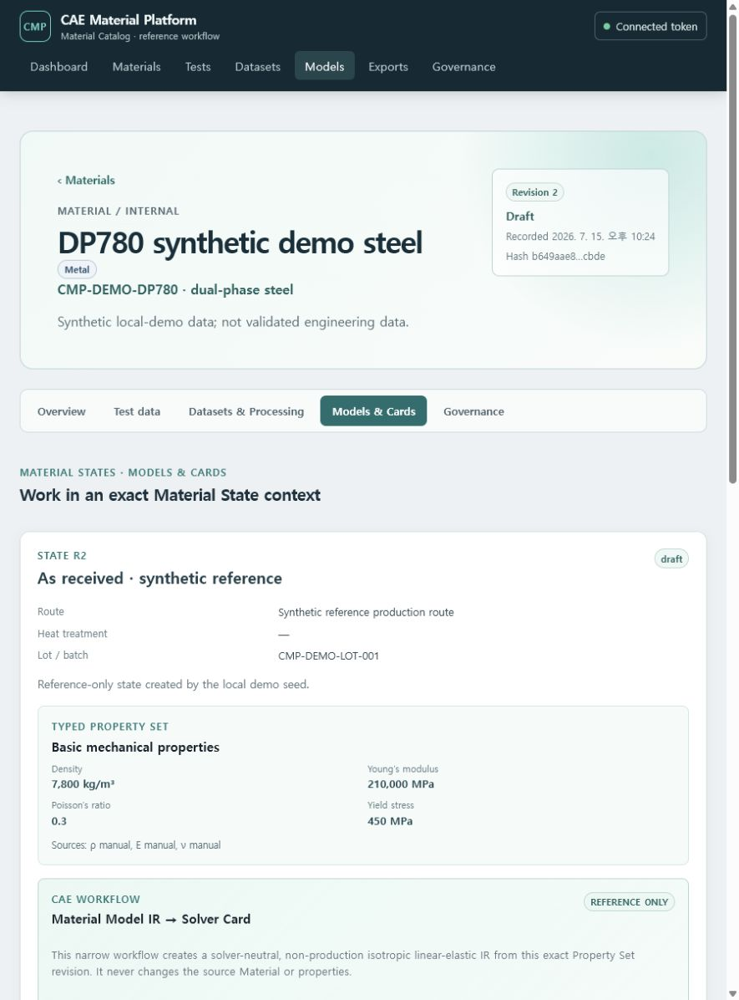

# 사용자 E2E 검증 기록: 시험 데이터에서 Abaqus 카드까지

검증일: 2026-07-16

환경: Docker Compose demo, PostgreSQL 16, protected demo JWT, React workbench

범위: reference/non-production polymer shear-relaxation vertical

## 결과

새 Material을 만든 뒤 원본 시험 CSV 등록부터 처리, 물성 보정, 사람의 후보 선택, 새 IR
revision 승격, Abaqus 카드 preview와 실제 다운로드까지 한 흐름으로 완료했다. 원본 Raw
Asset, normalized Dataset, processed Dataset, baseline IR 또는 승격 전 revision을 수정하거나
덮어쓰지 않았다.

| 단계 | 검증 결과 | 고정된 식별자/증거 |
| --- | --- | --- |
| Material/State/Property | polymer Material, 23 C State, density 1200 kg/m3, E 3 GPa, nu 0.35 | Material `31ac1602-23ba-4255-9889-e41546b342e2`; State `62c1896e-8879-4c6d-abca-5c3156b2ddb6`; Property revision `fccf6b9e-a079-4175-9400-99fde3bbc69d` |
| 시험 등록 | Specimen과 shear-relaxation Test Run이 exact State/Method revision을 고정 | Test Run revision `53ee9f77-51e0-476b-873c-8e9a27ad07d8` |
| 원본/정규화 | CSV가 immutable Raw Asset으로 완료되고 `s`, `Pa` normalized Dataset을 별도 생성 | Raw Asset `6f300800-8705-4274-938a-c8f76bc8c8ea`; normalized revision `d55187c1-7f1a-4999-a136-4fb918967585`; 6 points |
| 명시적 processing | inclusive observed-point crop, no interpolation, `0.01 s`~`100 s` | Run `636638a7-3405-43db-9fc9-86a94da7a3ef`; processed revision `5a9095e1-082f-42f6-b127-f3285ae138ee`; 5 points |
| bounded calibration | PCG64/SciPy TRF, 5 deterministic starts, 5 converged Candidates | Run `8e24f5e0-0d6c-4379-9261-5e4136d74673`; selected Candidate `88737faa-a473-4d17-a40c-ed2dbf71655f`; objective `0.0010759323648068953`; RMSE `28,537,224.93 Pa` |
| 사람 선택/IR 승격 | 선택 이유와 Candidate/diagnostics digest를 고정하고 같은 model identity에 새 revision 추가 | Selection revision `bbe298e4-5ed5-4ebc-aeba-8c96aace314d`; baseline IR `06cdbf61-cb77-47ba-9d6b-028e755bc483`; promoted IR `d800d363-493e-4ff9-b4f0-52d9cba0052b` |
| Abaqus mapping/card | preflight exportable, exact report digest acknowledgement 후 immutable card 생성 | mapping SHA-256 `0b8fa4a4b44e567fdd8baf333ec42ade51db3aac604a509fac1d93da1da23705`; card `326ef8b1-a112-4d5e-80a1-19f3ae7d87d2` |
| 다운로드 무결성 | HTTP 200, attachment filename, 418 bytes; preview에 `*DENSITY`, `*ELASTIC`, `*VISCOELASTIC` 존재 | stored/download SHA-256 `625b21ded4fc67f6459a3f27d422acf636df9b3d356e58f250bb3ee987561264` 일치 |

## 사용자 화면

### Material과 immutable revision


### 시험 등록과 shear-relaxation 처리



### processed curve와 multistart Candidates



### fitted response와 residual evidence


### 승격 IR에서 생성한 Abaqus card



### exact Process/Lot genealogy

State Genealogy `2152a876-9d18-4e88-ab2b-7cc00c78e030`의 revision
`6ea7e719-7a6e-4fb7-89ce-c185fb0a3d67`은 제조 Process revision
`52218f2e-3aa8-4b43-8fd4-ba1fada8d841`, 열처리 Process revision
`c37a7e05-af56-438c-b5c8-8d60b6b02cf6`, Lot revision
`29b76af2-7d13-40ce-b827-f1c254c292f5`를 명시적으로 고정한다.



### 별도 Ogden--Prony/OpenRadioss LAW62 vertical

선형 Prony 모델을 LAW62로 재사용하지 않는다. 별도 elastomer Ogden--Prony IR의 LAW62
preview에서 고정 `nu=0.495` incompressibility 근사를 명시한다.



### Governed multi-test Ogden fitting

T-43 공개 합성 fixture로 uniaxial, planar, biaxial calibration curve 3개와 별도 uniaxial
holdout 1개를 등록했다. 네 원본은 각각 immutable Raw Asset과 normalized Dataset revision으로
보존된다. Plan은 exact scientific Profile, Material State, baseline Ogden--Prony IR과 네
Dataset revision을 고정한다. PCG64/SciPy TRF 8-start Run은 `mu=2.0000 MPa`, `alpha=2.00000`을
회복했고 Jacobian rank `2/2`, estimated covariance와 95% CI를 기록했다. 1% stress scale을
적용한 holdout RMSE는 `0.0087561 MPa`이며 calibration과 섞이지 않았다.


Candidate diagnostics는 52개 observed/fitted/residual point를 exact Parquet Artifact로
보존한다. 같은 화면에서 별도 manual baseline IR의 Abaqus/OpenRadioss card preview와 download
진입점도 확인했다. Candidate를 baseline IR에 append-only promotion하는 단계는 T-44 범위다.


### Human Selection and iterative Ogden promotion

T-44 migration 055 적용 후 같은 Ogden--Prony stable identity에 두 개의 독립적인 succeeded
Run과 converged Candidate를 차례로 human Selection으로 기록했다. 각 promotion은 실행 시점의
strong current IR ETag를 요구했으며 r1→r2→r3을 append했다. r2와 r3은 각각 자신의 Selection,
Run, Candidate, diagnostics digest와 정확한 prior revision을 소유한다.


r2 승격 전에 존재한 Abaqus/OpenRadioss 카드 2개와 r2에서 추가한 Abaqus 카드 1개의 stable ID,
revision ID 및 card SHA를 r3 승격 후 재조회해 모두 동일함을 확인했다. 화면에는 current model이
r3이어도 이전 concrete IR revision에 고정된 카드 3개가 그대로 남는다.


### Exact-revision Bulk Export Bundle

T-45 migration 056 적용 후 DP780 Material에서 원본 CSV, canonical Parquet/readable CSV,
solver-neutral IR/schema, Abaqus/OpenRadioss mapping report와 native card를 exact revision으로
검색했다. 화면에서 22개 representation을 선택하고 immutable Export Selection과 durable Job을
거쳐 deterministic ZIP Bundle을 생성했다.



최신 Bundle은 22개 component, 21.3 KiB이며 별도 `manifest.json`, `checksums.sha256`와 README를
포함한다. 브라우저 Download 동작은 Bundle authorization `201 Created` 뒤 Artifact content
`200 OK`를 받았다. 선택 revision에는 lifecycle/provenance/audit fact가 각각 1건 기록됐다.
Release 또는 기존 source/card revision은 변경되지 않았다.


### External worker assembly and committed-output reconciliation

T-47 migration 057 적용 후 Docker demo의 inline 상한을 16 KiB로 낮춰 같은 DP780 22-component
Selection을 외부 worker 경로로 실행했다. API는 `202 Accepted`와 queued Job
`ff0a4030-44d2-4ab6-8e42-db478e7455fe`를 반환했고, worker는 디스크 기반으로 archive를 조립해
immutable output commit `7842eac7-aa26-4b4e-9492-2d84382b52ae`와 Bundle
`8ba6290e-cb2d-4722-9dc3-7d786d6e8251`를 만들었다. 최종 ZIP은 21,822 bytes이며 저장·API·실제
다운로드의 SHA-256은 모두
`04f6aeca5f0f0ff48448dcb0f3c2e4d3e361b890027869b7f3943562d27097ab`로 일치했다.

회귀 테스트는 output Artifact와 output commit이 만들어진 뒤 Bundle projection이 실패하도록
강제한다. 첫 실행은 `reconciliation_required`와 커밋된 digest/size를 노출하고, 두 번째 claim은
source를 다시 읽거나 archive를 재조립하지 않고 기존 output을 Bundle에 연결한다.


### External worker hard-kill lease recovery

T-47 migration 058 적용 후 두 번째 22-component DP780 Selection으로 worker 소유권 만료를
재현했다. Job `d753d923-e759-40c8-b282-9fa5f9afa7bc`를 attempt 1 `running` 상태와 15초 lease로
claim한 직후 다른 worker를 한 번 실행했을 때 결과는 `idle`이었고, 원래 worker가 종료된 것으로
간주해 deadline을 넘긴 뒤 다시 실행하자 새 fencing token으로 attempt 2를 claim했다. 최종 상태는
`succeeded`, Bundle은 `f23a24ad-6a97-416b-8155-c0061f64871d`이며 heartbeat와 expiry 필드는
terminal transition에서 모두 비워졌다.

별도 PostgreSQL integration은 heartbeat가 lease를 연장하는 동안 재선점을 막고, 만료된 token의
heartbeat 부활과 fail/output finalization을 거부하는지 확인한다. API에는 opaque lease token을
노출하지 않고 heartbeat와 복구 가능 시각만 제공한다.



### Global module navigation and Material context tabs

T-46은 Dashboard/Materials/Tests/Datasets/Models/Exports/Governance 전역 메뉴를 제공한다.
Tests, Datasets, Models와 Governance 허브는 현재 tenant/project에서 보이는 Material을 실제
Catalog API로 읽고, 선택한 stable identity의 문맥 경로로 이동한다.


기존 `/materials/{material_id}` deep link는 Overview로 유지하면서 `/testing`, `/datasets`,
`/models`, `/governance` 경로를 추가했다. DP780 `/models` 경로에서 exact State와 Property Set,
IR/Card workbench만 로드되고 Dataset/Test/Governance workbench는 다른 탭으로 분리됨을 확인했다.
Governance 전역 허브에는 실제 Review, Release와 Lineage/Audit 작업대가 연결됐다.



### 10,000-Material search and 2-GiB streaming acceptance

격리 PostgreSQL demo에 기존 4개 Material은 그대로 두고 deterministic synthetic Material identity와
immutable r1 revision 9,996개를 append했다. Catalog API는 동일한 RLS-filtered current-head query에서
bounded page 100개와 `total_count=10000`을 함께 반환했다. Dashboard도 page 길이가 아니라 이 권한
범위 전체 개수를 표시한다.


같은 구성의 실제 multipart API에 deterministic 2,147,483,648 bytes를 32개 64-MiB part로 전송했다.
89.048012초, 22.999 MiB/s였고 terminal Raw Asset의 SHA-256과 size가 preflight 값과 일치했다. source
generator의 최대 chunk는 67,108,864 bytes, peak incremental Python allocation은 67,164,359 bytes로
192-MiB gate 이하였다. Catalog 30회 측정 p95/p99는 182.128/187.088 ms였다. canonical report는
`production_scale_accepted=true`, source commit
`b506f6415f49774fb32692cf680ed56c866e9902`, SHA-256
`96d75ca787695ad5848b0b65562554a93f8aa63dd204b82d92e159f723cef481`를 기록했다.

이 검증은 10,000-Material search와 2-GiB object streaming만 닫는다. 장시간 mixed-workload soak와
API/worker/PostgreSQL/object-storage fault injection은 다음 T-47 gate다.

### Five-minute mixed-workload Compose fault drill

같은 10,000-Material 구성에서 Catalog, Bundle-list, health를 3개 thread로 실행하고 PostgreSQL
pause/unpause와 API/worker/web stop/start를 순서대로 주입했다. 첫 run은 모든 서비스와 불변성은
복구했지만 단일 성공 응답 직후 장애 창을 닫아 in-flight 요청 3개를 ordinary failure로 잘못
분류했으므로 실패 report로 보존했다. 복구 조건을 모든 관련 probe의 연속 2초 안정으로 강화하고
60초 diagnostic을 통과한 뒤 300초 final run을 실행했다.

Final run은 373.361256초, 3,243 samples, fault-window failure 102건, ordinary failure 0건이었다.
Catalog/Bundle-list/health p95는 223.419/45.849/23.423 ms였다. PostgreSQL/API/worker/web 복구는
2.809797/8.362320/3.200068/2.665459초였다. 네 서비스 memory growth gate가 통과했고 Catalog는
10,000, Bundle `8ba6290e-cb2d-4722-9dc3-7d786d6e8251`는 21,822 bytes와 SHA-256
`04f6aeca5f0f0ff48448dcb0f3c2e4d3e361b890027869b7f3943562d27097ab`를 유지했다. Report SHA-256은
`d68253e7ce75528a0f807b945f98019e37f55052b2f8457d54076ff6e85f535c`이다.

GUI 변경은 없으므로 새 화면 캡처는 만들지 않았다. 이 드릴은 local shared-volume composition
범위이며 독립 production object-storage failover나 overnight endurance를 주장하지 않는다.
전체 CI-equivalent gate는 Python/PostgreSQL 672개와 Vitest 41개, ruff, mypy 547 source files,
architecture/contract/OpenAPI, 13-document/24-capture user-guide, production bundle budget와 npm
audit 0건을 모두 통과했다.

## 불변성 negative check

bounded linear-Prony의 최초 `r1 -> r2` 승격은 성공했다. 이후 이미 promotion evidence가 있는 `r2`를 새
Calibration baseline으로 사용해 다른 evidence로 다시 승격하려는 시도는
`a promoted linear-Prony revision cannot silently replace its evidence`로 거부됐다. 이는 이전
승격 증거의 silent replacement를 막는 현재 계약에 부합한다.

T-44는 같은 stable identity에 `r3+`를 추가하고 revision마다 promotion evidence를 소유하게
하는 결정을 governed Ogden Candidate 경로에 구현했다. 이 결정은 다음과 같다.

- 같은 stable identity에 `r3+`를 추가한다.
- 과거와 새 promotion evidence를 revision chain으로 보존한다.
- 기존 bounded linear-Prony 경로는 별도 migration 전까지 원래 single-promotion guard를 유지한다.

따라서 Ogden 경로의 반복 승격과 linear-Prony 경로의 안전한 거부는 서로 다른 명시적 bounded
계약이며 어느 쪽도 이전 evidence를 덮어쓰지 않는다.

## 검증 명령과 회귀 상태

T-43 branch의 최신 CI-equivalent 회귀는 disposable PostgreSQL 16 DSN을 사용해 Python
`600 passed, 0 skipped, 0 failed`, frontend `20 files / 35 tests`를 기록했다. ruff,
mypy(512 source files), architecture, contract lint, OpenAPI compatibility와 production build가
통과했고 npm audit는 취약점 0건이었다. Migration 054는 별도 임시 DB에서
`001→054→053→054` 왕복을 완료했다. Windows PowerShell에서는 Git Bash로 `scripts/ci.sh`를
실행해 `make ci`와 동일한 순서를 검증했다.

T-45 branch의 최신 CI-equivalent 회귀는 PostgreSQL 16 DSN을 사용해 Python
`613 passed, 0 skipped, 0 failed`, frontend `21 files / 36 tests`를 기록했다. Ruff,
mypy(526 source files), architecture, contract lint, OpenAPI compatibility, production build와
npm audit가 통과했다. Migration 056은 별도 임시 DB에서 `001→056→055→056` 왕복을 완료했다.

T-47 production-scale branch의 CI-equivalent 회귀는 PostgreSQL 16 DSN을 사용해 Python
`661 passed, 0 skipped, 0 failed`, frontend `22 files / 41 tests`를 기록했다. Ruff,
mypy(545 source files), architecture, contract lint, OpenAPI compatibility, 13-document/24-capture
user-guide gate, production build/bundle budget와 npm audit가 모두 통과했다.

다운로드 무결성은 아래 계약으로 확인했다.

```text
GET /api/v1/linear-viscoelastic-solver-cards/{card_id}/download
HTTP/1.1 200 OK
Content-Disposition: attachment; filename="E2E_POLYMER_20260716-000336-326ef8b1.inp"
SHA-256(downloaded bytes) == solver_card_revision.card_sha256
```

## 다음 우선순위

The implementation gaps previously listed here are now closed in code: governed S3 Object
Lock/SSE-KMS, external signing, signed REST/webhook/object-storage delivery, and rotating
worker/receiver token-file boundaries are implemented. The composed pilot's final automated gate
is `make product-pilot-acceptance`. It verifies the three exact live Material workflows, downloads
and hashes the required Abaqus/OpenRadioss cards, validates every component in the 22-component ZIP,
and cross-checks the same stable identities in PostgreSQL.

The clean-tree run on source commit `a401b34ccc2ff4df0fd577f70c29b9e8a839bf41` passed on
2026-07-17 KST and produced canonical report SHA-256
`d0ca507324e9b94b558d52b0c3fbf5d7e9c5fb947a67cc98adbf388155466f4e`.
PostgreSQL 16.14 matched all three Material identities, six Material Model identities and the exact
Bundle row in a read-only transaction. The gate verified 5 Steel Test Runs and 11 typed Datasets,
39 accumulated Polymer Test Runs and 40 immutable relaxation Dataset identities, and 21 accumulated
Elastomer Test Runs. Required cards were Abaqus/OpenRadioss for Steel, Abaqus for Polymer, and
Abaqus/OpenRadioss for Elastomer. Bundle `f23a24ad-6a97-416b-8155-c0061f64871d` contained 22
components, zero omissions and 21,819 bytes; archive SHA-256 was
`2957276e628bf4d97d4724baabe72da67671bc924c15077ea7e2ae441f774fac`.
The final CI-equivalent rerun passed 695 Python/PostgreSQL tests and 41 frontend tests with zero
skips or failures, plus ruff, mypy over 557 source files, architecture/contracts/OpenAPI,
13-document/24-capture user-guide validation, production bundle budget and npm audit with zero
vulnerabilities.

Remaining release-environment acceptance requires supplied external infrastructure and credentials:

1. run the governed storage gate against the approved live WORM/KMS bucket;
2. run signing and connector acceptance against the approved HSM/keyless signer and receiver;
3. run independent object-storage outage and overnight endurance acceptance.

실제 solver 실행과 solver qualification은 제품 소유자 지시에 따라 이 우선순위에서 제외한다.
