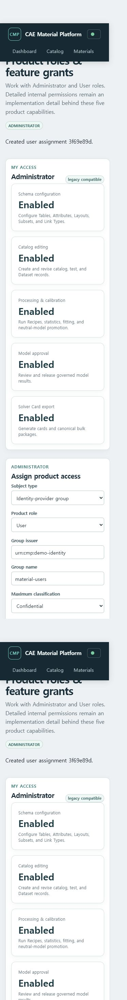

# CAE Material Platform 관리자 가이드

이 문서는 개발 설정이 아니라 서비스 관리자가 Material Information System의 구조와 사용자
권한을 구성하는 방법을 설명합니다. 관리자는 Table과 항목을 추가하고, 레코드 사이의 링크
규칙을 정하고, 사용자에게 필요한 제품 기능만 부여합니다.

## 1. 관리자 작업 영역

| 화면 | 주소 | 관리 대상 |
| --- | --- | --- |
| Catalog schema designer | `/catalog/schema` | Table, Attribute, Layout, Subset |
| Catalog Explorer | `/catalog/explorer` | Folder, Record, Link Type, exact-revision link |
| Product access | `/access` | Administrator/User와 기능 권한 |

Docker demo에서는 **Connected token → Use local demo identity → Save connection**으로
Administrator 계정을 사용할 수 있습니다. 운영 환경에서는 회사 OIDC의 issuer, subject,
group claim을 사용합니다.

## 2. Table과 Attribute 구성

1. **Catalog schema designer**에서 stable key, 표시 이름, 설명과 classification을 입력해
   Table revision 1을 만듭니다.
2. Table을 선택하고 Attribute stable key, 표시 이름과 data type을 정의합니다.
3. `number`에는 quantity semantics와 정규화 단위를 함께 지정합니다.
4. `discrete`에는 허용값을, `record_reference`에는 대상 Table을 지정합니다.
5. Attribute를 Layout에 원하는 순서로 배치하고, 자주 쓰는 검색 조건은 Subset으로
   저장합니다.

지원 data type은 `number`, `integer`, `text`, `boolean`, `date`, `discrete`, `file`, `curve`,
`record_reference`입니다. Attribute 추가에는 DB migration이 필요하지 않지만, 정의 자체는
revision으로 보존됩니다. 수치값은 원본 값·원본 단위 문자열·정규화 값·정규화 단위·quantity
semantics를 함께 저장합니다.

## 3. Folder와 Record 운영

**Catalog records** 또는 **Catalog Explorer**에서 Table을 선택한 뒤 Folder와 Record를
생성합니다. Folder parent는 exact revision으로 고정되며 cycle이나 다른 Table 연결은 서버와
PostgreSQL이 모두 거부합니다. Record를 수정할 때는 현재 ETag가 필요하고, 성공하면 기존 행을
덮어쓰지 않고 새 Record revision이 생깁니다.

Layout은 입력 순서만 정의하며 값을 복제하지 않습니다. Subset을 수정할 때도 기존 검색 조건을
바꾸지 않고 새 revision을 추가합니다.

## 4. Link Type과 관련 데이터 이동

Catalog Explorer의 **Define Link Type**에서 다음을 지정합니다.

- stable key와 이름
- source/target Table
- 정방향·역방향 표시 이름
- outgoing/incoming cardinality

Record link의 양 끝은 항상 exact Record revision입니다. `latest` 별칭, 다른 scope의 endpoint,
허용하지 않은 Table 조합과 cardinality 위반은 거부됩니다. 링크를 종료할 때는 삭제하지 않고
Deactivate를 사용합니다. 사용자는 Related records 패널과 Workflow Explorer에서 링크를 따라
시험, Dataset, Processing Run, Neutral IR, Solver Card로 이동할 수 있습니다.

## 5. Administrator/User 권한

[Product access](http://127.0.0.1:5173/access)는 내부 역할 이름 대신 다음 두 역할만 표시합니다.

- `Administrator`: 사용자 관리와 다섯 제품 기능을 모두 사용
- `User`: 지정된 기능만 사용

User에게 부여할 수 있는 기능은 다음과 같습니다.

1. Schema configuration
2. Catalog editing
3. Processing & calibration
4. Model approval
5. Solver Card export

대상은 identity-provider group 또는 principal UUID로 지정합니다. project 범위가 기본이며,
필요한 경우 organization-wide로 지정할 수 있습니다. 최대 classification도 함께 설정합니다.
운영 환경에서 export-controlled 접근은 별도 승인을 거쳐야 하며 단순 기능 체크로 자동 부여하지
않습니다.

권한 변경은 기존 assignment를 수정하는 방식이 아닙니다. 기존 assignment를 **Revoke**하고 새
assignment를 추가합니다. 부여·회수 이력은 남으며 일반 User가 assignment 목록이나 생성 API를
호출하면 403으로 거부됩니다.

## 6. 기존 역할과 호환성

T-59 이전의 상세 role binding은 제거하지 않습니다. 서버가 기존 role들의 permission 합계를
Administrator/User와 기능 권한으로 투영하므로 기존 토큰과 RLS 정책이 계속 동작합니다. 화면의
`legacy compatible` 표시는 이 호환 경로가 사용됐다는 의미입니다.

## 7. 운영 점검

- 사용자가 예상한 organization/project를 선택했는지 확인합니다.
- OIDC issuer와 group name은 대소문자까지 정확히 일치시킵니다.
- 필요한 최소 classification과 기능만 부여합니다.
- 권한 변경 뒤 새 토큰을 발급받고 `/access`에서 실제 effective access를 확인합니다.
- schema, catalog, processing, approval, export 각각 허용/거부 API를 점검합니다.
- 기존 데이터를 지우거나 role table을 직접 수정하지 않습니다.
