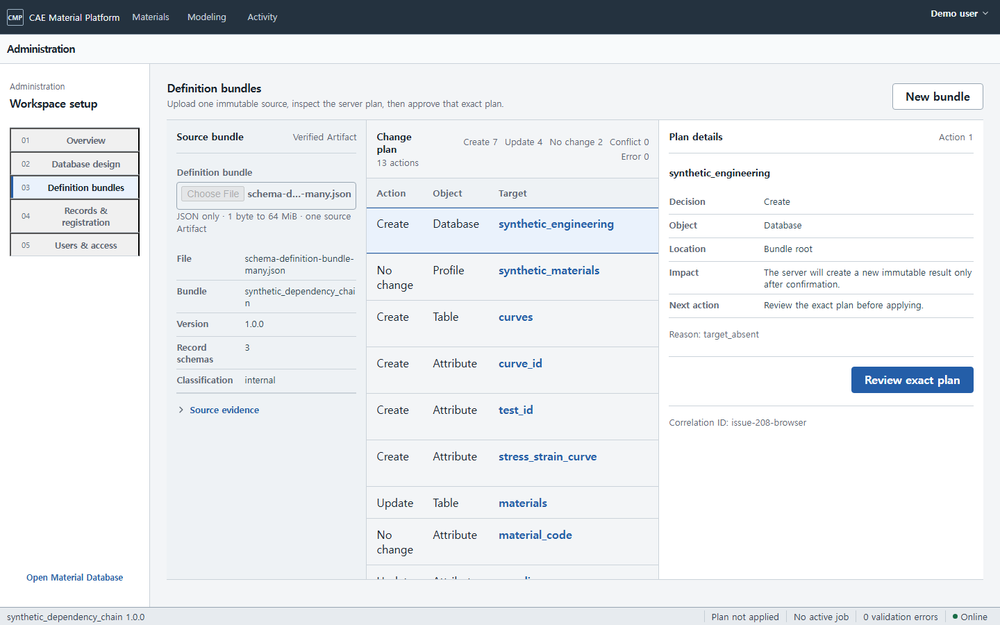

# CAE Material Platform 관리자 가이드

이 문서는 개발 설정이 아니라 서비스 관리자가 Material Information System의 구조와 사용자
권한을 구성하는 방법을 설명합니다. 관리자는 Database/Profile과 Table 항목을 추가하거나 하나의
Schema Definition Bundle로 계획·적용하고, 레코드 사이의 링크 규칙과 제품 접근 권한을 관리합니다.

## 1. 관리자 작업 영역

| 화면 | 주소 | 관리 대상 |
| --- | --- | --- |
| Administration overview | `/administration` | 관리자 작업 선택과 제품 권한 원칙 |
| Database design | `/administration/database` | Database, Profile, Table, Attribute, Layout, Subset, Link Type, Publish |
| Definition bundles | `/administration/schema-bundles` | canonical JSON 또는 source-set/ZIP 업로드, 변경 계획 검토, 명시적 적용, read-back과 export |
| Users & access | `/administration/access` | User/Reviewer/Administrator 업무 역할과 assignment 관리 |
| Materials browse alias | `/database` | 기존 Materials Browse Tree와 exact-revision link 탐색(별도 관리 화면 아님) |

Docker demo는 **Demo user** Administrator session을 자동으로 준비합니다. 사용자는 API 주소나
token을 입력하지 않습니다. 운영 환경의 회사 identity directory 연결은 배포 설정이며 일반
Administration 화면에 issuer, subject 또는 token을 노출하지 않습니다.

Administration은 일반 사용자 메뉴에 상시 노출되지 않습니다. 우측 workspace menu에서 열며,
왼쪽 220 px 관리 목록과 하나의 주 작업면을 사용합니다. Overview의 관리 작업은 card grid가 아닌
divider 목록이고, Database design은 20 px 제목, 340 px Table 열과 나머지 Attribute/Layout 열을
사용합니다. Attribute도 rounded card가 아닌 52 px divider 행으로 표시합니다.

## 2. Database/Profile, Table과 Attribute 구성

1. **Administration → Database design**에서 Database와 Profile의 표시 이름과 설명을 입력합니다. Profile은
   선택한 Database 버전에 고정됩니다.
2. Table을 선택하고 Attribute 표시 이름, 설명과 값 형식을 정의합니다.
3. `number`에는 quantity semantics와 정규화 단위를 함께 지정합니다.
4. `discrete`에는 허용값을, `record_reference`에는 대상 Table을 지정합니다.
5. Layout에 표시할 Attribute를 선택합니다. 선택한 항목은 현재 Attribute 순서로 배치되며, 자주
   쓰는 검색 조건은 Subset으로 저장합니다.
6. 각 항목에서 **Check**를 눌러 참조·필수·형식·단위 제약을 확인한 뒤 **Publish**합니다. 공개된
   버전은 Materials 검색에 사용되고, 수정은 새 초안으로 시작합니다.

지원 data type은 `number`, `integer`, `text`, `boolean`, `date`, `discrete`, `file`, `curve`,
`record_reference`입니다. Attribute 추가에는 DB migration이 필요하지 않지만, 정의 자체는
revision으로 보존됩니다. 수치값은 원본 값·원본 단위 문자열·정규화 값·정규화 단위·quantity
semantics를 함께 저장합니다.

### 2.1 Schema Definition Bundle 계획·적용·내보내기

여러 JSON Schema 정의를 한꺼번에 준비한 관리자는 **Administration → Definition bundles**에서
서버가 계산한 변경 계획을 먼저 검토한 뒤 정확히 그 계획만 적용할 수 있습니다.

1. canonical bundle JSON 한 개, source-v2 manifest와 그 manifest가 참조하는 JSON 파일들,
   checksummed source-set envelope JSON 한 개 또는 같은 구성을 담은 ZIP 한 개를 준비합니다. 전체
   입력은 1 byte 이상 64 MiB 이하이며 허용된 JSON/ZIP media type과 안전한 상대 경로를 사용해야 합니다.
2. **Choose Files**에서 파일을 고르고 화면의 파일 수, source 종류, bundle/version, record schema 수와
   unit profile 수를 확인한 뒤 **Upload and plan**을 누릅니다. 여러 파일은 경로순으로 정렬되고 각
   content SHA-256을 포함한 source-set envelope 하나가 되어 exact immutable Artifact로 올라갑니다.
3. **Change plan**에서 `Create`, `Update`, `No change`, `Conflict`, `Error` 행을 확인합니다. 행을
   선택하면 오른쪽에 위치, 영향, 다음 조치, diagnostic과 remediation이 표시됩니다. schema 수가
   많아도 같은 표가 안쪽에서 스크롤되며 schema마다 별도 입력 상자를 만들지 않습니다.
4. conflict, error 또는 migration-required 진단이 하나라도 있으면 Apply는 열리지 않습니다. 원본
   Artifact를 고치지 말고 수정한 JSON을 새 파일로 준비해 다시 계획합니다.
5. 유효한 계획이면 **Review exact plan**을 누릅니다. Bundle version, source SHA-256,
   `plan_fingerprint`, create/update/no-change 개수를 대조하고 확인란을 선택한 뒤 **Apply exact plan**을
   실행합니다. 서버는 적용 직전 현재 Catalog를 다시 비교하며 plan의 action을 브라우저에서 받지
   않습니다.
6. 성공 화면에서 적용 결과를 다시 읽었는지 확인하고 **Export verified source**를 사용합니다. 다운로드는
   응답의 ETag, Digest, application과 source Artifact 증거가 모두 일치할 때만 시작됩니다.

새로고침 시 원본 파일 내용이나 token은 브라우저에 저장되지 않습니다. 마지막 application 좌표가 있으면
immutable application을 다시 읽고, 아직 적용 전이면 source Artifact 좌표로 plan을 다시 만듭니다. 적용
직전 상태가 달라져 `stale plan`이 되면 **Plan again**만 사용하십시오. Apply를 그대로 재전송하지 않습니다.
검증된 Artifact, plan 또는 적용 결과가 남아 있는 동안에는 파일 선택이 잠깁니다. 다른 파일로 시작하려면
진행 중인 요청이 끝난 뒤 **New bundle**을 눌러 이전 source와 복구 좌표를 명시적으로 비우십시오.
오류 화면의 **Support reference**는 요청 correlation ID이며 원본 데이터나 credential 없이 이 값만
운영 담당자에게 전달할 수 있습니다. User와 Reviewer는 이 화면과 apply/read-back/export API를 사용할
수 없습니다.

고급 API 자동화에서도 plan 요청에는 immutable Artifact ID와 lowercase SHA-256만 보내고, apply에는
같은 값과 서버가 준 `plan_fingerprint`, `delete_missing=false`, 새 `Idempotency-Key`만 보냅니다.
Plan은 Catalog current pointer, publication, outbox, audit와 provenance를 바꾸지 않습니다. Apply는
필요한 revision과 exact publication, source provenance, audit/outbox를 한 transaction으로 기록합니다.
Bundle에 없는 기존 객체나 Record는 삭제하지 않으며 부분 적용이나 사용자 migration code 실행은
허용하지 않습니다.

## 3. Folder와 Record 운영

**Catalog records** 또는 **Catalog Explorer**에서 Table을 선택한 뒤 Folder와 Record를
생성합니다. Folder parent는 exact revision으로 고정되며 cycle이나 다른 Table 연결은 서버와
PostgreSQL이 모두 거부합니다. Record를 수정할 때는 현재 ETag가 필요하고, 성공하면 기존 행을
덮어쓰지 않고 새 Record revision이 생깁니다.

한 건은 datasheet의 **Single entry**에서 입력하고, 여러 건은 **Multiple rows**에서 CSV/TSV/XLSX
행을 미리 확인합니다. 원본 열과 Attribute, 원본 단위, 기존 재료와 상태를 직접 연결해야 하며,
행 오류가 남아 있으면 등록 버튼이 잠깁니다. 이미 데이터가 연결된 재료 상태는 새로 등록하지 말고
검색 결과에서 기존 데이터를 열어 수정합니다. 여러 행은 전체가 검사를 통과할 때 한 번에 등록됩니다.

Layout은 입력 순서만 정의하며 값을 복제하지 않습니다. Subset을 수정할 때도 기존 검색 조건을
바꾸지 않고 새 revision을 추가합니다.

## 4. Link Type과 관련 데이터 이동

**Administration → Database design → Link Types**에서 다음을 지정합니다.

- stable key와 이름
- source/target Table
- 정방향·역방향 표시 이름
- outgoing/incoming cardinality

Record link의 양 끝은 항상 exact Record revision입니다. `latest` 별칭, 다른 scope의 endpoint,
허용하지 않은 Table 조합과 cardinality 위반은 거부됩니다. 링크를 종료할 때는 삭제하지 않고
Deactivate를 사용합니다. 사용자는 Materials의 Related exact records와 Evidence의 Workflow에서
링크를 따라 시험, Dataset, Processing Run, Neutral IR, Solver Card로 이동할 수 있습니다.

## 5. 제품 역할과 업무 preset

[Users & access](http://127.0.0.1:5173/administration/access)는 내부 역할 이름이나 기능
체크박스 대신 세 가지 업무 역할을 표시합니다.

- `User`: 재료 검색·조회·다운로드, 업로드·검토 요청, 처리·보정과 Solver Card 요청
- `Reviewer`: User 업무와 재료·Solver Card 변경 요청, 승인, publish
- `Administrator`: 접근·편집·구성·review request·정확한 Activity 복구와 역할 관리. 승인 결정은
  분리된 Reviewer가 기록합니다.

새 역할을 부여하면 역할에 맞는 작업 묶음이 함께 적용됩니다. User에는 Processing &
calibration과 Solver Card export가, Reviewer에는 여기에 Model approval이 추가됩니다.
Administrator에는 Schema configuration과 Catalog editing을 포함한 관리 작업이 적용됩니다.
Model approval/release publish는 Reviewer preset에만 있고 일반 관리 화면에서는 내부 기능을
개별적으로 조합하지 않습니다.

제품 화면에서는 사용자 또는 팀 이름만 선택합니다. identity-provider issuer, principal UUID,
project/organization scope와 classification enforcement는 배포 identity directory 및 내부 정책
확장점에서 처리합니다. export-controlled 접근은 별도 운영 승인을 거치며 단순 기능 체크로 자동
부여하지 않습니다.

권한 변경은 기존 assignment를 수정하는 방식이 아닙니다. 기존 assignment를 **Revoke**하고 새
assignment를 추가합니다. 부여·회수 이력은 남으며 일반 User가 assignment 목록이나 생성 API를
호출하면 403으로 거부됩니다.

## 6. 내부 확장성과 기존 역할 호환성

T-59 이전의 상세 role binding은 제거하지 않습니다. 서버가 기존 role들의 permission 합계를
User/Reviewer/Administrator와 기능 권한으로 투영하므로 기존 enforcement가 계속 동작합니다. 이 내부
호환 정보는 일반 제품 화면에 표시하지 않습니다. 향후 resource/action/scope 단위 권한을 추가해도
Catalog schema나 사용자 작업 흐름을 다시 만들지 않습니다.

## 7. 운영 점검

- 사용자가 예상한 organization/project를 선택했는지 확인합니다.
- 운영 identity directory에서 사용자/팀 이름 mapping을 확인합니다.
- 필요한 최소 classification과 기능만 부여합니다.
- 권한 변경 뒤 새 session에서 `/administration/access`의 실제 effective access를 확인합니다.
- schema, catalog, processing, approval, export 각각 허용/거부 API를 점검합니다.
- 기존 데이터를 지우거나 role table을 직접 수정하지 않습니다.
