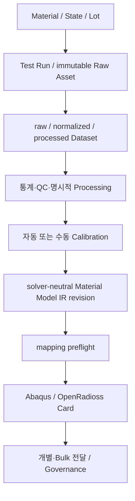

# CAE Material Platform — 기획·설계 기준선

문서 버전: `0.2.0-production-pilot`

기준일: `2026-07-16`

상태: 구현 중인 제품 기준선

## 문서 우선순위와 상태 표기

현재 구현 설명은 `README.md`, `IMPLEMENTATION_STATUS.md`, `docs/user-guide/**`를 따른다.
제품/UI 규칙은 `product-vision`, `desktop-engineering-user-flows`,
`desktop-engineering-ui-product-spec`, `desktop-engineering-ui-spec`,
`visual-acceptance-matrix` 및 desktop UI backlog가 각각 한 책임만 갖는다. 외부 제품에서 확인한
사실은 `docs/00-research/`의 reference이며 제품 요구사항으로 자동 승격되지 않는다. 완료된
evidence는 `docs/17-evidence/`와 implementation history에 보존하고 현재 사용법으로 읽지 않는다.

문장 수준 표기는 `FACT-PUBLIC`, `CONFIRMED`, `DECISION`, `TBD`, `OUT-OF-SCOPE`를 사용한다.
`ASSUMPTION`은 production domain, solver, validation, review policy를 결정하는 근거로 사용하지
않는다. PR #125~#165는 merged scope이며 재구현하지 않는다. `55cfa62` (PR #156)는 승인된 제품/시각
구현 기준선이다. repository 작업 시작점은 항상 `git pull --ff-only origin main`으로 얻는 최신 `main`이다.
다음 product-level work는 #157 demo, #158 Fit, #159 Materials, #160 Governance/Activity, #161 DUI-09,
#162 UXC-99 순서다. incoming package는 #162의 absorption 및 zero-inbound audit 전에는 삭제하지 않는다.

## UXC-00R authority and approval rule

- Current-status documents describe the implemented User, Reviewer, and Administrator task presets.
  Administration and Activity connect those presets to their dedicated workspaces; failed-job and
  server-receipt projections remain follow-up work.
- The historical 2026-07-21 Modeling target was the **lower proposal** in
  `docs/17-evidence/images/ux-layout-review/modeling-reference-comparison.png`: 184–210 px tree,
  shallow graph-adjacent band and dominant plot. The normal path is `Data | Process | Fit | Export`.
- Materials, Administration and Activity current routes implement the approved workspace topology.
  UXC-00D preserves the responsive static prototypes and the product-owner approval from 2026-07-26
  as reference evidence, not as a substitute for current live captures.

## 1. 이 패키지의 목적

이 패키지는 재료시험 원본의 보존부터 통계 분석, 전처리, 구성방정식 보정, solver-neutral Material Model IR, 솔버 카드 생성, 가상 시편 검증, 검토·승인·발행까지를 하나의 추적 가능한 플랫폼으로 구현하기 위한 기준선이다.

이 설계는 Ansys Granta MI, Simcenter Material Data Center, Simcenter Material Modeler의 공개 자료에서 확인되는 **기능 범주**를 참고한다. 해당 제품의 코드, 비공개 데이터 모델, 내부 저장 구조, UI 또는 독점 알고리즘을 재현하지 않는다.

## 2. 문서에서 사용하는 판정 표기

| 표기 | 의미 |
| --- | --- |
| `FACT-PUBLIC` | 공식 공개 자료에서 직접 확인한 경쟁 제품 또는 표준의 사실 |
| `CONFIRMED` | 사용자가 이번 프로젝트에서 확정한 요구사항 |
| `DECISION` | 이 설계 패키지에서 권고하고 기준선으로 채택한 결정 |
| `ASSUMPTION` | 답이 없어서 작업 지속을 위해 채택한 권장 가정 |
| `TBD` | 도메인 또는 사업 결정이 필요한 미결정 사항 |
| `OUT-OF-SCOPE` | 현재 범위에서 의도적으로 제외한 항목 |

경쟁 제품의 내부 구현은 어느 문서에서도 `FACT-PUBLIC`으로 취급하지 않는다.

## 3. 현재 기준선

- `CONFIRMED` 원본 바이트는 수정하지 않는다.
- `CONFIRMED` 원본 단위 표기와 정규화 단위를 모두 보존한다.
- `CONFIRMED` Material, Material State, Manufacturing Process, Lot/Batch, Test Condition, Specimen을 별도 개념으로 관리한다.
- `CONFIRMED` 이상치는 삭제하지 않고 판정, 규칙, 근거, 판정자를 기록한다.
- `CONFIRMED` 모든 계산 실행은 입력 revision, 알고리즘·플러그인·코드 버전, 설정, 실행 환경을 기록한다.
- `CONFIRMED` 솔버 카드보다 앞에 solver-neutral Material Model IR을 둔다.
- `DECISION` 시스템 오브 레코드는 PostgreSQL이며, 대용량 원본·곡선·solver 산출물은 content-addressed 객체 저장소에 둔다.
- `DECISION` provenance는 선형 파이프라인이 아니라 W3C PROV 개념을 축약한 typed relation 기반 DAG로 관리한다.
- `DECISION` 첫 배포는 모듈형 모놀리스로 시작하고, 계산 플러그인 및 솔버 runner만 별도 프로세스/실행 영역으로 격리한다.
- `DECISION` 플러그인은 메인 서비스 프로세스에 직접 import하지 않는다. 메인 서비스는 manifest와 실행 계약만 안다.
- `ASSUMPTION` 첫 운영 대상은 단일 기업용 온프레미스 또는 사설 클라우드다.
- `ASSUMPTION` 초기에는 검토·서명된 내부/파트너 플러그인만 설치한다.
- `ASSUMPTION` 가상 시편 검증은 고객사 라이선스 및 HPC에 연결된 runner를 통해 실행할 수 있고, 수동 결과 반입도 허용한다.
- `DECISION` 첫 reference 범위는 metal 탄소성, polymer 선형 점탄성, elastomer
  Ogden--Prony이며 Abaqus 2025와 OpenRadioss 2025 exporter를 사용한다.
- `CONFIRMED` 이 reference 범위는 실제 solver qualification 또는 production domain 승인을
  뜻하지 않는다.

## 4. 구현된 reference 흐름과 다음 production-pilot 범위

현재 bounded reference 구현은 Material 저장, 시험 CSV 등록, normalized/processed Dataset,
Voce 또는 Prony fitting, 사람의 Candidate 선택, IR 승격, Abaqus/OpenRadioss card preview와
download를 포함한다. 다음 기준선은 Process Run·Campaign·Instrument, CSV/TSV/XLSX importer,
점탄성 반복시험/master curve, iterative calibration과 Bulk Export Bundle이다. 세부 순서는
[production-pilot 실행 계획](13-delivery/production-pilot-execution-plan.md)을 따른다.

## 5. 문서 목록과 읽는 순서

1. [공식 제품 조사](00-research/official-product-research.md)
2. [제품 비전·역할·흐름·범위](01-product/product-vision.md)
3. [기능·비기능 요구사항](02-requirements/requirements.md)
4. [Canonical domain model 및 ERD](03-domain/canonical-domain-model.md)
5. [Revision 및 provenance](04-provenance/revision-and-provenance.md)
6. [시스템 아키텍처 및 기술 스택](05-architecture/system-architecture.md)
7. [Plugin SDK](06-plugins/plugin-sdk.md)
8. [Material Model IR](07-ir/material-model-ir.md)
9. [API·이벤트·비동기 작업 계약](08-contracts/api-events-jobs.md)
10. [산포 분석 및 통계](09-analytics/scatter-statistics.md)
11. [Fitting 및 검증 실행 구조](10-execution/fitting-validation.md)
12. [권한·감사·보안·격리](11-security/security-tenancy-audit.md)
13. [MVP 및 후속 로드맵](12-roadmap/roadmap.md)
14. [Epic·Story·Task 작업명세](13-delivery/backlog.md)
15. [테스트 전략](14-testing/test-strategy.md)
16. [위험·미결정·의사결정 로그](15-governance/risks-open-questions-decisions.md)
17. [Codex 구현용 저장소 구조](16-repository/repository-blueprint.md)
18. [역사적 전달·검증 evidence](17-evidence/documentation-image-audit-2026-07-22.md)

## 6. Production 승인 게이트

reference 구현은 존재하지만 다음 조건 전에는 결과를 production 승인으로 표시하지 않는다.

1. 대표 재료군과 인장시험 표준을 결정한다.
2. 입력 파일 샘플과 필수 메타데이터를 확보한다.
3. 구성방정식과 식별 대상 파라미터, 목적함수, 제약조건을 도메인 전문가가 승인한다.
4. 첫 솔버·버전·카드와 단위 체계를 결정한다.
5. 가상 시편 geometry/mesh/BC/output 및 합격 기준을 결정한다.
6. 최소 1개의 승인된 기준 카드와 검증 결과를 golden reference로 확보한다.

게이트 이전에도 core, synthetic reference plugin, revision/provenance, API, job framework, 보안 및 테스트 기반은 구현할 수 있다.

## 7. 요구사항 추적 규칙

- 요구사항 ID: `FR-*`, `NFR-*`
- 아키텍처 결정: `ADR-*`
- Epic/Story/Task: `E-*`, `S-*`, `T-*`
- 테스트: `UT-*`, `IT-*`, `CT-*`, `GT-*`, `ST-*`
- 미결정 사항: `OQ-*`

모든 PR은 최소 한 개의 요구사항 또는 task ID를 참조한다. 수치 알고리즘, IR schema, exporter 변경은 도메인 리뷰와 회귀 기준 갱신을 함께 요구한다.

