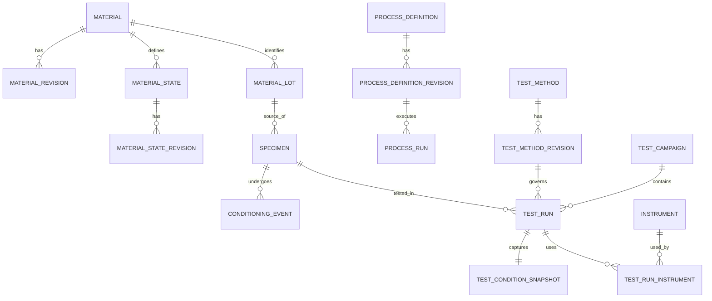
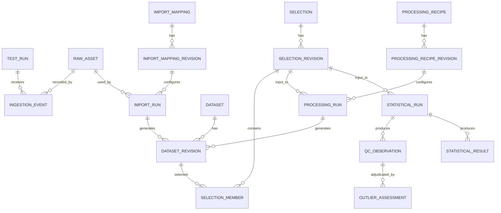
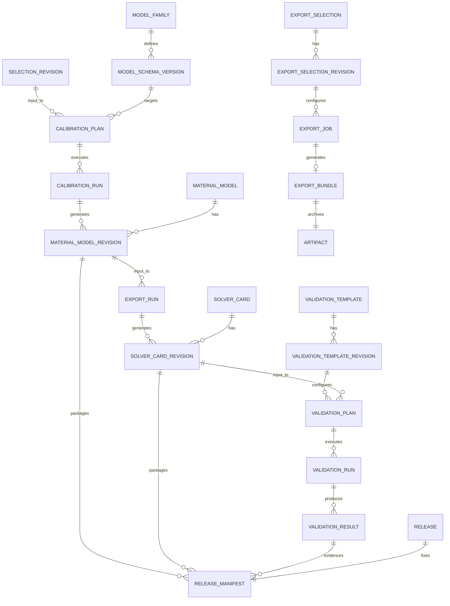

# Canonical Domain Model 및 ERD

## Current accepted target — D0-v3

This canonical model preserves raw/input/output artifacts, units and quantity semantics, actual typed
input/output relations, authorization, scientific validation and release meaning. Only Material
information edits have domain revision history. A Material information revision contains Material
identity fields, associated material-state/manufacturing/heat-treatment values and direct properties
such as density, E, nu and yield/applicability.

State/PropertySet identities and Specimen, TestRun, TestData, Dataset, Selection, Mapping Profile,
Process, Model, Solver Card and Link records are stable-ID saved objects with separate saved data.
Test conditions remain TestRun/TestData data. Renaming an ordinary object preserves links and does not
stale science. Actual computational inputs/options change current eligibility; a saved result retains
the inputs/settings it used and its typed output. Software/schema/file versions, hashes and opaque
concurrency tokens are metadata.

Universal Entity–Activity–Agent provenance, per-edit save reasons, snapshot proliferation and hidden
nonmaterial revision writers are removed from the target. Concrete result/artifact/review/release
contracts may retain the exact evidence, usage and responsible action they require. The older tables
and ERDs in this document remain compatibility descriptions until the real DB/API migration and must
not be treated as instructions to add independent histories.

## 1. 모델링 원칙

1. **Material information identity와 revision 분리**: Material의 안정 ID와 Material information의 immutable content를 분리한다. 다른 saved object는 stable ID와 실제 저장 결과를 사용한다.
2. **물리적 대상과 디지털 표현 분리**: Specimen은 물리적 쿠폰이고 Dataset은 측정 데이터다.
3. **정의와 실행 분리**: Test Method/Process Definition/Recipe/Template과 실제 Run을 구분한다.
4. **문맥과 측정 분리**: Material State와 Test Condition은 다르다.
5. **대형 배열의 외부화**: DB는 식별·관계·schema·digest·summary를 관리하고 point array는 columnar object로 저장한다.
6. **확장 metadata의 schema 강제**: JSONB를 자유 메모장처럼 쓰지 않고 plugin JSON Schema와 schema version으로 검증한다.
7. **관계와 결과를 구분**: typed link는 양방향 탐색을 제공하지만 traversal을 derivation으로 추정하지 않는다. concrete result/artifact에 필요한 input/output evidence만 저장한다.

## 2. 핵심 용어의 정확한 구분

### 2.1 Material

조성, grade, formulation 또는 조직이 동일 재료로 관리하는 개념적 identity다. 공급 lot이나 시험 상태가 아니다.

예: 특정 강종 grade, 특정 polymer formulation. 이름·분류·명목 조성 같은 Material information의 변경은 `MaterialInformationRevision`이다.

### 2.2 Material State

동일 Material의 물성에 영향을 주는 상태 정의다. 열처리 상태, temper, aging, 수분 상태, 결정화 상태, irradiation history 같은 **재료 자체의 상태**를 표현하며 stable State identity로 저장한다. 필요한 Material information revision은 Material history에 함께 포함한다.

시험 중 온도, crosshead speed, chamber humidity 같은 값은 `TestConditionSnapshot`이다. 시험 전에 정해진 시간 동안 conditioning한 이력은 `SpecimenConditioningEvent`이고, 그 결과를 Material State assignment로 연결할 수 있다.

### 2.3 Manufacturing Process, Process Run

- `ManufacturingProcessDefinition`: 공정의 의도·recipe·허용범위
- `ProcessRun`: 실제 시각, 설비, operator, 측정된 parameter로 수행된 실행

공정명 하나를 Material State에 문자열로 넣지 않는다.

### 2.4 Lot과 Batch

- `MaterialLot`: 공급자/생산자가 동일 생산 단위로 식별한 추적 단위
- `MaterialBatch`: 플랫폼 사용 조직이 실제로 함께 혼합·성형·열처리·가공한 물질 묶음이라는
  후속 도메인 개념

MaterialBatch를 구현할 때에는 여러 input lot의 소비, 한 lot의 여러 batch 분할과 material balance를
명시적으로 모델링해야 한다. 조직 용어가 다르면 UI label을 바꿀 수 있지만 canonical 의미는 유지한다.

현재 v1 bounded 구현은 `ProcessDefinition`, `MaterialLot(kind=lot|batch)`,
`StateGenealogy`와 관련 nonmaterial revision structures를 legacy compatibility shape으로
보존한다. Accepted target에서는 이들을 stable saved objects와 typed links로 분리하며, 실제
DB/API migration과 read-back 전에는 그 target을 현재 구현으로 간주하지 않는다. Target의
`StateGenealogy`는 필요한 Material information input과 선택된 manufacturing/heat-treatment
Process 및 Material Lot IDs를 실제 관계 데이터로 보존한다. 기존 State의 문자열 descriptor는 과거
입력 보존용이며 governed link를 대신하지 않는다. 별도 physical `MaterialBatch` resource와
split/merge, multi-lot material balance는 현재 구현되지 않았고 후속 범위로 남는다(ADR-0024).

### 2.5 Specimen

시험에 사용되는 물리적 개체다. source lot/batch, 채취 위치, orientation, nominal/actual geometry, preparation, conditioning을 갖는다. 하나의 specimen에 여러 비파괴 test run이 있을 수 있으나 파괴시험 재사용은 method policy로 경고한다.

### 2.6 Test Method, Campaign, Run, Condition

- `TestMethodDefinition`: 표준/사내 method, required channels, metadata schema, QC profile
- `TestCampaign`: 시험 목적, population, 계획
- `TestRun`: 한 specimen에 수행된 실제 시험 사건
- `TestConditionSnapshot`: 시험 시점의 설정값과 관측값

Method의 default가 바뀌어도 과거 TestRun은 당시 사용한 method data와 condition snapshot을 유지한다.

### 2.7 Configurable catalog와 계산 구성

- **Catalog Table**: 관리자가 정의하는 record 종류의 stable identity
- **Attribute Definition**: 데이터형, quantity/unit, validation과 표시 규칙의 saved definition
- **Catalog Record**: 자유 schema record의 stable identity와 saved content
- **Layout / Subset**: record datasheet와 저장된 typed filter/search 정의
- **Link Type**: 허용 source/target Table, 방향명과 cardinality
- **Record Link**: 두 stable saved object 사이의 사용자 정의 관계
- **Mapping Profile**: Attribute/채널을 계산 quantity에 연결하는 saved 계약
- **Processing Recipe**: ordered method/version/options와 compatibility 계약을 가진 saved object
- **Processing Batch**: exact input Selection과 Recipe를 여러 member Run으로 실행한 집합

고정 Material/State/Property aggregate는 기존 API와 solver workflow의 호환 projection으로
유지한다. 새 configurable record가 기존 identity를 복제하지 않도록 record reference가 기존
saved object를 가리킬 수 있으며, Workflow Explorer는 이 관계를 읽기 전용 tree projection으로
표현한다.

## 3. Aggregate와 entity 목록 — accepted target (not current v1 implementation)

### 3.1 재료·공정·시편

| Aggregate | 안정 identity | 저장 데이터/관계 | 불변조건 |
| --- | --- | --- | --- |
| Material | `material` | `material_information_revision` | Material information content update는 새 revision; 기존 content 수정 금지 |
| Material State | `material_state` | state data + Material information association | stable identity; 독립 revision history 없음 |
| Process Definition | `process_definition` | saved definition data | plugin schema version은 metadata |
| Process Run | `process_run` | run facts + typed input/output relation | 완료 후 fact와 결과 bytes를 수정하지 않음 |
| Material Lot | `material_lot` | saved lot data | producer lot code와 source organization 보존 |
| Specimen | `specimen` | saved physical identity/data | geometry는 measured/nominal 구분 |
| Conditioning | event identity | immutable event | specimen, start/end, environment, procedure 연결 |

### 3.2 시험과 데이터

| Aggregate | 안정 identity | 저장 데이터/관계 | 불변조건 |
| --- | --- | --- | --- |
| Test Method | `test_method` | saved method data | plugin/schema/version metadata 고정 |
| Test Campaign | `test_campaign` | saved campaign data | 목적·population·plan 보존 |
| Test Run | `test_run` | run data + TestConditionSnapshot | specimen 1개와 당시 condition snapshot 참조 |
| Instrument | `instrument` | saved instrument data | serial/asset identity와 calibration evidence 분리 |
| Raw Asset | content identity | `raw_asset` + ingestion event | raw bytes immutable, SHA-256 필수 |
| Import Mapping | `import_mapping` | saved mapping data | source column→semantic/unit mapping 고정 |
| Canonical Test Data | `test_data_document` | canonical/normalized Artifact + source IDs | canonical bytes와 actual source context를 보존 |
| Dataset | `dataset` | saved dataset/output object | immutable artifact manifest 참조 |
| Selection | `selection` | saved membership/input snapshot | 계산 input membership와 사용 snapshot 고정 |

### 3.3 분석·모델·검증

| Aggregate | 안정 identity | 저장 데이터/관계 | 불변조건 |
| --- | --- | --- | --- |
| Processing Recipe | `processing_recipe` | saved recipe data | ordered steps와 plugin schema digest 고정 |
| Processing Run | `processing_run` | plan snapshot, attempts, result refs | actual input/settings를 결과에 보존 |
| Common Processing Output | `common_processing_output` | saved output + Artifact | exact Test Data/Profile IDs와 source proof를 결과에 고정 |
| Statistical Plan/Run | `statistical_plan`, `statistical_run` | grouping, methods, outputs | replicate unit와 assumptions 필수 |
| QC Observation | immutable observation | rule, evidence, severity | input을 수정하지 않음 |
| Outlier Assessment | append-only decision | scope, decision, reason, actor | candidate와 사람 판정 분리 |
| Model Family | plugin definition | schema/capability | core가 constitutive payload를 해석하지 않음 |
| Calibration Plan/Run | stable plan/run | input, algorithm, config, attempts | failed run도 보존 |
| Calibration Candidate Selection | stable selection | selected Candidate/SHA-256, human reason | one succeeded Run identity; convergence and human acceptance are separate |
| Material Model | `material_model` | saved IR document/result + digest | actual input/settings와 IR document 보존 |
| Solver Card | `solver_card` | saved card bytes/result + digest | saved IR object와 exporter run에 연결 |
| Validation Template | `validation_template` | saved Template definition | 일반 metadata 편집은 독립 domain history를 만들지 않으며, Validation Run은 해당 결과에 사용한 실제 geometry/mesh/BC/loading/output extraction/metric inputs를 보존 |
| Validation Plan/Run | stable plan/run | solver inputs/results/metrics | numerical/experimental verdict 분리 |
| Release | stable release ID | immutable release manifest | 구성 object/input 고정; 삭제 대신 withdraw |
| Export Selection | `export_selection` | saved ordered members | concrete input/artifact와 requested representation 고정 |
| Export Bundle | immutable result identity | manifest Artifact + archive Artifact | retry/re-export는 새 result 또는 digest reuse; 기존 bytes 수정 금지 |

### 3.4 플랫폼·거버넌스

| Entity | 설명 |
| --- | --- |
| Organization / Project Space | 데이터 소유·격리 경계 |
| Principal / Group / Role Binding | identity와 권한 연결 |
| Plugin Definition / Plugin Package | 논리 plugin과 immutable 배포 package/digest |
| Runner | plugin/solver 실행 endpoint와 capability |
| Job / Job Attempt | durable async state와 실행 시도 |
| Review Request / Review Decision | 검토 snapshot과 append-only 판정 |
| Audit Event | security/business change의 append-only 기록 |
| Concrete result/evidence relation | 계약에 필요한 typed input/output/usage/review evidence |

### 3.4.1 Canonical Test Data의 governed source 경계

로컬 파일을 Modeling의 exact Test Run 문맥에서 저장할 때 application adapter는
`TestRun ID → Specimen ID → Material State ID → Material information revision (where applicable)`을
Catalog/Testing service를 통해 검증한다. 성공한 explicit association은 Canonical Test Data
content의 `governed_source`가 된다. Canonical Test Data JSON 과학 artifact에는 이 UI/업무
문맥을 주입하지 않으므로 기존 exchange schema와 bytes는 변하지 않는다.

직접 등록한 JSON의 `governed_source`는 `null`일 수 있다. 이를 current Material이나
이름/grade 비교로 추론하거나 backfill하지 않는다. Common Processing Output은 입력한 exact
Test Data object's explicit association and this value를 `export_provenance`로 그대로 복사한다.
이후 definition/input 변경은 저장된 Test Data/Output bytes를 수정하지 않고 current eligibility
변경으로 표현한다.

Connected reader는 ordinary stable TestData objects that satisfy `DATASET_READ`를 검색·조회하고,
명시적으로 associated된 stored Solver Card that satisfies `EXPORT_READ`를 열고 native bytes를
다운로드한다. Catalog publication is not an implicit prerequisite; Catalog publication and card
release remain separate lifecycle meanings.

### 3.5 Configurable catalog와 reusable execution

| Aggregate/Entity | 의미 | Stable ID | 저장 데이터/결과 |
| --- | --- | --- | --- |
| Catalog Table | 관리자가 정의한 record type | O | saved definition |
| Attribute Definition | typed attribute와 unit/validation | O | saved definition |
| Catalog Folder | Table 안의 탐색 계층 | O | saved hierarchy |
| Catalog Record | 자유 schema record | O | saved content |
| Typed Attribute Value | Catalog Record이 소유한 type별 값 | X | owner saved object로 고정 |
| Layout / Subset | datasheet와 saved query | O | saved definition |
| Link Type | 관계 endpoint/cardinality 계약 | O | saved definition |
| Record Link | stable saved object 사이의 방향 관계 | O | saved relation |
| Mapping Profile | 계산 quantity binding | O | saved profile/input snapshot |
| Processing Recipe | ordered method pipeline | O | saved recipe |
| Processing Batch | 여러 Dataset 실행 | O | attempt/member 및 actual input 기록 |

## 4. Legacy compatibility ERD — 재료·공정·시편·시험

The following physical revision tables document the current implementation compatibility shape only.
They are not the accepted target for independent State, TestRun, TestData or other nonmaterial
domain histories; the later RD migration maps them to stable saved objects and preserves concrete
input/result data.



현재 ERD는 implemented physical source인 `MATERIAL_LOT`에서 `SPECIMEN`으로 이어지는 관계만
표시한다. 별도 physical MaterialBatch와 multi-lot material balance는 후속 설계·구현 전까지
current aggregate로 표시하지 않는다.

## 5. Legacy compatibility ERD — 원본·dataset·분석



## 6. Legacy compatibility ERD — 보정·IR·card·검증·발행



## 7. Material information revision and saved-object fields

Material information revision tables retain the following domain fields. Other saved objects may use
the applicable subset as ordinary storage metadata, but do not acquire a domain revision chain from
this table.

| 필드 | 의미 |
| --- | --- |
| `id UUID` | Material information revision identity, or saved-object identity when used outside this history |
| `material_id UUID` | Material stable identity (Material information history only) |
| `revision_no BIGINT` | Material information history sequence only |
| `based_on_revision_id UUID?` | Material information edit basis only |
| `schema_id`, `schema_version` | content validator metadata |
| `content JSONB` 또는 typed columns | Material information or saved result content |
| `content_hash CHAR(64)` | canonical serialization/integrity metadata, not domain history |
| `created_at`, `created_by` | creation metadata |
| `organization_id`, `project_id`, `classification` | ownership/access boundary |

`change_reason` is not a universal save requirement; a concrete review/release/security contract may
record the reason it needs. Do not collect all fields in a generic revision/EAV table. Typed tables and
foreign keys protect domain integrity, while JSONB is limited to plugin-owned extension payloads.

## 8. Artifact Manifest

대형 또는 파일형 content는 공통 `artifact` record로 표현한다.

```json
{
  "artifact_id": "uuid",
  "media_type": "application/vnd.apache.parquet",
  "size_bytes": 123456,
  "sha256": "hex",
  "storage_key": "sha256/ab/cd/...",
  "schema_ref": "urn:cmp:schema:dataset:curve:v1",
  "encryption_profile": "enterprise-default",
  "created_at": "RFC3339",
  "integrity_status": "verified"
}
```

`storage_key`는 사용자 API에 직접 노출하지 않는다. 다운로드는 권한 검사 후 짧은 수명의 transfer token 또는 streaming endpoint로 제공한다.

## 9. Dataset/output Manifest

```json
{
  "dataset_id": "uuid",
  "dataset_kind": "curve_set",
  "representation": "normalized",
  "rows_or_points": 150000,
  "replicate_unit": "specimen",
  "artifacts": [{"artifact_id": "uuid", "role": "primary-data"}],
  "channels": [
    {
      "key": "strain",
      "role": "independent",
      "quantity_kind": "engineering_strain",
      "dtype": "float64",
      "original_unit_text": "%",
      "normalized_unit": "1",
      "missing_policy": "mask"
    },
    {
      "key": "stress",
      "role": "dependent",
      "quantity_kind": "engineering_stress",
      "dtype": "float64",
      "original_unit_text": "MPa",
      "normalized_unit": "Pa",
      "missing_policy": "mask"
    }
  ]
}
```

`engineering_strain`과 `true_strain`은 둘 다 dimensionless라도 다른 `quantity_kind`다. 단위 라이브러리만으로 의미 변환을 처리하지 않는다.

## 10. 주요 불변조건 — accepted target

1. raw, input and released artifact byte digests do not change after creation.
2. Material information revisions are immutable and contain the Material information fields and
   associated material-state/manufacturing/heat-treatment/direct properties they govern.
3. State/PropertySet, Specimen, TestRun, TestData, Dataset, Selection, Profile, Process, Model,
   Solver Card and Link objects use stable IDs and separate saved data; ordinary renames preserve links.
4. A run/result uses the exact saved object IDs, typed input data, options/settings and applicable
   Material information revision captured for that result; it does not follow a mutable `latest` alias.
5. Every normalized channel keeps original unit text or `not_provided`, normalized unit and quantity
   semantics.
6. Selection membership and saved result input snapshots do not change in place; eligibility changes
   affect current use only.
7. Outlier assessment does not mutate Dataset membership or input artifacts.
8. Production solver cards require the applicable saved Material Model IR/result contract, mapping
   status and authorization; IR/model/card identity edits do not create independent domain histories.
9. Release manifests and concrete result artifacts pin their required component IDs and digests.
10. Organization/project authorization keys are enforced on all owned domain rows and concrete evidence;
    a universal provenance projection is not required.

## 11. 아직 결정하지 않은 domain detail

- `OQ-TEST-001` 대표 인장시험의 표준·재료군별 필수 metadata
- `OQ-MAT-001` 조성과 제조이력을 어느 수준까지 canonical column으로 승격할지
- `OQ-BATCH-001` 실제 고객 조직의 Lot/Batch 용어와 ERP key mapping
- `OQ-INST-001` 교정 성적서·불확도까지 MVP에 포함할지
- `OQ-DATA-001` raw 시험기 파일 외에 영상/DIC 같은 multi-modal asset을 MVP에서 다룰지
- `OQ-EXPORT-001` production-pilot 이후 proprietary PLM/CAE connector와 장기 Bundle retention

이 항목은 extension payload로 임시 수용할 수 있지만, 여러 plugin에서 반복되면 ADR을 거쳐 core concept로 승격한다.

