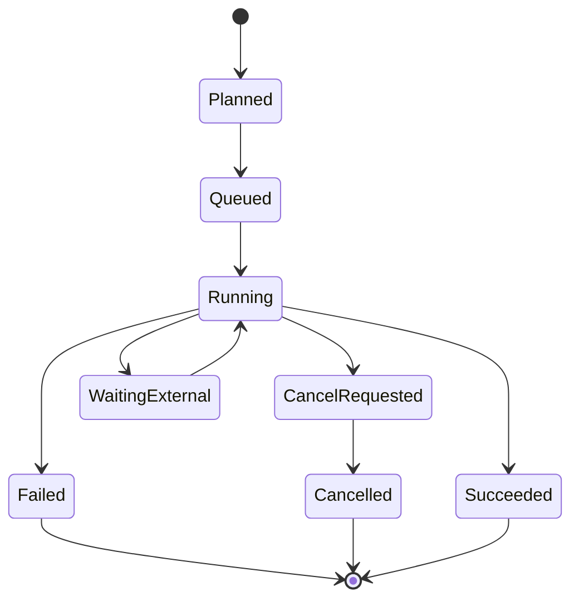
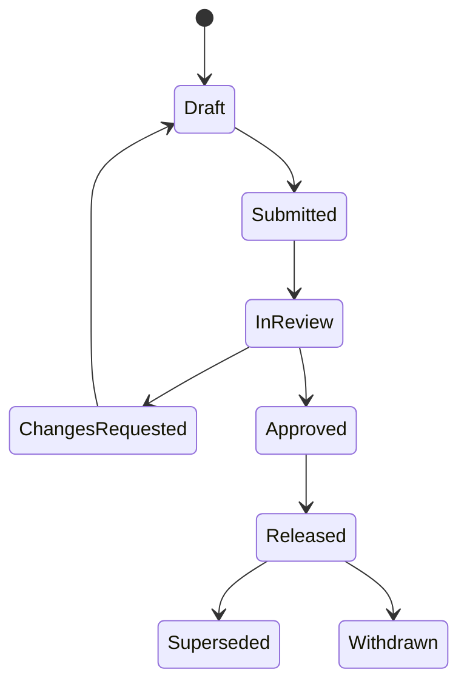

# 데이터 Revision과 Provenance 모델

## Current accepted target — D0-v3

This document retains the scientific, artifact, validation, review and release evidence needed by
concrete contracts. Its domain history boundary is narrower: only Material information edits create an
immutable Material information revision containing Material identity, associated state/manufacturing/
heat-treatment and direct property values. State/PropertySet identities and Specimen, TestRun, TestData,
Dataset, Selection, Mapping Profile, Process, Model, Solver Card and Link data use stable IDs and
separate saved objects. Test conditions remain TestRun/TestData data; renames preserve links and do not
stale science.

Actual computational inputs/options change current eligibility. Saved results retain the actual typed
inputs and settings they used. Raw/input/output bytes, units, engineering semantics, authorization,
scientific validation and release meaning remain immutable or explicitly represented as their contracts
require. Software/schema/file versions, hashes and opaque concurrency tokens are metadata.

The former all-entity Content Revision + Entity–Activity–Agent graph is a legacy compatibility model
until the real DB/API migration. Universal E-A-A provenance, per-edit save reasons, snapshot
proliferation and hidden nonmaterial revision writers are not required. Audit remains a separate
security/business control where needed, and graph traversal never implies derivation.

## 1. Accepted history boundary

이 플랫폼은 Material information history, concrete result/evidence와 별도 security/business audit를
섞지 않는다.

| 이력 | 질문 | 표현 |
| --- | --- | --- |
| Material information history | Material identity, associated state/manufacturing/heat-treatment and direct properties changed | Material identity + immutable Material information revision |
| Concrete result/evidence | Which saved inputs/settings produced the result and which validation/release facts apply | typed input/output, artifact, review and release data required by that contract |
| Security/business audit | Which authorized actor performed a security or business action | append-only audit event where policy requires it |

Ordinary metadata edits are saved-object updates and do not create domain revisions. Raw curve
processing produces a separate result with its actual input/settings; a security or release action may
also produce an audit event. These records are related by explicit typed links when a contract needs it.

### 1.1 Recipe/Batch 실행 결과의 모델 승격

성공한 common Processing Batch Attempt가 exact Output object와 saved Recipe object 사이의
authoritative relation이다. Modeling은 Output head나 Recipe head를 추측하지 않고 이 Attempt를
역조회하여 Recipe digest, Batch, Member, Attempt와 Output object를 한 evidence로 고정한다.
Recipe 없이 직접 commit된 과거 Output은 덮어쓰지 않으며 `processing_recipe=not_applicable`로
남는다. Recipe 기반 Output만 Neutral JSON에서 `processing_recipe=exact_saved_object`를 주장할 수 있다.

### 1.2 Canonical Test Data에서 Export까지의 exact source projection

`governed_source`는 클라이언트가 선언한 이름 일치가 아니라 application service가 확인한
explicit object association이다. 좁은 integration adapter가 TestRun ID를 읽고 그 Run이 고정한
Specimen ID, Material State ID 및 필요한 Material information revision을 authorized
application-service read로 해석하고
classification/scope 일치를 모두 확인한다. Datasets core는 Catalog/Testing persistence를
직접 읽지 않는다.

검증된 association은 Canonical Test Data saved content metadata에 포함될 수 있지만 canonical Test Data JSON
Artifact bytes에는 포함되지 않는다. Common Processing Output preflight는 exact Test Data
object를 읽어 같은 proof를 immutable Output content와 `cmp.processing-output` Artifact에
복사한다. 과거/JSON-only source의 `null`은 의미 있는 “증명 없음” 상태이며 backfill하거나
browser session pin으로 대체하지 않는다. 이 projection은 source eligibility만 증명하고,
ephemeral target preview나 delivered Solver Card event를 만들지는 않는다. UXC-06C1 preview는 이
immutable projection을 read-only로 검증해 deterministic text/digest만 반환한다. 이는 hidden
Entity/Activity domain writer를 생성하지 않으며 C2 receipt와 delivered Solver Card event를 대신하지
않는다. UXC-06C2는 같은 Exporting transaction에서 immutable Solver Card result, immutable delivery receipt와
outbox event를 함께 기록한다. receipt에는 filename/checksum, Output→Material/State→Neutral/embedded
IR exact saved-object inputs, target/mapping digest, actor와 timestamp가 고정된다. Materials CAE Card는
기존 canonical card API를 재사용한다. Activity receipt projection에는 권위 producer가 없으므로
`Not configured`이며 Delivered Activity 상태를 주장하지 않는다.

## 2. W3C PROV의 선택적 legacy mapping

W3C PROV-DM은 provenance를 domain-agnostic한 Entity, Activity, Agent와 관계로 정의한다. 기존
reference/compatibility payload가 이 의미를 사용할 수는 있지만, accepted target은 universal
E-A-A domain graph를 요구하지 않는다. [W3C PROV-DM](https://www.w3.org/TR/prov-dm/)

### 2.1 매핑

| W3C 개념 | 플랫폼 매핑 | 예시 |
| --- | --- | --- |
| Entity | immutable revision 또는 artifact | Raw Asset, Dataset Revision, IR Revision, Card Artifact |
| Activity | 실행·변환·결정 | Import Run, Processing Run, Calibration Run, Export Run |
| Agent | 책임 주체 | User, Service Account, Plugin Package, Organization |
| used | activity가 input entity 사용 | Calibration Run used Selection Revision |
| wasGeneratedBy | entity가 activity에서 생성 | IR Revision wasGeneratedBy Calibration Run |
| wasDerivedFrom | 새 entity의 의미적 source | Processed Dataset derivedFrom Normalized Dataset |
| wasAssociatedWith | activity 실행 책임 | Run associatedWith user/plugin/runner |
| wasRevisionOf | 동일 aggregate의 새 content | Material Revision 3 revisionOf Revision 2 |
| wasAttributedTo | entity의 작성 책임 | Review Report attributedTo reviewer |

## 3. PostgreSQL typed provenance schema (legacy compatibility)

The pseudo-schema below documents the current compatibility projection. Later migration work may keep
typed evidence tables for concrete result/release/security contracts, but must not add a universal
provenance table or nonmaterial revision writer.

### 3.1 Node tables

아래 pseudo-schema는 현재 application persistence table의 column을 순서대로 보여준다. Primary key,
foreign key, unique constraint와 RLS는 database migration이 관리하며 이 목록에서 추정하지 않는다.

```text
provenance.entity(
  organization_id, project_id, classification,
  id, entity_type, reference_kind, reference_type, reference_id,
  content_sha256, generation_requirement, created_at,
  recorded_at, recorded_by, request_id, trace_id
)

provenance.activity(
  organization_id, project_id, classification,
  id,
  activity_type, domain_run_type, domain_run_id,
  status, input_required, output_required,
  started_at, ended_at, submission_digest,
  recorded_at, recorded_by, request_id, trace_id
)

provenance.agent(
  organization_id, project_id, classification,
  id, agent_type, reference_id,
  recorded_at, recorded_by, request_id, trace_id
)
```

`reference_kind`, `reference_type`, `reference_id`, `content_sha256`은 허용된 immutable domain
reference를 평면 persistence column으로 기록한다. Application service가 referenced row와 digest를
검증하며 `request_id`와 `trace_id`는 correlation을 위한 persistence 전용 evidence다.

### 3.2 Typed relation tables

```text
provenance.usage(
  organization_id, project_id, classification,
  activity_id, entity_id, role, ordinal,
  recorded_at, recorded_by
)

provenance.generation(
  organization_id, project_id, classification,
  entity_id, activity_id,
  role, generated_at,
  recorded_at, recorded_by
)

provenance.derivation(
  organization_id, project_id, classification,
  generated_entity_id, used_entity_id, activity_id, derivation_kind,
  recorded_at, recorded_by
)

provenance.association(
  organization_id, project_id, classification,
  activity_id, agent_id, role, plan_entity_id,
  recorded_at, recorded_by
)

provenance.revision(
  organization_id, project_id, classification,
  newer_entity_id, prior_entity_id, change_reason,
  recorded_at, recorded_by
)

provenance.attribution(
  organization_id, project_id, classification,
  entity_id, agent_id, role,
  recorded_at, recorded_by
)
```

`derivation.activity_id`와 `association.plan_entity_id`만 nullable이다. 관계 종류를 하나의
unrestricted `edge_type` 문자열에 몰아넣지 않고 핵심 relation은 typed table과 migration constraint로
관리한다.

### 3.3 Public entity projection

Public JSON은 persistence row를 그대로 노출하지 않는다.
`contracts/provenance/provenance-entity-resource.schema.json`이 API entity projection의 source of
truth다. 이 projection은 persistence의 `reference_kind`, `reference_type`, `reference_id`,
`content_sha256`을 `reference.kind`, `reference.type`, `reference.id`, `reference.sha256`으로 묶고,
`generation_activity_id`, `completeness`, lineage/impact link를 추가한다. Persistence correlation field인
`request_id`와 `trace_id`는 public entity JSON field가 아니다.

## 4. Material information revision and saved-object rules

### 4.1 Material information history

```text
material(id, organization_id, project_id, current_information_revision_id, created_at)
material_information_revision(id, material_id, revision_no, based_on_revision_id,
                               content, content_hash, created_at, created_by)
```

- `material.current_information_revision_id`는 Material information 조회 편의를 위한 head pointer다.
- revision content row는 `INSERT`만 허용한다.
- head pointer update에는 `expected_current_information_revision_id`를 사용해 lost update를 막는다.
- Material information revision 생성은 그 revision과 필요한 security/business audit event 및 head pointer를 함께 기록할 수 있다. Universal provenance revision relation은 만들지 않는다.
- `DELETE`/`UPDATE`는 DB role과 trigger로 차단한다. lifecycle projection 같은 제한된 운영 필드는 별도 table에 둔다.

### 4.2 Draft and ordinary saved objects

Material information edits create a new immutable Material information revision when saved. State/
PropertySet and Specimen, TestRun, TestData, Dataset, Selection, Mapping Profile, Process, Model,
Solver Card and Link edits save to their stable-ID objects or separate result objects; they do not create
domain revisions. UI draft state is client/session state. A saved result stores the actual inputs/options/
settings used, while current input changes update eligibility only.

### 4.3 Correction과 supersession

- 원본 파일 오류: raw asset을 바꾸지 않고 corrected source를 새 raw asset로 ingest하고 관계·사유를 기록한다.
- metadata 오류: TestRun 또는 Import Mapping saved object에 적용되는 correction contract를 사용한다.
- 계산 설정 오류: 기존 run을 실패/invalidated로 표시하고 새 run을 만든다.
- 승인 모델 교체: 새 release를 발행하고 이전 release를 superseded로 전환한다.
- 법적·보안상 사용 중지: withdrawn event를 추가한다. 물리 삭제와 동일하지 않다.

## 5. 계산 Job과 concrete result evidence 생명주기

Long-running calculations still use the durable Job state machine below. A Job/Result contract records
the exact saved input IDs, typed values, options/settings, output artifacts and required review or
validation evidence. This operational record is not a universal domain-history writer.



### 5.1 실행 전

1. input saved-object IDs, Material information revision where applicable and selection membership을 검증한다.
2. plan/config를 canonical JSON으로 직렬화하고 digest를 계산한다.
3. plugin package, runner capability, resource policy를 고정한다.
4. concrete result contract에 필요한 usage/association evidence를 생성한다.
5. durable job을 queue한다.

### 5.2 실행 성공

1. runner가 Result Manifest와 output artifact를 staging 영역에 쓴다.
2. 플랫폼이 digest, schema, size, expected role을 검증한다.
3. content-addressed final key로 승격한다.
4. DB transaction에서 artifact/result, required input/output evidence, run status, outbox event를 기록한다.
5. final object 존재와 digest를 reconciliation 대상에 등록한다.

### 5.3 실행 실패

실패 run도 durable Job/Run record다. input usage, plugin/runner, logs, failure category, partial
artifact를 concrete result contract가 요구하는 범위에서 보존한다. partial output은 `diagnostic`
role만 가질 수 있으며 downstream scientific input으로 자동 선택되지 않는다.

## 6. 객체 저장소와 DB의 비원자성 처리

객체 저장소와 PostgreSQL은 하나의 ACID transaction을 공유하지 않는다. 이를 숨기지 않고 상태와 복구 절차를 둔다.

1. upload는 random staging key에 수행한다.
2. digest와 size 검증 후 `artifact_pending`을 기록한다.
3. content-addressed immutable key로 server-side copy/commit한다.
4. DB artifact를 `available`로 전환하고 required result/evidence relation을 commit한다.
5. background reconciler가 `pending`, missing object, orphan object, digest mismatch를 탐지한다.
6. orphan staging object는 retention window 후 삭제할 수 있지만 raw/released final object에는 lifecycle retention policy를 적용한다.

사용자에게 성공을 반환하는 시점은 DB와 final object가 모두 확인된 뒤다.

## 7. Lifecycle와 Release

### 7.1 Material information and release lifecycle



Material information content 자체를 update해 상태를 바꾸지 않고 `lifecycle_event`를 append하고
현재 상태 projection을 갱신한다. Ordinary saved-object lifecycle changes update the applicable
state/result projection and do not create a domain revision.

### 7.2 Release manifest

Release는 최소 다음을 digest로 고정한다.

- Material information revision and associated Material State/TestRun/TestData/Dataset object IDs
- input Selection object and saved input snapshot
- processing/statistical/calibration run IDs
- Material Model IR/result object
- solver card result and mapping report
- validation template/run/result
- review decisions
- plugin package digests
- human-readable report
- concrete input/evidence references required by the release contract

release package 생성 후 구성요소를 교체하지 않는다.

## 8. Lineage query

PostgreSQL recursive CTE는 tree/hierarchy와 explicit typed-link graph traversal에 사용할 수 있다.
[PostgreSQL recursive query 문서](https://www.postgresql.org/docs/current/queries-with.html)

MVP query 유형은 알려져 있다.

- entity의 모든 explicit direct/indirect upstream
- entity에서 명시적으로 연결된 downstream
- 특정 activity type까지만 탐색
- 특정 release에 포함된 concrete evidence links
- 영향을 받는 release impact analysis
- orphan/missing-generation 검사

typed link에는 허용 relation과 금지 cycle을 구분한다. Graph traversal 자체는 derivation이 아니며,
concrete result derivation이 필요한 경우 result contract의 typed input/output relation만 cycle
check한다. 조직 규모가 커지면 read-only closure/materialized path cache를 추가하되 typed relation이
source of truth다.

## 9. Graph DB 비교

| 기준 | PostgreSQL typed domain relation + concrete evidence links | 별도 graph DB |
| --- | --- | --- |
| Domain 무결성 | FK, unique, check, transaction으로 강함 | domain record와 이중화 시 consistency 관리 필요 |
| Material information/release transaction | 같은 DB transaction에 포함 가능 | 보통 분산 transaction 또는 eventual consistency |
| 권한 격리 | 기존 RBAC/RLS와 결합 가능 | graph별 권한 모델 별도 검증 필요 |
| 알려진 lineage traversal | recursive CTE와 index로 충분 | 자연스럽고 표현이 간결함 |
| 임의 다중-hop 탐색 | query가 복잡해질 수 있음 | graph query language가 유리 |
| 운영 복잡도 | DB 한 종류 | backup, HA, monitoring, driver 추가 |
| 분석/시각화 | export 또는 projection 필요 | graph analytics 생태계 유리 |
| MVP 적합성 | 높음 | 낮음 |

### 최종 권고

`DECISION`: PostgreSQL typed domain links and concrete result/evidence relations are the source of
truth. An Entity–Activity–Agent graph or graph DB is not required merely because the data is graph-shaped.

다음 조건이 실제 측정으로 확인되면 read-only graph projection을 검토한다.

- provenance edge가 수억 건 이상이고 임의 5~20 hop interactive 탐색이 핵심 사용자 기능이 됨
- graph centrality/community/path analytics가 제품 가치가 됨
- recursive CTE 및 closure cache로 SLO를 충족하지 못함
- 별도 graph projection의 eventual consistency를 업무가 허용함

그 경우에도 PostgreSQL을 authoritative store로 유지하고 outbox에서 graph read model을 만든다.

## 10. Security/business audit event (separate from domain history)

Audit event는 보안·권한·review/release·plugin/runner 관리처럼 정책이 요구하는 행위만 기록한다.
일반 saved-object edit마다 domain history나 save reason을 생성하는 용도가 아니다.

```json
{
  "event_id": "uuid",
  "occurred_at": "RFC3339",
  "actor": {"type": "user", "id": "uuid"},
  "organization_id": "uuid",
  "project_id": "uuid",
  "action": "material.information.update",
  "target": {"type": "material_information_revision", "id": "uuid"},
  "outcome": "success",
  "request_id": "uuid",
  "trace_id": "hex",
  "ip_or_client": "policy-redacted",
  "previous_hash": "hex",
  "event_hash": "hex"
}
```

민감한 raw payload와 secret은 audit에 넣지 않는다. audit integrity는 append-only DB permission, hash chain/periodic signed root, 외부 WORM retention으로 강화한다.

## 11. Current target completeness rules

Release and result checks must verify concrete contract data, not manufacture a universal domain
history:

1. Material information revisions are immutable and contain Material identity, associated
   state/manufacturing/heat-treatment and direct property values.
2. State/PropertySet, Specimen, TestRun, TestData, Dataset, Selection, Mapping Profile, Process,
   Model, Solver Card and Link records use stable IDs and separate saved data; ordinary renames preserve
   links and do not stale science.
3. Every saved result retains the exact typed inputs, options/settings, units and output relation it
   used. Current eligibility changes do not rewrite saved bytes.
4. Raw, input and released artifact bytes and digests remain immutable; native file bytes remain
   separate from card JSON.
5. Import and export reports distinguish `exact`, `transformed`, `approximated`, `unsupported`,
   `ignored` and `not_applicable`; unsupported is blocked and approximation/ignored requires explicit
   acknowledgement where the contract says so.
6. Concrete validation, review and release contracts retain their required evidence, authorization and
   lifecycle meaning. A Catalog publication is not a universal prerequisite for ordinary TestData/Card
   reads, and card release remains separate from Catalog publication.
7. Graph traversal follows explicit typed links in both directions; traversal is not derivation and no
   sibling/name/`latest` fallback is valid.
8. Universal Entity–Activity–Agent provenance, per-edit save reasons, snapshot proliferation and hidden
   nonmaterial revision writers are not required. Migration is additive, reversible and preserves the
   unmodified v1 runtime as legacy until the real DB/API migration.

## 12. Legacy provenance completeness rules (historical gates)

The numbered checks below are retained as historical compatibility gates and evidence for already
implemented scientific/release slices. They do not override Section 11 or authorize new nonmaterial
revision writers.

1. 모든 output entity에 정확히 하나의 primary generation activity가 있다.
2. 모든 run input이 immutable entity revision이다.
3. 모든 activity에 실행 user/service, plugin package 또는 명시적 manual activity agent가 있다.
4. 모든 artifact digest가 검증되었다.
5. 모든 unit conversion과 manual edit가 activity/recipe로 표현되었다.
6. card는 IR revision과 exporter package에서 파생되었다.
7. validation은 template, solver/card, runner, result extraction version을 가진다.
8. review decision은 검토한 release-candidate manifest digest를 참조한다.
9. a Calibration-promoted Material Model IR references the exact current Candidate Selection
   revision, converged Candidate digest, Calibration Run, and diagnostics Artifact digest; it never
   replaces the evaluated IR revision.
10. a T-27 Validation Run records the same terminal Result Manifest provenance shape for managed
    mock and manual attachment: exact Plan/Template/IR/Card/Selection usage plus immutable
    deck/log/native-result/manifest Artifact generation. A normal termination is evidence only and
    must not be represented as a validation verdict.
11. a T-28 Validation Result is a separate immutable interpretation activity. It uses the frozen
    terminal Result Manifest and experimental Selection revision, generates separate normalized
    response, numerical-health-report, and comparison-result Artifacts, and records their digests
    without changing the Run, Manifest, native Artifact, source Dataset, IR, Card, or a prior
   result. Its pass/fail/not-evaluated value is an explicit reference profile outcome, never a
   replacement for approval or release provenance.
12. a T-29 Review Request pins one immutable aggregate revision and manifest digest. A Review
    Decision is append-only, records the separated reviewer and exact digest, advances the shared
    lifecycle projection transactionally, and never mutates the candidate. `changes_requested`
    applies only to that revision; resubmission requires a newly created revision.
13. a T-30 reference Release pins one explicit candidate manifest: Material/State/Property
    revisions, Material Model IR revision, Solver Card and mapping/card digests, a passed
    Validation Result, the approved T-29 Review Request/Decision digest, and a provenance snapshot
    digest. The Release Manifest and package Artifact are immutable and tenant/classification scoped;
    the completeness gate rejects stale, draft, unsupported, approximated, cross-tenant, or
    partially approved inputs. The reference package is not a production object-store publication
    and has no supersede/withdraw transition until T-31.

14. T-31 keeps that Release evidence immutable and records lifecycle separately. A typed
    supersede/withdraw event names the source Release and (for supersede) an explicit same-scope
    successor; a projection exposes only the current terminal state. Download and consume facts
    are append-only usages accepted only while released. Impact reads include predecessor,
    successor, transition history, usage, and terminal warnings without changing any Release,
    Manifest, package, Material Model, Solver Card, or validation revision.

