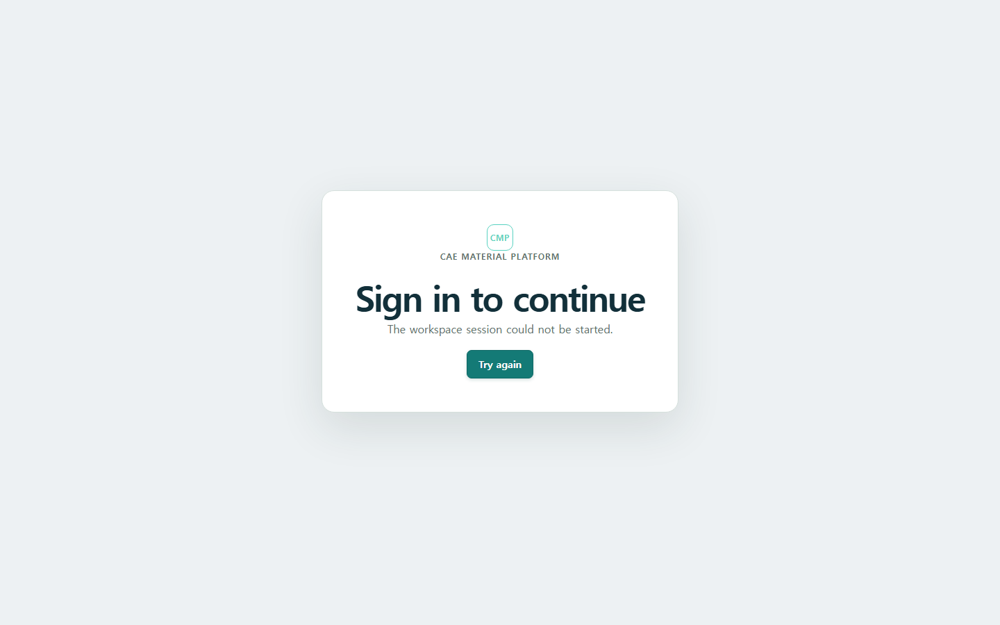

# 서비스 실행과 연결

새 조회 앱은 [개편 중인 조회 화면](#개편-중인-조회-화면)과 [외부 접속 주소](../../README.md#접속-주소와-시안-원본)를 따릅니다.
아래 준비·자동 로그인·Material 생성은 기존 앱(5173)의 절차입니다.

## 준비물

- 실행 중인 Docker Desktop
- 이 저장소 checkout
- 실제 회사 데이터가 아닌 제공된 synthetic example data

## 실행

저장소 root의 PowerShell 또는 bash에서 다음 중 하나를 실행합니다.

```powershell
make demo
```

GNU Make를 사용할 수 없으면 다음 명령을 사용합니다.

```powershell
docker compose -f deploy/compose/docker-compose.demo.yml up --build
```

모든 서비스가 준비된 뒤 다음 주소를 엽니다.

- Web: <http://127.0.0.1:5173>
- 최근 작업과 검토 진입은 **Activity**에서 확인합니다.

## Demo user session 시작

1. Web 주소를 엽니다.
2. **Preparing your workspace…**가 사라질 때까지 기다립니다.
3. 상단 오른쪽에 **Demo user**가 표시되는지 확인합니다.
4. 기본 `/materials` 검색에서 기존 Material을 찾습니다. 적절한 Material/card가 없을 때만
   **Modeling**의 Data로 이동합니다.

Demo session은 `demo` mode에서만 자동으로 준비됩니다. production에서는 같은 자리에 일반
로그인 화면이 표시되며 사용자는 내부 연결 정보나 인증 문자열을 다루지 않습니다.
Demo access token은 짧게 유지되지만 브라우저가 만료 전에 같은 Demo user 역할로 자동 갱신하므로,
장시간 작업 중 token을 복사하거나 site data를 지울 필요가 없습니다. 갱신 요청이 실패하면
**Sign in to continue**에서 **Try again**을 눌러 현재 demo session을 다시 준비합니다.




## 개편 중인 조회 화면

기존 서비스와 별도로 `apps/web-next`에서 소재·실험·저장 결과·모델·솔버 카드를 조회할 수 있습니다.
저장소 root에서 `npm run dev --workspace @cmp/web-next`를 실행하고
<http://127.0.0.1:5174>를 연 뒤 **로컬 데모 연결**을 누릅니다.
API 주소가 기본값과 다르면 [조회 앱 실행 설정](../../apps/web-next/README.md)을 따릅니다.

**소재**, **실험 데이터**, **처리 데이터·모델**, **솔버 카드**에서 자료를 찾습니다.
검색어를 입력한 뒤 **검색** 또는 Enter로 검색합니다. 소재 카드의 물성 행이나 **미리보기 →**를
누르면 오른쪽에 미리보기가 열립니다. **확대 상세**, Enter 또는 더블클릭으로 상세를 확대하고
**‹ 목록 보기**로 돌아옵니다. 검색 초안·필터·페이지·선택과 초점을 유지하여 다른 자료를 비교할 수 있습니다.

미리보기를 접어도 선택은 유지합니다. 같은 항목을 누르면 다시 열립니다. 목록 공간이 부족하면
**탐색·필터 접기**로 왼쪽 탐색 영역을 접을 수 있습니다. 좁은 화면에서는 미리보기에 집중하고,
접기 버튼으로 목록에 돌아옵니다. 검색 결과가 없을 때는 **조건 초기화**로 다시 시작합니다.

소재의 **표** 보기에서도 상태별 물성값과 적용 온도를 비교할 수 있습니다. 비교 목록의 숫자는
간결하게 표시하며 상세 물성과 저장 데이터의 값은 유지합니다. 솔버 카드는 모델 계열과 함께
**솔버**, **단위계** 필터로 좁힐 수 있습니다. 처리 데이터는 미리보기에서도 JSON 파일을 받을 수 있습니다.

소재 카드에는 이름·물성·단위·적용 온도를 표시합니다. 소재 코드·리비전은 미리보기의
**소재 정보**에서 확인합니다. 실험 트리는 소재 → 시편 → 실험으로 탐색합니다.
물성 적용 온도는 시험 온도와
다르며, 실험 목록에는 소재·시험 방법·시편·시험 온도를 각각의 열로 표시합니다.
원본 파일명은 오른쪽 미리보기와 상세에서 확인합니다. 속도와 방향은 공통 조건
연결 계약이 준비된 뒤 추가할 예정입니다. 모델 목록은 사용한 소재 상태가 정확히 일치할 때 이름을
표시하고, 실제 저장 시각과 매개변수로 같은 계열의 결과를 구분합니다.

실험 상세에서 그 실험을 실제로 사용한 처리 결과, 연결된 모델과 생성된 솔버 카드로 이동합니다.
소재가 같다는 이유만으로 생성 관계에 포함하지 않습니다. 입력이 바뀌어도 이전 결과는 당시 입력으로
조회합니다. 화면의 GPa·MPa·°C·% 표시는 원본 값과 다운로드 파일을 바꾸지 않습니다.
실험의 원래 단위와 정규화 단위는 **시험 조건**, **측정 채널**에서 확인합니다.
처리 결과의 **사용한 처리 설정**을 열면 단계별로 저장한 값을 볼 수 있습니다.
모델과 카드의 **적용 범위**, 카드의 **솔버 반영 방식**에서 외삽·근사·미지원 여부를 확인합니다.
자료 상세에는 저장 식별자나 파일 해시를 나열하지 않습니다.

**실험 데이터 JSON 다운로드**, **처리 데이터 JSON 다운로드**, **솔버 카드 다운로드**로 해당 파일을 받습니다.
실험 데이터와 솔버 카드는 오른쪽 미리보기에서도 바로 다운로드할 수 있습니다.
솔버 카드 목록은 모델 계열·솔버·단위계·상태를 구분하고, 미리보기의 파일 내용은 독립적으로 스크롤합니다.
실패하면 오류를 확인한 뒤 다시 시도합니다. 관련 자료를 볼 권한이 없어도 허용된 직접 조회는 사용할 수 있습니다.
연결이 만료되면 **로컬 데모 연결**로 다시 연결합니다.

이 화면은 조회·다운로드 단계입니다. 등록·처리 실행·모델 생성은 기존 서비스에서 수행하며,
기존 서비스의 일괄 전환은 아직 진행하지 않았습니다.

화면 크기별 조회 예시는 아래 원본에서 확인할 수 있습니다.

| 화면 | 1366 | 1440 | 1920 | 2560 | 3840 |
| --- | --- | --- | --- | --- | --- |
| 소재 목록 | [1366](images/current/rd02-materials-list-1366x768.png) | [1440](images/current/rd02-materials-list-1440x900.png) | [1920](images/current/rd02-materials-list-1920x1080.png) | [2560](images/current/rd02-materials-list-2560x1440.png) | [3840](images/current/rd02-materials-list-3840x2160.png) |
| 실험 미리보기 | [1366](images/current/rd02-test-data-preview-1366x768.png) | [1440](images/current/rd02-test-data-preview-1440x900.png) | [1920](images/current/rd02-test-data-preview-1920x1080.png) | [2560](images/current/rd02-test-data-preview-2560x1440.png) | [3840](images/current/rd02-test-data-preview-3840x2160.png) |
| 실험 상세 | [1366](images/current/rd02-test-data-expanded-1366x768.png) | [1440](images/current/rd02-test-data-expanded-1440x900.png) | [1920](images/current/rd02-test-data-expanded-1920x1080.png) | [2560](images/current/rd02-test-data-expanded-2560x1440.png) | [3840](images/current/rd02-test-data-expanded-3840x2160.png) |
| 솔버 카드 상세 | [1366](images/current/rd02-solver-card-detail-1366x768.png) | [1440](images/current/rd02-solver-card-detail-1440x900.png) | [1920](images/current/rd02-solver-card-detail-1920x1080.png) | [2560](images/current/rd02-solver-card-detail-2560x1440.png) | [3840](images/current/rd02-solver-card-detail-3840x2160.png) |

## 기존 앱에서 첫 Material 만들기

1. 일반 탐색은 **Materials → Browse Tree**, 생성·schema 관리는 우측 workspace menu의
   **Administration**을 엽니다.
2. 이름, code, family와 class를 입력합니다.
3. Steel은 `metal`, 일반 점탄성 polymer는 `polymer`, Ogden--Prony는 `elastomer`를 선택합니다.
4. Material 상세에서 State를 만들고 density, Young's modulus, Poisson ratio를 SI 단위로
   입력합니다.
5. 일반 상세에서는 `rN` 문맥만 확인하고 full revision ID는 Evidence 또는 Administration에서
   확인합니다.

저장할 때마다 새 immutable revision이 생깁니다. 브라우저 form을 고치는 것이 이미 저장된
revision을 바꾸지 않습니다.


상단 메뉴와 Material 문맥 탭의 역할, 분류·mapping·다운로드 문제 해결은
[메뉴와 Material 작업공간 사용법](10-navigation-and-troubleshooting.md)을 참고하십시오.


## 종료와 데이터 주의

일반 종료에는 `docker compose ... down`을 사용합니다. `down -v`는 demo volume을 삭제하므로
보존할 demo가 없을 때만 개발 문서의 검증 절차에 따라 사용하십시오. Production 또는 다른
프로젝트에 demo teardown 명령을 복사하지 마십시오.

점탄성·초탄성 솔버 카드와 연결 모델의 Prony 계수는 전단 비율, 체적 비율, 완화 시간으로 나누어 표시합니다. 저장되지 않은 값을 0으로 채우지 않습니다.
