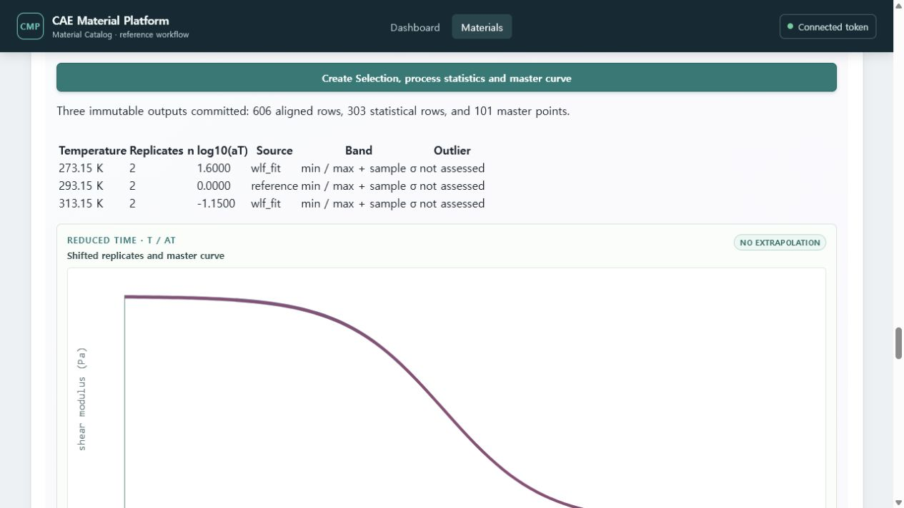
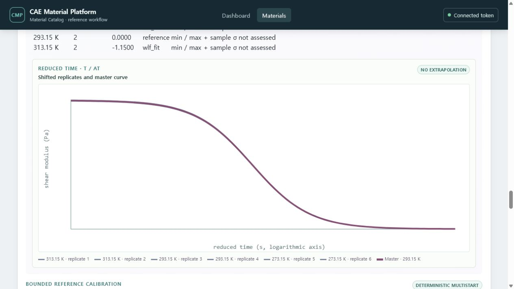
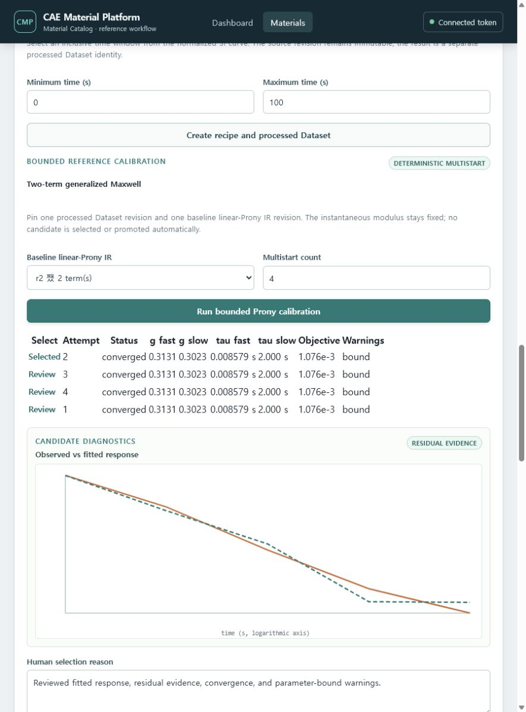

# Polymer 완화시험에서 Abaqus 점탄성 카드까지

## 입력 파일

현재 자동 fitting 경로는 UTF-8 CSV와 다음 두 channel을 사용합니다.

```text
time_s,shear_modulus_mpa
0.01,1000
...
```

예제: `examples/data/reference-shear-relaxation.csv`

- time은 strictly increasing이어야 합니다.
- 현재 bounded reference에서는 shear relaxation modulus가 증가하면 입력을 거부합니다.
- `s`, `ms`, `Pa`, `kPa`, `MPa`처럼 실제 source unit을 mapping 화면에서 명시합니다.

## 절차

1. `polymer` Material, State와 density/E/ν Property Set을 만듭니다.
2. **Shear-relaxation Dataset**에서 Specimen과 Test Run을 만듭니다.
3. CSV를 업로드하고 time/modulus column과 unit을 승인합니다.
4. raw Dataset과 normalized SI Dataset을 확인합니다. 두 representation은 별도 identity입니다.
5. 필요한 observed time range를 입력하고 crop Recipe/Run을 실행합니다. 이 step은 interpolation을
   수행하지 않으며 output은 별도 processed Dataset입니다.
6. 여러 온도/반복시험을 처리하려면 아래 **다온도 master curve** 절차를 실행합니다. 한 curve
   fitting만 필요하면 이 단계는 생략할 수 있습니다.
7. baseline linear-Prony IR을 만들거나 기존 compatible baseline을 선택합니다.
8. processed 또는 검토한 master Dataset으로 bounded deterministic multistart calibration을 실행합니다.
9. Candidates의 objective, RMSE, fitted curve, residual, convergence, bound와 identifiability
   warning을 비교합니다.
10. 수치가 가장 작다는 이유만으로 선택하지 말고 engineering 판단 이유를 입력해 Candidate를
   선택합니다.
11. 선택된 evidence를 같은 Material Model identity의 새 IR revision으로 승격합니다.
12. Abaqus 2025 mapping preflight를 실행하고 `.inp` preview/download를 확인합니다.

## 다온도 반복시험과 master curve

1. 각 반복 curve를 별도의 Test Run과 normalized shear-relaxation Dataset으로 등록합니다.
   Test Run에는 반드시 실제 시험 온도(K)를 입력합니다.
2. Material State 화면의 **Viscoelastic master curve**에서 둘 이상의 온도에 걸친 curve를
   선택합니다. 원본과 normalized revision은 이 선택으로 변경되지 않습니다.
3. reference temperature를 선택합니다.
4. 온도별 검증된 shift가 있으면 **Manual shift factors**에서 각 `log10(aT)`를 입력합니다.
   reference temperature의 값은 0으로 고정됩니다.
5. 세 개 이상의 서로 다른 온도가 있고 reference WLF 추정이 필요하면 **WLF fit**을 선택합니다.
   이는 deterministic reference fit이며 재료의 유효 온도 범위를 자동 승인하지 않습니다.
6. **Create Selection, process statistics and master curve**를 실행합니다.
7. 결과 표에서 온도별 `n`, shift 방법/값, sample standard-deviation band와 outlier 상태를
   확인하고 shifted replicate와 master curve를 검토합니다.

처리는 각 온도 curve의 공통 log-time 교집합에서만 선형 보간하며 외삽하지 않습니다. 결과는
aligned Dataset, pointwise-statistics Dataset, master-curve Dataset과 shift evidence로 나뉘어
immutable revision으로 저장됩니다. 온도별 curve가 겹치지 않거나 시험 온도가 누락되면 Run을
만들지 않습니다.









## 중요한 제한

- 현재 자동 calibration은 bounded two-term reference fitting이며 T-42 master curve 자체가
  곧바로 production-qualified Prony parameter를 뜻하지 않습니다.
- uncertainty가 `unassessed`이거나 identifiability warning이 있으면 그대로 보존됩니다.
- linear-Prony IR은 OpenRadioss LAW62로 변환되지 않습니다.
- T-44의 반복 승격 계약은 governed Ogden Candidate 흐름에 먼저 적용되었습니다. 이 문서의
  bounded linear-Prony 흐름은 아직 기존 단일 승격 guard를 유지하므로 promoted r2의 재승격은
  안전하게 거부됩니다.
