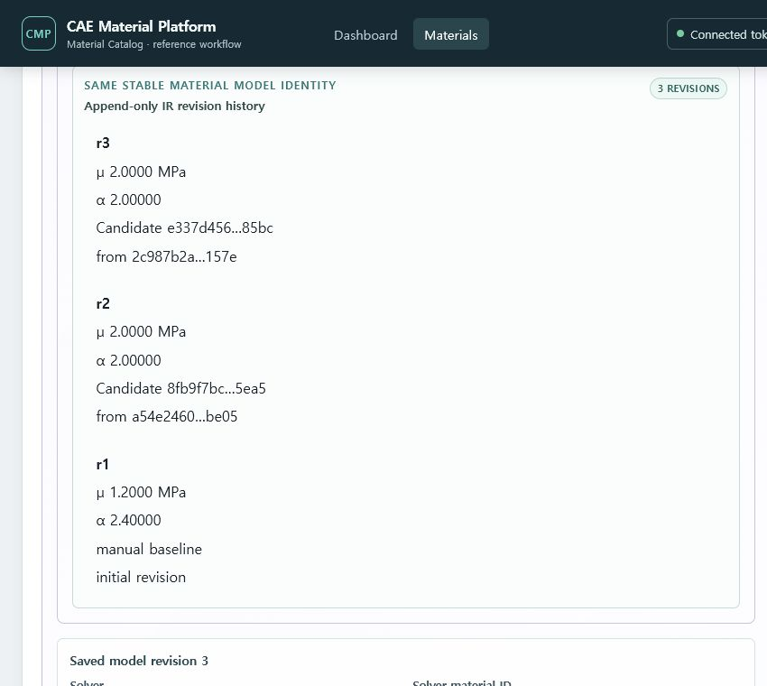
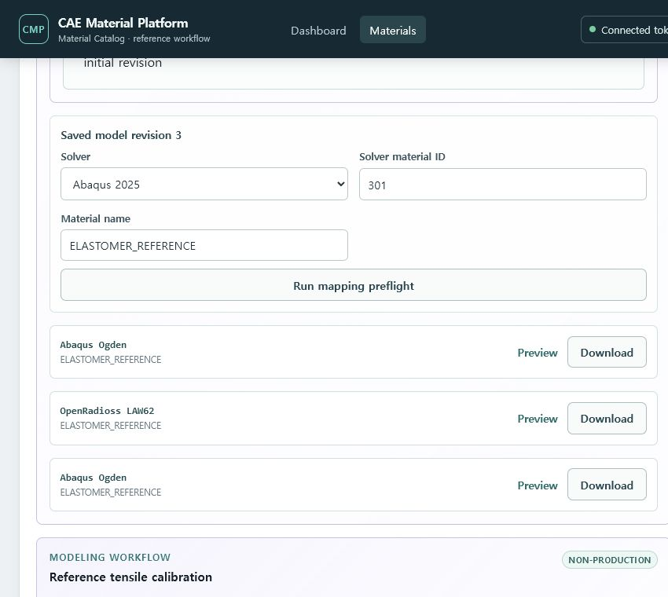
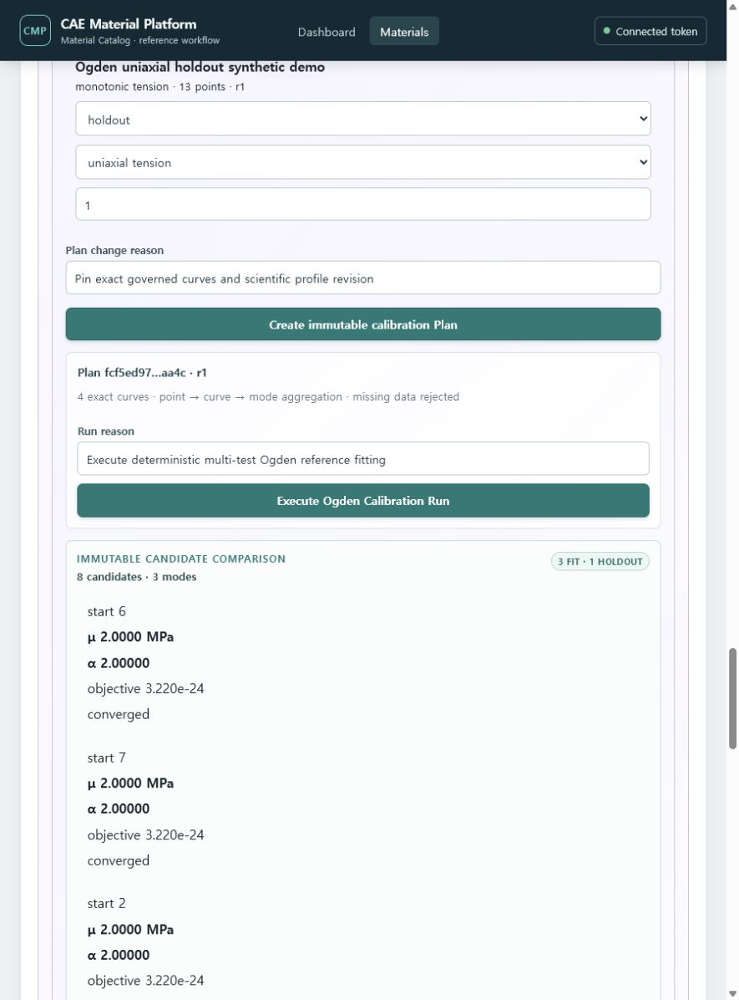
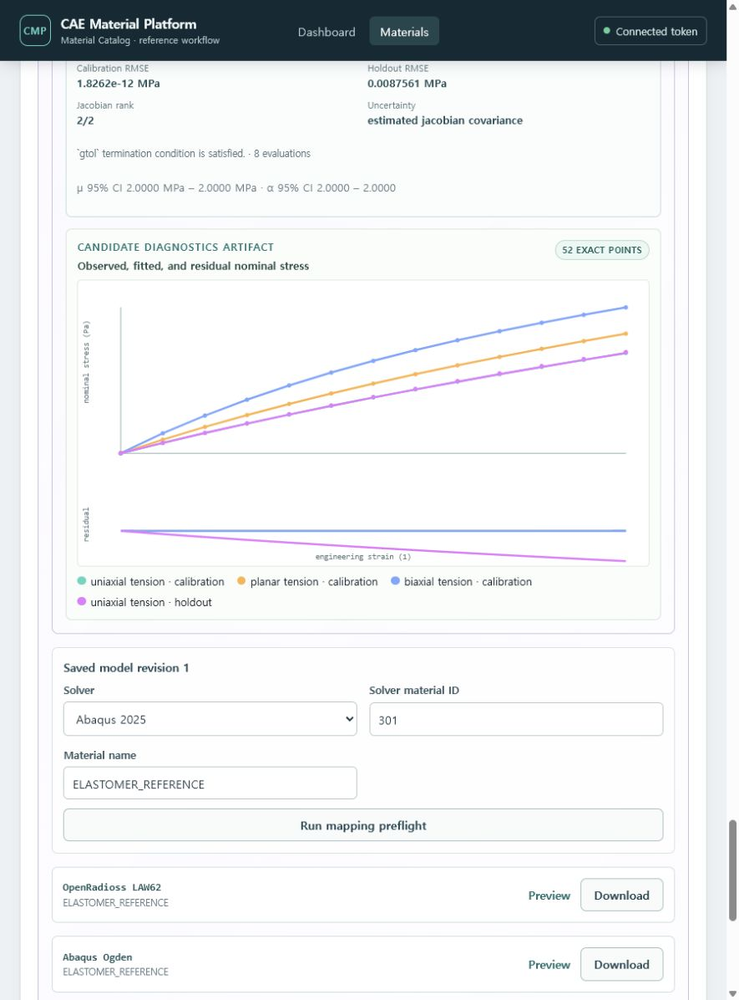

# Elastomer Ogden--Prony 카드

현재 Elastomer workflow는 one-term Ogden과 1~5 shear-Prony term을 수동 입력하거나,
governed normalized tension curve들에서 `mu`와 `alpha`를 fitting하는
`reference/non-production` 수직 기능입니다. shear-Prony term은 baseline IR에서 보존되며,
fitted Candidate는 사람의 명시적 선택과 사유를 거친 뒤 같은 Material Model identity의 새
immutable IR revision으로 승격할 수 있습니다.

## 절차

1. Material class를 `elastomer`로 만들고 State/Property Set을 준비합니다.
2. **Ogden--Prony** 영역에서 positive finite `mu`, `alpha`와 ordered Prony terms를 입력합니다.
3. shear ratio 합이 1 미만이고 relaxation time이 양수·strictly increasing인지 확인합니다.
4. exact Material/State/Property revision으로 immutable IR을 만듭니다.
5. target을 선택합니다.
   - Abaqus 2025: `*HYPERELASTIC, OGDEN, N=1`과 `*VISCOELASTIC`
   - OpenRadioss 2025: `/MAT/LAW62`
6. mapping report를 확인하고 report digest를 승인한 뒤 card를 생성합니다.
7. preview와 `.inp` 또는 `.rad` download를 확인합니다.

## Multi-test fitting 절차

Docker demo에서 공개 합성 입력과 완료된 fitting 화면을 빠르게 준비하려면 저장소 루트에서
다음을 실행할 수 있습니다. 이 명령은 실제 회사 데이터가 아니라 해석식으로 생성한
uniaxial/planar/biaxial calibration 3개와 uniaxial holdout 1개를 immutable evidence로
추가합니다. 세 loading mode는 각각 `reference_uniaxial_tensile`,
`reference_planar_tension`, `reference_biaxial_tension` Test Method revision으로 구분되며,
Dataset schema만 바꾸어 시험 의미를 가장하지 않습니다.

```bash
uv run python scripts/seed_ogden_calibration_demo.py
```

1. 같은 Material State의 각 시편에 Test Run을 만들고 **Governed tabular import**에서 CSV,
   TSV 또는 XLSX 원본을 보존합니다.
2. column과 unit을 명시해 별도 normalized Dataset revision을 생성합니다. 현재 지원 mode는
   `monotonic_tension`(uniaxial), `planar_tension`, `biaxial_tension`입니다.
3. 먼저 manual Ogden--Prony baseline IR을 만듭니다. 이 revision이 density, State와
   shear-Prony evidence를 고정합니다.
4. **Calibration profile**에서 reference profile을 생성하거나 기존 revision을 확인합니다.
   bounds, scaling, mode weights, multistart seed와 uncertainty policy가 이 revision에 고정됩니다.
5. **Multi-test Ogden calibration**에서 사용할 normalized curve를 선택하고 각 항목의 역할을
   `calibration` 또는 `holdout`으로 지정합니다. Dataset revision은 두 역할에 중복될 수 없습니다.
6. 시험 mode와 curve weight를 확인하고 immutable Plan을 생성한 뒤 Run을 실행합니다.
7. Candidate별 `mu`, `alpha`, objective, per-mode error, convergence, Jacobian rank,
   identifiability, uncertainty/95% CI와 warning을 비교합니다.
8. observed/fitted nominal-stress curve와 residual plot을 확인합니다. single-mode이면
   `insufficient test modes`, holdout이 없으면 `no holdout data`가 명시됩니다.
9. Candidate row를 눌러 diagnostics를 고른 뒤 fitted/residual, holdout, convergence, bounds,
   rank와 uncertainty를 검토합니다. 시스템은 가장 작은 objective를 자동 승인하지 않습니다.
10. **Human decision gate**에서 Selection label과 검토 사유를 기록합니다. Selection revision은
    exact Run/Candidate/candidate digest/diagnostics Artifact digest/baseline IR revision을 pin합니다.
11. IR promotion reason을 입력하고 승격합니다. 요청은 화면이 읽은 current IR의 strong ETag를
    사용하므로 다른 사용자가 먼저 새 revision을 만든 경우 412로 거부되고 새로고침이 필요합니다.
12. **Append-only IR revision history**에서 r1, r2, r3를 비교합니다. 각 promoted revision은
    자신의 Selection/Run/Candidate/diagnostics evidence만 소유하며 과거 evidence를 복사하거나
    덮어쓰지 않습니다. 과거 IR에서 만든 Card와 Release는 그 concrete revision을 계속 pin합니다.

두 번 이상의 calibration round를 회귀 데이터로 확인하려면 아래 명령을 두 번 실행할 수 있습니다.
각 실행은 실행 시점의 current IR을 새 baseline으로 pin하고 r2, r3처럼 새 revision을 추가합니다.

```powershell
uv run python scripts/seed_ogden_calibration_demo.py --promote
uv run python scripts/seed_ogden_calibration_demo.py --promote
```









입력 strain은 engineering strain(무차원), stress는 nominal stress(Pa)로 해석합니다. 현재
one-term incompressible public reference equation만 지원하며 compression, simple shear,
compressible/temperature-dependent fit과 실제 solver 검증은 이 범위가 아닙니다.


## Mapping 해석

- Ogden μ/α와 shear-Prony는 두 target에서 explicit mapping입니다.
- Abaqus의 incompressible `D1=0`은 현재 reference convention에서 exact입니다.
- OpenRadioss LAW62는 volumetric response를 `nu=0.495`로 표현하므로 `approximated`입니다.
- 이 근사는 반드시 화면과 mapping report에 남으며 production 승인을 의미하지 않습니다.

선형 점탄성 IR을 LAW62로 우회시키거나 없는 bulk relaxation 값을 추측해서 입력하지 마십시오.
