# CSV/TSV/XLSX 시험 데이터 승인과 Dataset 생성

이 절차는 governed importer를 사용해 공개 tabular 시험 파일의 원본을 변경 불가능한 Raw
Asset으로 보존하고, 사람이 channel과 unit 의미를 승인한 뒤 raw Dataset과 normalized SI
Dataset을 별도로 만드는 방법을 설명합니다. 단축 시험과 shear relaxation 외에 DMA
frequency-temperature sweep와 forming limit diagram(FLD)을 같은 수명주기로 등록할 수 있습니다.
특정 시험기 vendor format을 자동 해석하거나 제조사별 숨은 기본값을 적용하지 않습니다.

## 준비

- Docker demo와 local demo identity를 연결합니다.
- Material 상세에서 Material State, Specimen, Test Method와 Test Run을 먼저 만듭니다.
- 예제는 [`reference-tensile.csv`](../../examples/data/reference-tensile.csv)를 사용합니다.
  값은 공개 시연용 synthetic data이며 설계나 재료 승인에 사용할 수 없습니다.

DMA와 FLD 원본도 기밀 식별자가 없는 synthetic non-production 값만 사용합니다. 다음 모양은
column 예시일 뿐 시험 표준이나 승인 기준을 선택하지 않습니다.

```csv
temperature_c,frequency_hz,storage_mpa,loss_mpa,tan_delta
-40,1,1480,118,0.0797
-40,10,1540,126,0.0818
20,1,920,164,0.1783
```

```text
minor_strain_pct\tmajor_strain_pct
-12\t28
-4\t22
6\t25
```

## Modeling Data에서 시작

일반 작업은 `/modeling?stage=data` 안에서 진행합니다. Data 상단의 출처 선택은 다음 세 가지입니다.

- **Library**: 현재 Material/Material State에 연결된 exact Test Data revision을 선택합니다. 각
  곡선의 **Include in processing and fit**와 **Show on plot**은 서로 다른 선택이며, 하나를
  바꿔도 다른 선택은 바뀌지 않습니다.
- **Local file**: CSV/TSV/XLSX 원본을 업로드하고 현재 Test Run에 연결합니다.
- **Test Data JSON**: canonical JSON을 검증하고 같은 그래프에서 먼저 확인합니다.

별도 `/datasets/import`와 `/datasets/test-json` 주소는 관리·진단용 고급 경로로 유지됩니다.

Data 작업면은 위쪽의 얕은 ribbon과 아래쪽의 persistent graph로 이어집니다. 두 영역 사이 수평
splitter를 드래그하거나 키보드로 조절할 수 있고, 사용자가 정한 크기는 화면을 다시 열어도
유지됩니다. 기본 ribbon은 178 px이며 그래프의 축과 grid는 계속 보입니다.

## 1. 원본 업로드와 preview

1. Modeling의 **Data → Local file**을 엽니다. 화면 상단에서 복원된 Material/Material State와
   exact revision을 먼저 확인합니다.
2. 원본이 속하는 **Exact Test Run**을 선택합니다. 이후 Run의 최신 revision을 암묵적으로
   따라가지 않고 선택 당시 revision이 고정됩니다.
3. native **Choose File**에서 CSV, TSV 또는 XLSX 원본을 고르고 **Inspect source**를 실행합니다.
   확장자와 실제 파일 설정은 이후 Profile에 함께 고정됩니다.
4. XLSX가 한 worksheet이면 자동 선택됩니다. 여러 worksheet이면 목록에서 실제 시험 데이터
   worksheet를 고른 뒤에만 header와 sample row를 읽습니다.
5. data name, maker, operator, laboratory와 현재 exact Test Run 문맥을 확인합니다.

Preview는 header와 일부 row를 보여 주지만 mapping을 자동 승인하지 않습니다. 상태가
`needs_input`인 것은 오류가 아니라 사용자의 quantity/unit 확인이 필요하다는 뜻입니다.
원본 bytes와 SHA-256은 이 단계부터 변경하지 않습니다.

## 2. 재사용 가능한 Import Profile 승인

기존 human-approved Profile이 format, worksheet, header/locale과 column 이름까지 정확히
일치하면 승인된 mapping 요약만 표시되고 각 필드를 다시 확인할 필요가 없습니다. 일치하는
Profile이 없거나 둘 이상이면 주의 표시가 난 항목만 확인합니다.

1. 미확정인 경우에만 시험 schema를 선택합니다.
   - monotonic tension/compression
   - planar tension, biaxial tension, simple shear
   - shear relaxation
   - DMA frequency-temperature sweep
   - forming limit diagram (FLD)
2. decision table에서 각 channel의 source column을 preview header에서 선택합니다. 같은 source
   column을 두 의미에 함께 지정할 수 없습니다.
3. 각 channel의 source unit을 선택합니다. 인장 예제는 strain `%`, stress `MPa`입니다. normalized
   unit은 변환 결과로 표시되며 원래 unit을 덮어쓰지 않습니다.
4. **Update preview**를 실행해 등록 전 curve와 original/normalized unit을 확인합니다.
5. 그래프가 의도한 시험을 나타낼 때 **Save Test Data**를 실행합니다.

Profile은 file format, sheet/header/locale, column, quantity, original unit과 normalized unit을
고정한 revision입니다. 설정을 고칠 때 기존 Profile revision을 덮어쓰지 않고 새 revision을
만듭니다.

DMA와 FLD Profile은 다음 의미를 각각 독립적으로 고정합니다.

| Profile | 필수 channel | 선택 channel | 허용 원본 unit → normalized unit |
| --- | --- | --- | --- |
| DMA frequency-temperature sweep | Temperature·Frequency는 Independent, Storage modulus·Loss modulus는 Dependent | Tan delta(Dependent) | `degC`/`K` → `K`, `Hz` → `Hz`, `Pa`/`kPa`/`MPa`/`GPa` → `Pa`, tan delta `1` → `1` |
| Forming limit diagram | Minor strain은 Independent, Major strain은 Dependent | 없음 | 각 strain `1`/`%` → `1` |

DMA의 `Hz`는 명시적인 cyclic frequency 단위 계약을 사용합니다. 이 절차가 공통 단위 registry나
추가 bundle adapter를 만드는 것은 아닙니다. FLD의 signed strain과 입력 순서는 그대로 허용하며,
DMA와 FLD 어느 쪽도 row를 자동 정렬하거나 monotonic curve로 바꾸지 않습니다.

Force/displacement 원본을 사용할 때는 **Source is displacement / force**를 선택하고 양수인
initial gauge length와 cross-section area를 SI 단위로 입력해야 합니다. 이 geometry가 없으면
stress/strain 파생을 실행하지 않습니다. 이 경로는 monotonic tension/compression에만
허용됩니다.

## 3. exact Import Run과 Test Data 등록

**Save Test Data**는 승인한 exact Profile로 Import Run을 먼저 실행합니다. 성공하면
같은 원본 bytes로 미리 본 canonical Test Data를 immutable revision으로 등록하고 Library에
선택합니다. Import Run이 실패하면 canonical Test Data 등록은 진행하지 않습니다.

성공 결과는 다음을 분리해 보존합니다.

- Raw Asset/Artifact: 업로드한 원본 bytes와 checksum
- raw Dataset revision: 원래 channel 이름, quantity와 unit 의미
- normalized Dataset revision: SI로 변환된 별도 Parquet Artifact
- Import Run: exact Test Run, Raw Asset/Artifact와 Profile revision pin
- canonical Test Data revision: normalized channel 값과 exact Material, Material State, Test Run,
  Import Run, Profile, normalized Dataset pin

형식, 숫자, 단위 또는 schema 검증이 실패하면 원본이나 성공 결과를 일부 수정하지 않습니다.
mapping이 잘못된 동안에는 마지막 정상 graph를 그대로 두고 **Update preview**와 **Save Test Data**를
비활성화합니다. mapping을 고친 뒤에만 다시 preview하고 저장할 수 있습니다. Import Run은 `failed`
terminal evidence로 남고 각 오류의 row, column, channel 원인과 가능한 조치를 표시합니다. 누락된
column/cell, 숫자가 아닌 값, NaN/Inf를 한 파일에서 함께 찾아도 성공 row만 저장하지 않고 파일
전체를 거부합니다. DMA에서는 0 K 이하, 0 Hz 이하, 0 이하 storage/loss/tan delta와 중복
같은 source sweep 안의 frequency 또는 source 순서 위반을 거부합니다. FLD에서는 중복 minor strain 좌표만 거부하며 signed 값과
비단조 순서는 오류가 아닙니다.

mapping은 완성됐지만 파일 값 검증에서 preview가 거부되면 **Record rejected import**를 누릅니다.
이 동작은 같은 원본과 Profile로 실패 Import Run을 기록해 row/cell 진단을 보여 주며 Test Data는
만들지 않습니다. 버튼을 다시 눌러도 같은 retry identity와 Run 결과를 읽습니다. **Update preview**는
검증을 다시 시도할 때 사용하고, 값을 수정할 때는 기존 원본을 덮어쓰지 말고 새 파일을 선택합니다.

원본·Profile·Test Run·문서 키가 같은 상태에서 저장을 다시 누르면 같은 idempotency key의 동일한
Import Run 결과를 읽습니다. 중복 Dataset이나 Test Data revision을 만들지 않습니다. 값을 고치려면
새 파일을 선택하십시오. 새 Raw Asset/Artifact와 새 요청으로 검증하되 실패 evidence와 이전 원본은
그대로 남습니다.

## 4. exact revision 검토와 후속 경계

저장된 Test Data의 Review Request는 exact Test Data revision과 source Artifact digest를 사용합니다.
현재 exact configurable Record 연결이 있으면 그 Record revision을, 연결이 없으면 저장된 governed
source의 exact Material revision을 서버가 검증해 projection에 고정합니다. 일반 Test Data가 아무
연결도 없이 제출되는 경로는 계속 거부됩니다. 제출, 변경 요청, 승인은 Activity에서 별도 상태로
보이며 import 성공을 자동 승인으로 표시하지 않습니다.

이번 DMA Profile은 Data에서 등록·조회·검토하는 frequency-temperature source입니다. DMA→Prony,
master curve, Material Model IR 또는 Fit 입력으로 자동 연결하지 않습니다. FLD도 canonical Test Data로
보존되지만 model fitting이나 forming simulation을 시작하지 않습니다.

## 5. 화면 검수 기록

아래 화면은 Standard 밀도, 브라우저 확대 100%, DPR 1에서 캡처한 현재 제품 상태입니다. DMA 정상
등록, whole-file rejection, FLD 정상 등록을 각각 확인하며, rejected 1440 화면은 마지막으로 성공한
DMA 그래프를 보존한 채 새 원본의 진단을 표시합니다.

| 상태 | 1366×768 | 1440×900 | 1920×1080 |
| --- | --- | --- | --- |
| DMA 저장·read-back | 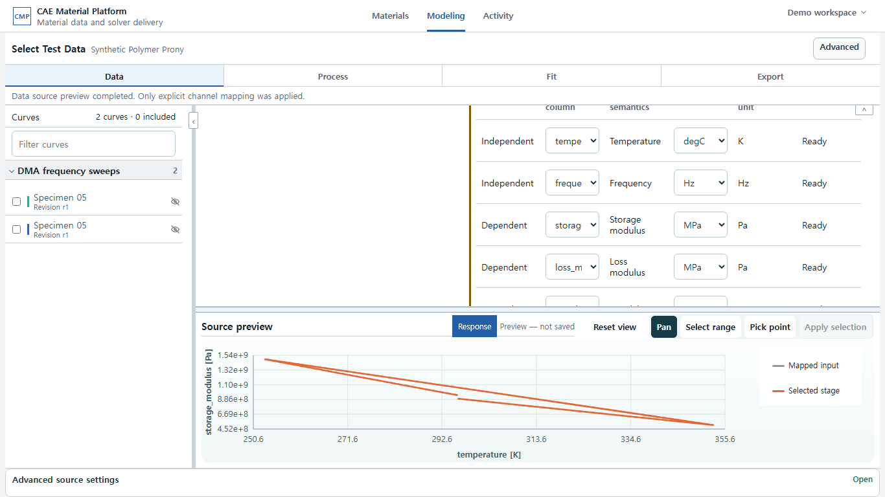 | 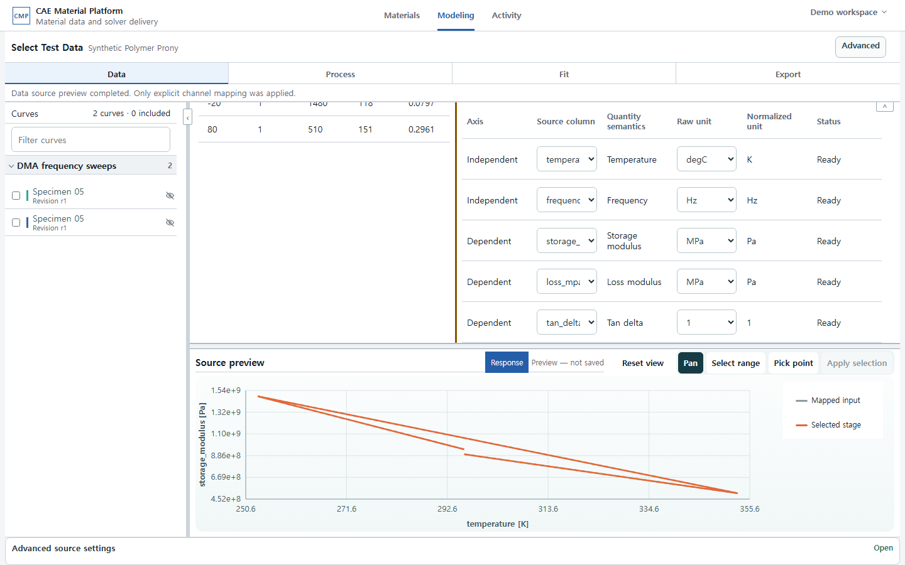 | 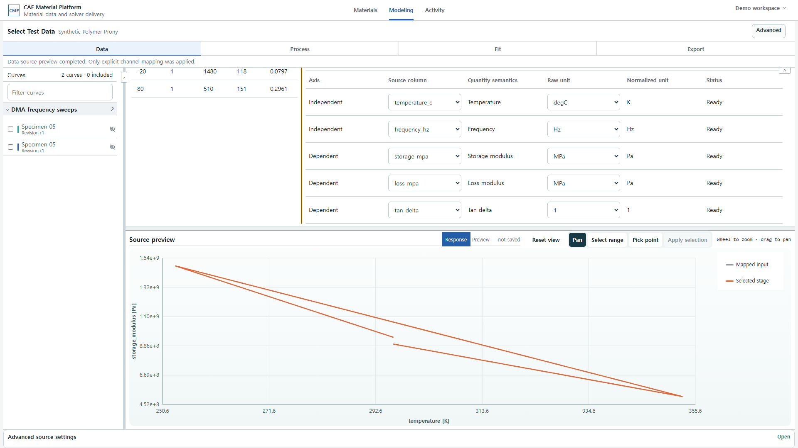 |
| DMA whole-file rejection | 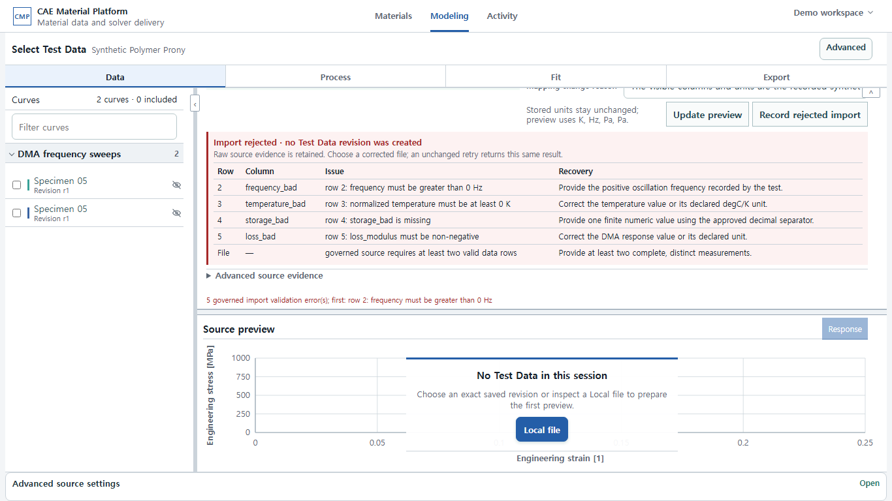 | 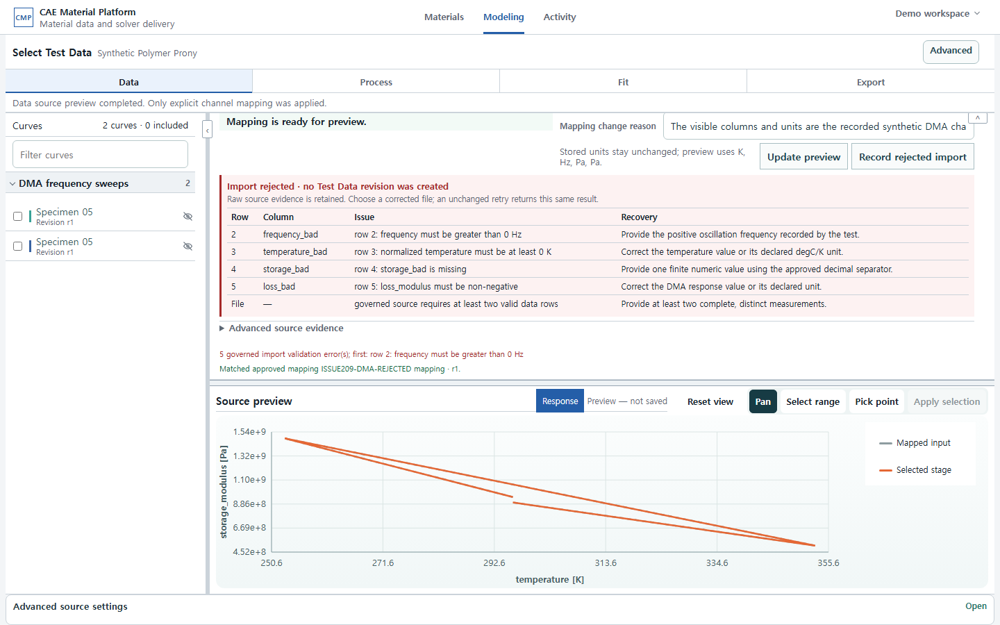 | 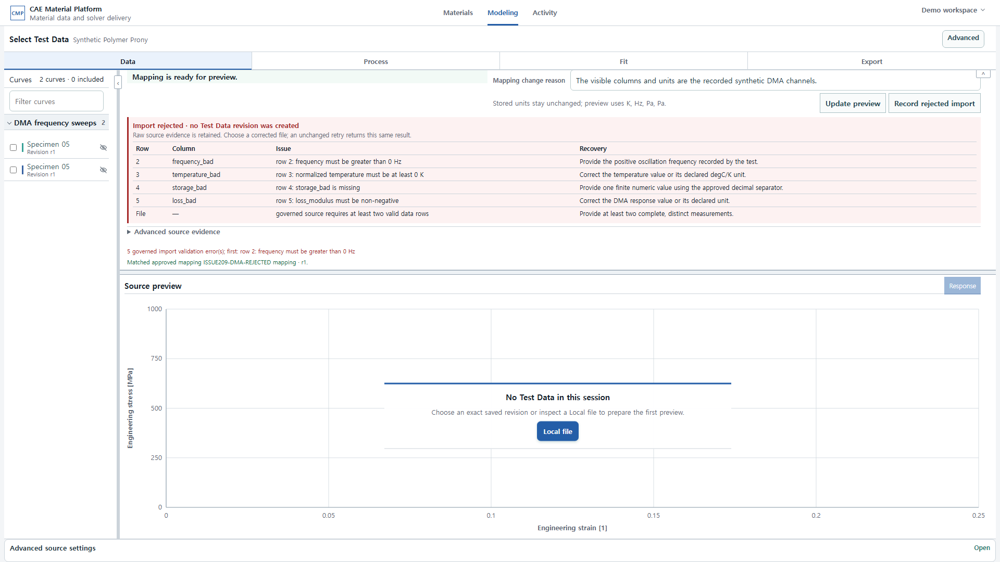 |
| FLD 저장·read-back | 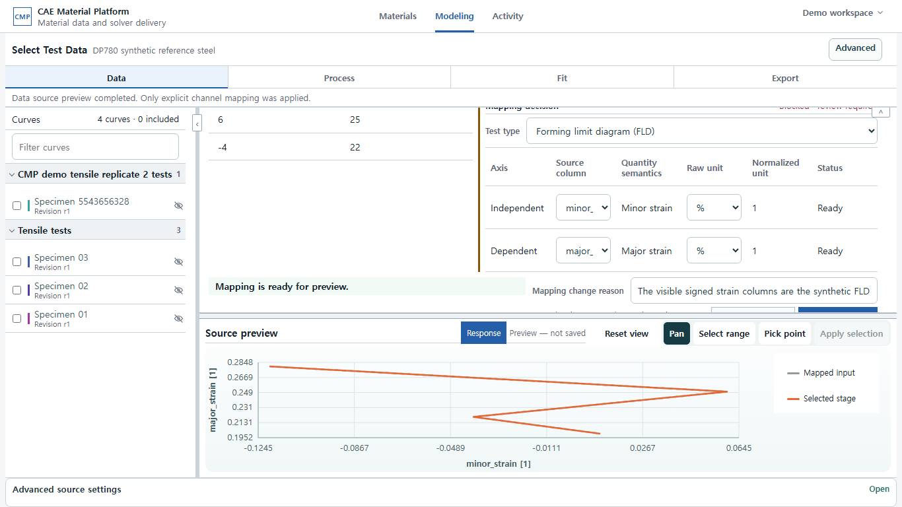 | 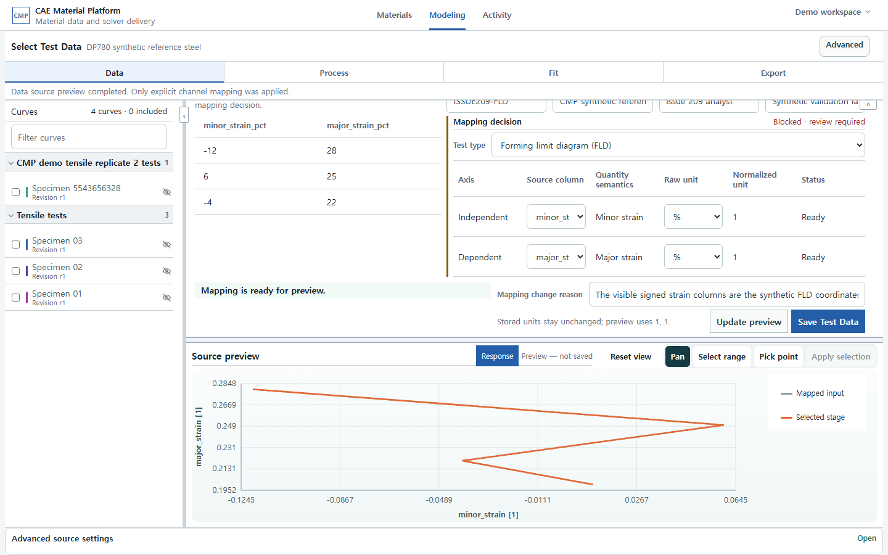 | 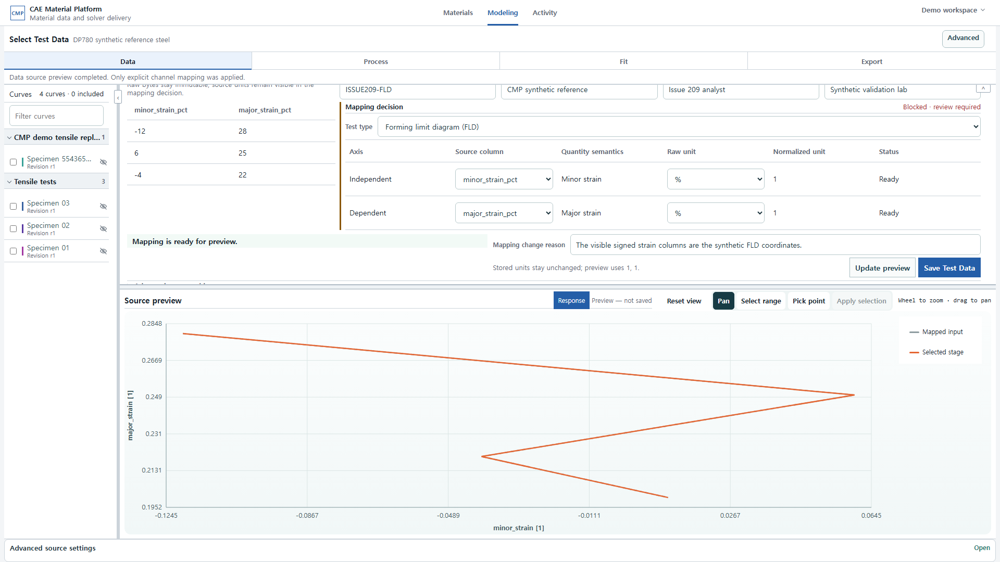 |

| 상태 | 2560×1440 | 3840×2160 |
| --- | --- | --- |
| DMA 저장·read-back | 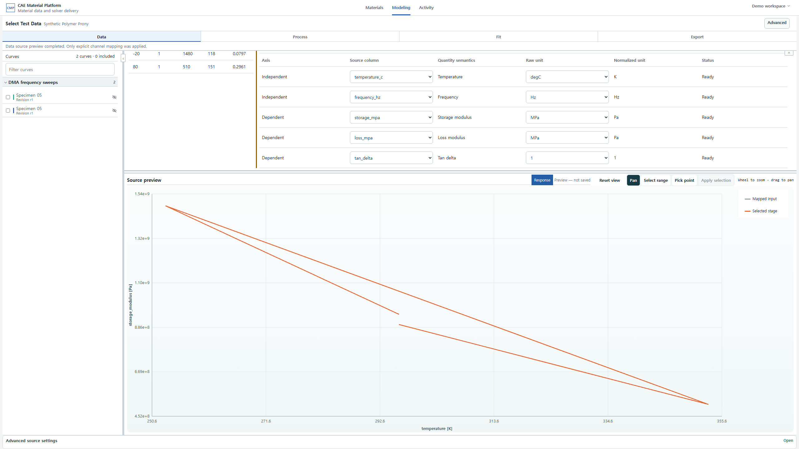 | 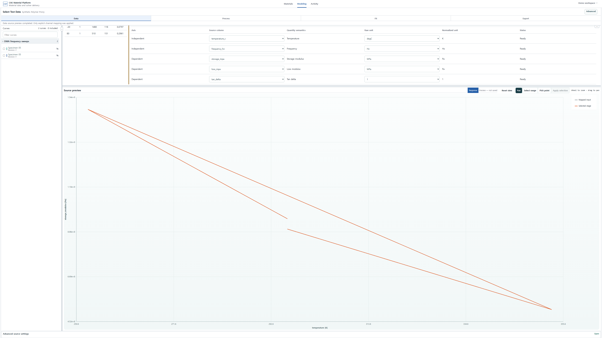 |
| DMA whole-file rejection | 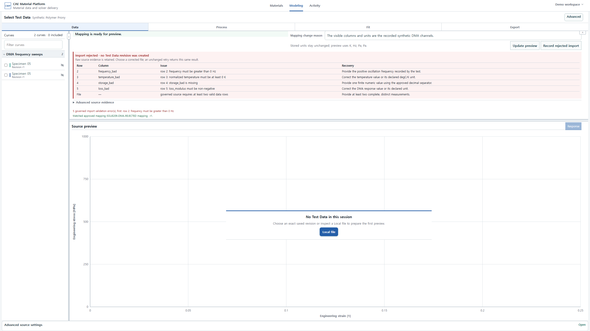 | 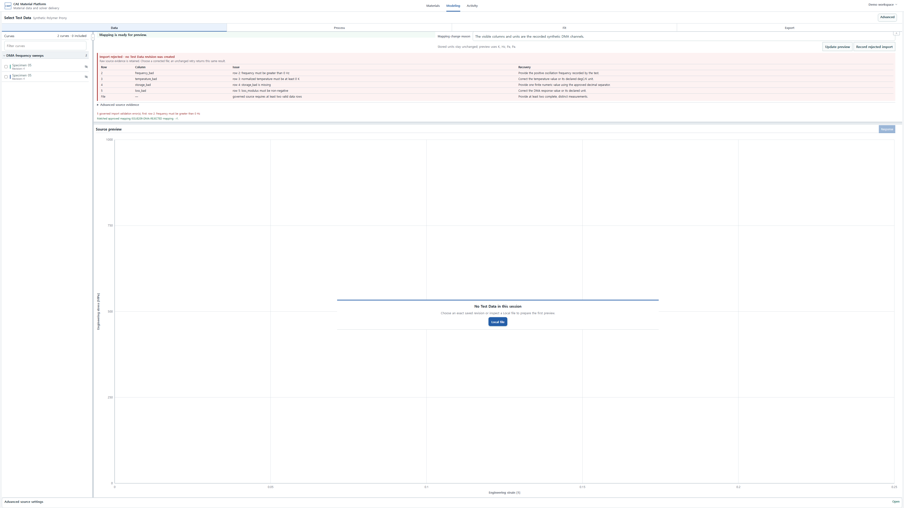 |
| FLD 저장·read-back | 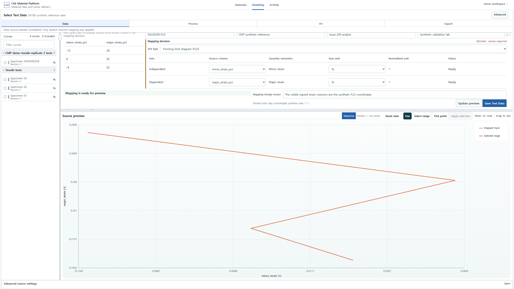 | 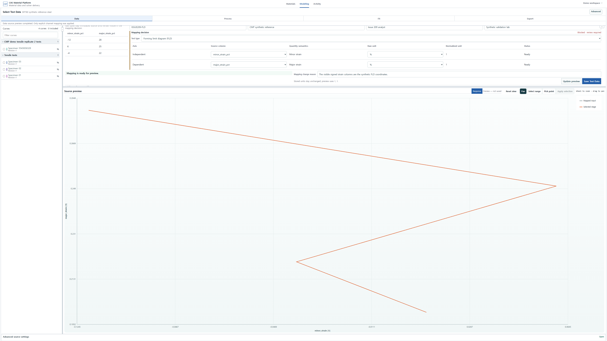 |

## 안전 제한

- XLSX formula, macro, external link는 실행하지 않고 거부합니다.
- 표준 OOXML의 상대(`worksheets/sheet1.xml`)와 절대(`/xl/worksheets/sheet1.xml`) worksheet
  relationship는 둘 다 허용하지만, backslash와 `..` parent traversal은 거부합니다.
- 압축 해제 크기, member 수, row/column 수에는 상한이 있습니다.
- CSV/TSV encoding과 decimal separator를 추측해 조용히 바꾸지 않습니다.
- 다른 organization/project의 Profile, Run, Dataset은 PostgreSQL RLS로 보이지 않습니다.
- 현재 지원 목록 밖의 proprietary laboratory format은 별도 승인된 importer가 필요합니다.

처리 adapter가 이미 승인된 기존 schema의 다음 단계는 normalized Dataset을 Processing/Statistics
또는 Material Model calibration의 exact Selection으로 고정하는 것입니다. **Process**에서는 원본과 선택한 처리 단계를 같은 그래프에서
구분해 보고 **Preview processing**으로 먼저 계산합니다. 검토가 끝난 경우에만 상단의
**Commit reviewed output**으로 immutable Processing Output을 만듭니다. 원본 Dataset에서 outlier
row를 삭제하거나 평균 curve로 대체하지 마십시오.
